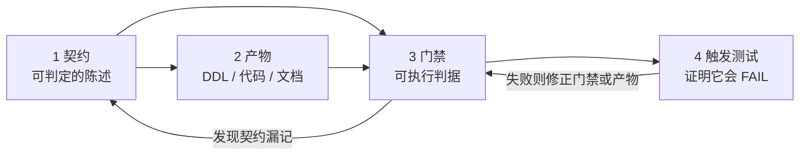

# 开发工作流规范（开工前建立）

> 状态：**2026-09-23 建立**。本文件是手写产物，可自由编辑。
> 适用对象：本仓库后续的所有人类与 Agent 贡献者。
>
> 为什么在「还没有一行代码」的时候就要写这个：本仓库的产物是给**多个 Agent 并行开发**用的
> 契约与 DDL。没有统一工作流，漂移是必然事件而不是可能事件 —— 而且它已经真实发生过一次
> （见 §3.6 的 16 vs 12）。

---

## 1. 核心模型：产物四件套

任何一项交付物都必须同时具备四件东西。**缺任何一件，它的「绿」都不成立。**

| # | 件 | 是什么 | 缺了会怎样 |
|---|---|---|---|
| 1 | **契约** | 人的意图，可判定的陈述 | 没人在给标准，两个 Agent 各自发明 |
| 2 | **产物** | DDL / 代码 / 文档，实现那件事 | 契约只是愿望 |
| 3 | **门禁** | 可执行判据，把契约和产物对起来 | 漂移只能靠肉眼发现，等于发现不了 |
| 4 | **触发测试** | 构造注定失败的输入，证明门禁真的会 FAIL | 门禁可能是个永远打印 PASS 的壳 |



**为什么第 4 件不能省**：本项目已经有一个门禁在「自测」时暴露出自己的真 bug ——
`tools/run_all_gates.py` 的自测抓到 `evaluate()` 返回 dict 却被当作二元组解包，
于是「自测失败必须判 FAIL」这条分支**从未被执行**，门禁却报 ok=True。
如果只跑「全绿」，这个洞会一直存在。

## 2. TDD 流程

### 2.1 「红」的来源：不要自己编测试用例

当前阶段没有代码，TDD 的对象是**契约里的可判定陈述**。红色测试的三个权威来源：

| 来源 | 可判定陈述的例子 | 变成什么红 |
|---|---|---|
| 契约的测试要求表 | §3.10 类章节列出的「必须被测到的行为」 | 一条会失败的测试 |
| `db/*.sql` 的 CHECK 约束 | `announce_date >= period_end` | 一条插入非法值必须被拒的测试 |
| 契约的类型/签名定义 | `DataCenter.as_of()` 是 `DataFeed` 的唯一生产者 | 一条「绕过 as_of 取数必须报错」的测试 |

**反过来说**：每个 `CHECK` 约束、每个「必须/禁止」句式，都是一条**尚未被写出来的红**。
这也是 §3.6 那个漂移之所以严重的原因 —— 漏记的 4 条约束，**永远不会有人为它们写测试**。

### 2.2 循环

1. **摘一条可判定的陈述**，写成一个当前会失败的测试。
2. **跑它，确认它因为正确的原因失败** —— 必须是断言失败，不能是 `ImportError` /
   `AttributeError` / 语法错。因为后者失败时你并没有在测那件事。
3. **写最小实现让它变绿**。不要顺手加契约没要求的功能。
4. **重构**，保持绿。
5. **若这次改动新增/修改了约束**：同步更新门禁 + 补一条触发测试（四件套）。

### 2.3 反模式

- **先写实现再补测试**。补出来的测试只会「证实」实现，不会发现实现错了。
- **测「没崩溃」而不是「值正确」**。`assert result is not None` 是零信息断言。
- **一个测试断言多件事**。失败时分不清哪条坏了，得逐个二分。
- **测试依赖执行顺序或共享可变状态**。单独跑绿、一起跑红。
- **为了让它绿而放宽断言**（尤其是浮点比较和「近似相等」的容差）。

## 3. 漂移控制

### 3.1 四类漂移，第四类最危险

| 类 | 形态 | 危害 |
|---|---|---|
| D1 | 契约有、产物没有 | 漏实现，通常能在联调时发现 |
| D2 | 产物有、契约没有 | 漏记。**已真实发生**：DDL 16 条 CHECK，契约只记 12 条 |
| D3 | 两边都有但**语义不同** | **最危险**：不报错、不崩溃，静默算错。例：`volume` 是股还是手、`roe` 是 0~1 还是百分数 |
| D4 | 文档内部引用漂移 | 改一处，全文的 `L###` / 「第 N 行」全部失效 |

D3 的判据：**单位、口径、边界、谁生产/谁消费**。这四样任何一样没写清，就是 D3 的温床。

### 3.2 门禁必须双向

单向门禁只能抓一半。`tools/verify_data_center.py` 的做法是标准答案：

| 检查 | 方向 | 抓到的漂移类 |
|---|---|---|
| C2 | 契约 → DDL：契约列的每条约束都要在 DDL 里存在 | D1 |
| C3 | DDL → 契约：DDL 写的每条约束都要在契约里有记载 | **D2** |
| C4 | 约束必须落在真实的 `CREATE TABLE` 体内（不是注释、不是游离行） | 门禁自欺 |
| C5 | 不许出现 MySQL 残留 | 迁移漂移 |

只做 C2 的门禁会全绿通过那个 16 vs 12 —— 因为漏记的 4 条在契约侧根本不存在，
C2 无从比较。**写单向门禁时要问自己：反方向的错误谁来抓？**

### 3.3 对称棘轮（tier-B 欠账）

今天还不上的欠账（如 B7）不要求门禁退出码为 0，但**必须锁死发现数**：

| 情形 | 判定 | 为什么 |
|---|---|---|
| `actual == baseline` | PASS | 欠账没动 |
| `actual > baseline` | **FAIL** | 有人引入了新缺陷 |
| `actual < baseline` | **FAIL** | 改进被静默吸收 —— 必须**手工**改小基线并写明原因，否则这个数字从此不再指向任何东西 |
| 总数相同、构成不同 | **FAIL** | 一种缺陷被换成了另一种 |
| 基线说还有欠账，门禁却退出 0 | **FAIL** | 基线和门禁互相矛盾，必有一个是坏的 |

### 3.4 绝不自动写基线

`tools/gates-baseline.json` **没有** `--write-baseline` 开关，这是刻意设计。
理由：任何回归都可以用「重跑一次 harness」吸收掉，正是本项目反复踩的假门禁。
基线只能手工改，且**只填实测值，不填估算值**。

> 实测记录（2026-09-23）：`core-contract-refs` 基线 total=39（T1=2 不可解析块 / T2=19 未定义类型 /
> T3=18 未定义异常），命令 `python tools/run_all_gates.py` 后统计 `tools/gates-report.txt` 内的
> `FINDING [Tx]` 行得到。写进基线前曾误填过估算值 35，已按「基线只能是实测值」自查修正。

### 3.5 触发测试的三个硬要求

1. **必须真的构造失败输入**。只跑全绿等于没测。
2. **一个探测器一个样本**。若检查项串联且前置项会 `return`/`raise`，只测一个坏样本会让
   后面几项根本没跑却看不出来。样本至少三类：
   ① 触发第 1 项的 ② 触发第 2~N 项的 ③ **期望 0 报错的干净样本**（防误报）。
3. **提取为空必须判 FAIL**。校验器普遍是「先提取、再逐项检查」；一旦提取正则失配，
   所有探测器都在空转，却打印「0 问题 PASS」—— 这是比真失败更隐蔽的假绿。
   每个提取结果后面都要跟一条硬守卫。

### 3.6 真实案例（请勿重犯）

**案例一：漏记 4 条约束（D2）**。`db/data_center.sql` 写了 16 条 CHECK，而契约 §3.6.1 只列了 12 条。
门禁 `C3` 报 FAIL 后**补齐契约**（而不是放宽检查），现为 16/16 双向对齐。
教训：漏记的约束不会有人为它写触发测试。

**案例二：门禁自己解析错了（假 FAIL）**。`run_all_gates.py` 的 verdict 正则硬编码了
`(0 issue(s))` 形式，而 md 门禁打印 `(total missing=0)`，于是把一个健康门禁判成 FAIL。
教训：**门禁也会漂移**，解析别的门禁的输出同样是契约，也要有正样本。
修法是接受两种措辞，并补一条 `A-alt-count-phrasing` 正样本。

**案例三：门禁自己崩了（GBK）**。门禁描述里的 `↔`（U+2194）不在 GBK 字符集内，
cp936 控制台打印时抛 `UnicodeEncodeError`，**整张结果表连同结论一起丢失**。
教训：门禁不能死在装饰性字符上。修法：`sys.stdout.reconfigure(errors='replace')` + 避开非 GBK 字符。

**案例四：门禁自测的分支被跳过**。合成样本写 `'selftest': []`，而判断用的是
`if gate.get('selftest'):` —— 空列表是 falsy，「自测失败必须判 FAIL」整段被跳过。
教训：**用 `is not None` 而不是真值判断**；并让 `main()` 直接拒绝没有自测的门禁。

**案例五：把「读法错」当成「写错了」（差点改坏一个正确文件）**。
报告里出现 `鏅鸿兘閲忓寲...`，第一反应是 harness 的管道编码 bug。实际上文件一直是正确的 UTF-8，
是 PowerShell 裸 `Get-Content` 按 **GBK** 解码导致的**显示**乱码（同一文件用 `read_file` 读完全正常）。
同一次排查里还有一段**真** bug：管道下子进程默认写 GBK 而 harness 按 UTF-8 解，中文路径变 `����`。
两个症状长得几乎一样，根因却相反。
教训：**证据看起来坏了，先验读法，再改写方。** 用 `Get-Content -Encoding utf8` / `read_file` 复核，
确认文件字节真的错了再动手。

**案例六：`↔` 会直接杀死子进程，不只是弄花输出**。移除 `-X utf8` 后的触发测试发现，子进程不是
「写错编码」，而是抛 `UnicodeEncodeError: 'gbk' codec can't encode character '\u2194'` 直接死掉 ——
一份门禁报告可能**整个丢失**而不是轻微乱码。修法：子进程也用 `-X utf8`（它不能被环境变量覆盖），
并保留 U+2194 作为往返探针字符。
代价：一次**去掉修复**的破坏性触发测试（改完立即恢复），换到「这条控制组真的会 FAIL」的实证。

**案例七：两边各自都绿 ≠ 接起来能跑（I2 S3 后半，2026-09-24）**。I2 分两半落地：前半是落库侧（`PgBarStore` / `PgBarIngestor`，29 条用例），后半是引擎改读 `DataCenter.as_of()` 产出的 feed。两半的门禁各自全绿，**接缝上一行都没跑过**。补上 10 条端到端用例，第一次红当场咬出 **3 个真缺陷**：① 存储层交出来的数值是 `Decimal`（落库侧用例**特意**断言了 `isinstance(bar.close, Decimal)`，因为相等性要精确），而契约 §2.1.1 的 `BarData` 字段是 `float` ⇒ 第一次信号计算就是 `float // Decimal` → `TypeError`，还被包成 `BacktestExecutionError` 抛在引擎深处；② `_execute` 先调 `validate_no_leakage()` 再挂 `self._result`，而那个方法在 `_result is None` 时返回「尚未执行回测」的空壳（`is_valid=True`、`row_count=0`）⇒ **每一份报告的未来函数检查都是必然通过的空转**，直接调该方法的单元用例查不出来（那时 `_result` 已经在了）；③ 报告里的 `data_version` 用的是 `os.path.basename(feed.csv_path)`，而 `DbDataFeed` 根本没有 `csv_path` ⇒ 标出来的是 K 线条数（`'600000.SH::35'`），且两份**不同版本、条数相同**的数据会标成同一个字符串。
教训：**每个判据都要有一条端到端控制组**；两个都绿的分层各自持有自己的假绿。旁证：修复后的快照重录时，`.rounds/i1/*.json` 里的 `validation_report` 从 `row_count=0` + `warnings=["尚未执行回测…"]` 变成 `row_count=3` + `warnings=[]` —— **过期快照本身就把缺陷写在脸上**，只是 `"is_valid": true` 让人不去看第二眼。

**案例八：符号 bug 不会让老用例变红，只会让新接上来的那层「莫名拒绝」（I3，2026-09-24）**。
`BacktestEngine._strategy_equity()` 把**同一个符号**同时用在现金流与净持仓上（卖出是 `+1`，多头持仓也写成 `+1`），
于是多头持仓在净持仓表里成了负数、浮动市值项被「数量为正」的守卫跳过 ⇒ 满仓瞬间权益算成 `-60.24736001233396`
（实际持有 9700 股、市值 87106）⇒ 回撤观测 `1.0007 > 阈值 1.0000` ⇒ 风控**误熔断** ⇒ 后续订单全被拒。
症状出现在风控层（「第三笔单莫名被拒」），根因却在 I1 的权益口径里。
**为什么老用例没抓到**：I1 的用例只断言收益/成交数**符号之外**的那些值，权益只作为回撤的分母，
负权益与正权益在「无闸门」时不影响任何断言 ⇒ 52 条既有用例全绿。
**为什么这次抓到了**：I3 的第一条判据不是「风控规则算得对」，而是「把六个阈值全放宽到不可触发后，
结果必须与不接闸门**逐字段相同**」。这条**等价性**用例第一次跑就红，把缝钉在了两层的接缝上。
教训：**「两层等价」比「单点断言」值钱得多**；接了新一层，先写「不接时一样」的对照，再写新层的规则用例。
防复发：`tests/test_backtest_risk_gate.py::test_snapshot_equity_counts_floating_value_of_long_position`
在测试内部**独立重算**同一条口径（不从被测代码取值），并配一条变异样本
`M15-risk-equity-sign-regression`（把 `(-cash_sign)` 改回 `cash_sign` 必须让该用例变红）。

### 3.7 引用完整性

- 改了文档的行结构，**必须重新实测**所有 `L###` / 「第 N 行」引用。行号会漂移。
- 引用检查用 **AST**（`tools/verify_contract_refs.py`）而不是 grep。
  grep 会把注释里的同名标识符算进去（假绿），也会漏掉别名导入（假红）。
- 每次改动后重跑 `python tools/run_all_gates.py`，用一条命令拿总判据。

## 4. Token 消耗控制

### 4.1 分层上下文：先读地图，再读章节，最后才读全文

| 层 | 文件 | 规模 | 何时读 |
|---|---|---|---|
| **L0** | `.github/copilot-instructions.md` | 约 1.5 K token，**自动加载** | 每次会话自动进上下文，必须保持极短 |
| **L1** | `CONTEXT.md` | 约 2 K token | 动手前先读，拿到仓库地图与命令行 |
| **L2** | `docs/*.md` 契约全文 | 10 KB ~ 63 KB | **只在需要某一节时读那一节** |
| **L3** | `db/*.sql`、`tools/*.py` | 12 ~ 33 KB | 只读被改动的函数 / 表 |

**实测代价**：`docs/智能量化交易平台-核心模块接口契约文档.md` 63 KB，
`docs/智能量化交易平台-数据中心接口契约文档.md` 48 KB。把 `docs/` 全读一遍是**十几万 token**，
而 90% 的提问只需要其中一节（例如 §3.6 的约束清单）。

> 规则：**不要一次性把 `docs/` 全读进来**。用 `CONTEXT.md` 定位到节号，再按节读取。

### 4.2 不要让工具输出灌进上下文

| 手段 | 做法 |
|---|---|
| 一个命令拿总判据 | `python tools/run_all_gates.py` 打印有界 excerpt，不打印全量 |
| **读报告而不是重跑** | 想看上次结果直接读 `tools/gates-report.txt`（约 30 行），不要为了看结果重跑门禁。它是一份 **UTF-8 无 BOM** 文件，**必须按 UTF-8 读**（`read_file` / 编辑器 / `Get-Content -Encoding utf8`） |
| 只跑一个门禁 | `python tools/run_all_gates.py --gate=NAME` |
| 大输出落盘再按需读 | 命令输出重定向到文件，再用 `read_file` 读需要的行段 |
| 定位用搜索不用通读 | 用 `grep_search` 在单文件里找符号，而不是 `read_file` 整个文件 |
| 改完自查 | 用 `get_errors` 而不是「把整个文件打出来看」 |

### 4.3 命令行的编码纪律（会直接毁掉输出）

- PowerShell 5.1 的 `>` / `*>` 写的是 **UTF-16LE**，不是 UTF-8。要 UTF-8 就用
  `| Out-File -FilePath X -Encoding utf8`。
- 别用 `2>$null` 丢弃 stderr 去换一个「干净的」输出 —— 它会**连 traceback 一起吞掉**，
  于是你看到一个空结果却以为「工具什么也没打印」。要 traceback 就用 `2>&1 | Out-String -Width 200`。
- 含中文的 argv 会被 GBK 破坏。所以 `tools/` 里的脚本一律把中文路径写成 **Python 字面量**，
  使 `python tools/run_all_gates.py` 保持纯 ASCII 即可运行。
- 一旦 stdout 里出现 GBK 之外的字符，Python 会抛 `UnicodeEncodeError`。写输出时避开
  `↔`(U+2194)、`✅`、`❌`，或先 `reconfigure(errors='replace')`。
- **子进程的编码与父进程不一致**：子进程 stdout 接管道时默认用 ANSI 代码页（本机 `gbk`），
  父进程按什么解、子进程该写什么，必须**用字节实测**而不是推断。
  实测证据：`python -c "import subprocess,sys; print(subprocess.run([sys.executable,'-c','import sys;print(sys.stdout.encoding,chr(0x4e2d))'],stdout=subprocess.PIPE).stdout.hex())"`
  → 不给 `-X utf8` 得 `67626b20d6d0...`（gbk + `D6D0`）；给 `-X utf8` 得 `7574662d3820e4b8ad...`（utf-8 + `E4B8AD`）。
  统一用 `-X utf8`（**不能被环境变量覆盖**，比 `PYTHONIOENCODING` 可靠 —— 后者实测不生效）。
- **读 UTF-8 文件不要用裸 `Get-Content`**：PS 5.1 对无 BOM 文件按 GBK 解码，中文显示成 `鏅鸿兘...`。
  这是**读法**问题，不是文件问题。证据看起来坏了时，**先怀疑读法**。同样注意 `grep_search`
  默认跳过被 ignore 的文件，会给出静默的「搜不到」＝假阴性。

### 4.4 数字纪律

**任何进入基线的数字都必须来自一次真实运行，且要能说出是怎么测出来的。**
估算值、印象值、上一版残留值都不行 —— 一个错的基线比没有基线更糟，因为它会
让棘轮朝着错误的方向锁死。

### 4.5 会话节流：把一次性推理沉淀掉

下面每一条都来自一次**实测的浪费**，不是建议清单。分两类：省**读取**的、省**往返**的。

| 实测到的浪费 | 代价 | 做法 |
|---|---|---|
| 启动时整读 `CONTEXT.md`（236 行）**再**整读 `docs/迭代计划.md`（175 行），其中约 6 成是 `CONTEXT.md` 已经索引过的重复信息 | 约 1 万 token / 轮 | 启动**只读 `CONTEXT.md`**；要某一份的细节时用下面的「标题定位」只取标题行，再按行段 `read_file` |
| 会话备忘里的「待办」已过期（写着某件事未做，实际上早有一个提交做完了），于是又走一遍 `git log -- <文件>` 的探测链 | 3 次工具调用 | 收工时**当场删掉**已结案的条目；「已实测合规」的条目不留着当待办 |
| 为回答「某个文件改到哪一步了」而读**文件本身** | 一个文件的量 | `git log --oneline -3 -- <文件>` 更便宜，而且直接回答「提交没提交」 |
| 读 `tools/gates-report.txt` 全文只为拿一个总判据 | 约 30 行 / 轮 | 只取末行 `verdict`；红了才去读红的那几行 |

**标题定位命令**（纯标准库；先定位到节号，再读那一节，别整读大文件）：

```powershell
.\.venv\Scripts\python.exe -X utf8 -c "import io,sys;s=io.open(sys.argv[1],encoding='utf-8-sig').read().replace('\r\n','\n').split('\n');[print(i+1,l[:90]) for i,l in enumerate(s) if l.startswith('#')]" docs/智能量化交易平台-数据中心接口契约文档.md
```

1355 行的数据中心契约用这条命令只输出 40 行标题 —— 这就是 §4.1「按节读取」的落地手法。

**提交粒度：子步 vs 迭代边界**（2026-09-24 实测出边界在哪）

- 迭代**边界**（例如 I2 收工）：全套 —— 刷 `tools/gates-report.txt` 与 `tools/ci-dryrun-report.txt`，
  每份快照**自成提交**，文档四处回填，再推 GitHub 等一次真跑。
- 迭代**子步**（S1 / S2 / S3 这类）：可以走轻量 —— 一份变更集提交即可。**不刷这两份快照不会让任何门禁变红**：
  `R5-EVIDENCE-CURRENT` 只比对 `EVIDENCE_PLAN` 里那 3 份 `.rounds/i1/*.json`
  （`tools/verify_backtest_reproducibility.py:94`），跟这两份报告无关。
- ⚠️ 等价条件是**引用纪律**：`ci-dryrun-report.txt` 的抬头写死了 `commit:` 与 `dirty:`，它只对**它自己那次运行**成立
  ⇒ 不刷新不等于过期，但文档里**不得**把它当成「当前最新证据」来引。

**不可省的部分**（节流不是偷工）：TDD 的第 2 步必须红、每个门禁的 `--selftest`、变异样本的自 assert、
「提取为空判 FAIL」的守卫、改完文档重测行号引用 —— 这些是**判据本身**，
省掉它们省的不是 token 而是可信度。降税只降「搬运与重复核验」，不降「检查」。

## 5. 红线清单

- ❌ **绝不为了通过而削弱检查**。门禁报错时改产物或改检查器，**不改判据**。
- ❌ **不用终端整文件改写源文件**。PS 5.1 按 GBK 落盘会把中文注释变成乱码；
  本仓库自 2026-09-23 起是 git 仓库（`main`，基线提交 `053f620`），但**提交粒度是整轮**
  （一次提交可能横跨十几个文件），所以 `git checkout -- <file>` 只能退回上一轮的状态，
  中间的手工编辑会跟着丢。改源码一律用编辑工具；真被写坏就还原那个文件后重做编辑。
- ❌ **不原地修改 `.docx` 派生的 `.md`**。重新转换会覆盖，且会触发 md-fidelity 门禁失败。
  只能在已有段落**之后追加**。
- ❌ **不往 `tools/` 引入第三方依赖**。当前全部只用标准库。
- ❌ **不手工填基线、不自动写基线**。
- ❌ **不说「约束已验证」**。正确说法只有一种：**在哪个镜像上、什么时候跑过、结果多少**。
  2026-09-23 先在容器 `postgres:17`（PostgreSQL 17.11）上执行过一轮：风控 23/23、
  数据中心 42/42（证据 `tools/sql-smoke-report.txt`）；2026-09-24 又用 `--report=` 另存快照的方式
  在 `postgres:14`(14.24) / `15`(15.18) / `16`(16.15) 上各跑一遍，结果同样是风控 23/23、
  数据中心 42/42（证据 `tools/sql-smoke-report-pg1{4,5,6}.txt`，四份互不覆盖）。
  那也只证明了**这四个 tag**，DDL 标题里的「PostgreSQL 14+」仍未证实（逐条证伪 31/31 更是
  **只在 `postgres:17` 上做过**）；且改过任何 `db/*.sql` 后那轮就作废。
  禁止的说法：无版本限制的「约束已验证」、或拿单次绿灯去支撑多版本声称。
- ❌ **不把「只跑全绿」当作门禁有效的证据**。

## 6. 一次改动的完整清单

```
[ ] 1. 读 CONTEXT.md 定位，而不是通读 docs/
[ ] 2. 确认改的是哪一类文件：
       docx 派生 md  -> 只能追加，不能原地改
       手写 md       -> 可自由编辑
       db/*.sql      -> 改完必须同步契约里的约束清单
       tools/*.py    -> 只用标准库
[ ] 3. 契约先行：先更新可判定的陈述，再改产物
[ ] 4. 产物与契约双向对齐（D1 与 D2 都要查）
[ ] 5. 新增/修改约束 -> 更新门禁
[ ] 6. 新增/修改门禁 -> 补触发测试（含一个期望 0 报错的干净样本）
[ ] 7. 改过文档行结构 -> 重新实测所有行号引用
[ ] 8. python tools/run_all_gates.py   （一条命令拿总判据）
[ ] 9. 若有 tier-B 欠账下降 -> 手工改小 gates-baseline.json 并写明原因
[ ] 10. 新增产物后，回填 CONTEXT.md 的地图与本节清单
```

## 7. 尚未建立的东西（诚实清单）

本规范描述了「应该有」的流程。以下部分目前**还没有对应实现**，不要误以为已具备：

| 缺口 | 现状 |
|---|---|
| 单元测试框架 | ✅ **已建立并转过一圈**（2026-09-23）：`.venv` + pytest 9.1.1，`tests/test_skeleton.py` 3 条骨架自检 + `tests/test_backtest_slice.py` 22 条业务断言，实测 `25 passed`（退出码 0），骨架由 `skeleton` 门禁守位。（**条数一律现取** `python -m pytest -q`：2026-09-24 I2 S3 后半实测 **114 passed** = 骨架 3 + 竖切 22 + PIT 18 + 适配器 32 + 落库侧 29 + 端到端接线 10，行内那 25 条是 I1 当时的历史快照。）⚠️ 但这 22 条**没有红→绿的 git 证据**（实现先于测试写的）—— 替代证据是 `tools/pytest_mutation_check.py`：把实现逐处改坏，**21 变异 / 21 CAUGHT + 3 控制变异 + 1 ENV-LIMIT**（基线三套件共 `passed=61`，2026-09-24 I2 S3 后半实测），证据 `tools/pytest-mutation-report.txt`；变异报告现覆盖**三个套件**（竖切 22 + 落库侧 29 + 端到端接线 10），**PIT 的 18 条与适配器的 32 条仍没有同类证据**。**仍缺**：覆盖率门禁（见下行），以及「先写测试再写实现」的真实往返样本 |
| 触发测试的执行 | ✅ **已跑通，并已扩成版本阶梯**（2026-09-23 首跑，2026-09-24 补梯）：`tools/run_sql_smoke.py` 用 `docker-compose.smoke.yml` 起一次性容器 PostgreSQL，依次执行 DDL + 触发测试 ⇒ 风控 **23 passed / 0 failed**、数据中心 **42 passed / 0 failed**。2026-09-24 新增 `--report=PATH`（**fail-closed**：路径不可写就不写、绝不退回默认路径，否则会把上一版快照覆盖掉），在 `postgres:14`(14.24) / `15`(15.18) / `16`(16.15) 上各跑一次，得到完全相同的 23/0 与 42/0；证据四份 `tools/sql-smoke-report-pg1{4,5,6}.txt` + `tools/sql-smoke-report.txt`（均含 digest）。并用 `tools/falsify_smoke.py` 证伪了这两份绿：**逐条**放宽一条 `CHECK` 的表达式（不删约束）⇒ 要求恰好一条样本变红（风控变 22/1、数据中心变 41/1）。覆盖率 **31 案例 / 30 条命名 CHECK，31/31 CAUGHT**（证据 `tools/falsify-report.txt`）。**仍未覆盖**：逐条证伪只在 `postgres:17` 上做过（另三个镜像只有冒烟层面的通过）；非 CHECK 的 3 个守门（两个 NOT NULL + 部分唯一索引）不在证伪范围内，靠 `C7` 核对 |
| CI | ✅ **已在 GitHub 上真跑**（2026-09-24）：`.github/workflows/ci.yml` 已落盘（只跑 `pytest` + `run_all_gates.py` 两条，不得加 `|| true`），仓库推上 GitHub（公开，remote `origin`）后首次真跑——**当场判红**：`skeleton` 门禁抓到 `CONTEXT.md` 里的 `.venv/` 在克隆里不存在（本机存在）⇒ 判据依赖环境，已修并补触发样本，修复后第二次运行 **success**（2026-09-24，run 35939823649）。⚠️ 「跑过」不等于「跑通」：本机口径的等价证据仍是 `tools/ci-dryrun-report.txt`（含两次红→绿往返），两者不能互相替代。门禁目前仍是「手工一条命令」，VS Code 一键任务见第 14 项 |
| 覆盖率门禁 | 不存在 |
| PostgreSQL 实例 | 本机没有本地实例（`psql` 不在 PATH），但 **Docker Desktop 自带一个可用通道**：`tools/run_sql_smoke.py` 起容器 PostgreSQL 跑 DDL + 触发测试（跑完 `down -v` 销毁）。容器通道是**目前唯一**能证明「约束真的会拒绝」的手段 |
| 行号引用自动校验 | 不存在，目前靠人工重测 |
| 文档**状态陈述**漂移（地图 vs 实现） | ⚠️ **部分建立**（2026-09-23）：`skeleton` 门禁上挂了三个探测器 —— `GATE-COUNT`（文档里不得写死不带日期的门禁数量）、`IMPL-STATUS`（实现已存在时不得再说「没有任何实现」，措辞表 6 条变体）、`MAP-PATHS`（`CONTEXT.md` 里的文件引用必须真实存在，含空转守卫），各带触发样本与「期望 0 报错」的干净样本。**覆盖面是实测出来的**：`IMPL-STATUS` 管 `CONTEXT.md` / `pyproject.toml` / `quanauto/__init__.py` 三处；`MAP-PATHS` **只管 `CONTEXT.md`** —— 实测扫 `docs/*.md` 会得到 `Asia/Shanghai` / `effective_from/effective_to` 这类时区与字段对假阳性，外加 50 多条 `DataCenter.as_of()`、`0.10`、`common.proto` 之类的裸 token 假阳性，所以没那么做，`docs/*.md` 那几份仍靠人工守。设计上是**只禁会过期的措辞**、不去比数字：比数字会逼着 `skeleton` 去解析 `run_all_gates.py` 的注册表（门禁解析门禁 = 新的漂移源）。⚠️ 这三个探测器都只管**结构**：2026-09-23 实测把「撮合」误写成形近字并提交，9 个探测器全绿 —— 改中文文案后必须回读核对，门禁帮不上忙。 |
