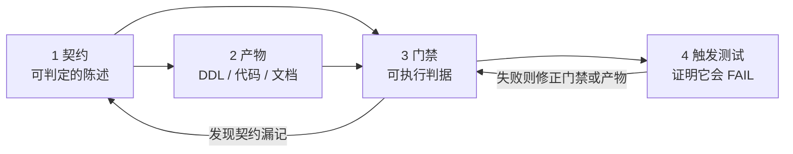

# 开发工作流规范（开工前建立）

> 状态：**2026-09-23 建立**。本文件是手写产物，可自由编辑。
> 适用对象：本仓库后续的所有人类与 Agent 贡献者。
>
> 为什么在「还没有一行代码」的时候就要写这个：本仓库的产物是给**多个 Agent 并行开发**用的
> 契约与 DDL。没有统一工作流，漂移是必然事件而不是可能事件 —— 而且它已经真实发生过一次
> （见 §3.6 的 16 vs 12）。

---

## 1. 核心模型：产物四件套

任何一项交付物都必须同时具备四件东西。**缺任何一件，它的「绿」都不成立。**

| # | 件 | 是什么 | 缺了会怎样 |
|---|---|---|---|
| 1 | **契约** | 人的意图，可判定的陈述 | 没人在给标准，两个 Agent 各自发明 |
| 2 | **产物** | DDL / 代码 / 文档，实现那件事 | 契约只是愿望 |
| 3 | **门禁** | 可执行判据，把契约和产物对起来 | 漂移只能靠肉眼发现，等于发现不了 |
| 4 | **触发测试** | 构造注定失败的输入，证明门禁真的会 FAIL | 门禁可能是个永远打印 PASS 的壳 |


```mermaid
flowchart LR
    A["1 契约<br/>可判定的陈述"] --> B["2 产物<br/>DDL / 代码 / 文档"]
    A --> C["3 门禁<br/>可执行判据"]
    B --> C
    C --> D["4 触发测试<br/>证明它会 FAIL"]
    D -->|失败则修正门禁或产物| C
    C -->|发现契约漏记| A
```

**为什么第 4 件不能省**：本项目已经有一个门禁在「自测」时暴露出自己的真 bug ——
`tools/run_all_gates.py` 的自测抓到 `evaluate()` 返回 dict 却被当作二元组解包，
于是「自测失败必须判 FAIL」这条分支**从未被执行**，门禁却报 ok=True。
如果只跑「全绿」，这个洞会一直存在。

## 2. TDD 流程

### 2.1 「红」的来源：不要自己编测试用例

当前阶段没有代码，TDD 的对象是**契约里的可判定陈述**。红色测试的三个权威来源：

| 来源 | 可判定陈述的例子 | 变成什么红 |
|---|---|---|
| 契约的测试要求表 | §3.10 类章节列出的「必须被测到的行为」 | 一条会失败的测试 |
| `db/*.sql` 的 CHECK 约束 | `announce_date >= period_end` | 一条插入非法值必须被拒的测试 |
| 契约的类型/签名定义 | `DataCenter.as_of()` 是 `DataFeed` 的唯一生产者 | 一条「绕过 as_of 取数必须报错」的测试 |

**反过来说**：每个 `CHECK` 约束、每个「必须/禁止」句式，都是一条**尚未被写出来的红**。
这也是 §3.6 那个漂移之所以严重的原因 —— 漏记的 4 条约束，**永远不会有人为它们写测试**。

### 2.2 循环

1. **摘一条可判定的陈述**，写成一个当前会失败的测试。
2. **跑它，确认它因为正确的原因失败** —— 必须是断言失败，不能是 `ImportError` /
   `AttributeError` / 语法错。因为后者失败时你并没有在测那件事。
3. **写最小实现让它变绿**。不要顺手加契约没要求的功能。
4. **重构**，保持绿。
5. **若这次改动新增/修改了约束**：同步更新门禁 + 补一条触发测试（四件套）。

### 2.3 反模式

- **先写实现再补测试**。补出来的测试只会「证实」实现，不会发现实现错了。
- **测「没崩溃」而不是「值正确」**。`assert result is not None` 是零信息断言。
- **一个测试断言多件事**。失败时分不清哪条坏了，得逐个二分。
- **测试依赖执行顺序或共享可变状态**。单独跑绿、一起跑红。
- **为了让它绿而放宽断言**（尤其是浮点比较和「近似相等」的容差）。

## 3. 漂移控制

### 3.1 四类漂移，第四类最危险

| 类 | 形态 | 危害 |
|---|---|---|
| D1 | 契约有、产物没有 | 漏实现，通常能在联调时发现 |
| D2 | 产物有、契约没有 | 漏记。**已真实发生**：DDL 16 条 CHECK，契约只记 12 条 |
| D3 | 两边都有但**语义不同** | **最危险**：不报错、不崩溃，静默算错。例：`volume` 是股还是手、`roe` 是 0~1 还是百分数 |
| D4 | 文档内部引用漂移 | 改一处，全文的 `L###` / 「第 N 行」全部失效 |

D3 的判据：**单位、口径、边界、谁生产/谁消费**。这四样任何一样没写清，就是 D3 的温床。

### 3.2 门禁必须双向

单向门禁只能抓一半。`tools/verify_data_center.py` 的做法是标准答案：

| 检查 | 方向 | 抓到的漂移类 |
|---|---|---|
| C2 | 契约 → DDL：契约列的每条约束都要在 DDL 里存在 | D1 |
| C3 | DDL → 契约：DDL 写的每条约束都要在契约里有记载 | **D2** |
| C4 | 约束必须落在真实的 `CREATE TABLE` 体内（不是注释、不是游离行） | 门禁自欺 |
| C5 | 不许出现 MySQL 残留 | 迁移漂移 |

只做 C2 的门禁会全绿通过那个 16 vs 12 —— 因为漏记的 4 条在契约侧根本不存在，
C2 无从比较。**写单向门禁时要问自己：反方向的错误谁来抓？**

### 3.3 对称棘轮（tier-B 欠账）

今天还不上的欠账（如 B7）不要求门禁退出码为 0，但**必须锁死发现数**：

| 情形 | 判定 | 为什么 |
|---|---|---|
| `actual == baseline` | PASS | 欠账没动 |
| `actual > baseline` | **FAIL** | 有人引入了新缺陷 |
| `actual < baseline` | **FAIL** | 改进被静默吸收 —— 必须**手工**改小基线并写明原因，否则这个数字从此不再指向任何东西 |
| 总数相同、构成不同 | **FAIL** | 一种缺陷被换成了另一种 |
| 基线说还有欠账，门禁却退出 0 | **FAIL** | 基线和门禁互相矛盾，必有一个是坏的 |

### 3.4 绝不自动写基线

`tools/gates-baseline.json` **没有** `--write-baseline` 开关，这是刻意设计。
理由：任何回归都可以用「重跑一次 harness」吸收掉，正是本项目反复踩的假门禁。
基线只能手工改，且**只填实测值，不填估算值**。

> 实测记录（2026-09-23）：`core-contract-refs` 基线 total=39（T1=2 不可解析块 / T2=19 未定义类型 /
> T3=18 未定义异常），命令 `python tools/run_all_gates.py` 后统计 `tools/gates-report.txt` 内的
> `FINDING [Tx]` 行得到。写进基线前曾误填过估算值 35，已按「基线只能是实测值」自查修正。
>
> **续录（2026-09-25）：这条基线已经动过一次，就是本节那条规则的正例。** B7 还债后实测
> total=**2**（`T1=2` / `T2=0` / `T3=0`），改动是**手工**改的 `total` + `detail` 两个字段，
> 同步刷新了 `measured` / `measured_by` / `note`（note 里写明「上一版是 39、本次按实测改小、不是估算」）。
> 动手之前先跑一次看到的是 **`DRIFT-`**（棘轮自己喊「debt shrank 39 -> 2: lower the baseline … 
> by hand」）—— 也就是说，**忘了改基线时它是红的，不会静默吸收这次改进**。
> ⚠️ 两个连带的坑：① `total: 0` 的条目**不可用** —— 没有发现时解析出的构成是 `{}`，
> 永远不等于 `{T1: 0}`，会误报 `DRIFT~`（所以剩下的 2 条必须如实记进去）；
> ② 基线只能**手工**改小，`tools/gates-baseline.json` 里没有、也不该有 `--write-baseline`。

### 3.5 触发测试的三个硬要求

1. **必须真的构造失败输入**。只跑全绿等于没测。
2. **一个探测器一个样本**。若检查项串联且前置项会 `return`/`raise`，只测一个坏样本会让
   后面几项根本没跑却看不出来。样本至少三类：
   ① 触发第 1 项的 ② 触发第 2~N 项的 ③ **期望 0 报错的干净样本**（防误报）。
3. **提取为空必须判 FAIL**。校验器普遍是「先提取、再逐项检查」；一旦提取正则失配，
   所有探测器都在空转，却打印「0 问题 PASS」—— 这是比真失败更隐蔽的假绿。
   每个提取结果后面都要跟一条硬守卫。

### 3.6 真实案例（请勿重犯）

**案例一：漏记 4 条约束（D2）**。`db/data_center.sql` 写了 16 条 CHECK，而契约 §3.6.1 只列了 12 条。
门禁 `C3` 报 FAIL 后**补齐契约**（而不是放宽检查），现为 16/16 双向对齐。
教训：漏记的约束不会有人为它写触发测试。

**案例二：门禁自己解析错了（假 FAIL）**。`run_all_gates.py` 的 verdict 正则硬编码了
`(0 issue(s))` 形式，而 md 门禁打印 `(total missing=0)`，于是把一个健康门禁判成 FAIL。
教训：**门禁也会漂移**，解析别的门禁的输出同样是契约，也要有正样本。
修法是接受两种措辞，并补一条 `A-alt-count-phrasing` 正样本。

**案例三：门禁自己崩了（GBK）**。门禁描述里的 `↔`（U+2194）不在 GBK 字符集内，
cp936 控制台打印时抛 `UnicodeEncodeError`，**整张结果表连同结论一起丢失**。
教训：门禁不能死在装饰性字符上。修法：`sys.stdout.reconfigure(errors='replace')` + 避开非 GBK 字符。

**案例四：门禁自测的分支被跳过**。合成样本写 `'selftest': []`，而判断用的是
`if gate.get('selftest'):` —— 空列表是 falsy，「自测失败必须判 FAIL」整段被跳过。
教训：**用 `is not None` 而不是真值判断**；并让 `main()` 直接拒绝没有自测的门禁。

**案例五：把「读法错」当成「写错了」（差点改坏一个正确文件）**。
报告里出现 `鏅鸿兘閲忓寲...`，第一反应是 harness 的管道编码 bug。实际上文件一直是正确的 UTF-8，
是 PowerShell 裸 `Get-Content` 按 **GBK** 解码导致的**显示**乱码（同一文件用 `read_file` 读完全正常）。
同一次排查里还有一段**真** bug：管道下子进程默认写 GBK 而 harness 按 UTF-8 解，中文路径变 `����`。
两个症状长得几乎一样，根因却相反。
教训：**证据看起来坏了，先验读法，再改写方。** 用 `Get-Content -Encoding utf8` / `read_file` 复核，
确认文件字节真的错了再动手。

**案例六：`↔` 会直接杀死子进程，不只是弄花输出**。移除 `-X utf8` 后的触发测试发现，子进程不是
「写错编码」，而是抛 `UnicodeEncodeError: 'gbk' codec can't encode character '\u2194'` 直接死掉 ——
一份门禁报告可能**整个丢失**而不是轻微乱码。修法：子进程也用 `-X utf8`（它不能被环境变量覆盖），
并保留 U+2194 作为往返探针字符。
代价：一次**去掉修复**的破坏性触发测试（改完立即恢复），换到「这条控制组真的会 FAIL」的实证。

**案例七：两边各自都绿 ≠ 接起来能跑（I2 S3 后半，2026-09-24）**。I2 分两半落地：前半是落库侧（`PgBarStore` / `PgBarIngestor`，29 条用例），后半是引擎改读 `DataCenter.as_of()` 产出的 feed。两半的门禁各自全绿，**接缝上一行都没跑过**。补上 10 条端到端用例，第一次红当场咬出 **3 个真缺陷**：① 存储层交出来的数值是 `Decimal`（落库侧用例**特意**断言了 `isinstance(bar.close, Decimal)`，因为相等性要精确），而契约 §2.1.1 的 `BarData` 字段是 `float` ⇒ 第一次信号计算就是 `float // Decimal` → `TypeError`，还被包成 `BacktestExecutionError` 抛在引擎深处；② `_execute` 先调 `validate_no_leakage()` 再挂 `self._result`，而那个方法在 `_result is None` 时返回「尚未执行回测」的空壳（`is_valid=True`、`row_count=0`）⇒ **每一份报告的未来函数检查都是必然通过的空转**，直接调该方法的单元用例查不出来（那时 `_result` 已经在了）；③ 报告里的 `data_version` 用的是 `os.path.basename(feed.csv_path)`，而 `DbDataFeed` 根本没有 `csv_path` ⇒ 标出来的是 K 线条数（`'600000.SH::35'`），且两份**不同版本、条数相同**的数据会标成同一个字符串。
教训：**每个判据都要有一条端到端控制组**；两个都绿的分层各自持有自己的假绿。旁证：修复后的快照重录时，`.rounds/i1/*.json` 里的 `validation_report` 从 `row_count=0` + `warnings=["尚未执行回测…"]` 变成 `row_count=3` + `warnings=[]` —— **过期快照本身就把缺陷写在脸上**，只是 `"is_valid": true` 让人不去看第二眼。

**案例八：符号 bug 不会让老用例变红，只会让新接上来的那层「莫名拒绝」（I3，2026-09-24）**。
`BacktestEngine._strategy_equity()` 把**同一个符号**同时用在现金流与净持仓上（卖出是 `+1`，多头持仓也写成 `+1`），
于是多头持仓在净持仓表里成了负数、浮动市值项被「数量为正」的守卫跳过 ⇒ 满仓瞬间权益算成 `-60.24736001233396`
（实际持有 9700 股、市值 87106）⇒ 回撤观测 `1.0007 > 阈值 1.0000` ⇒ 风控**误熔断** ⇒ 后续订单全被拒。
症状出现在风控层（「第三笔单莫名被拒」），根因却在 I1 的权益口径里。
**为什么老用例没抓到**：I1 的用例只断言收益/成交数**符号之外**的那些值，权益只作为回撤的分母，
负权益与正权益在「无闸门」时不影响任何断言 ⇒ 52 条既有用例全绿。
**为什么这次抓到了**：I3 的第一条判据不是「风控规则算得对」，而是「把六个阈值全放宽到不可触发后，
结果必须与不接闸门**逐字段相同**」。这条**等价性**用例第一次跑就红，把缝钉在了两层的接缝上。
教训：**「两层等价」比「单点断言」值钱得多**；接了新一层，先写「不接时一样」的对照，再写新层的规则用例。
防复发：`tests/test_backtest_risk_gate.py::test_snapshot_equity_counts_floating_value_of_long_position`
在测试内部**独立重算**同一条口径（不从被测代码取值），并配一条变异样本
`M15-risk-equity-sign-regression`（把 `(-cash_sign)` 改回 `cash_sign` 必须让该用例变红）。

**案例九：只查「名字出现过」的覆盖判据是假的（2026-09-23，数据中心 `C7`）**。
要证明「16 条约束每条都有一个拒绝用例」，第一版判据是「约束名在 smoke 文件里出现过」。
而同一文件里本就有一份清单 `FROM unnest(ARRAY['ck_a', ...])` ⇒ **光靠这份清单，16 个名字就全部「覆盖」了**：
把整段拒绝样本删掉，判据仍报满覆盖 —— 报告比真通过还干净。修法三条：
① 判据收窄到**等式断言的形状**（`=\s*'<名字>'`，即「拒绝之后断言是它拒绝的」）；
② 核对前**先剥掉行注释**（否则把断言注释掉也算覆盖）—— 剥注释必须是状态机（`--` 到行尾、
单引号内 `''` 转义），**正则不行**，因为文件里就有 `'---- smoke summary: ... ----'` 这种字面量；
③ 加一条负样本：删掉整段拒绝样本后必须 `smoke_asserted=0` 且 `C7` FAIL。
配套的一条：只断言 SQLSTATE 不够（一个 catch-all 块能同时满足所有用例），必须要求文件里存在
`GET STACKED DIAGNOSTICS … = CONSTRAINT_NAME`，且**每条**用例断言自己的约束名。
实证记在 `docs/开工前缺口清单.md` 的「触发测试非空转」行（A 段清单仍列全 16 个名字，但 `smoke_asserted=0`、`C7` FAIL）。

**案例十：报告把两种不同的红写成了同一个词（2026-09-25，给门禁扩面时当场咬出两条判据自身的缺陷）**。
把 `IMPL-STATUS` / `GATE-COUNT` 的扫描面扩到 `.github/**/*.md` 之后第一次真跑，红的只有 `skeleton`
（真错误是我自己写的一条幽灵路径，已修）。但同一份报告里另外两条**判据自身**的缺陷露了出来 ——
它们与那条真错误无关，却**只在报告是红的时候才显形**：
① `skeleton` 的 `--selftest` 会**接着跑真实仓库**（作者故意的，怕「SELFTEST OK」被读成「产物也是好的」），
而退出码报的却是**真实仓库**的结论 ⇒ 框架的 `rc != 0` 分支把这一行写成 `selftest=FAIL` 加上
「这个门禁没证明自己有牙」。**一句假话，而且专挑你真需要「自测还好不好」的时刻（真仓库红的时候）出现。**
修法：`selftest_exit_code()` —— `--selftest` 只报自测，真实结论照常打印但不进退出码
（框架另有一次不带 `--selftest` 的运行专判它）。样本 `[exit-code-owner]`，e2e 实测记在函数注释里。
② 框架解析检查码的正则是 `\[([A-Z0-9_]+)\]`，**认不出 `MAP-PATHS` / `CI-SWALLOW` 这类本仓库
自己在用的连字符代码** ⇒ `parse()['total']` 偏小。tier-A 只是把计数印错（`verdict` 行的数字兜底），
**tier-B 的棘轮却直接吃这个数**：带连字符的欠账会被算成 0，`debt shrank` 与 `composition moved`
两档都可能因此放行。样本 `[hyphen-code-counted]` —— 这条只能用纯函数断言：走 `expect()` 的话
「认不出 ⇒ 欠账缩水 ⇒ FAIL」与「认出了但确实缩水」在报告里长得一模一样。
教训：**聚合口径（退出码、计数）也要有主人；输出与退出码矛盾时，不许挑一个信。**
另一个教训：**检查码的字符集是判据的一部分** —— 本仓库的代码带连字符，正则必须收得住它。

**案例十一：给「类的清单」补判据时，三处坑都不在业务逻辑里（2026-09-25，`class-coverage`）**。
缺口是：`contract-signature` 只查「登记过的成员还在不在」、`contract-appendix` 只审附录 G、
`enum-members` 只管枚举成员 ⇒ 实现侧 144 个类里有 29 个谁也没管，而 14 条门禁全绿。
补判据的过程中咬出三个**与业务无关、但会让判据静默失真**的问题，都可复用：
① **词边界在中文里不是判据**。`\bRiskError\b` 在 `抛RiskError（RISK_000）` 这种行上**不匹配** ——
Python 的 `re` 默认是 Unicode 语义，**汉字也算 word 字符**，左侧那个 `\b` 根本不成立。
后果：判据算出的「散文提及数」静默偏小，把**有人提过的名字报成「连名字都没有」**（实测差 1 个，
而两个方向在报告里长得一样）。修法：显式 ASCII 边界
`(?<![A-Za-z0-9_])名字(?![A-Za-z0-9_])`，并且**把名字清单本身印进报告** —— 只印数字的话，
这个偏差永远只能靠“觉得不对”发现。
② **损坏的输入会造出假标识符**。同一个 `.docx` 压坏的行
（`@dataclass class Account: account_id: str …`）既让块解析不了，又让一个**偏松的计数正则**
把关键字 `class` 当成了类名 ⇒ 仓库里长期流传的「契约声明了 133 个类」正好多了这 1 个假名字。
修法：数「声明」**只认 `ast` 解出来的 `ClassDef`**，文本搜降级为交叉验证，且它的偏差必须能解释。
教训：**假绿不一定是提取为空，也可能是提取到了一个看起来合法的垃圾。**
③ **豁免表必须双向，且提取方式要 fail-closed**。给 `.docx` 压坏的块登记豁免时，只做「登记过就放行」
是给损坏开后门；而实测又发现**第二个坏块（`ResultSerializer`）因为伤害形态不同**
（类名在行首、碎在三引号上）**在原来的锚定写法下根本看不见** ⇒ 「用行首锚定去找类名」会漏。
修法：把提示正则改成**不锚定**（宁可多报 —— 多报的下场只是「必须登记进 `DAMAGED`」，是 fail-closed 的），
并给豁免表加上反向自查（登记项已能解析 or 类名已不在坏块里 ⇒ `CC-DAMAGED-STALE`，豁免当场作废）。
另：真产物上的证伪一律在 `--falsify` 里对**逐字节副本**做，并先断言副本的计数与真仓库逐一相等
（「副本不忠实」⇒ FAIL），而不是去改真仓库再还原（纪律 11 的字节码缓存坑）。

### 3.7 引用完整性

- 改了文档的行结构，**必须重新实测**所有 `L###` / 「第 N 行」引用。行号会漂移。
- 引用检查用 **AST**（`tools/verify_contract_refs.py`）而不是 grep。
  grep 会把注释里的同名标识符算进去（假绿），也会漏掉别名导入（假红）。
- 每次改动后重跑 `python tools/run_all_gates.py`，用一条命令拿总判据。

## 4. Token 消耗控制

### 4.1 分层上下文：先读地图，再读章节，最后才读全文

| 层 | 文件 | 规模 | 何时读 |
|---|---|---|---|
| **L0** | `.github/copilot-instructions.md` | **1,342 token**（2026-09-29 用 `dev.py outline` 实测；原写的「约 1.5 K」是估的），**自动加载** | 每次会话自动进入上下文，必须保持极短；**里面必须有一条指向 `dev.py brief` 的开工指引**（2026-09-29 补：此前**没有** ⇒ 下面那些省 token 的工具全落在按需层，默认行为仍是通读。同一个病：工具写在没人自动看的地方 ≈ 没写） |
| **L1** | `CONTEXT.md` | 整份 **18,290 token**（2026-09-29 用 `dev.py outline` 实测；**原写的「约 2 K」是估的不是量的**，差 9 倍） | `dev.py brief` 只取 §1/§2/§6/§7 ⇒ **6,080 token**（2026-09-29 更晚、§6 编年史外移之后再测 —— 这两个数都会随产物长，**一律现取**） |
| **L1.5** | `docs/迭代计划.md` | 整份 **25,852 token**（§四 的 DoD 明细独占 20,492） | 多数轮次只要 §三 迭代总览（980 token），`dev.py brief` 已含；要 DoD 明细再 `dev.py section` |
| **L2** | `docs/*.md` 契约全文 | 10 KB ~ 63 KB | **只在需要某一节时读那一节** |
| **L3** | `db/*.sql`、`tools/*.py` | 12 ~ 33 KB | 只读被改动的函数 / 表 |

**实测代价**：`docs/智能量化交易平台-核心模块接口契约文档.md` 63 KB，
`docs/智能量化交易平台-数据中心接口契约文档.md` 48 KB。把 `docs/` 全读一遍是**十几万 token**，
而 90% 的提问只需要其中一节（例如 §3.6 的约束清单）。

> **「约 2 K」是怎么来的（值得留着）**：那是**估的**，不是量的。2026-09-29 第一次用 `dev.py outline`
> 真量：`CONTEXT.md` 整份 **18,290 token**、`docs/迭代计划.md` 整份 **25,852 token** —— 两份额定读量
> 是 **44,142 token/轮**。估错一个数不致命，致命的是**那两份额定读量本身就太大**（§4.5 第一行
> 的浪费其实比它写出来的还多一倍）。所以同一批加了 `dev.py brief`：同一批固定读量降到 **6,080 token**
> （2026-09-29 更晚、§6 编年史外移之后再测）。**改法不是把数字改小，是把读法改掉** ——
> 这类「说出来的成本」很容易变成长期不查的前提；上面的数也一样，**一律现取**。

> 规则：**不要一次性把 `docs/` 全读进来**。用 `CONTEXT.md` 定位到节号，再按节读取。
>
> **L0.5（2026-09-25 新增）**：`.github/skills/<name>/SKILL.md` 是**分层加载**的作业规程 ——
> 平时只进 `name` + `description`（约 100 token），正文只在动作相关时才进上下文。
> 它与上面的分层是同一套机制，**不是新的真相来源**：数字一律现取，skill 里不许复制计数
> （那正是 `GATE-COUNT` 抓的写法）。清单见 `CONTEXT.md` §3.F。

### 4.2 不要让工具输出灌进上下文

| 手段 | 做法 |
|---|---|
| 一次调用拿「pytest + 门禁」 | `.\\.venv\\Scripts\\python.exe tools/dev.py check` —— 把总表压成几行 ASCII 且**自带退出码**，全程不经过 PS 过滤器 |
| 一个命令拿总判据 | `python tools/run_all_gates.py` 打印有界 excerpt，不打印全量（可加 `--jobs=N` 并行，默认 `min(8, cpu)`） |
| 🔴 **不要过滤原生命令的输出** | 把 `python …` 的输出直接接给 `Select-String` / `Select-Object -First N`，过滤器收够就关管道 ⇒ 子进程 EPIPE ⇒ 假 `Command exited with code 1`，**且同一命令行里后续语句被吞掉**（退出码那行根本不打印）。要筛选就按 §4.3 的写法：先落盘、紧跟命令取退出码、只过滤文件 |
| **读报告而不是重跑** | 想看上次结果直接读 `tools/gates-report.txt`，不要为了看结果重跑门禁。**第 2 行就是总判据**（`VERDICT: PASS -- N of M gate(s) ok.`，2026-09-29 起写进文件；行数现取，不要抄）。它是一份 **UTF-8 无 BOM** 文件，**必须按 UTF-8 读**（`read_file` / 编辑器 / `Get-Content -Encoding utf8`） |
| 只跑一个门禁 | `python tools/run_all_gates.py --gate=NAME` |
| 大输出落盘再按需读 | 命令输出重定向到文件，再用 `read_file` 读需要的行段 |
| 定位用搜索不用通读 | 用 `grep_search` 在单文件里找符号，而不是 `read_file` 整个文件 |
| 开工读量固定化 | `python tools/dev.py brief` —— 把「每轮真正会变的那几节」**原文**打出来（≈**6.1 K** token）；要别的节再用 `dev.py outline` / `dev.py section`。比「每轮手工决定读哪几节」便宜且不会漏；**预算再紧就 `--budget=N`**（从计划末尾丢、打印丢了哪几节、至少留一节） |
| 🔴 **不要无界阻塞地等** | `gh run watch` 这类无界等待一旦被转入后台，它完成时的通知会把**整段终端缓冲重放**回上下文 —— 重付一遍你已看过的字节（§4.6 有实测数字）。查 CI 用 `python tools/dev.py ci`（默认查一次即返，`--wait` 硬上限 600s） |
| 改完自查 | 用 `get_errors` 而不是「把整个文件打出来看」 |

### 4.3 命令行的编码纪律（会直接毁掉输出）

- PowerShell 5.1 的 `>` / `*>` 写的是 **UTF-16LE**，不是 UTF-8。要 UTF-8 就用
  `| Out-File -FilePath X -Encoding utf8`。
- 别用 `2>$null` 丢弃 stderr 去换一个「干净的」输出 —— 它会**连 traceback 一起吞掉**，
  于是你看到一个空结果却以为「工具什么也没打印」。要 traceback 就用 `2>&1 | Out-String -Width 200`。
- 含中文的 argv 会被 GBK 破坏。所以 `tools/` 里的脚本一律把中文路径写成 **Python 字面量**，
  使 `python tools/run_all_gates.py` 保持纯 ASCII 即可运行。
- 一旦 stdout 里出现 GBK 之外的字符，Python 会抛 `UnicodeEncodeError`。写输出时避开
  `↔`(U+2194)、`✅`、`❌`，或先 `reconfigure(errors='replace')`。
- **子进程的编码与父进程不一致**：子进程 stdout 接管道时默认用 ANSI 代码页（本机 `gbk`），
  父进程按什么解、子进程该写什么，必须**用字节实测**而不是推断。
  实测证据：`python -c "import subprocess,sys; print(subprocess.run([sys.executable,'-c','import sys;print(sys.stdout.encoding,chr(0x4e2d))'],stdout=subprocess.PIPE).stdout.hex())"`
  → 不给 `-X utf8` 得 `67626b20d6d0...`（gbk + `D6D0`）；给 `-X utf8` 得 `7574662d3820e4b8ad...`（utf-8 + `E4B8AD`）。
  统一用 `-X utf8`（**不能被环境变量覆盖**，比 `PYTHONIOENCODING` 可靠 —— 后者实测不生效）。
- **读 UTF-8 文件不要用裸 `Get-Content`**：PS 5.1 对无 BOM 文件按 GBK 解码，中文显示成 `鏅鸿兘...`。
  这是**读法**问题，不是文件问题。证据看起来坏了时，**先怀疑读法**。同样注意 `grep_search`
  默认跳过被 ignore 的文件，会给出静默的「搜不到」＝假阴性。
- **不要把原生命令的输出接给 PS 过滤器**（`Select-String` / `Select-Object -First N`）：过滤器收够
  就会关掉管道 ⇒ 子进程写 stdout 时 EPIPE ⇒ PS 报 `Command exited with code 1`，**而命令其实成功、
  报告已写出**；更坏的是这一轮的 `$LASTEXITCODE` 是**管道**的结果，所以连读到的退出码都是错的。
  症状是「输出被截断 + 退出码非 0 + 产物正常」⇒ 先怀疑 EPIPE，不要去查产物。
  **首选** `tools/dev.py check`（一次拿 verdict 与退出码，不过滤）；**要筛选就只筛文件**：
  `cmd > $env:TEMP\x.txt 2>&1; $rc=$LASTEXITCODE; Get-Content $env:TEMP\x.txt -Encoding utf8 | Select-String 'verdict:'; "RC=$rc"`
  （落盘、紧跟命令取码、cmdlet 管道没有 EPIPE）。

### 4.4 数字纪律

**任何进入基线的数字都必须来自一次真实运行，且要能说出是怎么测出来的。**
估算值、印象值、上一版残留值都不行 —— 一个错的基线比没有基线更糟，因为它会
让棘轮朝着错误的方向锁死。

### 4.5 会话节流：把一次性推理沉淀掉

下面每一条都来自一次**实测的浪费**，不是建议清单。分两类：省**读取**的、省**往返**的。

| 实测到的浪费 | 代价 | 做法 |
|---|---|---|
| 启动时整读 `CONTEXT.md` **再**整读 `docs/迭代计划.md`，其中约 6 成是 `CONTEXT.md` 已经索引过的重复信息（2026-09-24 实测 236+175 行 ≈ 1 万 token / 轮；**2026-09-29 用 `dev.py outline` 重测已涨到 18,290 + 25,852 token ≈ 4.41 万** —— 这些数会变，一律现取） | 1 万 → **4.41 万** token / 轮 | 启动跑 `python tools/dev.py brief`（实测 **6,080 token**）；要某一份的细节再用 `dev.py outline` 取目录行，然后 `dev.py section FILE TITLE` 取那一节 |
| 会话备忘里的「待办」已过期（写着某件事未做，实际上早有一个提交做完了），于是又走一遍 `git log -- <文件>` 的探测链 | 3 次工具调用 | 收工时**当场删掉**已结案的条目；「已实测合规」的条目不留着当待办 |
| 为回答「某个文件改到哪一步了」而读**文件本身** | 一个文件的量 | `git log --oneline -3 -- <文件>` 更便宜，而且直接回答「提交没提交」 |
| 读 `tools/gates-report.txt` 全文只为拿一个总判据 | 一整份 / 轮 | 只取**第 2 行** `VERDICT:`（2026-09-29 起它在报告里）；**别取末行** —— 末行常是 tier-B 棘轮自己的 `verdict: DIRTY`，那是「发现 N 条」不是失败（见 §4.6 第 6 条）；红了才去读红的那几行 |

**目录优先读取：`tools/dev.py outline` / `dev.py find`**（2026-09-29；取代原先那条 `-c` 一行式）

```powershell
python tools\dev.py outline "docs\智能量化交易平台-数据中心接口契约文档.md" --depth=2
python tools\dev.py find "get_adjustment_factor" --in=docs/*.md --in=quanauto/*.py
```

`outline` 打出「行范围 + 每节 ≈token」的目录（要哪节再按行段 `read_file`），`find` 跨受控文件定位
（文件清单取自 `git ls-files`，拿不到就**拒判**而不是退回 `os.walk`）。全文 2400+ 行的数据中心契约
整读是 **49,210 token**，而目录只有 **~120 token** —— 这就是 §4.1「按节读取」的落地手法。

> ⚠️ **为什么换掉那条一行式**（一条实测出来的教训，值得留着）：旧命令用 `l.startswith('#')` 判标题，
> 于是**围栏代码块里的注释也成了标题**。第一次跑真产物就露馅：数据中心契约 L72-73 是代码块里的两行
> Python 注释，被当成两条一级标题 ⇒ 目录里凭空多出一个「L73-2514、**47,772 token**」的假节，
> 并把真正的「附录 B」（26,468 token）**吞掉**；同时「一、设计决策记录」被截到 71 行（实际到 147）。
> 而这份目录**看起来完全合理** —— 与「变异没打到分支」和「探测器不存在」是同一族：
> **提取器错了，却报出一份像样的表。** 修法 = 围栏状态机（闭合围栏须**同字符且不短于**开启那条），
> 样本 `CLEAN-fenced-code-not-headings` / `CLEAN-tilde-fence-not-headings` 守着它；
> 判据由 `%TEMP%` 里的变异器逐条证伪（5 变异 5 CAUGHT，还原后断言**字节**与原文一致）。
> 历史值留档：旧命令跑当时那份 1355 行的数据中心契约只输出 40 行标题 —— 那时就已经带着这个缺陷。

**固定开工读量：`tools/dev.py brief` / `dev.py section`**（2026-09-29）

```powershell
python tools\dev.py brief                       # CONTEXT.md §1/§2/§6/§7 + 迭代计划 §三，≈6.1 K token
python tools\dev.py brief --budget=3000         # 预算再紧时用：从计划末尾丢、打印丢了哪几节、至少留一节
python tools\dev.py section "docs\迭代计划.md" "三、迭代总览"
python tools\dev.py section quanauto/engine.py _risk_gate   # .py：标题 0 命中时自动回退到 AST 符号
```

上面的「启动只读 `CONTEXT.md`」还不够狠：`CONTEXT.md` 自己也已经涨到 **18,290 token**，而 §3（模块地图 10,444）
与迭代计划 §四（DoD 明细 20,492）恰是**最不会变**的部分 —— 每轮真正会变的是 §6 当前状态与 §三 迭代总览。
`brief` 把这件事**写死成一张表**（`BRIEF_PLAN`），因此不是「记得少读」，而是**读法固定**。

> 🆕 **抬头故意放末尾**（2026-09-29）。`brief` 的正文（原文）字节稳定，只有那几行 meta（git HEAD、门禁结论、
> 本次 token 数）每轮都变。**把它们放在末尾**，整段前缀就变成可缓存的部分。
> ⚠️ **这一条我在仓库内部测不出收益**（缓存在服务端）：我能保证的只有「正文在前 + 字节稳定」这个**机械性质**，
> 所以不声称省了多少 token —— 「实测省 X」在这里会是一句我拿不出证据的话。

> 🆕 **`.py` 也有目录了**（同日）。`outline` 对 `.py` 另打一张 **AST 符号图**（`symbols (AST)  n=38`），
> `section` 在**标题 0 命中**时自动回退到符号匹配（歧义 ≥2 命中**不回退**，直接报候选）。
> 起因是一条被推翻了的老结论：`quanauto/engine.py` 曾被写成「只有一个 `#` 分隔标题、`section` 切不动」——
> 真相是**提取器只认 markdown 标题**。⇒ 通用教训：**「这个文件切不动」先当成「提取器不认识它的结构」来查。**

> 🔴 **边界：机械取片，不是摘要。** 必须守住这条 —— 摘要会随产物老去而变成假话
> （本项目「引用会老去」已经踩过两次：悬空的 `§案例N`、漂了 47 行的 `L###`），而机械取片
> 不可能说假话：它打出来的就是原文，只是少了你不看的那几节。同理，取不到就判 FAIL，
> 绝不用一个「看着很全」的空壳顶替（「提取为空必须判 FAIL」在 `cmd_brief` / `cmd_section` 里各有一条守卫）。
> 标题一律按**内容**匹配而不是行号（行号会漂且漂了没人报）；0 命中与 ≥2 命中都拒绝返回。
> 判据被 %TEMP% 里的变异器逐条证伪（2 变异 2 CAUGHT，还原后断言**字节**与原文一致）。

**提交粒度：子步 vs 迭代边界**（2026-09-24 实测出边界在哪）

- 迭代**边界**（例如 I2 收工）：全套 —— 刷 `tools/gates-report.txt` 与 `tools/ci-dryrun-report.txt`，
  每份快照**自成提交**，文档四处回填，再推 GitHub 等一次真跑。
- 迭代**子步**（S1 / S2 / S3 这类）：可以走轻量 —— 一份变更集提交即可。**不刷这两份快照不会让任何门禁变红**：
  `R5-EVIDENCE-CURRENT` 只比对 `EVIDENCE_PLAN` 里那 3 份 `.rounds/i1/*.json`
  （`tools/verify_backtest_reproducibility.py:94`），跟这两份报告无关。
- ⚠️ 等价条件是**引用纪律**：`ci-dryrun-report.txt` 的抬头写死了 `commit:` 与 `dirty:`，它只对**它自己那次运行**成立
  ⇒ 不刷新不等于过期，但文档里**不得**把它当成「当前最新证据」来引。

**不可省的部分**（节流不是偷工）：TDD 的第 2 步必须红、每个门禁的 `--selftest`、变异样本的自 assert、
「提取为空判 FAIL」的守卫、改完文档重测行号引用 —— 这些是**判据本身**，
省掉它们省的不是 token 而是可信度。降税只降「搬运与重复核验」，不降「检查」。

### 4.6 长命令：要么落盘，要么有界（不要让它转后台）

**机制**（2026-09-29 实测出来的，比任何「注意节约」的劝告都硬）：一次**无界阻塞**的命令
（典型是 `gh run watch`）会被转入后台；它完成时的通知会把「自上次读取以来累积的**整个终端缓冲**」
**重放**回上下文 —— 于是你为**已经看过的字节再付一次费**，而这次付费**没有带来任何新信息**。

**实测数字**：那一轮会话注入 119,802 字符，其中 **99.7%（119,496）来自 3 次这样的通知**
（42,188 / 51,181 / 26,127），内容全是**我刚跑过、刚读过**的测量命令输出；同一轮打字量只有
33,890 字符 ⇒ 注入/输入 ≈ **3.5 倍**，几乎全是这种重放。它还直接触发了那一次的上下文压缩。

判断问句（写命令前先问一次）：**「这条命令如果被转入后台，它的通知会把多少我本已看过的字节重新付费？」**

三条做法：

1. **落盘**：预计超过约 20s 的命令一律 `cmd > $env:TEMP\x.txt 2>&1; $rc=$LASTEXITCODE`，
   再用 `read_file` 只读需要的行段（注意 PS 的 `>` 写的是 UTF-16LE，见 §4.3）。
2. **有界**：要等的东西（CI）用 `python tools/dev.py ci` —— 它**默认查一次即返**，
   `--wait=N` 有硬上限 600s（超过直接 FAIL 退出 2，**不是默默截断**）。反复短查询优于一次长阻塞：
   长阻塞的代价不是等待时间，是重放。
3. **不要让「等」变成「看」**：`gh run watch` 的输出是滚动进度行，信息量为零；要的只是
   **最后一次**的 `status`/`conclusion`。`dev.py ci` 只打那两行。
4. 🔴 **`--wait` 的退出码必须由「到没到终态」决定，不能由「有没有等到」决定**
   （2026-09-29 实测，是 `dev.py ci` **第一版自带的假绿**）：第一版判「等到了」写的是
   `any('status=completed' in row for row in rows)` —— 列表里**较老**的那次运行（上一次推送）
   早就是 `completed` ⇒ 判据恒真 ⇒ **不带 ID 的 `--wait=N` 一次都没等就退 0**，而 rc=0 会被
   读成「CI 绿」，当时那次其实还在 `in_progress`。同批还挖出第二层：拿**给人看的表格行**去
   做 machine check 也不行 —— 列表行是 `id  status  conclusion  sha`，里面**根本没有**
   `status=` 这个子串，于是 `--wait` 在列表模式下**永远等不到**（会退 1，fail-closed 但还是错）。
   **修法两条**：① 判据只读 JSON（`run_state()`）不读渲染结果，且「最新在前」只取 `data[0]`；
   ② 语义定成 `--wait>0` 时**跑完且成功**才退 0 —— 跑完但结论是失败、没等到、状态读不出来，
   三种情况**一个都不允许是 0**。不带 `--wait` 只是查一眼，没跑完不算失败。
   变异证伪：`data[0]`→`data[-1]`、以及去掉 `conclusion == 'success'`，**两个变异都 CAUGHT**。
5. 🔴 **「绿了」还得问一句「绿的是我要等的那次吗」（同一天的第二层假绿）**
   修好上面那条之后**第一次**用它等 CI，就复现了新的假绿：`push` 成功后立刻 `--wait=420`，
   它退 0 —— 而 `gh run list` 的最新一条是**上一个提交** `9dd5aa5` 的 `completed success`，
   `HEAD`（`b01b36b`）那次运行**gh 还没登记**。也就是说：判据从「有没有等到终态」升级成了
   「最新一次运行是不是终态」，但**「最新一次」不等于「我这一次」**。
   **修法**：`--wait>0` 必须核对身份 —— 取本地 `git rev-parse HEAD` 的前 10 位，与
   `run_state()` 带出的 `headSha` 比对，**不一致就等于没等到**（继续轮询到 deadline 再退 1），
   并在表后打一条 `NOTE: 最新一次运行是 X，不是 HEAD（Y）`。取不到 `HEAD` 时**显式打 NOTE**
   说「此时 rc=0 只代表『最新一次运行绿了』」，**不静默跳过核对**。
   变异证伪：去掉那段 `headSha` 比对 ⇒ `NEG-ci-exit-wait-stale-sha` 当场 CAUGHT。
   ⚠️ 通用形状：**任何「等某个东西完成」的判据，都必须同时钉「完成的是哪一次」**。
   同族的第三种形态是「`any(...)` 作用在按新→旧排的集合上」—— 只要集合里有**任何一条**
   旧的成功记录，判据就恒真。这类判据的形状应当是「**第一条**满足条件」，不是「**存在**满足条件」。

⚠️ 同族的一条（也实测过）：**不要把运行日志重定向进正在被自己处理的目录** —— 脚本会去搬自己
正在写的文件，报 `[WinError 32] 另一个程序正在使用此文件`。日志一律写 `%TEMP%`。

6. 🔴 **「全绿」必须是一行汇总判据，且与退出码同源**（2026-09-29 实测，证据文件自己的假绿）
   `tools/gates-report.txt` 以前**没有**汇总结论行：判绿只发生在 `execute()` 最后一次 `print`，
   而项目恰恰叫人「读报告而不是重跑」。于是读这份文件的人只能用眼睛把十几条 GATE 表头加一遍，
   而且这份文件的**最后一行**是 tier-B 棘轮自己的输出 `verdict: DIRTY (2 finding(s))` ——
   `DIRTY` 是那个脚本用来表示「**发现了 N 条**」的词（它的 `CLEAN` = 零条），与失败毫无关系，
   但文件里没有任何一行解释这件事 ⇒ 一份全绿的证据，唯一一个非 PASS 字样落在读者最后看到的
   位置，而且方向是反的。（另一句更早的指引 —— 「只取末行 `verdict`」—— 正好把人推到这个坑里。）
   **修法**：`verdict_of(rows, side_problems)` 成为全仓库「绿」的**唯一定义**，它同时决定
   （a）退出码与（b）报告的第 2 行（`VERDICT: PASS -- N of M gate(s) ok.`）；tier-B 那种
   「非 PASS 但仍算 ok」的情形另补一行 `NOTE:` 点名解释；**0 行报告判 FAIL**（空报告报绿＝
   把「什么都没审」印成「什么都没错」）。
   变异证伪（`tools/run_all_gates.py --selftest` 的样本）：关掉「0 行」分支 / 调用点把 notes
   当结论传 / 让 side_problems 不再算进绿 —— **3/3 CAUGHT**，还原后字节与原始一致。
   ⚠️ 通用问句：**「这份产物自己有没有说清楚它是绿是红？它最后一个词会不会被读反？」**
   同族的已知形态：`--gate=` 写出的**子集**报告、`ci --wait` 的**陈旧**运行、「提取为空」的
   空转报告 —— 都是「一份产物，两种读法」。

## 5. 红线清单

- ❌ **绝不为了通过而削弱检查**。门禁报错时改产物或改检查器，**不改判据**。
- ❌ **不用终端整文件改写源文件**。PS 5.1 按 GBK 落盘会把中文注释变成乱码；
  本仓库自 2026-09-23 起是 git 仓库（`main`，基线提交 `053f620`），但**提交粒度是整轮**
  （一次提交可能横跨十几个文件），所以 `git checkout -- <file>` 只能退回上一轮的状态，
  中间的手工编辑会跟着丢。改源码一律用编辑工具；真被写坏就还原那个文件后重做编辑。
- ❌ **不原地修改 `.docx` 派生的 `.md`**。重新转换会覆盖，且会触发 md-fidelity 门禁失败。
  只能在已有段落**之后追加**。
- ❌ **不往 `tools/` 引入第三方依赖**。当前全部只用标准库。
- ❌ **不手工填基线、不自动写基线**。
- ❌ **不说「约束已验证」**。正确说法只有一种：**在哪个镜像上、什么时候跑过、结果多少**。
  2026-09-23 先在容器 `postgres:17`（PostgreSQL 17.11）上执行过一轮：风控 23/23、
  数据中心 42/42（证据 `tools/sql-smoke-report.txt`）；2026-09-24 又用 `--report=` 另存快照的方式
  在 `postgres:14`(14.24) / `15`(15.18) / `16`(16.15) 上各跑一遍，结果同样是风控 23/23、
  数据中心 42/42（证据 `tools/sql-smoke-report-pg1{4,5,6}.txt`，四份互不覆盖）。
  那也只证明了**这四个 tag**，DDL 标题里的「PostgreSQL 14+」仍未证实（逐条证伪 31/31 更是
  **只在 `postgres:17` 上做过**）；且改过任何 `db/*.sql` 后那轮就作废。
  禁止的说法：无版本限制的「约束已验证」、或拿单次绿灯去支持多版本声称。
- ❌ **不把「只跑全绿」当作门禁有效的证据**。
- ❌ **不无定位地整读一个大文件**。先 `python tools\dev.py outline FILE --depth=2` 取
  「行范围 + 每节 ≈token」的目录，或 `dev.py find SYMBOL --in=…` 定位，再用 `read_file` 带
  `startLine`/`endLine` 只读那一段。**实测代价**（2026-09-29 用 `dev.py outline` 量的）：
  `tests/test_data_center_store.py` 14,981 · `quanauto/pgstore.py` 10,208 ·
  `quanauto/datacenter.py` 9,271 · `tools/verify_data_center_pit.py` 9,116 ·
  `tests/test_data_center_pit.py` 5,275 token —— 而一轮改动通常只落进其中一两节。
  > ✅ **订正 2026-09-29（同日晚）**：上一版接着写「**这条判据有一个已知不成立的地方**：`quanauto/engine.py`
  > 整份只有一个 `#` 分隔标题（L99-885，12,093 token），`dev.py section` 切不动它」——
  > **那句已作废**。不是「这个文件是一整块」，是**提取器只认 markdown 标题**：`outline` 现在对 `.py`
  > 另打一张 **AST 符号图**（`dev.py outline quanauto/engine.py --depth=2` ⇒ `symbols (AST)  n=38`），
  > `section` 在**标题 0 命中**时自动回退到符号匹配。实测 `dev.py section quanauto/engine.py _risk_gate`
  > ⇒ `route=symbol  L634-680  ~702 tok`（该文件整份是 13,224 tok）⇒ **一次定向读 ≈ 整份的 1/19**。
  > 歧义（≥2 命中）**不回退**，直接列出候选并退出码 2 —— 宁可让你重说一次，也不猜。
  > ⇒ 通用问句：**「切不动」到底是文件的问题，还是提取器粒度的问题？**
- ❌ **不无界地搜**。`dev.py find` 天生有界：抬头给 `hits=…  shown=…`，命中超过上限时**明确打印**
  「命中 N 条，只打了前 M 条 —— 收紧 pattern 或 `--in=`」，**从不静默截断**
  （静默截断会让人把「没显示」读成「不存在」，与「提取为空却报 PASS」同族）。
  同一条边界也适用于 `outline` / `section` / `brief`：**每一次丢弃都要打印原因**。
  ⚠️ 一个诚实的缺口：`find` 的归属行（`# 标题`）仍**只认 markdown 标题** ⇒ 在 `.py` 上它给的是
  `(no heading)`，要按符号定位请用 `section`（见上一条订正）。

## 6. 一次改动的完整清单

```
[ ] 1. python tools/dev.py brief  （机械取片 ≈6.1K token）而不是通读 CONTEXT.md / docs/
       预算紧就 --budget=N；要看某文件结构先 dev.py outline（.py 也支持）再按行段读
[ ] 2. 确认改的是哪一类文件：
       docx 派生 md  -> 只能追加，不能原地改
       手写 md       -> 可自由编辑
       db/*.sql      -> 改完必须同步契约里的约束清单
       tools/*.py    -> 只用标准库
[ ] 3. 契约先行：先更新可判定的陈述，再改产物
[ ] 4. 产物与契约双向对齐（D1 与 D2 都要查）
[ ] 5. 新增/修改约束 -> 更新门禁
[ ] 6. 新增/修改门禁 -> 补触发测试（含一个期望 0 报错的干净样本）
       自测 argv 的退出码只报自测：接着跑真实产物时的结论照常打印，但不进 rc
[ ] 7. 改过文档行结构 -> 重新实测所有行号引用
[ ] 8. python tools/run_all_gates.py   （一条命令拿总判据）
[ ] 9. 若有 tier-B 欠账下降 -> 手工改小 gates-baseline.json 并写明原因
[ ] 10. 新增产物后，回填 CONTEXT.md 的地图与本节清单
```

## 7. 尚未建立的东西（诚实清单）

本规范描述了「应该有」的流程。以下部分目前**还没有对应实现**，不要误以为已具备：

| 缺口 | 现状 |
|---|---|
| 单元测试框架 | ✅ **已建立并转过一圈**（2026-09-23）：`.venv` + pytest 9.1.1，`tests/test_skeleton.py` 3 条骨架自检 + `tests/test_backtest_slice.py` 22 条业务断言（**2026-09-29 晚 Ⅲ 起是 25 条** —— 新增 CSV 侧复权口径 3 条），实测 `25 passed`（退出码 0，那是 I1 当时 = 骨架 3 + 竖切 22，**与今天的 25 不是同一个数**），骨架由 `skeleton` 门禁守位。（**条数一律现取** `python -m pytest -q`：**2026-09-29 晚 Ⅲ（CSV 侧复权口径）后现取 `467 passed`**（订正：此处原写的「晚 A6 收口后现取 `456 passed`」与「晚 Ⅱ 复权价实施后现取 `464 passed`」，**两句都已过期**），拆解见 `CONTEXT.md` §6；2026-09-29 I2c 当时是 **414 passed**；2026-09-25 I4 后当时是 **373 passed**；2026-09-25 I3b 当时是 **337 passed**；2026-09-24 I2 S3 后半实测 **114 passed** = 骨架 3 + 竖切 22 + PIT 18 + 适配器 32 + 落库侧 29 + 端到端接线 10，行内那 25 条是 I1 当时的历史快照。）⚠️ 但这 22 条**没有红→绿的 git 证据**（实现先于测试写的）—— 替代证据是 `tools/pytest_mutation_check.py`：把实现逐处改坏，**21 变异 / 21 CAUGHT + 3 控制变异 + 1 ENV-LIMIT**（基线三套件共 `passed=61`，2026-09-24 I2 S3 后半实测），证据 `tools/pytest-mutation-report.txt`（⚠️ 该报告**会被重跑覆盖**，上引 21/21/3/1 只是 2026-09-24 那一版：2026-09-25 B20 修复后是 **32 条样本 = 29 变异全抓 + 3 控制 + 0 ENV-LIMIT**；**I3b 后（加入 `tests/test_risk_store.py`）是 43 条样本 = 39 变异全抓 + 4 控制 + 0 ENV-LIMIT**；**I4 后（再加入 `tests/test_dashboard.py`）是 54 条样本 = 49 变异全抓 + 5 控制 + 0 ENV-LIMIT**；**2026-09-29 晚 Ⅲ 现取 `mutations=63 caught=63 control=5 env_limited=0`**（报告末几行就是这个形状，样本数 = 63 + 5 = 68；订正：此处原写的「A6 收口后现取 `mutations=54 caught=54 control=5 env_limited=0`」与「晚 Ⅱ 现取 `mutations=61 caught=61…`」，**两个都是更早一版的数**）。`ENV-LIMIT` 那一栏**随环境变**——本机 `.venv` 手工装了 `psycopg`，而 CI 只装 `.[dev]`（驱动声明在 `[postgres]` extra 里、是 opt-in），所以 `0` 是本机口径）；变异报告现覆盖**七个套件**（竖切 **25** + **PIT 30** + 落库侧 **52** + 端到端接线 **11** + 风控闸门 **19** + 风控存储 **79** + 看板 36；基线 `passed=252`，2026-09-29 晚 Ⅲ 现取），**适配器的 134 条、采集凭证环境变量的 11 条、风控引擎的 67 条与骨架自检的 3 条仍没有同类证据**（条数按文件数出来，2026-09-29 现取；未覆盖者合计 **215** 条，与七套件的 **252** 条相加 = 全仓 **467** 条，两侧自洽）。**仍缺**：覆盖率门禁（见下行），以及「先写测试再写实现」的真实往返样本 |
| 触发测试的执行 | ✅ **已跑通，并已扩成版本阶梯**（2026-09-23 首跑，2026-09-24 补梯）：`tools/run_sql_smoke.py` 用 `docker-compose.smoke.yml` 起一次性容器 PostgreSQL，依次执行 DDL + 触发测试 ⇒ 风控 **23 passed / 0 failed**、数据中心 **42 passed / 0 failed**。2026-09-24 新增 `--report=PATH`（**fail-closed**：路径不可写就不写、绝不退回默认路径，否则会把上一版快照覆盖掉），在 `postgres:14`(14.24) / `15`(15.18) / `16`(16.15) 上各跑一次，得到完全相同的 23/0 与 42/0；证据四份 `tools/sql-smoke-report-pg1{4,5,6}.txt` + `tools/sql-smoke-report.txt`（均含 digest）。并用 `tools/falsify_smoke.py` 证伪了这两份绿：**逐条**放宽一条 `CHECK` 的表达式（不删约束）⇒ 要求恰好一条样本变红（风控变 22/1、数据中心变 41/1）。覆盖率 **31 案例 / 30 条命名 CHECK，31/31 CAUGHT**（证据 `tools/falsify-report.txt`）。**仍未覆盖**：逐条证伪只在 `postgres:17` 上做过（另三个镜像只有冒烟层面的通过）；非 CHECK 的 3 个守门（两个 NOT NULL + 部分唯一索引）不在证伪范围内，靠 `C7` 核对 |
| CI | ✅ **已在 GitHub 上真跑**（2026-09-24）：`.github/workflows/ci.yml` 已落盘（只跑 `pytest` + `run_all_gates.py` 两条，不得加 `|| true`），仓库推上 GitHub（公开，remote `origin`）后首次真跑——**当场判红**：`skeleton` 门禁抓到 `CONTEXT.md` 里的 `.venv/` 在克隆里不存在（本机存在）⇒ 判据依赖环境，已修并补触发样本，修复后第二次运行 **success**（2026-09-24，run 35939823649）。⚠️ 「跑过」不等于「跑通」：本机口径的等价证据仍是 `tools/ci-dryrun-report.txt`（含两次红→绿往返），两者不能互相替代。门禁目前仍是「手工一条命令」，VS Code 一键任务见第 14 项 |
| 覆盖率门禁 | 不存在（这里指**代码覆盖率**。别与下行的 `class-coverage` 混同 —— 那条算的是「类有没有人认领」，不是「代码有没有被测到」） |
| 类 / 枚举的**清单**覆盖 | ✅ **已建立**（2026-09-25）：`class-coverage` 要求 `quanauto/` 每个类落进四集合之一 —— 契约**声明**（`ast` 解出的 `ClassDef`，132 个）/ **登记表**（`manifest.classes` ∪ `impl_only` ∪ `CONTRACT_FIRST`，并集 38 个）/ 明账 **`DEBT`**（**7**，契约只提名没有类块）/ **`LOCAL`**（**23**，契约根本没定义），漏一个报 `CC-UNCOVERED`（这两个数会随代码长：建立时是 7 / 22，**2026-09-29 现取**是 7 / 23，见 `tools/gates-report.txt` 的 `class-coverage` 段）。它替换掉的是「29 个类谁也没管、而 14 条门禁全绿」那个假绿。⚠️ 它只证明「有人认领过」，**不证明实现对**；且**提及不算覆盖**（建立时 `uncovered=29`，其中 13 个只在契约散文里出现过）⇒ **不要把欠账数当成基线**（它随代码长：建立时 29、2026-09-29 现取 `covered=116 / uncovered=30 / debt=7 / local=23`；棘轮里钉这个数会立刻变成「不许还债」），完整清单见 `docs/开工前缺口清单.md` B9.2 |
| 错误码表的**一致性** | ✅ **已建立**（2026-09-25，`error-codes`，工具 `tools/verify_error_codes.py`）：三份契约的错误码表与 `quanauto/errors.py` 在**码 / 拼写 / 级别 / 类名**上对拍；两张登记表（`PENDING` = 契约定义而刻意不实现、`IMPL_ONLY` = 实现自有）**反向也查**（`EC-STALE-PENDING` / `EC-IMPL-ONLY-STALE`），拼写分歧登记为**显式例外**（不再分歧即 `EC-SPELLING-STALE`）。它替换掉的是「三份契约各有一张错误码表、两侧从没对过」这块盲区 —— 数据中心契约自己在附录 A8 / B10 / C6 里三次写着「**无机器判据**」，风控契约 §3.7 那句「两处定义必须保持一致，不得冲突」更是一条**没有判据的要求**。**首跑就报出真冲突**：`RISK_001` 在两份契约里级别不同（而那一行还标着「（主契约原有）」），外加一处拼写分歧（看板码少一个下划线 ⇒ 已裁决为实现侧为准 + 在核心契约追加 `G10` 更正）。⚠️ 边界：**不查描述与建议措施**（人写的话不是标识）、**不比继承关系**（一处已登记的刻意偏差会让 `issubclass` 判据误报）、方向**有意单向**（契约可以定义实现里还没有的码）；扫描面**不含** `docs/迭代计划.md` 与 `docs/开工前缺口清单.md`（它们是记录，不是契约）。两条缺口的编号与裁决依据见 `docs/开工前缺口清单.md` |
| 平台层两侧**规格表 / 展示文本**的一致性 | ⚠️ **声明那一层已建立**（2026-09-30）：`platform-spec-parity`（`tools/verify_platform_specs.py`，tier-A）双向比对 Java 侧 `platform/api/src/main/java/com/quanauto/dashboard/MetricSpec.java` 的 `METRIC_SPECS` 与 Python 侧 `quanauto/dashboard.py` 的同一个表 —— 两组常量取值、14 行的「键 / 分组 / 标签 / 量纲 / 小数位」与**行序**、`STRUCTURE_COUNTS` 三段名；两侧提取为空或行数低于门槛一律 FAIL（空转守卫）。**只解析文本 + Python AST**：不 import 被测代码、不编译、不启动 JVM、不渲染页面 ⇒ **修复方向永远是改 Java 侧**。它关掉的正是 `docs/智能量化交易平台.md` 附录C 里那条「14 条规格表是**手抄副本**、没有任何门禁比对两者」的登记。**仍未建立**：① 两侧**展示文本**（服务端算好的串有没有真印到页面上）只有手动脚本 `platform/check_text_parity.py`（要一个活着的 JVM ⇒ 不能当门禁），**不构成常驻证据**；② `mvn test`、`npm run build`、页面本身**零覆盖** —— 这一层是真的没有门禁盯着，**别**把 `platform-spec-parity` 的绿读成「平台层整体受控」。平台层是**读取侧切片**，不等于平台层开工（裁决 Q3 仍有效），也不解除任何缺口；它的四条登记边界与 2026-09-30 的订正在附录C |
| PostgreSQL 实例 | 本机没有本地实例（`psql` 不在 PATH），但 **Docker Desktop 自带一个可用通道**：`tools/run_sql_smoke.py` 起容器 PostgreSQL 跑 DDL + 触发测试（跑完 `down -v` 销毁）。容器通道是**目前唯一**能证明「约束真的会拒绝」的手段 |
| 行号引用自动校验 | 不存在，目前靠人工重测 |
| 文档**状态陈述**漂移（地图 vs 实现） | ⚠️ **部分建立**（2026-09-23）：`skeleton` 门禁上挂了四个这类探测器 —— `GATE-COUNT`（文档里不得写死不带日期的门禁数量）、`IMPL-STATUS`（实现已存在时不得再说「没有任何实现」，措辞表 6 条变体）、`MAP-PATHS`（`CONTEXT.md` 里的文件引用必须真实存在，含空转守卫）、`DRIVER-EXTRA`（**同一事实的两处手写副本**：`[project.optional-dependencies] postgres` 的版本下限必须与 `quanauto/pgstore.py` 报错文案里教用户装的那条命令一致；源码里提取不到提示也 FAIL），各带触发样本与「期望 0 报错」的干净样本。**覆盖面是实测出来的**：`IMPL-STATUS` 与 `GATE-COUNT` 管 `CONTEXT.md` / `pyproject.toml` / `quanauto/__init__.py` 三处，**2026-09-25 起再加上 `.github/**/*.md`**（扩面理由：`.github/` 原本是唯一的零判据区，而它是自动加载层 —— 过期前提在那里最贵；扩面同批补了 4 个样本，其中一个 `references/` 二级文件样本守着通配的递归那一支）；`MAP-PATHS` **只管 `CONTEXT.md`** —— 实测扫 `docs/*.md` 会得到 `Asia/Shanghai` / `effective_from/effective_to` 这类时区与字段对假阳性，外加 50 多条 `DataCenter.as_of()`、`0.10`、`common.proto` 之类的裸 token 假阳性，所以没那么做，`docs/*.md` 那几份仍靠人工守。设计上是**只禁会过期的措辞**、不去比数字：比数字会逼着 `skeleton` 去解析 `run_all_gates.py` 的注册表（门禁解析门禁 = 新的漂移源）。⚠️ 这些探测器都只管**结构**：2026-09-23 实测把「撮合」误写成形近字并提交，当时 9 个探测器全绿（现在 10 个 —— 新那个只读 pyproject 与 `pgstore.py`，同样帮不上文案的忙）—— 改中文文案后必须回读核对，门禁帮不上忙。 |
