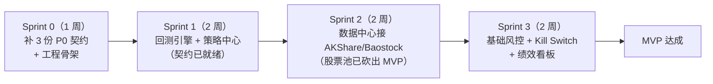

# 开工前缺口清单

> 生成日期：2026-09-23
> 依据文档：`智能量化交易平台.md`（PRD+架构 v1.0）、`智能量化交易平台-核心模块接口契约文档.md`（强约束契约 v1.0）、`智能量化交易平台-数据中心数据源选型与接入规范.md`（数据源规范 v1.0）
> 用途：在让 AI Agent 按契约开发之前，先把「契约覆盖不到的地方」列清楚。契约文档目标读者写的是「AI Agent 开发引擎」，约束级别写的是「强约束」——**契约没写到的地方，Agent 就会自由发挥，模块之间必然对不上。**

---

## 一、结论

| 问题 | 结论 |
| --- | --- |
| 能否开始开发？ | **能，但只能开一条竖切**（Python 侧：回测引擎 + 策略中心 + CSV 版 DataFeed） |
| 能否按 12 模块全量开工？ | **不能**。12 个模块中 4 个有完整接口契约，MVP 的 6 个模块里 3 个有 |
| 最大风险 | 原为「风控层零契约」→ 已解决；→ «数据中心 `as_of_date` 无契约» → **已解决**（2026-09-23，B2）。**现最大风险是 B7：主契约自身有 45 处标识符未定义**（24 个类型 + 19 个异常 + 2 个不可解析代码块）。Agent 现在照契约写代码，会自己发明 `PositionTarget` 等类型的字段 —— 两个模块各自发明，必对不上 |
| 建议下一步 | 先补 **B7**（主契约缺失类型清单，一条都还没补，棘轮 39/39 未动）；工程骨架**已建**（2026-09-23 I0，见 B6），但**端到端回测还没跑通**（一行业务代码都没有）——那是 **I1** 的事；风控层与数据中心已可开工。~~B3（股票池）~~ 已于 2026-09-23 裁决**砍出 MVP**，不再是阻塞项 |

> **2026-09-25 更正（上表是本文件生成当日的快照，故不回改；但其中一句今天读起来是假的）**：
> 「端到端回测还没跑通（**一行业务代码都没有**）」**已不成立** —— 仓库现有 15 个模块
> （14 个实现 + 入口 `cli`）与 373 条测试（2026-09-25 I4 后现取），I1 的端到端回测、I2 的 S1~S3 与 I2a / I2b 各子步、
> I3 的风控介入、I3b 的存储层接线与拦截留痕、I4 的绩效看板都已交付。**现状一律以 `CONTEXT.md` §6 与 `docs/迭代计划.md` §三 为准**，
> 不要拿这张表当进度看。
>
> **下一步登记在本文件 §七之二（运行期可观测性）的「建议顺序」里**：第 2 步（**I3b 小步**）=
> `DbRiskRuleStore` 真接线 + `risk_intercept_log` 写入（只追加，SQL CHECK 兜底）已 **2026-09-25 交付**，
> 关闭条件与逐条实测写在该节末尾；**第 3 步（I4 绩效看板）也已 2026-09-25 交付** —— 建议顺序四步已走完三步，
> 第 4 步是「不做」项。I0~I4 全部交付后，下一步的选择（实盘线 / 组合层 / B7 欠账）尚未登记裁决。
> 上表其余各行（能否开工、最大风险 B7…）同样是**当日**结论；B7 欠账的现值现取
> `python tools/run_all_gates.py --gate=core-contract-refs`。
> ⚠️ 连带这一句也已经过期：**2026-09-25 B7 还债后，棘轮基线是 `2`（`T1=2` / `T2=0` / `T3=0`）**，
> 而「下一步的选择（实盘线 / 组合层 / B7 欠账）尚未登记裁决」已于同日裁决 —— **先还 B7 欠账，
> 可还部分已还清**。两处更正见下面 §B7 的「2026-09-25 还清登记」。
> ⚠️ **再补一处（同批自查时发现漏了）**：上表第 15 / 16 行里还有两句同一天过期的 ——
> 「主契约自身有 **45** 处标识符未定义（24 个类型 + 19 个异常 + 2 个不可解析代码块）」、
> 「**一条都还没补**，棘轮 **39/39 未动**」。可还部分已于 2026-09-25 还清，棘轮基线**由 39 手工改小到 2**；
> 剩下那 2 条 `T1`（两个不可解析代码块）是**结构性**的、永不归零。
> 另外**这两套数字的口径本来就不同**：**45 = 24 + 19 + 2** 是人工清点的「标识符未定义处数」
> （**主契约单独**统计），**39 = T1 2 + T2 19 + T3 18** 是门禁实测的发现数（扫主契约 + 两份 `--extra=`）。
> 读的时候别混用，更别拿 45 减 39 去推「还了 6 处」。

---

## 二、模块 × 契约覆盖度矩阵

主文档共定义 12 个模块。逐一对契约文档核对：

| # | 模块 | 阶段 / 优先级 | 契约覆盖情况 | 判定 |
| --- | --- | --- | --- | --- |
| 1 | 数据中心 | MVP / P0 | ✅ **已补齐**（2026-09-23）：`智能量化交易平台-数据中心接口契约文档.md` v1.0（D1~D10 + 数据模型/9 个适配器与服务接口/交易日历/PIT 一致性/数据质量/错误码）+ `db/data_center.sql`（PostgreSQL，**16 条 CHECK**）+ `db/data_center.smoke.sql` + `tools/verify_data_center.py`。✅ DDL 与触发测试都已在一个真实 PostgreSQL 上执行过（**42/42 PASS**）| ✅ 有 |
| 2 | 股票池管理层 | ~~MVP / P0~~ **已砍出 MVP**（2026-09-23 裁决：回测直接指定股票列表） | 完全无 | ❌ 缺，但**不阻塞 MVP**，降级为「实盘 / 组合阶段前补」 |
| 3 | 市场状态识别 | 完善版 / P0 | 仅有 `MarketState` 数据类（1.3.2），无识别模型接口 | ⚠️ 部分 |
| 4 | 策略中心 | MVP / P0 | 「模块一」完整：`Strategy` 基类 + `StrategyRegistry` + `StrategyStockAdapter` + 6 个数据类 + 2 个枚举 | ✅ 有 |
| 5 | 策略-股票适配引擎 | 完善版 / P0 | `StrategyStockAdapter`（1.3.1）+ `AdaptabilityScore` / `SymbolScore` | ✅ 有 |
| 6 | 回测引擎 | MVP / P0 | 「模块二」完整：9 节、`BacktestEngine`/`EventEngine`/`SimulatedBroker`/`PerformanceAnalyzer`/`AttributionAnalyzer`/`DataIntegrityChecker`/`ResultSerializer` | ✅ 有 |
| 7 | 组合调度层 | 完善版 / P0 | 完全无 | ❌ 缺 |
| 8 | 风控层（最高权限） | MVP / P0（基础风控） | ✅ **已补齐**（2026-09-23）：`智能量化交易平台-风控层接口契约文档.md` v1.1（D1~D10 + 全部接口/数据类/proto/错误码）+ `db/risk_control.sql`（PostgreSQL，14 条 CHECK 约束）+ `db/risk_control.smoke.sql` + `tools/verify_risk_config.py` | ✅ 有 |
| 9 | 交易执行层 | 完善版 / P0 | 只有回测用的 `SimulatedBroker`；实盘 `Broker` 抽象无契约。错误码表只有 `BROKER_001~003` | ❌ 缺 |
| 10 | 绩效监控与收益归因 | MVP / P1（看板）、完善版 / P1（归因） | `PerformanceAnalyzer` / `AttributionAnalyzer` 有，但挂在**回测引擎**下（2.5 / 2.6）；**实盘实时看板、持仓级归因无契约** | ⚠️ 部分 |
| 11 | 策略生命周期管理 | 完善版 / P0 | 仅 `StrategyInfo.status` 字段 + 被引用但未定义的 `StrategyStatusEnum`；**状态机流转、晋级判定、降级动作无契约** | ⚠️ 部分 |
| 12 | 策略研究Agent | 进化版 / P0 | 完全无 | ❌ 缺 |

**统计：✅ 完整 4 个 / ⚠️ 部分 4 个 / ❌ 缺失 4 个。**

### Java 平台层覆盖度

> **2026-09-25 更正（下表是 2026-09-23 生成当日的快照，故不回改原措辞；但三行今天已不成立）**：
> 风控契约 v1.1 与数据中心契约 v1.0 补齐后，Java 平台层的契约情况已从「零契约」变为「**部分**」。
> 逐行标注见下表；**现值一律以两份契约的「文档信息」表与 `CONTEXT.md` §3 为准**，不要拿本行当现状。

| 层 | 技术栈（主文档 2.2） | 契约情况（2026-09-23 原判） | **2026-09-25 现判** |
| --- | --- | --- | --- |
| Java 平台层 | Spring Boot + PostgreSQL + Redis + Kafka/gRPC | ~~**零契约**~~ | ⚠️ **部分**：风控层契约 v1.1（= 模块三）已给出**生产侧风控进程**的完整契约（`risk_control.proto` + `db/risk_control.sql` 9 表 / 14 条 CHECK），数据中心契约 v1.0（= 模块四）已定义「**供 Java 平台层读取**的 REST」。仍缺：平台自身 REST API 清单、Kafka topic 定义、账号/任务管理 DDL、部署与配置规格 |
| 通信层 | gRPC / REST / Kafka | ~~仅 `common.proto` 的**消息**定义，**无一条 `service` / `rpc`**~~ | ⚠️ **部分**：`common.proto` 仍然只有消息、仍然**不可编译**（B5 未修，已裁决不进 MVP）；但 **`risk_control.proto` 已有 2 个 `service`（`RiskService` / `KillSwitchService`）共 10 个 `rpc`**，且明确「Java 侧风控进程为服务端，Python 研究层为客户端」 |
| 前端 | Vue/React（可选） | 无 UI 规格 | 无 UI 规格（未变；I4 只做**回测绩效看板**，不是 Web 前端） |

**具体缺失（2026-09-25 现取）**：平台自身 REST API 清单、Kafka topic 定义、账号/任务管理 DDL、
交易调度与交易执行的契约与 DDL、部署与配置规格。**已不再缺失**：风控层的 gRPC `service` 定义与
数据库表结构（见上表第 1、2 行）。

---

## 三、阻塞项（P0，不解决无法开工）

### B1. ✅ 已解决 —— 风控层契约与阈值已补齐（2026-09-23）

原问题：主文档模块 8 的规则全是占位符（X/Y/Z/W/N），且无接口、无数据结构、无持久化结构。

交付物：

| # | 交付物 | 说明 |
| --- | --- | --- |
| 1 | `docs/智能量化交易平台-风控层接口契约文档.md`（v1.1） | D1~D10 设计决策 + 全局约定 + `RiskEngine` / `RiskRuleStore` / `KillSwitch` 契约 + `risk_control.proto` + 持久化结构 + 错误码 + 测试要求 |
| 2 | `db/risk_control.sql` | 可执行 PostgreSQL 14+ DDL：9 张表 + 索引 + **14 条 `CHECK` 约束** + 6 条 GLOBAL 默认阈值种子（`ON CONFLICT DO NOTHING` 幂等） |
| 3 | `db/risk_control.smoke.sql` | 数据库级不变量的**触发测试**（23 个用例，全事务内 `ROLLBACK`）。✅ **已执行**（2026-09-23，容器 PostgreSQL）：**23 passed / 0 failed** |
| 4 | `tools/verify_risk_config.py` | 静态门禁（15 项检查 + 15 个空转守卫）+ 自测（1 正 + 9 负样本） |

钉死的默认阈值（存 DB，可动态调整，改动即时生效）：

| 规则 | 单位 | 默认值 |
| --- | --- | --- |
| `max_position_pct` | RATIO | `0.10`（单票 ≤ 10%） |
| `max_daily_trades` | COUNT | `3`（单日单票 ≤ 3 笔） |
| `strategy_drawdown_pct` | RATIO | `0.15`（单策略回撤 15%） |
| `account_drawdown_pct` | RATIO | `0.20`（总回撤 20%） |
| `max_order_amount_pct` | RATIO | `0.10` |
| `max_sector_pct` | RATIO | `0.30` |

> 原 X/Y/Z/W/N 五个占位符对应前四项；`max_sector_pct` 与 `max_order_amount_pct` 为契约新增。单位统一为 `RATIO` 存 **0~1 小数**（D3），并已下沉为数据库 `CHECK` 约束——`0.10` 误存为 `10` 会在写库时直接报错。

未闭环的两项：流动性检查阈值（`max_order_amount_pct` 已给定值，但「日均成交额」数据源依赖数据中心契约，即 B2）和交易日历（见 §四 局限）。

### B2. ✅ 已解决 —— 数据中心契约已补齐（2026-09-23）

原问题：主文档说「提供统一 `DataFeed` 接口」，契约 2.2.1 也定义了 `DataFeed` 抽象类，但数据中心**自身的**契约缺失（无存储模型、无 `as_of_date` / 披露日期字段、无 AI 指数成分股 PIT 契约、无适配器契约、存储选型未裁决）。

交付物：

| # | 交付物 | 说明 |
| --- | --- | --- |
| 1 | `docs/智能量化交易平台-数据中心接口契约文档.md`（v1.0） | D1~D10 设计决策 + 全局约定 + 数据模型 / 9 个适配器与服务接口 / 数据类 / 交易日历 / 持久化结构与不变量 / PIT 一致性校验 / 数据质量 / 错误码 / 测试要求；**顺带补齐主契约未定义的 7 个类型**（`MarketStatus`、`DataFeedError`、`PITReport`、`LeakagePoint`、`ValidationReport` 等）。⚠️ **「补齐」当时只兑现了「给出声明」**：`MarketStatus` 有了 5 个成员的成员表，但实现侧直到 **2026-09-25** 才真的按它改（分歧与证伪见 **B9.1**） |
| 2 | `db/data_center.sql` | 可执行 PostgreSQL 14+ DDL：9 张表 + 索引 + **16 条 `CHECK` 约束** + 1 个部分唯一索引 + 初始版本种子（幂等）。✅ **已执行**（2026-09-23，容器 `postgres:17` / PostgreSQL 17.11），无报错 |
| 3 | `tools/verify_data_center.py` | 静态门禁（C1~C7，含 C7 对触发测试的覆盖核对）+ 空转守卫 + 自测（1 正样本 + 9 负样本 + 3 个 GATE 样本 + 1 个真实产物对照）。将契约 §3.6.1 与 DDL 做**双向**核对 |
| 4 | `db/data_center.smoke.sql` | 数据库级不变量的**触发测试**（A 段前置存在性 / B 段 16 条约束各一个「必须拒绝」的样本 / C 段枚举与边界样本必须被接受，全事务内 `ROLLBACK`）。✅ **已执行**（2026-09-23，容器 PostgreSQL）：**42 passed / 0 failed** |

**关键裁决**（逐条展开见契约 §一）：

| 决策 | 内容 |
| --- | --- |
| D1 存储分层 | PostgreSQL 14+ 是**唯一权威源**（PIT 不变量由 `CHECK` 强制）；Parquet / DuckDB 是**可重建的派生加速层**，永远不是真相。（注意：不要把它与风控层的事务库混为一谈） |
| D2 三日期模型 | `trade_date`（数据所属日期）/ `available_date`（数据可获取日期）/ `as_of_date`（会话可见日）。不变量：返回的每一行都满足 `available_date <= as_of_date`。**禁止**用 `trade_date <= as_of_date` 代替 |
| D3 `as_of_date` 是结构性约束 | 拒绝给 9 个 `DataFeed` 方法各加一个可选 `as_of_date=None`（**可忘记传 → 静默退化为「用最新数据」→ 典型未来函数**）；改为 `DataFeed` **只能**由 `DataCenter.as_of()` 产出，类型上就不可能忘 |
| D4 披露日期 | 行情 `available_date = trade_date`；财务 `available_date = announce_date`（非交易日顺延到下一个交易日，**绝不前移**） |
| D5 指数成分股 | **区间快照**（`effective_from`/`effective_to`）而非逐日快照；`effective_to IS NULL` = 至今仍在成分内，**不等于「永远」**——因为 `a <= x < NULL` 恒为 `FALSE`，会静默返回空集 |
| D6 复权口径 | 回测用后复权、实盘不复权；**前复权因子含未来信息**（基准在最新价），故库中只存原始价 + 原始因子，复权在读取时现算 |
| D7 缺失值 | 默认 `FillPolicy.NONE`；`FFILL` 仅当填充源也满足 `available_date <= as_of_date`；**`BFILL` 禁止**用于回测/实盘 |
| D8 数据版本 | 版本号追加不修改（修正历史 = 新版本）；`is_active` 由**部分唯一索引**保证全表最多一行；`BacktestResult` 必须绑定 `data_version` |
| D9 适配器归一化 | 源特有字段名**不得出现**在任何数据类上；每行带 `source` + `ingested_at` |
| D10 增量幂等 | `INSERT ... ON CONFLICT DO UPDATE`；失败则重跑整段，禁止人工挑数据 |

> **本次门禁直接抓到一次真实漂移**：DDL 里我写了 **16 条** `CHECK`，而契约 §3.6.1 表里只列了 **12 条** —— 漏记的 4 条（`ck_dc_fin_report_type`、`ck_dc_ingest_priority`、`ck_dc_quality_flag`、`ck_dc_symbol_delist_after_list`）**永远不会有人为它写触发测试**。这正是「未文档化的不变量 = 无人测试的不变量」。门禁报 `C3` FAIL 后已补齐（现 16/16 双向对齐，`verdict: PASS`）。

已闭环（2026-09-23）：触发测试已执行（**42 passed / 0 failed**）、DDL 已执行 —— 同一台机器上用 `tools/run_sql_smoke.py` + `docker-compose.smoke.yml` 起的**一次性容器 PostgreSQL** 完成，详细证据见 §八。2026-09-24 补：同一套触测又在 `postgres:14`(14.24) / `15`(15.18) / `16`(16.15) 上各跑一遍，均为 **42/0**（风控侧同步为 **23/0**）；靠 `--report=` 各存一份快照，pg17 那份未被覆盖。但那次证伪**只在 `postgres:17` 上做过**，另三个镜像上只有冒烟层面的通过。

残留未闭环（不得因为上面那条绿就不写）：① 只跑过 `postgres:14/15/16/17` **四个 tag**（版本 14.24 / 15.18 / 16.15 / 17.11），DDL 标题里的「PostgreSQL 14+」仍未证实 —— 四个大版本之间还有别的 tag 与发行版，从未跑过；且 `tools/falsify_smoke.py` 的 31/31 CAUGHT **只在 pg17 上做过**；② 触发测试的**效力**证伪现在是**全覆盖**的（`tools/falsify_smoke.py`：31 个案例 / 30 条命名 CHECK，31/31 CAUGHT），但它只针对 `CHECK` 约束 —— 另外 3 个守门（`risk_rule.threshold` 的 NOT NULL、两个单例表的 PK 唯一性、`uq_dc_data_version_active` 部分唯一索引）**不在证伪范围内**，只被 `C7` 核对「用例还在、断言了是它拒绝的」；③ 触发测试的分母不是自证的 —— 某个 B 段整块停止执行只会让 `n_pass` 变小、不会变红，拦它的是静态门禁 `C7`/`covered_by_smoke`；④ **该项已结案（2026-09-25 实测）**：原记「财务 ROE 的取值区间在契约 §2.3（比率 0~1）与 §3.6.1（`-1..5`）口径不一致」—— 现契约 §2.3 的表格里 `roe` 已单列一行、写明**不受**上一行的 0~1 约束且区间 `[-1, 5]`，§3.6.1 的 `ck_dc_fin_roe_range` 行亦标注依据 §2.3 ⇒ 两侧不再矛盾。

### B3. 股票池无接口契约

主文档只给了散文式规则和「输入：全市场股票列表 + 当日数据 / 输出：股票列表 + 元数据」。缺：`StockPool` 接口签名、过滤规则的可配置化结构、多股票池（沪深300 / 中证500 / 全市场）并行管理的契约、每日动态更新的调度契约。

### B4. ✅ 已裁决 —— 主文档模块 4 的 `Strategy` 为「PRD 示意」，规范定义以契约为准（2026-09-23）

主文档模块 4 给出的 `Strategy` 与契约 1.1.1 的 `Strategy` 基类不一致：

| 项 | 主文档（模块 4） | 契约文档（1.1.1） | 性质 |
| --- | --- | --- | --- |
| `on_data` 入参类型 | `MarketData` | `MarketDataBundle` | 类型名不同（`MarketData` 在全契约中**无定义**） |
| `on_data` 返回类型 | `List[Signal]` | `List[TradingSignal]` | 同上 |
| `get_target_positions` 返回 | `Dict[str, float]`（仅权重） | `Dict[str, PositionTarget]`（权重/价格/优先级） | 表达力扩展，**权重语义一致** |
| 方法数量 | 3 个 | 12 个 | 主文档是子集 |
| `get_strategy_id` | 有 | 无（在 `StrategyInfo` 里） | 归属不同 |

**裁决结果：**

1. **效力优先级**：契约为准（契约自称「强约束 — 所有实现必须严格遵循」）。主文档模块 4 的代码块头顶加了一行显式声明「以上为 PRD 阶段的示意代码，不是规范接口」。
2. **不改主文档的代码块本身**。原因：`智能量化交易平台.md` 是 `.docx` **转换产物**，改了会在下次重转换时被覆盖；且文档保真门禁会把「段落被改」报成 `missing`。故只在代码块**下方新增**指引段落（纯新增不影响保真度，已实测三份文档 `missing=0` 仍 PASS）。
3. **权重语义裁决**（这是真正的语义分歧）：策略侧输出**目标权重**（`target_weight`），「数量」是组合调度层按当前权益换算的**派生量**。理由：PRD 要求「同一套策略代码同时服务回测、模拟盘、实盘」，而三者可用资金不同——若直接输出数量，同一份代码在不同资金规模下会产生不同仓位比例，**回测结论无法迁移到实盘**。权重是环境无关的表达，是唯一能跨环境复用的口径。
4. **`MarketData` / `Signal` 两个名字作废**：它们在主契约中不存在定义；实现必须用 `MarketDataBundle` / `TradingSignal`。
5. `get_strategy_id()` 不进入 `Strategy` 基类，它属于 `StrategyInfo`（1.1.5）。

### B7. 主契约自身有 45 处标识符未定义（**2026-09-23 时的最大阻塞；可还部分已于 2026-09-25 还清**）

> **2026-09-25 还清登记（下面这一节是 2026-09-23 的审计快照，故不回改；但结论要接一句）**：
> B7 里**可还的部分已经还清** —— 本节记的「24 个类型 + 19 个异常」是**主契约单独**统计的口径
> （把两份补充契约用 `--extra=` 传进去后是 19 + 18），它们现在全部由核心契约**附录 G** 定义，
> `tools/verify_contract_refs.py` 实测 **`T2=0` / `T3=0`**，棘轮基线同步由 **39 手工改小到 2**。
> 改法是「追加附录 G」而不是就地修正文 —— 那 3 个 md 由 `.docx` 派生、只许追加（理由同 B4 裁决第 2 条），
> 且新增的附录段落已登记进 `tools/verify_md_coverage.py` 的 `ADDENDA`（否则重转换一次就会
> 被抹掉，而逐段对比的判据会**全绿**）。
> 新门禁 `contract-appendix` 逐字段核对「附录 G = `quanauto/` 的实现」（基类 / 字段名+顺序 / 类型 /
> 默认值 / 枚举取值 / 异常 `code`），并守住两件事：附录 G 中「契约先行」的 5 个名字一旦在
> `quanauto/` 里出现实现就必须回来改判据（`AX-PENDING-DRIFT`）、G5 那两份不可解析块的
> **可复制副本**不许被删（`AX-T1-COPY` —— 删了 `T1` 计数不会变，但「能不能照抄」会静默退回去）。
> **仍然还不上的是那 2 个不可解析代码块**：它们就在 .docx 派生正文里，就地修会被下次重新转换抹掉
> ⇒ 基线保留 `T1=2`，本节「不可解析 2」的结论原样成立。**下面「修法」第 3 条没照做，也不该照做**：
> 它要求把 `verify_contract_refs.py` 接进 CI 并「要求 `verdict: CLEAN`」；现在的判据是
> **「发现数等于基线」**（tier-B 棘轮），因为那 2 条结构性欠账消不掉 —— 要求 `CLEAN` 等于要求
> 门禁红着跑，而红着跑的门禁很快会变成没人看的门禁。

B1/B2 补完之后，用 `tools/verify_contract_refs.py` 对主契约做 AST 级引用审计，结果：

| 项 | 数量 |
| --- | --- |
| Python 代码块 | 41（可解析 39、**不可解析 2**） |
| 出现的类型名 | 68 个（其中 **24 个没有任何定义**） |
| 提到的异常名 | 19 个（**定义了 0 个**） |

**24 个未定义类型**：`Account`、`AccountSnapshot`、`AdaptabilityRule`、`BacktestStatus`、`CapitalAllocation`、`Direction`、`EquityPoint`、`Fill`、`LeakagePoint`、`MarketStatus`、`OrderId`、`OrderStatus`、`OrderType`、`PITReport`、`PerformanceMetrics`、`PositionDirection`、`PositionLimit`、`PositionTarget`、`SectorAttribution`、`StrategyConfig`、`StrategyError`、`TaxConfig`、`ValidationReport`（其中 `MarketStatus`、`LeakagePoint`、`PITReport`、`ValidationReport` 已由 B2 的数据中心契约补齐）。

> ⚠️ **2026-09-25 复核这两句话的口径**（原文是 2026-09-23 的快照，故不回改，但要接一句）：
> ① 「未定义」这一列数的是**主契约单独**的口径，附录 G 落地后 `tools/verify_contract_refs.py` 实测 `T2=0` / `T3=0`（见 B7 的还清登记）；
> ② 「已由 B2 补齐」对 `MarketStatus` **只对了一半** —— 数据中心契约给的是**声明**，实现侧当时仍用 `OPEN`/`CLOSED`/`SUSPENDED`/`HOLIDAY`，
> 与契约的 5 个成员不一致，直到 2026-09-25 才对上（详见 **B9.1**）；
> ③ 同表里 `EquityPoint` 也已不再是「未定义」—— 实现侧 `quanauto/models.py:320` 已有它。

**19 个未定义异常**：`AdaptabilityCalculationError`、`BacktestExecutionError`、`BaseStrategyError`、`CheckpointError`、`ConfigValidationError`、`DataFeedError`、`DataFeedRegistrationError`、`DataValidationError`、`DuplicateStrategyError`、`ExportError`、`IllegalStateError`、`InvalidConfigError`、`InvalidParamError`、`MarketStateFetchError`、`NoResultError`、`StrategyError`、`StrategyExecutionError`、`StrategyNotFoundError`、`StrategyRegistrationError`（`DataFeedError` 已由数据中心契约补齐）。

**2 个不可解析代码块**：① 契约 L1168 `@dataclass class Account:` 被压成单行（`account_id: str # ...` 全挤在一行）；② 契约模块二末的一个三引号字符串未闭合。

**为什么这是 P0**：Agent 逐字照抄签名时，遇到未定义类型只能自己发明字段。两个 Agent 各自发明 `PositionTarget`，字段名/单位/语义必然不同 → 回测层与组合调度层接不上，而且这种错**不会在导入时报错**，只会在集成时表现为「仓位算不对」。

**修法**（三项，均需以「新增补充契约」形式落地，不能改 `.docx` 产物）：

1. 写一份**策略中心补充契约**，补全上述类型与异常层次（并声明与主契约的效力关系）；
2. 修正 2 个不可解析代码块（在补充契约中重新给出正确版本，并标注覆盖哪一段）；
3. 把 `tools/verify_contract_refs.py` 加入 CI：以主契约 + 全部补充契约为输入（补充契约以 `--extra=` 传入，只贡献定义），要求 `verdict: CLEAN`。

### B8. 两份手写补充契约从未被当成「被审文档」审过（**2026-09-25 实测登记，仍未闭环**）

`tools/verify_contract_refs.py` 的**位置参数**才是「被审文档」，`--extra=` 只提供定义、**其正文里的提及不参与审计**。
而门禁注册的调用只传了 `--extra=`（两份手写契约）⇒ 它们**自己的**未定义引用**一条都没被扫过**。
把数据中心契约换成被审文档实测（另两份以 `--extra=` 传入）：
`blocks: python=10 parsed=10` / `error names: mentioned=23 defined=30` / `verdict: DIRTY (5 finding(s))`，
五条全是 `T3`：`DataStoreError`、`HTTPError`、`URLError`、`OperationalError`、`ProgrammingError`。

- `DataStoreError`：**已裁决，不是缺陷** —— 数据中心契约附录 C 已登记「属实现侧新增异常码（`DATA_008`），契约不定义它」⇒ 这里是**审计器不知道那条裁决**。
- `HTTPError` / `URLError` / `OperationalError` / `ProgrammingError`：`urllib.error` 两个 + 驱动（`psycopg`）两个，本项目**不拥有** ⇒ 审计器缺一份「三方名字白名单」。

**为什么不顺手修**：两条修法都得**动判据本身**（① 把补充契约也当被审文档 ⇒ 立刻新增欠账、还要同步抬基线；
② 给工具加三方白名单 ⇒ 那是在**放宽**检查，必须配触发样本证明白名单不会吞掉真缺陷）。
两者都不属于「还 B7 欠账」这一步的范围，先登记、不夹带。

**同批已经改掉的错话**：数据中心契约 §3.10「静态一致性」那行原写「`verify_contract_refs.py` 对本契约审计为 `verdict: CLEAN`」——
实测**取不到这个值**（该调用方式下审的是主契约），已就地更正为「当成被审文档时无新增欠账」并附上五条的分类。
**当下能说的话**：门禁绿 = **主契约**的发现数等于基线（`T1=2`）＋ 两份补充契约提供了足以让主契约变干净的定义；
它**不等于**「两份补充契约自身已被审过」。

### B9. 枚举成员表曾**没有任何判据**（**2026-09-25 发现；B9.1 / B9.3 已还清，B9.2 仍未闭环**）

**背景（为什么能长期没人发现）**：门禁体系此前只核对**名字** —— 某个类型 / 异常 / 枚举名有没有定义、有没有登记。
**没有任何一条判据读过枚举的成员表**：`tools/verify_contract_appendix.py` 确实比过成员名，但它的比对范围只有
**核心契约附录 G**，而数据中心契约 §3.1.3 声明的 `MarketStatus` 不在其中；
`tools/contract-signature-manifest.json` 的 `classes` / `impl_only` 两张表里**一个枚举都没有**。
（另一条**看似**相关但无效的旁证：`db/data_center.sql` 里那些 `CHECK (... IN (...))` 是数据库约束，
与 Python 侧枚举没有连线，也就永远不会因为实现侧枚举漂移而变红。）

#### B9.1 枚举成员分歧（✅ 已还清，2026-09-25）

实测口径（`ast` 解析三份契约的 ```` ```python ```` 块 + `quanauto/*.py`）：
**契约 23 个枚举 / 实现 23 个 / 逐成员可比 21 个 / 暂缓 2 个（`DataQualityFlag`、`ReportType`：契约有、实现无）
/ 实现侧本地 2 个（`SessionMode`、`SeverityEnum`）**。其中唯一一条真分歧 = `MarketStatus`：

| 侧 | 成员（成员名与取值同名） |
| --- | --- |
| 数据中心契约 §3.1.3（该文件 L243） | `PRE_OPEN`、`OPEN`、`LUNCH_BREAK`、`CLOSED`、`HALTED` |
| 实现（分歧前，即当时的 `HEAD:quanauto/enums.py`） | `OPEN`、`CLOSED`、`SUSPENDED`、`HOLIDAY` |

**证伪（这条缺口的证据就是「插一个假成员，整套门禁照样绿」）**：往 `MarketStatus` 里插一行
`SUSPENDED_MUT = "SUSPENDED_MUT"`（`quanauto/enums.py` 的 sha256[:16] `4cd54af97aca5d90` → `66914120b53b288d`，
还原后逐字节回到 `4cd54af97aca5d90`）：

- 新门禁注册**前**：13 条门禁全绿 ⇒ 上面那条分歧可以长期存在而无人报；
- 注册**后**（2026-09-25 重做同一条变异）：`verdict: FAIL (13/14 gate(s) green)`，
  **只有** `enum-members` 变红（`3 finding(s)`，全是 `EM-MEMBER-MISMATCH`：分别报取值不一致 / 成员名不一致 / 成员数 5 vs 6），
  **其余 13 条全 PASS** —— 其中 `contract-appendix` 在该变异下仍是 `PASS 0 finding(s)`，
  这就把「附录 G 那条门禁确实看不见这个成员」从推断变成了实测。

**裁决与落实**：契约是权威（数据中心契约自称强约束），实现侧改为契约的 5 个成员且**顺序一致**；
`SUSPENDED` / `HOLIDAY` 删除。零风险依据：两侧**代码**里被引用过的 `MarketStatus` 成员只有
`OPEN` / `CLOSED`（`CsvDataFeed.get_market_status`），其余成员没有任何调用点。
新增 tier-A 门禁 `enum-members`（`tools/verify_enum_members.py`，门禁数 13 → 14），除主比对外显式登记两张表：

- `PENDING = {DataQualityFlag, ReportType}` —— 契约有、实现无；一旦实现侧出现就报 `EM-PENDING-DRIFT`，必须回来裁决（不许静默补上）；
- `IMPL_LOCAL = {SessionMode, SeverityEnum}` —— 实现侧本地定义；消失报 `EM-LOCAL-STALE`，出现未登记的新枚举报 `EM-UNREGISTERED-IMPL`。

> ⚠️ `SeverityEnum`（`WARNING` / `ERROR` / `CRITICAL`）与 `db/data_center.sql` 的
> `ck_dc_quality_severity`（`CRITICAL` / `WARNING` / `INFO`）是**不同域同形**：名字像，取值对不上（一个多 `ERROR`、一个多 `INFO`）
> ⇒ **不许**把它们当成一对映射。`ERROR` 会被 DDL 拒绝是另外一件事，属数据中心的枚举取值问题，不在本节裁决范围内。

#### B9.2 类覆盖欠账（❌ 仍未闭环）

「实现侧某个类有没有契约来源」这件事，截至目前**没有判据**。实测（`ast` 与
`Select-String -Pattern '^\s*class\s+\w+'` 两种数法互相印证）：

| 项 | 数 |
| --- | --- |
| 实现侧文件 / 类 | 16 个文件 / **144** 个类 |
| 三份契约正文里出现过的类型名 | 133 |
| `manifest.classes` / `manifest.impl_only` / `CONTRACT_FIRST` / `T1_REQUIRED` | 9 / 22 / 6 / 2 |
| 以上「已声明或已登记」的**并集** | 147 |
| 声明了但实现里没有 | 32 |
| **实现里有、但没人管** | **29 = 14 个「正文提到过名字」+ 15 个「三份契约里连名字都没有」** |

- **14 个 MENTIONED**（名字在契约正文出现过，但没有类块、也没登记）：
  `DataStoreError`(errors.py:255)、`IngestReport`(pgstore.py:184)、`OrderRejectedError`(errors.py:302)、
  `PgBarIngestor`(pgstore.py:373)、`PgBarStore`(pgstore.py:352)、`PsycopgConnection`(pgstore.py:433)、
  `RiskConfigInvalidError`(errors.py:342)、`RiskConfigLoadError`(errors.py:355)、`RiskConfigWriteError`(errors.py:361)、
  `RiskError`(errors.py:319)、`RiskInterceptError`(errors.py:325)、`RiskInterceptLogWriter`(risk.py:1080)、
  `RiskRuleNotFoundError`(errors.py:351)、`StrategyHandle`(models.py:331)
- **15 个 ABSENT**（三份契约里连名字都没有）：
  `BrokerError`(errors.py:296)、`CurvePoint`(dashboard.py:119)、`CurveStats`(dashboard.py:334)、
  `DashboardError`(errors.py:398)、`DashboardView`(dashboard.py:128)、`InsufficientFundsError`(errors.py:308)、
  `KillSwitchActiveError`(errors.py:385)、`MetricRead`(dashboard.py:108)、`MetricSpec`(dashboard.py:70)、
  `RiskBreakerTrippedError`(errors.py:336)、`RiskDegradedError`(errors.py:379)、`RiskRuleVersionConflictError`(errors.py:391)、
  `RuleSpec`(risk.py:216)、`SeverityEnum`(risk.py:137)、`SqlConnection`(pgstore.py:166)

**为什么是缺口而不是「都合规」**：现有两条相关门禁都只看**已登记项的存续**，看不到**新增项**：
`tools/verify_contract_signature.py` 核的是「清单里登记的成员还在不在」（多出来只报 `impl_only` 未登记），
`tools/verify_contract_appendix.py` 只审**附录 G**。⇒ 一个新写的类可以既不在契约、也不在任何清单里，全部门禁照样绿。
**不要**把 29 这个数当成「基线」记进棘轮：它现在只是**一次实测快照**，没有判据在盯它。
**修法（未做）**：把「实现侧每个类都必须在契约正文出现过、或在 `manifest` 里登记过」写成判据，
`manifest` 侧补登记这 29 个（并逐个裁决：属契约欠账的写进补充契约，属实现细节的登记为 `impl_only`）。
难点是要说清「判据看的是**声明**还是**提及**」——只看提及会让上面 14 个立刻「合规」，
等于把缺口用一句「正文提过」抹掉。

> **计数更正**：本批早先写的「145 个类」是错的，实测是 **144**（`ast` 数出 144 个 `ClassDef`，
> `Select-String '^\s*class\s+\w+'` 独立数出 144 行）。29 / 14 / 15 这三个数不变。
> 顺带查到那 145 是从哪儿来的：门禁 `contract-appendix` 报告里 `impl scan: … classes=145`
> 把 `NewType` 别名（`quanauto/models.py:51` 的 `OrderId`）也当成一个可比对对象收进表里了 ——
> 那是它的设计（附录 G 里 `OrderId` 确实要逐字段比），但**标签不该写 `classes=`**。
> 2026-09-25 已把那行改成 `classes=144 newtypes=1` 两个数分别打印（标签与数都是现取的，不写死）。

#### B9.3 `local_types` 幻影键（✅ 已还清，2026-09-25 —— 措辞比对本身也是缺陷）

实现侧多处在 docstring 里写着「这些本地类型**登记在 manifest 的 `local_types` 里**由本地定义管辖」。
实测：**`local_types` 这个键从来没存在过**。精确判据（必须带路径限定，否则会被误导）：

```powershell
git grep -n local_types HEAD                                    # 9 处：datacenter.py 1 / enums.py 4 / models.py 2 …（全在实现侧注释里）
git log -S local_types -- tools/contract-signature-manifest.json # 0 hits（5 个修订 e9c008f / 7939a75 / 986b623 / 14dd83e / 7c9f0a5 全都没有这个键）
git log -S local_types --name-only                              # 2 个提交（7c9f0a5 / 14dd83e）—— 但它们只改了「提到这个键」的 quanauto/*.py 散文
```

manifest 现行的键只有 `schema` / `contract` / `classes` / `impl_only` / `non_normative_blocks` / `note`；
实现侧本地类型真正的登记处是 **`impl_only`**（22 项）。⇒ 那 9 处措辞是**指向一个不存在的登记处**，
属于「把一条写下来的『事实』当前提用」的同一家族（纪律 14）：**先实测再引用**。
本批已把 6 处（含 4 处是本批改错后重改的）替换为带 `-- <manifest 路径>` 的精确判据，并说明裸 pickaxe 会给出 2 个假命中。
（这段经历本身值得记：**更正里写下的新句子同样要实测** —— 本批第一版「更正」把 `local_types` 换成了另一个不存在的键，
并且顺手写了两个假的数（「门禁会强制每个类要么对得上契约块要么登记过」、「145」），三处都已在本节与 B9.2 里改回。）

### B10. 「实现侧某个类/枚举有契约来源」应当是一条**由并集算出来的**判据（❌ 仍未闭环）

B9 暴露的不是一次笔误，而是**判据的盲区形状**：现有门禁回答的是「**已登记的东西还在吗**」，
而两条更重要的问句没有判据 —— 「**没登记的东西是怎么进来的**」「**登记表自己是不是完整**」。
要把这件事变成真判据，至少需要三样东西，缺一样就还是自证：

1. **两侧清单都由数出来的并集产生**，不写死数字：`docs/*.md` 里声明（类块 / 枚举块 / 附录 G 条目）
   ∪ `manifest.classes` ∪ `manifest.impl_only` ∪ `CONTRACT_FIRST` ∪ `T1_REQUIRED`，再与 `quanauto/*.py` 的
   `ast` 扫描结果求差；两侧提取为空一律 **FAIL**（空转守卫），不许打「0 问题 PASS」。
2. **「提及」与「声明」分开数**：`MarketStatus` 这类**只在正文被提到、没有类块**的名字，
   在过去 24 个「未定义类型」的统计里被算作「未定义」，在 B9.2 的 147 并集里又被算作「已声明」——
   同一个词在两张表里语义不同。判据必须显式区分，否则「合规」可以靠把名字写进任何一句话来取得。
3. **正向与反向都要有负样本**：只测「删掉登记项会报错」不够（那是单向判据，见纪律 10），
   还要测「新增一个未登记的类会报错」「新增一个未登记的枚举成员会报错」（后者已由 `enum-members` 覆盖）。
   每个样本必须**打中它要守的那个分支**，并断言报出来的正是预期检查码 —— 否则「变异没打中」与「探测器不存在」在报告里长得一模一样。

**当下能说的话**：枚举成员这一层**有**判据（`enum-members`，含 24 个自测样本，两个干净样本防误报）；
类这一层**没有**判据，只有 B9.2 那张一次性的实测表。**不要说「实现侧都有契约来源」**——29 个类反例就在上面。

### B5. `common.proto` 不可编译

```protobuf
message MarketDataResponse {
  string symbol = 1;
  ...
  double adjust_factor = 1     // ← 与 symbol 字段号冲突，protoc 直接报错
```
- 字段号 `1` 与 `symbol = 1` 重复 → protoc 编译失败
- `MarketDataResponse` 是**单根 K 线**结构，但 `MarketDataRequest` 带 `limit`，响应应为 `repeated`
- 文件在 `double adjust_factor = 1` 处**截断**，缺后续字段与全部 `service` / `rpc`
- 全文件被压成一行（见第五节）

### B6. 依赖与环境未就绪

本机实测（`importlib.util.find_spec`）：

| 缺失 | 说明 |
| --- | --- |
| `pandas` | 研究层基石，主文档技术选型第一项 |
| `akshare` / `baostock` / `tushare` | MVP 推荐数据源（AKShare + Baostock 组合） |
| `duckdb` / `pyarrow` | 本地列存（若选 DuckDB 方案） |
| `pytest` | 契约文档附录 C 列了 9 个模块「必须」测试 |
| `matplotlib` | 绩效曲线绘制 |
| `grpc` / `fastapi` | 通信层 |
| `backtrader` / `veighna` | 主文档技术选型提到的回测框架 |

已装：`numpy` 2.4.3、`torch`、`pydantic` 2.12.4、`requests`。

另：`d:\project-quan\quan-auto` ~~不是 git 仓库~~ **已修（2026-09-23）**：已是 git 仓库（`main` 分支，基线提交 `053f620`，含 `.gitignore` / `.gitattributes`）。

**工程骨架也已建（2026-09-23 I0 交付；同日晚 I1 在其上打了第一条竖切；此后 I2 S1 加 PIT 边界层、S2 加采集侧适配器、S3 加落库侧读写与「引擎改读 `as_of()` 产出的 feed」）**：
`pyproject.toml` + `quanauto/` 包（现为 **13 个实现模块**，入口 `quanauto.cli`）+ `tests/test_skeleton.py`
（3 条骨架自检）+ `tests/test_backtest_slice.py`（22 条竖切回归）+ `tests/test_data_center_pit.py`（18 条 PIT 回归）
+ `tests/test_data_center_adapter.py`（32 条适配器回归）+ `tests/test_data_center_store.py`（29 条落库侧回归，不连库）
+ `tests/test_backtest_db_feed.py`（10 条端到端接线回归）+ `.github/workflows/ci.yml` + `skeleton` 门禁。
实测 `pytest` → `114 passed`（2026-09-24 I2 S3 后半实测），退出码 0。证据：`tools/ci-dryrun-report.txt`（含两次红→绿往返）、
`tools/gates-report.txt`、`tools/pytest-mutation-report.txt`。
（**这一段的模块数、逐文件条数与 `114 passed` 都是 2026-09-24 那一刻的快照**，此后又交付了 I2a / I2b / I3 / I3b；
现值见 §一 顶部那条更正与 `CONTEXT.md` §6 —— 2026-09-25 I3b 后实测 `337 passed`。）

⇒ 本次改掉的是 B6 的**前半句**（「没有骨架」）。**后半句仍然成立、且必须保留**：
上面那张表的依赖**一个都没装**；`pyproject.toml` 的 `dependencies` 现在只有 **`pandas>=2.0`**
（I0/I1 时是空数组 —— 那时的竖切只用标准库；S2 的适配器按数据中心契约 §3.2 的 `pd.DataFrame` 签名把它带了进来），
源 SDK（`akshare` / `baostock`）放在 `[datasources]` extra 里 —— 规则没变：**依赖由真正用它的模块带进来**，
而不是按技术选型预置一批「以后大概会用」的包。
另外 `.venv` 里只装了 `pytest`（门禁侧），它不是运行时依赖。

---

## 四、源文档缺陷（需回填，非转换丢失）

以下均为 **`.docx` 源文件本身的问题**。已通过逐段比对验证（862 段全部命中，0 丢失），确认不是转换造成：

| # | 位置 | 缺陷 | 影响 |
| --- | --- | --- | --- |
| 1 | 契约 1.4.1 `common.proto` | 全文被压成一行；在 `double adjust_factor = 1` 处**硬截断** | 无 `service`/`rpc`，Java↔Python 通信契约实际为空 |
| 2 | 契约 2.8.1 `ResultSerializer` | `from_json` 段落在 `返回:\n        Backtest` 处**截断**（应为 `BacktestResult:` 及方法体） | 该类无法实现 |
| 3 | 契约 2.8.1 | `class ResultSerializer: """ 回测结果序列化器。 """` 与 ```` ```python ```` 挤在同一段落 | 已由转换器还原为围栏代码块，但源码建议重排 |
| 4 | 契约 附录 A/B/C | 内容是 run-on 单行（`版本: v1.0 日期: ... 变更内容: ...`；`模块: X 测试场景: Y 覆盖要求: Z`） | 已转换为标题 + 表格；源码建议改为真表格 |
| 5 | 主文档 六、风险与应对 | 表格只有 1 行（未来函数/数据泄露），且文末遗留 `(AI生成)` | 疑为未写完 |
| 6 | 契约 1.4.1 | `MarketDataResponse` 缺 `repeated`；`adjust_factor` 字段号错误 | 见 B5 |

---

## 五、文档强度评估（哪些部分可以直接照着写代码）

| 强度 | 内容 | 说明 |
| --- | --- | --- |
| 🟢 可直接实现 | 契约文档 42 个 Python 代码块 | 带完整类型标注、docstring（Args/Returns/Raises）、异常层次，Agent 可 1:1 转成代码 |
| 🟢 可直接实现 | 契约 附录 C 测试要求 | 9 个模块的测试场景已列明，可直接生成测试骨架 |
| 🟢 可直接实现 | 契约 附录 D 错误码表 | 21 条错误码（STRATEGY_001~010、BACKTEST_001~006、BROKER_001~003、RISK_001~002），含级别/描述/建议措施 |
| 🟡 需补充细节 | 数据源规范的 9 张对比表 | 选型结论明确（MVP 用 AKShare + Baostock），但**接入接口**未定义 |
| 🟡 需补充细节 | 主文档 阶段规划 / 路线图 | 交付物粒度是「模块」，不是「接口」 |
| 🔴 不可直接实现 | ~~风控层~~、股票池（已砍出 MVP）、组合调度、交易执行、生命周期状态机、研究Agent、Java 平台层（已推到实盘前） | 只有散文描述。**风控层已于 2026-09-23 补齐契约**（见 §二 第 8 行），不再属于本行 |

---

## 六、建议的开工顺序

> ⚠️ **本节已被 `docs/迭代计划.md` 取代（2026-09-23）—— 不要再按下面的 Sprint 0~3 施工。**
>
> 原因是切法：下面这套是**按层切的瀑布**（Sprint 0 补契约 → Sprint 1 回测层 → Sprint 2 数据层 →
> Sprint 3 风控层），每个 Sprint 都等上一层**全部**完成。两个后果：① Sprint 0 结束时只交出文档，
> 全仓库仍然零行**业务**代码（I0 之后才有骨架，骨架本身不含业务）；② 没有端到端的验收物，集成风险全部堆到 Sprint 3 之后。
>
> 新计划改成**竖切**：I0 建骨架（git + pytest），I1 起每一轮都穿过「策略 → 数据 → 回测 → 绩效」
> **同一根竖轴**，每轮都交出一条端到端可演示、可回滚、可度量的窄路径。
> 迭代编号、DoD、燃尽节奏一律以 `docs/迭代计划.md` 为准。
>
> 本节**保留**的理由只有一个：Sprint 1/2/3 下面那份**模块级任务清单**（要补哪些接口、哪些适配器）
> 依然有效，可以作为「每个迭代里要补什么」的取材来源。**但顺序不再代表节奏。**



### Sprint 0：补齐契约（1 周）

必须产出：

1. ~~**风控层契约**~~ — ✅ **已完成**（2026-09-23）：`智能量化交易平台-风控层接口契约文档.md` v1.1 + `db/risk_control.sql`，五个阈值已按保守值落库（Q1 裁决）
2. ~~**数据中心契约**~~ — ✅ **已完成**（2026-09-23）：`智能量化交易平台-数据中心接口契约文档.md` v1.0（含 D1 存储选型裁决）+ `db/data_center.sql`
3. ~~**股票池契约**~~ — ⏸ **不进 MVP**（2026-09-23 裁决 Q4）：砍掉股票池，回测直接指定股票列表 ⇒ B3 降级
4. **裁决 B4 冲突** — 统一 `Strategy` 接口，回改主文档模块 4
5. ~~**修复 B5**~~ — ⏸ **不进 MVP**（2026-09-23 裁决 Q3）：Java 平台层推到实盘前，`common.proto` 不阻塞任何一轮迭代
6. **工程骨架** — ✅ **已完成**（2026-09-23 基线提交 `053f620` 建 git 仓库，含 `.gitignore` / `.gitattributes`；
   本项剩下部分由 I0 交付：目录结构 + `pyproject.toml` + `pytest` 可跑 + CI（`.github/workflows/ci.yml`）+「骨架还在」门禁）。
   依赖安装**未做，且故意不做**（见 B6）
7. ~~**跑两套数据库冒烟**~~ — ✅ **已完成**（2026-09-23）：`tools/run_sql_smoke.py` 用 `docker-compose.smoke.yml` 起一次性容器 PostgreSQL，依次执行 `db/risk_control.sql` + `db/risk_control.smoke.sql`（→ **23 passed / 0 failed**）与 `db/data_center.sql` + `db/data_center.smoke.sql`（→ **42 passed / 0 failed**），证据落在 `tools/sql-smoke-report.txt`（含镜像 digest）。并已用 `tools/falsify_smoke.py` **证伪这两份绿**（逐条放宽一条 `CHECK` 的表达式，要求恰好一条样本变红）：**31 个案例 / 30 条命名 CHECK，31/31 CAUGHT**，风控变 22/1、数据中心变 41/1 ⇒ B 段确实有牙，且不再是抽样
8. ~~**把效力证伪铺满 30 条约束**~~ — ✅ **已完成**（2026-09-23）：`tools/falsify_smoke.py` 的 `CASES` 已补齐到 **31 个案例**（`ck_risk_rule_ratio_range` 上下界各一个），输出落在 `tools/falsify-report.txt`。为此修掉一个潜伏的**空转陷阱**：`db/*.sql` 全是 `CREATE TABLE IF NOT EXISTS`，同一容器里跑第二条案例时变异 DDL 会**静默不生效**（表已存在）⇒ 现每案例先 `DROP SCHEMA public CASCADE; CREATE SCHEMA public;` 并自 assert 对象数为 0

### Sprint 1：可立刻开工的部分（无需等契约补全）

理由：`DataFeed` 抽象（2.2.1）、`Strategy` 基类（1.1.1）、`BacktestEngine`（2.1.1）、`PerformanceAnalyzer`（2.5.1）、`DataIntegrityChecker`（2.7.1）的契约都已到「方法签名 + 异常 + 数据类字段」级别，**足以直接写代码**。

交付：
- 按 2.2.2 示例实现 `CsvDataFeed`
- 实现 `Strategy` 基类 + `StrategyRegistry`
- 实现 `BacktestEngine` + `EventEngine` + `SimulatedBroker`
- 实现 `PerformanceAnalyzer` + `AttributionAnalyzer`
- 实现 `DataIntegrityChecker`（未来函数 / 幸存者偏差 / 完整性三类检测）
- 写一个 MA 双均线示例策略，**跑通端到端回测**（这是验证契约可实现性的最小闭环）

> 这一步的价值不只是出代码：跑通端到端会**暴露契约里签名不合理的地方**，比纸面评审有效得多。

---

## 七、需要你决策的问题（2026-09-23：Q1~Q7 已全部结案）

| # | 问题 | 选项 / 建议 |
| --- | --- | --- |
| 1 | 风控五个阈值填什么？ | ✅ **已决**（2026-09-23）：按保守值起步，见 B1 表。存数据库（PostgreSQL）由运维页动态调整，无需重启 |
| 2 | 数据中心存储选型？ | ✅ **已决**（2026-09-23，按数据中心契约 **D1** 口径统一）：**PostgreSQL 14+ 是唯一权威数据源**，Parquet / DuckDB 只是**可重建的派生加速层**。原「MVP 用 DuckDB + Parquet，实盘再上 PostgreSQL」的建议与 D1 **不是同一个意思**（D1 允许丢派生层、不允许丢权威源）⇒ **以 D1 为准** |
| 3 | Java 平台层何时进？ | ✅ **已决**（2026-09-23）：MVP 阶段**只做 Python 回测线**，Java 推到「模拟盘 / 实盘」前。⇒ 末轮边界收缩为「绩效看板」，B5（`common.proto`）不进 MVP |
| 4 | MVP 是否砍掉股票池？ | ✅ **已决**（2026-09-23）：**砍掉**，回测直接指定股票列表 ⇒ 迭代计划里「股票池与组合调度」那一轮取消，B3 不再是 MVP 阻塞项 |
| 5 | 主文档模块 4 的 `Strategy` 接口是否按契约改齐？ | ✅ **已决**（2026-09-23）：**按契约改齐**（契约是强约束）。因为主文档是 `.docx` 派生物、**不许原地改**，做法是**在文末追加「附录A」**给出规范签名（`class Strategy(ABC)` + 12 个成员），并声明上文示意代码不承担接口定义职责。附录的存在由 `md-fidelity` 的 **`ADDENDA` 清单守护** —— 被重新转换抹掉就判 FAIL |
| 6 | 是否立即 `git init` + 建工程骨架？ | ✅ **已决**（2026-09-23）：**立即建** |
| 7 | 风控持久化确认用 PostgreSQL？ | ✅ **已决**（2026-09-23）：PostgreSQL 14+，DDL 已适配（`numeric`/`timestamptz(3)`/`boolean`/`CHECK` 约束/`ON CONFLICT`） |

> 裁决对**迭代划分**的影响写在 `docs/迭代计划.md` §三（删去股票池那一轮，迭代变为 I0~I4）。

---

## 七之二、待办：运行期可观测性（**I3 之后**，2026-09-24 登记）

> 登记动机：I3 让风控真正介入下单路径之后，「闸门干了什么」必须能被看见。
> **本轮（I3）不动这个缺口** —— I3 的 DoD 要的是「能看见闸门干了什么」，不是「有日志」，
> 而 `BacktestEngine.risk_summary()` 已经满足前者。

### 现状实测（2026-09-24，不是推断）

| 层 | 现状 | 证据 |
| --- | --- | --- |
| 构建期 | **超出一般项目的扎实**：门禁 + 对称棘轮 + 触测计数 + 效力证伪 | `tools/gates-report.txt`、`tools/falsify-report.txt`（31/31 CAUGHT）、`tools/gates-baseline.json` |
| 契约期 | **设计已就绪，仍是纸面**：`db/risk_control.sql` 9 表中 **6 张是留痕/状态表** | `risk_rule_audit` / `risk_intercept_log` / `risk_decision_log` / `risk_breaker_state` / `risk_equity_peak` / `risk_switch_state` |
| 运行期 | **几乎为零** | 见下三条 |

运行期为零的三条实测证据：

1. `risk_intercept_log` / `risk_decision_log` / `risk_rule_audit` 在 `quanauto/*.py`、`tools/*.py` 里**零引用**；
   （2026-09-25 更正：`risk_intercept_log` 已由 `RiskInterceptLogWriter` 接线，`risk_rule_audit`
   由 `DbRiskRuleStore.save_change()` 写入。**注意「引用」与「写入」在这里不是一回事**：
   `risk_decision_log` 仍然**零写入者**（`quanauto/*.py` 里一处都没有），但它**不是零引用** ——
   `tools/verify_risk_config.py` 把它列在 `CONTRACT_TABLES` 与两张约束表里（共 3 处），
   那是静态核对器在读**名字**，既不是写入也不是读数据。）
2. 全仓 `logging` **只有 1 处**（`quanauto/strategies.py` 的 `LOGGER.warning`），引擎/撮合/风控层都没有；
3. `DbRiskRuleStore` 三个方法**全部 `raise RiskConfigLoadError("尚未接线…")`** ⇒ 9 张表**没有一张**被 Python 写过。
   （2026-09-25 更正：三个方法都已真接线并有测试；实测被 Python 写过的表增至 3 张
   —— `risk_rule` / `risk_rule_audit` / `risk_intercept_log`，其余 6 张仍待接线。）

⇒ 缺的**不是设计，是接线**。所以本项不是「补设计」，而是「把已有表接上」。

### 为什么不能顺手加（两条硬约束）

| 约束 | 后果 |
| --- | --- |
| 回测可复现性（`R5`：`.rounds/i1/` 的 `deterministic` 段逐字节比对） | 凡是带时间戳 / 耗时 / 进程 id / trace id 的观测字段，只要落进 `report_payload` 的 `deterministic` 段，**当场把 R5 打红** |
| 契约 **D1**（`check()` 内禁止 IO） | 留痕的**唯一正确接法**是调用方收集 `RiskCheckResponse` 后落库；引擎里一旦出现 `INSERT`，就是一条 D1 违反 |

### 裁决：可观测性必须分两段（契约已埋好这个分法）

- **判据段（`deterministic`）**：**永不**放观测字段。`risk_summary()` 刻意不进回测报告 —— 这是裁决，不是省事。
- **诊断段（`runtime` / 表 / 日志）**：可以放，但**不得被任何门禁当证据读**。
- 另外：**不给回测路径接 `logging`**。输出天然依赖环境，而本项目已经吃过一次
  「判据依赖环境就是判据的缺陷」（CI 首次真跑判红）的亏。

### 已经有形态、待展开的一处缝

`BacktestEngine.risk_summary()["blocked_orders"]` 的字段
（`datetime` / `strategy_id` / `symbol` / `side` / `quantity` / `action` / `run_state` / `rule_ids` / `message`）
与 `risk_intercept_log` 的列**基本对得上**，`action` 取值范围也吻合
（表 CHECK 为 `REDUCE|REJECT|HALT`，**没有 `PASS`** —— 与「缩到 0 股记成 REDUCE」一致）。

**但有一条缝**：`risk_intercept_log` 是**一条 violation 一行**（`rule_id` / `threshold` / `observed` 是
`RiskViolation` 的字段），而内存记录是**一订单一行、`rule_ids` 是列表**。将来落库时要按 violation 展开。

### 建议顺序（每一步都能单独验收）

1. **本轮 I3：零新增**。`risk_summary()` 即 I3 的可观测性形态。
2. **I3b（I3 之后的一个小步，不是独立迭代）**：`DbRiskRuleStore` 真接线 + `risk_intercept_log` 写入
   （只追加，SQL CHECK 兜底）。验收物应含「拦一次 → 表里多一行，且该行改不动」。
   ✅ **2026-09-25 已交付**（I3b 小步，见下「交付实测」）。
   > 命名说明：它**不进** `docs/迭代计划.md` §三 的迭代表，所以不占迭代号 ——
   > 该计划的 **I4 是「绩效看板」**（见上一条建议第 3 项），两者不是同一件事。
   > 本文件与代码里凡写「I4 留痕 / I4 接线」的地方都已统一改成 **I3b**。
3. **I4 绩效看板**：那才是给人看的可观测性，且 `PerformanceAnalyzer` 是唯一指标口径
   （迭代计划已写死「不得另立一套指标定义」）。
   ✅ **2026-09-25 已交付**：`quanauto/dashboard.py`（纯读数，14 个指标全部取自 `BacktestResult`）+
   `dashboard` 子命令 + 新门禁 `dashboard-consistency`（`tools/verify_dashboard.py`）+ 36 条回归
   （`tests/test_dashboard.py`）；读数口径登记在核心契约 **§F**。
   > 交付时又砍了一刀：**实盘实时看板、Web 前端、图表库、PDF/Excel 导出都不在本轮**，
   > 展示形态只有 `text` 与单文件 `html`（登记在核心契约 §F6）。
4. **不做**：给回测接 `logging`；把观测字段塞进报告。

### 关闭条件（缺一条就不算闭环）

- `DbRiskRuleStore` 的 `load_rules` / `get_version` / `save_change` 不再 `raise`，且**有测试**
  （不连库的那部分走假连接，真库那部分只能走容器通道）；
- `risk_intercept_log` 的**写入方**被点名（按 D1，必须是调用方，不是 `RiskEngine`）；
- 一条**触发测试**：拦一次 ⇒ 表里恰好一行，且该行的 `action`/`rule_id` 与 `response.violations` 对得上；
- 全部落在「诊断段」，`report_payload` 的三段结构**逐字节未变**（`R5` 仍绿）。

### 交付实测（2026-09-25，与上一条关闭条件逐条对应）

| 关闭条件 | 实测结果 | 证据 |
| --- | --- | --- |
| 三个方法不再 `raise` **且**有测试 | ✅ `load_rules` / `get_version` / `save_change` 都执行真 SQL；假连接钉语句数、参数类型、事务边界（61 条） | `tests/test_risk_store.py` |
| **真库**那一部分走容器通道 | ✅ 探针接真容器（`postgres:17`，17.11）跑过读写/事务/CHECK 拒绝，rc=0 | 一次性探针，**不进仓、不当证据**；容器通道本身是 `tools/run_sql_smoke.py` |
| 写入方被点名（D1：必须是调用方） | ✅ `BacktestEngine._record_risk_block()` 调 `writer.record(...)`；`RiskEngine.check()` 内仍然零 IO | `quanauto/engine.py:677`、`tests/test_backtest_risk_gate.py` §5 |
| 拦一次 ⇒ 表里**恰好一行**，`action`/`rule_id` 对得上 | ✅ 端到端那条数 `INSERT INTO risk_intercept_log` 的语句数与行数（3 单拦下 ⇒ 3 条语句 × 2 行），并比对 `rule_ids` 与 `risk_summary()` | `tests/test_backtest_risk_gate.py::test_a_blocked_order_leaves_exactly_one_log_statement_per_order` |
| 三段结构逐字节未变（`R5` 仍绿） | ✅ 全量 337 passed；门禁 11/11；`R5` 那段 `deterministic` 比对仍绿 | `tools/gates-report.txt`、`.rounds/` 快照 |

**探针（真库）额外抓到一个只在真驱动路径上才成立的缺陷**，已修并配了测试与变异：
`pgstore.PsycopgConnection.execute()` 把驱动异常收口成 `DataStoreError`（`DATA_008`）
并 `from exc`，于是 `sqlstate='23514'` 只存在于 `__cause__` 上 —— 旧实现只探本层属性、
且 `except QuanAutoError: raise` 把它原样放行 ⇒ 真库上「库以 CHECK 拒绝」既认不出来、
又以**数据中心错误族**的码逃出去（`except RiskError` 接不住）。假连接直接抛裸驱动异常，
第一层就探到 ⇒ 单测全绿而真库不成立（本仓库第三次踩「两层各自都绿 ≠ 接起来能跑」）。
现判据按**风控族边界**（`isinstance(exc, RiskError)` 才放行）＋ 沿 `__cause__` 链限深追查。

### 本次探针新登记的缺口（均为实测，非推断）

1. **`RuleChangeRequest` 没有 `old_threshold`**（契约 §3.3.4）⇒ `risk_rule_audit.old_threshold`
   （「变更前的生效值」）只能由**客户端**算。实测后果：真库上留过 `old=0.11 / new=0.11 / direction=''`
   这么一笔 —— 同一次「把阈值从 X 提到 X」的审计行看着像什么都没发生，而它其实动了版本号。
   待决：是给请求对象补字段（并改契约），还是把 `_read_old_threshold()` 的结果也写进审计的另一个列。
2. **`numeric(18,8)` 会静默舍入更多位的小数**：`0.123456789012` 落库后回读是 `0.12345679`，
   而应用层 `validate_threshold()` 只看「是否落在 (0, 1]」，**看不出来自己设的阈值被改过**；
   更极端的是 `1e-9` —— 舍入成 0 之后才被库的 `ck_risk_rule_ratio_range` 拒掉，
   报的是 RISK_004「你的值越界了」，而人手里的值看着完全合法。待决：应用层是否要按 8 位小数
   先做一次显式量化（像数据中心那样 `quantize` 后比对），并把「被舍入过」报出来。

**附带澄清（免得被当成缺陷）**：`numeric` 列回读成字符串时可能是科学计数法（实测 `1.0E-7`），
这是驱动的正常表示、不是丢精度；审计表因此刻意用 `varchar(64)` ＋ `_audit_num()` 的定点写法，
让 D6 的「变更前后可读」真的可读。

---

## 八、附：本次转换的校验记录

三份 `.docx` → `.md` 转换后做了两道独立校验（工具在 `tools/`）：

| 校验项 | 方法 | 结果 |
| --- | --- | --- |
| 内容完整性 | 逐段（含表格单元格）规范化后回查 md，共 862 段 | `missing=0`，PASS |
| 已知变换声明 | 21 段错误码 run-on 行 → 表格（标签移入表头），逐字段验证 | 21/21 字段保留 |
| 围栏配对 | 开闭成对、info string 合法、无未闭合 | PASS |
| XML 泄漏 | 扫描 `</?w:` 残留 | 0 处 |
| 换行符 | 检查 CRLF | 0 处 |
| 反向自测 | 截断 md / 构造坏样本，确认门禁真会 FAIL | 结构检查 5 个探测器全部触发；内容侧 3 个负样本（截断 md / 丢失替换文本 / 丢失追加段落）各自真会 FAIL，2 个干净样本（原文 / 带附录A 的主文档）真会 PASS |

复现命令：

```powershell
python tools\docx2md.py docs docs
python tools\verify_md_coverage.py docs
python tools\verify_md_coverage.py --selftest docs
```

### 风控层交付物校验记录（2026-09-23）

| 校验项 | 方法 | 结果 |
| --- | --- | --- |
| 静态一致性 | `python tools/verify_risk_config.py` | `verdict: PASS (0 issue(s))`，`EXIT=0` |
| 提取非空（防空转） | 同上，打印提取计数 | `seed_rows=6 ddl_tables=9 spec_rows=6 contract_table_refs=13 required_constraints=14 covered_by_smoke=14` |
| 反向自测 | `python tools/verify_risk_config.py --selftest` | `SELFTEST OK: all 17 negative controls fire`，`SELFTEST_EXIT=0`（含 `C17` 的四组 + 一组「忘了传证据集」的 `GATE`） |
| 数据库真实拦截 | `db/risk_control.smoke.sql` | ✅ **已执行**（2026-09-23 首跑，2026-09-24 补梯）⇒ **23 passed / 0 failed**，在 `postgres:14/15/16/17` 四个镜像上各一次（见 §八） |

### 数据中心交付物校验记录（2026-09-23）

| 校验项 | 方法 | 结果 |
| --- | --- | --- |
| 静态一致性 | `python tools/verify_data_center.py` | `verdict: PASS (0 issue(s))`，`EXIT=0` |
| 提取非空（防空转） | 同上，打印提取计数 | `tables=9 documented=16 declared=16 in_body=16 mysqlisms=0 smoke_asserted=16` |
| 反向自测 | `python tools/verify_data_center.py --selftest` | `SELFTEST OK: all detectors fire, consistent sample stays clean`（1 正 + 10 负 + 3 个 GATE） |
| 触发测试覆盖 | 同上，`C7` | 16/16 约束都有一条「拒绝后断言是它拒绝的」的等式断言；命名一致地删掉任一名字、或把断言改成注释（`NEG6`/`NEG7`），`C7` 都会 FAIL |
| 触发测试非空转 | 删掉整段 B 后重跑 `C7`（`NEG9`） | A 段清单仍列全 16 个名字，但 `smoke_asserted=0`、`C7` FAIL ⇒ `C7` 认的是等式断言，不是「名字出现过」 |
| 版本声明与证据互核 | 同上，`C6`（2026-09-24 新增） | `db/data_center.sql` 头部那行 `-- PG-VERIFIED-ON:` 与 `tools/sql-smoke-report*.txt` 里记的镜像名**双向**相等。样本：戳记被注释掉（`NEG5a`）、戳记写「verified by hand」（`NEG5b`）、多写一个没跑过的 `postgres:9`（`NEG5c`）、少写一个跑过的 `postgres:14`（`NEG5d`，**这一条旧判据是绿的**）、把证据 glob 指到不存在的文件（`GATE-no-evidence-files`） |
| 数据库真实拦截 | `db/data_center.smoke.sql` | ✅ **已执行**（2026-09-23 首跑，2026-09-24 补梯）⇒ **42 passed / 0 failed**，在 `postgres:14/15/16/17` 四个镜像上各一次（见 §八） |

> **必须看清楚的边界**：静态门禁能证明「约束语句还在、种子数值没错、没有 MySQL 残留、每条约束都配了触发用例、且触发用例确实断言了是哪条约束拒绝的」，**证明不了约束真的会拒绝非法值**。后者只能由 `db/risk_control.smoke.sql` 与 `db/data_center.smoke.sql` 各自打印的 `SMOKE PASS` 给出。
>
> 同理，`C7` 只能证明「触发用例还在」。它**不能**证明用例里的样本值确实落在约束的拒绝区间内 —— 那要求理解每条 `CHECK` 的表达式，静态核对做不到。因此 `db/data_center.smoke.sql` 里的 16 个样本值必须逐个对着 DDL 的 `CHECK` 表达式人眼看一遍（本次已做，B 段的每条样本都写了它针对哪个 `CHECK`、以及为什么要挑这个值而不是别的）。

### 运行时验证记录（2026-09-23）—— 本项目第一次真正执行 SQL

本清单此前的多处「DDL 未执行 / 触发测试从未执行」已不成立，替换为下面的**实测值**；同时把这次绿灯**没有**覆盖到的部分一并写下，防止它被读成「数据库已全面验证」。

| 校验项 | 方法 | 结果 |
| --- | --- | --- |
| 起库 | `python tools/run_sql_smoke.py`（`docker-compose.smoke.yml`：一次性容器、无 `ports:`、无命名卷 ⇒ `down -v` 必得空库） | `up -d --wait` 返回 0；`server_encoding` / `client_encoding` 均为 `UTF8` |
| 镜像与版本 | 脚本内部 `docker inspect` + `SHOW server_version` | 四份快照各自记一行；`postgres:17` digest `postgres@sha256:f4c66b82…e91232`，`PostgreSQL 17.11 (Debian 17.11-1.pgdg13+2)`；另三份见下表 |
| 版本阶梯（2026-09-24 补） | `python tools/run_sql_smoke.py --pg-image=postgres:N --report=tools/sql-smoke-report-pgN.txt` | 14 → **23/0 + 42/0**（14.24）；15 → **23/0 + 42/0**（15.18）；16 → **23/0 + 42/0**（16.15）；17 那份（2026-09-23）未被覆盖。四份快照各含镜像 digest |
| 风控两件套 | `db/risk_control.sql` + `db/risk_control.smoke.sql` | `SMOKE PASS`：**23 passed / 0 failed**（四个镜像各一次） |
| 数据中心两件套 | `db/data_center.sql` + `db/data_center.smoke.sql` | `SMOKE PASS`：**42 passed / 0 failed**（四个镜像各一次） |
| 空库守卫 | 先手工 `CREATE TABLE` 再跑脚本 | 判 `GUARD_FAIL：库不是空的`，退出码 **2** —— 守卫真会拦「非空库 ⇒ `CREATE TABLE IF NOT EXISTS` 静默跳过 ⇒ DDL 与冒烟一起假绿」 |
| A6 假设（`GET STACKED DIAGNOSTICS … = CONSTRAINT_NAME` 对**部分唯一索引**是否有效） | 数据中心 A6 段 | **假设结案**：确实返回索引名 ⇒ 原计划的「把这一个断言放宽成只比 SQLSTATE」**不需要做** |
| 这两份绿的**效力** | `python tools/falsify_smoke.py` | **31/31 CAUGHT**（31 个案例 / 30 条命名 CHECK，逐案例证据 `tools/falsify-report.txt`）。两个典型例：放宽 `ck_dc_fin_roe_range` 上界 → 41/1（`B10 FAIL roe = 600 was accepted`）；放宽 `ck_risk_rule_ratio_range` 上界 → 22/1（`B1 FAIL RATIO=10 was accepted`）⇒ B 段不是摆设，绿灯有信息量 |
| 判定逻辑自证 | `python tools/run_sql_smoke.py --selftest` | 6 个样本（1 正 + 5 负）全 OK；**两处标记一个都没有 ⇒ 判 `GUARD_FAIL`**（提取为空不得判通过）；`PASS` 但退出码非 0 也判 `GUARD_FAIL` |

**这次绿灯没有覆盖的（必读）**：

1. 只跑过 `postgres:14/15/16/17` **四个 tag**（14.24 / 15.18 / 16.15 / 17.11）⇒ DDL 标题里的「PostgreSQL 14+」仍是**未证实的声称**：四个大版本之间还有别的 tag 与发行版，从未跑过，不得引用上面四行去支撑它；
2. 效力证伪**已铺满**全部 30 条命名 CHECK（`tools/falsify_smoke.py`，31 个案例 / 31 CAUGHT），但它的判据是「**恰好一条**样本变红」（`n_fail == 1`）这个签名 —— 它证明「放宽哪条就红哪条」，**不**逐值证明「每个样本值都真的落在拒绝区间内」（后者仍靠人眼核 + 真实执行）；另有 3 个非 `CHECK` 的守门（`risk_rule.threshold` 的 NOT NULL、两个单例表的 PK、`uq_dc_data_version_active`）不在证伪范围内，只被 `C7` 核对；
3. 那 31/31 的证伪**只在 `postgres:17` 上做过** ⇒ 另三个镜像有冒烟层面的通过，没有逐条证伪。`tools/falsify_smoke.py` 目前写固定报告路径（与 `run_sql_smoke.py` 刚修掉的同一个缺陷），要跨版本跑得先给它加 `--report=`；
4. 这两份绿依赖快照里记录的 **digest**，且它是**快照**：改任何 `db/*.sql` 之后都必须重跑，否则那份报告与当前文件无关；
5. 触发测试的**分母不是自证的** —— 某个 B 段整块停止执行只会让 `n_pass` 变小、不会变红；拦住它的是静态门禁 `C7` / `covered_by_smoke`。

**为什么它故意不注册进 `tools/run_all_gates.py`**：在没有 docker 的机器上注册进去只有两种结局 —— 报一条环境性 FAIL，或被静默 SKIP 之后**打印绿色**。后者正是本项目反复踩的假门禁。要接进来，必须先让它「无 docker ⇒ 明确 `SKIPPED` 且计入跳过数」。
