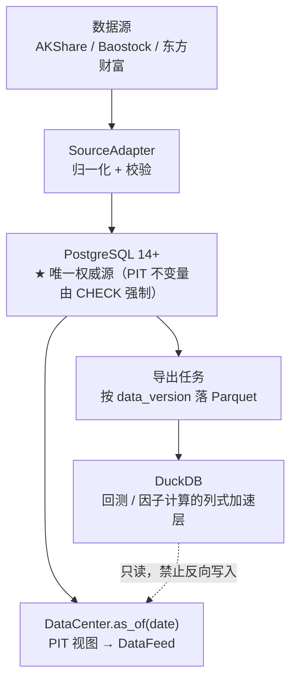

# 智能量化交易平台 — 数据中心接口契约文档 v1.0

> 本文件为**手工编写**的契约补充件，与 `智能量化交易平台-核心模块接口契约文档.md`（模块一 策略中心、模块二 回测引擎）配套使用，本契约编号承接为**模块四**。
>
> ⚠️ 注意：主契约 `.md` 由 `.docx` 转换生成，**重新转换会覆盖**。因此本文件的所有内容不写入主契约，避免被覆盖丢失。

## 文档信息

| 项目 | 内容 |
| --- | --- |
| 文档版本 | v1.0 |
| 对应主契约 | 智能量化交易平台 — 核心模块接口契约文档 v1.0 |
| 对应 PRD 模块 | 模块 1（数据中心） |
| 本契约编号 | 模块四 |
| PRD 需求出处 | `智能量化交易平台.md` 模块 1；`智能量化交易平台-数据中心数据源选型与接入规范.md` §3.2、§4.2、§6.1、§6.2、§7.1~§7.5、§八 |
| 技术栈 | Python（采集 / 清洗 / 服务）+ PostgreSQL 14+（唯一权威源）+ Parquet/DuckDB（派生加速层） |
| 通信协议 | 进程内 Python API（`DataFeed` 实现）+ REST（供 Java 平台层读取） |
| 目标读者 | AI Agent 开发引擎、数据工程师、架构师、量化研究员 |
| 约束级别 | **强约束** — 所有实现必须严格遵循本契约 |
| 覆盖的缺口 | `开工前缺口清单.md` 阻塞项 **B2** |
| 顺带补齐 | 主契约中被引用但从未定义的 `MarketStatus`、`DataFeedError`、`PITReport`、`LeakagePoint`（由 `tools/verify_contract_refs.py` 的 T2/T3 检查报出） |

---

## 一、设计决策记录（Decision Records）

本节是契约的**前提**。以下 10 条为已裁决项，实现时不得自行更改；如需变更须同步修订本节。

### D1 — 存储分层：PostgreSQL 是唯一权威源，Parquet 是派生加速层



- **权威源只有一个**：所有 PIT 语义（`available_date`、`effective_from/effective_to`）必须由带 `CHECK` 约束的关系表强制。Parquet 不可变、无约束、无并发写，做不了这件事。
- **Parquet/DuckDB 是缓存，不是真相**：可由权威源随时重建。**禁止**任何数据只存在于 Parquet 而不在 PostgreSQL。
- ⚠️ 不要把本层与风控层混为一谈：风控层的事务库（`db/risk_control.sql`）存的是「阈值配置 + 决策留痕」，与本层是两个独立选型决定，只是**恰好同类**（都用 PostgreSQL，全平台单一方言）。

> 为什么不直接选 DuckDB+Parquet 当唯一存储：一旦研究层与生产层各有一份数据，两份数据的 `as_of` 语义迟早漂移，而「防未来函数」这件事**只允许有一个解释**。

### D2 — 三日期模型：`trade_date` / `available_date` / `as_of_date` 严格分离

PRD 模块 1 明确要求「所有数据带时间戳，区分『数据所属日期』与『数据可获取日期』」。三者落地为：

| 名称 | 语义 | 谁提供 | 典型用途 |
| --- | --- | --- | --- |
| `trade_date` | **数据所属日期**（行情是哪一天的） | 数据源 | 行情主键、因子计算 |
| `available_date` | **数据可获取日期**（这一天起才能被人看到） | 本层计算 | 财务披露、指数调仓 |
| `as_of_date` | **会话可见日**（本次回测/推演"站在哪一天"） | 调用方 | 所有读取的过滤条件 |

**不变式**：任何返回的数据必须满足 `available_date <= as_of_date`。
**禁止**：用 `trade_date <= as_of_date` 代替。财报的 `trade_date`（报告期截止日）永远早于 `available_date`（披露日），混用即产生未来函数。

### D3 — `as_of_date` 是结构性约束，不是每个方法的可选参数

这是本契约**最重要**的一条决策。

错误做法（**禁止**）：给主契约 `DataFeed` 的 9 个方法各加一个 `as_of_date: date | None = None` 参数。
原因：可选参数意味着**可以忘传**，而忘传时程序不会报错，只会静默退化成「用最新数据」——这正是未来函数，且它只在回测收益异常漂亮时才被发现。

正确做法：**`DataFeed` 只能由 `DataCenter.as_of()` 产出**。

```python
center = DataCenter(dsn='...')
feed = center.as_of(date(2026, 1, 1), adjust_type=AdjustType.HFQ)
# feed 是一个『冻结在 2026-01-01 视角』的 DataFeed：
# 它的 9 个方法签名与主契约 §2.2.1 完全一致，但只可能看到 2026-01-01 之前已可见的数据。
```

- **禁止**在生产代码中直接实例化 `CsvDataFeed` / `AKShareDataFeed` 等具体数据源类。它们只允许由 `DataCenter` 内部构造。
- 忘传 `as_of_date` 变成**不可能**：拿不到 `DataFeed`，就没有任何读接口可调。
- 该约束由接口形状保证，不依赖代码评审。

### D4 — 行情与财务走不同的可用性推导规则

- **行情**（日线/分钟线）：交易日 `T` 收盘后可用 ⇒ `available_date = T`。盘中数据在回测中**一律不可用**（回测只消费日线收盘）。
- **财务**：`available_date = announce_date`，若 `announce_date` 为非交易日或当日为盘后披露，顺延到**下一个交易日**——但**绝不早于** `announce_date`。

数据源规范 §3.2 的原始要求（本契约将其固化为断言）：

> 「所有财务数据必须携带披露日期（Announcement Date）字段，回测时只能使用『截至当日已披露』的财报数据。例如，**2025 年 Q3 财报通常在 2026 年 4 月披露，那么在 2026 年 1 月 1 日的回测中，最新可用财报应该是 2025 年 Q2 的**。」

⇒ 在 `as_of_date = 2026-01-01` 下，`2025Q3`（`announce_date ≈ 2026-04-xx`）**必须查不到**。这是 §3.10 的强制测试用例。

### D5 — 指数成分股用 PIT 区间快照，禁止当前名单回溯

数据源规范 §4.2：

> 「必须维护 Point-in-Time（PIT）快照——即『在 2025 年 6 月 30 日这一天，沪深 300 到底包含哪些股票』。**不能用当前的成分股名单去回测历史**，否则就是严重的幸存者偏差。」

落地为**区间表**（`effective_from` / `effective_to`）而非逐日快照表：

- 逐日快照：5000 只 × 250 天 × 20 年 = 2500 万行/指数，且每次调仓要写 5000 行冗余。
- 区间表：每次调仓只写「调出 N 行 + 调入 M 行」，查询用 `effective_from <= as_of < effective_to`。
- `effective_to IS NULL` 表示「至今仍在成分内」——**注意**它不是「永远在内」，查询时必须显式处理 `NULL`，否则 `a <= x < NULL` 恒为 `FALSE`，会静默返回空集。

### D6 — 复权口径：回测用后复权，实盘用不复权，且复权因子本身也要 PIT 裁剪

数据源规范 §7.2：「回测统一用后复权（避免前复权引入未来信息），实盘用不复权价格。」

关键补充（规范未写明、但必须做）：**前复权因子是「以最新价为基准」计算的，今天算出的 `qfq` 因子包含了未来信息**。因此：

- 库中**只存不复权价 + 原始复权因子**（`dc_adjust_factor`），不存任何预计算复权价。
- 复权在**读取时按 `as_of_date` 现算**（`AdjustType.HFQ` / `QFQ` 都是视图行为）。
- `AdjustType.QFQ` 允许用于**实盘展示**，**禁止**用于回测；若在回测上下文中请求 `QFQ`，抛 `FutureDataAccessError`。

### D7 — 缺失值不回填；FFill 仅在显式开关下且不得跨越 `as_of_date`

数据源规范 §7.4：「提前定义好缺失值的填充规则（前向填充 FFill 还是后向填充 BFill），并在接口文档中明确。」

本契约的裁决：

- **默认 `FillPolicy.NONE`** —— 缺失就是缺失，返回 `None`，由策略自行决定。
- `FFill` 允许，但只允许**向前**（用更早的已知值填当前），且填充源必须同样满足 `available_date <= as_of_date`。
- **`BFill` 在生产与回测中一律禁止** —— 用未来值回填过去是最直白的未来函数。仅在**离线数据清洗脚本**中允许，且必须写入 `dc_quality_issue` 留痕。

### D8 — 数据版本不可变，回测结果必须绑定版本号

数据源规范 §7.3：「每次数据更新打版本号（如 v2026.09.23），回测结果必须绑定数据版本号，确保任何收益都能完整复现。」

- `dc_data_version` 中**同时只有一行 `is_active = TRUE`**（用唯一部分索引强制）。
- 版本号**追加不修改**：修正历史数据 = 产生新版本，不覆盖旧版本。
- `BacktestResult` 必须记录 `data_version`；缺失则回测不得标记为「可复现」。
- `DataCenter.as_of()` 默认使用当前 active 版本；`as_of(date, data_version='v2026.09.23')` 可复现历史结论。

### D9 — 适配器归一化：上层不感知数据源差异；落库必须带 `source` 与 `ingested_at`

PRD 模块 1：「统一 `DataFeed` 接口，屏蔽 CSV / 数据库 / API 差异。」

- `SourceAdapter` 负责把各家字段名/单位/空值约定**归一化到本契约的标准 schema**，并返回 `ValidationReport`。
- 每行数据落库必须带 `source`（哪个源）与 `ingested_at`（何时入库）——否则多源冗余出错时无法定位是谁污染的。
- **禁止**让源特有字段名（如东财的 `TRADE_DATE`、Baostock 的 `tradeStatus`）出现在本契约的任何数据类上。

### D10 — 增量更新幂等：按主键 upsert，重跑不产生重复

- 所有采集走 `dc_ingest_run` 记录批次（谁、何时、哪一段、成功/失败行数）。
- 所有写入用 `INSERT ... ON CONFLICT (<业务主键>) DO UPDATE`，**同一批次重跑结果必须与跑一次相同**。
- 采集任务失败后**重跑整段**即可修复，不需要人工挑数据——这是让 Agent 能无人值守重试的前提。

---

## 二、全局约定

### 2.1 命名与代码规范

- Python：`snake_case` 字段、`PascalCase` 类；数据类统一用 `@dataclass`。
- 数据库：**标识符一律小写、不加双引号**（PostgreSQL 折叠规则）；表前缀 `dc_` 表示 data center。
- 时间列一律 `timestamptz(3)`（绝对时刻）或 `date`（交易日/日期语义），**禁止**用 `timestamp`（无时区）。
- 金额、价格用 `numeric`，**禁止** `double precision`（浮点误差会累积到收益归因）。

### 2.2 时间口径（强约束）

| 场景 | 用法 | 说明 |
| --- | --- | --- |
| 交易日 / 报告期 / 生效日 | `datetime.date` | 无时间无时区，禁止塞入时间部分 |
| 入库时刻 / 事件时刻 | `datetime`（aware，`Asia/Shanghai`） | 带时区，落库为 `timestamptz(3)` |
| 时间戳（策略侧） | `pd.Timestamp` | 主契约 `BarData.timestamp` 用整数纳秒，转换处必须显式指定时区 |

- 展示与日志统一 `Asia/Shanghai`；存储不做本地化假设。
- **禁止**用字符串比较日期（`'2026-1-1' < '2026-01-05'` 为真，但 `'2026-10-01'` 会排在 `'2026-9-01'` 之前）。

### 2.3 单位与口径

| 字段 | 单位 | 说明 |
| --- | --- | --- |
| 价格（open/high/low/close） | 元 | 不复权原始价，保留 4 位小数 |
| `volume` | 股 | **不是手**；源若给「手」须 ×100 |
| `amount` | 元 | 成交额 |
| `adjust_factor` | 无量纲 | 累乘因子，`> 0` |
| `weight`（成分股权重） | 0~1 小数 | **禁止存百分数**（与风控层 D3 同规则） |
| 比率（涨跌幅、换手率） | 0~1 小数 | 同上 |
| `roe`（净资产收益率） | 小数比率，**可为负** | **不受上一行的 0~1 约束**。它 = 净利润/净资产，亏损公司必然为负，`0~1` 会把它们全部拒掉。区间 `[-1, 5]`，由 `ck_dc_fin_roe_range` 强制（见 §3.6.1） |

> `volume` 的「股 vs 手」与 `weight` 的「0.10 vs 10」是本层最容易出事故的两处，均已在 `db/data_center.sql` 中加 `CHECK` 约束。
>
> 另一个坑是把上表的「比率 0~1」当成**所有**比率字段的通用规则去套 —— `roe` 就是反例。凡是**相减得出、可为负**的比率（收益率、超额收益类）都不适用 0~1。

### 2.4 失败与降级（fail-closed）

| 情形 | 行为 |
| --- | --- |
| `as_of_date` 下数据不可见 | 抛 `DataNotAvailableError`，**不得**退化为「用最新数据」 |
| 请求了 `as_of_date` 之后的数据 | 抛 `FutureDataAccessError`（这是未来函数，属 CRITICAL） |
| 主数据源失败 | 降级到备源（`SourcePriority.FALLBACK`），落库标记 `source`，记 `WARNING` |
| 主备源都给不出数据 | 不写库、不猜测、抛 `DataNotAvailableError`，批次标记 `PARTIAL` |
| 数据质量校验失败 | **不阻断入库**，写 `dc_quality_issue` 并告警（阻断会导致长期无数据可用） |
| 数据版本缺失 | 抛 `DataVersionError`；回测结果不得标记为可复现 |

**总原则**：宁可让回测跑不起来，也不能让它带着未来函数跑完。所有「找不到数据」的分支都必须**显式失败**，不允许返回空集或默认值。

---

## 三、模块四：数据中心

### 3.1 数据模型

#### 3.1.1 表清单（9 张）

| # | 表名 | 用途 | PIT 关键列 |
| --- | --- | --- | --- |
| 1 | `dc_data_version` | 数据版本（不可变，单行 active） | `as_of_date` |
| 2 | `dc_trading_calendar` | 交易日历 | `trade_date` |
| 3 | `dc_symbol` | 标的基础信息（上市/退市/ST 历史） | `available_date` |
| 4 | `dc_daily_bar` | 日线行情（**不复权**） | `trade_date`（= `available_date`） |
| 5 | `dc_adjust_factor` | 复权因子 | `trade_date` |
| 6 | `dc_financial_report` | 财务三表 | `period_end` + **`announce_date`** + `available_date` |
| 7 | `dc_index_member` | 指数成分股 **PIT 区间快照** | `effective_from` / `effective_to` |
| 8 | `dc_ingest_run` | 采集批次日志（幂等与可追溯） | `ingested_at` |
| 9 | `dc_quality_issue` | 数据质量问题留痕 | `trade_date` |

可执行 DDL 见 **`db/data_center.sql`**（含枚举 CHECK 约束与版本种子）。本节为结构说明。

#### 3.1.2 PIT 三日期在表上的落地

```text
dc_daily_bar          trade_date      ← 数据所属日期；行情收盘后即可见，故 available_date = trade_date
dc_financial_report   period_end      ← 报告期截止日（数据所属日期）
                      announce_date   ← 披露日期（数据可获取日期）★ 唯一合法的可见性依据
                      available_date  ← = announce_date 或其后首个交易日（冗余存储，便于索引与校验）
dc_index_member       effective_from  ← 纳入生效日
                      effective_to    ← 调出生效日；NULL = 至今仍在成分内
```

**统一查询模板**（所有 PIT 读取都必须写成这个形状）：

```sql
-- 财务：取 as_of 视角下最新可见的一份财报
SELECT * FROM dc_financial_report
WHERE symbol = %s AND available_date <= %s          -- ★ 过滤键是 available_date，不是 period_end
ORDER BY period_end DESC
LIMIT 1;
```

#### 3.1.3 枚举定义

```python
class MarketStatus(Enum):
    """
    市场交易时段状态。

    ⚠️ 与主契约 §1.3.3 的 `MarketState`（市场状态：牛市/熊市/震荡，模块 3 的产物）
    只差一个字母但语义完全不同，实现时禁止互相赋值。
    本枚举回答「现在能不能交易」，`MarketState` 回答「现在是不是好时机」。

    主契约 §2.2.2 `CsvDataFeed` 使用了 `MarketStatus.OPEN` / `MarketStatus.CLOSED`，
    故保留这两个成员名以兼容。
    """
    PRE_OPEN = 'PRE_OPEN'        # 开盘前（9:15~9:30 集合竞价）
    OPEN = 'OPEN'                # 连续竞价（9:30~11:30, 13:00~15:00）
    LUNCH_BREAK = 'LUNCH_BREAK'  # 午间休市
    CLOSED = 'CLOSED'            # 收盘后或非交易日
    HALTED = 'HALTED'            # 全市场停市（熔断/极端情况）


class AdjustType(Enum):
    """复权类型。"""
    NONE = 'NONE'  # 不复权（实盘用）
    QFQ = 'QFQ'    # 前复权（含未来信息，禁止用于回测，见 D6）
    HFQ = 'HFQ'    # 后复权（回测默认）


class FillPolicy(Enum):
    """缺失值填充策略，见 D7。"""
    NONE = 'NONE'    # 不填充（默认，返回 None）
    FFILL = 'FFILL'  # 向前填充
    BFILL = 'BFILL'  # 向后填充（仅离线清洗脚本允许）


class SourcePriority(Enum):
    """数据源优先级，见 D9。"""
    PRIMARY = 'PRIMARY'    # 主源
    FALLBACK = 'FALLBACK'  # 备源（主源失败时降级使用）


class ReportType(Enum):
    """财务报表类型。"""
    BALANCE = 'BALANCE'    # 资产负债表
    INCOME = 'INCOME'      # 利润表
    CASHFLOW = 'CASHFLOW'  # 现金流量表
    INDICATOR = 'INDICATOR'  # 财务指标


class DataQualityFlag(Enum):
    """数据质量标记，见 §7.5 要求的每日完整性检查，见 D9。"""
    SUSPENDED = 'SUSPENDED'            # 停牌
    LIMIT_UP = 'LIMIT_UP'              # 涨停
    LIMIT_DOWN = 'LIMIT_DOWN'          # 跌停
    ST = 'ST'                          # ST/*ST
    NEW_LISTING = 'NEW_LISTING'        # 次新（上市未满 N 日）
    DELISTED = 'DELISTED'              # 已退市
    ABNORMAL_VOLUME = 'VOLUME_ANOMALY'  # 异常成交量
    MISSING = 'MISSING'                # 数据缺失
```

### 3.2 数据源适配器契约（采集侧）

```python
class SourceAdapter(ABC):
    """
    数据源适配器基类。一个数据源一个子类，负责把源特有格式归一化到本契约的标准 schema。

    职责:
        - 拉取（网络/文件 IO）
        - 字段名、单位、空值约定的归一化
        - 最低限度的格式校验（不是业务校验）

    不做:
        - 不写数据库（由 DataCenter 统一写入，见 D1/D10）
        - 不判断 as_of_date（采集关心「现在取得到什么」，不是「过去看得到什么」）
    """

    @abstractmethod
    def source_name(self) -> str:
        """
        返回数据源标识。

        返回:
            str: 源名，如 'akshare' / 'baostock' / 'eastmoney'。写入每行的 source 列。
        """
        pass

    @abstractmethod
    def fetch_daily_bar(
        self,
        symbols: List[str],
        start: date,
        end: date
    ) -> pd.DataFrame:
        """
        拉取日线行情（不复权）。

        参数:
            symbols: 标的代码列表，统一格式为 '600000.SH' / '000001.SZ'。
            start: 开始交易日。
            end: 结束交易日。

        返回:
            pd.DataFrame: 列名必须是标准 schema —— symbol / trade_date / open / high /
                low / close / volume / amount，且 trade_date 为 date 类型。

        异常:
            SourceAdapterError: 网络失败、限流、源返回格式无法解析时抛出。
        """
        pass

    @abstractmethod
    def fetch_financial(
        self,
        symbols: List[str],
        period_end: date
    ) -> pd.DataFrame:
        """
        拉取财务数据。

        参数:
            symbols: 标的代码列表。
            period_end: 报告期截止日（如 2025-09-30）。

        返回:
            pd.DataFrame: 必须包含列 —— symbol / report_type / period_end /
                **announce_date**（缺失该列即视为适配器不合格，见 D4）/ 各财务科目。
            源若只给「报告期」不给「披露日期」，适配器必须显式补全或抛出异常，
            **禁止**用 period_end 冒充 announce_date。

        异常:
            SourceAdapterError: 源不提供披露日期时抛出（不得静默降级）。
        """
        pass

    @abstractmethod
    def fetch_index_members(
        self,
        index_code: str,
        as_of_date: date
    ) -> pd.DataFrame:
        """
        拉取指数成分股（含历史调仓记录）。

        参数:
            index_code: 指数代码，如 '000300.SH'（沪深 300）。
            as_of_date: 获取截至该日已知的调仓记录（不是「该日的成分股名单」，
                名单由 DataCenter 用区间表计算，见 D5）。

        返回:
            pd.DataFrame: 列名 —— index_code / symbol / effective_from / effective_to
                / weight。effective_to 可为空表示仍在成分内。

        异常:
            SourceAdapterError: 源只提供当前名单而无历史时抛出（不得只存当前名单）。
        """
        pass

    @abstractmethod
    def validate(self, frame: pd.DataFrame) -> ValidationReport:
        """
        校验归一化后的数据帧（列齐备、类型正确、主键无重复、值域合理）。

        参数:
            frame: normalize 之后的 DataFrame。

        返回:
            ValidationReport: 校验报告；is_valid 为 False 时 DataCenter 不得写入。
        """
        pass
```

MVP 阶段必须实现的三个子类（依据数据源规范 §八：MVP 首选 AKShare + Baostock，财务用 AKShare 东方财富源）：

| 子类 | 覆盖 | `SourcePriority` | 备注 |
| --- | --- | --- | --- |
| `AKShareAdapter` | 行情 + 财务 + 指数成分股 + 龙虎榜 | PRIMARY | MVP 主源 |
| `BaostockAdapter` | 行情（含停牌/涨跌停标记） | FALLBACK | MVP 备源，**质量标记更全** |
| `EastMoneyAdapter` | 财务 + 指数成分股 + 资金流向 | FALLBACK | 财务交叉核对 |

### 3.3 数据服务接口（读侧，PIT 强制）

#### 3.3.1 DataCenter 入口

```python
class DataCenter(ABC):
    """
    数据中心入口。**这是获取 `DataFeed` 的唯一合法途径**（见 D3）。

    禁止在业务代码中直接实例化任何具体数据源类；否则 `as_of_date` 约束失效，
    未来函数会以「回测收益异常漂亮」的形式出现，而不是以异常的形式出现。
    """

    @abstractmethod
    def as_of(
        self,
        as_of_date: date,
        adjust_type: AdjustType = AdjustType.HFQ,
        fill_policy: FillPolicy = FillPolicy.NONE,
        data_version: str = ''
    ) -> DataFeed:
        """
        返回一个冻结在指定视角的 DataFeed。

        参数:
            as_of_date: 会话可见日。返回的 DataFeed 只可能看到 available_date <=
                as_of_date 的数据（绝对约束，不可绕过）。
            adjust_type: 复权口径。回测必须用 HFQ；请求 QFQ 且会话标记为回测时抛
                FutureDataAccessError（见 D6）。
            fill_policy: 缺失值策略，默认 NONE（见 D7）。
            data_version: 指定数据版本以复现历史结论；空字符串表示使用当前 active 版本。

        返回:
            DataFeed: 主契约 §2.2.1 定义的接口实例，其 9 个方法签名与主契约完全一致。

        异常:
            DataVersionError: 指定的 data_version 不存在或未激活。
            FutureDataAccessError: adjust_type 与运行模式冲突。
        """
        pass

    @abstractmethod
    def live(self, account_mode: str) -> DataFeed:
        """
        返回实盘 / 模拟盘视角的 DataFeed（as_of_date = 今日，adjust_type = NONE）。

        参数:
            account_mode: 'LIVE' 或 'SIM'，用于决定复权口径与是否允许盘中数据。

        返回:
            DataFeed: 实盘视角数据源。
        """
        pass

    @abstractmethod
    def trading_calendar(self, as_of_date: date) -> TradingCalendar:
        """
        返回该视角下的交易日历。

        参数:
            as_of_date: 会话可见日（日历本身也是 PIT 的：未来新增节假日不应被提前看到）。

        返回:
            TradingCalendar: 交易日历实例。
        """
        pass

    @abstractmethod
    def data_version(self) -> DataVersion:
        """
        返回当前 active 数据版本。

        返回:
            DataVersion: 版本对象，供 BacktestResult 绑定（见 D8）。
        """
        pass
```

#### 3.3.2 财务数据的 PIT 查询接口

```python
class FinancialDataService(ABC):
    """
    财务数据 PIT 查询服务。把 D4 的披露日期规则固化为接口行为。
    """

    @abstractmethod
    def latest_report(
        self,
        symbol: str,
        as_of_date: date,
        report_type: ReportType
    ) -> Optional[FinancialReport]:
        """
        返回 as_of_date 视角下**最新已披露**的财报。

        参数:
            symbol: 标的代码。
            as_of_date: 会话可见日。
            report_type: 报表类型。

        返回:
            Optional[FinancialReport]: 可见的最新财报；该视角下无任何已披露财报时返回 None。
            **注意**：返回 None 是「确实没有」，不是「查不到」——后者必须抛异常。

        异常:
            DataNotAvailableError: 标的不存在或数据版本缺失该标的。
        """
        pass

    @abstractmethod
    def report_history(
        self,
        symbol: str,
        as_of_date: date,
        report_type: ReportType,
        periods: int
    ) -> List[FinancialReport]:
        """
        返回 as_of_date 视角下最近 N 期已披露财报（按 period_end 降序）。

        参数:
            symbol: 标的代码。
            as_of_date: 会话可见日。
            report_type: 报表类型。
            periods: 期数。

        返回:
            List[FinancialReport]: 财报列表，长度可能小于 periods（历史不足）。
        """
        pass
```

**D4 的固化断言**（§3.10 强制测试项）：

| `as_of_date` | 期望 `latest_report` 的 `period_end` | 理由 |
| --- | --- | --- |
| 2026-01-01 | 2025-06-30（2025Q2） | 2025Q3 于 2026-04 才披露 |
| 2026-04-30 | 2025-09-30（2025Q3） | 此时 2025Q3 已披露 |
| 无任何已披露财报 | `None` | 不猜测、不退化为 `period_end` 过滤 |

#### 3.3.3 指数成分股 PIT 查询接口

```python
class IndexMemberService(ABC):
    """
    指数成分股 PIT 查询服务。把 D5 的区间快照规则固化为接口行为。
    """

    @abstractmethod
    def members(self, index_code: str, as_of_date: date) -> List[IndexMemberSnapshot]:
        """
        返回 as_of_date 当日的成分股名单。

        参数:
            index_code: 指数代码。
            as_of_date: 会话可见日。

        返回:
            List[IndexMemberSnapshot]: 成分股列表。
            **禁止**用当前名单代替：这会产生幸存者偏差，且偏差方向是「历史收益被系统性高估」，
            即最不容易被怀疑的方向。

        异常:
            DataNotAvailableError: 该指数无 PIT 记录（只有当前名单）时抛出。
        """
        pass

    @abstractmethod
    def membership_changes(
        self,
        index_code: str,
        start: date,
        end: date
    ) -> List[MembershipChange]:
        """
        返回区间内的调仓事件（用于事件驱动策略与归因）。

        参数:
            index_code: 指数代码。
            start: 开始日期。
            end: 结束日期。

        返回:
            List[MembershipChange]: 调仓事件列表。
        """
        pass
```

### 3.4 数据类定义

```python
@dataclass
class DataVersion:
    """
    数据版本。不可变，见 D8。
    """
    data_version: str
    """str: 版本号，格式 `vYYYY.MM.DD`（如 'v2026.09.23'）。"""

    as_of_date: date
    """date: 该版本涵盖到哪个交易日。"""

    created_at: datetime
    """datetime: 版本生成时刻（Asia/Shanghai）。"""

    is_active: bool
    """bool: 是否为当前生效版本。全表最多一行为 True。"""

    notes: str
    """str: 版本说明（如『修正 2025-08 成交量单位错误』）。"""


@dataclass
class FinancialReport:
    """
    财务数据记录。三日期语义见 D2/D4。
    """
    symbol: str
    """str: 标的代码。"""

    report_type: ReportType
    """ReportType: 报表类型。"""

    period_end: date
    """date: 报告期截止日（**数据所属日期**）。"""

    announce_date: date
    """date: 披露日期（**数据可获取日期**）。来自源的 Announcement Date 字段。"""

    available_date: date
    """date: 可用日期 = announce_date 或其后首个交易日。**所有查询的过滤键**。"""

    revenue: Optional[float]
    """Optional[float]: 营业收入（元）。"""

    net_profit: Optional[float]
    """Optional[float]: 净利润（元）。"""

    total_assets: Optional[float]
    """Optional[float]: 总资产（元）。"""

    total_equity: Optional[float]
    """Optional[float]: 净资产（元）。"""

    roe: Optional[float]
    """Optional[float]: 净资产收益率 = 净利润/净资产，小数比率（**不是百分数**）。

    可为负值：亏损公司必然 ROE < 0，故**不适用 §2.3 的 0~1 通用比率口径**。
    合法区间 [-1, 5]，由数据库约束 ck_dc_fin_roe_range 强制（见 §3.6.1）。
    """

    source: str
    """str: 数据来源标识，见 D9。"""

    data_version: str
    """str: 所属数据版本，见 D8。"""


@dataclass
class IndexMemberSnapshot:
    """
    指数成分股 PIT 区间记录。见 D5。
    """
    index_code: str
    """str: 指数代码。"""

    symbol: str
    """str: 成分股代码。"""

    effective_from: date
    """date: 纳入生效日（含）。"""

    effective_to: Optional[date]
    """Optional[date]: 调出生效日（不含）；None 表示至今仍在成分内。"""

    weight: Optional[float]
    """Optional[float]: 权重，0~1 小数；None 表示源未提供。"""

    source: str
    """str: 数据来源标识。"""

    data_version: str
    """str: 所属数据版本。"""


@dataclass
class MembershipChange:
    """
    指数调仓事件。
    """
    index_code: str
    """str: 指数代码。"""

    symbol: str
    """str: 标的代码。"""

    change_type: str
    """str: 'IN'（调入）或 'OUT'（调出）。"""

    effective_date: date
    """date: 生效日。"""


@dataclass
class QualityIssue:
    """
    数据质量问题记录（见 §7.5）。
    """
    symbol: str
    """str: 标的代码。"""

    trade_date: date
    """date: 问题所属交易日。"""

    flag: DataQualityFlag
    """DataQualityFlag: 问题类型。"""

    detail: str
    """str: 详情。"""

    severity: str
    """str: 'CRITICAL' / 'WARNING' / 'INFO'。"""


@dataclass
class ValidationReport:
    """
    适配器数据校验报告。本类补齐主契约中从未定义的 `ValidationReport`。
    """
    is_valid: bool
    """bool: 是否通过校验。"""

    row_count: int
    """int: 校验的总行数。"""

    errors: List[str]
    """List[str]: 导致失败的硬错误（列缺失、主键重复、类型错误）。任一非空即 is_valid=False。"""

    warnings: List[str]
    """List[str]: 不阻断入库的告警（值域可疑、缺失率偏高）。"""

    missing_ratio: Dict[str, float]
    """Dict[str, float]: 各列缺失率，0~1 小数。"""


@dataclass
class PITReport:
    """
    Point-in-Time 一致性检查报告。本类补齐主契约 §2.7.1 中从未定义的 `PITReport`。
    """
    symbol: str
    """str: 标的代码。"""

    as_of_date: date
    """date: 会话可见日。"""

    field: str
    """str: 被检查的字段。"""

    is_consistent: bool
    """bool: 是否满足 PIT 一致性。"""

    visible_value: Optional[float]
    """Optional[float]: 在 as_of_date 视角下实际取到的值。"""

    latest_visible_date: Optional[date]
    """Optional[date]: 该视角下真正可见的最新日期（应与查询过滤键一致）。"""

    message: str
    """str: 说明。"""


@dataclass
class LeakagePoint:
    """
    一个未来函数泄露点。本类补齐主契约 §2.7.2 中从未定义的 `LeakagePoint`。
    """
    symbol: str
    """str: 标的代码。"""

    trade_date: date
    """date: 被访问的交易日。"""

    as_of_date: date
    """date: 会话可见日。"""

    field: str
    """str: 被访问的字段。"""

    reason: str
    """str: 泄露原因（如 '访问了 available_date=2026-04-28 的财报，而 as_of=2026-01-01'）。"""

    severity: str
    """str: 'CRITICAL' / 'WARNING' / 'INFO'。"""
```

### 3.5 交易日历

风控层契约 §四「局限与后续」已明确：`max_daily_trades` 的『当日』口径依赖数据中心提供交易日历。本契约提供：

```python
class TradingCalendar(ABC):
    """
    交易日历。**所有需要「第 N 个交易日」语义的模块必须通过本接口计算**，
    禁止自行用自然日加减。
    """

    @abstractmethod
    def is_trading_day(self, d: date) -> bool:
        """
        判断是否交易日。

        参数:
            d: 日期。

        返回:
            bool: 是否交易日。
        """
        pass

    @abstractmethod
    def next_trading_day(self, d: date) -> date:
        """
        返回 d 之后的第一个交易日（d 本身为交易日时必须返回**下一个**）。

        参数:
            d: 日期。

        返回:
            date: 下一个交易日。用于把盘后披露的财报顺延到可用日（见 D4）。

        异常:
            DataNotAvailableError: 日历覆盖范围不足时抛出（不得外推）。
        """
        pass

    @abstractmethod
    def prev_trading_day(self, d: date) -> date:
        """
        返回 d 之前的最后一个交易日。

        参数:
            d: 日期。

        返回:
            date: 上一个交易日。
        """
        pass

    @abstractmethod
    def trading_days(self, start: date, end: date) -> List[date]:
        """
        返回区间内全部交易日（含端点）。

        参数:
            start: 开始日期。
            end: 结束日期。

        返回:
            List[date]: 交易日列表，升序。
        """
        pass

    @abstractmethod
    def shift(self, d: date, n: int) -> date:
        """
        沿交易日历平移 n 个交易日（n 可负）。

        参数:
            d: 基准日期。
            n: 平移交易日数；0 表示若 d 非交易日则取其后首个交易日。

        返回:
            date: 平移结果。
        """
        pass
```

### 3.6 持久化结构

可执行 DDL 见 **`db/data_center.sql`**。落地约定与风控层 §3.6 一致（全平台单一方言）：

| # | 约定 | 说明 |
| --- | --- | --- |
| 1 | 标识符不加双引号、全小写 | PostgreSQL 折叠规则；`dc_daily_bar` 而非 `DcDailyBar` |
| 2 | 时间列一律 `timestamptz(3)`，日期列一律 `date` | 禁止无时区的 `timestamp` |
| 3 | 价格/金额 `numeric(18,4)`，比率/权重 `numeric(10,6)` | 禁止 `double precision` |
| 4 | 布尔用 `boolean`；自增用 `GENERATED ALWAYS AS IDENTITY` | 不用 `tinyint`/`serial` |
| 5 | 关键不变量下沉为 `CHECK` 约束 | 见 §3.6.1 |
| 6 | 写入用 `INSERT ... ON CONFLICT DO UPDATE` | 幂等，见 D10 |
| 7 | 分区只能建表时声明 | MVP 用单表 + 定期归档，未来再迁移分区表 |

#### 3.6.1 数据库级不变量（最后防线）

| 约束名 | 表 | 强制内容 | 依据 |
| --- | --- | --- | --- |
| `ck_dc_fin_announce_after_period` | `dc_financial_report` | `announce_date >= period_end` | D4 |
| `ck_dc_fin_available_ge_announce` | `dc_financial_report` | `available_date >= announce_date` | D4 |
| `ck_dc_fin_report_type` | `dc_financial_report` | `report_type IN ('BALANCE','INCOME','CASHFLOW','INDICATOR')` | §3.1.3 |
| `ck_dc_fin_roe_range` | `dc_financial_report` | `roe IS NULL OR (roe >= -1 AND roe <= 5)` | §2.3 |
| `ck_dc_member_effective_range` | `dc_index_member` | `effective_to IS NULL OR effective_to > effective_from` | D5 |
| `ck_dc_member_weight_range` | `dc_index_member` | `weight IS NULL OR (weight >= 0 AND weight <= 1)` | §2.3 |
| `ck_dc_bar_price_positive` | `dc_daily_bar` | `open > 0 AND high > 0 AND low > 0 AND close > 0` | §2.3 |
| `ck_dc_bar_ohlc_order` | `dc_daily_bar` | `high >= low AND high >= open AND high >= close AND low <= open AND low <= close` | §2.3 |
| `ck_dc_bar_volume_nonneg` | `dc_daily_bar` | `volume >= 0 AND amount >= 0` | §2.3 |
| `ck_dc_factor_positive` | `dc_adjust_factor` | `adjust_factor > 0` | D6 |
| `ck_dc_quality_flag` | `dc_quality_issue` | `flag IN ('SUSPENDED','LIMIT_UP','LIMIT_DOWN','ST','NEW_LISTING','DELISTED','VOLUME_ANOMALY','MISSING')` | §3.8 |
| `ck_dc_quality_severity` | `dc_quality_issue` | `severity IN ('CRITICAL','WARNING','INFO')` | §2.2 |
| `ck_dc_ingest_status` | `dc_ingest_run` | `status IN ('RUNNING','SUCCESS','PARTIAL','FAILED')` | D10 |
| `ck_dc_ingest_priority` | `dc_ingest_run` | `priority IN ('PRIMARY','FALLBACK')` | D9 |
| `ck_dc_symbol_delist_after_list` | `dc_symbol` | `delist_date IS NULL OR list_date IS NULL OR delist_date > list_date` | §2.3 |
| `ck_dc_version_format` | `dc_data_version` | `data_version ~ '^v[0-9]{4}\.[0-9]{2}\.[0-9]{2}$'` | D8 |

共 **16 条**。清单与 `db/data_center.sql` 的实际声明由 `tools/verify_data_center.py` **双向核对**（C2 契约有而 DDL 无、C3 DDL 有而契约无、C4 声明不在表体内），任一方向不一致即 FAIL。

单行表约束：`dc_data_version` 的 `is_active` 用**唯一部分索引**保证最多一行 `TRUE`（`CHECK` 做不到跨行约束，见 DDL 注释）。

> **写进 DDL ≠ 生效。** 表达式写错、枚举少了成员、改了 DDL 却没迁移，这些都能通过静态检查。
> 唯一能证明约束真的会拒绝非法值的，是在真实 PostgreSQL 上执行 `db/data_center.sql` 并跑触发测试。
> **该 DDL 已于 2026-09-23 执行**：容器 `postgres:17`（PostgreSQL 17.11，Debian），
> 本表 16 条约束的触发测试 **42 passed / 0 failed**，证据 `tools/sql-smoke-report.txt`（含镜像 digest）。
> 因此 §3.6.1 已从「纸面防线」升为**在一个版本上实测通过**；但只跑过那一个镜像，
> DDL 标题里的「PostgreSQL 14+」仍未证实，且改过 `db/*.sql` 后此结论作废。

### 3.7 PIT 一致性校验（补齐主契约 §2.7 的缺失类型）

主契约 §2.7.1 定义了 `DataIntegrityChecker`，但其返回类型 `PITReport`、`LeakagePoint` 从未定义。本契约补齐（见 §3.4），并约定实现方式：

```python
class PITGuard:
    """
    PIT 守卫。两层防护中的第二层（第一层是 D3 的接口形状约束）。

    职责:
        在 DataFeed 实现内部记录每次读取的 (symbol, trade_date, field)，
        与当前会话的 as_of_date 比对，任何「读到了 as_of 之后才可见的数据」
        都必须立即抛 FutureDataAccessError。

    为什么需要它:
        接口形状能防住「忘了传 as_of_date」，防不住「传了 as_of_date 但实现里没过滤」。
        后者是真正会发生的 bug，必须在运行时炸掉而不是静默返回。
    """

    @abstractmethod
    def record_access(self, symbol: str, trade_date: date, field: str) -> None:
        """
        记录一次数据访问，并在越界时抛异常。

        参数:
            symbol: 标的代码。
            trade_date: 被访问数据的所属日期。
            field: 字段名。

        异常:
            FutureDataAccessError: 该数据的 available_date > as_of_date 时抛出。
        """
        pass

    @abstractmethod
    def report(self) -> PITReport:
        """
        返回当前会话的 PIT 一致性报告。

        返回:
            PITReport: 报告；is_consistent 为 False 表示检测到越界访问。
        """
        pass

    @abstractmethod
    def leakage_points(self) -> List[LeakagePoint]:
        """
        返回检测到的全部泄露点。

        返回:
            List[LeakagePoint]: 泄露点列表，供主契约 DataIntegrityChecker 消费。
        """
        pass
```

### 3.8 数据质量检查

数据源规范 §7.5 要求「每日数据入库后自动运行完整性检查」：

| 检查项 | `DataQualityFlag` | 判据 | 处理 |
| --- | --- | --- | --- |
| 停牌股标记 | `SUSPENDED` | `volume = 0` 且源标记停牌 | 写 `dc_quality_issue`；回测撮合时禁止成交 |
| 涨跌停标记 | `LIMIT_UP` / `LIMIT_DOWN` | 收盘价触及涨跌停价 | 写标记；撮合时该价位不得成交（流动性约束） |
| 异常成交量告警 | `ABNORMAL_VOLUME` | `volume > 20 × 20 日均量` | 告警，不阻断 |
| 数据缺失率统计 | `MISSING` | 单标的单日缺失列数 > 0 | 写 `dc_quality_issue`；**不回填**（D7） |
| 次新/退市 | `NEW_LISTING` / `DELISTED` | 上市未满 N 日 / 已退市 | 写标记；股票池可据此过滤 |

> 停牌与涨跌停标记不是「质量问题的告警」，而是**回测撮合正确性的输入**：主契约 `SimulatedBroker` 若不看这两个标记，会在停牌日正常成交、在跌停日按跌停价卖出，回测收益会系统性偏高。

### 3.9 错误码

| 错误码 | 异常类 | 级别 | 描述 | 建议措施 |
| --- | --- | --- | --- | --- |
| DATA_001 | `DataNotAvailableError` | ERROR | 该 `as_of_date` 下数据不可见或不存在 | 检查 `available_date` 与数据版本；**不要**退化为取最新 |
| DATA_002 | `FutureDataAccessError` | CRITICAL | 检测到未来函数（访问了 `as_of_date` 之后的数据） | 立即中断回测；检查策略与数据源的 PIT 过滤 |
| DATA_003 | `DataQualityError` | WARNING | 数据质量校验未通过 | 查看 `dc_quality_issue`；确认是否影响回测可比性 |
| DATA_004 | `DataVersionError` | ERROR | 数据版本缺失 / 未激活 / 与结果不匹配 | 检查 `dc_data_version`；回测结果须绑定版本 |
| DATA_005 | `SourceAdapterError` | ERROR | 数据源拉取或解析失败 | 检查网络与源接口；必要时降级到备源 |
| DATA_006 | `CalendarError` | ERROR | 交易日历覆盖范围不足 | 扩展日历数据；**禁止**外推 |
| DATA_007 | `IngestConflictError` | ERROR | 幂等写入时检测到同版本同主键的冲突值 | 检查是否并发跑了两份采集；按 D10 重跑 |

```python
class DataCenterError(Exception):
    """
    数据中心异常基类。
    """
    pass


class DataFeedError(DataCenterError):
    """
    数据源接口异常。本类补齐主契约 §2.2.1 中引用但从未定义的 `DataFeedError`。
    """
    pass


class DataNotAvailableError(DataFeedError):
    """
    该 as_of_date 视角下数据不可见（对应 DATA_001）。
    """
    pass


class FutureDataAccessError(DataFeedError):
    """
    访问了 as_of_date 之后才可见的数据，即未来函数（对应 DATA_002）。
    """
    pass


class DataQualityError(DataCenterError):
    """
    数据质量校验未通过（对应 DATA_003）。
    """
    pass


class DataVersionError(DataCenterError):
    """
    数据版本异常（对应 DATA_004）。
    """
    pass


class SourceAdapterError(DataCenterError):
    """
    数据源适配器异常（对应 DATA_005）。
    """
    pass


class CalendarError(DataCenterError):
    """
    交易日历异常（对应 DATA_006）。
    """
    pass


class IngestConflictError(DataCenterError):
    """
    采集幂等冲突（对应 DATA_007）。
    """
    pass
```

### 3.10 测试要求

| 模块 | 测试场景 | 覆盖要求 |
| --- | --- | --- |
| DateCenter.as_of | 视图冻结：`as_of(T)` 返回的 feed 在任何调用下都不得看到 `available_date > T` 的数据 | 必须 |
| DateCenter.as_of | 传 `AdjustType.QFQ` 且会话为回测 ⇒ 必须抛 `FutureDataAccessError` | 必须 |
| 财务 PIT | **D4 断言表三行全部通过**：`as_of=2026-01-01` ⇒ 2025Q2；`as_of=2026-04-30` ⇒ 2025Q3；无已披露 ⇒ `None` | 必须 |
| 财务 PIT | 反向验证：构造一条 `announce_date` 在 `as_of` 之后的记录，必须查不到（防「过滤键写成了 `period_end`」） | 必须 |
| 指数成分股 PIT | `effective_to IS NULL` 的记录必须能被查到（防 `a <= x < NULL` 恒假导致静默空集） | 必须 |
| 指数成分股 PIT | 用当前名单冒充历史 ⇒ 必须抛 `DataNotAvailableError` | 必须 |
| 适配器 | 归一化：源字段名不得泄漏到输出列；`volume` 手/股换算正确；`announce_date` 缺失必须抛异常而非补 `period_end` | 必须 |
| 适配器 | `validate` 对列缺失 / 主键重复 / 类型错误必须返回 `is_valid=False` | 必须 |
| 幂等 | 同一批次采集连跑两次，第二次结果与第一次逐行相同，行数不增加 | 必须 |
| 数据版本 | 版本号不可变：修改历史数据必须产生新版本，旧版本查询结果不变 | 必须 |
| 交易日历 | 边界：`next_trading_day` 对交易日必须返回下一个；跨节假日、跨年正确；超范围抛异常而非外推 | 必须 |
| 缺失值 | 默认 `FillPolicy.NONE` 返回 `None`；`FFILL` 不得引用 `available_date > as_of` 的值；`BFILL` 在回测上下文抛异常 | 必须 |
| PITGuard | 构造一次越界读取，必须抛 `FutureDataAccessError` 且 `PITReport.is_consistent=False` | 必须 |
| 静态一致性 | `tools/verify_contract_refs.py` 对本契约审计为 `verdict: CLEAN` | 必须 |
| 数据库不变量 | `db/data_center.sql` 在真实 PostgreSQL 执行后，§3.6.1 每条约束都有「必须失败」的样本 | 必须 |

---

## 四、局限与后续

1. ✅ **`db/data_center.sql` 已执行**（2026-09-23，容器 `postgres:17`/17.11，由 `tools/run_sql_smoke.py` 起库）。§3.6.1 的 16 条约束的触发测试 **42 passed / 0 failed**（证据 `tools/sql-smoke-report.txt`），其中 A6 关于「部分唯一索引违反时 `CONSTRAINT_NAME` 是否有效」的假设也在同一轮得到**肯定**答案。已完成的部分不重复。
   **仍未闭环**：① 只跑过 `postgres:17` 一个镜像 ⇒ DDL 标题的「PostgreSQL 14+
   」仍未证实；② 绿的有效性已**逐条**证伪全部 30 条命名 CHECK（`tools/falsify_smoke.py`，
   31 个案例 / 31 CAUGHT，逐案例证据 `tools/falsify-report.txt`），但判据是「恰好一条样本变红」
   这个签名，**不**逐值证明「每个样本值都落在拒绝区间内」；③ 改过任何 `db/*.sql` 后那轮结果作废，
   必须重跑 —— 报告是快照。
2. **分钟线 / Tick 未纳入本契约**。MVP 只做日线；接入分钟线时 `dc_daily_bar` 需扩展为 `dc_bar`（带 `freq` 列）或新建表，且**必须保留同一套 PIT 语义**。
3. **另类数据（§5.1 的 7 类）未纳入**，按数据源规范建议放在进化版阶段。
4. **因子库未纳入**。因子属于研究层产物，是否入库、如何绑定 `data_version` 待定。
5. **跨源冲突仲裁规则未定**：主备源对同一 `(symbol, trade_date)` 给出不同值时，当前约定是「主源优先 + 记录 `source`」，未定义「差异超过阈值时告警」的规则。
6. **`dc_symbol` 的 ST 历史**需要 PIT（某日是否是 ST 会变），本契约已保留 `available_date`，但字段级设计待补。
7. 主契约中另有 20 余个被引用但从未定义的类型（策略配置、策略异常基类、目标仓位、订单类型、绩效指标等），**不属于本契约范围**，需由策略中心 / 交易执行 / 绩效归因各自的补充契约补齐（见 `开工前缺口清单.md` 阻塞项 B7 的完整清单）。本契约刻意**不在此处列出它们的标识符**——避免读者误以为本契约已定义，也避免静态审计工具把它们算作本契约的缺口。

---

## 五、变更记录

| 版本 | 日期 | 作者 | 变更内容 |
| --- | --- | --- | --- |
| v1.0 | 2026-09-23 | 架构组 | 初始版本。裁决存储分层（PostgreSQL 权威源 + Parquet 派生层）、三日期 PIT 模型、`as_of_date` 结构性约束（`DataCenter.as_of()` 为唯一入口）、披露日期规则、指数成分股区间快照、复权口径、缺失值策略、数据版本绑定、适配器归一化、增量幂等共 10 条决策；补齐主契约未定义的 `MarketStatus`、`DataFeedError`、`PITReport`、`LeakagePoint`、`ValidationReport`；给出 16 条数据库级不变量（与 `db/data_center.sql` 由 `tools/verify_data_center.py` 双向核对）与配套测试要求 |

## 附录 A：I2 S1 实现侧裁决与偏差登记

> 本附录记录 I2 S1 的**实现侧裁决与偏差**。它与主契约的附录 E 性质不同：本文件**不是**
> `.docx` 派生的（`docs/` 下没有同名的 `.docx`），所以它可以被直接编辑，也不必登记进
> `tools/verify_md_coverage.py` 的 `ADDENDA` —— 那个清单只对「有 `.docx` 对应物、重新转换
> 会覆盖」的文件生效；登记在这里只会变成一条**永远不会被检查的死条目**。机器可读的那一份在
> `tools/contract-signature-manifest.json` 的 `impl_only` 段。

### A1. `DataFeedError` 的继承只能有一份（§3.9 与主契约 §2.2.1 的冲突）

§3.9 写 `class DataFeedError(DataCenterError)`，而主契约 §2.2.1 已经定义了
`class DataFeedError(QuanAutoError)`。Python 的同一个模块里不可能存在两个同名类。

**裁决**：沿用主契约已存在的 `DataFeedError(QuanAutoError)`，把 `DataNotAvailableError`
与 `FutureDataAccessError` 挂到它下面；`DataCenterError` 只作其余数据中心异常的根。

**为什么可以这样裁**：§3.9 真正被依赖的性质是「`except DataFeedError` 能抓住
`FutureDataAccessError`」，这一条仍然成立；主契约那边的断言一个字都没动。

**代价（说清楚，不掩饰）**：`except DataCenterError` **抓不到** `FutureDataAccessError`
（它只认 `QuanAutoError` 这条链）。这不是笔误，是取舍。

### A2. `DataCenter.as_of()` 缺会话参数 ⇒ 实现侧引入本地类型 `SessionMode`

D6 说 QFQ「实盘展示允许、回测禁止」，D7 说 BFILL「回测禁止、离线清洗脚本允许」——
两条判据都需要知道「现在是回测还是实盘」，而 §3.3 的 `as_of(...)` 没有这个参数。

**裁决**：实现侧加一个**本地**枚举 `SessionMode`（`BACKTEST` / `LIVE`），不写进 §3.1 的
契约枚举表（本迭代不给契约加东西）。它登记在 `tools/contract-signature-manifest.json`
的 `impl_only` 段，改名或删除会 FAIL。

**已知缺口**：契约侧没有这个参数 ⇒ 「调用方必须告诉数据中心自己在回测」这件事**没有静态
判据**，目前只有「默认值是 `BACKTEST`」加上「实盘路径尚未实现」兜着。

### A3. 「越界」的两种语义：显式日期参数**抛**，列表方法**裁剪**

契约只说「不得访问 `available_date > as_of_date` 的数据」，没说越界时该抛还是该裁。
两种读法都合规，所以实现必须选一个、写清楚，并且让机器能看见这个选择：

- 调用方**点名了一个日期**（`get_bar(symbol, datetime)`、`get_bars(symbol, start, end)`、
  `get_market_status(datetime)`、`get_trading_calendar(start, end)`）⇒ 抛
  `FutureDataAccessError`。理由：日期是调用方给的，越界意味着调用方的时钟与本次会话的
  `as_of_date` 不一致，静默裁剪会把它变成「少了几行数据的正常结果」。
- 方法返回**候选集**（`get_available_dates(symbol)`、`get_available_symbols()`）⇒ 裁剪。
  理由：这两个方法的语义就是「有哪些数据可看」，返回空集是正确答案而不是错误。

**机器判据**：`tools/verify_data_center_pit.py` 的 P4 要求每个带日期参数的公有方法都能
（顺着 `self.` 调用闭包）走到 `_require_visible`。

### A4. 日线的 `field` 填 `"bar"`

§3.7 的 `record_access(symbol, available_date, field)` 只规定 `field` 是「字段名」，
没规定日线该填什么。日线以**整行**为访问单位（`BarData` 不可分割），所以实现填常量
`"bar"`；只有单字段读取（财务的 `revenue` 之类）才该填真实列名。
`tests/test_data_center_pit.py` 把这个值钉住了——钉住的目的是让改动可见，不是因为它神圣。

### A5. `PITGuard.report()` 的单数语义

§3.7 的签名返回**一个** `PITReport`。实现跟随签名（`report()` 返回单数），另提供
`leakage_points()` 给「泄露点不止一处」的场景；`LeakagePoint` 是为此补的本地类型。

### A6. 复权因子恒 1.0（**已知缺口，I2 S3 关闭**）

S1 里 `get_adjustment_factor()` 一律返回 `1.0`、`get_dividend()` 一律返回 `0.0`：
这两个方法的**守卫**（越界即抛）已经就位，**数值**还没接真实数据。也就是说 S1 的回测口径
等于「不复权」。`tests/test_data_center_pit.py` 里有一条用例**故意断言这个错值**；
S3 落地时应当**删掉那条用例并销掉这条缺口**，而不是把期望值改成正确值。

### A7. `DailyBar` 不含 `ingested_at`

`dc_daily_bar` 有 `ingested_at`，`DailyBar` 刻意没有：同一个
`(symbol, trade_date, data_version)` 重新入库一次，不该让内存里的行「看起来变了」，
否则同一份数据在下游会变成两个不同的对象（与 D8 的数据版本语义冲突）。

### A8. 本契约**没有**被机器判据覆盖的部分

- `DataCenter.live()` 与 `DataCenter.trading_calendar()` 在 S1 只有 `NotImplementedError`
  占位（登记在清单的 `impl_only` 段 + 本条），**没有**它们的正确性判据。
- `PITReport` / `LeakagePoint` 的**字段顺序**与 §3.4 的对齐没有机器判据
  （`impl_only` 只查方法，不查 `@dataclass` 的字段）。
- §3.2 的 `SourceAdapter` 5 个方法、§3.8 的数据质量规则、财务 / 指数成分股 / 幂等入库：
  I2 S1 未实现，本附录不为它们背书。
- 越界判据只覆盖 `DbDataFeed`（带 `as_of` 的实现体）。`CsvDataFeed` 没有 `as_of` 概念
  （它读整个 CSV），**不在** P3/P4 的覆盖范围内；`tools/verify_data_center_pit.py` 会把
  这类「无界 feed」的个数打印成 `unbounded_feeds=`，以免有人以为它一起被检查了。

### A9. 本附录对应的判据与证据

| 这一条由谁盯 | 位置 |
| --- | --- |
| 结构：两层防线还在、`as_of()` 是唯一入口、D6/D7 仍被拒绝 | `tools/verify_data_center_pit.py`（P0~P9；已接入 `tools/run_all_gates.py`，tier A） |
| 行为：越界必须抛、回测会话里的 QFQ/BFILL 必须被拒 | `tests/test_data_center_pit.py`（含 I2 触发测试：store 忽略窗口时 `record_access` 会抛 `FutureDataAccessError`） |
| 签名漂移：本附录提到的类 / 方法不许被改名或改参数 | `tools/contract-signature-manifest.json` 的 `impl_only` 段 |
| §3.9 的异常码表（DATA_001~DATA_007）与实现的对应 | **无机器判据，已知缺口**（`verify_contract_signature.py` 只对主契约的 `classes` 段逐字核对） |

---

## 附录 B：I2 S2 实现侧裁决与偏差登记（数据源适配器）

本附录接着附录 A 往下写，登记的仍是**实现侧**做过的裁决、契约没写清的地方、以及**没有被验证**
的东西。对应的实现是 `quanauto/datasources.py`（采集侧适配器，契约 §3.2）；对应的判据是
`tools/verify_data_center_adapter.py`（tier A，已接入 `tools/run_all_gates.py`）。下面提到
`A0`~`A10` 时都指这个门禁里的探测器编号，**不是**附录 A 的条目编号。

### B1. `ValidationReport` 从 3 字段占位升格为 §3.4 的 5 字段

I2 S1 用的是 `is_valid` / `warnings` / `issues` 三字段的占位版。S2 按 §3.4 的类块升格为
`is_valid` / `row_count` / `errors` / `warnings` / `missing_ratio`。这不是「多加了两个字段」：
`issues` 被 `errors` 取代，而契约对 `errors` 与 `warnings` 的分工有明确说法
（`errors` 任一非空即 `is_valid=False`，`warnings` 不阻断入库）—— 三字段版把两者合成一个字段，
等于**丢掉了「阻断 / 不阻断」这个区分**。`missing_ratio` 按列名给缺失率，不适用的场景留 `{}`，
**不伪造比值**。

### B2. pandas 是这一层的显式依赖

§3.2 的方法签名直接写 `pd.DataFrame` / `frame: pd.DataFrame` ⇒ pandas 不是「顺手用的工具」，
而是契约的一部分。它只出现在 `quanauto/`（运行时）；`tools/` 仍然只用标准库：
门禁不许把「装不装第三方库」变成能不能跑的条件（C4）—— 适配器门禁**不导入 pandas**，
它只解析源码文本。S2 据此把 `pandas>=2.0` 写进 `pyproject.toml` 的 `dependencies`（此前是**空数组**），
并把两个源 SDK 放进 `[datasources]` extra —— 加依赖的规则与 I0/I1 的空清单同源：
**由真正用它的模块带进来**，并写明是谁在用。

### B3. 源 SDK 只能惰性导入；异常只允许一种出口

`akshare` / `baostock` 只能在**函数体内**导入：模块级导入会让「源库没装」在 import 期就变成
`ImportError`，直接绕过 `_call` 的翻译层。源这一侧的问题只允许 `SourceAdapterError`（DATA_005）
出口 —— 让 `ImportError` / `KeyError` / `ValueError` 逃到上层，等于给上层发了「调用方写错了」
的**假信号**，排查会被引到错的地方。判据：`A5`（采集层不得出现数据库驱动）、
`A6`（源 SDK 必须惰性导入）。

### B4. 符号格式：交易所后缀由适配器补，指数不猜

`normalize_symbol` 是 `dc_symbol.symbol`「统一格式、**禁止混用裸代码**」这条规则的**唯一实现点**：
`600000` / `sh.600000` / `SH600000` / `600000.SH` 四种写法都归一成 `600000.SH`；6 位裸代码按首位
推断交易所（6/9→SH、0/2/3→SZ、4/8→BJ），**推不出来就抛**，不补默认值 —— 猜错的后果是同一只票的
行情被安静地记到另一个交易所，而代码还是那 6 位，肉眼看不出来。

**指数必须带后缀，裸代码不接**：`000001` 既是平安银行（SZ）又是上证指数（SH）；首位推断对
「标的」成立、对「指数」不成立（`000300` 会被推成 `000300.SZ`（错），而 `000300.SH`（沪深 300，
§3.2 的样例）原样通过）。这个歧义**不靠猜补**，靠要求调用方写后缀。

### B5. 两处「安静的事故」：`volume` 手/股、`weight` 与 `roe` 的百分号

§2.3 与 `db/data_center.sql` 的列注释已点名这两处，适配器里的落实是：

| 字段 | 源的给法 | 归一化 | 依据 |
| --- | --- | --- | --- |
| `volume` | AKShare / Baostock 都给「手」 | ×100（`AKSHARE_VOLUME_IN_LOTS` / `BAOSTOCK_VOLUME_IN_LOTS`） | §2.3 + `dc_daily_bar.volume` 注释 |
| `weight` | 源给 `10.0` 表示 10% | ÷100（标准是 0~1 小数） | §2.3 + `ck_dc_member_weight_range` |
| `roe` | 源给百分数（东财 `WEIGHTAVG_ROE` 即百分数） | ÷100；**只在源确实给百分数时** | §2.3（`roe` 是小数比率、可为负、区间 [-1, 5]，不受 0~1 约束） |

`roe` 与 `weight` 方向相同但**理由不同**：`weight` 是「必须落在 0~1」，`roe` 是「源的口径是百分数」。
两处换算错都**不报错** —— 成交量少乘 100 会让成交量类因子整体缩小 100 倍，回测曲线看着完全正常。

### B6. `report_type` 必须在适配器层映射完，不许留给数据库

§3.6.1 的 `ck_dc_fin_report_type` 只认 4 个取值（`BALANCE` / `INCOME` / `CASHFLOW` / `INDICATOR`），
而 `report_type` 是 `dc_financial_report` 主键的一部分。东方财富给的 `REPORT_TYPE` 是中文报表名，
经 `EASTMONEY_REPORT_TYPE` 显式映射；**映射后仍不在取值域里的必须在适配器抛**，不能让源的口径
走到带 CHECK 的列上 —— 那会把「源多了一种报表」报成数据库约束错误，查错方向直接跑偏。异常消息
还区分「调用时没给 `report_type_map=`」与「源给了没见过的报表名」，因为这两种情况的修法不同。
判据：`A4`。

### B7. 已知缺口：复权因子仍没有采集路径（与附录 A6 同源，I2 S3 关闭）

`get_adjustment_factor()` 仍恒返回 `1.0`（见附录 A6），适配器这一层也**没有** `fetch_adjust_factor`：
三个源能不能稳定给出可用的复权因子，S2 没有验证过。S3 关闭这条缺口时应当**同时**删掉附录 A6 提到
的那条「故意断言错值」的用例，而不是把期望值改成正确值。

### B8. 已知缺口：停牌 / 涨跌停标记无处可落（**契约内部不一致**）

§3.2 的能力表说 `BaostockAdapter` 覆盖「行情（**含停牌/涨跌停标记**）」「质量标记更全」，但同一节
规定的日线标准 schema 只有 8 列（`symbol` / `trade_date` / `open` / `high` / `low` / `close` /
`volume` / `amount`），**没有任何一列能装这些标记**。承载 `DataQualityFlag` 的是**另一张表**
`dc_quality_issue`（§3.8），而 D1 / D10 规定适配器**不写库** —— 于是从「源能给标记」到
「库里能看到标记」之间缺一整条通路。

S2 的选择：归一化时**丢弃**这些列（`tradestatus` / `isST` / `preclose` / `pctChg` / `turn` /
`adjustflag`，丢弃清单在代码里写死为 `BAOSTOCK_DROPPED_MARKERS`，是为了让「为什么它们不见了」
有据可查，而不是让人以为适配器漏了）。`validate_frame` 只把 `volume = 0` 记成一条 `warnings`
（「停牌或源未给成交量」），**不**把它升格成 `SUSPENDED` —— `volume = 0` 与「停牌」并不等价
（源也可能只是没给成交量）。

两条补救路径（S2 都不做，需要一次契约修订）：① 给 `dc_daily_bar` 加列；② 给 `SourceAdapter`
加一个 `fetch_quality_flags`，由 `DataCenter` 负责写 `dc_quality_issue`。**不自己发明第 9 列** ——
那会让「标准 schema」变成实现说了算，而 `A8` 判据正是「输出列 = 契约里那 8 列」。

### B9. 已知缺口：龙虎榜 / 资金流向没有标准 schema

§3.2 的能力表把「龙虎榜」（`AKShareAdapter`）与「资金流向」（东方财富）列为能力，但契约没有为
这两类数据定义任何表或列。S2 的选择：**不提供**对应的 `fetch_*` 方法 —— 「取回来往哪放」没有答案
之前，先不要有这条取数路径。指数成分股是另一种情形：`AKShareAdapter.fetch_index_members` 直接抛
`SourceAdapterError`，因为该源只给**当前**名单，而 D5 禁止用当前名单回溯历史（幸存者偏差）；
`BaostockAdapter` 同理（§3.2 的能力表里它不覆盖这一项）。

### B10. 本契约在 S2 **没有**被机器判据覆盖的部分

- **映射的内容未经验证**：映射表的键名是照源文档写的，S2 本轮**没有联网**、也**没有安装**
  `akshare` / `baostock`（它们在 `[datasources]` extra 里），`_default_fetch` 从未被真实调用。
  测试覆盖的是映射**机制**（喂进带源字段名的帧 ⇒ 输出必须是标准 schema），不是映射**内容**。
  适配器门禁只做**静态**比对，它**证明不了「映射出来的数据是对的」**。
- §3.9 的异常码表（DATA_001~DATA_007）与实现的对应仍**无机器判据**（同附录 A8）。
- 「哪个源覆盖哪项能力」（§3.2 的能力表）本身**没有**机器判据；实现里是用「抛不抛」表达的（B9）。
- 停牌 / 涨跌停标记、龙虎榜、资金流向：见 B8 / B9。

### B11. 本附录对应的判据与证据

| 这一条由谁盯 | 位置 |
| --- | --- |
| 列名映射的两条静态性质（值域 ⊆ 标准 schema、键域 ∩ 标准 schema = ∅） | `tools/verify_data_center_adapter.py` 的 `A1` / `A2`（tier A，已接入 `tools/run_all_gates.py`） |
| 采集层不得出现数据库驱动（D1 / D10） | 同上 `A5` |
| 源 SDK 必须惰性导入 | 同上 `A6` |
| 数据类上不得出现源特有字段名（D9） | 同上 `A7` |
| 输出列逐字对齐 §3.2 的标准 schema | 同上 `A8`（它从**契约文本**里重新抽列名清单再比对） |
| 新加一张映射表 / 一个列名元组而不登记 ⇒ 报错（防止新表绕过检查） | 同上 `A3` / `A9` |
| 「提取为空即拒绝通过」的空转守卫 | 同上 `A0` / `A10`（`NON_VACUITY`：每个统计量的下限都是实测值，不是愿望值） |
| 适配器类的签名漂移（改名 / 删参 / 加参） | `tools/contract-signature-manifest.json` 的 `impl_only` 段：S2 新增 `SourceAdapter` / `_AdapterBase` / `AKShareAdapter` / `BaostockAdapter` / `EastMoneyAdapter` 五条，由 `tools/verify_contract_signature.py` 的 `S4` 判 |
| 归一化行为（手→股、`announce_date` 缺失必须抛、`report_type` 越界必须抛、裸代码必须抛） | `tests/test_data_center_adapter.py` |
| 映射的**内容**是否正确 | **无判据**（未联网、未装源 SDK，见 B10） |
