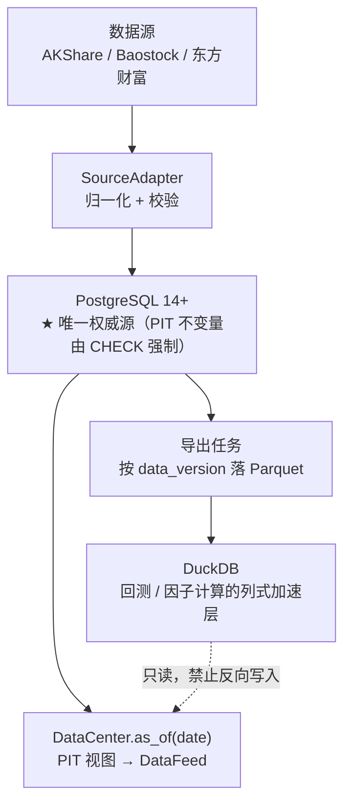

# 智能量化交易平台 — 数据中心接口契约文档 v1.0

> 本文件为**手工编写**的契约补充件，与 `智能量化交易平台-核心模块接口契约文档.md`（模块一 策略中心、模块二 回测引擎）配套使用，本契约编号承接为**模块四**。
>
> ⚠️ 注意：主契约 `.md` 由 `.docx` 转换生成，**重新转换会覆盖**。因此本文件的所有内容不写入主契约，避免被覆盖丢失。

## 文档信息

| 项目 | 内容 |
| --- | --- |
| 文档版本 | v1.0 |
| 对应主契约 | 智能量化交易平台 — 核心模块接口契约文档 v1.0 |
| 对应 PRD 模块 | 模块 1（数据中心） |
| 本契约编号 | 模块四 |
| PRD 需求出处 | `智能量化交易平台.md` 模块 1；`智能量化交易平台-数据中心数据源选型与接入规范.md` §3.2、§4.2、§6.1、§6.2、§7.1~§7.5、§八 |
| 技术栈 | Python（采集 / 清洗 / 服务）+ PostgreSQL 14+（唯一权威源）+ Parquet/DuckDB（派生加速层） |
| 通信协议 | 进程内 Python API（`DataFeed` 实现）+ REST（供 Java 平台层读取） |
| 目标读者 | AI Agent 开发引擎、数据工程师、架构师、量化研究员 |
| 约束级别 | **强约束** — 所有实现必须严格遵循本契约 |
| 覆盖的缺口 | `开工前缺口清单.md` 阻塞项 **B2** |
| 顺带补齐 | 主契约中被引用但从未定义的 `MarketStatus`、`DataFeedError`、`PITReport`、`LeakagePoint`（由 `tools/verify_contract_refs.py` 的 T2/T3 检查报出） |

---

## 一、设计决策记录（Decision Records）

本节是契约的**前提**。以下 10 条为已裁决项，实现时不得自行更改；如需变更须同步修订本节。

### D1 — 存储分层：PostgreSQL 是唯一权威源，Parquet 是派生加速层


```mermaid
graph TD
    A["数据源<br/>AKShare / Baostock / 东方财富"] --> B["SourceAdapter<br/>归一化 + 校验"]
    B --> C["PostgreSQL 14+<br/>★ 唯一权威源（PIT 不变量由 CHECK 强制）"]
    C --> D["导出任务<br/>按 data_version 落 Parquet"]
    D --> E["DuckDB<br/>回测 / 因子计算的列式加速层"]
    C --> F["DataCenter.as_of(date)<br/>PIT 视图 → DataFeed"]
    E -.->|"只读，禁止反向写入"| F
```

- **权威源只有一个**：所有 PIT 语义（`available_date`、`effective_from/effective_to`）必须由带 `CHECK` 约束的关系表强制。Parquet 不可变、无约束、无并发写，做不了这件事。
- **Parquet/DuckDB 是缓存，不是真相**：可由权威源随时重建。**禁止**任何数据只存在于 Parquet 而不在 PostgreSQL。
- ⚠️ 不要把本层与风控层混为一谈：风控层的事务库（`db/risk_control.sql`）存的是「阈值配置 + 决策留痕」，与本层是两个独立选型决定，只是**恰好同类**（都用 PostgreSQL，全平台单一方言）。

> 为什么不直接选 DuckDB+Parquet 当唯一存储：一旦研究层与生产层各有一份数据，两份数据的 `as_of` 语义迟早漂移，而「防未来函数」这件事**只允许有一个解释**。

### D2 — 三日期模型：`trade_date` / `available_date` / `as_of_date` 严格分离

PRD 模块 1 明确要求「所有数据带时间戳，区分『数据所属日期』与『数据可获取日期』」。三者落地为：

| 名称 | 语义 | 谁提供 | 典型用途 |
| --- | --- | --- | --- |
| `trade_date` | **数据所属日期**（行情是哪一天的） | 数据源 | 行情主键、因子计算 |
| `available_date` | **数据可获取日期**（这一天起才能被人看到） | 本层计算 | 财务披露、指数调仓 |
| `as_of_date` | **会话可见日**（本次回测/推演"站在哪一天"） | 调用方 | 所有读取的过滤条件 |

**不变式**：任何返回的数据必须满足 `available_date <= as_of_date`。
**禁止**：用 `trade_date <= as_of_date` 代替。财报的 `trade_date`（报告期截止日）永远早于 `available_date`（披露日），混用即产生未来函数。

### D3 — `as_of_date` 是结构性约束，不是每个方法的可选参数

这是本契约**最重要**的一条决策。

错误做法（**禁止**）：给主契约 `DataFeed` 的 9 个方法各加一个 `as_of_date: date | None = None` 参数。
原因：可选参数意味着**可以忘传**，而忘传时程序不会报错，只会静默退化成「用最新数据」——这正是未来函数，且它只在回测收益异常漂亮时才被发现。

正确做法：**`DataFeed` 只能由 `DataCenter.as_of()` 产出**。

```python
center = DataCenter(dsn='...')
feed = center.as_of(date(2026, 1, 1), adjust_type=AdjustType.HFQ)
# feed 是一个『冻结在 2026-01-01 视角』的 DataFeed：
# 它的 9 个方法签名与主契约 §2.2.1 完全一致，但只可能看到 2026-01-01 之前已可见的数据。
```

- **禁止**在生产代码中直接实例化 `CsvDataFeed` / `AKShareDataFeed` 等具体数据源类。它们只允许由 `DataCenter` 内部构造。
- 忘传 `as_of_date` 变成**不可能**：拿不到 `DataFeed`，就没有任何读接口可调。
- 该约束由接口形状保证，不依赖代码评审。

### D4 — 行情与财务走不同的可用性推导规则

- **行情**（日线/分钟线）：交易日 `T` 收盘后可用 ⇒ `available_date = T`。盘中数据在回测中**一律不可用**（回测只消费日线收盘）。
- **财务**：`available_date = announce_date`，若 `announce_date` 为非交易日或当日为盘后披露，顺延到**下一个交易日**——但**绝不早于** `announce_date`。
- **分红**（**2026-10-01 追加，见附录 B22**）：与财务**同规**——可见性依据是**公告日** `announce_date`，事件日是**除权除息日** `ex_date`。
  ⇒ 行情那条「收盘后即可见」的推导**不适用于分红**：分红方案可能在实施前好几天就公告了，用 `ex_date` 当可见性依据会把一条公开信息拖到价格已经变动之后才「可见」（反之亦然）。这一条由 `ck_dc_dividend_announce_not_after_ex` 在库层把住。（实例：同一条 D4 规则在 `dc_financial_report` 上的落地是 `ck_dc_fin_announce_after_period`。）

数据源规范 §3.2 的原始要求（本契约将其固化为断言）：

> 「所有财务数据必须携带披露日期（Announcement Date）字段，回测时只能使用『截至当日已披露』的财报数据。例如，**2025 年 Q3 财报通常在 2026 年 4 月披露，那么在 2026 年 1 月 1 日的回测中，最新可用财报应该是 2025 年 Q2 的**。」

⇒ 在 `as_of_date = 2026-01-01` 下，`2025Q3`（`announce_date ≈ 2026-04-xx`）**必须查不到**。这是 §3.10 的强制测试用例。

### D5 — 指数成分股用 PIT 区间快照，禁止当前名单回溯

数据源规范 §4.2：

> 「必须维护 Point-in-Time（PIT）快照——即『在 2025 年 6 月 30 日这一天，沪深 300 到底包含哪些股票』。**不能用当前的成分股名单去回测历史**，否则就是严重的幸存者偏差。」

落地为**区间表**（`effective_from` / `effective_to`）而非逐日快照表：

- 逐日快照：5000 只 × 250 天 × 20 年 = 2500 万行/指数，且每次调仓要写 5000 行冗余。
- 区间表：每次调仓只写「调出 N 行 + 调入 M 行」，查询用 `effective_from <= as_of < effective_to`。
- `effective_to IS NULL` 表示「至今仍在成分内」——**注意**它不是「永远在内」，查询时必须显式处理 `NULL`，否则 `a <= x < NULL` 恒为 `FALSE`，会静默返回空集。

### D6 — 复权口径：回测用后复权，实盘用不复权，且复权因子本身也要 PIT 裁剪

数据源规范 §7.2：「回测统一用后复权（避免前复权引入未来信息），实盘用不复权价格。」

关键补充（规范未写明、但必须做）：**前复权因子是「以最新价为基准」计算的，今天算出的 `qfq` 因子包含了未来信息**。因此：

- 库中**只存不复权价 + 原始复权因子**（`dc_adjust_factor`），不存任何预计算复权价。
- 复权在**读取时按 `as_of_date` 现算**（`AdjustType.HFQ` / `QFQ` 都是视图行为）。
- `AdjustType.QFQ` 允许用于**实盘展示**，**禁止**用于回测；若在回测上下文中请求 `QFQ`，抛 `FutureDataAccessError`。

### D7 — 缺失值不回填；FFill 仅在显式开关下且不得跨越 `as_of_date`

数据源规范 §7.4：「提前定义好缺失值的填充规则（前向填充 FFill 还是后向填充 BFill），并在接口文档中明确。」

本契约的裁决：

- **默认 `FillPolicy.NONE`** —— 缺失就是缺失，返回 `None`，由策略自行决定。
- `FFill` 允许，但只允许**向前**（用更早的已知值填当前），且填充源必须同样满足 `available_date <= as_of_date`。
- **`BFill` 在生产与回测中一律禁止** —— 用未来值回填过去是最直白的未来函数。仅在**离线数据清洗脚本**中允许，且必须写入 `dc_quality_issue` 留痕。

### D8 — 数据版本不可变，回测结果必须绑定版本号

数据源规范 §7.3：「每次数据更新打版本号（如 v2026.09.23），回测结果必须绑定数据版本号，确保任何收益都能完整复现。」

- `dc_data_version` 中**同时只有一行 `is_active = TRUE`**（用唯一部分索引强制）。
- 版本号**追加不修改**：修正历史数据 = 产生新版本，不覆盖旧版本。
- `BacktestResult` 必须记录 `data_version`；缺失则回测不得标记为「可复现」。
- `DataCenter.as_of()` 默认使用当前 active 版本；`as_of(date, data_version='v2026.09.23')` 可复现历史结论。

### D9 — 适配器归一化：上层不感知数据源差异；落库必须带 `source` 与 `ingested_at`

PRD 模块 1：「统一 `DataFeed` 接口，屏蔽 CSV / 数据库 / API 差异。」

- `SourceAdapter` 负责把各家字段名/单位/空值约定**归一化到本契约的标准 schema**，并返回 `ValidationReport`。
- 每行数据落库必须带 `source`（哪个源）与 `ingested_at`（何时入库）——否则多源冗余出错时无法定位是谁污染的。
- **禁止**让源特有字段名（如东财的 `TRADE_DATE`、Baostock 的 `tradeStatus`）出现在本契约的任何数据类上。

### D10 — 增量更新幂等：按主键 upsert，重跑不产生重复

- 所有采集走 `dc_ingest_run` 记录批次（谁、何时、哪一段、成功/失败行数）。
- 所有写入用 `INSERT ... ON CONFLICT (<业务主键>) DO UPDATE`，**同一批次重跑结果必须与跑一次相同**。
- 采集任务失败后**重跑整段**即可修复，不需要人工挑数据——这是让 Agent 能无人值守重试的前提。

---

## 二、全局约定

### 2.1 命名与代码规范

- Python：`snake_case` 字段、`PascalCase` 类；数据类统一用 `@dataclass`。
- 数据库：**标识符一律小写、不加双引号**（PostgreSQL 折叠规则）；表前缀 `dc_` 表示 data center。
- 时间列一律 `timestamptz(3)`（绝对时刻）或 `date`（交易日/日期语义），**禁止**用 `timestamp`（无时区）。
- 金额、价格用 `numeric`，**禁止** `double precision`（浮点误差会累积到收益归因）。

### 2.2 时间口径（强约束）

| 场景 | 用法 | 说明 |
| --- | --- | --- |
| 交易日 / 报告期 / 生效日 | `datetime.date` | 无时间无时区，禁止塞入时间部分 |
| 入库时刻 / 事件时刻 | `datetime`（aware，`Asia/Shanghai`） | 带时区，落库为 `timestamptz(3)` |
| 时间戳（策略侧） | `pd.Timestamp` | 主契约 `BarData.timestamp` 用整数纳秒，转换处必须显式指定时区 |

- 展示与日志统一 `Asia/Shanghai`；存储不做本地化假设。
- **禁止**用字符串比较日期（`'2026-1-1' < '2026-01-05'` 为真，但 `'2026-10-01'` 会排在 `'2026-9-01'` 之前）。

### 2.3 单位与口径

| 字段 | 单位 | 说明 |
| --- | --- | --- |
| 价格（open/high/low/close） | 元 | 不复权原始价，保留 4 位小数 |
| `volume` | 股 | **不是手**；源若给「手」须 ×100 |
| `amount` | 元 | 成交额 |
| `adjust_factor` | 无量纲 | 累乘因子，`> 0` |
| `weight`（成分股权重） | 0~1 小数 | **禁止存百分数**（与风控层 D3 同规则） |
| 比率（涨跌幅、换手率） | 0~1 小数 | 同上 |
| `roe`（净资产收益率） | 小数比率，**可为负** | **不受上一行的 0~1 约束**。它 = 净利润/净资产，亏损公司必然为负，`0~1` 会把它们全部拒掉。区间 `[-1, 5]`，由 `ck_dc_fin_roe_range` 强制（见 §3.6.1） |
| `cash_per_share`（每股派息） | 元/股，**税前** | **2026-10-01 追加**（分红落地，见附录 B22）。**非负**、保留 4 位小数（与价格同标度），由 `ck_dc_dividend_cash_nonneg` 强制（见 §3.6.1）；`0` **合法** —— 只送转不派现的预案就是 `0`（正样本 `C9a`）。⚠️ 它**不是**「股息率」（两者分母不同），也**不含**送转股 / 配股 / 转增 |

> `volume` 的「股 vs 手」与 `weight` 的「0.10 vs 10」是本层最容易出事故的两处，均已在 `db/data_center.sql` 中加 `CHECK` 约束。
>
> 另一个坑是把上表的「比率 0~1」当成**所有**比率字段的通用规则去套 —— `roe` 就是反例。凡是**相减得出、可为负**的比率（收益率、超额收益类）都不适用 0~1。

### 2.4 失败与降级（fail-closed）

| 情形 | 行为 |
| --- | --- |
| `as_of_date` 下数据不可见 | 抛 `DataNotAvailableError`，**不得**退化为「用最新数据」 |
| 请求了 `as_of_date` 之后的数据 | 抛 `FutureDataAccessError`（这是未来函数，属 CRITICAL） |
| 主数据源失败 | 降级到备源（`SourcePriority.FALLBACK`），落库标记 `source`，记 `WARNING` |
| 主备源都给不出数据 | 不写库、不猜测、抛 `DataNotAvailableError`，批次标记 `PARTIAL` |
| 数据质量校验失败 | **不阻断入库**，写 `dc_quality_issue` 并告警（阻断会导致长期无数据可用） |
| 数据版本缺失 | 抛 `DataVersionError`；回测结果不得标记为可复现 |

**总原则**：宁可让回测跑不起来，也不能让它带着未来函数跑完。所有「找不到数据」的分支都必须**显式失败**，不允许返回空集或默认值。

---

## 三、模块四：数据中心

### 3.1 数据模型

#### 3.1.1 表清单（10 张）

| # | 表名 | 用途 | PIT 关键列 |
| --- | --- | --- | --- |
| 1 | `dc_data_version` | 数据版本（不可变，单行 active） | `as_of_date` |
| 2 | `dc_trading_calendar` | 交易日历 | `trade_date` |
| 3 | `dc_symbol` | 标的基础信息（上市/退市/ST 历史） | `available_date` |
| 4 | `dc_daily_bar` | 日线行情（**不复权**） | `trade_date`（= `available_date`） |
| 5 | `dc_adjust_factor` | 复权因子 | `trade_date` |
| 6 | `dc_financial_report` | 财务三表 | `period_end` + **`announce_date`** + `available_date` |
| 7 | `dc_index_member` | 指数成分股 **PIT 区间快照** | `effective_from` / `effective_to` |
| 8 | `dc_ingest_run` | 采集批次日志（幂等与可追溯） | `ingested_at` |
| 9 | `dc_quality_issue` | 数据质量问题留痕 | `trade_date` |
| 10 | `dc_dividend` | 分红（每股派息）**2026-10-01 追加**，见附录 B22 | **`announce_date`**（+ 事件日 `ex_date`） |

可执行 DDL 见 **`db/data_center.sql`**（含枚举 CHECK 约束与版本种子）。本节为结构说明。

> 第 10 行是 2026-10-01 追加的（附录 B22），本表的行数因此由 9 改成 10：
> `db/data_center.sql` 里实际建了 10 张 `dc_` 表，而本节是它的结构说明 —— 两边不一致会由
> `tools/verify_data_center.py` 的双向核对判红。

#### 3.1.2 PIT 三日期在表上的落地

```text
dc_daily_bar          trade_date      ← 数据所属日期；行情收盘后即可见，故 available_date = trade_date
dc_financial_report   period_end      ← 报告期截止日（数据所属日期）
                      announce_date   ← 披露日期（数据可获取日期）★ 唯一合法的可见性依据
                      available_date  ← = announce_date 或其后首个交易日（冗余存储，便于索引与校验）
dc_index_member       effective_from  ← 纳入生效日
                      effective_to    ← 调出生效日；NULL = 至今仍在成分内
dc_dividend           ex_date         ← 除权除息日（数据所属日期）
                      announce_date   ← 公告日期 ★ 唯一合法的可见性依据（**不是** ex_date，见 D4）
                      available_date  ← = announce_date；本表 2026-10-01 追加时只存了 announce_date，
                                        读侧的过滤键是它（与 dc_symbol 同一形状：只存一个可见性日期）
```

**统一查询模板**（所有 PIT 读取都必须写成这个形状）：

```sql
-- 财务：取 as_of 视角下最新可见的一份财报
SELECT * FROM dc_financial_report
WHERE symbol = %s AND available_date <= %s          -- ★ 过滤键是 available_date，不是 period_end
ORDER BY period_end DESC
LIMIT 1;
```

#### 3.1.3 枚举定义

```python
class MarketStatus(Enum):
    """
    市场交易时段状态。

    ⚠️ 与主契约 §1.3.3 的 `MarketState`（市场状态：牛市/熊市/震荡，模块 3 的产物）
    只差一个字母但语义完全不同，实现时禁止互相赋值。
    本枚举回答「现在能不能交易」，`MarketState` 回答「现在是不是好时机」。

    主契约 §2.2.2 `CsvDataFeed` 使用了 `MarketStatus.OPEN` / `MarketStatus.CLOSED`，
    故保留这两个成员名以兼容。
    """
    PRE_OPEN = 'PRE_OPEN'        # 开盘前（9:15~9:30 集合竞价）
    OPEN = 'OPEN'                # 连续竞价（9:30~11:30, 13:00~15:00）
    LUNCH_BREAK = 'LUNCH_BREAK'  # 午间休市
    CLOSED = 'CLOSED'            # 收盘后或非交易日
    HALTED = 'HALTED'            # 全市场停市（熔断/极端情况）


class AdjustType(Enum):
    """复权类型。"""
    NONE = 'NONE'  # 不复权（实盘用）
    QFQ = 'QFQ'    # 前复权（含未来信息，禁止用于回测，见 D6）
    HFQ = 'HFQ'    # 后复权（回测默认）


class FillPolicy(Enum):
    """缺失值填充策略，见 D7。"""
    NONE = 'NONE'    # 不填充（默认，返回 None）
    FFILL = 'FFILL'  # 向前填充
    BFILL = 'BFILL'  # 向后填充（仅离线清洗脚本允许）


class SourcePriority(Enum):
    """数据源优先级，见 D9。"""
    PRIMARY = 'PRIMARY'    # 主源
    FALLBACK = 'FALLBACK'  # 备源（主源失败时降级使用）


class ReportType(Enum):
    """财务报表类型。"""
    BALANCE = 'BALANCE'    # 资产负债表
    INCOME = 'INCOME'      # 利润表
    CASHFLOW = 'CASHFLOW'  # 现金流量表
    INDICATOR = 'INDICATOR'  # 财务指标


class DataQualityFlag(Enum):
    """数据质量标记，见 §7.5 要求的每日完整性检查，见 D9。"""
    SUSPENDED = 'SUSPENDED'            # 停牌
    LIMIT_UP = 'LIMIT_UP'              # 涨停
    LIMIT_DOWN = 'LIMIT_DOWN'          # 跌停
    ST = 'ST'                          # ST/*ST
    NEW_LISTING = 'NEW_LISTING'        # 次新（上市未满 N 日）
    DELISTED = 'DELISTED'              # 已退市
    ABNORMAL_VOLUME = 'VOLUME_ANOMALY'  # 异常成交量
    MISSING = 'MISSING'                # 数据缺失
```

> ⚠️ **实现态声明（2026-09-25 实测 + 更正，非契约修改）**：本节的 `MarketStatus` 成员表
> **已由实现侧逐条对齐**。`quanauto/enums.py` 的 `MarketStatus` 现在是
> `PRE_OPEN` / `OPEN` / `LUNCH_BREAK` / `CLOSED` / `HALTED` —— **成员名、取值、顺序**三者
> 都与上面这个块一致；比对工具是新增的 tier-A 门禁 `tools/verify_enum_members.py`
> （契约侧 `docs/` 三个契约文档 vs 实现侧 `quanauto/*.py`，逐成员对拍），它把本类作为
> 第一个比对对象，实跑 `verdict: PASS (0 finding(s))`。全量对拍的分母：契约侧 23 个枚举、
> 实现侧 23 个、已比对 21 个，另有 2 个「契约先行」与 2 个「实现本地」按登记表处理。
>
> **更正记录**：本块的上一个版本写的是「本节成员表**尚未被实现遵循**……**13 个门禁对这条
> 分歧全绿**」。那句在写下时是实测为真的（实现侧是 `OPEN` / `CLOSED` / `SUSPENDED` /
> `HOLIDAY`：本节三个成员实现里没有，实现两个成员本节里没有），它暴露的是一个**真缺口**：
> 当时没有任何判据比对枚举的**成员表** —— 唯一比对成员名的
> `tools/verify_contract_appendix.py` 只审主契约**附录 G 节**，
> `tools/contract-signature-manifest.json` 的 `classes` / `impl_only` 里一个枚举都没有。
> 实测手法：往实现里插一个假成员，`python tools/run_all_gates.py` 仍 **13/13 全绿**。
> 现在缺口已补（门禁数 13 → 14，新增 `enum-members`），成员表也按契约调和完毕，
> 所以「尚未被遵循」不再是事实，同批改成上面这条。同时确认过：被删掉的两个实现成员
> `SUSPENDED` / `HOLIDAY` 全仓零引用（`git grep` 实测），两侧**真正被代码引用的**成员
> 都只有 `OPEN` / `CLOSED`，所以这次调和不动任何调用点。完整证据见
> `docs/开工前缺口清单.md` B9 的 B9.1。

### 3.2 数据源适配器契约（采集侧）

```python
class SourceAdapter(ABC):
    """
    数据源适配器基类。一个数据源一个子类，负责把源特有格式归一化到本契约的标准 schema。

    职责:
        - 拉取（网络/文件 IO）
        - 字段名、单位、空值约定的归一化
        - 最低限度的格式校验（不是业务校验）

    不做:
        - 不写数据库（由 DataCenter 统一写入，见 D1/D10）
        - 不判断 as_of_date（采集关心「现在取得到什么」，不是「过去看得到什么」）
    """

    @abstractmethod
    def source_name(self) -> str:
        """
        返回数据源标识。

        返回:
            str: 源名，如 'akshare' / 'baostock' / 'eastmoney'。写入每行的 source 列。
        """
        pass

    @abstractmethod
    def fetch_daily_bar(
        self,
        symbols: List[str],
        start: date,
        end: date
    ) -> pd.DataFrame:
        """
        拉取日线行情（不复权）。

        参数:
            symbols: 标的代码列表，统一格式为 '600000.SH' / '000001.SZ'。
            start: 开始交易日。
            end: 结束交易日。

        返回:
            pd.DataFrame: 列名必须是标准 schema —— symbol / trade_date / open / high /
                low / close / volume / amount，且 trade_date 为 date 类型。

        异常:
            SourceAdapterError: 网络失败、限流、源返回格式无法解析时抛出。
        """
        pass

    @abstractmethod
    def fetch_adjust_factor(
        self,
        symbols: List[str],
        start: date,
        end: date
    ) -> pd.DataFrame:
        """
        拉取复权因子（**累计因子**，不是「本次调整比例」）。

        追加于 2026-09-29（见附录 B21）—— 在附录 B21 之前，本方法不存在，
        `dc_adjust_factor` 也没有任何采集路径。

        参数:
            symbols: 标的代码列表，统一格式为 '600000.SH' / '000001.SZ'。
            start: 开始交易日。
            end: 结束交易日。

        返回:
            pd.DataFrame: 列名必须恰好是 —— symbol / trade_date / adjust_factor，且
                trade_date 为 date 类型；adjust_factor 是**恒为正**的累计因子（见
                `dc_adjust_factor` 的 `ck_dc_factor_positive`）。

        异常:
            SourceAdapterError: 网络失败、鉴权失败、源返回格式无法解析，或该源
                不提供复权因子（`kind='UNSUPPORTED'`）时抛出。**不得返回空帧** ——
                空帧在下游读作「这段区间没有因子」（= 不复权），与「这个源不给因子」
                是相反的两件事，而两者在报告里长得一样。
        """
        pass

    @abstractmethod
    def fetch_dividend(
        self,
        symbols: List[str],
        start: date,
        end: date
    ) -> pd.DataFrame:
        """
        拉取分红（每股税前派息）。

        追加于 2026-10-01（见附录 B22）—— 在 B22 之前，本方法不存在，
        `dc_dividend` 也没有任何采集路径，`DbDataFeed.get_dividend()` 因此恒返回 `0.0`。

        参数:
            symbols: 标的代码列表，统一格式为 '600000.SH' / '000001.SZ'。
            start: 开始日期（按 **`ex_date`** 过滤，不是按 `announce_date`）。
            end: 结束日期。

        返回:
            pd.DataFrame: 列名恰好是 —— symbol / ex_date / announce_date /
                cash_per_share，且 ex_date 与 announce_date 均为 date 类型。
                （⚠️ 这里**故意**不写「列名必须恰好是」：那句话是 `fetch_adjust_factor`
                那一段的终点锚（`tools/verify_data_center_adapter.py` 的
                `CONTRACT_SCHEMA_SPECS`），起点锚必须全文件唯一 ⇒ 两段共用同一句
                会让 A8 抽不出任何一段。措辞不同，含义相同。）
                `cash_per_share` 是**每股税前现金分红（元/股）**，不是分红总额、不是比例；
                允许为 0（只送转不派现的预案）。
                必须满足 `announce_date <= ex_date`（见 D4 与
                `ck_dc_dividend_announce_not_after_ex`）—— 源若只给除权日而把公告日
                填成同一天，适配器**不得**默认「反正合规」就照抄：要么取到真的公告日，
                要么显式抛出。

        异常:
            SourceAdapterError: 网络失败、鉴权失败、源返回格式无法解析，或该源
                不提供分红数据（`kind='UNSUPPORTED'`）时抛出。**不得返回空帧** ——
                空帧在下游读作「这段区间没有分红事件」（= `get_dividend()` 返回 `0.0`），
                与「这个源不给分红数据」是相反的两件事，而两者在报告里长得一样。
        """
        pass

    @abstractmethod
    def fetch_financial(
        self,
        symbols: List[str],
        period_end: date
    ) -> pd.DataFrame:
        """
        拉取财务数据。

        参数:
            symbols: 标的代码列表。
            period_end: 报告期截止日（如 2025-09-30）。

        返回:
            pd.DataFrame: 必须包含列 —— symbol / report_type / period_end /
                **announce_date**（缺失该列即视为适配器不合格，见 D4）/ 各财务科目。
            源若只给「报告期」不给「披露日期」，适配器必须显式补全或抛出异常，
            **禁止**用 period_end 冒充 announce_date。

        异常:
            SourceAdapterError: 源不提供披露日期时抛出（不得静默降级）。
        """
        pass

    @abstractmethod
    def fetch_index_members(
        self,
        index_code: str,
        as_of_date: date
    ) -> pd.DataFrame:
        """
        拉取指数成分股（含历史调仓记录）。

        参数:
            index_code: 指数代码，如 '000300.SH'（沪深 300）。
            as_of_date: 获取截至该日已知的调仓记录（不是「该日的成分股名单」，
                名单由 DataCenter 用区间表计算，见 D5）。

        返回:
            pd.DataFrame: 列名 —— index_code / symbol / effective_from / effective_to
                / weight。effective_to 可为空表示仍在成分内。

        异常:
            SourceAdapterError: 源只提供当前名单而无历史时抛出（不得只存当前名单）。
        """
        pass

    @abstractmethod
    def validate(self, frame: pd.DataFrame) -> ValidationReport:
        """
        校验归一化后的数据帧（列齐备、类型正确、主键无重复、值域合理）。

        参数:
            frame: normalize 之后的 DataFrame。

        返回:
            ValidationReport: 校验报告；is_valid 为 False 时 DataCenter 不得写入。
        """
        pass
```

MVP 阶段必须实现的三个子类（依据数据源规范 §八：MVP 首选 AKShare + Baostock，财务用 AKShare 东方财富源）：

| 子类 | 覆盖 | `SourcePriority` | 备注 |
| --- | --- | --- | --- |
| `AKShareAdapter` | 行情 + 财务 + 指数成分股 + 龙虎榜 | PRIMARY | MVP 主源 |
| `BaostockAdapter` | 行情（含停牌/涨跌停标记） | FALLBACK | MVP 备源，**质量标记更全** |
| `EastMoneyAdapter` | 财务 + 指数成分股 + 资金流向 | FALLBACK | 财务交叉核对 |

> **上表是 MVP 阶段的覆盖范围声明，不是「子类必须实现几个方法」的清单** ——
> 「覆盖」一列说的是**这个源能提供哪几类数据**。
> `fetch_dividend`（2026-10-01 追加）在 MVP 表里**没有任何一个源声明覆盖**：
> 目前只有 `TushareAdapter` 实现了它（`tushare` 的 `dividend` 接口），其余四个子类
> 继承 `_AdapterBase.fetch_dividend` 的默认实现 ⇒ 显式抛
> `SourceAdapterError(kind='UNSUPPORTED')`。这与 `fetch_adjust_factor` 落地时
> （B21）的形状**完全一致**：先有一个真能取数的源 + 四个显式拒绝的源，
> 而不是五个「实现了但都返回空帧」。
> 能力缺口仍登记在 `docs/开工前缺口清单.md`（分红的多源交叉核对尚未做）。

### 3.3 数据服务接口（读侧，PIT 强制）

#### 3.3.1 DataCenter 入口

```python
class DataCenter(ABC):
    """
    数据中心入口。**这是获取 `DataFeed` 的唯一合法途径**（见 D3）。

    禁止在业务代码中直接实例化任何具体数据源类；否则 `as_of_date` 约束失效，
    未来函数会以「回测收益异常漂亮」的形式出现，而不是以异常的形式出现。
    """

    @abstractmethod
    def as_of(
        self,
        as_of_date: date,
        adjust_type: AdjustType = AdjustType.HFQ,
        fill_policy: FillPolicy = FillPolicy.NONE,
        data_version: str = ''
    ) -> DataFeed:
        """
        返回一个冻结在指定视角的 DataFeed。

        参数:
            as_of_date: 会话可见日。返回的 DataFeed 只可能看到 available_date <=
                as_of_date 的数据（绝对约束，不可绕过）。
            adjust_type: 复权口径。回测必须用 HFQ；请求 QFQ 且会话标记为回测时抛
                FutureDataAccessError（见 D6）。
            fill_policy: 缺失值策略，默认 NONE（见 D7）。
            data_version: 指定数据版本以复现历史结论；空字符串表示使用当前 active 版本。

        返回:
            DataFeed: 主契约 §2.2.1 定义的接口实例，其 9 个方法签名与主契约完全一致。

        异常:
            DataVersionError: 指定的 data_version 不存在或未激活。
            FutureDataAccessError: adjust_type 与运行模式冲突。
        """
        pass

    @abstractmethod
    def live(self, account_mode: str) -> DataFeed:
        """
        返回实盘 / 模拟盘视角的 DataFeed（as_of_date = 今日，adjust_type = NONE）。

        参数:
            account_mode: 'LIVE' 或 'SIM'，用于决定复权口径与是否允许盘中数据。

        返回:
            DataFeed: 实盘视角数据源。
        """
        pass

    @abstractmethod
    def trading_calendar(self, as_of_date: date) -> TradingCalendar:
        """
        返回该视角下的交易日历。

        参数:
            as_of_date: 会话可见日（日历本身也是 PIT 的：未来新增节假日不应被提前看到）。

        返回:
            TradingCalendar: 交易日历实例。
        """
        pass

    @abstractmethod
    def data_version(self) -> DataVersion:
        """
        返回当前 active 数据版本。

        返回:
            DataVersion: 版本对象，供 BacktestResult 绑定（见 D8）。
        """
        pass
```

#### 3.3.2 财务数据的 PIT 查询接口

```python
class FinancialDataService(ABC):
    """
    财务数据 PIT 查询服务。把 D4 的披露日期规则固化为接口行为。
    """

    @abstractmethod
    def latest_report(
        self,
        symbol: str,
        as_of_date: date,
        report_type: ReportType
    ) -> Optional[FinancialReport]:
        """
        返回 as_of_date 视角下**最新已披露**的财报。

        参数:
            symbol: 标的代码。
            as_of_date: 会话可见日。
            report_type: 报表类型。

        返回:
            Optional[FinancialReport]: 可见的最新财报；该视角下无任何已披露财报时返回 None。
            **注意**：返回 None 是「确实没有」，不是「查不到」——后者必须抛异常。

        异常:
            DataNotAvailableError: 标的不存在或数据版本缺失该标的。
        """
        pass

    @abstractmethod
    def report_history(
        self,
        symbol: str,
        as_of_date: date,
        report_type: ReportType,
        periods: int
    ) -> List[FinancialReport]:
        """
        返回 as_of_date 视角下最近 N 期已披露财报（按 period_end 降序）。

        参数:
            symbol: 标的代码。
            as_of_date: 会话可见日。
            report_type: 报表类型。
            periods: 期数。

        返回:
            List[FinancialReport]: 财报列表，长度可能小于 periods（历史不足）。
        """
        pass
```

**D4 的固化断言**（§3.10 强制测试项）：

| `as_of_date` | 期望 `latest_report` 的 `period_end` | 理由 |
| --- | --- | --- |
| 2026-01-01 | 2025-06-30（2025Q2） | 2025Q3 于 2026-04 才披露 |
| 2026-04-30 | 2025-09-30（2025Q3） | 此时 2025Q3 已披露 |
| 无任何已披露财报 | `None` | 不猜测、不退化为 `period_end` 过滤 |

#### 3.3.3 指数成分股 PIT 查询接口

```python
class IndexMemberService(ABC):
    """
    指数成分股 PIT 查询服务。把 D5 的区间快照规则固化为接口行为。
    """

    @abstractmethod
    def members(self, index_code: str, as_of_date: date) -> List[IndexMemberSnapshot]:
        """
        返回 as_of_date 当日的成分股名单。

        参数:
            index_code: 指数代码。
            as_of_date: 会话可见日。

        返回:
            List[IndexMemberSnapshot]: 成分股列表。
            **禁止**用当前名单代替：这会产生幸存者偏差，且偏差方向是「历史收益被系统性高估」，
            即最不容易被怀疑的方向。

        异常:
            DataNotAvailableError: 该指数无 PIT 记录（只有当前名单）时抛出。
        """
        pass

    @abstractmethod
    def membership_changes(
        self,
        index_code: str,
        start: date,
        end: date
    ) -> List[MembershipChange]:
        """
        返回区间内的调仓事件（用于事件驱动策略与归因）。

        参数:
            index_code: 指数代码。
            start: 开始日期。
            end: 结束日期。

        返回:
            List[MembershipChange]: 调仓事件列表。
        """
        pass
```

### 3.4 数据类定义

```python
@dataclass
class DataVersion:
    """
    数据版本。不可变，见 D8。
    """
    data_version: str
    """str: 版本号，格式 `vYYYY.MM.DD`（如 'v2026.09.23'）。"""

    as_of_date: date
    """date: 该版本涵盖到哪个交易日。"""

    created_at: datetime
    """datetime: 版本生成时刻（Asia/Shanghai）。"""

    is_active: bool
    """bool: 是否为当前生效版本。全表最多一行为 True。"""

    notes: str
    """str: 版本说明（如『修正 2025-08 成交量单位错误』）。"""


@dataclass
class FinancialReport:
    """
    财务数据记录。三日期语义见 D2/D4。
    """
    symbol: str
    """str: 标的代码。"""

    report_type: ReportType
    """ReportType: 报表类型。"""

    period_end: date
    """date: 报告期截止日（**数据所属日期**）。"""

    announce_date: date
    """date: 披露日期（**数据可获取日期**）。来自源的 Announcement Date 字段。"""

    available_date: date
    """date: 可用日期 = announce_date 或其后首个交易日。**所有查询的过滤键**。"""

    revenue: Optional[float]
    """Optional[float]: 营业收入（元）。"""

    net_profit: Optional[float]
    """Optional[float]: 净利润（元）。"""

    total_assets: Optional[float]
    """Optional[float]: 总资产（元）。"""

    total_equity: Optional[float]
    """Optional[float]: 净资产（元）。"""

    roe: Optional[float]
    """Optional[float]: 净资产收益率 = 净利润/净资产，小数比率（**不是百分数**）。

    可为负值：亏损公司必然 ROE < 0，故**不适用 §2.3 的 0~1 通用比率口径**。
    合法区间 [-1, 5]，由数据库约束 ck_dc_fin_roe_range 强制（见 §3.6.1）。
    """

    source: str
    """str: 数据来源标识，见 D9。"""

    data_version: str
    """str: 所属数据版本，见 D8。"""


@dataclass
class IndexMemberSnapshot:
    """
    指数成分股 PIT 区间记录。见 D5。
    """
    index_code: str
    """str: 指数代码。"""

    symbol: str
    """str: 成分股代码。"""

    effective_from: date
    """date: 纳入生效日（含）。"""

    effective_to: Optional[date]
    """Optional[date]: 调出生效日（不含）；None 表示至今仍在成分内。"""

    weight: Optional[float]
    """Optional[float]: 权重，0~1 小数；None 表示源未提供。"""

    source: str
    """str: 数据来源标识。"""

    data_version: str
    """str: 所属数据版本。"""


@dataclass
class MembershipChange:
    """
    指数调仓事件。
    """
    index_code: str
    """str: 指数代码。"""

    symbol: str
    """str: 标的代码。"""

    change_type: str
    """str: 'IN'（调入）或 'OUT'（调出）。"""

    effective_date: date
    """date: 生效日。"""


@dataclass
class QualityIssue:
    """
    数据质量问题记录（见 §7.5）。
    """
    symbol: str
    """str: 标的代码。"""

    trade_date: date
    """date: 问题所属交易日。"""

    flag: DataQualityFlag
    """DataQualityFlag: 问题类型。"""

    detail: str
    """str: 详情。"""

    severity: str
    """str: 'CRITICAL' / 'WARNING' / 'INFO'。"""


@dataclass
class ValidationReport:
    """
    适配器数据校验报告。本类补齐主契约中从未定义的 `ValidationReport`。
    """
    is_valid: bool
    """bool: 是否通过校验。"""

    row_count: int
    """int: 校验的总行数。"""

    errors: List[str]
    """List[str]: 导致失败的硬错误（列缺失、主键重复、类型错误）。任一非空即 is_valid=False。"""

    warnings: List[str]
    """List[str]: 不阻断入库的告警（值域可疑、缺失率偏高）。"""

    missing_ratio: Dict[str, float]
    """Dict[str, float]: 各列缺失率，0~1 小数。"""


@dataclass
class PITReport:
    """
    Point-in-Time 一致性检查报告。本类补齐主契约 §2.7.1 中从未定义的 `PITReport`。
    """
    symbol: str
    """str: 标的代码。"""

    as_of_date: date
    """date: 会话可见日。"""

    field: str
    """str: 被检查的字段。"""

    is_consistent: bool
    """bool: 是否满足 PIT 一致性。"""

    visible_value: Optional[float]
    """Optional[float]: 在 as_of_date 视角下实际取到的值。"""

    latest_visible_date: Optional[date]
    """Optional[date]: 该视角下真正可见的最新日期（应与查询过滤键一致）。"""

    message: str
    """str: 说明。"""


@dataclass
class LeakagePoint:
    """
    一个未来函数泄露点。本类补齐主契约 §2.7.2 中从未定义的 `LeakagePoint`。
    """
    symbol: str
    """str: 标的代码。"""

    trade_date: date
    """date: 被访问的交易日。"""

    as_of_date: date
    """date: 会话可见日。"""

    field: str
    """str: 被访问的字段。"""

    reason: str
    """str: 泄露原因（如 '访问了 available_date=2026-04-28 的财报，而 as_of=2026-01-01'）。"""

    severity: str
    """str: 'CRITICAL' / 'WARNING' / 'INFO'。"""
```

### 3.5 交易日历

风控层契约 §四「局限与后续」已明确：`max_daily_trades` 的『当日』口径依赖数据中心提供交易日历。本契约提供：

```python
class TradingCalendar(ABC):
    """
    交易日历。**所有需要「第 N 个交易日」语义的模块必须通过本接口计算**，
    禁止自行用自然日加减。
    """

    @abstractmethod
    def is_trading_day(self, d: date) -> bool:
        """
        判断是否交易日。

        参数:
            d: 日期。

        返回:
            bool: 是否交易日。
        """
        pass

    @abstractmethod
    def next_trading_day(self, d: date) -> date:
        """
        返回 d 之后的第一个交易日（d 本身为交易日时必须返回**下一个**）。

        参数:
            d: 日期。

        返回:
            date: 下一个交易日。用于把盘后披露的财报顺延到可用日（见 D4）。

        异常:
            DataNotAvailableError: 日历覆盖范围不足时抛出（不得外推）。
        """
        pass

    @abstractmethod
    def prev_trading_day(self, d: date) -> date:
        """
        返回 d 之前的最后一个交易日。

        参数:
            d: 日期。

        返回:
            date: 上一个交易日。
        """
        pass

    @abstractmethod
    def trading_days(self, start: date, end: date) -> List[date]:
        """
        返回区间内全部交易日（含端点）。

        参数:
            start: 开始日期。
            end: 结束日期。

        返回:
            List[date]: 交易日列表，升序。
        """
        pass

    @abstractmethod
    def shift(self, d: date, n: int) -> date:
        """
        沿交易日历平移 n 个交易日（n 可负）。

        参数:
            d: 基准日期。
            n: 平移交易日数；0 表示若 d 非交易日则取其后首个交易日。

        返回:
            date: 平移结果。
        """
        pass
```

### 3.6 持久化结构

可执行 DDL 见 **`db/data_center.sql`**。落地约定与风控层 §3.6 一致（全平台单一方言）：

| # | 约定 | 说明 |
| --- | --- | --- |
| 1 | 标识符不加双引号、全小写 | PostgreSQL 折叠规则；`dc_daily_bar` 而非 `DcDailyBar` |
| 2 | 时间列一律 `timestamptz(3)`，日期列一律 `date` | 禁止无时区的 `timestamp` |
| 3 | 价格/金额 `numeric(18,4)`，比率/权重 `numeric(10,6)` | 禁止 `double precision` |
| 4 | 布尔用 `boolean`；自增用 `GENERATED ALWAYS AS IDENTITY` | 不用 `tinyint`/`serial` |
| 5 | 关键不变量下沉为 `CHECK` 约束 | 见 §3.6.1 |
| 6 | 写入用 `INSERT ... ON CONFLICT DO UPDATE` | 幂等，见 D10 |
| 7 | 分区只能建表时声明 | MVP 用单表 + 定期归档，未来再迁移分区表 |

#### 3.6.1 数据库级不变量（最后防线）

| 约束名 | 表 | 强制内容 | 依据 |
| --- | --- | --- | --- |
| `ck_dc_fin_announce_after_period` | `dc_financial_report` | `announce_date >= period_end` | D4 |
| `ck_dc_fin_available_ge_announce` | `dc_financial_report` | `available_date >= announce_date` | D4 |
| `ck_dc_fin_report_type` | `dc_financial_report` | `report_type IN ('BALANCE','INCOME','CASHFLOW','INDICATOR')` | §3.1.3 |
| `ck_dc_fin_roe_range` | `dc_financial_report` | `roe IS NULL OR (roe >= -1 AND roe <= 5)` | §2.3 |
| `ck_dc_member_effective_range` | `dc_index_member` | `effective_to IS NULL OR effective_to > effective_from` | D5 |
| `ck_dc_member_weight_range` | `dc_index_member` | `weight IS NULL OR (weight >= 0 AND weight <= 1)` | §2.3 |
| `ck_dc_bar_price_positive` | `dc_daily_bar` | `open > 0 AND high > 0 AND low > 0 AND close > 0` | §2.3 |
| `ck_dc_bar_ohlc_order` | `dc_daily_bar` | `high >= low AND high >= open AND high >= close AND low <= open AND low <= close` | §2.3 |
| `ck_dc_bar_volume_nonneg` | `dc_daily_bar` | `volume >= 0 AND amount >= 0` | §2.3 |
| `ck_dc_factor_positive` | `dc_adjust_factor` | `adjust_factor > 0` | D6 |
| `ck_dc_quality_flag` | `dc_quality_issue` | `flag IN ('SUSPENDED','LIMIT_UP','LIMIT_DOWN','ST','NEW_LISTING','DELISTED','VOLUME_ANOMALY','MISSING')` | §3.8 |
| `ck_dc_quality_severity` | `dc_quality_issue` | `severity IN ('CRITICAL','WARNING','INFO')` | §2.2 |
| `ck_dc_ingest_status` | `dc_ingest_run` | `status IN ('RUNNING','SUCCESS','PARTIAL','FAILED')` | D10 |
| `ck_dc_ingest_priority` | `dc_ingest_run` | `priority IN ('PRIMARY','FALLBACK')` | D9 |
| `ck_dc_symbol_delist_after_list` | `dc_symbol` | `delist_date IS NULL OR list_date IS NULL OR delist_date > list_date` | §2.3 |
| `ck_dc_version_format` | `dc_data_version` | `data_version ~ '^v[0-9]{4}\.[0-9]{2}\.[0-9]{2}$'` | D8 |
| `ck_dc_dividend_cash_nonneg` | `dc_dividend` | `cash_per_share >= 0` | §2.3（**2026-10-01 追加**） |
| `ck_dc_dividend_announce_not_after_ex` | `dc_dividend` | `announce_date <= ex_date` | D4（**2026-10-01 追加**） |

共 **18 条**。清单与 `db/data_center.sql` 的实际声明由 `tools/verify_data_center.py` **双向核对**（C2 契约有而 DDL 无、C3 DDL 有而契约无、C4 声明不在表体内），任一方向不一致即 FAIL。

> 上表最后两行是 2026-10-01 追加的（附录 B22），本表的条数因此由 16 改成 18。
> 前 16 行**一行未动**（只在表尾追加）—— 行序与文字都是已有的产物，重排会让「谁改了什么」不可追。

单行表约束：`dc_data_version` 的 `is_active` 用**唯一部分索引**保证最多一行 `TRUE`（`CHECK` 做不到跨行约束，见 DDL 注释）。

> **写进 DDL ≠ 生效。** 表达式写错、枚举少了成员、改了 DDL 却没迁移，这些都能通过静态检查。
> 唯一能证明约束真的会拒绝非法值的，是在真实 PostgreSQL 上执行 `db/data_center.sql` 并跑触发测试。
> **该 DDL 已于 2026-09-23 执行、2026-09-24 补成版本阶梯、2026-10-01 加上两条分红约束后重跑阶梯**：
> 容器 `postgres:14`(14.24) / `15`(15.18) / `16`(16.15) / `17`(17.11)，每个镜像上本表 18 条约束的触发测试都是
> **46 passed / 0 failed**（风控侧同步 **23 passed / 0 failed**），证据四份
> `tools/sql-smoke-report-pg1{4,5,6}.txt` + `tools/sql-smoke-report.txt`（均含镜像 digest）。
> 因此 §3.6.1 已从「纸面防线」升为**在四个 tag 上实测通过**；但四个大版本之间还有别的 tag 与
> 发行版从未跑过，DDL 标题里的「PostgreSQL 14+」仍未证实，且改过 `db/*.sql` 后此结论作废。
> 详见附录 **B19**；两条分红约束的触发凭证见附录 **B22**。

### 3.7 PIT 一致性校验（补齐主契约 §2.7 的缺失类型）

主契约 §2.7.1 定义了 `DataIntegrityChecker`，但其返回类型 `PITReport`、`LeakagePoint` 从未定义。本契约补齐（见 §3.4），并约定实现方式：

```python
class PITGuard:
    """
    PIT 守卫。两层防护中的第二层（第一层是 D3 的接口形状约束）。

    职责:
        在 DataFeed 实现内部记录每次读取的 (symbol, trade_date, field)，
        与当前会话的 as_of_date 比对，任何「读到了 as_of 之后才可见的数据」
        都必须立即抛 FutureDataAccessError。

    为什么需要它:
        接口形状能防住「忘了传 as_of_date」，防不住「传了 as_of_date 但实现里没过滤」。
        后者是真正会发生的 bug，必须在运行时炸掉而不是静默返回。
    """

    @abstractmethod
    def record_access(self, symbol: str, trade_date: date, field: str) -> None:
        """
        记录一次数据访问，并在越界时抛异常。

        参数:
            symbol: 标的代码。
            trade_date: 被访问数据的所属日期。
            field: 字段名。

        异常:
            FutureDataAccessError: 该数据的 available_date > as_of_date 时抛出。
        """
        pass

    @abstractmethod
    def report(self) -> PITReport:
        """
        返回当前会话的 PIT 一致性报告。

        返回:
            PITReport: 报告；is_consistent 为 False 表示检测到越界访问。
        """
        pass

    @abstractmethod
    def leakage_points(self) -> List[LeakagePoint]:
        """
        返回检测到的全部泄露点。

        返回:
            List[LeakagePoint]: 泄露点列表，供主契约 DataIntegrityChecker 消费。
        """
        pass
```

### 3.8 数据质量检查

数据源规范 §7.5 要求「每日数据入库后自动运行完整性检查」：

| 检查项 | `DataQualityFlag` | 判据 | 处理 |
| --- | --- | --- | --- |
| 停牌股标记 | `SUSPENDED` | `volume = 0` 且源标记停牌 | 写 `dc_quality_issue`；回测撮合时禁止成交 |
| 涨跌停标记 | `LIMIT_UP` / `LIMIT_DOWN` | 收盘价触及涨跌停价 | 写标记；撮合时该价位不得成交（流动性约束） |
| 异常成交量告警 | `ABNORMAL_VOLUME` | `volume > 20 × 20 日均量` | 告警，不阻断 |
| 数据缺失率统计 | `MISSING` | 单标的单日缺失列数 > 0 | 写 `dc_quality_issue`；**不回填**（D7） |
| 次新/退市 | `NEW_LISTING` / `DELISTED` | 上市未满 N 日 / 已退市 | 写标记；股票池可据此过滤 |

> 停牌与涨跌停标记不是「质量问题的告警」，而是**回测撮合正确性的输入**：主契约 `SimulatedBroker` 若不看这两个标记，会在停牌日正常成交、在跌停日按跌停价卖出，回测收益会系统性偏高。

### 3.9 错误码

| 错误码 | 异常类 | 级别 | 描述 | 建议措施 |
| --- | --- | --- | --- | --- |
| DATA_001 | `DataNotAvailableError` | ERROR | 该 `as_of_date` 下数据不可见或不存在 | 检查 `available_date` 与数据版本；**不要**退化为取最新 |
| DATA_002 | `FutureDataAccessError` | CRITICAL | 检测到未来函数（访问了 `as_of_date` 之后的数据） | 立即中断回测；检查策略与数据源的 PIT 过滤 |
| DATA_003 | `DataQualityError` | WARNING | 数据质量校验未通过 | 查看 `dc_quality_issue`；确认是否影响回测可比性 |
| DATA_004 | `DataVersionError` | ERROR | 数据版本缺失 / 未激活 / 与结果不匹配 | 检查 `dc_data_version`；回测结果须绑定版本 |
| DATA_005 | `SourceAdapterError` | ERROR | 数据源拉取或解析失败 | 检查网络与源接口；必要时降级到备源 |
| DATA_006 | `CalendarError` | ERROR | 交易日历覆盖范围不足 | 扩展日历数据；**禁止**外推 |
| DATA_007 | `IngestConflictError` | ERROR | 幂等写入时检测到同版本同主键的冲突值 | 检查是否并发跑了两份采集；按 D10 重跑 |

```python
class DataCenterError(Exception):
    """
    数据中心异常基类。
    """
    pass


class DataFeedError(DataCenterError):
    """
    数据源接口异常。本类补齐主契约 §2.2.1 中引用但从未定义的 `DataFeedError`。
    """
    pass


class DataNotAvailableError(DataFeedError):
    """
    该 as_of_date 视角下数据不可见（对应 DATA_001）。
    """
    pass


class FutureDataAccessError(DataFeedError):
    """
    访问了 as_of_date 之后才可见的数据，即未来函数（对应 DATA_002）。
    """
    pass


class DataQualityError(DataCenterError):
    """
    数据质量校验未通过（对应 DATA_003）。
    """
    pass


class DataVersionError(DataCenterError):
    """
    数据版本异常（对应 DATA_004）。
    """
    pass


class SourceAdapterError(DataCenterError):
    """
    数据源适配器异常（对应 DATA_005）。
    """
    pass


class CalendarError(DataCenterError):
    """
    交易日历异常（对应 DATA_006）。
    """
    pass


class IngestConflictError(DataCenterError):
    """
    采集幂等冲突（对应 DATA_007）。
    """
    pass
```

### 3.10 测试要求

| 模块 | 测试场景 | 覆盖要求 |
| --- | --- | --- |
| DateCenter.as_of | 视图冻结：`as_of(T)` 返回的 feed 在任何调用下都不得看到 `available_date > T` 的数据 | 必须 |
| DateCenter.as_of | 传 `AdjustType.QFQ` 且会话为回测 ⇒ 必须抛 `FutureDataAccessError` | 必须 |
| 财务 PIT | **D4 断言表三行全部通过**：`as_of=2026-01-01` ⇒ 2025Q2；`as_of=2026-04-30` ⇒ 2025Q3；无已披露 ⇒ `None` | 必须 |
| 财务 PIT | 反向验证：构造一条 `announce_date` 在 `as_of` 之后的记录，必须查不到（防「过滤键写成了 `period_end`」） | 必须 |
| 指数成分股 PIT | `effective_to IS NULL` 的记录必须能被查到（防 `a <= x < NULL` 恒假导致静默空集） | 必须 |
| 指数成分股 PIT | 用当前名单冒充历史 ⇒ 必须抛 `DataNotAvailableError` | 必须 |
| 适配器 | 归一化：源字段名不得泄漏到输出列；`volume` 手/股换算正确；`announce_date` 缺失必须抛异常而非补 `period_end` | 必须 |
| 适配器 | `validate` 对列缺失 / 主键重复 / 类型错误必须返回 `is_valid=False` | 必须 |
| 幂等 | 同一批次采集连跑两次，第二次结果与第一次逐行相同，行数不增加 | 必须 |
| 数据版本 | 版本号不可变：修改历史数据必须产生新版本，旧版本查询结果不变 | 必须 |
| 交易日历 | 边界：`next_trading_day` 对交易日必须返回下一个；跨节假日、跨年正确；超范围抛异常而非外推 | 必须 |
| 缺失值 | 默认 `FillPolicy.NONE` 返回 `None`；`FFILL` 不得引用 `available_date > as_of` 的值；`BFILL` 在回测上下文抛异常 | 必须 |
| PITGuard | 构造一次越界读取，必须抛 `FutureDataAccessError` 且 `PITReport.is_consistent=False` | 必须 |
| 静态一致性 | `tools/verify_contract_refs.py` 把本契约**当成被审文档**时无新增欠账（**2026-09-25 实测更正**：原写「审计为 `verdict: CLEAN`」，那个值取不到，见下注） | 必须 |
| 数据库不变量 | `db/data_center.sql` 在真实 PostgreSQL 执行后，§3.6.1 每条约束都有「必须失败」的样本 | 必须 |

> **2026-09-25 实测更正（结论被改写，依据也换了）**：上面「静态一致性」那一行原来写的是
> 「`tools/verify_contract_refs.py` 对本契约审计为 `verdict: CLEAN`」。实测下来这句话**在门禁的调用方式下根本不成立**：
> 该工具的**位置参数**才是「被审文档」，`--extra=` 只提供定义、**其正文里的提及不参与审计**
> ⇒ 门禁跑的是主契约（结论 `verdict: DIRTY (2 finding(s))`，两条都是主契约自己的结构性 `T1`），
> **本契约的提及一条都没被看过**。把本契约换成被审文档（另两份以 `--extra=` 传入）实测为
> `blocks: python=10 parsed=10` / `error names: mentioned=23 defined=30` / `verdict: DIRTY (5 finding(s))`，
> 五条全是 `T3`：`DataStoreError`、`HTTPError`、`URLError`、`OperationalError`、`ProgrammingError`。
> 逐条分类：`DataStoreError` 是**已裁决的**实现侧新增异常（附录 C 登记：`DATA_008` 属实现侧，契约不定义）；
> 另外 4 个是 **stdlib / 驱动**的名字（`urllib.error` 两个、`psycopg` 两个），本项目**不拥有**它们
> ⇒ 严格说这是审计器缺一份「三方名字白名单」，**不是本契约的缺陷**，但两件事都得写下来，
> 不能拿「门禁绿」冒充「本契约已被审过」（见 `docs/开工前缺口清单.md` 对应条目）。

---

## 四、局限与后续

1. ✅ **`db/data_center.sql` 已执行**（2026-09-23 首跑，2026-09-24 补成版本阶梯，2026-10-01 加上两条分红约束后重跑），由 `tools/run_sql_smoke.py` 起库。§3.6.1 的 18 条约束的触发测试在 `postgres:14`(14.24) / `15`(15.18) / `16`(16.15) / `17`(17.11) **四个镜像上各一次、每次都是 46 passed / 0 failed**（证据 `tools/sql-smoke-report-pg1{4,5,6}.txt` + `tools/sql-smoke-report.txt`），其中 A6 关于「部分唯一索引违反时 `CONSTRAINT_NAME` 是否有效」的假设也在首轮得到**肯定**答案。已完成的部分不重复。
   **仍未闭环**：① 只跑过 `postgres:14/15/16/17` **四个 tag** ⇒ DDL 标题的「PostgreSQL 14+
   」仍未证实（其余 tag 与发行版从未跑过）；② 绿的有效性已**逐条**证伪全部 32 条命名 CHECK（`tools/falsify_smoke.py`，
   33 个案例 / 33 CAUGHT / 32 条命名 CHECK，逐案例证据 `tools/falsify-report.txt`；2026-10-01 随第 10 张表
   `dc_dividend` 的两条约束由 31 个案例 / 30 条约束扩到这一批），但判据是「恰好一条样本变红」
   这个签名，**不**逐值证明「每个样本值都落在拒绝区间内」，**且这一轮证伪只在 `postgres:17` 上做过**（⚠️ **2026-10-01 晚订正：这半句已不成立** —— 同一天里 `tools/falsify_smoke.py` 加上了 `--pg-image=` / `--report=`，同一条阶梯在 `postgres:14/15/16` 上也各跑一遍、各自 **33/33**，见文末追加的**附录 I**）；③ 改过任何 `db/*.sql` 后那轮结果作废，
   必须重跑 —— 报告是快照（重跑加 `--report=`，别覆盖上一版）。
2. **分钟线 / Tick 未纳入本契约**。MVP 只做日线；接入分钟线时 `dc_daily_bar` 需扩展为 `dc_bar`（带 `freq` 列）或新建表，且**必须保留同一套 PIT 语义**。
3. **另类数据（§5.1 的 7 类）未纳入**，按数据源规范建议放在进化版阶段。
4. **因子库未纳入**。因子属于研究层产物，是否入库、如何绑定 `data_version` 待定。
5. **跨源冲突仲裁规则未定**：主备源对同一 `(symbol, trade_date)` 给出不同值时，当前约定是「主源优先 + 记录 `source`」，未定义「差异超过阈值时告警」的规则。
6. **`dc_symbol` 的 ST 历史**需要 PIT（某日是否是 ST 会变），本契约已保留 `available_date`，但字段级设计待补。
7. 主契约中另有 20 余个被引用但从未定义的类型（策略配置、策略异常基类、目标仓位、订单类型、绩效指标等），**不属于本契约范围**，需由策略中心 / 交易执行 / 绩效归因各自的补充契约补齐（见 `开工前缺口清单.md` 阻塞项 B7 的完整清单）。本契约刻意**不在此处列出它们的标识符**——避免读者误以为本契约已定义，也避免静态审计工具把它们算作本契约的缺口。**（2026-09-25 更新：这批名字已全部由主契约文末的附录 G 定义，B7 可还部分已还清；本条保留为当时的边界声明 —— 它讲的是「本契约不负责它们」，这一点没变。）**

---

## 五、变更记录

| 版本 | 日期 | 作者 | 变更内容 |
| --- | --- | --- | --- |
| v1.1 | 2026-10-01 | 架构组 | **分红落地（I2 收口 ①ⓐ）**：§3.2 加第 7 个抽象方法 `fetch_dividend`；§3.1.1 表清单 9 → **10**（新增 `dc_dividend`）；§3.1.2 补该表的三个日期列口径；§3.6.1 不变量表 16 → **18** 条（新增 `ck_dc_dividend_cash_nonneg` / `ck_dc_dividend_announce_not_after_ex`）；§3.10 的冒烟计数随 DDL 重跑更新；附录 **B22** 是这次修订的登记处。⚠️ 本节各行的**计数**随产物现取，本行只记「改了什么」 |
| v1.0 | 2026-09-23 | 架构组 | 初始版本。裁决存储分层（PostgreSQL 权威源 + Parquet 派生层）、三日期 PIT 模型、`as_of_date` 结构性约束（`DataCenter.as_of()` 为唯一入口）、披露日期规则、指数成分股区间快照、复权口径、缺失值策略、数据版本绑定、适配器归一化、增量幂等共 10 条决策；补齐主契约未定义的 `MarketStatus`、`DataFeedError`、`PITReport`、`LeakagePoint`、`ValidationReport`；给出 16 条数据库级不变量（与 `db/data_center.sql` 由 `tools/verify_data_center.py` 双向核对）与配套测试要求 |

## 附录 A：I2 S1 实现侧裁决与偏差登记

> 本附录记录 I2 S1 的**实现侧裁决与偏差**。它与主契约的附录 E 性质不同：本文件**不是**
> `.docx` 派生的（`docs/` 下没有同名的 `.docx`），所以它可以被直接编辑，也不必登记进
> `tools/verify_md_coverage.py` 的 `ADDENDA` —— 那个清单只对「有 `.docx` 对应物、重新转换
> 会覆盖」的文件生效；登记在这里只会变成一条**永远不会被检查的死条目**。机器可读的那一份在
> `tools/contract-signature-manifest.json` 的 `impl_only` 段。

### A1. `DataFeedError` 的继承只能有一份（§3.9 与主契约 §2.2.1 的冲突）

§3.9 写 `class DataFeedError(DataCenterError)`，而主契约那边也把 `DataFeedError` 挂在
`QuanAutoError` 下。Python 的同一个模块里不可能存在两个同名类。

> **2026-09-25 依据更正（结论不变，依据原来写错了）**：本节原文写的是「主契约 §2.2.1
> **已经定义了** `class DataFeedError(QuanAutoError)`」。实测：主契约正文里
> `class DataFeedError` **0 命中** —— §2.2.1 只有一句散文「异常：`DataFeedError` — 获取失败」，
> **当时并没有任何落点**（主契约的异常层次整节都没有 `class` 定义，这正是 B7 的另一半）。
> 真正的定义在 2026-09-25 补齐，位置是主契约文末的**附录 G4**：`DataFeedError(QuanAutoError)`，
> `code = BACKTEST_002`，由门禁 `contract-appendix` 与 `quanauto/errors.py` 逐字段核对。
> 取这条更正的理由是本仓库纪律「**当『事实』是别人（或过去的自己）写下来的时候，先实测再用**」：
> **结论碰巧是对的，依据是错的** —— 而错误的依据会被后来者当事实继续引用。
> **裁决本身不受影响**：下面「沿用 `QuanAutoError` 这条链」的选择与实现一致，
> 且**没有**任何一处依赖「它在 §2.2.1」这个位置。

**裁决**：沿用主契约已存在的 `DataFeedError(QuanAutoError)`，把 `DataNotAvailableError`
与 `FutureDataAccessError` 挂到它下面；`DataCenterError` 只作其余数据中心异常的根。

**为什么可以这样裁**：§3.9 真正被依赖的性质是「`except DataFeedError` 能抓住
`FutureDataAccessError`」，这一条仍然成立；主契约那边的断言一个字都没动。

**代价（说清楚，不掩饰）**：`except DataCenterError` **抓不到** `FutureDataAccessError`
（它只认 `QuanAutoError` 这条链）。这不是笔误，是取舍。

### A2. `DataCenter.as_of()` 缺会话参数 ⇒ 实现侧引入本地类型 `SessionMode`

D6 说 QFQ「实盘展示允许、回测禁止」，D7 说 BFILL「回测禁止、离线清洗脚本允许」——
两条判据都需要知道「现在是回测还是实盘」，而 §3.3 的 `as_of(...)` 没有这个参数。

**裁决**：实现侧加一个**本地**枚举 `SessionMode`（`BACKTEST` / `LIVE`），不写进 §3.1 的
契约枚举表（本迭代不给契约加东西）。它登记在 `tools/contract-signature-manifest.json`
的 `impl_only` 段，改名或删除会 FAIL。

**已知缺口**：契约侧没有这个参数 ⇒ 「调用方必须告诉数据中心自己在回测」这件事**没有静态
判据**，目前只有「默认值是 `BACKTEST`」加上「实盘路径尚未实现」兜着。

### A3. 「越界」的两种语义：显式日期参数**抛**，列表方法**裁剪**

契约只说「不得访问 `available_date > as_of_date` 的数据」，没说越界时该抛还是该裁。
两种读法都合规，所以实现必须选一个、写清楚，并且让机器能看见这个选择：

- 调用方**点名了一个日期**（`get_bar(symbol, datetime)`、`get_bars(symbol, start, end)`、
  `get_market_status(datetime)`、`get_trading_calendar(start, end)`）⇒ 抛
  `FutureDataAccessError`。理由：日期是调用方给的，越界意味着调用方的时钟与本次会话的
  `as_of_date` 不一致，静默裁剪会把它变成「少了几行数据的正常结果」。
- 方法返回**候选集**（`get_available_dates(symbol)`、`get_available_symbols()`）⇒ 裁剪。
  理由：这两个方法的语义就是「有哪些数据可看」，返回空集是正确答案而不是错误。

**机器判据**：`tools/verify_data_center_pit.py` 的 P4 要求每个带日期参数的公有方法都能
（顺着 `self.` 调用闭包）走到 `_require_visible`。

### A4. 日线的 `field` 填 `"bar"`

§3.7 的 `record_access(symbol, available_date, field)` 只规定 `field` 是「字段名」，
没规定日线该填什么。日线以**整行**为访问单位（`BarData` 不可分割），所以实现填常量
`"bar"`；只有单字段读取（财务的 `revenue` 之类）才该填真实列名。
`tests/test_data_center_pit.py` 把这个值钉住了——钉住的目的是让改动可见，不是因为它神圣。

**2026-09-29 晚 Ⅱ 补一条机器判据（不是新规矩，是旧规矩第一次有牙）**：「填什么」还包括
**「同一条 seam 不许拿另一条 seam 的字段顶包」**。`tools/verify_data_center_pit.py` 的 P3
此前只问「这个方法能不能走到**某个** `record_access`」——接上因子读数链
（`_row_to_bar → _price_scale → _factor_for → _select_factors`）之后，**因子 seam 记的那一笔
`record_access` 会让 bar seam 的守卫缺失照样满足旧问题** ⇒ 自测样本 `NEG3-guard-unwired`
从 CAUGHT 变成 MISSED（报「0 issue(s) PASS」，而 K 线绕过 layer 2 仍可发生）。
P3 因此收紧成**逐 (方法, seam) 字段配对**：走到的那笔记账必须是**这条 seam 自己那个字段**
（`select_bars` / `select_symbols` → `BAR_FIELD`、`select_factors` → `FACTOR_FIELD`，
见 `SEAM_FIELDS`），并新增样本 `NEG3c-factor-guard-wrong-field`（**调用对、字段错**）。
⇒ **给某条 seam 加逐字段读取时，要连它的 `field` 值一起想**；只「记了一笔」不再算接线完成。
（`_field_name()` 读不出字段名时 fail-open 并打印 `guard_field_unknown=`，这个盲区**已知且可见**。）

### A5. `PITGuard.report()` 的单数语义

§3.7 的签名返回**一个** `PITReport`。实现跟随签名（`report()` 返回单数），另提供
`leakage_points()` 给「泄露点不止一处」的场景；`LeakagePoint` 是为此补的本地类型。

### A6. 复权：因子读数与**复权价**（**DB + CSV 两条实现体**）均已实施（2026-09-29 晚 Ⅲ 收口）；本条余额**已清空**（ⓒ 2026-09-29 晩 Ⅳ / ⓑ 2026-09-30 / ⓐ 分红 2026-10-01）

S1 里 `get_adjustment_factor()` 一律返回 `1.0`、`get_dividend()` 一律返回 `0.0`：
这两个方法的**守卫**（越界即抛）已经就位，**数值**还没接真实数据。也就是说 S1 的回测口径
等于「不复权」。`tests/test_data_center_pit.py` 里有一条用例**故意断言这个错值**；
**关闭这条缺口的那一步**应当**删掉那条用例并销掉这条缺口**，而不是把期望值改成正确值。

> **触发条件订正（2026-09-25）**：本节标题与附录 B7 原先写作「**I2 S3 关闭**」，而 S3
> （落库侧读写 + 回测改读 `as_of()` 产出的 feed）**已交付**、这条缺口**仍在** ——
> `quanauto/datacenter.py` 的 `get_adjustment_factor()` 现在仍 `return 1.0`，
> `dc_adjust_factor` 仍没有采集路径（见附录 B7）。
> 照原措辞读会得出「S3 已落地 ⇒ 该去删那条用例了」，而那会删掉一条**仍然正确**的测试。
> 所以触发条件改成「**缺口真的关闭**」，与「哪一步交付」解耦。

> **状态订正（2026-09-29）**：上面那段的最后半句「`dc_adjust_factor` 仍没有采集路径」
> **不再成立** —— 2026-09-29 起适配器侧有了采集路径（§3.2 的第 6 个方法 +
> `TushareAdapter` 接 tushare 的 `adj_factor`，见附录 B21）。
> 但**本节缺口仍在**：`quanauto/datacenter.py` 的 `get_adjustment_factor()` 仍返回 `1.0`，
> 写入侧与读侧都还没接 ⇒ 那条「故意断言错值」的用例**仍然正确、仍旧不许删**。
> 「采集侧有一条路径」与「复权因子在回测里生效」是两件事，不要用前者当后者的证据。

> **状态订正（2026-09-29 晚 · I2 A6 收口）**：上面那一块的**结尾半句也不成立了** ——
> `quanauto/datacenter.py` 的 `get_adjustment_factor()` **不再恒返回 `1.0`**，写入侧与读侧
> **都接上了**：
>
> - **读侧**（`DbDataFeed.get_adjustment_factor` → `FactorStore.select_factors`）：`HFQ` / `QFQ`
>   从 `dc_adjust_factor` **严格查**那一天的累计因子；查不到 ⇒ 抛
>   `DataNotAvailableError`（**DATA_001**，沿用既有码，**没有新增错误码**）。
>   依据是 §2.4「所有「找不到数据」的分支都必须**显式失败**，不允许返回空集或默认值」；
>   而 §2.3 的 `HFQ = 'HFQ'    # 后复权（回测默认）` 决定了**默认口径就是 HFQ** ⇒
>   「没给因子存储」与「给了存储但没有这一天的行」都必须抛，**不许**给日线补一个 1.0。
> - **`AdjustType.NONE`**（D6：实盘不复权）才返回 `1.0`，而且**不碰存储**（一条查询都不发）。
>   这是**计算**结果，不是「查不到」的兜底 —— 两者形状相同、含义相反，混起来正是这条缺口最初的成因。
> - **写入侧**：`quanauto/pgstore.py` 的 `PgFactorIngestor.upsert_adjust_factors()`（D10 幂等写，
>   同值不写、异值抛 `IngestConflictError`，必须绑 `data_version`）。⚠️ 它和 `PgBarIngestor` 一样
>   **没有任何产品调用点**（`quanauto/*.py` 里零调用）⇒「写入侧接了」说的是**接口存在且被用例/
>   变异钉住**，**不是**「已经有人在往库里写」。别把前者读成后者。
> - **那条「故意断言错值」的用例已按本节要求删掉**（`tests/test_data_center_pit.py` 里
>   `test_known_gap_hfq_factor_is_identity_in_s1`），**不是**把期望值改成正确值 ——
>   这正是本节第一段指定的关闭方式。它原来的第二个主题（`get_dividend()` 仍恒 `0.0`）
>   **拆出来**成 `test_known_gap_dividend_is_still_zero`：那一半**仍然正确**，不许删。
>
> **但本节缺口没有全部关闭 —— 缺口的名字要改。** 现在开着的是 **「复权价仍未实施」**：
> 因子**读得到**了，却**没有任何算术用它**。证据两条：① D6 的三段里第三段
> 「复权在**读取时现算**」**一段都没兑现** —— `BarData` 的 OHLC 仍是不复权价，
> `MarketDataBundle.adjust_factor` 只是把读数带出来；② `quanauto/engine.py` 里
> `adjust_factor` **只出现一次**（`build_bundle` 那一行），没有一处算术引用它。
> ⇒ 本节从此要盯的是「**因子有没有被用于计算**」，而不是「因子是不是返回 1.0」；
> 「因子读得到」与「复权价生效」依然**是两件事** —— 只是这句警告的前半段从
> 「读不到」变成了「读到了但没用」。
>
> ⚠️ 附录 B 的逐轮交付记录里写的「复权因子仍恒 1.0」（**B16.10 / B18.5 / B20.6** 各自那句
> 「本轮仍未关闭 I2」）是**当时**的状态快照，**不回改**；要现值只看本块与附录
> **B21.3 / B21.6** 的订正。

> **状态订正（2026-09-29 晚 Ⅱ · 复权价实施）**：上一块的**结尾也不成立了** ——
> 「现在开着的是『复权价仍未实施』」**不再成立**：`BarData` 的 OHLC **现在就是复权价**。
>
> - **实现位置（唯一一处算术）**：`quanauto/datacenter.py::_rescale_price(value, factor)`
>   —— `factor == 1.0` 原值返回，否则 `value * factor`。**唯一调用点**是
>   `DbDataFeed._row_to_bar`，它对 `open` / `high` / `low` / `close` **四列各乘一次**。
>   ⚠️ 「只乘 `close`」是这条缺口最省事的复发方式 —— 变异 `A10-only-close-is-scaled`
>   盯的就是它。（**消歧**：本块起的 `S*` / `A*` 一律是 `tools/pytest_mutation_check.py`
>   里的**变异编号**；它们与 §3.2 前那批门禁探测器编号 `A1`~`A11`、与附录 A 的条目编号
>   **都不是一回事** —— 三套编号撞字母是既成事实，只能靠写全 tag 区分。）
> - **倍数从哪来**：`_price_scale(symbol, when)` —— `AdjustType.NONE` ⇒ `1.0`
>   （**构造出来的常量，不是查出来的**）；`HFQ` ⇒ 该日累计因子；`QFQ` ⇒
>   该日累计因子 ÷ **视图末日**的累计因子。`_factor_for()` 是**唯一**的因子读取实现，
>   `get_adjustment_factor()` 只是它的一层壳；**缺行一律 DATA_001** ——
>   上一块那条裁决（`NONE` 才返 1.0、其余严格查）**原样保留，没有放宽**。
> - **`volume` / `amount` 刻意不乘**（3 条理由写在该函数 docstring 里）：股数 / 成交额不是
>   价格；`int(vol / 1.25)` 的截断会让某些天 `volume` 变成 `0`，而 `bar.volume > 0`
>   正是「这天可不可交易」的判据；也让落库侧那批按库内数值写的断言继续有效。
> - **`previous_close` 随之变成「上一根的复权收盘价」**，与 `close` 同量纲 ——
>   这是「四列同乘」的推论，**没有**另设字段或第二处算术。
> - **`engine.py` 里 `adjust_factor` 仍只出现一次**（`build_bundle` 那一行）：引擎读到的
>   `bar.close` **已经是复权价**，`bundle.adjust_factor` 仍是**读数**、不是「还没乘」的信号。
>   ⚠️ 两个值必须一致 —— bundle 里的因子若与乘进价格的因子不同，下游任何拿它当口径的算术
>   都会错，变异 `A12-bundle-factor-not-from-the-feed` 盯的就是这条缝。
> - **判据与证据**：读侧 7 条用例在 `tests/test_data_center_pit.py`
>   （`test_hfq_bars_are_the_store_price_times_that_days_factor`、
>   `test_all_four_price_columns_are_scaled_not_just_close`、
>   `test_volume_and_amount_are_not_scaled`、
>   `test_none_bars_are_identity_and_never_touch_the_factor_store`、
>   `test_missing_factor_row_fails_the_read_path_instead_of_returning_the_raw_price`、
>   `test_qfq_over_the_same_view_is_relative_to_the_last_visible_factor`、
>   `test_get_bars_returns_adjusted_prices_too`）；**端到端控制组**是
>   `tests/test_backtest_db_feed.py::test_adjusted_prices_reach_the_strategy_through_the_engine`
>   （因子 2.0 真穿过 仓储 → feed → 引擎 → 策略）。两条跨层缝的变异
>   **`S11-store-decimals-leak-into-the-engine`**（`Decimal` 漏进引擎）与
>   **`A12-bundle-factor-not-from-the-feed`**（bundle 里的因子与乘进价格的不一致）
>   分别由这两条用例抓住 —— 只测单层的话，这两处**都看不见**。
> - **本节从此盯的是「因子有没有被正确地用于计算」**（上一块已写）—— 现在它有**正例**了；
>   「读得到」与「乘得对」**仍然是两件事**，只是第二件也接上了。
> - **⚠️ 本轮的「复权价」只覆盖 `DbDataFeed` 这一条口径**：`CsvDataFeed`
>   （`quanauto/datafeed.py`）**不做**任何乘法 —— 它的 `adjust_factor` 只是 CSV 的一个
>   可选列，读出来原样交给 `get_adjustment_factor()`。⇒ 同一份 `DataFeed` 协议下，
>   两条实现体的**价格口径不同**（DB 侧 = 复权，CSV 侧 = 不复权）。
>   这**不是**本轮引入的（CSV 侧一直如此），但本轮让它的后果第一次变得**可见**：
>   拿 CSV 夹具与库里的数据跑同一条策略，会得到两个量纲的曲线而**没有任何报错**。
>   登记为**已知缺口**（要不要让 `CsvDataFeed` 也现算，与本轮「关闭复权价实施」不是
>   同一件事，因为 CSV 夹具的因子列本来就是测试用的常量）。
> - **分红那半仍然开着**：`get_dividend()` 恒 `0.0`，
>   `test_known_gap_dividend_is_still_zero` **仍然正确、继续不许删**（A6 目前唯一还开着的
>   **数值**缺口）。B21.6 登记的「`validate_frame` 对复权帧一条判据都没有」、
>   以及两个 ingestor 的**产品调用点为零**都还开着，不在本轮范围内。

> **状态订正（2026-09-29 晚 Ⅲ · CSV 侧复权口径）**：上一块里有**两处**不再成立 ——
> ① 「**实现位置（唯一一处算术）**：`quanauto/datacenter.py::_rescale_price(value, factor)`
> …**唯一调用点**是 `DbDataFeed._row_to_bar`」；② 「**⚠️ 本轮的「复权价」只覆盖
> `DbDataFeed` 这一条口径**：`CsvDataFeed` **不做**任何乘法 … 登记为**已知缺口**」。
>
> - **算式本体搬家，不是新增第二份**：`_rescale_price` 从 `quanauto/datacenter.py`
>   下移到 **`quanauto/datafeed.py`**（与同族的 `epoch_seconds()` 并排）—— 那里是
>   `DataFeed` 协议的所在地，两条实现体都依赖它；反过来放会变成
>   `datafeed → datacenter` 的**循环导入**。`datacenter.py` 改成
>   `from .datafeed import DataFeed, _rescale_price, epoch_seconds`，
>   并在原处留了一行**指针注释**（所以 `datacenter._rescale_price` 仍然解析得到）。
>   ⇒ 正确的现值是：**一份算式、两个调用点**（`DbDataFeed._row_to_bar` 与
>   `CsvDataFeed._load_data`），**不是**两处算术。
> - **CSV 侧现在也乘**：`CsvDataFeed._load_data` 逐行读 `adjust_factor`（缺列/为空 ⇒ `1.0`）
>   后，对 `open` / `high` / `low` / `close` **四列各乘一次**，与 DB 侧**同一条口径、
>   同一份算式**；`volume` / `amount` 与 DB 侧一样**刻意不乘**。
>   ⇒ 「同一个 `DataFeed` 协议下两条实现体交出两个量纲且都不报错」这条缝**关掉了**。
>   本次**没有删任何用例**（CSV 侧这条口径本来就没有「故意断言错值」的用例，
>   所以 A6 开头那条「关闭时删掉错值用例」的触发条件在这里无事可做）。
> - **「缺列 ⇒ 1.0」不是差错、更不是 D6 的 DATA_001**：`DataFeed` 协议
>   （主契约 §2.2.1）的 `get_adjustment_factor(symbol, datetime)` **没有 `AdjustType` 参数**，
>   CSV 侧也就没有「这个标的这天不该有因子」这个概念 —— 只有「文件作者没提供」。
>   这是**已登记的口径**（`CsvDataFeed` 类 docstring 的「已登记的偏差」段 +
>   `quanauto/datafeed.py` 模块 docstring 的那条口径登记），**不是**放宽了 DB 侧那条裁决
>   （`AdjustType.NONE` 才返 1.0、`HFQ` / `QFQ` 缺行一律 DATA_001，**原样未动**）。
> - ⚠️ **主契约 §2.2.2 对本条是沉默，不是冲突**：那份 docx 派生的契约里 `CsvDataFeed`
>   的示例代码（`pd.read_csv` 那个版本）**一个字都没提 `adjust_factor`**，它把列
>   **原样**搬进 `BarData` ⇒ CSV 侧要不要现算，契约**没有规定**。本块是在契约沉默处
>   选了口径，因此**不新增附录 E 条目**（E3 登记的「标准库 `csv` 而非 pandas」是
>   **实现体**层面的偏差，与这条不同；签名一个都没改）。
> - 既有夹具 `tests/fixtures/sample_prices.csv` **没有** `adjust_factor` 列 ⇒ 走
>   `factor == 1.0` 的**恒等快路径**、不做任何乘法 ⇒ I1 那批逐字节证据
>   （`.rounds/i1/*.json`）**不受影响**（已实测，见下条「判据与证据」）。
> - **判据与证据**：`tests/test_backtest_slice.py` 新增 3 条 ——
>   `test_csv_feed_scales_all_four_price_columns`（四列各乘 2.0、`volume` 未动、
>   `amount` 仍是**未复权**的 `close × volume`）、
>   `test_csv_feed_without_a_factor_column_leaves_file_prices_untouched`
>   （真夹具**逐列等于文件里的原值**，且先断言前提「夹具确实没有因子列」）、
>   `test_csv_feed_bundle_factor_matches_the_multiplier_it_applied`
>   （**CSV 侧的端到端控制组**：`bundle.close ÷ bundle.adjust_factor` 复原出原始价）。
>   变异两条：**`A13-csv-feed-does-not-scale-prices`**（就是本条缺口本身）、
>   **`A14-csv-feed-only-close-is-scaled`**（`A10` 的第二条实现体版本）；
>   同批**重锚**了 `A8-rescale-price-becomes-identity` 的 `path` 到 `datafeed.py`
>   —— 搬家会让旧针**命中 0 次**，工具会拦成 `[MUTATION-HARNESS]`（与 Ⅱ 那批
>   `S11` 命中 0 次同一形状：新产物把原本有效的变异悄悄变成 no-op）。
> - **本条缺口仍未整体关闭**：开着的与 Ⅱ 列的一致 —— ① `get_dividend()` 恒 `0.0`；
>   ② `PgBarIngestor` / `PgFactorIngestor` **零产品调用点**；
>   ③ `validate_frame` 对复权帧**零判据**（B21.6）。
>   `test_known_gap_dividend_is_still_zero` **仍然正确、继续不许删**。

> **状态订正（2026-09-29 晩 Ⅳ · 复权帧的 `validate_frame` 判据）**：上面两块里
> 「③ `validate_frame` 对复权帧**零判据**（B21.6）」与 Ⅱ 那块里的
> 「B21.6 登记的『`validate_frame` 对复权帧一条判据都没有』」**都不再成立** ——
> 它现在真的判三件事（值域对齐 `ck_dc_factor_positive` / 帧级自然键重复 / 认 schema），
> 逐条见附录 **B21.5** 的 Ⅳ 块与 **B21.6** 表里那一行。
>
> - 因此本附录开着的**只剩两半**：**分红**（`get_dividend()` 恒 `0.0`）与
>   **两个 ingestor 零产品调用点**。⚠️ 帧层面**仍未判覆盖率**（只给缺失率 warning），
>   它写进 B21.6 那一行，**不算**作第三条缺口 —— 它说的是「同一条 schema 里还没判到的还剩下什么」。
>   ⚠️ **2026-10-02 订正：这一行两半都不再成立** —— 后半句（「帧层面**仍未判覆盖率**」）
>   自 2026-10-02 起作废（**覆盖率已经是判据**，关账记录见**附录 J 的 J.7**，
>   登记行 = 附录 J 的 J.1 表里 **J-12** 那一格）；前半句（「只剩两半」）更早已被两轮关掉
>   （2026-09-30 关 ②、2026-10-01 关 ①，见下面那份 2026-10-01 订正块）。
>   本行原措辞保留以留痕，**不要**照它判现状。
> - 全仓库里凡写「复权帧零判据 / 一条判据都没有」的**都指向同一个事实**，本次同批回填
>   （`CONTEXT.md`、`docs/迭代计划.md`、`docs/历史订正.md`、`quanauto/datacenter.py`、
>   `quanauto/__init__.py`、`tools/tushare_transport_smoke.py`、`.github/copilot-instructions.md`）
>   —— **`.github/` 那一层零门禁兜底**，漏一处就等于留下一句会被当作事实引用的假话。
> - `test_known_gap_dividend_is_still_zero` **仍然正确、继续不许删**（它盯的是分红，与本轮无关）。

> **状态订正（2026-10-01 · I2 收口 ①ⓐ「分红」）**：上面各块里凡写着
> 「① `get_dividend()` 恒 `0.0`（分红）」的地方**都已不成立**。⚠️ 要说准范围：**收口条件 ①**
> （ⓐ 分红 / ⓑ 两个 ingestor 的产品调用点 / ⓒ 复权帧判据）随本条**整体关闭**；
> **开着的只剩收口条件 ②** —— 各通道「哪些位置已实测、哪些仍是推断」的未确认清单。
> ⚠️ **2026-10-02 订正：② 的唯一登记处 = 附录 J** —— 本行原来的 `（B14 / B16 / B17 / B21.6）`
> 是一份**不完备**的手抄列举（保留以备对照）。⚠️ 「库约束真库未验」（同 D5）**也是 ② 的登记项**，
> 不是 ① 剩下来的半条 —— 它在 2026-09-30 就已经从 ① 转到 ② 了（附录 H 只关了 ⓑ）。
>
> - 这一半的关闭动作是**真实交付**，不是改一个返回值：新增契约表 `dc_dividend`（§3.1.1 9 → **10** 张）、
>   §3.2 第 **7** 个抽象方法 `fetch_dividend`、两条库约束（§3.6.1 16 → **18** 条）、
>   id 侧 `DividendPoint` / `DividendStore` / `PgDividendStore` / `PgDividendIngestor.upsert_dividends()`
>   与编排层 `ingest_dividends()`。**逐条见附录 B22**（本轮唯一的登记处）。
> - **A6 开头那条触发条件这一轮真的触发了**（前几次都是「正确地没触发」）：
>   `tests/test_data_center_pit.py::test_known_gap_dividend_is_still_zero` 已被**删除**，
>   不是把期望值改成新数当成一条通过的用例留着。
>   ⚠️ 「缺口真的关闭」的判据是**产物**（读侧能返回真值 + 该用例已删），不是「哪个迭代交付了」——
>   与 B7 的两次「没触发」同一条纪律。
> - **一句话不能被读成另一件事**：「分红读得出来了」**不等于**「分红影响了任何绩效数字」——
>   产品代码里至今**没有任何人调用** `DataFeed.get_dividend()`（引擎不算分红），
>   这半句在 B22.6 里写明。
> - 附录 **A8** 的「`SourceAdapter` 方法数」同批再订一次（6 → **7**）。
> - ⚠️ 本附录标题里的「仍开着的是**产品写入路径**」**已于 2026-09-30 失效**（附录 H：两个
>   ingestor 的产品调用点已接上）⇒ 本轮同批把标题改成「已收口」。⚠️ 「标题写已收口」
>   **不等于**「I2 收口」：开着的仍然是收口条件 **②**（未确认清单，**唯一登记处 = 附录 J**；
>   当时那份 `B14 / B16 / B17 / B21.6` 列举不完整，保留以备对照），本块一个字没销。

### A7. `DailyBar` 不含 `ingested_at`

`dc_daily_bar` 有 `ingested_at`，`DailyBar` 刻意没有：同一个
`(symbol, trade_date, data_version)` 重新入库一次，不该让内存里的行「看起来变了」，
否则同一份数据在下游会变成两个不同的对象（与 D8 的数据版本语义冲突）。

### A8. 本契约**没有**被机器判据覆盖的部分

- `DataCenter.live()` 与 `DataCenter.trading_calendar()` 在 S1 只有 `NotImplementedError`
  占位（登记在清单的 `impl_only` 段 + 本条），**没有**它们的正确性判据。
- `PITReport` / `LeakagePoint` 的**字段顺序**与 §3.4 的对齐没有机器判据
  （`impl_only` 只查方法，不查 `@dataclass` 的字段）。
- §3.2 的 `SourceAdapter` 5 个方法、§3.8 的数据质量规则、财务 / 指数成分股 / 幂等入库：
  I2 S1 未实现，本附录不为它们背书。
- 越界判据只覆盖 `DbDataFeed`（带 `as_of` 的实现体）。`CsvDataFeed` 没有 `as_of` 概念
  （它读整个 CSV），**不在** P3/P4 的覆盖范围内；`tools/verify_data_center_pit.py` 会把
  这类「无界 feed」的个数打印成 `unbounded_feeds=`，以免有人以为它一起被检查了。

> **计数订正（2026-09-29）**：上面第三条里「§3.2 的 `SourceAdapter` 5 个方法」是 S1
> 当时的实数；§3.2 现在是 **6 个**（新增 `fetch_adjust_factor`，见附录 B21）。
> 本附录「不为它们背书」的立场不变 —— 但要说清：`fetch_adjust_factor` 在 2026-09-29
> 已由采集侧接上 tushare，它**不再**属于「I2 S1 未实现」那一类。

> **计数订正（2026-10-01）**：上一块里「§3.2 现在是 **6 个**」**不再成立** ——
> §3.2 现在是 **7 个**（2026-10-01 新增 `fetch_dividend`，见附录 **B22**）。
> 立场一个字没变：`fetch_dividend` 由 `TushareAdapter` 接上，另外四个源走基类默认实现
> ⇒ `kind='UNSUPPORTED'`；它**不再**属于「I2 S1 未实现」那一类，但「分红映射的**内容**
> 是否正确」与这一层别的映射一样**无门禁**（同 B10 第一条）。

### A9. 本附录对应的判据与证据

| 这一条由谁盯 | 位置 |
| --- | --- |
| 结构：两层防线还在、`as_of()` 是唯一入口、D6/D7 仍被拒绝 | `tools/verify_data_center_pit.py`（P0~P9；已接入 `tools/run_all_gates.py`，tier A） |
| 行为：越界必须抛、回测会话里的 QFQ/BFILL 必须被拒 | `tests/test_data_center_pit.py`（含 I2 触发测试：store 忽略窗口时 `record_access` 会抛 `FutureDataAccessError`） |
| 签名漂移：本附录提到的类 / 方法不许被改名或改参数 | `tools/contract-signature-manifest.json` 的 `impl_only` 段 |
| §3.9 的异常码表（DATA_001~DATA_007）与实现的对应 | `tools/verify_error_codes.py`（2026-09-25 起；tier A，已接入 `tools/run_all_gates.py`）—— 逐条对拍**码 / 拼写 / 类名**（本表的 `异常类` 列就是它的对拍对象）；**级别**只在两份契约共用同一个码时才互查，DC 独有的码级别仍只有本契约一处来源。**本格原文是「无机器判据，已知缺口」**，那句话到 2026-09-25 为止是实话 |

---

## 附录 B：I2 S2 实现侧裁决与偏差登记（数据源适配器）

本附录接着附录 A 往下写，登记的仍是**实现侧**做过的裁决、契约没写清的地方、以及**没有被验证**
的东西。对应的实现是 `quanauto/datasources.py`（采集侧适配器，契约 §3.2）；对应的判据是
`tools/verify_data_center_adapter.py`（tier A，已接入 `tools/run_all_gates.py`）。下面提到
`A0`~`A11` 时都指这个门禁里的探测器编号，**不是**附录 A 的条目编号。

### B1. `ValidationReport` 从 3 字段占位升格为 §3.4 的 5 字段

I2 S1 用的是 `is_valid` / `warnings` / `issues` 三字段的占位版。S2 按 §3.4 的类块升格为
`is_valid` / `row_count` / `errors` / `warnings` / `missing_ratio`。这不是「多加了两个字段」：
`issues` 被 `errors` 取代，而契约对 `errors` 与 `warnings` 的分工有明确说法
（`errors` 任一非空即 `is_valid=False`，`warnings` 不阻断入库）—— 三字段版把两者合成一个字段，
等于**丢掉了「阻断 / 不阻断」这个区分**。`missing_ratio` 按列名给缺失率，不适用的场景留 `{}`，
**不伪造比值**。

### B2. pandas 是这一层的显式依赖

§3.2 的方法签名直接写 `pd.DataFrame` / `frame: pd.DataFrame` ⇒ pandas 不是「顺手用的工具」，
而是契约的一部分。它只出现在 `quanauto/`（运行时）；`tools/` 仍然只用标准库：
门禁不许把「装不装第三方库」变成能不能跑的条件（C4）—— 适配器门禁**不导入 pandas**，
它只解析源码文本。S2 据此把 `pandas>=2.0` 写进 `pyproject.toml` 的 `dependencies`（此前是**空数组**），
并把两个源 SDK 放进 `[datasources]` extra —— 加依赖的规则与 I0/I1 的空清单同源：
**由真正用它的模块带进来**，并写明是谁在用。

### B3. 源 SDK 只能惰性导入；异常只允许一种出口

`akshare` / `baostock` 只能在**函数体内**导入：模块级导入会让「源库没装」在 import 期就变成
`ImportError`，直接绕过 `_call` 的翻译层。源这一侧的问题只允许 `SourceAdapterError`（DATA_005）
出口 —— 让 `ImportError` / `KeyError` / `ValueError` 逃到上层，等于给上层发了「调用方写错了」
的**假信号**，排查会被引到错的地方。判据：`A5`（采集层不得出现数据库驱动）、
`A6`（源 SDK 必须惰性导入）。

**I2a-1 补充（2026-09-24）：出口仍只有一个，但带上了类别。** `SourceAdapterError` 现在自带
`source`／`kind`／`retryable` 三个属性，类别表 `SOURCE_FAILURE_KINDS` 在 `quanauto/errors.py`
里是**闭集**。分类的判准是**调用方接下来该做什么**，不是异常的类型名 —— 类型名只作为归类依据，
并且原样保留在消息里（不丢信息）：

| 类别 | 典型来源 | 调用方的动作 |
| --- | --- | --- |
| `SDK_MISSING` | `ImportError`（源库没装） | 装库 |
| `SOURCE_AUTH` | 401 / 403 | 换凭证 |
| `SOURCE_UNREACHABLE` | DNS 失败 / 连接被拒 / 断流 / 5xx | 重试 |
| `SOURCE_TIMEOUT` | 连上了但超时 | 重试 |
| `SOURCE_RATE_LIMITED` | 429 | 退避后重试 |
| `SOURCE_SCHEMA_MISMATCH` | 通了但解析不了（键缺 / 类型变 / 非 JSON） | 改映射表 |
| `UNSUPPORTED` | 这一源不覆盖这个数据面（B9） | 换源 |
| `UNKNOWN` | 兜底 | 看原始类型名，**不猜** |

`retryable` 由类别**推导**（`RETRYABLE_SOURCE_FAILURES` 是上面那三类），不让调用方自己传，
也就不存在「同一个类别在一处可重试、在另一处不可重试」这种自相矛盾的写法。
**判定顺序即风险**：`socket.timeout` 是 `OSError` 的子类、`HTTPError` 是 `URLError` 的子类，
顺序写反了分类会**静默**错位（不报错）——`classify_source_failure` 里那张顺序表不是风格问题。
类别表是闭集：`kind` 不在表里写下去**当场 `ValueError`**，**不降级成 `UNKNOWN`**；
静默降级会让「表写错了」和「真没归类」长得一模一样，两者要采取的动作却完全不同。
**刻意不加「源没给数据」这一类**：那个语义已由 `DataNotAvailableError`（DATA_001）表达。
判据：`A11`（`TAXONOMY-CLOSED`，见 B11）。

### B4. 符号格式：交易所后缀由适配器补，指数不猜

`normalize_symbol` 是 `dc_symbol.symbol`「统一格式、**禁止混用裸代码**」这条规则的**唯一实现点**：
`600000` / `sh.600000` / `SH600000` / `600000.SH` 四种写法都归一成 `600000.SH`；6 位裸代码按首位
推断交易所（6/9→SH、0/2/3→SZ、4/8→BJ），**推不出来就抛**，不补默认值 —— 猜错的后果是同一只票的
行情被安静地记到另一个交易所，而代码还是那 6 位，肉眼看不出来。

**指数必须带后缀，裸代码不接**：`000001` 既是平安银行（SZ）又是上证指数（SH）；首位推断对
「标的」成立、对「指数」不成立（`000300` 会被推成 `000300.SZ`（错），而 `000300.SH`（沪深 300，
§3.2 的样例）原样通过）。这个歧义**不靠猜补**，靠要求调用方写后缀。

### B5. 两处「安静的事故」：`volume` 手/股、`weight` 与 `roe` 的百分号

§2.3 与 `db/data_center.sql` 的列注释已点名这两处，适配器里的落实是：

| 字段 | 源的给法 | 归一化 | 依据 |
| --- | --- | --- | --- |
| `volume` | AKShare / Baostock 都给「手」 | ×100（`AKSHARE_VOLUME_IN_LOTS` / `BAOSTOCK_VOLUME_IN_LOTS`） | §2.3 + `dc_daily_bar.volume` 注释 |
| `weight` | 源给 `10.0` 表示 10% | ÷100（标准是 0~1 小数） | §2.3 + `ck_dc_member_weight_range` |
| `roe` | 源给百分数（东财 `WEIGHTAVG_ROE` 即百分数） | ÷100；**只在源确实给百分数时** | §2.3（`roe` 是小数比率、可为负、区间 [-1, 5]，不受 0~1 约束） |

`roe` 与 `weight` 方向相同但**理由不同**：`weight` 是「必须落在 0~1」，`roe` 是「源的口径是百分数」。
两处换算错都**不报错** —— 成交量少乘 100 会让成交量类因子整体缩小 100 倍，回测曲线看着完全正常。

### B6. `report_type` 必须在适配器层映射完，不许留给数据库

§3.6.1 的 `ck_dc_fin_report_type` 只认 4 个取值（`BALANCE` / `INCOME` / `CASHFLOW` / `INDICATOR`），
而 `report_type` 是 `dc_financial_report` 主键的一部分。东方财富给的 `REPORT_TYPE` 是中文报表名，
经 `EASTMONEY_REPORT_TYPE` 显式映射；**映射后仍不在取值域里的必须在适配器抛**，不能让源的口径
走到带 CHECK 的列上 —— 那会把「源多了一种报表」报成数据库约束错误，查错方向直接跑偏。异常消息
还区分「调用时没给 `report_type_map=`」与「源给了没见过的报表名」，因为这两种情况的修法不同。
判据：`A4`。

### B7. 已知缺口：因子读数与**复权价**均已接；本条余额**已清空**（ⓑ 两个 ingestor 的产品调用点 2026-09-30 已接；ⓐ **分红** 2026-10-01 已收口；采集路径 2026-09-29 已接，读侧 / 复权价 2026-09-29 晚 Ⅱ 已接）

`get_adjustment_factor()` 仍恒返回 `1.0`（见附录 A6），适配器这一层也**没有** `fetch_adjust_factor`：
三个源能不能稳定给出可用的复权因子，S2 没有验证过。**关闭这条缺口的那一步**应当**同时**删掉附录 A6 提到
的那条「故意断言错值」的用例，而不是把期望值改成正确值。
（原措辞是「S3 关闭时」；S3 **已交付**而缺口**仍在** ⇒ 触发条件改成「缺口真的关闭」。
订正理由见附录 A6 的订正块。）

> **状态订正（2026-09-29）**：本节标题原为「复权因子仍没有采集路径」，上面正文原写
> 「适配器这一层也**没有** `fetch_adjust_factor`」—— 这两句**不再成立**：§3.2 加了第 6 个
> 抽象方法，`TushareAdapter` 接了 tushare 的 `adj_factor`（见附录 B21）。
> 但**本条缺口本身一步都没关闭**：`get_adjustment_factor()` 仍恒返回 `1.0`，写入侧与
> 读侧都还没接，回测口径仍等于「不复权」。触发条件依旧是「**缺口真的关闭**」，
> 与「哪一步交付」解耦。「适配器有了方法」不等于「因子进了回测」。

> **状态订正（2026-09-29 晚 · I2 A6 收口）**：本条**仍然开着**，但**开着的理由变了** ——
> 上面那句「`get_adjustment_factor()` 仍恒返回 `1.0`，写入侧与读侧都还没接」
> **不再成立**（读数已接、写入口已有，逐条见附录 **A6** 的收口块与 **B21.3** 的订正）。
> 现在开着的是 **「复权价仍未实施」**：因子**读得到**，但 `BarData` 的 OHLC 仍是不复权价、
> 引擎里没有任何算术用它 ⇒ 回测口径**仍等于「不复权」**。
> 触发条件「**缺口真的关闭**」一个字不用改 —— 它这次**正确地没有触发**：
> 唯一被删掉的是那条「因子恒 1.0」的错值用例（A6 指定的关闭动作），
> 而「复权价」这一半**没有任何用例被删**。

> **状态订正（2026-09-29 晚 Ⅱ · 复权价实施）**：上一块的**结尾也变了** ——
> 「现在开着的是『复权价仍未实施』」**不再成立**：`DbDataFeed._row_to_bar` 现在把 OHLC
> 四列乘上 `_price_scale()` 给的倍数（`quanauto/datacenter.py::_rescale_price` 是
> 全仓库唯一一处复权算术）⇒ **回测口径不再等于「不复权」**（默认口径就是 `HFQ`）。
> 逐条证据（实现位置 / `volume`·`amount` 为何不乘 / `QFQ` 基准日 / 端到端控制组 /
> `A6`~`A12` 那批变异）见附录 **A6** 的最新订正块与 **B21.3** 的订正。
>
> - **本条缺口本身仍未关闭**，但开着的只剩**两半**、且**都不在「价格」这条线上**：
>   ① `get_dividend()` 恒 `0.0`（**分红**，不是复权）；
>   ② `PgBarIngestor` / `PgFactorIngestor` **没有产品调用点**（接口有、`quanauto/*.py`
>   里零调用）⇒「现在没有人在往库里写」这半句仍然成立。
> - 触发条件「**缺口真的关闭**」**第二次正确地没有触发**：本次**一条用例都没删**
>   （新增 8 条读侧 / 端到端用例，见 A6）。
> - 「**适配器有了方法**」不等于「**因子进了回测**」这句话**继续留着** —— 这次的答案是
>   「后者现在也做到了」，但两者的区别是这条缺口唯一的教训，不删。

> **状态订正（2026-09-29 晚 Ⅲ · CSV 侧复权口径）**：上一块里那句「（`quanauto/datacenter.py::
> _rescale_price` 是 全仓库唯一一处复权算术）」**不再是它的位置**：算式本体下移到
> `quanauto/datafeed.py`（与 `epoch_seconds()` 并排），⇒ 现值是**一份算式、两个调用点**
> （`DbDataFeed._row_to_bar` + `CsvDataFeed._load_data`）。逐条见附录 **A6** 的 Ⅲ 订正块与 **B21.3**。
> 本条缺口开着的仍是上一块列的那两半（**分红** / **两个 ingestor 零产品调用点**），
> 外加 B21.6 的 `validate_frame` —— **一个字没变**。

> **状态订正（2026-09-29 晩 Ⅳ · 复权帧的 `validate_frame` 判据）**：上一块末句里
> 「外加 B21.6 的 `validate_frame` —— **一个字没变**」**不再成立** —— 复权帧现在
> **真的被判**（值域 / 帧级自然键重复 / 认 schema，逐条见附录 **B21.5** 的 Ⅳ 块与 **B21.6** 表里那一行）。
> ⇒ 本条缺口开着的**只剩上一块的前两半**：**分红** 与 **两个 ingestor 零产品调用点**。
> 上一块里「触发条件『缺口真的关闭』第二次正确地没有触发：本次**一条用例都没删**」**不受影响** ——
> Ⅳ 那轮**同样一条用例都没删**（两条提到复权帧判据的用例是**改名 + 掉头**，不是删除，见
> `docs/迭代计划.md` 的「A6 收口 Ⅳ」那一节）。

> **状态订正（2026-10-01 · 分红收口）**：上一块末句「本条缺口开着的**只剩上一块的前两半**：
> **分红** 与 **两个 ingestor 零产品调用点**」**整句都不再成立** —— **分红这一半已于 2026-10-01 收口**
> （`dc_dividend` / `fetch_dividend` / `DividendStore` / `ingest_dividends()`，逐条见附录 **B22**），
> 而另一半（**两个 ingestor 零产品调用点**）早在 **2026-09-30** 就被附录 **H** 关掉了。
> ⇒ **本条（B7）的余额已清空**，与附录 A6 同。⚠️ 余额清空**不等于 I2 收口**：
> 收口条件 **①** 三条子项全部关上了，而 **②**（各通道未确认清单，**唯一登记处 = 附录 J**）
> 一条都没销 —— 其中就包括「库约束真库未验」（同 D5）。
>
> - 与 B7 的历次订正一样，**触发条件仍然绑产物**：本轮触发的是 A6 开头那条「缺口真的关闭就删错值用例」，
>   被删的是 `test_known_gap_dividend_is_still_zero`（分红），**与复权线的用例全无关系**。
> - 「**适配器有了方法**」不等于「**因子进了回测**」那句教训**继续留着**（本块也不删）。

### B8. 已知缺口：停牌 / 涨跌停标记无处可落（**契约内部不一致**）

§3.2 的能力表说 `BaostockAdapter` 覆盖「行情（**含停牌/涨跌停标记**）」「质量标记更全」，但同一节
规定的日线标准 schema 只有 8 列（`symbol` / `trade_date` / `open` / `high` / `low` / `close` /
`volume` / `amount`），**没有任何一列能装这些标记**。承载 `DataQualityFlag` 的是**另一张表**
`dc_quality_issue`（§3.8），而 D1 / D10 规定适配器**不写库** —— 于是从「源能给标记」到
「库里能看到标记」之间缺一整条通路。

S2 的选择：归一化时**丢弃**这些列（`tradestatus` / `isST` / `preclose` / `pctChg` / `turn` /
`adjustflag`，丢弃清单在代码里写死为 `BAOSTOCK_DROPPED_MARKERS`，是为了让「为什么它们不见了」
有据可查，而不是让人以为适配器漏了）。`validate_frame` 只把 `volume = 0` 记成一条 `warnings`
（「停牌或源未给成交量」），**不**把它升格成 `SUSPENDED` —— `volume = 0` 与「停牌」并不等价
（源也可能只是没给成交量）。

两条补救路径（S2 都不做，需要一次契约修订）：① 给 `dc_daily_bar` 加列；② 给 `SourceAdapter`
加一个 `fetch_quality_flags`，由 `DataCenter` 负责写 `dc_quality_issue`。**不自己发明第 9 列** ——
那会让「标准 schema」变成实现说了算，而 `A8` 判据正是「输出列 = 契约里那 8 列」。

### B9. 已知缺口：龙虎榜 / 资金流向没有标准 schema

§3.2 的能力表把「龙虎榜」（`AKShareAdapter`）与「资金流向」（东方财富）列为能力，但契约没有为
这两类数据定义任何表或列。S2 的选择：**不提供**对应的 `fetch_*` 方法 —— 「取回来往哪放」没有答案
之前，先不要有这条取数路径。指数成分股是另一种情形：`AKShareAdapter.fetch_index_members` 直接抛
`SourceAdapterError`，因为该源只给**当前**名单，而 D5 禁止用当前名单回溯历史（幸存者偏差）；
`BaostockAdapter` 同理（§3.2 的能力表里它不覆盖这一项）。

### B10. 本契约在 S2 **没有**被机器判据覆盖的部分

- **映射的内容未经验证**：映射表的键名是照源文档写的，S2 本轮**没有联网**、也**没有安装**
  `akshare` / `baostock`（它们在 `[datasources]` extra 里），`_default_fetch` 从未被真实调用。
  测试覆盖的是映射**机制**（喂进带源字段名的帧 ⇒ 输出必须是标准 schema），不是映射**内容**。
  适配器门禁只做**静态**比对，它**证明不了「映射出来的数据是对的」**。
- §3.9 的异常码表（DATA_001~DATA_007）与实现的对应 —— **2026-09-25 起有判据了**
  （`tools/verify_error_codes.py`，同附录 A8 那一格的更正）。本条原文写的是「仍**无机器
  判据**」，那句在当时是实话。
- 「哪个源覆盖哪项能力」（§3.2 的能力表）本身**没有**机器判据；实现里是用「抛不抛」表达的（B9）。
- 停牌 / 涨跌停标记、龙虎榜、资金流向：见 B8 / B9。
- **（2026-09-24 追加）上一条对「东财」这一源已不再成立**：该源的映射内容**已被实测部分证伪**
  （不是「未验证」）——9 列没有任何单一 `reportName` 能喂满，且 `REPORT_TYPE` 在真实返回里**没有生产者**。
  逐条证据见 **B12**。`akshare` / `baostock` 两源**状态不变**（仍**未安装、未联网核对**）。

### B11. 本附录对应的判据与证据

| 这一条由谁盯 | 位置 |
| --- | --- |
| 列名映射的两条静态性质（值域 ⊆ 标准 schema、键域 ∩ 标准 schema = ∅） | `tools/verify_data_center_adapter.py` 的 `A1` / `A2`（tier A，已接入 `tools/run_all_gates.py`） |
| 采集层不得出现数据库驱动（D1 / D10） | 同上 `A5` |
| 源 SDK 必须惰性导入 | 同上 `A6` |
| 数据类上不得出现源特有字段名（D9） | 同上 `A7` |
| 输出列逐字对齐 §3.2 的标准 schema | 同上 `A8`（它从**契约文本**里重新抽列名清单再比对） |
| 新加一张映射表 / 一个列名元组而不登记 ⇒ 报错（防止新表绕过检查） | 同上 `A3` / `A9` |
| 取数失败类别表是闭集、无孤儿（声明了没人抛 / 抛了没声明）、且翻译点真的接线 | 同上 `A11`（`TAXONOMY-CLOSED`）；`--selftest` 里四个**单向**触发样本 + 一个干净合成样本 |
| 「提取为空即拒绝通过」的空转守卫 | 同上 `A0` / `A10`（`NON_VACUITY`：每个统计量的下限都是实测值，不是愿望值） |
| 适配器类的签名漂移（改名 / 删参 / 加参） | `tools/contract-signature-manifest.json` 的 `impl_only` 段：S2 新增 `SourceAdapter` / `_AdapterBase` / `AKShareAdapter` / `BaostockAdapter` / `EastMoneyAdapter` 五条，由 `tools/verify_contract_signature.py` 的 `S4` 判 |
| 归一化行为（手→股、`announce_date` 缺失必须抛、`report_type` 越界必须抛、裸代码必须抛） | `tests/test_data_center_adapter.py` |
| 传输层（URL 拼装 / UA / 状态码 → 失败类别 / 非 JSON 正文 / 连不上） | 同上：`tests/test_data_center_adapter.py` 里的 `_LocalHTTP`（**本机** HTTP 服务，真传输→真适配器→真分类器，**不碰外网**） |
| 映射的**内容**是否正确 | **仍无门禁**。2026-09-24 起东财一源**部分被证伪**（见 B12，人工冒烟）；`akshare` / `baostock` 两源仍**未联网核对** |

### B12. 东财映射表的联网实测与「部分证伪」（2026-09-24，**人工**，不是门禁）

B10 第一条原写「没有联网」。2026-09-24 起传输层落地（`quanauto/datasources.py` 的
`_http_get_json`，标准库 `urllib`，**全模块唯一网络出口**，`opener` 可注入 ⇒ 离线可测），
并用 `tools/eastmoney_transport_smoke.py` 对真实端点跑了一次人工冒烟。证据全文：
`tools/eastmoney-transport-smoke-report.txt`（含实际 URL、`urllib.request.getproxies()` 取值、
逐 report 的完整 key 清单、记录数与页数）。**该工具不是门禁**：真实取数不可复现、外部站点会挂，
所以它的判定规则被写死为「**只看数据中心通路**」，kline 探测只作记录、不参与判定。

| report（`source=WEB&client=WEB`） | success | records | keys | 命中 `EASTMONEY_FINANCIAL` | 缺哪几列 |
| --- | --- | --- | --- | --- | --- |
| `RPT_LICO_FN_CPD` | true (`code=0 message=ok`) | 2（pages=54） | 37 | **5/9** | `REPORT_DATE` / `REPORT_TYPE` / `TOTAL_ASSETS` / `TOTAL_EQUITY` |
| `RPT_DMSK_FN_BALANCE` | true (`code=0 message=ok`) | 2（pages=54） | 57 | **5/9** | `REPORT_TYPE` / `TOTAL_OPERATE_INCOME` / `PARENT_NETPROFIT` / `WEIGHTAVG_ROE` |
| `RPT_INDEX_TS_COMPONENT` | **false** (`code=9501 message=INDEX_CODE列不存在`) | 0 | — | — | — |

三条结论（都是**证伪**，不是「未验证」）：

1. **9 列没有任何单一 report 能喂满。** 两个 report 的并集覆盖 **8/9**，冒烟脚本打印的
   `单一 report 覆盖全部 9 列的：(none)` ⇒ 若 `_default_fetch` 只发一次请求，
   `normalize_financial` 在结构上**不可能**满足契约要求的输出。
2. **`REPORT_TYPE` 在真实返回里不存在**（`RPT_DMSK_FN_BALANCE` 只有 `REPORT_TYPE_CODE`；
   两个 report 的并集里唯独缺它）⇒ `EASTMONEY_REPORT_TYPE` 这张**按中文报表名**建的映射表
   **没有生产者**。真实语义是「一个 `reportName` 就是一种报表」⇒ 报表类型在本源里是**请求参数**，
   不是**返回列**。
3. **日期键名有两套**：利润表侧是 `REPORTDATE`（**无下划线**，另有 `QDATE` / `DATEMMDD` / `DATAYEAR`），
   资产负债侧是 `REPORT_DATE` ⇒ 若将来合并两表，必须先把这两个键对齐，否则合并结果为空（静默）。

**处置，以及本轮刻意不做的事**：

- **不改映射表、不删列、不改 `_default_fetch` 的语义**。改表等于把产品决策（`dc_financial` 的收入类科目
  与资产负债类科目是**分两次请求再合并**、还是**砍掉一半科目**）吞进实现；删列会让科目**永久为空**。
  ⇒ `EastMoneyAdapter._default_fetch` **保持** `kind='UNSUPPORTED'` 存根，`UNSUPPORTED` 类别照旧保留生产者。
- **证伪的边界**（防止把它读成「东财不可用」）：只测了上述 3 个 `reportName` + 1 个 kline 端点；
  「换一个 report 就能凑齐 9 列」**没有被排除，只是没有被找到**。
- **kline（`push2his.eastmoney.com`）可取性不稳**：首次 `curl` 直连 200（589 B），随后同一条命令
  变为 000，python 两种 opener 均 `RemoteDisconnected`。已排除 UA、百分号编码、代理三个解释。
  故 kline 不参与冒烟判定；且契约 §3.2 里东财本就**不**覆盖行情，适配器也不调它。
- **`akshare` / `baostock` 仍未安装、未联网核对**，其映射键名的状态**依旧是「未验证」**（B10 第一条对它们仍成立）。

### B13. B12 的处置落地：映射表按「一个 `reportName` = 一张报表」重建（2026-09-24，实现侧裁决）

B12 记录的实测是**证伪**，它给实现留了一个必须由人拍板的问题：`dc_financial` 的收入类科目与
资产负债类科目，是**分两次请求再合并**，还是**砍掉一半科目**。本轮的裁决是**前者**（合并），
本条记录落地面。**本条的「处置」取代 B12 末尾那个「处置，以及本轮刻意不做的事」段** ——
B12 正文按附录纪律**不改**，它上方那张 B12 表里那处 `EASTMONEY_FINANCIAL` 字样
（**表头「命中 `EASTMONEY_FINANCIAL`」那一格**，B12 表内只此一处）请按**拆分之前**的表名读。

> **引用方式订正（2026-09-25 实测）**：这句话原写「两处 `EASTMONEY_FINANCIAL` 字样（以及
> L1395 那一行）」，实测该表内只有**一处**；而 `L1395` 这条行号引用**在本轮改动之前就已经漂了**
> —— 写这句话时（`ad23269`）L1395 确是那个表头，之后的提交在前文插了 47 行，把它推到 L1442；
> 本轮又在更前面插了 9 行 ⇒ 现为 **L1451**。
> 行号引用当时没有任何自动校验（见 `docs/开发工作流规范.md` 的缺口表），所以改成**按内容定位**
> （表头文字），不再钉行号。
>
> ⚠️ **订正（2026-10-01）**：上面那句里的「没有任何自动校验」**已不再成立** —— 当天建立了
> `line-anchors`（`tools/verify_line_anchors.py`，tier-A）：`docs/**/*.md`、`CONTEXT.md`、
> `platform/**`、`.github/**/*.md` 与 `quanauto|tools|tests/*.py` 里的每一条行号引用，都要么在同一行
> 自带日期 / 提交号 / 版本号，要么登记进 `tools/line-anchors.json`，而登记项里 `kind=numbered`
> （指向某个文件的某一行）与 `kind=row`（指向某张表的某一行）**会被按内容核对**，漂了报 `LA-DRIFT`。
> 所以本块（以及它引的那两处地址）现在是**已登记项**；本块是历史记录，按纪律不回改，
> 2026-10-01 这条订正另见 `docs/开发工作流规范.md` 的缺口表那一行（原文写「不存在」）。

改了什么（每条都能追到 B12 的哪条结论）：

1. **`EASTMONEY_REPORT_TYPE` 的键域换了**：从「中文报表名」改成 `reportName`
   （`RPT_LICO_FN_CPD → INCOME`、`RPT_DMSK_FN_BALANCE → BALANCE`）。依据是 B12 结论 2 ——
   真实返回里没有报表名列，**旧键没有生产者**，留着它就等于留一张永远匹配不上的表。
2. **`EASTMONEY_FINANCIAL` 拆成两张**：`EASTMONEY_INCOME_FINANCIAL`（日期键 `REPORTDATE`）与
   `EASTMONEY_BALANCE_FINANCIAL`（日期键 `REPORT_DATE`）。**列的选择来自 B12 表里实测到的 key**，
   不是照猜重写；两个键名的差异就是 B12 结论 3。
3. **`normalize_financial` 增加 `report_type=`，删除 `report_type_map`**：报表类型在**本源里是请求参数**
   （一个 `reportName` 一张报表），返回里既无该列，那「源报表名 → `REPORT_TYPES` 取值」这个映射参数
   就**没有生产者**。给一张没有生产者的表留形参，等于留一条走不到的分支 ⇒ 整条分支删掉，
   `report_type` 只认「请求参数给了」或「帧里本来就有」两条路，且两者都没有时**抛错**（它是主键的一部分）。
   保留下来的越界守卫，现在最可能的触发方式是**调用方把取值写错**。
4. **`fetch_financial` 变成「逐报表取数后合并」**：对 `symbols × _FINANCIAL_REPORTS`
   （`('RPT_LICO_FN_CPD', 'INCOME')`、`('RPT_DMSK_FN_BALANCE', 'BALANCE')` 两张）各取一次再 `concat`。
   ⇒ **一个 `(symbol, period_end)` 现在出多行**（每张报表一行），这正是 `report_type` 在
   `dc_financial` 主键里的意义；也意味着**合并语义变了**：不再是「一次请求给一行」。
5. **`_default_fetch` 真的取数**（不再 `UNSUPPORTED` 存根）：发 `filter=(SECURITY_CODE="<6位代码>")`、
   `columns=ALL`、`source=WEB&client=WEB`，按 `pageSize=100` **逐页翻到底**（`pageNumber` 自增），
   翻过 `EASTMONEY_MAX_PAGES=200` 页就抛 `SOURCE_SCHEMA_MISMATCH` —— **不截断**，
   宁可报错也不悄悄少数据（少数据在回测里是**静默**的错误信号）。东财在体内返回
   `success=false`（如 `code=9501`）时也归到 `SOURCE_SCHEMA_MISMATCH`，且**不重试**。
   **不发 `period_end`**：东财返回里没有这一列，它就归不到请求参数上；在东财的日期过滤语法确定之前，
   期间筛选留在 `fetch_financial` 里做。`fetch_daily_bar` **仍然** `UNSUPPORTED`（§3.2 里东财不覆盖行情）。
6. **这份表被读完的代价**：`fetch_financial` 的两张表 + 每张一次分页请求 ⇒ 一次
   `fetch_financial(['600000'], '2024-12-31')` 会打到端点**两张表各一遍**。这是 B12 结论 1
   的必然结果（无单一 report 能喂满），不是实现选择。

**证伪的边界没有被扩大**（别把本条读成「东财已验证」）：

- **`pageSize=100` 是取值，不是实测值**。B12 那次只用了 `pageSize=2` 探形状；东财接受的上限、
  以及**日期过滤语法**（能把期间挪进请求、从而少翻页）都**尚未确定** ⇒ 记入 I2b-2。
- 只测过 3 个 `reportName`。「换一个 report 就能凑齐 9 列」仍**没有被排除，只是没有被找到**。
- `akshare` / `baostock` 两源状态不变：**未安装、未联网核对**，其键名仍属「未验证」。
- 本条是**实现侧**裁决（与 C1 同类）：契约正文没有「源报表名 ↔ 报表类型」这一节，
  所以没有「改契约」这回事，但有「契约没写、实现替你决定了」这回事 —— 所以写在这里。

判据与证据：

| 这一条由谁盯 | 位置 |
| --- | --- |
| 新表两张、`report_type` 的键域只剩 `reportName`、值域 ⊆ `REPORT_TYPES`；输出列逐字对齐 §3.2 | `tools/verify_data_center_adapter.py` 的 `A1` / `A3` / `A8`（统计量下限本轮**只升不降**：`str_maps` 5→6、`column_maps` 4→5） |
| 「请求参数给了 `report_type`」「两者都没有时抛错」「越界取值抛错」 | `tests/test_data_center_adapter.py` |
| 逐页取数、页数上限抛错、体内 `success=false` 归类、未登记 `reportName` 抛 `UNSUPPORTED`（且**零请求**）、空 `data` 出 0 行 | 同上：本机 HTTP 服务（真传输→真适配器→真分类器，**不碰外网**），断言逐页 `pageNumber`、UA、`filter` 内的裸代码 |
| 两张表都取到、合并后 `report_type` 恰为 `{INCOME, BALANCE}`、`revenue`/`total_assets` 各非空**恰好一次** | 同上 |
| `_FINANCIAL_REPORTS` 与 `EASTMONEY_REPORT_TYPE` 漂移 ⇒ 抛 `UNSUPPORTED` 且**不取数** | 同上 |
| 映射的**内容**（哪一列对应哪一列） | **仍无门禁**。本轮改的是「有生产者」与「键名拼写」，不是「列的内容已验证」 |

**门禁自身的漂移也被这一段抓到了一次**：`A1` 要求「映射表的值 ⊆ 标准 schema」，
而冒烟脚本用的干净合成样本里新增了 `TOTAL_ASSETS: total_assets` 之后，`--selftest` 的
干净样本当场报 `A1` —— 原因是**门禁自己那份财务科目清单**漏了 `total_assets`，
而不是映射表写错。修的是门禁的常量（把 `total_assets` 补进去，标准 schema 里本来就有它），
**没有**放宽 `A1` 的判据。这正是「干净样本必须留在 `--selftest` 里」的理由：
它是唯一能发现「检查器与它自己的样本不一致」的探测项。

### B14. I2b-2 实测：报表列名 / 分页参数 / 日期过滤语法（2026-09-24，**人工**，不是门禁）

B13 结尾留了三条待办（`pageSize=100` 只是取值、日期过滤语法未确定、映射内容仍无判据）。
本条把前两条**结清**，并**新开**一条比前两条都严重的：`NOTICE_DATE` 这列**指的不是公告日**。

**性质先说清（免得被读成「东财已验证」）**：本条全部数字来自一次性探针
`.rounds/_i2b2_probe.py`。该文件在 `.rounds/` 下、被 `.gitignore` 忽略，**不进仓、不是门禁、
不在 `tools/run_all_gates.py` 里、也没有任何证据文件进仓**。⇒ 本条比 B12 **弱一档**：
B12 有 `tools/eastmoney-transport-smoke-report.txt` 进仓可复核，本条**只有这段文字**
（复核方式只能是按下面各条**重写探针**，或者拿本条的字段名/语法去复测）。
故本条属**人工冒烟**且**不可重跑取回**，不得被读成「有机器判据」。探针走的是**生产代码路径**
（`EastMoneyAdapter._default_fetch` / `_http_get_json` / `fetch_financial`），不旁路、不复制一份逻辑。

**探针自身的纪律（写下来是因为它当场抓到过一次假绿）**：①判据必须**有返回值**并变成退出码；
②零条 OK 判 FAIL（防空转）；③每条探测在结论表里留一行；④报告末尾打 `verdict`。
探针第一版打印了 `verdict: FAIL` 却 `EXIT=0` —— 判据算出来了，但没有任何人拿它的返回值去设退出码，
于是「报告看着失败、脚本看着成功」。修法：`verdict()` 改成返回 `(ok, why)`，退出码由主流程显式 `sys.exit`。
并用**两个方向**自证接对了（只测「FAIL⇒1」不够：一个末尾恒 `sys.exit(1)` 的脚本也能满足它）——
真实运行 `EXIT=1`，用 `PROBE_FORCE_PASS` 强制全绿后 `EXIT=0`，报告随后重跑回真实结果。
本轮终态 **`OK=13 / FAIL=4`**。

**① 两张表的映射键**逐一对上真实返回（B12 只探了形状，**没**逐键比对，这是本轮补的）：

| `reportName` | 行 × 列 | 日期键 | 映射键（`EASTMONEY_*_FINANCIAL` 的值侧） |
| --- | --- | --- | --- |
| `RPT_LICO_FN_CPD` | 108 × 37 | `REPORTDATE` | 6 个**全部存在** |
| `RPT_DMSK_FN_BALANCE` | 108 × 57 | `REPORT_DATE` | 5 个**全部存在** |

标的 `600000` 的样本行：利润表 `TOTAL_OPERATE_INCOME=9.0559e10`、`PARENT_NETPROFIT=2.9737e10`；
且响应里**本来就带** `SECUCODE='600000.SH'`（交易所后缀不用自己拼）。

**② `pageSize=100` 被**真的**遵守（P3 结清 B13 第二条的一半）**：`pageSize=2 → pages=54, len(data)=2`；
`50 → 3/50`；`100 → 2/100`；`500 → 1/108`；`count=108` 恒定。判据是**两件事同时成立**：
`pages` 单调不增**且** `len(data)` 随 `pageSize` 变**且**最小那一页确实更小 —— 只看 `pages` 会把
「参数被忽略、分页数由 `count` 决定」误读成「参数生效」。
**边界未消**：只测到 500，**没有**探上限（未测 1000/5000）⇒ `EASTMONEY_PAGE_SIZE=100` 仍是**取值**，
不是实测上限。B13 这一条**只结清一半**。

**③ 日期过滤语法已实测（P4/P7 结清 B13 第三条）**：

| 请求 | 结果 |
| --- | --- |
| `(SECURITY_CODE="600000")(REPORTDATE='2024-12-31')` | `success=true, count=1, message='ok'` |
| 同上改 `>=` | `count=10` |
| 在利润表上错用 `REPORT_DATE` | `success=false, message='REPORT_DATE列不存在'`（**体内**干净报错，非 HTTP 错） |

⇒ 语法是 **单引号**、且**按报表各有一个日期键**（用错键名会被源当场拒绝，不会静默返回全量）。
**判据必须是「`count` 是否收窄」，不是「HTTP 200 / `success=true`」** —— 一个被静默忽略的 filter
长得跟成功一模一样（`count` 与 baseline 相同 ⇒ 该过滤**被忽略**，不是「语法对」）。

**④ 端到端（P5）**：`fetch_financial(['600000'], date(2024,12,31))` ⇒ **2 行 × 9 列**，
`report_type=['BALANCE','INCOME']`、`symbol='600000.SH'`；利润表
`revenue=1.70748e11 / net_profit=4.5257e10 / roe=0.0628`（**已除 100**，与 `EASTMONEY_ROE_IS_PERCENT=True` 一致）；
资产负债表 `total_assets=9.46188e12 / total_equity=7.4481e11`；**每个科目列恰好非空一次**。
⇒ B13 的「一个 `(symbol, period_end)` 出多行」在真实数据上成立。

**⑤ 🔴 新发现的边界（**未解决**，不是「已解决」）：`NOTICE_DATE` 更像「最后修订日」，不是「首次公告日」。**

- 触发器：按 B13 的映射，资产负债表 `2024-12-31` 的 `announce_date=2026-03-31`（2024 年报的公告年落在**2026**）。
- **只测一行等于没测**（「最近 8 期里看着怪」不是判据）⇒ 把**全部**年报行摆出来：利润表 **12/30**、
  资产负债表 **29/30** 的年报行，公告年**都不等于**报告期次年。⇒ **系统性**，不是个别脏数据。
  公告年−报告年的分布：利润表 `{0:51, 1:45, 2:11, 3:1}`、资产负债表 `{0:78, 1:1, 2:27, 3:2}`。
- 判别器：利润表**同时**有 `NOTICE_DATE` 与 `UPDATE_DATE` ⇒ `notice == update` 占 **44/108（40.7%）**，
  **最近 4 期全部两列相同**，晚报的年报行 **12/12 两列相同** ⇒ 指向「该列实为**最后修订日**」。
  资产负债表**没有** `UPDATE_DATE` 列 ⇒ 判别器**在它上面判不了**。探针把这条记成
  **FAIL「判不了」而不是 OK** —— 「测不了」不许冒充「已确认」。
- **安全侧反而没问题**：两表**都是 0 行**「公告日早于报告期」⇒ **不会造未来函数**。
  风险方向是**数据迟到**（某报告期在一段窗口内不可见），比「泄漏未来」轻，但**仍是错的数据**。
- ⇒ **这改变产品判断**：`EASTMONEY_*_FINANCIAL` 里 `NOTICE_DATE → announce_date` **很可能该换成首次公告日那一列**。
  **本轮不改**：资产负债表上判别器不可用，且「真实首次公告日该用响应里哪一列」**没实测过** ⇒
  **不许照猜重写映射表**（这正是 B12/B13 的教训）。登记为**已知边界 + 待办**。

**本轮确认了什么 / 没确认什么**：

| | 状态 |
| --- | --- |
| 两张财务表的映射键名与真实列名 | **确认**（逐键比对） |
| `pageSize=100` 被遵守 | **确认**；但上限**未**确定 |
| 日期过滤语法 + 每报表各自的日期键 | **确认**（结清 B13） |
| 一个 `(symbol, period_end)` 出 2 行、`report_type` 双值 | **确认**（真实数据） |
| `NOTICE_DATE` 是不是公告日 | **❌ 反例成立**，疑似「最后修订日」；资产负债表上判不了 |
| 换标的（除 `600000`）、换 `reportName`（除这 2 个）是否仍成立 | **未测**（「换一个就不一样」未排除） |
| `akshare` / `baostock` 两源键名 | **状态不变：未安装、未联网核对**（B10 第一条对它们仍成立） |

**判据与证据**：

| 这一条由谁盯 | 位置 |
| --- | --- |
| 上述①②③④（键名存在 / `pageSize` / 日期语法 / 端到端 2 行） | **无门禁**。只能靠人工冒烟 `tools/eastmoney_transport_smoke.py`（**不是门禁**）或重写探针 |
| 请求形状、逐页、体内失败归类、未登记 `reportName`（零请求） | `tests/test_data_center_adapter.py` 打**本机 HTTP 服务**（假响应，**不碰外网**）—— 它验的是接线，**不是**真实列名 |
| ⑤ 这条反例 | **无判据**。它现在只是一条**记下来的观测**，靠本条文字存在，不靠任何检查器 |

**对 `_default_fetch` 的影响（建议，本轮**不实施**）**：`quanauto/datasources.py` 里
「日期过滤语法没有实测过，不猜」这句注释**已过期**（③ 已实测）。下轮二选一：把 `period_end` 拼进请求，
**或**把注释改成「已实测语法、刻意不用」并写明理由。注意：把期间挪进请求能**少传数据**，
但**不能**替代 `fetch_financial` 里的本地期间筛选（源可能回非请求期间的修订行）。
这是**产品改动**（改请求形状 + 离线用例 + 契约文本），单列一小步，不塞进本条。

### B15. I2b-1 前置测量：本机日线通道的可达性（2026-09-24，**人工**，不是门禁）

**为什么先测再写代码**：I2b-1 是「拉一条真实日线」。现有日线路径是
`AKShareAdapter._default_fetch` → `akshare.stock_zh_a_hist`，它需要 akshare（本仓 `.venv` **不许装**），
且底子是东财 kline。上一轮已记过「`push2his` 不稳定、有分钟级翻转」⇒ 隔一轮不能当仍然成立。
探针 `.rounds/_i2b1_probe.py`（gitignored，**非门禁、无进仓证据文件** ⇒ **性质同 B14，比 B12 弱一档**）。

每个候选**两种 opener 都试**：默认（读 Windows 注册表代理）与直连（`ProxyHandler({})`）。
本机 `urllib.request.getproxies() = {'https': 'http://127.0.0.1:7890', 'http': 'http://127.0.0.1:7890'}`，
只试一种会把「走错路线」读成「端点挂了」。

| 候选 | 端点 | 默认 opener | 直连 | 判定 |
| --- | --- | --- | --- | --- |
| A 东财 kline（**= 适配器走的那个**） | `push2his.eastmoney.com/api/qt/stock/kline/get` | `RemoteDisconnected` | `RemoteDisconnected` | **FAIL** |
| B 新浪 `getKLineData` | `money.finance.sina.com.cn/quotes_service/api/json_v2.php/CN_MarketData.getKLineData` | 200 / 506 B | 200 | **可用** |
| C 新浪 `hisdata/klc_kl.js` | `finance.sina.com.cn/realstock/company/sh600000/hisdata/klc_kl.js` | 200 / 57 849 B | 200 | **不可直接用** |

三条要点：

1. 🔴 **A 挂的是端点，不是代理**：两种 opener 都是 `RemoteDisconnected`，**连跑两遍同样症状** ⇒
   不能读成「换条路线就行」。对本机而言 **`AKShareAdapter` 的日线路径当前不可用**
   （端点不可达**且** akshare 未安装）。
   注意：A 失败**只**证明**本机此刻**不通，**不**证明东财 kline 全球不可用；
   也**不**推翻 B12 —— B12 测的是 `datacenter-web` 财务接口（**另一个域名**），与 `push2his` 不是一回事。
2. ✅ **B 是可用通道**（不是「200 就算通」——它的正文是能解析的真数据）：
   - 形状 `[{"day","open","high","low","close","volume"}, …]`，**6 个英文列**；
     **无 symbol 列**（同 akshare 路径 ⇒ 需回填）、**无 `amount` 列**（⇒ `dc_daily_bar.amount` 会是 NULL）
   - `datalen=5` ⇒ 5 行；`datalen=1023` ⇒ 1023 行（**上限未测**，1023 以上没试）
   - 历史窗口实测 `2022-07-11 … 2026-09-23`；最新一天是**前一个交易日**，不是当天
   - 量级：单日常见 4~6 千万、最大 65 906 232 ⇒ 单位是**股**；而 `AKSHARE_DAILY_BAR` 那套配的是
     `AKSHARE_VOLUME_IN_LOTS = True`（**手**）⇒ 这条路必须 **÷100**
3. ⚠️ **C 是「200 但不可用」的反例**：正文是 `var KLC_KL_sh600000="HX/CwyAQz…"` 这种**编码过的**文本
   （要用新浪自己的解码），`len > 500` 且以 `var ` 开头。所以我那条「像数据文件」的判据
   **判不了它能不能用**，只判得出它不是明文。留这一条就是为了记住：**HTTP 200 + 大正文 ≠ 可用**。

**本轮确认了什么 / 没确认什么**：

| | 状态 |
| --- | --- |
| 东财 kline 在本机可用 | **❌ 不可用**（两 opener × 两轮） |
| `AKShareAdapter` 日线路径在本机可端到端跑通 | **❌ 不可用**（端点不可达 **且** 源 SDK 未安装） |
| 新浪 `getKLineData` 可达、列名、`datalen` 生效、最新交易日 | **确认** |
| `datalen` 上限 | **未测**（>1023 未试） |
| 新浪 `volume` 单位是「股」 | **推断**，由量级推的 —— **没有**与第二个源对账 ⇒ **不算确认** |
| 新浪这条的复权口径（`scale=240` 到底给不复权/前复权） | **未测** |
| 换标的（除 `600000`）是否仍成立 | **未测** |
| `akshare` / `baostock` 是否可用 | **状态不变：未安装、未联网核对**（B10 第一条仍成立）。本轮新增的信息只是：即使装上 akshare，它的**日线底子 A** 在本机也不通，而它的**另一条日线底子 B**（新浪）通 |

**判据与证据**：本条**无门禁**，与 B14 同级（gitignored 探针 + 本条文字自证）。重跑：`python .rounds/_i2b1_probe.py`。

**待裁决（本轮**不实施**）**：I2b-1 的 DoD 是「一次真实取数冒烟」，但**声明的取数通道在本机走不通** ⇒ 三条路：

- **甲（推荐）**：新增一条 **stdlib 直连**的日线源（新浪 `getKLineData`），照 `EastMoneyAdapter` 的先例
  —— 它同样是「绕开 SDK 直连厂商 HTTP」，opener 可注入 ⇒ 离线可测。
  这**不新增数据源**：akshare 自己的 `stock_zh_a_daily` 底子**就是**新浪（同一上游）。
  代价：`volume ÷ 100`、`amount` 缺失、`datalen` 上限未定、复权口径未测。
- **乙**：不动产品代码，只用探针脚本取一条真实日线当「冒烟证据」，把「本机日线路径不可用」
  登记为**环境限制**（像容器 PostgreSQL 那样）。代价：DoD「产物」仍是零，产品代码**没**跑过真实取数。
- **丙**：在隔离环境（`.rounds/_probe-venv`，**不进 `.venv`、不进 CI**）装 akshare 取数，仅作证据。
  注意它**不**修 A 不通这件事，且**任何门禁/用例不得以「装了源 SDK」为前提**。

在裁决之前，**I2b-1 不算开工**，DoD「产物」行**不勾**。

### B16. I2b-1 落地：腾讯日线通道（第 4 条通道）与一次真实取数冒烟（2026-09-24，**人工**，不是门禁）

**B15 的「甲」被采纳，但换了源**：甲的原则是「stdlib 直连厂商 HTTP、opener 可注入、离线可测」，
它**不**绑定新浪。新浪 `getKLineData` 只有 6 列、**没有 `amount`**，而 `dc_daily_bar.amount` 是
`NOT NULL` ⇒ 用新浪就得**合成** `amount = volume × close`（除权日必错，而且那是**造数据**，
不是取数据）。所以换一条同原则的源：腾讯 `newfqkline/get`。**换的是源，不是方案。**

| 项 | 值 |
| --- | --- |
| 端点 | `https://proxy.finance.qq.com/ifzqgtimg/appstock/app/newfqkline/get` |
| `param` 形状 | `symbol,day,<start>,<end>,<count>,<fq>` —— 逗号分隔的**位置串**，**必须 6 段** |
| 本适配器实际发 | `'sh600000,day,2026-09-24,2026-09-24,320,'`（两个日期段都填**翻页锚点**、尾段空 = 不复权） |
| 通道性质 | **第 4 条通道，不进 §3.2 那张 3 行表**；`priority = FALLBACK`；`_SOURCE = 'tencent'` |
| 是否要改 DDL | **不要**：`dc_daily_bar.source` 是 `text NOT NULL DEFAULT ''`，**没有** CHECK 枚举 |

**B16 的全部数字都来自一次性文件（gitignored、不进仓、不是门禁）**，与 B12/B14/B15 同级；
证据文件：`.rounds/_tencent-date-probe.txt`、`.rounds/_tencent-shape-probe.txt`、
`.rounds/_tencent-precision-report.txt`、`.rounds/_amount-mod-report.txt`、
`.rounds/_i2b1-smoke-report.txt`、`.rounds/_i2b1-probe-report.txt`。

#### B16.1 🔴 5 段被拒、6 段被收：冒烟抓到的**真实现缺陷**，根因是我在自证

| 形状 | 结果 |
| --- | --- |
| **5 段** `symbol,day,<end>,<count>,`（省掉 `start`） | **带内拒绝**：`{'code': 0, 'msg': 'param error'}`、`data=[]` |
| **6 段** 6 种写法（完整区间 / `count=3` / 反区间 / 空 `start` / `start == end` / 换一个 `start`） | **全部被接受** |

「少一段」**不是**「少一点数据」，是**根本取不到东西**。而适配器**一度就发的是 5 段**，
且**离线用例当时是绿的** —— 因为我把断言写成了自己意图里的形状（`param.count(',') == 4`），
再拿它验我自己拼出来的字符串。**那是自证，不是测量**：真实取数一跑就红
（`[DATA_005]`，见 `.rounds/_i2b1-smoke-report.txt` 的红版快照文字记录）。
这是 I2b-1 这一轮最有价值的一件事 —— **离线全绿的用例可以完全钉不住一个取不到数的请求**。

> 另一条同源的排除：先怀疑「日期格式」导致拒（`_tencent-date-probe.txt` 试了 7 个日期变体，
> **全部 5 段、全部 `param error`**，**包括探针当初成功过的那个日期**）⇒ 变量是**段数**，不是日期。
> 这一步是把「我以为的原因」先证伪，才去找真原因。

#### B16.2 `start` **被忽略**（V1/V4/V5/V6 逐字节相同）

`_tencent-shape-probe.txt`：V1（完整区间）、V4（空 `start`）、V5（`start == end`）、V6（换一个 `start`）
四种写法回的是**逐字节相同**的 321 行（同为 `2025-06-06 … 2026-09-24`，`row_width = 11`）。
`count` 才是唯一有效的长度控制：**`count = n` 回的是 `n + 1` 行**
（`count=3` ⇒ 4 行：`end` 往前 3 天到 `end`）。

⇒ **适配器必须自己按 `end` 回溯 + 事后裁剪**，不能把 `start` 丢给源。现在第 3 段填的是
**翻页锚点**而不是窗口起点：它反正被忽略，而万一源哪天开始认它，`start == end == anchor`
的语义（「以 anchor 结尾往前取」）与翻页一致；填窗口起点则会在翻页时变成**反向区间**，
而反向区间实测**被接受**（V3）却回出 `max(start, end)` **之前**的行 —— 也就是**窗口外**的数据。

#### B16.3 单位与列序（两源互证，不是单源推断）

| 列 | 源位置 | 单位 | 换算 | 怎么证的 |
| --- | --- | --- | --- | --- |
| `symbol` | — | — | 回填（源无此列） | 请求时用 `code_glued`（`600000.SH` → `sh600000`） |
| `trade_date` | 0 | — | — | — |
| `open` | 1 | 元 | — | 与新浪逐日对账 320 天全一致（容差 0.011，覆盖 3 位 vs 2 位小数舍入） |
| `close` | **2** | 元 | — | 同上；**2/3 与直觉相反**，第 3 位恒为四价**最大** |
| `high` | **3** | 元 | — | 同上 |
| `low` | 4 | 元 | — | 同上 |
| `volume` | 5 | **手** | **×100 → 股** | 腾讯/新浪比值 = `100.000099 / 99.999990 / 100.000207`（**两源互证**，不是按量级猜） |
| `amount` | **8** | **万元** | **×10000 → 元** | 另一假设的隐含均价落在当日 `[low, high]` **外** ⇒ 万元成立 |

两个换算**各是一个独立开关**（`TENCENT_VOLUME_IN_LOTS` / `TENCENT_AMOUNT_IN_WAN`），不合并：
两个源、两个理由、两个系数，合并成一个「看似更省」的参数之后，「换错一个」与「两个都没换」再也分不出来。
唯一的**同时钉住两个系数**的判据是 `amount ÷ volume ∈ [low, high]`（冒烟的 A8，中位数 9.152455）。

#### B16.4 复权口径：**必须**省略尾段（= 不复权）

尾段 `fq` 空 ⇒ 不复权；`qfq` ⇒ 前复权。实测同一交易日：省略时 `close = 6.57`（= 新浪不复权值），
`qfq` 时 `close = 5.42`。要入 `dc_daily_bar` 的是**不复权原始价**（契约 §2.3）。

#### B16.5 尾部位置**不登记**进映射表 —— 而且它有实测理由

源行宽实测**两种**：`D2`（带 `qfq`）= 10 段、`D5`（省略 `fq`）= 11 段。适配器的映射表只登记
`0,1,2,3,4,5,8`，**6/7/9/10 一律不登记**；行宽守卫 `< 9` ⇒ `SOURCE_SCHEMA_MISMATCH`。

**为什么这不是「懒得登记」**：最新交易日那行的尾部**形状不一样**
（实测原始串 `["2026-09-24","8.99","8.98","9.05","8.97","411516",{},"0.12","37070","","0.12"]`：
位置 9 是**空字符串**，已结算行那里是 `"0.00"`；位置 10 是涨跌幅）。位置 `0~5`、`8` 仍然一致 ——
**这正是「只登记实测验证过的位置」的价值**：尾部在变，而入库要用的位置没变。

#### B16.6 ⚠️ 最新交易日那一行是**活数据**（未收盘），不可当定稿

实测（2026-09-24，两次取数相隔几分钟）：同一交易日 `2026-09-24` 的 `amount` 从 `364990000`
变成 `370130000`、`volume` 从 `40517000` 变成 `41088500`。⇒ 收盘前把它当定稿入库就是**不可复现**的，
而且是典型的**未来函数**风险面（当天盘中值被后续回测当成「当日已知」）。

所以：`end` 落在今天时，冒烟的**最后一行**在两次运行之间必然不同 ——
**只出现在最后一行的 diff 不是回归**，出现在其它行才是。这条已写进冒烟报头的「活数据警告」。

#### B16.7 精度：源的两位小数、以及**我自己的两次误报**

- 源侧整段实测（321 行）：位置 5（手）与位置 8（万元）**各 320 行 2 位小数、1 行（今天那行）0 位小数**；
  **≥3 位小数的行数 = 0**。
- 「万元 2 位小数 × 10000 ⇒ 元金额恒为 100 的整数倍」这条**观察**我写错两次，**两次是同一个 bug 的两种长相**：
  ① `x % 100 == 0` 报 `False`（float 噪声）；
  ② 加了容差 `abs(x % 100) < 1e-3`，**还是 `False`** —— 因为 86 行里有 **9 行**的 `amount` 浮点表示
  落在整数**下方**（如 `842270399.99999988`，数学上是 `842270400`），`% 100` 于是给
  **`99.99999988`** 而不是 `0`；偏差 `1.19e-07` 在 `1.5e9` 量级下**不到一个 ulp（2.38e-07）**。
  ⇒ 教训：**`%` 在倍数点是不连续的**，容差只往一边放是错的；正确写法是「到最近的 100 倍数的距离」。
  （这条**不是**数据问题：存进 `numeric(20,4)` 会四舍五入成 `842270400.0000`。）

#### B16.8 分页设计（因为 `start` 被忽略、`count = n` 只给 `n+1` 行）

从 `end` 往回取：`count = 320`（`TENCENT_PAGE_ROWS`）⇒ 最早那行的日期作为下一屏的锚点，
游标 `= 最早日期 − 1 天`；按 `trade_date` 去重；区间被覆盖即停；撞 `TENCENT_MAX_PAGES = 40`
（321 × 40 ≈ 12840 个交易日 ≈ 50 年）**报错，不截断**。最后按 `[start, end]` 本地裁剪。

⚠️ `320` 是**随手取的取值，不是实测上限**：只实测过 `count=320` **被接受**，**没有**往上试探
（`count=3 ⇒ 4 行` 这条 off-by-one 也不影响分页 —— 分页只依赖最早那行的日期）。

#### B16.9 冒烟与它的触发测试（**都不是门禁**）

| 件 | 结果 |
| --- | --- |
| `.rounds/_i2b1_smoke.py` | **PASS**：`rows=86 checks=9 failed=0`；窗口 `[2026-05-27, 2026-09-24]`；首屏 `param = 'sh600000,day,2026-09-24,2026-09-24,320,'`；`validate_frame: is_valid=True row_count=86 warnings=0` |
| 9 条判据 | A1 形状 / A2 NOT NULL / A3 `ck_dc_bar_price_positive` / A4 `ck_dc_bar_ohlc_order` / A5 `ck_dc_bar_volume_nonneg` / A6 `numeric(_,4)` 标度 / A7 区间·顺序·主键 / A8 单位复算 / A9 适配器自带校验器 —— **各自独立执行、互不 `return`**（一项抛异常不影响后面几项） |
| `.rounds/_i2b1_smoke_trigger.py` | **PASS**：`samples=12 detectors=9 covered=9`；含**一个干净样本**（防误报）与一条**覆盖守卫**（9 个探测器全被至少一个样本触发过） |
| 离线用例 | `tests/test_data_center_adapter.py` 新增 19 条腾讯用例：注入 opener，**不联网**；含 4 例「源拒了就别重试」参数化（**一个探测器一个样本**、每例都断言**恰好 1 次请求**）、行宽守卫（过短 / 实测更短的 10 段）、区间反了**在发请求之前**就抛 |
| 套件（本轮重跑） | `python -m pytest -q` **262 passed**；`tools/pytest_mutation_check.py` **24/24 caught** + `control=3` + `env_limited=1` → PASS；`tools/run_all_gates.py` **10/10 PASS**、棘轮 **39/39** |

**这一条与本仓库既有红线的边界**：冒烟与探针**不注册进** `run_all_gates.py`（它们走网络），
也**不构成**任何门禁/DoD 的硬要求 —— 与 B12/B14/B15 同一性质：人工冒烟，结论**不回灌**成
「这条通道已被 CI 保证」。

#### B16.10 没确认什么（写了「验过」就必须把这些一起说出来）

| | 状态 |
| --- | --- |
| `end` 落在**非交易日** | **未测**（回溯游标按自然日 −1 走，没专门喂过周末/节假日） |
| `count` 的**上限** | **未测**（只测过 320 被接受，刻意没往上试探） |
| 除 `600000.SH` / 除这一个窗口 | **未测** |
| **真的入过库** | **没有**（本机无 PostgreSQL 实例；「能过 CHECK」是按 `db/data_center.sql` 的表达式**复算**的，不是库真的收下了）。⚠️ **2026-10-02 订正（只订后半句的读法，不改本格结论）**：这一条讲的是「这条通道」；同一次运行的落库侧结论已被 **B20.5** 重读 ⇒ 现值见 B20.5 与**附录 J** 的 J-6 |
| 冒烟报告的**逐字节可复现** | **做不到**：最后一行是盘中活数据（B16.6） |
| 「PostgreSQL 会接受这些语句」 | **未证**（同上：无实例。容器通道 `tools/run_sql_smoke.py` 测的是 `db/*.sql`，不是这条写入路径） |

**判据与证据**：本条**无门禁**，与 B14/B15 同级（gitignored 探针 + 本条文字自证）。
重跑：`python .rounds/_i2b1_smoke.py`、`python .rounds/_i2b1_smoke_trigger.py`。
**本轮没有关闭 I2**（⚠️ **2026-10-02 订正**：本行原写「复权因子仍恒 1.0、财务通道仍未收口、这条通道仍未入过库」—— 其中**复权因子**那半句**已不成立**（2026-09-29 晩 Ⅱ/Ⅳ 收口，见 A6 与 B21.5），**财务通道**与「这条通道仍未入过库」两半**仍成立**）。现值汇总在**附录 J**。

### B17. I2b-2 落地：`period_end` 拼进请求侧，**但契约保证的是本地那一遍**（2026-09-24，**人工**，不是门禁）

B14 实测出东财的日期过滤语法后留了一条挂账：**请求侧要不要真的把 `period_end` 拼进去**。
当时的措辞是「日期过滤语法没有实测过，不猜」。现在它有三条实测证据（B14），本条结清这条挂账。

**裁决**：拼，**但不依赖**。分两层说清，否则下一个人会把「省流量」当成「正确性」：

| 层 | 作用 | 依据 | 万一失效会怎样 |
| --- | --- | --- | --- |
| 请求侧 `filter` 里的 `(REPORTDATE='2024-12-31')` | **只省流量**（少拉几十页无关期） | B14 实测语法，但只有 **1 标的 × 2 报表 × 1 天** | 源静默忽略 ⇒ 结果**多几行**，不是少 |
| `fetch_financial` 末尾的 `combined['period_end'] == period_end` | **契约保证的那一遍** | 纯本地，不依赖源的任何行为 | 无 |

所以 `normalize_financial` 之后**仍然**筛一遍；`datasources.py` 模块头部据此写成
「只当省流量用，不做正确性依赖」。这条纪律的用处：哪天源换了过滤语法、或干脆不理这个参数，
**正确性不受影响**，只是流量变大 —— 而不是悄悄多返回几期财务数据进 `dc_financial`。

#### B17.1 🔴 一个真缺陷：请求里的日期曾写成**双引号**，而当时的测试没拦住

`filter` 这一行原本是 `'(SECURITY_CODE="%s")(%s="%s")'` —— 日期用了**双引号**。
B14 实测的是 `(REPORTDATE='2024-12-31')`，**日期是单引号**。

它不是靠人眼发现的：`tests/test_data_center_adapter.py` 里的期望值**是照 B14 实测逐字写的**、
**不由实现算出来**，所以一跑就红（`EXIT=1`）。修的是**实现**，不是测试。

反过来看更值得记：**当时那批测试的期望值是照实现对齐的**，于是实现写成什么、期望就是什么 ——
那只能证明「实现等于它自己」，是自证不是测量。B16.1 的 5 段/6 段缺陷是同一个根因
（我断言的是「我打算发的字符串」）。两次都指向同一条纪律：

> **期望值必须是测量结果，不能是实现的反光。**

#### B17.2 触发测试：3 个变异，3/3 被抓（**不是门禁**）

`.rounds/_i2b2_filter_trigger.py`（gitignored）逐个变异实现，要求对应断言**真的红**：

| 变异 | 改什么 | 期望谁红 | 实测 |
| --- | --- | --- | --- |
| `M1-date-double-quoted` | 日期引号 单 → 双 | 期望参数的逐字比对 | `CAUGHT=True rc=1` |
| `M2-date-key-hardcoded` | 日期键名写死成利润表的 `REPORTDATE` | 资产负债表那条 | `CAUGHT=True rc=1` |
| `M3-filter-not-sent` | `'filter'` 改名 ⇒ 参数根本不发 | 「两个过滤器都被发出去」 | `CAUGHT=True rc=1` |

另外三条守卫（本轮同时满足）：变异前干净样本 `rc=0`、**还原后逐字节一致**、还原后再跑仍 `rc=0`；
且每个变异都**自断言命中**（目标串出现次数必须恰好 1，否则判 `PROBE-BROKEN` 而不是继续跑）。
理由与 B16.9 相同，也是项目纪律：**只跑全绿 = 假门禁**。

#### B17.3 没确认什么

| | 状态 |
| --- | --- |
| `pageSize` 的**上限** | **未测**（只测过 100 被接受） |
| 除 `600000` / 除这两张报表 | **未测** |
| 源**静默忽略** `filter` 时会回什么 | **未测**（只测过「键名写错被当场拒」这一种拒绝形态，见 B14） |
| `NOTICE_DATE` 是否首次公告日 | **仍未测**（B14 挂账②，不许按猜测改写成 `announce_date`） |
| 这条财务通道**真的入过库** | **没有**（⚠️ **2026-10-02 订正**：不改本格结论；同一次运行的落库侧读法已被 **B20.5** 重读 ⇒ 现值见 B20.5 与**附录 J** 的 J-6） |

**判据与证据**：本条**无门禁**，与 B14/B15/B16 同级（gitignored 探针 + 本条文字自证）。
重跑：`python .rounds/_i2b2_filter_trigger.py`。

### B18. I2b-3 落地：第一次**真的入过库** —— 闭环探针与它抓出的两个真缺陷（2026-09-24，探针**人工**、不是门禁；两个缺陷各有进仓守卫，见 B18.4）

B16/B17 每一条的「没确认什么」里都有同一行字：**「这条通道真的入过库：没有」**。
本条是第一次把那一行改成**有** —— 真实取数 → 真 PostgreSQL → 读回逐字段对拍，全链路走通；
而且它**当场把两个假设判死**（B18.2 / B18.3），两个都是离线套件绿的。

| 项 | 值 |
| --- | --- |
| 通道 | **容器** PostgreSQL（一次性 `docker compose`，跑完 `down -v` 收尾）；**不是**本机实例（本机没有，见环境限制） |
| 监听 | `127.0.0.1:55432`（探针自选，避开本机可能占用的 5432） |
| 环境 | Docker server `29.4.0`、`psycopg 3.3.6`、`server_encoding=UTF8`、`client_encoding=UTF8` |
| 空库守卫 | 建表前 `public` 里表数 **必须 == 0**（理由：`CREATE TABLE IF NOT EXISTS` 在旧库上**静默跳过**，DDL 与触测会一起假绿） |
| 样本 | `600000.SH` × `[2026-05-27, 2026-09-24]` = **86 行**真实日线，走 B16 那条腾讯通道 |
| 链路 | `TencentAdapter.fetch_daily_bar` → 帧 → `DailyBar` → `PgBarIngestor.upsert_daily_bars` → `PgBarStore.select_bars` 读回对拍 |

**B18 的全部数字都来自一次性文件（gitignored、不进仓、不是门禁）**，与 B12/B14/B15/B16/B17 同级；
证据文件：`.rounds/_i2b3-roundtrip-report.txt`（`verdict: PASS (0 issue(s))`，3463 bytes）、
`.rounds/_i2b3-trigger-report.txt`、`.rounds/_i2b3-trigger-report2.txt`。

#### B18.1 闭环跑通的九个环节（每个环节的判据都独立执行、互不 `return`）

| 环节 | 实测 |
| --- | --- |
| 起容器 | `down -v` → `up -d --wait`；host tcp `ok after 1 attempt(s)` on `127.0.0.1:55432` |
| 编码 / 空库 | `UTF8` / `public tables before = 0` |
| 应用 `db/data_center.sql` | 容器内 `psql -v ON_ERROR_STOP=1`；`dc_daily_bar rows = 0` |
| 真实取数 | `86 rows x 8 cols`，列名恰为 `symbol,trade_date,open,high,low,close,volume,amount` |
| 入库 | `IngestReport inserted=86 skipped=0 total=86`；库内行数一致 |
| 读回对拍 | `86 rows`、按交易日升序；`max\|read − written\| = 1E-7`、**non-exact cells = 11** |
| 幂等（D10） | 同批重跑 `inserted=0 skipped=86`；异值写 → `IngestConflictError code=DATA_007`；冲突后 `rolled-back` + `no-phantom-rows` |
| 列清单 | 库内 11 列与 `pgstore.BAR_COLUMNS` 逐列一致 |
| 清理 | `down -v` → `rc=0`，并删掉探针自写的 `_pgport.yml` |

DDL 标度**是量出来的、不是读注释得到的**：`open=4, high=4, low=4, close=4, volume=4, amount=4`
（与 `db/data_center.sql` 第 111~116 行的 `numeric(18,4)` / `numeric(20,4)` 一致，见 B18.4 的日对账用例）。

**探针本身也先自证**（做法同 B17.2，判绿之前先各自证伪）：3 个变异样本 + 2 次干净对照 ——

| 样本 | 做什么 | 期望 | 实测 |
| --- | --- | --- | --- |
| `control-1-clean` | 干净样本，防误报 | `rc=0`、0 条 FAIL | `verdict=PASS issues=0`（3463 bytes） |
| `all-expectations-wronged` | **七个互不中断的判据同时改错** | 七条**都要**红 | `rc=1`、`issues=7`，七个 tag 逐个出现 FAIL 行 |
| `early-bail-guard` | 改守卫本身 ⇒ 走早退路径 | 红，且**早退路径的退出码也非 0** | `rc=1`、`issues=1` + `BAIL` 行 + `verdict: FAIL` 三样齐全 |
| `control-2-clean` | 复原后再跑 | 仍 PASS，且**逐字节等于原文** | `sha=3bb942bf3c867c62`，与 `control-1` 前一致 |

覆盖面由脚本自己打印：`被证明会红的判据 8 项`、`未被本脚本覆盖的判据：(无)`。

#### B18.2 🔴 缺陷一：`transaction()` 里的 `with conn:` **会把连接关掉**，而离线套件是全绿的

| | |
| --- | --- |
| 症状（真库） | 「先入库、再读回」这种最自然的用法，在**第二次**调用上炸：`DATA_008 … the connection is closed` |
| 根因（实测 psycopg 3.3.6） | `Connection.__exit__` 在 `commit()/rollback()` **之后**还会 `if not getattr(self, "_pool", None): self.close()`。`psycopg.connect()` **不带 pool** ⇒ 出块即关连接 |
| 为什么离线套件没拦住 | 测试的**假连接**把 `__exit__` 写成「只记 commit/rollback、不关连接」—— 那是照**作者的假设**写的，不是照驱动实测写的 ⇒ 它证明的只是**「实现等于它自己」** |
| 修法 | 改用 `Connection.transaction()`（在**既有**连接上开事务：提交/回滚，**不关**连接）；`PsycopgConnection` 是 `if self._conn is None` 复用连接的长命对象，只有这个语义才对 |
| 判据（进仓） | 假驱动**照实测重写**（关连接 + 关掉后再 `execute` 就抛），并新增 `test_the_fake_driver_mirrors_the_measured_connection_context_trap` **专门盯假驱动的保真度**：哪天真驱动行为变了而我们照旧写假驱动，先红在这里 |

> 教训与 **B16.1（5 段/6 段）**、**B17.1（日期引号）同源**，这已是第三次：
> **对驱动/源行为的假设属于外部事实，只能测，不能想；替身（假源 / 假驱动）也必须照实测写。**

#### B18.3 🔴 缺陷二：浮点尾巴与库内标度**不是同一个数** ⇒ D10 幂等当场破裂

真库上第 [6] 步就留下了线索：`non-exact cells = 11`，最大偏差 `1E-7`，典型一行是
`2026-06-15 amount 写=842270399.9999999 读=842270400.0000`。它不是笔误，是 **float64 的必然产物**：
源侧「万元」保留 2 位小数，× 10000 落在整数**下方一点点**（数学上是 `842270400`）。

| | |
| --- | --- |
| 症状 | 第 [5] 步 `inserted=86` 成功，**紧接着重跑同一批就抛 `DATA_007`** —— 而 D10 要求的正是「重跑 == 跑一次」 |
| 根因 | 拿两个**标度不同**的数去比：库内 `numeric(20,4)` 存的是 `842270400.0000`，本批是 `842270399.9999999`。Python 侧判等与库端 `IS DISTINCT FROM` 会踩同一个尾巴 |
| 修法 | `_as_decimal` **末尾**量化到 `_VALUE_SCALE = 4`（`_VALUE_QUANTUM = Decimal(1).scaleb(-4)`），舍入模式显式用 `ROUND_HALF_UP`（「半数远离零」，与 `numeric` 语义同向；默认的 `ROUND_HALF_EVEN` 会在 `.00005` 这类值上悄悄分家） |
| 为什么只改一处就够 | 量化放在 `_as_decimal` 这一个函数里 ⇒ **读、写、比三条路径同时收敛**：读侧本来就是 4 位（量化为恒等）、写侧绑给库的参数顺带带标度、比侧两边的标度一致 |

> ⚠️ 读报告要分清是**哪一轮**：上面「症状」是**修之前**那一轮观察到的；
> 作为证据的 `.rounds/_i2b3-roundtrip-report.txt` 是**修完之后**重跑的那一轮
> （`verdict: PASS (0 issue(s))`，第 [7] 步 `inserted=0 skipped=86` 一条不冲突），
> 前一轮的失败只留在它第 [6] 步的注里；那一行仍显示「写=尾巴」，因为它比的是**帧里那个值**、
> 不是**绑定参数**（绑定参数在 `_as_decimal` 里已经量化过了）。

`_VALUE_SCALE = 4` **不是抄注释得来的**：探针在真库上正则量出六个数值列的标度（`B18.1` 那行），
离线套件另有一条 `test_value_scale_matches_the_ddl` 把 `db/data_center.sql` **当文本读**来日对账，
并带**提取为空即 FAIL** 的守卫（正则失配时一个刻度都比不到，却会打印「全等」）。
同时补了一条**反向**用例 `test_upsert_still_calls_a_one_cent_change_a_conflict`：
量化**没有**把真差异一起抹掉（一分钱 = 1e-2 = 100 个量化单位，仍须判成冲突）。

#### B18.4 落地与判据（**这一节的东西是进仓的**，与探针性质不同）

| 件 | 内容 |
| --- | --- |
| `quanauto/pgstore.py` | `_VALUE_SCALE` / `_VALUE_QUANTUM`；`_as_decimal` 末尾 `quantize(..., ROUND_HALF_UP)`；`transaction()` 改 `conn.transaction()`，文档串写明实测依据与「绝不能写 `with conn:`」 |
| `tests/test_data_center_store.py` | **+5 条**用例（浮点尾巴幂等 / 绑定参数带标度 / 一分钱仍是冲突 / `_VALUE_SCALE` 与 DDL 日对账 / 假驱动保真度），并强化 2 条既有用例（事务语义、端到端控制组各加「连接必须还活着」与「写完再读一次」） |
| `tools/pytest_mutation_check.py` | 新增 **S12a**（把 `conn.transaction()` 改回 `with conn:`）与 **S12b**（拿掉 `quantize`）两条变异，样本**来自真跑出来的缺陷**，不是凭空造的 |
| 变异套件实测 | `mutations=26 caught=26 control=3 env_limited=1`（**30 条样本**）→ `verdict: PASS`；baseline `passed=78` |
| 离线套件 | `python -m pytest -q` → **270 passed** |
| 门禁 | `python tools/run_all_gates.py` → **10/10 PASS**、棘轮 **39/39**（**现取**，见 `tools/gates-report.txt`） |

⚠️ **上表后三行的数字是 B18 交付当时（2026-09-24）的快照，且那两份报告都会被重跑覆盖**：
2026-09-25 修掉 `pgstore.py` 的两个静默缺陷后（根因与重演见 **B20**）当时的现取是
`mutations=29 caught=29 control=3 env_limited=0`（**32 条样本**，baseline `passed=81`）、
`python -m pytest -q` → **273 passed**、门禁 **11/11 PASS**（棘轮仍 39/39）。
再往后 I3b（风控存储）与 I4（看板）两轮各自又加了套件与样本，**当前**（2026-09-25 I4 后）现取为
`mutations=49 caught=49 control=5 env_limited=0`（**54 条样本**，baseline `passed=181`）、
`python -m pytest -q` → **373 passed**、门禁 **12/12 PASS**（棘轮仍 39/39）。
⚠️ **再往后同日稍晚 B7 还债，上面那组数也成了历史**：门禁 **13/13 PASS**（新增第 13 条 `contract-appendix`），
棘轮基线由 **39 手工改小到 2**（`T1=2` / `T2=0` / `T3=0`）—— 见核心契约**附录 G / G9** 与
`docs/迭代计划.md` 的「B7 还债收工记录」。**要现值请现取** `tools/gates-report.txt`，本节不追着改。
`ENV-LIMIT` 那一栏**随环境变** —— 本机 `.venv` 手工装了 `psycopg`、CI 只装 `.[dev]`（驱动声明在
`[postgres]` extra 里，是 opt-in）。**B18.5 表里第一行**那句「这一段窗口**真的入过库**」同理已按 **B20.5** 更正读法。
（下面 **B20.4** 表里的 `11/11` / `273 passed` 就是上面那个 2026-09-25 当时的现取，不是现在值。）

本节与前几节的分工要说清：**探针不是门禁**（走网络 + 需容器），但**它抓到的两个缺陷各自都留下了进仓守卫** ——
`with conn:` 那条由 S12a 变异 + 假驱动保真度用例钉住；标度那条由 DDL 日对账用例钉住。

#### B18.5 没确认什么（写了「验过」就必须把这些一起说出来）

| | 状态 |
| --- | --- |
| 除 `600000.SH` × 这一个 86 行窗口 | **未测**：只有这一个标的、这一段窗口**真的入过库**。⚠️ **2026-10-02 订正（只订后半句的读法）**：这一行依赖的「真的入过库」已被 **B20.5** 重读为「**在报告里被计入过，但没有任何判据证明它曾经提交过；按重演结果，它没有**」⇒ 现值见 B20.5 与**附录 J** 的 J-6 |
| 除 `postgres:14/15/16/17` 这四个 tag 以外的镜像 | **未测**（2026-09-24 已在 14.24 / 15.18 / 16.15 / 17.11 上各跑一遍，均 23/0 + 42/0，见 **B19**）⇒ 契约头部那句「PostgreSQL **14+**」仍**未被证实**；逐条证伪更是只在 `postgres:17` 上做过（⚠️ **2026-10-01 晚订正：这半句也不再成立** —— 同一条阶梯已在 `postgres:14/15/16` 上各跑一遍、各自 33/33，见文末追加的**附录 I**）。⚠️ **2026-10-01 订正**：括注里的「42/0」是**那一刻的读数**；同四份快照已于 2026-10-01 因 `db/*.sql` 改动而重跑，现值是数据中心侧 **46/0**（风控侧仍 23/0）—— 见 **B19** 的 2026-10-01 订正块 |
| `ROUND_HALF_UP` 与 PostgreSQL `numeric` 在 **`.00005` 这类半值**上是否真的同向 | **未测**：本轮 11 个 non-exact 单元全是「尾巴落在整数**下方**」的**非半值**，没有半值样本。`_as_decimal` 里那句「与 `numeric` 同义」是照**文档语义**写的，**不是**本仓库实测出来的 |
| 本机实例 | **没有**：这条闭环**只**在容器通道上成立，本机 `psql` 依旧不在 PATH |
| 取数那一段的**逐字节可复现** | **做不到**（同 B16.6：最新交易日是盘中活数据） |
| `_VALUE_SCALE = 4` 的适用范围 | 它只对 `dc_daily_bar` 的**六个数值列**成立。`db/data_center.sql` 里还有 `adjust_factor numeric(18,8)`、`roe/weight numeric(10,6)` 的列，它们**不走**这个常量（本轮没有写它们的 ingestor）⇒ **哪天真去写它们，这套量化不能照搬**；那条 DDL 日对账用例也只覆盖 `dc_daily_bar` 六列。⚠️ **2026-10-02 订正**：那一「天真」**已经到了** —— 写 `adjust_factor` 的 ingestor 自 2026-09-29 起就有（B21，调用点见附录 H），它**另有自己的量子常量**（现值**现取** `quanauto/pgstore.py`，**本契约不抄这两个数字**——抄了就会漂），并且各有与 DDL 对拍的用例与变异（见**附录 J** 的 J-14）。⚠️ **2026-10-02（第三轮）再追加**：那三个常量现在**有门禁读了** —— `data-center-ddl` 新增 **C8**，把它们与它们所写列的 `numeric(p,s)` 标度**双向**对拍（关账记录见**附录 J** 的 J.6）；`dc_financial_report` 五列与 `dc_index_member.weight` **仍然没有写入方**，它们以「豁免」身份被点名而不是被量化 ⇒ 上面那句「不能照搬」**仍然成立** |
| 复权因子、财务通道 | ⚠️ **2026-10-02 订正**：**复权因子**那半句**已不成立**（因子通道 2026-09-29 接上、复权价 2026-09-29 晩 Ⅱ 实施、复权帧判据 晩 Ⅳ 收口，逐条见 B21 与 A6）；**财务通道**那半句**仍成立**（B17.3 一行都没销）⇒ 现值见**附录 J** |

**判据与证据**：本条探针**无门禁**，与 B14/B15/B16/B17 同级（gitignored 探针 + 本条文字自证）；
但 B18.4 列出的两个守卫**在门禁/套件里**（`python -m pytest` + `tools/pytest_mutation_check.py`）。
重跑：`python .rounds/_i2b3_db_roundtrip.py`、`python .rounds/_i2b3_roundtrip_trigger.py`。
**本轮仍未关闭 I2**（⚠️ **2026-10-02 订正**：本行原写「复权因子仍恒 1.0、财务通道仍未收口」—— 前半句**已不成立**（见上一格），后半句**仍成立**）。现值汇总在**附录 J**。

#### B19. 版本阶梯：四个镜像上的实测（2026-09-24）

本条是**追加**的，不改 B18 任何原有段落。B18.5 里那行「除 `postgres:17` 以外的镜像 | **未测**」
在本条之后仍然成立（那四个 tag 之外的镜像依旧未测），但「未测」两字已经被**做过的那部分**限定过了，
两者的区别就是本条要说的全部。

**背景（为什么只跑一个版本不够）**：`db/data_center.sql` 与 `db/risk_control.sql` 标题都写着
「PostgreSQL 14+」，而实测只在一个 tag 上做过。这类「标题声称一个区间、实测只碰了一个点」的缺口
不会自己消失，只会在某天换环境时变成意外。补梯的最便宜做法就是把同一个容器通道
换个 `--pg-image` 再跑一遍，并**另存快照**。

**做的事**：先给 `tools/run_sql_smoke.py` 加 `--report=PATH`，再逐镜像跑。

| 镜像 | 服务端版本 | 快照 | 风控 | 数据中心 |
| --- | --- | --- | --- | --- |
| `postgres:14` | 14.24 (Debian 14.24-1.pgdg13+2) | `tools/sql-smoke-report-pg14.txt` | 23/0 | 42/0 |
| `postgres:15` | 15.18 (Debian 15.18-1.pgdg13+1) | `tools/sql-smoke-report-pg15.txt` | 23/0 | 42/0 |
| `postgres:16` | 16.15 (Debian 16.15-1.pgdg13+2) | `tools/sql-smoke-report-pg16.txt` | 23/0 | 42/0 |
| `postgres:17` | 17.11 | `tools/sql-smoke-report.txt`（**2026-09-23 原有那份，未被覆盖**） | 23/0 | 42/0 |

每份快照都记了镜像 digest 与服务端/客户端编码，四份互不覆盖。

**为什么必须加 `--report=`（这一条比四个绿灯本身更重要）**：在此之前，报告**只有一条固定路径**。
于是「换个镜像再跑一遍」= **把上一版的证据覆盖掉** —— 而快照没有撤销。覆盖发生后，仓库里剩下的
只有最后那次运行的结论，而所有引用旧路径的文字会静默指向一份别的东西的结论。所以这次做的不是
「记得备份」，而是把「不覆盖」变成**写入方**的保证：

- `--report=` 路径不可写时（父目录不存在、路径是目录）程序**什么都不写**并返回守卫退出码，
  **绝不退回默认路径**——退回默认路径恰好就是覆盖证据的那一种行为；
- 算了 PASS 但报告**写不出去**时，结论**降级**为守卫失败（报不出证据的 PASS 不算 PASS）；
- 5 条自测样本专盯这一点（相对/绝对路径两个正样本；空、目录、父目录缺失三个负样本，
  并各自断言失败时 `REPORT_PATH` 未被改动）。

**「戳记与证据互核」已进静态门禁**：`db/data_center.sql` 头部那行 `-- PG-VERIFIED-ON:` 是本文件关于
「在哪些镜像上验过」的**唯一**主张，由 `tools/verify_data_center.py` 的 `C6` 与 `tools/verify_risk_config.py`
的 `C17` 拿上面四份快照里记的镜像名**双向**核对：多写一个没跑过的版本 ⇒ FAIL，
少写一个跑过的 ⇒ 也 FAIL。

**为什么不满足于「我说不覆盖」**：这是「判据只查单向」的典型形态（B16/B17 同源）。
若判据只写「戳记里提到的版本都得有报告支撑」（单向），那么某天戳记被改成只写 `postgres:17`，
另三份快照仍在，判据**依旧全绿**，而文档已经静默地把自己的实测范围缩小了。
反向样本（把戳记从四版改成三版）就是为了让这种「悄悄少说」变红。

**本条仍然不说的话**：

1. 不说「PostgreSQL 14+ 已验证」——只跑了 14.24 / 15.18 / 16.15 / 17.11，四点不等于区间；
2. 不说「约束在四个版本上都逐条证伪过」——`tools/falsify_smoke.py` 的 31/31 只在 `postgres:17` 上做过
   （而且它自己目前也写固定报告路径，同样先得加 `--report=` 才敢跨版本跑）；
   ⚠️ **2026-10-01 晚订正**：这半句的**两个理由在同一天里都已不成立**（工具已加 `--pg-image=` / `--report=`，
   同一条阶梯在 `postgres:14/15/16` 上也各跑一遍、**各自 33/33**）⇒ 上面的措辞保留为**当时**的状态，
   现值见文末追加的**附录 I**（2026-10-01 晚）。
3. 不说「四个绿灯可以互推」——它们各自是一次独立运行，共用的是同一份 `db/*.sql`；
   改过 `db/*.sql` 之后四份**一起**作废。

**判据与证据**：`C6`（数据中心侧）与 `C17`（风控侧）在 `tools/run_all_gates.py` 里，
两边的自测各带触发样本（C6 五组 / C17 五组，含一组「忘了传证据集」的 `GATE`）；
证据为上述四份冒烟快照。

> **订正（2026-10-01 · 第 10 张表落地后重跑阶梯）**：上面那张表里的「数据中心 **42/0**」
> 是 **2026-09-24 那一刻的读数**，而它同时被当成了**四份快照文件的现值** —— 两者在本轮分开了：
> `db/data_center.sql` 加了第 10 张表 `dc_dividend` 与两条约束后，按 B19 自己第 3 条
> 「改过 `db/*.sql` 之后四份**一起**作废」，四份已**重跑并各自另存**（路径不变，
> 内容变了） ⇒ 现在的读数是风控 **23/0** + 数据中心 **46/0**（**四个 tag 上各一次**）。
>
> - 因此「读 B19 这张表」与「读那四份快照」在本轮**会得到不同数字**，而这是**正确**的：
>   前者是**带日期的历史读数**，后者是**当前文件内容**。本条把这件事写出来，
>   而不是把上面的表改掉 —— 改掉会让「2026-09-24 那次到底是 42 还是 46」无从回答。
> - 同理，「逐条证伪只在 `postgres:17` 上做过」这句的**范围**一个字没变，但
>   证伪面已从 **31 个案例 / 30 条命名 CHECK** 扩到 **33 个案例 / 32 条命名 CHECK**
>   （新增的就是 `dc_dividend` 那两条），仍是 **只在 `postgres:17` 上做过**。
> - **下一步的边界**：本轮仍然没有把证伪也铺到四个 tag 上（B19 第 2 条自己提过这件事），
>   所以「14/15/16 上也逐条证伪过」依旧**不成立**。
> - ⚠️ **2026-10-01 晚追加（同一天里更晚的一轮）**：上面那两条 bullet 里的「**范围一个字没变**」
>   与「**下一步的边界**」现在**都已关闭** —— `tools/falsify_smoke.py` 当天加上了 `--pg-image=` /
>   `--report=`（落点规则**不重写**：复用 `tools/run_sql_smoke.py` 的纯函数 `resolve_report_path`），
>   同一条阶梯在 `postgres:14` / `15` / `16` 上也各跑一遍，**四个 tag 各自 33/33 CAUGHT**；
>   `C6` / `C17` 的比对也随之**加宽到两条阶梯**（冒烟缺一个被点名的镜像 ⇒ FAIL，
>   证伪缺一个被点名的镜像 ⇒ **也** FAIL）。细节与**新的**边界（四点不等于区间、
>   3 条非 `CHECK` 守门仍不在证伪范围内、八份快照一起作废）见文末追加的**附录 I**。
>   上面那两句**故意保留**：它们记录了「当时确实没做这件事」，抹掉会让附录 I 失去被追加的理由。

### B20. 🔴 B18 那句「真的入过库」要重读：两个**静默**缺陷与一次可跑的重演（2026-09-25，探针**人工**、不是门禁；两个缺陷各有进仓守卫，见 B20.4）

本条是**追加**的，不改 B18 / B19 任何原有段落。

**背景（怎么发现的）**：开发库里手工落了一批真实日线（`600000.SH` / `600519.SH`，
`[2025-09-01, 2026-09-24]`，共 **520 行**）。探针当时打印的是**全绿**：`inserted=520`、
同连接读回 520 行、逐字段对拍全 PASS、同批重跑 `skipped=520`（D10 幂等也「通过」）。
随后用 `docker compose exec psql`（**另起一条连接**）去查 —— `dc_daily_bar` **0 行**。

这不是口径差异，是**这批数据一行都没进过库**。

#### B20.1 根因一：`PsycopgConnection.execute()` 会留下一个**永不结束**的隐式事务

实测 psycopg 3.3.6（源码路径 `.venv/Lib/site-packages/psycopg/`），三条串起来才成立：

| 位置 | 事实 |
| --- | --- |
| `_connection_base.py:543 _start_query()` | `if self._autocommit: return` / `if self.pgconn.transaction_status != IDLE: return` / 否则 `yield from self._exec_command(self._get_tx_start_command())` —— 而 `_get_tx_start_command()` 返回 **`b"BEGIN"`** |
| `transaction.py:207 _push_savepoint()` | `self._outer_transaction = self.pgconn.transaction_status == IDLE` —— 判断依据是**进入那一刻的 libpq 状态** |
| `transaction.py _get_commit_commands()` | `if self._outer_transaction: assert not self._conn._num_transactions; yield b"COMMIT"` ⇒ **非 outer 时一条 `COMMIT` 都没有**，只 `RELEASE <savepoint>` |

⇒ 默认 `autocommit=False` 下**任何一条裸 `execute()` 都先显式发 `BEGIN`** 并把连接永久钉在
`INTRANS`；之后只要再进 `transaction()`，它就在服务器眼里变成「嵌套」的，
于是整块退化成 `SAVEPOINT _pg3_1` / `RELEASE _pg3_1`，**永不 COMMIT**；连接 `close()` 时
服务器把整段回滚。

| | |
| --- | --- |
| 症状 | `inserted=520` 全绿，库里 0 行；`skipped=520`（幂等「通过」）同样是假象 |
| 触发形状 | **先读一次、再决定写什么** —— 本模块最常见的用法（读侧 `PgBarStore` 与写侧 `PgBarIngestor` 常共用一条连接；哪怕只是连上后做一次探活，也算） |
| 为什么离线套件没拦住 | 假驱动把 `transaction()` 的出口**无条件**记成 `exits.append("commit")` —— 那记的是「我们调了哪个方法」，不是「线上真发了什么」 |
| 为什么「写完读回对拍」也拦不住 | 同一个未提交事务里的自读**恒真**。这条不是疏忽，是**结构性**无能力（B20.5 的 E4 会当场演示） |

#### B20.2 根因二：`execute()` 无条件 `fetchall()` ⇒ 无结果集语句全变成 `DATA_008`

`PsycopgConnection.execute()` 是不带 `RETURNING` 的 `INSERT`/`DELETE`、以及任何 DDL 的
**唯一出口**。实测（`_cursor_base.py`）：无结果集时

- `Cursor.description`（psycopg 3.3.6 `_cursor_base.py` L115）**返回 `None`**，不抛；
- `fetchall()` 走 `_check_result`（psycopg 3.3.6 同文件 L629），状态不是 `TUPLES_OK`/`SINGLE_TUPLE`/`TUPLES_CHUNK` 时
  **抛** `ProgrammingError: the last operation didn't produce records`。

两者**不对称**，而无条件 `fetchall()` 取的是会抛的那一边 ⇒ 这类语句全被包成
`DataStoreError [DATA_008] 执行 SQL 失败（ProgrammingError）：the last operation didn't
produce records`，从报错文本看像是「驱动坏了」。

#### B20.3 修法

| 缺陷 | 修法 | 为什么不选另一种 |
| --- | --- | --- |
| B20.1 | `_connect()` 传 `autocommit=True` | 「在 `execute()` 里 `commit()`」会破坏「事务内多条语句原子提交」的语义（半个 `upsert_daily_bars()` 就能落库）。`autocommit=True` 下 `Connection.transaction()` **仍然**是显式的 `BEGIN`…`COMMIT`（`transaction()` 的文档串），所以「整批一个事务」不变，变的只是「事务之外的一条语句立即生效」 |
| B20.2 | 判 `cursor.description is None` ⇒ 返回 `[]` | 不去猜 SQL 文本 —— 猜文本会把判据绑死在调用方的写法上（`RETURNING` 写不写、大小写、注释都会让判据失效） |

两处都补了源码依据进代码注释（`autocommit=True` 那段引了上面三条实测）。

#### B20.4 落地与判据（**这一节的东西是进仓的**，与探针性质不同）

| 件 | 内容 |
| --- | --- |
| `quanauto/pgstore.py` | `_connect()` 改 `autocommit=True`；`execute()` 加 `description is None` 分支；`transaction()` 文档串写明「这个事务块会不会真提交取决于进入那一刻的 libpq 状态」并点名 B20 |
| `tests/test_data_center_store.py` | **+3 条**用例：`test_the_fake_driver_mirrors_the_measured_implicit_transaction_trap`（钉**假驱动**的保真度）、`test_a_bare_execute_does_not_swallow_the_next_transactions_commit`、`test_execute_tolerates_statements_without_a_result_set`。假驱动照实测重写：台账**分成两本** —— `exits`（上下文出口，语义未变，既有断言全部继续有效）与 `tx`（**真的发给服务器**的 `BEGIN`/`SAVEPOINT`/`RELEASE`/`COMMIT`/`ROLLBACK`），并记 `transaction_status`、`rolled_back_on_close` |
| `tools/pytest_mutation_check.py` | 新增 **S13a**（拿掉 `autocommit=True`）与 **S13b**（拿掉 `description is None` 分支）；同时**修 `S10` 的锚点**（`psycopg.connect(...)` 已改成多行调用，旧锚点会变成 `HARNESS-FAIL`），并**改 `S9` 的 `env_limit` 理由**（`.venv` 已装 psycopg ⇒ 那条不再是 ENV-LIMIT，实测真的 CAUGHT） |
| 变异套件实测 | `mutations=29 caught=29 control=3 env_limited=0` → `verdict: PASS`；baseline `passed=81`。两条新变异各自只让对应用例变红（`failed=1`，无误伤） |
| 离线套件 | `python -m pytest -q` → **273 passed**（原 270 + 新 3） |
| 门禁 | `python tools/run_all_gates.py` → **11/11 PASS**、棘轮 **39/39**（**B20 当时的现取（2026-09-25）**；I3b/I4 两轮后当前已是 **12/12**，见上面的回填；**同日稍晚 B7 还债后是 13/13、棘轮 2/2**） |

**红步骤是照 TDD 做的**：先只改测试 ⇒ 该文件 `2 failed, 35 passed`，两条失败逐字对应预测
（`['BEGIN','SAVEPOINT _pg3_1','RELEASE _pg3_1']`；`[DATA_008] … didn't produce records`）；
再改实现 ⇒ 转绿。

#### B20.5 重读 B18：那句「真的入过库」证明的东西比它写的少

B18 的两个缺陷结论（`with conn:` 关连接、浮点尾巴与标度）**不受影响**，仍然成立。
要重读的是 B18 的**第一句断言**。

判据不是「我读了一遍 B18 的探针代码」，而是**重演**：`.rounds/_b20_verify.py` 的 E 段把
`autocommit` 强制回 `False`，照 B18 探针的**调用次序**再跑一遍
（[1] `SELECT 1` → [2] `SHOW ...` / `information_schema` → [3] `count(*) dc_daily_bar`
→ [5] `PgBarIngestor.upsert_daily_bars`），因此入场时的事务状态与那次运行**完全相同**：

| 判据 | 期望 | 实测 |
| --- | --- | --- |
| E1 报告照样说成功 | `inserted=3, skipped=0`（B18 当时是 86） | ✅ |
| E2 裸读后连接已在 `INTRANS` | `2` | ✅ |
| E3 **新连接**数到行数 | **`0`**（即：那 86 行同样从未提交） | ✅ |
| E4 **同连接**自读 | `3` —— 与 B18 的 `db-row-count-matches` / `readback-row-count` 同形状，**恒真** | ✅ |

E3 与 E4 在**同一次运行**里同时成立，就是「同连接自读结构性无能力」的最干净证明。
B18 探针结尾是 `docker compose down -v`，也没给数据任何存活下来的机会。

⇒ 「B18 那次 86 行真的入了库」应当改读为：**那批数据在 B18 的报告里被计入了，但没有任何判据
证明它曾经提交过；按重演结果，它没有。** 这条不改 B18 的文字（附录是历史记录），只在这里更正读法。

> 与 **B18.2**（`with conn:` 关连接）值得对照：那个缺陷会**响亮地炸**（`the connection is closed`），
> 所以当场被抓；本条两个缺陷都**不炸**，报告反而**比真通过还干净** —— 这是同一个家族里的
> 更坏形态。同源教训见 B16.1 / B17.1 / B18.2：**对驱动行为的假设属于外部事实，只能测不能想；
> 替身（假源 / 假驱动）也必须照实测写。**

#### B20.6 没确认什么（写了「验过」就必须把这些一起说出来）

| | 状态 |
| --- | --- |
| 除 `dc_daily_bar` 以外的写入者 | ⚠️ **2026-09-30 订正**：原文「**没有**：`dc_ingest_run` / `dc_quality_issue` 仍零写入者，其余 7 张 dc 表同 B18」**已过半过期** —— `dc_ingest_run`（以及 `dc_adjust_factor`）现在都有**产品写入者**了（`quanauto/ingest.py`，见附录 H）。按 `db/data_center.sql` 现取，dc 表共 **9** 张：有产品写入者的 **3** 张（`dc_daily_bar` / `dc_adjust_factor` / `dc_ingest_run`），**仍是零写入者的 6 张** —— `dc_quality_issue` + `dc_data_version` / `dc_trading_calendar` / `dc_symbol` / `dc_financial_report` / `dc_index_member`（后五张同 B18）。顺带订正一处**原文自己的计数漂移**：9 张表去掉 `dc_daily_bar` 是 **8** 张，而原文写的是 2 + 7 = **9**。⚠️ **2026-10-01 再订正**：本格里的「dc 表共 **9** 张 / 有产品写入者的 **3** 张」又**过期了** —— 本轮新增第 10 张表 `dc_dividend`（有产品写入者：`PgDividendIngestor.upsert_dividends()` 由 `quanauto/ingest.py` 的 `ingest_dividends()` 调用，见附录 **B22**）⇒ 现值是 dc 表共 **10** 张：有产品写入者的 **4** 张（`dc_daily_bar` / `dc_adjust_factor` / `dc_dividend` / `dc_ingest_run`），**仍是零写入者的 6 张**（名单不变）。⚠️ 同 B18.5 那条：**调用点接上 ≠ 这条路径在真实 PostgreSQL 上跑过**（见 D5 / B21.6）。⚠️ **2026-10-02 订正**：这后半句对 **`pgstore` 的写入路径**已**不成立** —— 那三条路径（`PgBarIngestor` / `PgFactorIngestor` / `PgDividendIngestor`）已在容器 PostgreSQL 上真跑并由**另一条连接**读回（见**附录 J** 的 J.4）；**仍成立**的是「`quanauto/ingest.py` 那层**编排**没在真库上跑过」（同 J-11） |
| `autocommit=True` 与连接池 | ⚠️ **2026-10-02 订正**：原文那个「**未测**」的**前一半已测** —— `autocommit=True`（B20.3 的修法）下三条写入路径都在容器 PostgreSQL 上真跑过、并由**另一条 psycopg 连接**读回（`tools/probe_ingest_commit.py`，见**附录 J** 的 J.4）。**仍然未测**的是「**有池**时的行为」：`Connection.__exit__` 只在 `getattr(self, "_pool", None)` 为假时才 `close()`；本仓库不建池，所以「有池时行为如何」与本案无关，但**没验过** |
| `psycopg` 版本区间 | **只测 3.3.6**。上面三条源码事实是**该版本**的行号与分支；换版本要重测（`S13a` 变异在离线侧只能证明「拿掉 `autocommit` 就变红」，**证明不了**别的版本同此行为） |
| `psycopg` 的**依赖声明** | ✅ **已裁决（2026-09-25）**：写进 `[project.optional-dependencies] postgres = ["psycopg[binary]>=3.1"]`，使用者是 `quanauto/pgstore.py`（惰性导入）。**声明 ≠ 装上**：extra 是 opt-in，CI 只装 `.[dev]` ⇒ 本轮的变异 `env_limited=0` 与探针仍是**本机口径**，CI 里 `S9` 仍会退回 `ENV-LIMIT`（复现本机口径用 `pip install -e ".[postgres]"`）。✅ 补牙（2026-09-25）：extra 的版本下限与 `pgstore.py` 报错文案里的 `psycopg>=3.1` 的**一致性已由 `skeleton` 门禁的 `DRIVER-EXTRA` 探测器守**（任一处漂开即 FAIL；源码里提取不到安装提示也 FAIL，不许把「没提到」当成「一致」）—— 真实仓库上的证伪：下限 `3.1→3.2` 与抹掉提示里的下限各报一条 `FINDING [DRIVER-EXTRA]`，还原后逐字节一致。⚠️ **2026-10-02 订正**：上面那半句「残留：`[datasources]` extra 的那一对（`akshare`/`baostock`）至今仍是人工保持」**已不成立** —— 同一条 `DRIVER-EXTRA` 探测器现在改成了**清单驱动**（`tools/verify_skeleton.py` 的 `DEP_EXTRAS`），`datasources` 那一对与 `postgres` 那一对走**同一条判据**：声明下限在 `pyproject.toml`，教用户装的命令在 `quanauto/datasources.py` 的模块 docstring，两处逐条比对，缺声明 / 提不到提示 / 下限漂开都 FAIL，且**每一行各自带空转守卫**（详情见**附录 J** 的 J.5）。⚠️ 它判的是「两处副本写得一样」，**不是**「这两个 SDK 装过 / 跑过」—— 后者仍见 J-1 / J-5 |
| B18 那次运行 | 容器已 `down -v`，**无法事后复核**。E 段重演的是**次序与事务语义**，不是「当时那 86 行的字节」 |
| 生产/长连接场景 | **未测**：本轮只在一次性 dev 容器上验证 |
| 复权因子、财务通道 | ⚠️ **2026-10-02 订正**：**复权因子**那半句**已不成立**（B21 / A6），**财务通道**那半句**仍成立** ⇒ 现值见**附录 J** |

**判据与证据**：本条的探针（`.rounds/_b20_verify.py`，A/B/C/E 四段共 **19/19 PASS**）
**无门禁**，与 B12/B14~B19 同级（gitignored、不进仓、不是门禁）；
但 B20.4 列出的两个守卫**在门禁/套件里**（`python -m pytest` + `tools/pytest_mutation_check.py`）。
重跑：`python .rounds/_b20_verify.py`（自清理：探针表 `_b20_probe` 与探针版本行都在 `finally` 里删掉，
并各自再数一次确认）。**本轮仍未关闭 I2**。

#### B21. 新增采集路径：复权因子（2026-09-29）

本节登记的是 §3.2 的一次**原地修订**，以及它到这一步为止的效力边界。
到 2026-09-29 为止，`dc_adjust_factor` 没有任何采集路径：附录 A6 与 B7 都记着
「`get_adjustment_factor()` 恒返回 `1.0`」，而适配器侧连方法都不存在。本次修订给
§3.2 的 `SourceAdapter` 加了**第 6 个抽象方法** `fetch_adjust_factor(symbols, start, end)`，
并接上第一个能真正给出复权因子的源（tushare pro）。对应的实现是 `quanauto/datasources.py`，
对应的判据是 `tools/verify_data_center_adapter.py`（下面的 `A0`~`A11` 指该门禁的探测器
编号，不是本附录的条目号）。

##### B21.1 为什么用 stdlib 而不是 tushare SDK

这条 API 的形状就是「POST 一份 JSON，读 `data.fields` + `data.items`」：SDK 是一层
**没有加信息**的包装。而采集侧的两条判据（`A5` / `A6`）要求源 SDK 只能出现在函数体内，
且「没装 SDK」必须翻译成 `SourceAdapterError(kind='SDK_MISSING')` —— 也就是说，每多一个
SDK 依赖，就多一种与业务无关的失败。用 stdlib 换来的是：这条通道能被**离线**整条验完
（本机没装 tushare，本次也没有装它），而且新增的网络出口只有 `_http_post_json` 一个。

##### B21.2 凭证只在取数那一刻读，且不进签名

§3.2 的 6 个签名里**都没有**凭证参数，也不打算加：「换源 / 加源不改下游签名」正是
适配器这一层存在的理由，凭证进签名会让每一处调用点都跟着改。它在 `_default_fetch`
里由 `tushare_token()` 从环境变量 `TUSHARE_TOKEN` 或项目根的 `.env` 读；读不到就抛
`SourceAdapterError(kind='SOURCE_AUTH')`，消息里**只有变量名**，不含值。

##### B21.3 这条修订关闭了什么、没关闭什么

| | 状态 |
| --- | --- |
| 适配器侧有 `fetch_adjust_factor` | ✅ **有了**（§3.2 的第 6 个方法） |
| `dc_adjust_factor` 有采集路径 | ✅ **有了**（tushare `adj_factor`），但**只有这一条** |
| `get_adjustment_factor()` 不再恒返回 `1.0` | ✅ **已接（2026-09-29 晚）**：从 `dc_adjust_factor` 读累计因子；`HFQ`/`QFQ` 缺行抛 DATA_001，`AdjustType.NONE` 才返回 1.0（原写 ❌ 仍未，见下方订正） |
| 回测口径开始反映复权 | ✅ **已接（2026-09-29 晚 Ⅱ）**：`BarData` 的 OHLC 现在是复权价（`_rescale_price`：**本体在 `quanauto/datafeed.py`，两个调用点** `DbDataFeed._row_to_bar` + `CsvDataFeed._load_data`，2026-09-29 晚 Ⅲ 补上第二条）；原写 ❌ **仍未**，见下方订正 |
| tushare 的 `vol` / `amount` 单位 | ❌ **未测**（本迭代没接日线通道，见 B21.6） |

⇒ 附录 A6 / B7 那两条缺口一个字都不用改：本节登记的只有「采集侧多了一条路径」，
而「复权因子在回测里生效」这件事一步都没往前。`tests/test_data_center_pit.py` 里那条
「故意断言错值」的用例**仍然正确**，继续不许删 —— 删它的触发条件依旧是「缺口真的关闭」。

> **订正（2026-09-29 晚 · I2 A6 收口）**：上面那段是 **I2c 当时**的结论，**当天晚些时候变了**：
>
> - 表格第一行原写 `❌ **仍未**：读侧没接（见附录 A6 / B7）`，现已改成 **✅ 已接**；
>   「附录 A6 / B7 那两条缺口一个字都不用改」因此**不成立** —— 两条都加了收口订正块。
> - `tests/test_data_center_pit.py` 里那条「故意断言错值」的用例**已经删掉**（A6 指定的关闭动作），
>   不再是「仍然正确、继续不许删」；它另一半（`get_dividend()` 恒 `0.0`）拆成了
>   `test_known_gap_dividend_is_still_zero`，**那一条**仍然不许删。
> - 表格第二行**仍然成立**：回测口径**还没**反映复权 —— 只是理由从「读不到」
>   变成了「读到了但没有任何算术用它」（附录 A6 的收口块逐条给了证据）。
> - 「本节登记的只有『采集侧多了一条路径』」**不再成立**：本节之后同一天又落了
>   **读数侧 + 写入口**（本条只登记采集侧这件事，本身没变）。

> **订正（2026-09-29 晚 Ⅱ · 复权价实施）**：再往上那块的最后一条**也不再成立** ——
> 表格里「**回测口径开始反映复权**」那一行**已翻成 ✅**。
>
> - `BarData` 的 OHLC 不再是库里的原始价：`DbDataFeed._row_to_bar` 按
>   `_price_scale()`（`AdjustType.NONE` ⇒ 1.0 **不查库** / `HFQ` ⇒ 该日累计因子 /
>   `QFQ` ⇒ 该日因子 ÷ **视图末日**因子）乘上 `quanauto/datacenter.py::_rescale_price`。
>   因此上一块那句「只是理由从『读不到』变成了『读到了但没有任何算术用它』」**过期**。
> - **仍然是 ❌ 的行没变**：`tushare` 的 `vol` / `amount` 单位**未测**（B21.6 末两行）、
>   以及 B21.6 里 `validate_frame` 对复权帧**一条判据都没有**。
> - 表格里「`dc_adjust_factor` 有采集路径」那一行的尾巴（**只有这一条**）与
>   「`get_adjustment_factor()` 不再恒返回 `1.0`」那一行都**不受影响**；
>   `PgFactorIngestor` **零产品调用点**（B21.6 第三行）**依然成立** ⇒
>   「有人往库里写」这件事**一个字都没变**。
> - 附录 **A6** / **B7** 那两条缺口**都改了**（各加了一个 2026-09-29 晚 Ⅱ 的订正块）；
>   本次**没有删任何用例**，两只名带「已知缺口」的数值用例里只剩分红那条还在
>   （`test_known_gap_dividend_is_still_zero`，**仍然不许删**）。
> - ⚠️ 上面几块用「表格第 N 行」的方式数行，**很容易数错**（表头不算、`❌` 行与 `✅` 行
>   混在一起）。本块起一律**按行内文字**指称，不再报行号或序号。

> **订正（2026-09-29 晚 Ⅲ · CSV 侧复权口径）**：上一块里指称的两处**同时变了** ——
> ① 表格里「**回测口径开始反映复权**」那一行的括号（原写「`_rescale_price`，唯一调用点
> `_row_to_bar`」）；② 上一块那句「乘上 `quanauto/datacenter.py::_rescale_price`」里的**路径**。
>
> - 这一行**仍然是 ✅**：CSV 侧补上口径**不推翻**「回测口径开始反映复权」——
>   它是在**同一个 ✅ 里**把「两条实现体同口径」也做到了，而不是另开一行。
>   所以这一行的 ✅ **不需要**改成别的状态，只需把**位置**矫正（已矫正）。
> - **仍然是 ❌ 的行没变**：`tushare` 的 `vol` / `amount` 单位**未测**、
>   `validate_frame` 对复权帧**零判据**（B21.6）、`PgFactorIngestor` **零产品调用点**。
> - 附录 **A6** / **B7** 各加了一个 2026-09-29 晚 Ⅲ 的订正块；
>   `dc_adjust_factor` 采集路径「**只有这一条**」那一行**不受影响**。
>   本次**没有删任何用例**（新增 3 条 CSV 侧用例，变异新增 `A13`~`A14` 并重锚 `A8` 的 `path`）。

> **订正（2026-09-29 晩 Ⅳ · 复权帧的 `validate_frame` 判据）**：Ⅱ / Ⅲ 两块里「仍然是 ❌ 的行没变」
> 那段中的 `validate_frame` 对复权帧**零判据**（B21.6）**不再成立** ——
> 复权帧现在真的被判（值域 / 帧级自然键重复 / 认 schema），逐条见附录 **B21.5** 的 Ⅳ 块。
>
> - 「仍然是 ❌ 的行没变」剩下的那一项（`tushare` 的 `vol` / `amount` 单位**未测**）**不受影响**。
> - 「`PgFactorIngestor` **零产品调用点**（B21.6 第三行）**依然成立**」**一个字没变**。
> - 附录 **A6** / **B7** / **B21.5** 各加了一个 2026-09-29 晩 Ⅳ 的订正块；
>   Ⅳ 那轮**同样没有删任何用例**（两条复权帧用例是改名 + 掉头），
>   变异新增 `A15`~`A18` + `1` 条对照组。

> **订正（2026-10-01 · 分红收口）**：本节里两句话**不再成立** ——
> ① 「上面那段」里的「`tests/test_data_center_pit.py` 里那条『故意断言错值』的用例
> **仍然正确**，继续不许删」；② 「I2 A6 收口」那块里的「它另一半（`get_dividend()` 恒 `0.0`）
> 拆成了 `test_known_gap_dividend_is_still_zero`，**那一条**仍然不许删」。
>
> - 原因：**那一半已于 2026-10-01 收口**（`dc_dividend` / `fetch_dividend` /
>   `DividendStore` / `PgDividendIngestor` / `ingest_dividends()`，逐条见附录 **B22**）
>   ⇒ 按 A6 开头那条触发条件，`test_known_gap_dividend_is_still_zero` **已被删除**。
> - 「两条名带『已知缺口』的数值用例现在一条不剩」是**正确**的（它描述的就是「分母清零」），
>   但它**不是**「复权线多做了事」：复权那条在 2026-09-29 晩就被 A6 指定的动作删掉了。
> - 本节其余各块的**范围与结论不受影响**（它们讲的是采集侧 / 复权侧，与分红无关）。

##### B21.4 失败形状：**HTTP 200 也可能是失败**

tushare 的鉴权失败**不是** HTTP 401/403，而是 **HTTP 200 + body 里的 `code != 0`**：

| body | 含义 | 映射到 |
| --- | --- | --- |
| `code = 0` | 成功，数据在 `data.items` | —— |
| `code = 40101`（`msg` ≈ 「您上传Token！」/「您的token不对，请确认。」） | 空 token / token 不对 | `kind='SOURCE_AUTH'` |
| 其余非 0 `code` | 未知错误（消息里带上 code 与 msg） | `kind='UNKNOWN'` |
| `data.has_more = true` | 结果被分页截断 | **抛异常**，不静默返回半截 |

这条形状决定了**判据只能写在解帧之后**：只看状态码的探测器在这里会全部失效
（它拿到的永远是 200）。这也是 `_http_get_json` 与 `_http_post_json` 保持成两个函数、
而不是一个带 `method=` 的函数的原因 —— 两条通道的失败形状不同。

##### B21.5 `adjust_factor` 是累计因子，只归一化不换算

`dc_adjust_factor.adjust_factor` 是 `numeric(18,8)` 且受 `ck_dc_factor_positive` 约束
（必须 > 0）。适配器侧只做**列名归一化**，**不做单位换算**：把累计因子再乘一次比例的
修正「看起来对、实际错」，而它不会有任何报错。

> **订正（2026-09-29 实测）**：本节原先在这句后面还写着「值域是否 > 0 留给
> `validate_frame` 与数据库 CHECK」—— **前半句是假的**，实测
> `validate_frame`（`quanauto/datasources.py`）对这条 schema **一条判据都没有**：
> `ADJUST_FACTOR_COLUMNS` 刻意不进 `STANDARD_COLUMNS`，而 `_match_schema` 的
> `_CHECK_SPECS` 至今只有日线 / 财务 / 指数成分三张 ⇒ 这个帧会落进通用分支，
> 并被**误诊两遍**：先把契约标准列名 `adjust_factor` 报成「源字段名泄漏到输出列」，
> 再说「列集合不匹配任何标准 schema」。两句都指错方向。
>
> - 现在 `validate_frame` 遇到这条 schema 会**显式拒绝**（`is_valid=False`）并
>   **说出真实原因**：这条 schema 的判据尚未实现（指向 B21.6）。
>   `_ADJUST_FACTOR_PRIMARY_KEY = ('symbol','trade_date')` 只登记了主键，**不参与**
>   任何判断。⇒ **它不再误诊，但也没有变强**：复权因子的值域 / 主键唯一性 /
>   覆盖率到现在仍没有判据。
> - 真正守着 `> 0` 的目前只有库那一侧（`ck_dc_factor_positive`，§3.6 与
>   `db/data_center.sql`），而它**要到写入侧接了以后才会被执行**（B21.6 第三行）。
> - 采集层**故意**不查 `> 0`：归一化只管「列名与类型」，越权在那里加判断会把
>   「源给了 0」当成「采集层坏了」，而正确归属是 `validate_frame`（缺判据）与
>   库约束（未接线）—— 两件事都已写进 B21.6。

> **订正（2026-09-29 晩 Ⅳ · 复权帧的 `validate_frame` 判据）**：上面那一块的最后两条
> **不再成立** —— ① 「`_ADJUST_FACTOR_PRIMARY_KEY = ('symbol','trade_date')` 只登记了主键，
> **不参与**任何判断」；② 「它不再误诊，但也没有变强：复权因子的值域 / 主键唯一性 /
> 覆盖率到现在仍没有判据」。
>
> - 现在 `validate_frame` 认**四张** schema（`_match_schema` 里 `('factor', ADJUST_FACTOR_COLUMNS)`
>   排在最后；这三列与另外三张**互不包含** ⇒ 位置不影响结论），复权帧**不再走**「显式拒绝」
>   那一支 —— 那一支是被**删掉**的，不是留着不用。值域与主键唯一性**真的判了**（见 B21.6 那一行）。
>   **订正（2026-10-01）**：本块是 Ⅳ 当时的现状，现在认的是**五张** —— 分红帧
>   （`('dividend', DIVIDEND_COLUMNS)`，附录 B22）接在 `factor` 之后；下面那句「四张 schema」
>   同样按「五张」读，结论不变（`dividend` 的 4 列与前四类**互不包含**）。
> - `_ADJUST_FACTOR_PRIMARY_KEY` 现在是 `_PRIMARY_KEYS['factor']` 的取值、**参与判断**。
> - **`ADJUST_FACTOR_COLUMNS` 进了 `STANDARD_COLUMNS`**：这正是本条第一个误诊的**根因** ——
>   排除它**没有**让任何判据变强，却让契约标准列 `adjust_factor` 被报成「源字段名泄漏到输出列」。
>   「复权因子不是日线行的列」这件事由 `_match_schema` 的四张 schema 表达，
>   **不需要**再靠 `STANDARD_COLUMNS` 表达。
> - 采集层的立场**一个字没变**：`normalize_adjust_factor` **仍然**只归列名与类型，
>   仍然**放行** `0` 与负数（`tools/verify_data_center_adapter.py` 的 A 检查要求它放行）
>   ⇒ 值域判断的执行点**只有** `validate_frame` 一处，加上库那一侧尚未接线的 `ck_dc_factor_positive`。
> - ⚠️ **2026-10-02 再补一句（只补一块，其余不动）**：上面②引的那句「值域 / 主键唯一性 /
>   **覆盖率**到现在仍没有判据」里，**第三件（覆盖率）也已经不是「没有判据」** ——
>   自 2026-10-02 起它是判据之一（关账记录见**附录 J 的 J.7**；登记行 = 附录 J 的 J.1 表里 J-12）。
>   本块其余各条（`STANDARD_COLUMNS` 那两条、采集层的立场）**一个字没变**。
> - ⚠️ 两句话的**存活范围**变了，别一起删：「**明确拒绝**不等于**验过**」这句在 Ⅳ 之后**不再**
>   适用于复权帧（它现在是真的判过），但对 `_CHECK_SPECS` 里**还没有**的 schema 继续有效；
>   而「**库约束要到写入侧接了以后才会被执行**」**一个字都没变**（`PgFactorIngestor` 仍零产品调用点）。
> - **本条缺口仍未整体关闭**：开着的与 Ⅲ 列的一致，**去掉 `validate_frame` 那一条** ——
>   ① `get_dividend()` 恒 `0.0`（分红）；② `PgBarIngestor` / `PgFactorIngestor` **零产品调用点**。
>   `test_known_gap_dividend_is_still_zero` **仍然正确、继续不许删**。

> **订正（2026-09-30，I2 收口 ①ⓑ「采集编排层」）**：本条各订正块里凡写着
> 「`PgFactorIngestor` **零产品调用点**（B21.6 第三行）**依然成立**」的地方，**都已被同一条事实推翻** ——
> `quanauto/ingest.py` 现在真的调用这两个 ingestor（`ingest_daily_bars()` / `ingest_adjust_factors()`），
> 登记在**附录 H**。上一块那句「而『**库约束要到写入侧接了以后才会被执行**』**一个字都没变**」要**拆开读**：
> 前半句（**库约束还没被执行**）**仍然成立**，后半句（**因为写入侧没接**）**不再成立** —— 现在的理由是
> 「**这条路径没在真实 PostgreSQL 上跑过**」（本层用例一律用假连接，与附录 C5 是同一条边界）。
> 本条缺口里**仍然开着**的：① `get_dividend()` 恒 `0.0`（分红）；② 库约束**真库未验**（同 D5）。

> **订正（2026-10-01 · 分红收口）**：上一块里「本条缺口里**仍然开着**的：
> ① `get_dividend()` 恒 `0.0`（分红）」**不再成立** —— 分红已于 2026-10-01 落地，
> 逐条见附录 **B22**。⇒ **仍然开着**的只剩「库约束**真库未验**」（同 D5），
> 而它按 `CONTEXT.md` §6 的口径属于**收口条件 ②**（未确认清单，**唯一登记处 = 附录 J**）的登记项，
> **不算 ① 的余额**（① 的三条子项已全部关上）。
>
> - ⚠️ 本条（B21.5）讲的是 `adjust_factor` 的**语义**（累乘因子、只归一化不换算），
>   它与分红**没有关系** —— 本块只销掉上面那句指向分红的余额，其余一个字未动。
> - 上一块里「`fetch_dividend` 的落地不会让本条变强」这类推论**本来就没写**，所以也不存在要改的地方：
>   两条竖切的**判据**各是各的（本条的复权帧判据在 B21.6 那一行）。

> **订正（2026-10-02，J-6 / J-8 关账）**：上一块里「现在的理由是「**这条路径没在真实 PostgreSQL
> 上跑过**」」与「仍然开着的只剩「库约束**真库未验**」（同 D5）」都要**按 2026-10-02 的现值**读：
> `quanauto/pgstore.py` 的两条写入路径（复权因子那条就是 `PgFactorIngestor.upsert_adjust_factors()`）
> 已在容器 PostgreSQL 上真跑并由**另一条连接**读回（`tools/probe_ingest_commit.py`，见**附录 J** 的 J.4）
> ⇒ 「这条路径没在真库上跑过」这一句对 **`pgstore` 那一侧**不再成立；**仍然成立**的是
> 「**`quanauto/ingest.py` 这层编排**没在真库上跑过」（同附录 H 的 H.5 与**附录 J** 的 J-11）。
> 「库约束**真库未验**」这一条因此**只剩两半**：① 那些 `ck_*` **已经**在真库上**被真的写入路径求值过**
> （探针那 7 行是合法行，全部被接受）；② 但它们**从未在写入路径上拒绝过任何东西** ——
> 没有一次「坏值 ⇒ 库拒绝」真跑过（约束的**存在性与牙**另由 `db/*.smoke.sql` 与证伪阶梯那张表管，
> 那是 **DDL 侧**的判据，不是写入侧的）。
> ⚠️ 本块**只订正这一条理由**，不改它引出的任何结论；`get_dividend()` 恒 `0.0` 那条早在 2026-10-01 就已作废。

##### B21.6 没确认什么（写了「接上了」就必须把这些一起说出来）

| | 状态 |
| --- | --- |
| `has_more` 分页 | **未实现**：请求里不翻页，遇到 `has_more = true` 直接抛。本迭代的区间都很短，短期够用，但这是**已知缺口**而不是「不可能发生」 |
| 复权因子与 `STANDARD_COLUMNS` 的关系 | ⚠️ **2026-10-01 订正**：原文「它**不进** `STANDARD_COLUMNS`」**已是旧口径** —— 2026-09-29 晩 Ⅳ 判据接上后它就**进了**（逐条见 B21.5 的 Ⅳ 块第三条），本条 B21.6 这行当时没同批改。现口径：**两条清单分开仍是原则**（复权因子不是日线行的列），但实现上 `ADJUST_FACTOR_COLUMNS` **在** `STANDARD_COLUMNS` 里，`A8` 仍用多份契约锚分别核对（`CONTRACT_SCHEMA_SPECS` 现在**五段**：日线 / 财务 / 指数成分 / 复权因子 / **分红**） |
| 写入侧 | ✅ **已接上**（2026-09-30，见附录 H）：`quanauto/ingest.py` 的 `ingest_adjust_factors()` 就是 `PgFactorIngestor.upsert_adjust_factors()` 的产品调用点（`PgBarIngestor` 那条由 `ingest_daily_bars()` 接）。⚠️ 它只主张「**调用点接上了**」——**不**主张这条路径在真实 PostgreSQL 上跑过（本层用例一律用假连接，见附录 C5 的同一条边界）。⚠️ **2026-10-02 订正**：这后半句要**拆开读** —— 「本层用例一律用假连接」**仍然成立**，但「**这条路径**没在真实 PostgreSQL 上跑过」对 **`pgstore` 那一侧**已**不成立**：`PgFactorIngestor.upsert_adjust_factors()`（以及日线、分红两条）已在容器真库上真跑并由**另一条连接**读回（见**附录 J** 的 J.4）⇒ 仍然成立的只剩「**`quanauto/ingest.py` 这层编排**没在真库上跑过」（同 J-11 / H.5）。原文「**接口已接、产品调用点未接**（2026-09-29 晚）：…（与 `PgBarIngestor` 同病）」是那一刻的状态，保留以备对照 |
| `validate_frame` 对这条 schema 的判据 | **已实现**（2026-09-29 晩 Ⅳ）：`validate_frame` 现在认**几张** schema **现取**（⚠️ **2026-10-02 订正**：原文此处写死「**四张**」，而 2026-10-01 分红落地后已是**五张** ⇒ **不要在本契约里抄这个数**，以 `quanauto/datasources.py` 的 `validate_frame` docstring 与 `_match_schema` 为准），对复权帧真的判三件事 —— ① 列集合恰好是那三列、类型对；② **值域** `adjust_factor > 0`（**NaN 也算违规**，与 `daily-price-positive` 同一种写法，对齐 `ck_dc_factor_positive`）；③ **帧级自然键** `('symbol','trade_date')` 不许重复。⚠️ **2026-10-02 订正：覆盖率也已经判了** —— 原文「**仍未判的是覆盖率** —— `validate_frame` 只给「缺失率 > 5%」的 warning，不判失败」是那一刻的现值，保留以备对照。现值：这一类 schema 里「在 `db/data_center.sql` 里是 `NOT NULL`、且没有任何别的判据判它空值」的列，**缺一格即失败**（逐列清单在 `quanauto/datasources.py` 的 `_COVERAGE_SPECS`，本契约**不抄**）；关账记录见**附录 J 的 J.7**，登记行 = 附录 J 的 J.1 表里 J-12；⚠️ 「缺失率 > 5%」那条 warning **一个字没改**（§3.9 的 `warnings` 语义不变），两条判据各判各的。⚠️ ③ 的自然键是**两元组**，而 DDL 主键是**三元组** `('symbol','trade_date','data_version')`：`data_version` 由写入侧盖章、源帧里没有 ⇒ 在**帧这一层**重复的两元组就是数据错（详见 `_ADJUST_FACTOR_PRIMARY_KEY` 的注释） |
| `tushare` 的 `vol` / `amount` 单位 | **未测**：本次只接了 `adj_factor` 一条通道，日线通道没接，所以附录 B5 那张单位表里的 tushare 行不该被当成已验 |
| 真实联网的覆盖面 | **只有 1 个标的 × 1 段 9 天窗口**（`600000.SH` 20240102~20240110）。2026-09-29 加了扩面工具 `tools/tushare_transport_smoke.py`（**人工执行，不是门禁**；把那次探针扩成七条：多标的 × 整年走完整适配器链路 / `has_more` 边界 / 空区间 / 不存在的标的 / 鉴权失败码 / 反区间本地拦截；自带 `--selftest` **10/10**）—— 但它**没能在真实券源上跑**：本机没有凭证，它在取凭证那一步就 `EXIT=1` 且**一个字节都不写**（fail-closed）。它端到端跑过的是**本机一次性假服务端**（`--endpoint=`，报告抬头与 verdict 行都带 `STUB` 字样）⇒ **这一行的结论一个字都没变** |
| 除 tushare 外的源 | 另外四个源（akshare / baostock / eastmoney / tencent）的 `fetch_adjust_factor` 一律走基类默认实现 ⇒ `kind='UNSUPPORTED'`。它们**能不能**给出因子，本次没验证 |

**判据与证据**：结构侧由 `tools/verify_data_center_adapter.py` 的 `A1`~`A9`（列名映射表
登记、标准 schema 元组登记、契约 §3.2 列名与实现逐字一致）与
`tools/verify_appendix_refs.py`（本节被引用的 `B21.*` 标签必须真实存在）盯；签名侧由
`tools/contract-signature-manifest.json` 的 `impl_only` 段盯；运行时行为由
`tests/test_data_center_adapter.py` 负责（`code=40101`、非 0 `code`、`has_more`
三个失败形状各有离线用例；另有一组用例钉住 B21.5 的边界：归一化**放行** `0` 与负数、
而 `validate_frame` 对这条 schema **真的判**（值域对齐 `ck_dc_factor_positive`、帧级自然键
重复、认 schema 三件事各有用例，逐条见 B21.6 那一行）。2026-09-29 晩 Ⅳ 给这一支补了
**4 条变异**（`A15`~`A18`）+ **1 条同文件对照组**（`CONTROL-comment-only-datasources`）——
⚠️ 要准确地说：那是 `quanauto/datasources.py` 这个文件**第一次**有变异打到它，
而不是「在同一批里加了几条」（在此之前零条）。工作分工也要说清：**门禁不读这两张表** ——
`tools/verify_data_center_adapter.py` 只查列名映射与 schema 元组的**结构**，
`_PRIMARY_KEYS` / `_CHECK_SPECS` 的取值**由用例与变异盯着**，所以新增判据不会让那条门禁
自己变强（但它**必须**重跑：它是有牙的那一半）。**本迭代仍未关闭 I2** —— 开着的现值见
**B21.5** 的 Ⅳ 订正块、本节上方的 2026-09-30 订正块，以及**附录 H**（原文写的是
「见下面 Ⅳ 订正块」，而 Ⅳ 块其实在**上面**；这是 2026-09-30 同批改的指向订正）。
⚠️ 2026-10-01：B21.5 的 Ⅳ 块之后**又加了一块**（分红收口），余额以**最新那一块**为准；
分红已不在余额里，登记在**附录 B22**。

#### B22. 分红（`dc_dividend`）：I2 收口 ①ⓐ 的落地面（2026-10-01）

本条是**追加**的，不改 B1~B21 任何原有段落（它们各自的订正块另起）。

**先读这一句**：B22 登记的是**一次契约修订 + 一条新竖切**。在 B22 之前，
`DataFeed.get_dividend()` 恒返回 `0.0`，`db/data_center.sql` 里**没有** `dc_dividend`，
§3.2 **没有** `fetch_dividend`，`quanauto/ingest.py` **没有**分红通道。
它**不等于「I2 收口」**：收口条件 **②**（各通道的未确认清单，**唯一登记处 = 附录 J** ——
这里是当时那份**不完备**列举 `B14 / B16 / B17 / B20.6 / B21.6`，保留以备对照）
**一条都没动**；收口条件 **①** 则随本条**整体关闭**（ⓐ 分红 = 本条；ⓑ 两个 ingestor 的产品调用点 =
2026-09-30 附录 H；ⓒ 复权帧判据 = 2026-09-29 晩 Ⅳ）。⚠️ 不要把它读成「① 又关了一半」：
① 的两个另一半**早就关上了**，本条是**最后一半**。

##### B22.1 为什么这不是「把一个 `0.0` 改成真值」

A6 开头那段把它写成了「S1 里 `get_dividend()` 一律返回 `0.0`：守卫已就位、数值还没接」。
按那段读，关闭动作像是「接一个数据源」。实际去数了一遍，缺的是**五件**，缺一件都接不上：

| # | 缺的东西 | 为什么缺了它整条链就断 |
| --- | --- | --- |
| 1 | 契约的**表**（§3.1.1 停在 9 张） | 没有表 ⇒ 分红无处可落；`dc_dividend` 是三日期 PIT 模型里的新成员 |
| 2 | 契约的**取数 API**（§3.2 停在 6 个方法） | 没有 `fetch_dividend` ⇒ 采集侧没有形状可依，A8 也无从核对 |
| 3 | **DDL** 对象与约束 | 没有约束 ⇒ 负派息、公告日晚于除权日这两类错值会被静默写进库 |
| 4 | **读侧 store**（`DividendStore` / `InMemoryDividendStore` / `PgDividendStore`） | 没有 store ⇒ `DbDataFeed` 无从取数，`get_dividend()` 只能继续编一个 `0.0` |
| 5 | **采集侧**（`DIVIDEND_COLUMNS` / `TUSHARE_DIVIDEND` / 第 5 张标准 schema / `ingest_dividends()`） | 没有它 ⇒ 表是空的，「读得到」与「读不到」在报告里长得一样 |

⇒ 结论：这是一条**竖切**（契约 → DDL → 采集 → 落库 → 读侧 → 用例 → 门禁），
与 B21 给 `fetch_adjust_factor` 做的形状相同。**只改返回值的那条路走不通**。

##### B22.2 B22 不改的那件事：**引擎仍然不算分红**

`DataFeed.get_dividend()` 现在能返回真值了，但**产品代码里没有任何人调用它**：
`quanauto/engine.py` 的成交/权益计算不看分红，回测的 `total_return` 里**没有分红项**。
所以本条的边界是：

- ✅ 可以说：「分红**读得出来**了，且库层与读侧都有判据。」
- ❌ 不能说：「回测**计入**分红了。」（那是引擎的事，本迭代没动 `engine.py` 一个字节。）

这两句的区别不是修辞：前者有 6 条用例与 4 份冒烟快照撑着，后者**一条证据都没有**。

##### B22.3 两条读侧口径：`get_dividend` 缺行 ⇒ `0.0`，`get_adjustment_factor` 缺行 ⇒ **抛**

同一份 `DataFeed` 协议下这两个方法对「查不到」的处理**故意不同**，理由写在实现处，
这里登记它的**边界**：

| 方法 | 查不到时的行为 | 为什么 |
| --- | --- | --- |
| `get_dividend` | 返回 `0.0` | 「这一天没有分红事件」是**正常状态**：绝大多数 `(symbol, date)` 本来就没有分红。返回 `0.0` 与「有分红但派 0」在数值上等价，而两者对该方法的唯一用途（累加现金）等价 |
| `get_adjustment_factor` | `AdjustType.NONE` ⇒ `1.0`；`HFQ` / `QFQ` **缺行 ⇒ `DATA_001`** | 「该股这天该有因子却没有」是**异常**：因子是连续序列，缺一天意味着数据不完整，静默按 `1.0` 处理会让复权价在那一天塌回不复权 |

两条口径的**区别**正是 D6 与本案的分野：分红是**事件流**（稀疏、合法地没有），
因子是**连续序列**（不该有洞）。⚠️ 因此「两个方法都没有数据源」这句在收口之前
**碰巧**让两者长得一样，收口之后它们必须分别读 —— 谁把这条口径抄成「都返回默认值」，
谁就把缺因子变成了静默的不复权。

##### B22.4 库层：D4 的可见性依据是 `announce_date`，不是 `ex_date`

分红是本契约里**第一个**「公告日与事件日必须分开」的表（§2.3 / D4）：

- **`ex_date`**（除权除息日）= 事件日，也是 `fetch_dividend` 的**过滤键**（源按它给区间）；
- **`announce_date`**（公告日）= **唯一合法的可见性依据**；本表 2026-10-01 追加时
  **只存了 `announce_date`**，读侧的过滤键就是它（§3.1.2）；
- 派生规则：分红方案可能在实施前好几天就公告 ⇒ 用 `ex_date` 当可见性依据会把一条
  **已经公开**的信息拖到价格变动之后才「可见」（反过来也一样）。

两条新约束（§3.6.1 的 16 → **18** 条，`db/data_center.sql`）：

| 约束 | 表达式 | 依据 | 它挡住的是什么 |
| --- | --- | --- | --- |
| `ck_dc_dividend_cash_nonneg` | `cash_per_share >= 0` | §2.3 | 负派息（源里的「负数」多半是**转增**或符号口径，不是现金分红） |
| `ck_dc_dividend_announce_not_after_ex` | `announce_date <= ex_date` | D4 | 公告日晚于除权日（**未来信息**渗入 PIT 的入口） |

同表另有 `pk_dc_dividend (symbol, ex_date, data_version)` 与
`idx_dc_dividend_pit (symbol, ex_date, announce_date)` —— 与 `dc_daily_bar` 同一种
「主键含 `data_version`、PIT 索引含 `available_date`」的形状（D8 / D10）。

##### B22.5 判据与证据

| 层次 | 判据 | 证据 |
| --- | --- | --- |
| DDL 结构 | §3.6.1 的约束清单与 `db/data_center.sql` **双向**一致（缺一条 / 多一条都红） | `tools/verify_data_center.py` 的 `C7`（**16 → 18**） |
| DDL 行为 | 两条新约束**真的拒绝**：`B17`（`cash_per_share = -0.5`）/ `B18`（`announce_date > ex_date`），各自 `GET STACKED DIAGNOSTICS` 断言**命中的是它自己**那条约束名 | `db/data_center.smoke.sql`；四个镜像上各 **46 passed / 0 failed**（风控侧同步 23/0） |
| DDL 边界（正样本） | `C9a`：`cash_per_share = 0` **被接受**（只送转不派现的预案）+ `announce_date == ex_date` 被接受；`C9b`：普通分红行（`announce < ex`）被接受 | 同上（正样本防「约束收得太紧」） |
| 绿的有效性 | 两条约束各有一条**证伪**：`dc-dividend-cash-nonneg`（靶点 `db/data_center.sql:316`，放宽成 `>= -1`）、`dc-dividend-announce-not-after-ex`（靶点 `:318`，放宽成 `<= ex_date + 60`）；两次都恰好**一条**样本变红（`45 passed / 1 failed`） | `tools/falsify_smoke.py` / `tools/falsify-report.txt`（**33 个案例 / 32 条命名 CHECK / 33 CAUGHT**；2026-10-01 晚起四个 tag 上各一份：`tools/falsify-report-pg1{4,5,6}.txt` + 默认那份，见文末追加的**附录 I**） |
| 契约 §3.2 的列名 | 契约里 `fetch_dividend` 那段列出的四个列名与 `DIVIDEND_COLUMNS` **逐字**一致 | `tools/verify_data_center_adapter.py` 的 `A8`（`CONTRACT_SCHEMA_SPECS` 第 5 段）+ `A9`（`SCHEMA_TUPLES` 必须登记） |
| 读侧 | 「无行 ⇒ `0.0`」与「无 store ⇒ `DATA_001`」是**两条独立**用例；PIT 守卫对分红**真的记录访问** | `tests/test_data_center_pit.py`（新增 4 条）+ `tools/verify_data_center_pit.py` 的 `STORE_READERS` / `SEAM_FIELDS` |
| 采集层 | 归一化后列名落进 `DIVIDEND_COLUMNS`；其余四个源显式 `UNSUPPORTED` | `tests/test_data_center_adapter.py`；变异见 `tools/pytest_mutation_check.py` |
| 签名漂移 | 新类 / 新方法不许被改名或改参数 | `tools/contract-signature-manifest.json` 的 `impl_only` 段 |

> **订正（2026-10-01 · 上面「读侧」那一行）**：那一行有两处**写错了**，写在 B22.5 自己的表里，
> 按「就地回填 + 留痕」处理（本块与 B22 同批，不是历史块）：
> ① 原文写「**无 store ⇒ `DATA_001`**」—— **错的**。分红的 `dividend_store=None`
> （压根没接源）与「接上了但这一天没有行」**两支都返回 `0.0`**，**没有** `DATA_001` 这一支；
> `DATA_001` 是**复权因子**那一侧的（`get_adjustment_factor`，见 B22.3 那张表的第一行与第二行）。
> 依据：`tests/test_data_center_pit.py::test_dividend_without_a_dividend_store_returns_zero_like_the_csv_feed`
> **故意**用 `dividend_store=None` 这个「接线不完整」形态，并断言它与 `CsvDataFeed` **同口径**（D9）；
> ② 原文写「新增 **4** 条」—— 现值是 **5** 条（`test_dividend_without_a_dividend_store_returns_zero_like_the_csv_feed` /
> `..._with_a_store_that_has_no_row_for_that_day_returns_zero` / `..._reads_the_real_cash_per_share_per_event_day` /
> `..._read_is_guarded_by_pit_too` / `..._rejects_a_point_after_as_of`，条数**现取** `grep -c '^def test_dividend'`）。
> ⚠️ 为什么 ① 值得单独记一条：它把**两条不同的语义**写成了一条 —— 「无行」是**稀疏事件流的正常态**、
> 「无 store」是**接线不完整**、`DATA_001` 是**连续序列有洞**（B22.3 / D6）⇒ 抄错这三者的边界，
> 下次就会有人给分红补一条「没接源必须抛」的判据，把 D9 的同口径破坏掉。

##### B22.6 没确认什么（写了「接上了」就必须把这些一起说出来）

| | 状态 |
| --- | --- |
| 分红数据的**多源交叉核对** | **没做**：只有 tushare 一个源被接上；「两个源对同一条分红给不同每股派息」时该信谁，本契约**没定**（同 §四第 5 条对 `(symbol, trade_date)` 的态度：主源优先 + 记 `source`，无阈值告警规则）。能力缺口仍登记在 `docs/开工前缺口清单.md` |
| tushare 的 `dividend` 接口 | **未在真实券源上跑过**：本机没有凭证 ⇒ 与 B21.6 那一行同病。适配器侧只保证**形状**（列名 / 类型 / 异常分类），取回的**数值**没有真样本 |
| 「除权」「送转」与「派息」的区分 | **未做**：本表只存 `cash_per_share`（税前现金，元/股）。送转股、配股、转增**都不建模** —— 它们会影响股数与复权，属另一条线（同 B21 的复权因子，且与因子是两件事） |
| 分红**税** | **未做**：`cash_per_share` 是**税前**口径（§3.1.2 列注释写明）。回测若要用税后现金，需要另一列或另一层 |
| 写入侧的真实性 | ⚠️ **2026-10-02 订正**：原文「**未验**：`PgDividendIngestor.upsert_dividends()` 与另两个 ingestor 一样，只被假连接用例覆盖 ⇒ 这条路径**没在真实 PostgreSQL 上跑过**」**已不成立** —— 它已在容器 PostgreSQL 上真跑（`inserted=2`，另两条 3 / 2），并由**另一条 psycopg 连接**经 `PgDividendStore` 逐字段读回（`0.3000 -> 0.3000`、`0.00005 -> 0.0001`），重跑幂等、异值冲突整批回滚 —— 量具是 `tools/probe_ingest_commit.py`，见**附录 J** 的 J.4。⚠️ 但它**不**等于「这条通道被真源喂过」：输入行是探针构造的（同本表上一行） |
| 股息率的基准 | **未定义**：`cash_per_share` 不提供「按哪一天的收盘价算股息率」的口径，用它的人自己决定，而本契约**不为**这种决定背书 |

##### B22.7 本条与 B21 的分工（别把两条竖切读成一条）

- B21 是**复权因子**：连续序列、`trade_date` 可见、缺行必须抛、只归一化不换算。
- B22 是**分红**：稀疏事件、`announce_date` 可见、缺行返回 `0.0`、单位是元/股。
- 两者**共用一个源接口的形状**（第 6、第 7 个抽象方法）与同一套失败分类
  （`SOURCE_FAILURE_KINDS`，8 类），但**没有共同的判据、没有共同的表、也不互相推导**：
  「因子接上了」不蕴含「分红接上了」（这正是 A6 把两者分成两半的原因），
  反过来也一样。
- **判据与证据**：本条由 `tools/verify_appendix_refs.py`（`B22.*` 标签必须真实存在）+
  §3.6.1 的 `C7` + `A8` / `A9` 盯着；本条**自己的**数字（Smoke 46/0、33/33 CAUGHT）
  一律现取快照，**不在别的段落里复制**。

## 附录 C：I2 S3 落库侧裁决与偏差登记

### C1. `DataStoreError`（`DATA_008`）：§3.9 的七个码里**没有**「存储层失败」这一项

§3.9 定义 `DATA_001`~`DATA_007`，其中没有任何一条覆盖「连不上库 / 驱动抛错 / 语句被库拒绝」。
若不新增，`psycopg` 的 `OperationalError` 会原样穿到策略与回测调用方 —— 而 D9 要求它们
**不知道 psycopg 存在**。S3 的裁决：在**实现侧**新增第八个码 `DataStoreError`（`code = "DATA_008"`），
与 `records_for` 同属「实现侧登记」；契约正文**尚未**收录它 —— 补齐时应当作一次契约修订，
而不是把实现当成契约。

与 `DATA_003`（`DataQualityError`）的分工必须写清，否则两个码会互相顶替：
`DATA_003` 是「数据本身有问题」；而**数据库 CHECK 被违反**说明上游 `validate()` 放过了不该放过的行 ——
那是**实现的 bug**，不是数据质量问题，不该报成 `DATA_003`。

### C2. 读侧：`data_version` **必须**绑定（D8）

`dc_daily_bar` 的主键是 `(symbol, trade_date, data_version)`，多个版本**共存**在同一张表里。
不绑定版本的读会把同一个 `(symbol, trade_date)` 按版本数重复返回 —— 上层的症状是「叠影」而不是报错。
所以 `PgBarStore` 的构造**要求** `data_version` 是位置参数（漏传是 `TypeError`，不是静默多读几行），
`select_bars` / `select_symbols` 的 SQL 里也各带一处 `data_version = %s`。

### C3. 写侧：幂等 = 「同值不写 / 异值抛」；空的 `RETURNING` **不是**「写成功」

约定 6 的第 2 步是「先按主键取现有行，再决定写不写」，S3 的分支如下：

| 库里现状 | 本批的值 | 结果 |
| --- | --- | --- |
| 没有这一行 | — | 走 `INSERT ... ON CONFLICT DO UPDATE`，`RETURNING` 给一行 ⇒ 记 `inserted` |
| 有这一行 | 六个数值列**全等**（按 `Decimal` 值比较：`10.50` 与 `10.5` 是同一个值） | 不写；记 `skipped` |
| 有这一行 | 有一个值不等 | 抛 `IngestConflictError`（`DATA_007`），并指名 symbol / trade_date / version / 字段 / 库里值 / 本批值 |
| 没有这一行，但 `RETURNING` **空** | — | **并发写者抢先**：重新读一次，再按上面三条判 |

最后一行是这一层最容易读错的地方：`INSERT ... WHERE ... IS DISTINCT FROM ...` 在「已有行且值相同」时
**不会**返回行，所以空的 `RETURNING` 有两种可能（并发抢先 / 库端判定同值），必须**再读一次**区分，
不能笼统当成「写成功」。`ingested_at` 只在真正 `DO UPDATE` 的分支里刷新 —— 同值不写时也改时间戳，
会让「这条数据最后一次被确认」与「这条数据最后一次变化」混成同一个时间。

### C4. `PsycopgConnection`：构造不连库、事务即驱动事务、映射行由驱动给

- **构造无副作用**：`PsycopgConnection(dsn)` 不建连接、不 import 驱动（`dsn` 为空时才抛
  `InvalidConfigError`）；真正的 `psycopg.connect(...)` 推迟到第一次 `execute` / `transaction`。
- **映射行**：连接用 `row_factory=psycopg.rows.dict_row` 建，所以上层拿到的是 `Mapping` 而不是 `tuple`
  —— 列名是这一层与 SQL 文本之间的接口，位置索引会在加列时**静默错位**。
- **事务**：`transaction()` 包着驱动的 `with conn:` —— commit / rollback 由**驱动**决定，
  这一层不自己发 `COMMIT`。
- **谁关连接**：`close()` 由调用方负责；这一层不隐式接管别人的连接。

### C5. 效力边界：假连接证明不了「PostgreSQL 接受这条语句」

`tests/test_data_center_store.py` **一律不连库**：它用假连接断言「我们发出去的 SQL 文本与绑定参数是什么」。
它能挡住「少了版本过滤」「窗口变成开区间」「退化成普通 INSERT」这类**我们自己的**错；
它**不能**证明 PostgreSQL 会接受这些语句（占位符数量、`IS DISTINCT FROM` 的元组比较、`RETURNING` 的形状
都只有真库能证）。库端证据来自容器通道：冒烟快照 `tools/sql-smoke-report.txt` 与
`tools/sql-smoke-report-pg1{4,5,6}.txt`（2026-09-24 起覆盖 `postgres:14/15/16/17` 四个 tag，
数据中心均 46/0），逐条证伪快照 `tools/falsify-report.txt` 与 `tools/falsify-report-pg1{4,5,6}.txt`（33/33 CAUGHT；2026-10-01 随第 10 张表 `dc_dividend` 由 31/31 扩到这一批，**同日晚起四个 tag 上各一份**，见附录 **B19** / **B22** / **I**）。
两组都是**快照**，且**改过任何 `db/*.sql` 之后即作废**；重跑时用 `--report=` 另存，不要覆盖上一版。两份证据不得互相冒充。

本机 `.venv` 的环境事实（**2026-09-25 更正，会变**）：落库侧开工后装了 `psycopg 3.3.6`
（+ `psycopg-binary`），因此「驱动必须惰性导入」这条断言在本机是**有牙的**（变异 `S9` 实测 `CAUGHT`）。
本条原文写的是「本机 `.venv` **没有**装 `psycopg`」——那在当时是实话，现已过期。
同一批里驱动被写进 `[project.optional-dependencies] postgres`（B20.6 那条「未裁决」到此结案）。
但**声明 ≠ 装上了**：extra 是 opt-in，CI 只装 `.[dev]` ⇒ 那边没装，`S9` 在那边依旧退化成
`ENV-LIMIT`（只证明「那里验不了」，不算通过）；要复现本机口径就 `pip install -e ".[postgres]"`。

### C6. 本契约在 S3 **没有**被机器判据覆盖的部分

- §3.9 的异常码表（`DATA_001`~`DATA_008`）与实现的对应 —— **2026-09-25 起有判据了**
  （`tools/verify_error_codes.py`；它同时把 `DATA_008` 登记进 `IMPL_ONLY`，**反向也查**）。
  本条原文写的是「仍**无机器判据**」（同附录 A8 / B10），那句在当时是实话。
- 存储层**没有**真库回归：列类型、CHECK 的实际触发、`ON CONFLICT` 的并发语义都还没有端到端用例。
- `PgBarStore` / `PgBarIngestor` / `PsycopgConnection` 的签名漂移：S3 **没有**把它们登记进
  `tools/contract-signature-manifest.json` 的 `impl_only` —— `contract-signature` 只盯**已登记**项，
  新类不登记就**不会**被反向判。要不要登记，是一个尚未裁决的问题（登记是加分，不是义务）。

### C7. 本附录对应的判据与证据

| 这一条由谁盯 | 位置 |
| --- | --- |
| 读必须绑定版本 / 窗口闭区间 / `select_symbols` 去重 | `tests/test_data_center_store.py`；变异 `S1` / `S2` / `S3` |
| 幂等写的三条分支 + 并发抢写 | 同上；变异 `S4` / `S5` / `S6` |
| 版本检查必须发生在事务**之前** | 同上；变异 `S7` |
| 本项目自己的异常不许被二次包装 | 同上 ——`test_already_classified_error_from_a_lower_layer_passes_through` 这条用例正是变异 `S8` 抓出来的缺口 |
| 驱动必须惰性导入 / 映射行由驱动给 | 同上；变异 `S9`（本机有驱动 ⇒ `CAUGHT`；CI 没驱动 ⇒ `ENV-LIMIT`）/ `S10` |
| 裸 `execute()` 不得留下隐式事务 / 无结果集语句不得当错 | 同上；变异 `S13a` / `S13b`（**B20** 新增）；真库侧证据 `.rounds/_b20_verify.py`（探针、非门禁） |
| 变异工具与报告本体 | `tools/pytest_mutation_check.py`、`tools/pytest-mutation-report.txt` |
| 「假连接 ≠ 真库」这条边界本身 | **无判据**（靠评审与本节文字） |
| 落库侧的真实库行为 | `tools/run_sql_smoke.py` + `tools/falsify_smoke.py`：冒烟覆盖 `postgres:14/15/16/17` 四个 tag；逐条证伪四个 tag 上各一份（2026-10-01 晚起；见 C5 / B19 / I） |

## 附录 D. S3 后半（引擎改读 `as_of()` 产出的 feed）的裁决与偏差

这一节记的是 S3 后半落地时**改了什么、为什么**，以及哪些地方与前面几节读起来像冲突 ——
它们的差别都是**层级**差别，不是矛盾。所有条目都有端到端用例守着（见 D6）。

### D1. 入库到引擎的边界上把 `Decimal` 收成 `float`（唯一一处数值归一）

- 落库侧（附录 C3）**故意**用 `Decimal` 承接库里的数值列：相等性判定要精确（`10.50` 与 `10.5`
  是同一个值，用 `float` 比不出这一点），所以 `tests/test_data_center_store.py` 里那条
  `isinstance(bar.close, Decimal)` 的断言**不是笔误，是对的**。
- 但契约 §2.1.1 明写 `BarData` 的 `open` / `high` / `low` / `close` / `amount` 是 `float`。
  于是边界只有一条：`DbDataFeed._row_to_bar` 负责把数值列经 `_as_float()` 收成 `float`
  （`volume` 收成 `int`）。不这么做，第一次信号计算就是 `float // Decimal` → `TypeError`，
  而且它会被引擎包成 `BacktestExecutionError` 抛在深处，排查时看起来像「策略有问题」。
- **因此**：存储层可以用 `Decimal`，`BarData` 必须是 `float`，**归一化只发生在 `_row_to_bar` 一处**。
  两边的用例各自都看不见这条缝 —— 这正是补端到端用例的原因（D6）。

### D2. 报告里的 `data_version`：有声明就用声明的，CSV 那条老路不变

- `feed` 若声明了 `data_version`（`DbDataFeed` 有），报告写成 `"<symbol>@<version>"`；
  CSV 源没有声明，仍走老格式 `"<symbol>:<csv 文件名>:<可用日期条数>"` —— 形状未变，
  由一条单独的用例钉住，避免「改一半」。
- 为什么必须优先用声明值：CSV 那套是从**文件名与条数**推版本的，两份**内容不同、条数相同**的数据
  会得到同一个字符串 ⇒ 报告无法区分它们，不可复现性就被隐藏了。
  声明值由写入方给出（附录 C2 的 `data_version`），它是**数据身份**，不是描述。
- **空版本一律拒绝**：声明了 `data_version` 但值为空或全空白 ⇒ 抛 `DataVersionError`（`DATA_004`），
  **不允许**回退到推导值。回退等于把「这份数据是谁」变成猜测。

### D3. `as_of()` 是产出 `DataFeed` 的唯一入口

- 引擎不自己造 `DataFeed`，只接受 `DataCenter.as_of(...)` 的返回值（契约 §3.7 的「禁止绕过」）。
  端到端用例在夹具里断言拿到的是 `DbDataFeed` 实例，守的就是这条缝。
- 窗口越界（`trade_date > as_of_date`）必须由**取数层**拒绝（`FutureDataAccessError`），
  引擎侧不做截断 —— 截断会把「未来数据泄漏」变成一个静默的、看起来正常的短样本。
  用例覆盖两侧：引擎自己拒，以及**存储层无视窗口**时引擎仍然拒。

### D4. 一条执行次序不变量：先挂 `self._result`，再问未来函数检查

`BacktestEngine._execute` 的末尾次序固定为：算完绩效 → 挂 `self._result = result` →
再 `result.validation_report = self.validate_no_leakage()`。

- 原因：`validate_no_leakage()` 读的是 `self._result`。次序反了的话，它在 `_result is None`
  时返回「尚未执行回测」的空壳（`is_valid=True`、`row_count=0`、一条 warning），于是
  **每一份报告的未来函数检查都是必然通过的空转**，而报告里看不出任何异常迹象。
- 这条不变量**只能靠端到端用例守**：直接调 `validate_no_leakage()` 的单元用例那时 `_result`
  已经挂在引擎上了，根本复现不出来。变异 `S14` 盯的就是这一处。

### D5. S3 后半**没有**解决的（读数边界）

- **真实数据源的联网口径**（原写「**从未联网联调**」）：**这半句已过期** ——
  2026-09-24 起东财一源在**真实端点**上跑过人工冒烟（并当场证伪了一部分映射，见 B12），
  另有本机假服务端的端到端用例（真传输 → 真适配器 → 真分类器）。
  但 `AKShare` / `Baostock` 的真实返回形状**仍未被任何一次运行证实**，
  附录 B 的源列名 / 取值映射**大部分仍只在假源上验过** —— 这半句**没变**。
- **复权价已实施**（2026-09-29 晚 Ⅱ）：`BarData` 的 OHLC 在 `_row_to_bar` 里乘上
  `_price_scale()` 给出的倍数（默认 `HFQ`；`AdjustType.NONE` 才是不复权）。
  ⇒ `as_of` 语义与**复权价**的交互因此**从「仍未验证」变成「有用例」** ——
  读侧 7 条 + 端到端控制组，见附录 **A6** 的最新订正块与 **B21.3** 的订正。
  原文「**复权价仍未实施**…`BarData` 的 OHLC 仍是不复权价、引擎里没有算术用因子」
  是 2026-09-29 晚（读数侧收口那一刻）的状态，**当天更晚些时候变了**；
  现值只看**本列表**与上面两个订正块。
- 附录 C5 的假连接边界**同样适用**于本层：S3 后半的用例用的是假存储与假连接，它证明的是
  「接缝上的形状与次序」，**不是**「PostgreSQL 会接受这些语句」。

### D6. 本附录对应的判据与证据

| 这一条由谁盯 | 位置 |
| --- | --- |
| `Decimal` 必须在边界收成 `float` | `tests/test_backtest_db_feed.py`（`test_engine_runs_end_to_end_over_a_store_backed_feed`）；变异 `S11` |
| 有声明就用声明的版本 / 空版本必须抛错 | 同上（`test_report_data_version_is_the_stores_data_version` / `test_a_feed_that_declares_a_blank_version_is_refused_not_faked`）；变异 `S12` / `S13` |
| 两份条数相同、版本不同的数据不许撞成同一个字符串 | 同上（`test_two_snapshots_with_the_same_bar_count_do_not_collide`） |
| CSV 老版本字符串形状不变 | 同上（`test_csv_feed_version_string_keeps_its_old_shape`） |
| `_execute` 的执行次序（报告里的 `validation_report` 必须是真的） | 同上（读报告的真实 `validation_report`）；变异 `S14` |
| 窗口越界必须拒绝而不是截断 | 同上（`test_window_past_as_of_is_refused_by_the_engine_not_truncated`、`test_a_store_that_ignores_the_window_is_caught_through_the_engine`） |
| 变异工具与报告本体 | `tools/pytest_mutation_check.py`、`tools/pytest-mutation-report.txt` |
| 真实库行为 / 真实数据源 | **无判据**（见 D5） |

## 附录 H：I2 收口 ①ⓑ 采集编排层登记（追加，2026-09-30）

**先读这一句**：本附录登记的是**一条产品写入路径的接上** —— 两个 ingestor
（`PgBarIngestor` / `PgFactorIngestor`）从「有实现、`quanauto/*.py` 内零调用者」接到一条真的调用链上。
它**不等于「I2 收口」**：收口条件 ① 现只剩 **ⓐ 分红**一条（`get_dividend()` 恒 `0.0`）。
⚠️ **2026-10-01 订正**：上面这句的现值**变了** —— ⓐ 分红于 2026-10-01 收口，
登记在**附录 B22**，所以**收口条件 ① 的三条子项（ⓐ 分红 / ⓑ 产品调用点 / ⓒ 复权帧判据）
已全部关上**，开着的只剩收口条件 **②**（**唯一登记处 = 附录 J**）；本附录其余内容（包括 H.5 的余额清单）
**全部仍然成立**，下面 H.5 那条已就地回填。
本附录**自己不作数**的地方集中在 H.5，读之前请先看那一段。

### H.1 缺的那一层是什么，为什么它只能是一个新模块

三个既有件各自都**刻意**不接这一段：

| 件 | 它的立场 | 出处 |
| --- | --- | --- |
| `quanauto/datasources.py`（采集侧） | **不许**出现任何数据库驱动 import（**惰性导入也算**） | `tools/verify_data_center_adapter.py` 的 `A5` |
| `quanauto/pgstore.py`（存取实现） | 只管 SQL / 标度 / 幂等判等，**刻意不知道源长什么样** | §3.9 与附录 C 的 C1 / C3 |
| `SourceAdapter`（源协议） | 类注释写着「**不写数据库**（由 DataCenter 统一写入，见 D1/D10）」 | §3.2 |

所以「谁来把这两半接起来」此前**没有答案** —— 那不是漏写了一个方法，而是**缺一层**。
`quanauto/ingest.py` 就是那一层，它**只做编排**：取数 → 校验 → 盖戳 → 落库 → 留痕。
它不含 SQL 逻辑（全文只有两条写 `dc_ingest_run` 的语句），也不含任何源协议知识
（它只认识 `SourceAdapter` 那几个方法名）。

### H.2 一次批次的形状（五步，次序本身就是判据）

1. **前置**（不碰网、不碰库）：标的非空且可归一化、起止有序、`data_version` 非空。
   前置失败**不留批次行** —— 那不是一次批次，是一次调用写错了。
2. 在 `dc_ingest_run` 里**先写一行 `RUNNING`**（`adapter` / `priority` / `start_date` / `end_date` /
   `symbol_count` / `data_version` 一并落）。**失败的批次才是日志最该留下的东西**，
   所以是「先开行、后取数」，不是「取到再记」。
3. `adapter.fetch_*` → `adapter.validate(frame)`；`is_valid=False` ⇒ **一行都不写**，抛
   `DataQualityError`（`DATA_003`）。这里**没有**另写空帧守卫，因为不需要：§2.4 不允许用空集表示
   「找不到数据」，而 `validate_frame` 对空帧本来就给 `is_valid=False` ⇒ **空帧天然走这一支**。
4. 帧 → 行对象：逐行盖 `source = adapter.source_name()` 与本次的 `data_version`，再交给
   `PgBarIngestor.upsert_daily_bars()` / `PgFactorIngestor.upsert_adjust_factors()`。
5. 收尾：`status` 看**帧有没有覆盖全部请求标的**（缺 ⇒ `PARTIAL`，见 H.4），`row_count` = 本批
   **落定**的行数（`inserted + skipped`，即 `IngestReport.total`）。⚠️ 落库侧返回的 `IngestReport.total`
   与「我们送出去的帧行数」必须相等，不等就抛 `DataStoreError`（**账对不上就不许记成功**）。

### H.3 接口（新增的名字；契约正文**未**收录，此处是唯一登记处）

| 名字 | 形状 | 一句话 |
| --- | --- | --- |
| `ingest_daily_bars` | `(adapter, symbols, start, end, *, conn, data_version, priority=SourcePriority.PRIMARY) -> IngestRun` | 日线通道入口 |
| `ingest_adjust_factors` | 签名同上（唯一差别是通道常量 `FACTOR_CHANNEL = "复权因子"` 对 `DAILY_CHANNEL = "日线"`） | 复权因子通道入口 |
| `ingest_dividends` | 签名同上（通道常量 `DIVIDEND_CHANNEL = "分红"`） | 分红通道入口（**2026-10-01 追加**，见附录 **B22**）。⚠️ 它与两个兄弟的**帧**不同（四个列，见 `DIVIDEND_COLUMNS`），但**编排的五个步骤一字不差**：写侧落全量，可见性由 `announce_date` 那一列扛着（D4），**不在写侧做过滤** |
| `IngestRunLog` | `start(...) -> int` / `finish(run_id, *, status, row_count, error_message="")` | 只碰 `dc_ingest_run` 的读写器 |
| `IngestRun` | 冻结 dataclass：`run_id` / `status` / `adapter` / `priority` / `data_version` / `start_date` / `end_date` / `requested_symbols` / `received_symbols` / `missing_symbols` / `inserted` / `skipped` / `warnings`；属性 `row_count`、`complete` | 一次批次的返回值 |
| `SQL_START_RUN` | `INSERT INTO dc_ingest_run (adapter, priority, start_date, end_date, symbol_count, data_version, status) VALUES (%s, …) RETURNING run_id` | 开批次 |
| `SQL_FINISH_RUN` | `UPDATE dc_ingest_run SET status = %s, row_count = %s, error_message = %s, finished_at = CURRENT_TIMESTAMP(3) WHERE run_id = %s RETURNING run_id` | 收批次 |

两处刻意的设计：

- **`status` 也走参数**（不把状态字面量写死进 SQL 字符串）⇒「状态字面量一共出现在几个地方」
  的答案是「模块顶部那**五**个常量」，而不是「常量 + 两条 SQL 里的字符串」。
- **`finished_at` 用库的 `CURRENT_TIMESTAMP(3)`**（与 DDL 默认值同一个精度），**不**把时间当参数传
  —— 传参就得决定「用谁的时间」，而这一层没有资格决定。

### H.4 语汇的来源：照抄 DDL，且不许抄副本

`dc_ingest_run` 的 `status` / `priority` 取值域**照抄** `db/data_center.sql` 的
`ck_dc_ingest_status` / `ck_dc_ingest_priority`。**DDL 一个字都不能动**（动一次就要重跑四份
SQL 冒烟快照），所以两侧一致性**不能**靠「再抄一份常量到别处」维持 —— 那正是下一个会漂的东西。
现值由 `tests/test_ingest.py` 从 **DDL 文本**里把两个 `CHECK` 的取值读出来与模块常量比对。

`PARTIAL` 的语义也照 DDL 那一列的注释：**帧没覆盖全部请求标的**，
而**不是**「部分行写失败」（后者是 `FAILED`）。

### H.5 本附录**自己不作数**的地方

- **I2 仍未关闭**：收口条件 ① 现只剩 **ⓐ 分红**一条（`get_dividend()` 恒 `0.0`），
  `test_known_gap_dividend_is_still_zero` **仍然正确、继续不许删**。
  ⚠️ **2026-10-01 订正（就地回填）**：这整条**不再成立** —— ⓐ 分红已于当天收口
  （`dc_dividend` / `fetch_dividend` / `DividendStore` / `ingest_dividends()`，见附录 **B22**），
  那条「故意断言错值」的用例已按 A6 指定的动作**删除**。收口条件 **① 两半均已关**；
  **②** 仍开着，但它不在本附录的范围内（**唯一登记处 = 附录 J**；当时那句
  `B14 / B16 / B17 / B21.6` 是一份不完备列举，保留以备对照）。
- **没有产品入口**：`quanauto/cli.py` **不开**采集子命令，本层只能被 Python 代码调用。
  这一条是**有意**的 —— 入口一开出来就是一条对外承诺，而本层**从没在任何真实 PostgreSQL 上
  跑过**（见下一条）。**仍开着零写入者的**：`dc_quality_issue` 与另外五张 dc 表。
- **真库未验**：`tests/test_ingest.py` 用的是**假连接**（断言的是「我们发出去的 SQL 文本与绑定
  参数是什么」），与附录 C5 是同一条效力边界 —— 它**不**证明 PostgreSQL 会接受这些语句，
  更不证明 `ck_dc_ingest_*` 真的生效。真库那边只有 `db/*.smoke.sql` 那条约束触测通道，
  **它跑的不是本模块**。ℹ️ **2026-10-02 追加**：真库那边现在**多了一条** ——
  `tools/probe_ingest_commit.py` 在容器真库上真跑的是**本模块调用的那三个 `pgstore` ingestor 类**
  （**不是**本模块），见**附录 J** 的 J.4。⇒ 本段每一句都**不变**：假连接套件的效力边界不变、
  **本层（编排层）仍然没在真库上跑过**、`ck_dc_ingest_*` 仍然没有被这条路径执行过。
- **覆盖面**：只接**三张表**（`dc_daily_bar` / `dc_adjust_factor` / `dc_dividend`，最后一张是
  **2026-10-01 追加**，见附录 B22）；**没有主备源自动切换、
  没有重试、没有退避**（`SourceAdapterError.retryable` 是给**上层**的判据，本层不消费）、
  **没有并发**（一次调用一条连接、串行）。两张表各自的 `ON CONFLICT` 保证**重跑幂等**
  （§3.10 的要求），但**不**保证两个进程同时采同一段不打架 —— 那件事本次没做也没测。
- **它不主张库约束已经生效**：D10 的幂等判等与那些 `ck_*` 只能在这条路径**真跑起来**之后才被执行，
  而这条路径**没在真库上跑过** ⇒「约束已验证」这句话**仍然不成立**（见 §3.6.1 与 B21.5 的 Ⅳ 块）。

### H.6 本附录对应的判据与证据

| 这一条由谁盯 | 位置 |
| --- | --- |
| 五步次序、以及「先开行、后取数」 | `tests/test_ingest.py`；变异 `IG1`（校验闸门被绕过）、`IG2`（账对不上却不报） |
| 缺标的 ⇒ `PARTIAL` 而不是 `SUCCESS` | 同上；变异 `IG3` |
| 逐行盖章 `source` / `data_version` 不许丢 | 同上；变异 `IG4` |
| 请求标的必须先归一化（保序去重） | 同上；变异 `IG5` |
| `finish()` 不许把状态写回 `RUNNING` | 同上；变异 `IG6` |
| 反区间必须当场拒绝，而不是静默取出空帧 | 同上；变异 `IG7` |
| 恒定关注点（改动不许让它静默停摆） | 同文件对照组 `CONTROL-comment-only-ingest` |
| 模块常量与 DDL 的 `CHECK` 取值一致 | 同上（从 DDL 文本读出来比对） |
| 新类有没有被本仓库的类清单记账 | `class-coverage` 门禁（`IngestRun` / `IngestRunLog` 已登记） |
| 契约 §3.6.1 的约束清单与 DDL 双向一致 | `data-center-ddl` 门禁（本附录**没有**动 DDL、也没新增约束条目）。⚠️ **2026-10-01 订正**：括注里的「**没有**动 DDL」只对**本附录那一轮**成立；同一天晚些时候的**附录 B22** 真的动了 DDL（新表 `dc_dividend` + 两条约束，§3.6.1 16 → **18** 条）⇒ 现值以 `C7` 为准（18/18），**四份冒烟快照已因这次 DDL 改动重跑**（见 B19 的 2026-10-01 订正块） |
| 变异工具与报告本体 | `tools/pytest_mutation_check.py`、`tools/pytest-mutation-report.txt` |
| 真实库行为 | **无判据**（见 H.5） |

---

## 附录 I：证伪阶梯也铺到四个 tag（追加，2026-10-01 晚）

本条是**追加**的，不改 A~H 任何原有段落。它关闭的是两处**先前自己写下来的边界**：

- **B19**「本条仍然不说的话」第 2 条（「不说『约束在四个版本上都逐条证伪过』——31/31 只在 `postgres:17` 上做过」）；
- **B19** 第一条 2026-10-01 订正块末尾那句「**下一步的边界**……所以『14/15/16 上也逐条证伪过』依旧**不成立**」。

**背景（为什么冒烟铺满四版还不够）**：DDL 头部那行 `-- PG-VERIFIED-ON:` 主张的是「在哪些镜像上**验过**」。
B19 让**冒烟**在四个 tag 上各跑一遍，但**证伪**（证明那些约束真的会咬）当时只在 `postgres:17` 上做过。
两条阶梯不是同一件事：冒烟说「约束被加载了、合法值被接受了」，证伪说「把某一条表达式放宽之后，
**恰好一条**样本变红」。前者在「约束写反了」时**照绿不误**（合法值仍被接受），只有后者能说话。
所以「戳记点名了 `postgres:14/15/16`」此前**只能**被读成「在那三个镜像上**加载**过」，
而本契约与 `CONTEXT.md` 的措辞是「验过」 —— 这正是本仓库反复登记的那类缺口：
**判据只查单向**，戳记写几个镜像、证据只覆盖一个，没人比对，少说的那三份就没人管。

**做的事（三件，缺一件都白做）**：

1. **工具侧**：`tools/falsify_smoke.py` 加 `--pg-image=` 与 `--report=`。落点规则**不重写** ——
   直接 import `tools/run_sql_smoke.py` 的纯函数 `resolve_report_path`（一份实现、两个调用点）。
   `--report=` 不可写时**什么都不写**并返回守卫退出码 **2**，**绝不退回默认路径**：
   退回默认路径恰好就是**覆盖上一份证据**的那一种行为，而快照没有撤销。
2. **逐镜像跑，另存四份**（下面是**现值**，四份互不覆盖，头部各记镜像与 digest）：

| 镜像 | 快照 | 结论 |
| --- | --- | --- |
| `postgres:14` | `tools/falsify-report-pg14.txt` | 33 案例 / 32 条命名 CHECK，**33/33 CAUGHT** |
| `postgres:15` | `tools/falsify-report-pg15.txt` | 同上 |
| `postgres:16` | `tools/falsify-report-pg16.txt` | 同上 |
| `postgres:17` | `tools/falsify-report.txt`（默认路径那份，同批重写） | 同上 |

   每份正文里都有一行 `image  : postgres:N` —— **判据认的是这一行**（`# 镜像:` 那行只是给人读的副本）。
   正文那句丢了，这份快照在证据集里就贡献 **0 个镜像**，而那种「分量变轻」在报告上看起来**比真通过还干净**。
3. **把比对加宽到两条阶梯**：`C6`（数据中心侧）/ `C17`（风控侧）现在拿戳记与**两套**证据各自**双向**核对 ——
   冒烟缺一个被点名的镜像 ⇒ FAIL，证伪缺一个被点名的镜像 ⇒ **也** FAIL（「那个镜像上验过」指的是**被证明会咬**，
   不是「被加载过」）。反之，证据里出现戳记**没写**的镜像 ⇒ 同样 FAIL。

**为什么不满足于「戳记提到的版本都有报告支撑」（单向）**：单向判据的签名是「报告比真通过还干净」（B16 / B17 同源）。
若只查「戳记 → 证据」，那么某天戳记被改成只写 `postgres:17`，另三份快照仍在、判据**依旧全绿**，
而契约已经**静默地**把自己的实测面缩小了。反向样本（把戳记从四版改成三版）就是让这种「悄悄少说」变红用的。

**没确认什么（写了「验过」就必须把这些一起说出来）**：

1. 不说「PostgreSQL **14+** 已验证」—— 跑过的是 14.24 / 15.18 / 16.15 / 17.11 四个点，**四点不等于区间**（B19 第 1 条不变）；
2. 不说「那四个镜像上除被放宽的那条以外全是绿」—— 本工具只**放宽**一条表达式（从不删除），
   判据是 `n_fail == 1` 这个签名，它证明「放宽哪条就红哪条」，**不**逐值证明每个样本值都落在拒绝区间内；
3. 不说「非 `CHECK` 的守门也证伪过」—— `risk_rule.threshold` 的 NOT NULL、两张单例表的 PK、
   `uq_dc_data_version_active` **不在**证伪范围内（B19 之前那 3 条边界一个字没变）；
4. 四份证伪快照与四份冒烟快照一样是**快照**：改过任何 `db/*.sql` 或 `db/*.smoke.sql` 之后，
   **八份一起作废**（B19 第 3 条不变）。

**判据与证据**：门禁 `data-center-ddl`（`C6`）与 `risk-config`（`C17`），两条各自带触发样本 ——
把一份证伪快照藏起来（模拟「戳记点名了而阶梯里没有」）⇒ `C6` 实测报
`the DDL claims verification on ['postgres:14','postgres:15','postgres:16','postgres:17'] but the falsification ladder covers only ['postgres:14','postgres:15','postgres:17']` 并 FAIL；
把不存在的 `postgres:13` 塞进证据集 ⇒ `C17` FAIL。
证据为上面四份证伪快照 + 四份冒烟快照（`tools/sql-smoke-report*.txt`）。

**重跑一条**：`python tools/falsify_smoke.py --pg-image=postgres:14 --report=tools/falsify-report-pg14.txt`
（`15` / `16` 同理；**不带 `--report=`** 就是默认那份 = `postgres:17`）。
本机口径：`.\.venv\Scripts\python.exe -X utf8`。

---

## 附录 J：I2 收口条件 ② 的唯一登记处（追加，2026-10-02）

**先读这一句**：本节**不关闭任何东西**。它只做一件事 —— 把②（各通道「哪些位置已实测、
哪些仍是推断」的未确认清单）收成**一处**可核对的**索引 + 现值**表，并把它自己**不是判据**这件事写明。
⚠️ 它的正确产出**可以是「清单仍然不空」**（`docs/迭代计划.md` §21.2 的 E 行就是这么登记的）：本轮就是。

### J.0 为什么单开一节：此前**没有一处**能回答「②到底还剩什么」

②的内容散在本契约的三类块里（这也是**本节的索引范围**，按关键词现取）：

1. 标题或段首写「**没确认什么**（写了「验过」就必须把这些一起说出来）」的块 —— B14 / B15 / B16.10 /
   B17.3 / B18.5 / B20.6 / B21.6 / B22.6，以及**附录 I** 末尾那一块（它的标题没有 `####`，是加粗行）；
2. 写「**本附录自己不作数的地方**」或「本契约**没有**被机器判据覆盖的部分」的块 —— 附录 **H.5**、
   **A8**、**C6**，以及 **D5**（标题是「S3 后半**没有**解决的（读数边界）」）；
3. 三处「判据与证据」表里写着「**无判据**」的那几行 —— A9 / C7 / D6。

⚠️ 上面这份范围说明**不保证穷尽**（它就是「按这些关键词现取」的结果）。下一轮发现漏了的块
**补进 J.1 的表里** —— 本节刚在下面批评过「手抄清单」，**别在新地方重犯**。

而在此之前，**全仓库对②的列举**只有下面这几处，且**互不相同**：

| 列举在哪 | 它说②登记在 |
| --- | --- |
| 附录 A6 的两块订正（共 3 处） | `B14 / B16 / B17 / B21.6` |
| 附录 B7 的订正块 | `B14 / B16 / B17 / B21.6` |
| 附录 B21.5 的 Ⅳ 块 | 只说「属于②的登记项」，**不给链** |
| 附录 B22 的开头 | `B14 / B16 / B17 / B20.6 / B21.6`（唯一一处含 B20.6） |
| 附录 H 的头部与 H.5 | `B14 / B16 / B17 / B21.6` |
| `docs/迭代计划.md` 的 **3 处**（§十一 的订正块 / §十二 的「先读这一句」 / §21.2 的 E 行） | `B14 / B16 / B17 / B21.6` |
| `CONTEXT.md` 的 **3 处**（§1 / §6 / §7 的「分两套登记处」那句） | `B14 / B16 / B17 / B21.6` |

⇒ 两个**可直接测出**的事实：

- ②的内容里**至少六块从来没进过任何一处列举** —— B15 / B18.5 / B22.6 / 附录 I / H.5 / D5
  （还有 A8 / C5 / C6 与三处「无判据」行），于是「②还剩什么」在任何一处都答不全；
- 那些列举**都是手抄的副本**，正是本仓库反复登记的那类会漂的东西（`CONTEXT.md` §7 的纪律）。

本节之后：**②的唯一登记处 = 本节**。其它位置只**指向**本节，不再自带一份清单。
⚠️ **2026-10-02 本轮已照此改过**：本契约内 7 处、`docs/迭代计划.md` 3 处、`CONTEXT.md` 3 处
都改成**指向本节** —— 原列举各保留在原处并标注「不完备，以备对照」（不删历史，只让**现值**收敛）。

### J.1 登记表（**索引 + 现值**，不重抄各块的句子）

⚠️ 本表**刻意不复制**各块的原文 —— 权威文本仍在原处，本表与它们冲突时**以原处为准**。
「能不能离线关掉」这一列是为下一轮挑活用的：✅ = 不需要网络与凭证（可能要一次容器 PostgreSQL）、
⚠️ = 一半能一半不能、❌ = 必须先有它缺的那个外部条件。⚠️ 它**不是**优先级，也**不**构成 DoD。

| # | ②尚未关闭的东西 | 登记在哪 | 现值 / 为什么关不掉 | 能离线关掉吗 |
| --- | --- | --- | --- | --- |
| J-1 | 东财以外的两个源的真实返回形状 | B14 / D5 | `AKShare` / `Baostock` 的真实返回形状**仍未被任何一次运行证实**；附录 B 的源列名与取值映射**大部分仍只在假源上验过**（D5 原文） | ❌ 需要网络 + 两个本仓刻意不装的 SDK |
| J-2 | 真实券源上的取数覆盖面 | B14 / B17.3 / B21.6 / B22.6 | tushare 的因子通道只有 **1 标的 × 1 段 9 天窗口**；**分红通道从未在真实券源上跑过**（本机无凭证，扩面工具 fail-closed、一个字节都不写）；东财财务只有 **1 标的 × 2 报表 × 1 天** | ❌ 需要凭证 + 网络 |
| J-3 | 分页与请求参数的上限 | B14 / B16.10 / B17.3 / B21.6 | `count=320` 与 `pageSize=100` 都是**取值不是实测上限**（刻意没往上试探）；tushare `has_more` **未实现**，遇到就抛 | ⚠️ `has_more` 的行为可用假服务端测；**上限只能真源探** |
| J-4 | 源端的语义边界 | B14 / B17.3 | `NOTICE_DATE` 疑似「最后修订日」而非首次公告日（**反例成立**：两表年报行的公告年系统性晚于报告期次年）；安全侧反而没问题（两表**0 行**「公告日早于报告期」）；「源**静默忽略** `filter` 时会回什么」未测 | ❌ 需要真源 |
| J-5 | 换标的 / 换报表 / 换窗口 | B14 / B16.10 / B17.3 / B18.5 | 除 `600000(.SH)`、除那一两张报表、除那一段窗口，一律**未测**（「换一个就不一样」没排除） | ❌ 需要真源 |
| J-6 | **真的入过库** | B16.10 / B17.3 / B18.5，**读法**见 B20.5，**关账**见本节 J.4 | **2026-10-02 关账（那一半）**：B20.5 的读法被**双向**钉住了 —— 在同样「先裸读一次」的次序下，**同连接**读到 3 行而**新客户端**（容器里另一个会话的 `psql`）读到 **0** 行；**不**裸读的那一半两侧都读到 3 行 ⇒ 「同连接自读恒真」是**驱动语义**造成的，B20.5 数到的那个 `0` 是**真的**（原文「按重演结果，它没有」这半句站住了）。B 段再证 `autocommit=True`（B20.3 的修法）下三条写入路径都由**另一条 psycopg 连接**读回（日线 3 / 因子 2 / 分红 2 行）。⚠️ 关掉的**只是「提交没提交」这一问**：真源的**取数**（J-2 / J-5）与 `quanauto/ingest.py` 编排层（J-11）**都不在本条内** | ✅ **可离线关** → **2026-10-02 已关**（`tools/probe_ingest_commit.py`，四份快照见本节 J.4） |
| J-7 | 四个镜像以外的 PG 版本 | B18.5 / 附录 I | `postgres:14/15/16/17` 四个 tag 上各有冒烟与证伪，**四点不等于区间** ⇒ 契约头部那句「PostgreSQL **14+**」仍**未被证实** | ❌ 需要更多镜像 |
| J-8 | `ROUND_HALF_UP` 与 PG `numeric` 在**半值**上是否同向 | B18.5，**关账**见本节 J.4 | **2026-10-02 关账**：12 个半值样本在标度 4（`_as_decimal` vs `numeric(18,4)`，9 例）与标度 8（`_as_factor_decimal` vs `numeric(18,8)`，3 例）上**逐例两侧同向**，含三个**负数**半值（`-1.00005 -> -1.0001` / `-0.00005 -> -0.0001` / `-1.000049 -> -1.0000`）与「含浮点尾」的 `842270399.9999999 -> 842270400.0000`；半值真的写进 `dc_daily_bar.close` 列之后读回**仍是** `_as_decimal` 的那个结果 ⇒ 那句「与 `numeric` 同义」从**文档语义**升为**本仓库实测**（原文「半值样本一个都没有」是 2026-10-02 之前的状态） | ✅ **可离线关** → **2026-10-02 已关**（同上探针的 C 段，快照见本节 J.4） |
| J-9 | 非 `CHECK` 的守门没进证伪范围 | 附录 I | NOT NULL、两张单例表的 PK、`uq_dc_data_version_active` **不在**证伪范围内（工具只**放宽** CHECK 表达式，从不删除） | ⚠️ 半（要扩工具的能力，不只是补样本） |
| J-10 | 仍是零写入者的 dc 表 | B20.6 / H.5 | 现值**以 B20.6 那一格为准**（那一格自己已两次订正）—— 本表**不抄名单** | ⚠️ 这是「还没做」而不是「未测」：关它要先有产品需求 |
| J-11 | 写入侧只在假连接上验过 | B21.6 / H.5 / C5 / D5，**关账**见本节 J.4 | **2026-10-02 收窄**：`pgstore` 那三条**写入路径**已有进仓可重跑的真库证据（本节 J.4）⇒ 这一条现在**只剩** `quanauto/ingest.py` 的**编排层**（取数 → `validate_frame` → 盖章 → 落库 → 写 `dc_ingest_run`）仍只在假连接用例里跑过（同 H.5 / C5） | ⚠️ 半（容器真库能跑、且现在**有**进仓探针，但仍不是 CI 常态 ⇒ 对**编排层**那句「调用点接上了 ≠ 这条路径在真实 PostgreSQL 上跑过」继续成立） |
| J-12 | 覆盖率还不是判据 | B21.6，**关账**见本节 J.7 | **2026-10-02 已关**：`validate_frame` 现在判**覆盖率** —— 「在 `db/data_center.sql` 里是 `NOT NULL`、且没有任何别的判据判它空值」的列缺一格即 `is_valid=False`（逐列清单与「为什么是这些列」见本节 J.7）⇒ 本行原来的现值「只对「缺失率 > 5%」发 warning，**不判失败**」**不再成立**。⚠️ 那条 warning **一个字没改**（§3.9 的 `warnings` 语义不变） | ✅ **可离线关** → **2026-10-02 已关**（详见本节 J.7） |
| J-13 | 分红侧的残余 | B22.6 | 多源交叉核对没做／「除权·送转」与「派息」的区分没做／红利**税**没做（`cash_per_share` 是税前）／**股息率基准未定义** | ⚠️ 部分是「还没做」，部分需要真源 |
| J-14 | `_VALUE_SCALE` **以外**的那些量子 | B18.5，**关账**见本节 J.6 | **2026-10-02 已关**：`data-center-ddl` 门禁新增 **C8**，把 `quanauto/pgstore.py` 的三个 `_*_SCALE` 常量与它们所写列的 `numeric(p,s)` 标度**双向**对拍（写侧每个常量都要有登记、DDL 里每个 `numeric` 列要么被量化要么被点名「还没有写入方」，两张清单各自查过期）⇒ 「**契约里没有任何门禁读它们**」**不再成立**。现值**仍现取** `quanauto/pgstore.py`（本契约**仍然不抄**这几个数字） | ✅ **可离线关** → **2026-10-02 已关**（详见本节 J.6） |
| J-15 | 连接与驱动行为 | B20.6 | `autocommit=True` 与连接池**未测**；`psycopg` **只测 3.3.6**（换版本要重测） | ⚠️ 半 |
| J-16 | `[datasources]` extra 的那一对 | B20.6，**关账**见本节 J.5 | **2026-10-02 已关**：`DRIVER-EXTRA` 探测器由「只盯 `postgres` 一个 extra」改成**清单驱动**（`tools/verify_skeleton.py` 的 `DEP_EXTRAS`），第二行 = `datasources` / `akshare`+`baostock` / `quanauto/datasources.py`；声明下限（`pyproject.toml`）与教用户装的命令（`quanauto/datasources.py` 的模块 docstring）**逐条**比对，缺声明、提取不到提示、下限漂开都 FAIL | ✅ **可离线关** → **2026-10-02 已关**（详见本节 J.5） |
| J-17 | 生产 / 长连接场景 | B20.6 | 只在**一次性 dev 容器**上验过；B18 那次运行的容器已 `down -v`，**无法事后复核** | ❌ 需要环境 |
| J-18 | 探针与冒烟**不是门禁**，部分还**不可重跑取回** | B14 / B16.10 / B17.3 / B18.5 / B20.6 / B22.6 | 那些 `.rounds/` 探针被 `.gitignore` 忽略 ⇒ 结论**只有那一段文字**，复核方式只能是重写探针；这与**有进仓证据文件**的冒烟（B12）比**弱一档** | ✅ 本节就是干这个的：把它点名 |

### J.2 本节**不是判据**，这是**有意**的

`docs/迭代计划.md` §二十一 的红线第 2 条：**真实取数天然不可复现 ⇒ 它不得成为任何门禁或 DoD
的硬要求；I2 收口条件 ② 不得变成门禁。** 本节照那条办：

- 本节的**内容一个字都没牙** —— 没有任何检查器读它。
- 守着它的只有「**它被引用**」这一件事：`tools/verify_appendix_refs.py` 要求被引用的附录标签在契约里
  真的有标题 ⇒ 把本节整段删掉，会让上面 J.0 与其它文件里那些「唯一登记处 = 附录 J」的引用同时悬空。
  那是**已有**的判据，**不是**为②新加的。
- ⚠️ **不要**下一轮顺手把它「加牙」。那正是 §21.4 第 2 条点名禁止的事。

### J.3 本节自己不作数的地方

- **J.0~J.3 这三节不关闭任何条目**：它们只是登记，J.1 表里没有一行的最后一格会因为它们而变。
  ⚠️ **2026-10-02**：J.4 是**后加**的关账记录，它确实动了 J.1 的两格（J-6 / J-8）—— 但那是
  **另一个提交**带进来的证据，不是登记动作本身。
- **它不主张②会变空，也不主张②有边界**：「还剩几条」这个问题**没有**正确答案 ——
  下一轮真去测一条，可能**测出新的**未确认项（B14 的⑤、B18 的两个缺陷都是这样冒出来的）。
- **它不重抄各块的句子**：本表是**索引**，各块的权威文本在原处，冲突时以原处为准。
- **它不改任何 `db/*.sql` / `db/*.smoke.sql`** ⇒ 四份冒烟快照与四份证伪阶梯**不因本节作废**。
- **它是登记，不是施工许可**：J.1 里 ✅ 的那几行都是**另一个提交**，而且做完之后要**同批回填本表**
  （否则本节立刻变成一份会过期的副本，与它要替掉的那些手抄清单同级）。
  **2026-10-02 已按此办**：J-6 / J-8 关掉后，同批回填了 J.1 那两格并加了 J.4 —— 这是这条纪律的第一次执行。
- **它不解除任何缺口、不改任何已裁决**：Q3 / Q4 仍有效；**I2 仍未收口**，开着的就是本节这张表。

### J.4 关账记录（2026-10-02）：J-6 与 J-8 从「可离线关」变成「已关」

> ⚠️ 本节号 `J.4` 与 J.1 表里那一行 `J-4`（源端的语义边界）是**两个不同的东西** ——
> 一个是本文档的小节，一个是登记表的行。「见 J.4」不是「见 J-4」。

- **量具**：`tools/probe_ingest_commit.py` —— **探针，不是门禁**。它**没有**注册进
  `tools/run_all_gates.py`，理由是它属于冒烟 / 证伪那两级阶梯：**harness 必须能在没有 docker
  的机器上跑**。缺 docker / 缺镜像 / 宿主没装 `psycopg` 时它退 **3 = NO ENV** —— 那一档
  **不算绿**（沿用既有的退码纪律：0 = 通过；1 = 在产物里发现了问题；**2 = 本探针自己
  失去了判定能力**；3 = 没环境）。
- **它一次跑三段**：
  - **A 段（对照）**：把连接降回 `autocommit=False`（复刻 B20 之前的驱动语义）跑**两遍** ——
    A1 是「进 `transaction()` 之前**没有**裸读」，A2 是「照 B18 的次序**先裸读一次**」。
    两遍都先用**同一条连接**读回，再用**容器里另一个会话的 `psql`** 数一遍。
  - **B 段（真跑）**：用**未改动**的 `PsycopgConnection`（`autocommit=True`，即 B20.3 的修法）
    写三张表，然后由**另一条 psycopg 连接**经 `PgBarStore` / `PgFactorStore` / `PgDividendStore`
    逐字段读回；再验幂等重跑与异值冲突（后者必须**整批**回滚）。
  - **C 段（舍入）**：把半值字面量送进 PG 自己的 `numeric(18,4)` / `numeric(18,8)`，与
    `quanauto/pgstore.py` 的 `_as_decimal` / `_as_factor_decimal` **逐例**对拍。
- **它量到了什么**（J.1 那两格的现值就是这几个数）：
  - **A1**：同连接 **3** 行 / 新客户端 **3** 行。**A2**：同连接 **3** 行 / 新客户端 **0** 行。
    ⇒ 「同连接自读恒真」被**对照**钉住：B20.5 数到的那个 `0` 是**真的** —— 它由**驱动语义**
    造成，不是那批数据自己的毛病；同时也说明**只有新客户端**才是可用的读数。
  - **B**：日线 `inserted=3` / 因子 `inserted=2` / 分红 `inserted=2`，另一个客户端数到同样三组；
    逐字段对拍 **7/7**（含 `1.00005 -> 1.0001`、`842270399.9999999 -> 842270400.0000`、
    `1.000000005 -> 1.00000001`、`0.00005 -> 0.0001`）；重跑三张表 `inserted=0` / `skipped=3/2/2`；
    异值冲突抛 `IngestConflictError` 且同一批里那一行**新**数据也回滚（表仍是 3 行）。
  - **C**：标度 4 的 9 例 + 标度 8 的 3 例**全部两侧同向**（含 3 个负数半值）；
    半值真的写进 `dc_daily_bar.close` 列再读回，与 `_as_decimal` 的结果一致
    ⇒ 「`ROUND_HALF_UP` 与 `numeric` 同义」从**文档语义**升为**本仓库实测**。
- **快照（四份，与冒烟 / 证伪阶梯同一组镜像）**：`tools/ingest-commit-probe-report.txt`（默认
  `postgres:17`）+ `-pg14` / `-pg15` / `-pg16` 三份另存（`--report=`）；四份都是
  `verdict: PROBE PASS` + `exit code: 0`。每份都记了当次的镜像 **digest** 与
  `db/data_center.sql` / `quanauto/pgstore.py` / `quanauto/datacenter.py` 三个 **sha256**，
  以及探针自己的 sha256。⚠️ 这几个数里任何一个变了 ⇒ 对应快照**即作废**，重跑，别只改结论。
  ⚠️ 看报告，别为了看结果重跑（重跑要起容器）。
- **它证明的边界（三条，缺一条就会读过头）**：
  1. 证明的是「**`quanauto/pgstore.py` 那三条落库写入路径在真 PostgreSQL 上真的提交了**」，
     **不是**「`quanauto/ingest.py` 那层编排在真库上跑过」（后者由 J-11 管）。
  2. 只对报告里记的**那个镜像 digest**与**那几个文件 hash**成立；`db/*.sql` 一改，
     这条结论与那四份快照**一起作废**（同冒烟 / 证伪的纪律）。
  3. 输入行是**探针自己构造的**，不是任何真实券源取回来的 ⇒ **真源取数仍然没跑过**
     （J-2 / J-5 一个字都没变），而它**也不该被要求跑**（真实取数天然不可复现）。
- **它没有牙，也不打算有**：同 J.2 —— 探针与快照都**不是**判据，② 也**不因为本节而变成门禁**。

### J.5 关账记录（2026-10-02 · 第二轮）：J-16

> ⚠️ 又一处同名不同物：本文档的小节号 `J.5` 与 J.1 表里那一行 `J-5`（源端未测的几件事）
> 是**两个不同的东西**。「见 J.5」不是「见 J-5」。

- **它关的是哪一格**：J.1 的 **J-16** —— 「`[datasources]` extra 的那一对（`akshare` /
  `baostock`）的下限**至今人工保持**」。这一条**不含**任何外部条件（不要网络、不要凭证、
  不要真源），所以是本表里最便宜的一格；它**不是**在解析 J-2 / J-5 那类「真源取数」的欠账。
- **关法（判据）**：`tools/verify_skeleton.py` 的 `DRIVER-EXTRA` 探测器由「只盯 `postgres`
  这一个 extra」改成**清单驱动** —— 清单 `DEP_EXTRAS` 每行 = (extra 名, 需求名元组, 提示所在源码文件)，
  现值两行：

  | extra | 需求名 | 声明下限在哪 | 「教用户怎么装」在哪 |
  | --- | --- | --- | --- |
  | `postgres` | `psycopg` | `pyproject.toml` 的 `[project.optional-dependencies]` | `quanauto/pgstore.py` 的 `_import_psycopg()` 报错文案 |
  | `datasources` | `akshare` / `baostock` | 同上 | `quanauto/datasources.py` 的模块 docstring |

  每一行**各自**核三件事：① 该 extra 存在，且**每条**需求名都有一条**恰好**相等的声明
  （子串命中的 `notpsycopg` 不算）；② 那一行的源码文件里能提取到安装提示
  （`pip install '名称>=X.Y'` 这种形状）；③ 每一个需求名的版本下限两处是同一串。
  **三条里任何一条不成立即 FAIL**，检查码都是 `DRIVER-EXTRA`（哪一行、哪一条，写在消息里）。
- **空转守卫（这一条是重点）**：② 「提取不到提示」**本身就是 FAIL** —— 不许把「源码里没提到」
  读成「两处一致」。旧写法只有 `postgres` 一行所以只需一个守卫；改成清单后**每一行各自**带一个。
- **证伪（在**真实仓库**上做的，不是只跑绿）**：
  - `pyproject.toml` 的 `akshare>=1.18` → `akshare>=1.19`（声明侧漂一条）⇒ FAIL；
  - `quanauto/datasources.py` 的 `pip install 'baostock>=0.9.4'` → `>=0.9.5`（提示侧漂一条）⇒ FAIL；
  - 两例都命中 **2/2**，且都**按字节还原**（还原后与原始内容逐字节一致，不是「重跑绿了就算」）。
  - 自测侧另有 **4** 个样本（extra 整条消失 / 只漂一条 / 提示整个没有 / 只提到两条中的一条），
    其中「提示整个没有」那一条打的就是空转守卫。样本总数现取
    `python tools/verify_skeleton.py --selftest` 末行的 `samples=`，**不在这里抄**。
- **它没有牙的地方（别读过头）**：
  1. 它判的是**两处手写副本写得一样**，**不是**「这两个 SDK 的返回形状对」—— 后者是 J-1 / J-5，
     一个字都没变。
  2. 它**不主张** `akshare` / `baostock` 装过、跑过：两处写的都还是「未安装、未联网核对」。
  3. 它**没有新增门禁**：改的是**已有的** `skeleton` 门禁里**已有的** `DRIVER-EXTRA` 探测器
     ⇒ 门禁条数**不变**（现取 `python tools/run_all_gates.py --list`）。
  4. 它**不给本节加牙**：J.2 那条禁令（不要顺手把附录 J 加牙）仍然有效；这次加牙的对象是
     `pyproject.toml` 的注释与 J-16 那一行**本来就写着**的一件欠账。
- **同批回填的东西（否则本节立刻变成会过期的副本）**：J.1 的 J-16 那一格 → 本小节；
  B20.6 的 `psycopg` **依赖声明**格末那句「⚠️ 残留：`[datasources]` extra 的那一对…
  至今仍是人工保持」→ 订正；`pyproject.toml` 里那句「`[datasources]` 那一对至今仍靠人工 ——
  要同样加牙就把它加进…`DRIVER_EXTRA` 清单」→ 订正（顺带把清单名改对：现值是 `DEP_EXTRAS`）。
- **它不改变什么**：`db/*.sql` 一个字节没动 ⇒ 四份冒烟与四份证伪阶梯**不因本轮作废**；
  **I2 仍未收口**，J.1 里 J-1~J-5 / J-7 / J-9~J-15 / J-17 / J-18 照旧开着；Q3 / Q4 仍有效。
- **它没有牙，也不打算有**：同 J.2 —— 本节不注册进任何门禁，② 也**不因为本节而变成门禁**。

### J.6 关账记录（2026-10-02 · 第三轮）：J-14

> ⚠️ 又一处同名不同物：本文档的小节号 `J.6` 与 J.1 表里那一行 `J-6`（「真的入过库」）是
> **两个不同的东西**。「见 J.6」不是「见 J-6」。

- **它关的是哪一格**：J.1 的 **J-14** —— 「`_VALUE_SCALE` 以外的那些量子 … **契约里没有任何
  门禁读它们**」。这一条**不含**任何外部条件（不要网络、不要凭证、不要真源），但它**不是**
  「补一个数字」：那三个常量早就存在、也早有用例，缺的是**一条会因为它漂移而变红的判据**。
  这正是「已经有人想到的列由**用例**守着，没人想到的列只能由**门禁**守」那个缝。
- **关法（判据）**：`tools/verify_data_center.py`（门禁 `data-center-ddl`）新增 **C8**。它比
  本文件里其它检查多读**一个文件**：`quanauto/pgstore.py`。清单 `QUANTA` 每行 =
  (写侧常量, 表, 该常量量化的列)，现值三行：`_VALUE_SCALE` → `dc_daily_bar` 六列 /
  `_FACTOR_SCALE` → `dc_adjust_factor.adjust_factor` / `_DIVIDEND_SCALE` →
  `dc_dividend.cash_per_share`。每行**各自**核五件事：① 常量还在；② 与它配对的
  `_*_QUANTUM` 还在，**且是用它自己那个标度** `Decimal(1).scaleb(-_X_SCALE)` 造的
  （换成别的标度即 FAIL）；③ 有一个 `_to_decimal(...)` 调用**同时**把量子与标度传下去
  （两个名字各自在别处出现过**不算**）；④ 该表在 DDL 里真的存在；⑤ 该列在 DDL 里真的是
  `numeric(p,s)` 且 **s 等于常量**。
  另有两条方向相反的：
  - 写侧**多出**一个 C8 不认识的 `_*_SCALE` ⇒ FAIL（新量子没人对拍）；
  - 两张清单各自查过期：DDL 里出现**既不量化也没登记**的 `numeric` 列 ⇒ FAIL（新列没人管）；
    `UNQUANTISED` 点名的列在 DDL 里**已经不是** `numeric` 列 ⇒ FAIL（豁免活得比列长，
    而那里正是下一个没人管的列会藏进去的地方）。
  **没有写入方的 6 个 `numeric` 列**（`dc_financial_report` 五列 + `dc_index_member.weight`）
  登记在 `UNQUANTISED` 里，**带理由**（本轮没有任何写它们的 ingestor）⇒「每个 `numeric` 列都有
  一个常量」是**假判据**，「要么有常量、要么被点名」才是真的。这条边界与 B18.5 那句
  「那套量化不能照搬」是同一件事的两面。
- **空转守卫（三条）**：① 写侧一个 `_*_SCALE` 都提取不到 ⇒ GATE FAIL（否则整条 C8 在空清单上
  跑一遍、报「干净」）；② 一个 `_*_QUANTUM` 都提取不到 ⇒ GATE FAIL（配对检查整条失效）；
  ③ 列清单用**两个**提取器 —— 行首版与「允许行中出现」版，两者结果不同即 GATE FAIL。
  ⚠️ ③ 抓的是「把两个列写在同一行」⇒ 产能清单**静默缩水**而剩下的检查全绿；这是本轮唯一一处
  **抓不到就等于漏报**的地方，所以它是一个独立的判据，不是一句注释。
- **证伪（在**真实仓库产物**上做的，不只是跑绿）**：自测里逐条打不同的守卫 ——
  DDL 侧标度漂（`numeric(18,8)` → `numeric(18,6)`，**约束清单完全不动**，所以 C2~C7 全绿、
  **只有 C8 能看见**）/ DDL 里多一个没人登记的 `numeric` 列（打「新列没人管」那一半）/
  写侧多一个 C8 不认识的常量 / `_FACTOR_QUANTUM` 被换成 `_VALUE_QUANTUM` 送进 `_to_decimal`
  （两个名字都还在、常量都没动 ⇒ 只查「名字出现过」的写法会全绿）/ 豁免过期（断言**消息**而
  不只是检查码，因为这一处变异同时造出 ghost 与 stray，只看码会在删掉「查过期」那一半时仍绿）/
  列被写到同一行（打空转守卫 ③）/ 写侧标度常量全被剥掉（打空转守卫 ①②）。
  样本总数现取 `python tools/verify_data_center.py --selftest` 末行的 `samples=`，**不在这里抄**。
  ⚠️ 第一版那个「新列没人管」的样本**打空了**：锚点用的是裸文本 `numeric(10,6)`，而它在
  DDL 的**注释**里也出现 ⇒ 插到注释里、提取器看不见，报告长得像「探测器没写」。修法是按
  **整个列行**正则锚定并自断言命中。**「变异没打到靶子」与「探测器不存在」在报告里长得一样。**
- **它没有牙的地方（别读过头）**：
  1. 它只比**声明的标度**：不证明到达的值落在标度内（那是冒烟 / 探针那一级），也**不比对精度**
     —— 同一个 `_VALUE_SCALE` 在 DDL 里既能是 `numeric(18,4)` 也能是 `numeric(20,4)`
     （日线六列就是两种）⇒「p 也一致」本来就不是一个真命题。
  2. 它**不新增门禁**：C8 长在**已有**的 `data-center-ddl` 里 ⇒ 门禁条数**不变**
     （现取 `python tools/run_all_gates.py --list`）。
  3. 它**不给本节加牙**：J.2 那条禁令仍然有效；这次加牙的对象是 J-14 那一格**本来就写着**的
     一件欠账（「契约里没有任何门禁读它们」），而不是附录 J。
  4. 它读 `quanauto/pgstore.py` 只读**模块级常量与调用形状**：不 import 它、不连库、不跑写入。
  5. 它**不解除** J-12：`validate_frame` 仍只对「缺失率 > 5%」发 warning、**不判失败**。
     ⚠️ **2026-10-02（第四轮）订正**：这一条**当时**成立，现值是 **J-12 已关**（见本节 J.7）——
     本节（J.6）对 J-14 的结论**一个字没变**，变的只是 J-12 那一格的状态。
- **同批回填的东西（否则本节立刻变成会过期的副本）**：J.1 的 J-14 那一格 → 本小节；
  B18.5 那句「各有与 DDL 对拍的用例与变异（见附录 J 的 J-14）」→ 追加订正（用例与变异之外，
  现在**还有门禁**）；`tools/run_all_gates.py` 注册表里 `data-center-ddl` 的说明 → 补上
  「写侧常量 ↔ DDL 列标度」；`docs/开发工作流规范.md` 的 §3.2「门禁必须双向」表 → 补一行 C8
  （C2/C3 查的是**两份文档**，C8 查的是**文档与代码**：同一个决定的两次书写）。
- **它不改变什么**：`db/*.sql` 一个字节没动 ⇒ 四份冒烟与四份证伪阶梯**不因本轮作废**；
  **I2 仍未收口**，J.1 里 J-1~J-5 / J-7 / J-9~J-13 / J-15 / J-17 / J-18 照旧开着
  （J-12 是「可离线」那两格里剩下的一个）；Q3 / Q4 仍有效。
  ⚠️ **2026-10-02（第四轮）订正**：上面这行列举是**第三轮当时**的现值。J-12 关掉之后现值是
  **J-1~J-5 / J-7 / J-9~J-11 / J-13 / J-15 / J-17 / J-18**（少一个 J-12），且标 ✅「可离线」的行
  **只剩 J-18**（那是本节自己那件事，不是一条新缺口）。本行原措辞保留以留痕，**不要**照它判现状。
- **它没有牙，也不打算有**：同 J.2 —— 本节本身不注册进任何门禁，② 也**不因为本节而变成门禁**。

### J.7 关账记录（2026-10-02 · 第四轮）：J-12

> ⚠️ 又一处同名不同物：本文档的小节号 `J.7` 与 J.1 表里那一行 `J-12` 是**两个不同的东西**
> （小节的号与登记行的号从 J.4 起就不再一一对应）。「见 J.7」不是「见 J-12」。

- **它关的是哪一格**：J.1 的 **J-12** —— 「覆盖率还不是判据」。这一条**不含**任何外部条件
  （不要网络、不要凭证、不要真源），它也不是「把某个阈值调一下」：缺的是**一条会把「整列空着」
  判成失败的判据**。它与 B21.6 那一行**同源**：那行把「同一条 schema 里还没判到的还剩下什么」
  登记成三件（逐列值域 / 帧级自然键 / **覆盖率**），Ⅳ 关了前两件、本轮关的是第三件。
- **关法（判据）**：`quanauto/datasources.py` 的 `validate_frame` 现在多判一件事 —— 对每一类 schema，
  「在 `db/data_center.sql` 里是 `NOT NULL`、且没有任何别的判据判它空值」的列，缺一格
  （`isna()` 占比超过该列的上限）即 `is_valid=False`，消息里带 `DC 契约附录 J 的 J-12`。
  逐列清单登记在 `_COVERAGE_SPECS`（每行 = 列 / 允许缺失率上限 / 「谁判它的空」的标签 / 为什么这里合法），
  **处数与行数现取**代码，本契约**不抄**。⚠️ 「上限是 1.0」的那几列仍由各自的判据管空值
  （例：价格列的空值归 `daily-price-positive`）—— 覆盖率**不重复判**。
- **判据表自己有没有漏（四条形状守卫）**：`_coverage_spec_errors()` 在跑覆盖率之前先判这张表
  本身合法 —— ① 列集合与 schema 的列**双向**一致（漏一列 / 多一列 / 重复都报）；
  ② 上限只许是 `{0.0, 1.0}`（中间值没有出处）；③ 写了「谁判它的空」的标签时上限必须是 `1.0`
  **且那个标签真的存在于这张 schema 的判据清单里**（拼错标签 = 无人判它）；④ 上限是 `0.0`
  又没写标签时必须写清理由（否则这条上限是**无人判**的）。⚠️ 这四条**不 raise**，而是写进同一份
  `errors` —— 判据表的缺陷与帧的缺陷走同一条出口（§3.9 的 `is_valid` 只有一条来源）。
- **空转守卫**：判据表的缺陷会**让帧判失败**（`test_a_malformed_coverage_table_blocks_the_frame`
  钉的就是这条，而不是只断言「那张表被报错了」）；反面则由 `test_coverage_specs_are_clean_for_every_schema`
  守住（真表必须干净，否则四条形状守卫成了误报源）。
- **证伪（三条变异，全落在 `tests/test_data_center_adapter.py` 这一套）**：`A21` 把覆盖率判据的
  **执行点整个空转**（`if ratio > limit:` → `if False:`）—— 表还在、形状守卫还在，只有行为没了；
  `A22` 把某一格的上限**放宽**（`0.0` → `1.0`）；`A23` 把覆盖率**从 `validate_frame` 里脱线**
  （两条循环被抽掉、函数本身还在）。逐条的 `CAUGHT=` 与红在哪几条用例，**现取**
  `tools/pytest-mutation-report.txt`（别在这里抄）。
- ⚠️ **`A22` 的教训（本轮实测，值得单独记一条）**：它第一版的 `expect` 指着的是一条
  **样本集从被测的那张表派生**的用例（`_COVERAGE_COLUMNS`）—— 上限一放宽，那一格样本**当场从
  列表里消失**，用例连跑都不会跑，报告里写 `CAUGHT=no`，与「判据没牙」长得**一模一样**（
  本次第一次运行就是这么红的）。修法是把 `expect` 指向**独立真值**那条：
  `test_coverage_specs_match_the_ddl_nullability` 现读 `db/data_center.sql` 算 `NOT NULL`，
  与那张表无关。⇒ 通用问句：**「我这条变异是靠哪条用例抓的？那条用例的样本集是从哪来的？」**
- **与 DDL 的不变量交给「行为」而不是「等价式」**：上面那条对账用例的做法是**逐列置空后跑一遍**，
  断言 `is_valid` 恰好等于「这一列在 DDL 里是不是 `NOT NULL`」；**不是**写成
  「上限 == 0.0 ⇔ NOT NULL」那种等价式 —— `factor-positive` 那类列的空值由别的判据判，
  等价式会当场误报（这是那条用例第一版真踩过的坑）。豁免清单（帧外表的列）**双向**核。
- **同批回填的东西（否则本节立刻变成会过期的副本）**：J.1 的 J-12 那一格 → 本小节；
  B21.6 那一行 → 追加订正；附录 A6 的 Ⅳ 块 → 追加订正；附录 B21.5 的 Ⅳ 块 → 追加订正；
  `docs/迭代计划.md` 的 5 处、`CONTEXT.md` §1、`quanauto/datacenter.py` 的模块 docstring、
  两份低保真图纸里的提示文案 → 追加订正或改成现值
  （⚠️ **`.github/` 那一层零门禁兜底**，漏一处就等于留下一句会被当作事实引用的假话）。
- **它没有牙的地方（别读过头）**：
  1. 它判的是**覆盖率**，不是**正确性**：整列空着会被判失败，而**填错的非空值**不归它管
     （值域归各自的判据，见 `_CHECK_SPECS` 与 `_violation`）。
  2. 它**不新增门禁**：判据长在**已有**的用例套件里 ⇒ 门禁条数**不变**
     （现取 `python tools/run_all_gates.py --list`）。
  3. 它**不改**契约 §3.9 的 `warnings` 语义：那条「缺失率 > 5%」的 warning 仍然**只报警不阻断**，
     与覆盖率判据是**两条各判各的** —— 别把后者读成「把 warning 升级成 error」。
  4. 它**不给本节加牙**：J.2 那条禁令仍然有效；本轮加牙的对象是 J-12 那一格**本来就写着**的
     一件欠账（「判据实现题」），不是附录 J。
  5. 它**不主张真源上的数据是完整的**：一列「不空」不等于「取全了」（取数覆盖面仍是 J-2 / J-5）。
- **它不改变什么**：`db/*.sql` 一个字节没动 ⇒ 四份冒烟与四份证伪阶梯**不因本轮作废**；
  **I2 仍未收口**，J.1 里 J-1~J-5 / J-7 / J-9~J-11 / J-13 / J-15 / J-17 / J-18 照旧开着
  （标 ✅「可离线」的行现只剩 J-18）；Q3 / Q4 仍有效。
- **它没有牙，也不打算有**：同 J.2 —— 本节本身不注册进任何门禁，② 也**不因为本节而变成门禁**。

