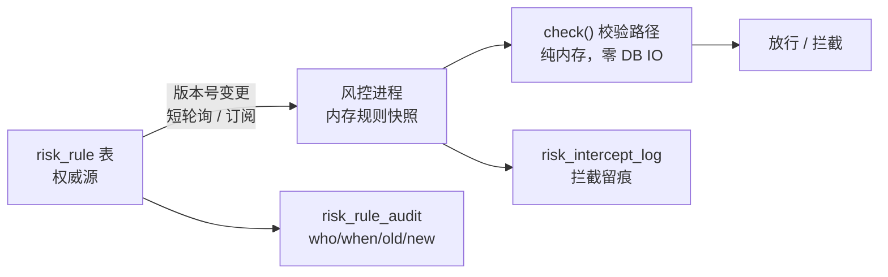
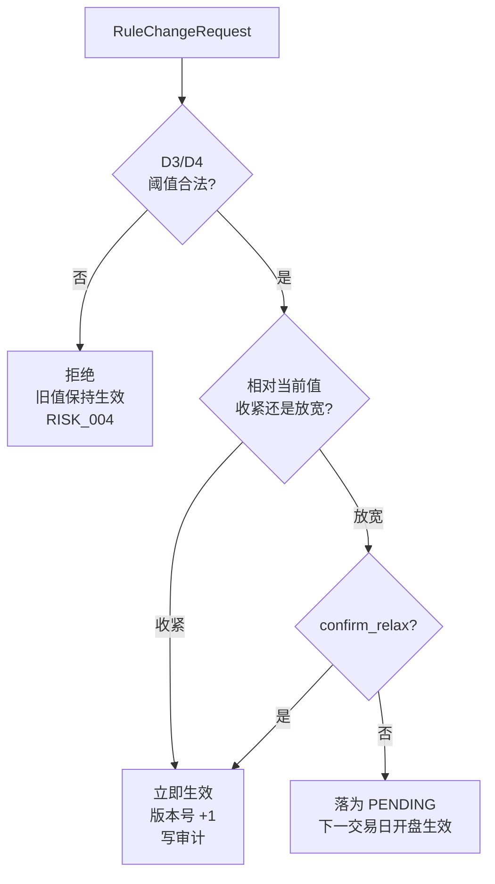

# 智能量化交易平台 — 风控层接口契约文档 v1.0

> 本文件为**手工编写**的契约补充件，与 `智能量化交易平台-核心模块接口契约文档.md`（模块一 策略中心、模块二 回测引擎）配套使用，编号承接为**模块三**。
>
> ⚠️ 注意：主契约 `.md` 由 `.docx` 转换生成，**重新转换会覆盖**。因此本文件的所有内容不写入主契约，避免被覆盖丢失。

## 文档信息

| 项目 | 内容 |
| --- | --- |
| 文档版本 | v1.0 |
| 对应主契约 | 智能量化交易平台 — 核心模块接口契约文档 v1.0 |
| 对应 PRD 模块 | 模块 8（风控层·最高权限） |
| 技术栈 | Java（生产侧风控进程）+ Python（研究/回测侧复用同一规则语义） |
| 通信协议 | gRPC / REST（写入侧）+ 短轮询 / Redis Pub/Sub（变更通知） |
| 目标读者 | AI Agent 开发引擎、架构师、后端工程师 |
| 约束级别 | **强约束** — 所有实现必须严格遵循本契约 |
| 覆盖的缺口 | `开工前缺口清单.md` 阻塞项 **B1** |

---

## 一、设计决策记录（Decision Records）

本节是契约的**前提**。以下 9 条为已裁决项，实现时不得自行更改；如需变更须同步修订本节。

### D1 — 阈值存数据库，DB 是权威源，但校验路径零 IO

风控处于每笔订单的关键路径，且 PRD 要求「风控独立进程运行，即使策略层崩溃也能工作」。两条约束合并的必然结论：



- 进程启动时 `load()` 全量加载规则到内存，之后仅通过版本号感知变更。
- **禁止**在 `check()` 内访问数据库、Redis 或任何外部 IO。
- 变更感知：MVP 用 **短轮询**（每 5s 读 `risk_config_version` 单行，走主键，代价可忽略）；完善版可换 Redis Pub/Sub 或 gRPC stream。

### D2 — 分层覆盖：`SYMBOL > STRATEGY > ACCOUNT > GLOBAL`

同一 `rule_id` 可在 4 个作用域各配一份，生效值取**最具体**的一层（命中即用，不做合并/插值）。

| 层 | scope_key | 典型用途 |
| --- | --- | --- |
| `SYMBOL` | 标的代码 | 某只票单独设更严的仓位上限 |
| `STRATEGY` | 策略 ID | 高波动策略设更严的回撤阈值 |
| `ACCOUNT` | 账户 ID | 多账户差异（未来扩展） |
| `GLOBAL` | 固定 `*` | 兜底默认值，**必须存在** |

> 若不做分层，「某只票特殊额度」「某策略更严」将无处安放，动态调整会退化为全局粗调。

### D3 — 单位统一：`RATIO` 一律存 `0~1` 小数

`0.10` 表示 10%，**禁止**存 `10`。

> 这是本项目最容易出事故的地方：`20` 与 `0.2` 混用会直接产生 **100 倍**偏差。因此：
> - `unit = RATIO` 的阈值**强制校验** `0 < threshold <= 1`，越界即拒绝加载（见 D4）；
> - `db/risk_control.sql` 的种子数据由门禁 `tools/verify_risk_config.py` 强制校验。

### D4 — fail-safe：加载到非法值 → 拒绝加载，保持旧值生效

校验失败（类型错、超范围、必填缺失、GLOBAL 层缺失）时的行为：

1. **整批拒绝**，不部分应用（避免产生「一半新一半旧」的混合状态）；
2. **保持上一份已知良好版本（LKG）继续生效**；
3. 记 `CRITICAL` 日志 + 抛 `RiskConfigInvalidError`（`RISK_004`）。

> 原则：**宁可旧值，不可无值，更不可半新半旧。**

### D5 — 运行状态与放行矩阵

| 运行状态 | 触发条件 | 开仓 | 平仓 / 减仓 |
| --- | --- | --- | --- |
| `NORMAL` | 配置正常 | 按规则校验 | 按规则校验（**黑名单不拦截平仓**） |
| `DEGRADED` | 配置源不可达，用 LKG | **拒绝** | **放行** |
| `BREAKER_TRIPPED` | 策略/账户回撤熔断 | **拒绝** | **放行**（保证能出货） |
| `KILLED` | Kill Switch 激活 | **拒绝** | 仅允许经 `emergency_flatten` 通道 |

**`DEGRADED` 采用「只减仓模式」**（选项 C）：
- 与「保守熔断」（停掉一切）相比，保留了出货能力；
- 与「激进沿用 LKG」（既放行开仓又放行平仓）相比，避免了在阈值可能已过期时继续加仓。

> 说明：Kill Switch 触发后**不平仓**（没有「一键清仓」语义），清仓必须走独立的 `emergency_flatten` 通道显式发起，避免误触导致集中抛售。

### D6 — 生效时机非对称：收紧立即生效，放宽需显式确认

| 变更方向 | 生效时机 |
| --- | --- |
| **收紧**（`tightening_direction` 方向上的变更） | 立即生效 |
| **放宽** | 需 `confirm_relax = True`；未确认则落为 `PENDING`，**于下一交易日开盘时生效** |

> 盘中放宽止损阈值是危险操作，不能一改就生效。此规则要求规则类型携带 `tightening_direction`（见 3.1.1）。

### D7 — 熔断状态不隐式恢复

策略/账户熔断后，**即使阈值被放宽，也绝不自动恢复**。必须显式调用 `resume_breaker()` 并携带 `operator` 与 `reason`。

> 否则「改个阈值」就成了绕过熔断的后门 —— 熔断将形同虚设。熔断状态持久化到 `risk_breaker_state`，**跨进程重启保留**。

### D8 — 权益峰值持久化（否则重启后熔断静默失效）

风控引擎**自行**维护账户/策略权益峰值，并据此计算回撤：

- `drawdown = (peak − current) / peak`；
- 峰值持久化到 `risk_equity_peak`（写变更节流）。

> **为什么必须持久化**：若峰值只存内存，风控进程重启后峰值会被重置为当前权益 ⇒ 回撤恒为 0 ⇒ **回撤熔断永久静默失效**。这是「不报错但完全失效」的最危险形态，必须在契约层面堵死。
>
> 口径由风控层**独家持有**，避免调用方各自实现导致口径不一致。

### D9 — 阈值版本号必须随决策留痕

`RiskCheckResponse.rule_version` 必须写入交易决策日志。

- 对应 PRD「记录每次调仓的决策依据，便于事后归因」；
- 与数据源规范 §5「回测结果必须绑定数据版本号」同一理念，本契约将其贯彻到风控层。

> **已知局限（须在实现中标注）**：回测阶段默认使用**当前**阈值快照而非历史阈值，会高估回测真实性。MVP 接受该局限，但必须记录版本号，以便未来支持按版本重放。

### D10 — 阈值写入不得出现在策略/Agent 的代码路径上

PRD 已声明「第一版完全自用，不设计多用户、权限、计费」，故此处**不是** RBAC，而是**接口边界**：

- PRD 要求「Agent 和策略不能绕过风控」；
- 落地方式：**策略 SDK 与 Agent 沙箱中不导出任何阈值写入方法**。写接口只存在于运维入口（手动调用 / 配置文件导入）。

> 这不需要用户权限体系，只需要「不导出那个方法」—— 把声明变成**类型系统层面的保证**。

---

## 二、全局约定

### 2.1 命名规范

沿用主契约：Python 类名 PascalCase、方法名 snake_case、枚举值 UPPER_SNAKE_CASE；数据库表名与列名 `snake_case`。

### 2.2 单位与口径（**强约束**）

| 单位 | 含义 | 取值范围 |
| --- | --- | --- |
| `RATIO` | 比例，**一律存 `0~1` 小数** | `(0, 1]` |
| `COUNT` | 次数，非负整数 | `>= 0` |
| `ABSOLUTE` | 绝对金额（元），预留 | `>= 0` |

各规则的口径定义集中在 3.1.1，**不得由调用方自行解释**。

### 2.3 失败与降级

- 配置加载失败 → D4（拒绝加载，保持 LKG）；
- 配置源不可达 → D5 `DEGRADED` 只减仓；
- **任何情况下不得「静默放行」**：无法判定时一律拒绝开仓并记 `CRITICAL`。

### 2.4 口径裁决记录

| 项 | 主文档原文 | 本契约裁决 |
| --- | --- | --- |
| 流动性检查 | 「目标**成交量**不超过日均**成交额**的 N%」 | 原文「量」与「额」自相矛盾。**统一按成交额口径**，规则名 `max_order_amount_pct` |

---

## 三、模块三：风控层（Risk Control Layer）

### 3.1 规则体系

#### 3.1.1 规则类型注册表

`rule_id` 为固定标识，不可自定义。所有阈值均为数值型；**名单型规则（黑名单）不在 `risk_rule` 表中**，见 3.6.3。

| rule_id | 名称 | unit | tightening_direction | GLOBAL 默认 | 判定口径（**强约束**） |
| --- | --- | --- | --- | --- | --- |
| `max_position_pct` | 单票仓位上限 | RATIO | `DECREASE` | `0.10` | 该标的持仓市值 / 账户总资产 |
| `max_daily_trades` | 单日单票交易次数上限 | COUNT | `DECREASE` | `3` | 同一**交易日**（交易所交易日历）内、同一标的的**买卖笔数合计** |
| `strategy_drawdown_pct` | 单策略回撤熔断阈值 | RATIO | `DECREASE` | `0.15` | (策略权益峰值 − 当前) / 峰值 |
| `account_drawdown_pct` | 全账户回撤熔断阈值 | RATIO | `DECREASE` | `0.20` | (账户总资产峰值 − 当前) / 峰值 |
| `max_order_amount_pct` | 单笔委托成交额占比上限 | RATIO | `DECREASE` | `0.10` | 委托金额 / 标的当日**日均成交额** |
| `max_sector_pct` | 单行业集中度上限 | RATIO | `DECREASE` | `0.30` | 单行业持仓市值 / 账户总资产 |

> **默认值依据**：`strategy_drawdown_pct = 0.15` **严于** PRD 生命周期管理的退役门槛（最大回撤 < 20%）。二者关系必须保持：**熔断是「先刹车再诊断」，退役是「确诊后清退」，熔断阈值必须更早触发。** 该先后关系为强约束。

> 上表默认值即 `db/risk_control.sql` 的种子数据。

#### 3.1.2 作用域解析规则

```
resolve(rule_id, account_id, strategy_id, symbol) -> RiskRule
```

按 `SYMBOL → STRATEGY → ACCOUNT → GLOBAL` 顺序**取第一个存在的层**，命中即返回，不做数值合并。

- `enabled = 0` 的层**视为不存在**，继续向下一层查找；
- `GLOBAL` 层缺失该 `rule_id` ⇒ 视为配置非法，触发 D4；
- 解析结果必须纯内存完成（D1）。

#### 3.1.3 枚举定义

```python
from enum import Enum


class RuleTypeEnum(Enum):
    """风控规则类型枚举。"""
    MAX_POSITION_PCT = "MAX_POSITION_PCT"
    """单票仓位上限。"""

    MAX_DAILY_TRADES = "MAX_DAILY_TRADES"
    """单日单票交易次数上限。"""

    STRATEGY_DRAWDOWN = "STRATEGY_DRAWDOWN"
    """单策略回撤熔断。"""

    ACCOUNT_DRAWDOWN = "ACCOUNT_DRAWDOWN"
    """全账户回撤熔断。"""

    MAX_ORDER_AMOUNT_PCT = "MAX_ORDER_AMOUNT_PCT"
    """单笔委托成交额占比上限。"""

    MAX_SECTOR_PCT = "MAX_SECTOR_PCT"
    """单行业集中度上限。"""


class RuleScopeEnum(Enum):
    """规则作用域枚举，取值顺序即优先级（前者覆盖后者）。"""
    SYMBOL = "SYMBOL"
    STRATEGY = "STRATEGY"
    ACCOUNT = "ACCOUNT"
    GLOBAL = "GLOBAL"


class RuleUnitEnum(Enum):
    """阈值单位枚举。"""
    RATIO = "RATIO"
    """比例，一律存 0~1 小数。"""

    COUNT = "COUNT"
    """次数。"""

    ABSOLUTE = "ABSOLUTE"
    """绝对金额（元），预留。"""


class TighteningDirectionEnum(Enum):
    """收紧方向枚举：指明阈值朝哪个方向变化算「收紧」。"""
    DECREASE = "DECREASE"
    """减小即收紧（本项目全部数值规则均为该方向）。"""

    INCREASE = "INCREASE"
    """增大即收紧（预留，如「最低现金保留」类规则）。"""


class RiskActionEnum(Enum):
    """风控裁决动作枚举，严重度递增。"""
    PASS = "PASS"
    """放行。"""

    REDUCE = "REDUCE"
    """部分放行，需按 adjusted_quantity 缩减委托数量。"""

    REJECT = "REJECT"
    """拒绝该笔委托。"""

    HALT = "HALT"
    """拒绝并触发熔断。"""


class RiskRunStateEnum(Enum):
    """风控层运行状态枚举，对应 D5 放行矩阵。"""
    NORMAL = "NORMAL"
    """正常。"""

    DEGRADED = "DEGRADED"
    """配置源不可达，按 LKG 只减仓。"""

    BREAKER_TRIPPED = "BREAKER_TRIPPED"
    """熔断已触发。"""

    KILLED = "KILLED"
    """Kill Switch 已激活。"""


class BreakerStateEnum(Enum):
    """熔断状态枚举。"""
    NORMAL = "NORMAL"
    """正常。"""

    TRIPPED = "TRIPPED"
    """已熔断，且不得隐式恢复（D7）。"""
```

### 3.2 风控引擎

#### 3.2.1 RiskEngine 类

```python
class RiskEngine:
    """
    风控引擎。

    职责: 持有内存规则快照，对所有交易指令执行零 IO 校验并作出最终裁决。
    约束: check() 内禁止访问数据库 / Redis / 网络（D1）。
    约束: 本类不得向策略与 Agent 暴露任何阈值写入方法（D10）。
    """

    def __init__(self, store: RiskRuleStore, config: RiskEngineConfig) -> None:
        """
        构造风控引擎。

        参数:
            store: 规则存储实例，仅在 load()/reload() 与峰值持久化时被访问。
            config: 引擎配置（轮询间隔、持久化节流等）。

        异常:
            RiskConfigLoadError: 存储层不可达且无本地 LKG 缓存时抛出。
        """
        pass

    def load(self) -> int:
        """
        阻塞式全量加载规则，必须成功后才允许对外提供 check() 服务。

        参数:
            无。

        返回:
            int: 本次加载生效的规则版本号。

        异常:
            RiskConfigInvalidError: 规则校验失败（类型错 / 超范围 / GLOBAL 缺失）时抛出，见 D4。
            RiskConfigLoadError: 存储层不可达时抛出。
        """
        pass

    def reload(self) -> ReloadResult:
        """
        尝试重新加载规则，用于轮询检测到版本变更时调用。

        D4 语义: 校验失败或存储不可达时【不抛异常中断】，而是保持 LKG 生效、
        返回 reloaded=False，并按结果切换运行状态（DEGRADED）。

        参数:
            无。

        返回:
            ReloadResult: 重载结果（是否成功、版本号、运行状态）。
        """
        pass

    def get_rule_version(self) -> int:
        """
        获取当前生效的规则版本号。该值必须写入交易决策日志（D9）。

        返回:
            int: 当前生效版本号；处于 DEGRADED 时为 LKG 版本号。
        """
        pass

    def get_effective_rule(
        self,
        rule_id: str,
        account_id: str,
        strategy_id: str,
        symbol: str
    ) -> RiskRule:
        """
        按分层覆盖规则（D2）解析生效阈值，纯内存操作。

        参数:
            rule_id: 规则标识。
            account_id: 账户标识。
            strategy_id: 策略标识。
            symbol: 标的代码。

        返回:
            RiskRule: 生效规则（含生效作用域，便于事后归因）。

        异常:
            RiskRuleNotFoundError: GLOBAL 层缺失该规则时抛出。
        """
        pass

    def check(self, request: RiskCheckRequest) -> RiskCheckResponse:
        """
        对单笔交易指令执行风控校验。核心方法，必须为纯内存、可重入、线程安全。

        参数:
            request: 校验请求。所有判定所需状态由调用方通过 snapshot 提供，
                     引擎不回查数据库（D1）、不修改 request。

        返回:
            RiskCheckResponse: 裁决结果。即便放行也须返回 rule_version（D9）。

        异常:
            RiskConfigInvalidError: 引擎处于不可判定状态时抛出（宁可抛异常也不静默放行）。
        """
        pass

    def get_run_state(self) -> RiskRunStateEnum:
        """
        获取风控层运行状态（D5）。

        返回:
            RiskRunStateEnum: 运行状态。
        """
        pass

    def get_breaker_state(self, breaker_key: str) -> BreakerState:
        """
        获取指定熔断单元的熔断状态。

        参数:
            breaker_key: 熔断单元标识，格式 'ACCOUNT:<account_id>' 或 'STRATEGY:<strategy_id>'。

        返回:
            BreakerState: 熔断状态。
        """
        pass

    def trip_breaker(self, breaker_key: str, reason: str) -> BreakerState:
        """
        触发熔断，并持久化到 risk_breaker_state（跨重启保留）。

        参数:
            breaker_key: 熔断单元标识。
            reason: 触发原因，必须可读（如 '策略回撤 16.3% 超过阈值 15%'）。

        返回:
            BreakerState: 触发后的熔断状态。
        """
        pass

    def resume_breaker(self, breaker_key: str, operator: str, reason: str) -> BreakerState:
        """
        显式恢复熔断。D7: 熔断绝不因阈值放宽而自动恢复，必须经本方法。

        参数:
            breaker_key: 熔断单元标识。
            operator: 操作人标识（写入审计）。
            reason: 恢复原因（写入审计）。

        返回:
            BreakerState: 恢复后的熔断状态。

        异常:
            IllegalStateError: 熔断单元不处于 TRIPPED 状态时抛出。
        """
        pass

    def apply_change(self, change: RuleChangeRequest) -> RuleChangeResult:
        """
        应用阈值变更，执行 D6 的非对称生效与 D4 的校验。

        注意: 本方法是【运维入口专用】。策略 SDK 与 Agent 沙箱不得导出本方法（D10）。

        参数:
            change: 变更请求。

        返回:
            RuleChangeResult: 变更结果（是否已生效 / 是否落为 PENDING）。

        异常:
            RiskConfigInvalidError: 新阈值非法时抛出，旧值保持生效。
        """
        pass

    def start_watchdog(self) -> None:
        """
        启动变更轮询（默认 5s 读取 risk_config_version），检测到版本变更时调用 reload()。
        """
        pass

    def stop_watchdog(self) -> None:
        """
        停止变更轮询。
        """
        pass

    def health(self) -> RiskEngineHealth:
        """
        获取引擎健康度，供运维监控。

        返回:
            RiskEngineHealth: 含运行状态、生效版本、LKG 版本、上次加载时间、是否可用。
        """
        pass
```

#### 3.2.2 RiskEngineConfig 数据类

```python
@dataclass
class RiskEngineConfig:
    """
    风控引擎配置数据类。
    """
    poll_interval_seconds: int = 5
    """int: 规则版本轮询间隔（秒）。默认 5。"""

    peak_persist_interval_seconds: int = 30
    """int: 权益峰值持久化节流间隔（秒）。默认 30，防止高频写库（D8）。"""

    lkg_cache_path: str = "data/risk_lkg.json"
    """str: 本地 LKG 缓存路径。存储层不可达时由此恢复，保证风控可独立启动。"""

    engine_state_persist_interval_seconds: int = 5
    """int: 运行状态回写间隔（秒）。默认 5，用于让 Java 侧感知 Python 侧降级。"""

    degraded_allow_close: bool = True
    """bool: DEGRADED 状态下是否放行平仓/减仓。默认 True，即「只减仓模式」（D5）。"""

    breaker_allow_close: bool = True
    """bool: 熔断状态下是否放行平仓/减仓。默认 True（D5）。"""
```

#### 3.2.3 RiskSnapshot 数据类

```python
@dataclass
class RiskSnapshot:
    """
    风控判定所需的账户/策略/标的实时快照。

    职责: 由调用方（组合调度层）填充，使风控引擎得以零 IO 完成判定（D1）。
    注意: 峰值与回撤【不在本类中】—— 由风控引擎独家维护（D8），避免口径分裂。
    """
    total_asset: float
    """float: 账户总资产（元）。引擎据此更新权益峰值。"""

    available_capital: float
    """float: 可用资金（元）。"""

    strategy_equity: float
    """float: 该策略当前权益（元）。引擎据此更新策略峰值。"""

    position_value_by_symbol: Dict[str, float]
    """Dict[str, float]: 各标的持仓市值 {标的代码: 市值}，用于仓位上限与集中度判定。"""

    position_value_by_sector: Dict[str, float]
    """Dict[str, float]: 各行业持仓市值 {行业代码: 市值}，用于行业集中度判定。"""

    symbol_avg_daily_amount: float
    """float: 该标的当日日均成交额（元），用于 max_order_amount_pct 判定。"""

    daily_trade_count_by_symbol: Dict[str, int]
    """Dict[str, int]: 当日各标的已成交笔数（买卖合计），用于 max_daily_trades 判定。"""

    trading_date: str
    """str: 交易日（YYYY-MM-DD，交易所日历口径）。跨日时调用方负责清零计数器。"""
```

#### 3.2.4 RiskCheckRequest 数据类

```python
@dataclass
class RiskCheckRequest:
    """
    风控校验请求数据类。
    由组合调度层在生成最终交易指令后、提交执行层之前构造（PRD: 风控拥有最终否决权）。
    """
    request_id: str
    """str: 请求唯一标识（UUID），用于串联拦截记录与决策日志。"""

    account_id: str
    """str: 账户标识。"""

    strategy_id: str
    """str: 策略标识，即交易意图的来源，用于策略级规则判定。"""

    symbol: str
    """str: 标的代码。"""

    side: SideEnum
    """SideEnum: 买卖方向。"""

    is_open: bool
    """bool: 是否为开仓方向。

    由调用方判定并显式传入: True=开仓/加仓，False=平仓/减仓。
    熔断类规则与黑名单【仅拦截开仓】，以保证任何情况下都能出货（D5）。
    """

    quantity: int
    """int: 委托数量（股）。"""

    price: float
    """float: 委托价格（元）。"""

    snapshot: RiskSnapshot
    """RiskSnapshot: 实时快照，见 3.2.3。"""
```

#### 3.2.5 RiskCheckResponse 数据类

```python
@dataclass
class RiskCheckResponse:
    """
    风控校验响应数据类。
    """
    decision_id: str
    """str: 决策唯一标识，与 request_id 一一对应，写入交易决策日志。"""

    passed: bool
    """bool: 是否放行。仅 action == PASS 时为 True。"""

    action: RiskActionEnum
    """RiskActionEnum: 裁决动作，取所有违规中严重度最高者。"""

    rule_version: int
    """int: 本次判定所依据的规则版本号。必须随决策留痕（D9）。"""

    violations: List[RiskViolation]
    """List[RiskViolation]: 违规明细。放行时为空列表。"""

    adjusted_quantity: int
    """int: action == REDUCE 时风控允许的最大数量；其余情况等于请求数量。"""

    run_state: RiskRunStateEnum
    """RiskRunStateEnum: 判定时的运行状态（D5）。"""

    message: str
    """str: 人类可读结论，用于日志与告警。"""
```

#### 3.2.6 RiskViolation 数据类

```python
@dataclass
class RiskViolation:
    """
    单条风控违规明细数据类。
    """
    rule_id: str
    """str: 触发的规则标识。"""

    rule_type: RuleTypeEnum
    """RuleTypeEnum: 规则类型。"""

    scope: RuleScopeEnum
    """RuleScopeEnum: 【实际生效】的作用域，便于事后归因到具体层级（D2）。"""

    scope_key: str
    """str: 实际生效的作用域键。"""

    threshold: float
    """float: 生效阈值（已按 unit 语义解释）。"""

    observed: float
    """float: 实际观测值。"""

    severity: str
    """str: 严重程度（WARNING / ERROR / CRITICAL）。"""

    action: RiskActionEnum
    """RiskActionEnum: 该条违规对应的动作。"""

    message: str
    """str: 可读描述，如 '单票仓位 12.4% 超过上限 10.0%'。"""
```

#### 3.2.7 BreakerState / ReloadResult / RiskEngineHealth / RiskChangeResult 数据类

```python
@dataclass
class BreakerState:
    """
    熔断单元状态数据类。持久化于 risk_breaker_state，跨重启保留（D7）。
    """
    breaker_key: str
    """str: 熔断单元标识。"""

    state: BreakerStateEnum
    """BreakerStateEnum: 熔断状态。"""

    triggered_at: Optional[datetime]
    """Optional[datetime]: 触发时间。未触发时为 None。"""

    trigger_reason: str
    """str: 触发原因。"""

    resumed_at: Optional[datetime]
    """Optional[datetime]: 恢复时间。未恢复时为 None。"""

    resumed_by: str
    """str: 恢复操作人。"""


@dataclass
class ReloadResult:
    """
    规则重载结果数据类。
    """
    reloaded: bool
    """bool: 是否成功应用了新版本。False 表示保持 LKG 生效（D4）。"""

    rule_version: int
    """int: 【当前生效】的版本号。"""

    attempted_version: int
    """int: 本次尝试加载的版本号。与 rule_version 不同即说明加载失败。"""

    run_state: RiskRunStateEnum
    """RiskRunStateEnum: 重载后的运行状态。"""

    error: str
    """str: 失败原因。成功时为空字符串。"""


@dataclass
class RiskEngineHealth:
    """
    风控引擎健康度数据类。
    """
    run_state: RiskRunStateEnum
    """RiskRunStateEnum: 运行状态。"""

    rule_version: int
    """int: 当前生效版本号。"""

    lkg_version: int
    """int: 最近一次已知良好版本号。"""

    last_load_at: Optional[datetime]
    """Optional[datetime]: 上次成功加载时间。"""

    store_reachable: bool
    """bool: 配置源是否可达。"""

    available: bool
    """bool: 引擎是否可对外提供校验服务。"""


@dataclass
class RiskChangeResult:
    """
    阈值变更结果数据类（D6）。
    """
    applied: bool
    """bool: 是否【立即】生效。"""

    pending: bool
    """bool: 是否落为 PENDING，待下一交易日开盘生效（放宽且未确认时）。"""

    effective_at: Optional[datetime]
    """Optional[datetime]: 预计生效时间。立即生效时为 None。"""

    old_threshold: float
    """float: 变更前阈值。"""

    new_threshold: float
    """float: 变更后阈值。"""

    direction: TighteningDirectionEnum
    """TighteningDirectionEnum: 本次变更方向。"""

    rule_version: int
    """int: 应用后的新版本号；未生效时仍返回当前版本号。"""

    message: str
    """str: 可读描述，如 '放宽变更未确认，已排入下一交易日开盘生效'。"""
```

### 3.3 规则存储与热更新

#### 3.3.1 RiskRuleStore 抽象类

```python
from abc import ABC, abstractmethod


class RiskRuleStore(ABC):
    """
    风控规则存储抽象基类。

    职责: 隔离规则来源，使风控引擎不感知底层是 PostgreSQL、文件还是内存。
    约束: 本抽象类【仅】被 load()/reload()/apply_change() 调用，
          绝不允许被 check() 调用（D1）。
    """

    @abstractmethod
    def load_rules(self) -> List[RiskRule]:
        """
        全量加载当前生效规则。

        返回:
            List[RiskRule]: 规则列表（含各作用域）。

        异常:
            RiskConfigLoadError: 存储层不可达时抛出。
        """
        pass

    @abstractmethod
    def get_version(self) -> int:
        """
        读取当前配置版本号。必须为低成本查询（主键单行），供短轮询调用。

        返回:
            int: 版本号；配置从未变更时为 0。

        异常:
            RiskConfigLoadError: 存储层不可达时抛出。
        """
        pass

    @abstractmethod
    def save_change(self, change: RuleChangeRequest) -> int:
        """
        写入阈值变更，并在同一事务内递增版本号、追加审计记录。

        参数:
            change: 变更请求。

        返回:
            int: 递增后的新版本号。

        异常:
            RiskConfigWriteError: 写入失败时抛出。
        """
        pass
```

#### 3.3.2 DbRiskRuleStore 类

```python
class DbRiskRuleStore(RiskRuleStore):
    """
    PostgreSQL 规则存储实现，生产环境使用。

    约束: 本类是【唯一】允许写 risk_rule 表的组件（D10）。
    约束: 本类不得被策略 SDK 或 Agent 沙箱引用。
    约束: 写入前必须做应用层校验，但不得【仅】依赖应用层校验 ——
          RATIO 范围、GLOBAL 键等不变量已下沉为数据库 CHECK 约束（§3.6.4），
          数据库拒绝时应转译为 RiskConfigInvalidError（RISK_004）。
    """

    def __init__(self, connection_factory: Callable[[], Any]) -> None:
        """
        构造数据库规则存储。

        参数:
            connection_factory: 连接工厂（连接池），线程安全。
        """
        pass

    def load_rules(self) -> List[RiskRule]:
        """
        全量加载 risk_rule 表并执行 D3/D4 校验。

        异常:
            RiskConfigLoadError: 数据库不可达时抛出。
            RiskConfigInvalidError: 校验失败时抛出（RATIO 越界、GLOBAL 缺失等）。
        """
        pass

    def get_version(self) -> int:
        """
        读取 risk_config_version 单行主键，成本常数级。
        """
        pass

    def save_change(self, change: RuleChangeRequest) -> int:
        """
        在单事务内完成: 更新 risk_rule → 递增 risk_config_version → 追加 risk_rule_audit。
        """
        pass

    def save_equity_peak(self, peak_key: str, peak_value: float) -> None:
        """
        持久化权益峰值（D8），按 RiskEngineConfig.peak_persist_interval_seconds 节流调用。

        参数:
            peak_key: 峰值单元标识，格式 'ACCOUNT:<id>' 或 'STRATEGY:<id>'。
            peak_value: 峰值权益（元）。
        """
        pass

    def load_equity_peaks(self) -> Dict[str, float]:
        """
        加载全部权益峰值。引擎启动时调用，避免重启后回撤熔断静默失效（D8）。

        返回:
            Dict[str, float]: {peak_key: 峰值权益}。
        """
        pass

    def save_breaker_state(self, state: BreakerState) -> None:
        """
        持久化熔断状态（D7）。
        """
        pass

    def load_breaker_states(self) -> Dict[str, BreakerState]:
        """
        加载全部熔断状态。引擎启动时必须恢复，避免重启绕过熔断。
        """
        pass
```

#### 3.3.3 MemoryRiskRuleStore 类

```python
class MemoryRiskRuleStore(RiskRuleStore):
    """
    内存规则存储实现。

    用途:
        - 回测: 以固定快照运行，保证回测可复现（D9）。
        - 单元测试: 无外部依赖。
    约束: save_change() 仅更新内存版本号，不持久化。
    """

    def __init__(self, rules: Optional[List[RiskRule]] = None) -> None:
        """
        构造内存规则存储。

        参数:
            rules: 初始规则列表。为 None 时使用 3.1.1 的 GLOBAL 默认值。
        """
        pass
```

#### 3.3.4 RiskRule 数据类

```python
@dataclass
class RiskRule:
    """
    单条风控规则数据类。
    """
    rule_id: str
    """str: 规则标识，取自 3.1.1 注册表。"""

    rule_type: RuleTypeEnum
    """RuleTypeEnum: 规则类型。"""

    scope: RuleScopeEnum
    """RuleScopeEnum: 作用域。"""

    scope_key: str
    """str: 作用域键。GLOBAL 层固定为 '*'。"""

    threshold: float
    """float: 阈值。unit == RATIO 时【必须】为 0~1 小数（D3）。"""

    unit: RuleUnitEnum
    """RuleUnitEnum: 阈值单位。"""

    comparison: str
    """str: 比较方向（LTE / GTE）。默认 LTE。"""

    enabled: bool
    """bool: 是否启用。为 False 时该层视为不存在，继续向下一层查找（D2）。"""

    version: int
    """int: 该行的配置版本号。"""

    updated_by: str
    """str: 最后修改人。"""

    updated_at: datetime
    """datetime: 最后修改时间。"""

    description: str
    """str: 规则说明。"""

    @property
    def tightening_direction(self) -> TighteningDirectionEnum:
        """
        收紧方向，由 rule_type 静态映射（3.1.1），不从数据库读取。

        返回:
            TighteningDirectionEnum: 收紧方向。
        """
        ...
```

#### 3.3.5 阈值变更接口

```python
@dataclass
class RuleChangeRequest:
    """
    阈值变更请求数据类。
    约束: 仅由运维入口构造，不得出现在策略/Agent 代码路径（D10）。
    """
    rule_id: str
    """str: 规则标识。"""

    scope: RuleScopeEnum
    """RuleScopeEnum: 作用域。"""

    scope_key: str
    """str: 作用域键。"""

    new_threshold: float
    """float: 新阈值。unit == RATIO 时必须为 0~1 小数（D3）。"""

    operator: str
    """str: 操作人标识，写入审计。"""

    reason: str
    """str: 变更原因，写入审计。必填。"""

    confirm_relax: bool = False
    """bool: 是否确认放宽。

    D6: 放宽变更若未置 True，不会立即生效，而是排入下一交易日开盘生效。
    收紧变更不受此项影响，立即生效。
    """
```

变更流程：



### 3.4 Kill Switch

#### 3.4.1 KillSwitch 类

```python
class KillSwitch:
    """
    全局 Kill Switch（PRD: 一键熔断所有交易）。

    职责: 拥有最高优先级，激活后立即拒绝一切【开仓】指令。
    约束: 与 RiskEngine 分离实现，且状态同时落本地文件与数据库 —— 即使配置源
          完全不可达，也必须能够激活，并在重启后仍然保持激活状态。
    约束: 不得提供「一键清仓」语义；被禁标的的清仓须走 emergency_flatten（D5）。
    """

    def activate(self, reason: str, operator: str) -> SwitchState:
        """
        激活 Kill Switch。必须为幂等操作，且【不依赖任何外部存储可用】。

        参数:
            reason: 触发原因（必填，写入审计）。
            operator: 操作人标识。

        返回:
            SwitchState: 激活后的状态。
        """
        pass

    def deactivate(self, operator: str, reason: str, confirmation: str) -> SwitchState:
        """
        解除 Kill Switch。必须携带显式确认串，防止误触。

        参数:
            operator: 操作人标识。
            reason: 解除原因（必填）。
            confirmation: 确认串，必须等于约定常量 'CONFIRM_RESUME_TRADING'。

        返回:
            SwitchState: 解除后的状态。

        异常:
            IllegalStateError: 确认串不匹配时抛出。
        """
        pass

    def is_active(self) -> bool:
        """
        查询激活状态。纯内存读取，供 check() 路径高频调用。

        返回:
            bool: 是否激活。
        """
        pass

    def get_state(self) -> SwitchState:
        """
        获取完整状态。

        返回:
            SwitchState: 含激活标志、原因、操作人、时间。
        """
        pass

    def emergency_flatten(self, reason: str, operator: str) -> str:
        """
        发起紧急清仓。为显式通道，与 Kill Switch 解耦，避免误触导致集中抛售。

        参数:
            reason: 清仓原因。
            operator: 操作人标识。

        返回:
            str: 清仓任务标识，用于跟踪进度。
        """
        pass
```

#### 3.4.2 SwitchState 数据类

```python
@dataclass
class SwitchState:
    """
    Kill Switch 状态数据类。持久化于本地文件 + risk_switch_state 表。
    """
    active: bool
    """bool: 是否激活。"""

    activated_at: Optional[datetime]
    """Optional[datetime]: 激活时间。"""

    activated_by: str
    """str: 激活操作人。"""

    reason: str
    """str: 激活原因。"""

    deactivated_at: Optional[datetime]
    """Optional[datetime]: 解除时间。"""

    deactivated_by: str
    """str: 解除操作人。"""
```

### 3.5 gRPC 接口定义

#### 3.5.1 risk_control.proto

> 通信层契约。Java 侧风控进程为服务端，Python 研究层为客户端。

```protobuf
syntax = "proto3";

package quant.risk.v1;

import "google/protobuf/timestamp.proto";
import "google/protobuf/empty.proto";

// ============================================================
// 枚举
// ============================================================

enum RiskAction {
  RISK_ACTION_UNSPECIFIED = 0;
  RISK_ACTION_PASS = 1;
  RISK_ACTION_REDUCE = 2;
  RISK_ACTION_REJECT = 3;
  RISK_ACTION_HALT = 4;
}

enum RiskRunState {
  RISK_RUN_STATE_UNSPECIFIED = 0;
  RISK_RUN_STATE_NORMAL = 1;
  RISK_RUN_STATE_DEGRADED = 2;
  RISK_RUN_STATE_BREAKER_TRIPPED = 3;
  RISK_RUN_STATE_KILLED = 4;
}

enum BreakerState {
  BREAKER_STATE_UNSPECIFIED = 0;
  BREAKER_STATE_NORMAL = 1;
  BREAKER_STATE_TRIPPED = 2;
}

enum RuleScope {
  RULE_SCOPE_UNSPECIFIED = 0;
  RULE_SCOPE_SYMBOL = 1;
  RULE_SCOPE_STRATEGY = 2;
  RULE_SCOPE_ACCOUNT = 3;
  RULE_SCOPE_GLOBAL = 4;
}

enum TradeSide {
  TRADE_SIDE_UNSPECIFIED = 0;
  TRADE_SIDE_BUY = 1;
  TRADE_SIDE_SELL = 2;
}

// ============================================================
// 校验相关消息
// ============================================================

// 风控判定所需的实时快照。由调用方填充，风控侧不回查数据库。
message RiskSnapshot {
  double total_asset = 1;
  double available_capital = 2;
  double strategy_equity = 3;
  map<string, double> position_value_by_symbol = 4;
  map<string, double> position_value_by_sector = 5;
  double symbol_avg_daily_amount = 6;
  map<string, int32> daily_trade_count_by_symbol = 7;
  string trading_date = 8;       // YYYY-MM-DD
}

message RiskCheckRequest {
  string request_id = 1;
  string account_id = 2;
  string strategy_id = 3;
  string symbol = 4;
  TradeSide side = 5;
  bool is_open = 6;              // true=开仓，false=平仓/减仓
  int64 quantity = 7;
  double price = 8;
  RiskSnapshot snapshot = 9;
}

message RiskViolation {
  string rule_id = 1;
  string rule_type = 2;
  RuleScope scope = 3;
  string scope_key = 4;
  double threshold = 5;
  double observed = 6;
  string severity = 7;           // WARNING / ERROR / CRITICAL
  RiskAction action = 8;
  string message = 9;
}

message RiskCheckResponse {
  string decision_id = 1;
  bool passed = 2;
  RiskAction action = 3;
  int64 rule_version = 4;        // 必须随交易决策留痕
  repeated RiskViolation violations = 5;
  int64 adjusted_quantity = 6;
  RiskRunState run_state = 7;
  string message = 8;
}

// ============================================================
// 规则与状态查询
// ============================================================

message RuleVersionResponse {
  int64 rule_version = 1;
  int64 lkg_version = 2;
  RiskRunState run_state = 3;
  bool store_reachable = 4;
}

message RuleEntry {
  string rule_id = 1;
  string rule_type = 2;
  RuleScope scope = 3;
  string scope_key = 4;
  double threshold = 5;
  string unit = 6;               // RATIO / COUNT / ABSOLUTE
  string comparison = 7;         // LTE / GTE
  bool enabled = 8;
  string description = 9;
}

message RuleListResponse {
  repeated RuleEntry rules = 1;
  int64 rule_version = 2;
}

message BreakerStateRequest {
  string breaker_key = 1;        // 'ACCOUNT:<id>' 或 'STRATEGY:<id>'
}

message BreakerStateResponse {
  string breaker_key = 1;
  BreakerState state = 2;
  google.protobuf.Timestamp triggered_at = 3;
  string trigger_reason = 4;
  google.protobuf.Timestamp resumed_at = 5;
  string resumed_by = 6;
}

message ResumeBreakerRequest {
  string breaker_key = 1;
  string operator = 2;
  string reason = 3;
}

// ============================================================
// 服务定义
// ============================================================

service RiskService {
  // 单笔交易指令风控校验。高频调用，服务端必须零 DB IO。
  rpc CheckOrder (RiskCheckRequest) returns (RiskCheckResponse);

  // 查询生效规则版本，用于客户端短轮询感知配置变更。
  rpc GetRuleVersion (google.protobuf.Empty) returns (RuleVersionResponse);

  // 查询当前生效规则明细，用于运维排查与前端展示。
  rpc ListRules (google.protobuf.Empty) returns (RuleListResponse);

  // 查询熔断状态。
  rpc GetBreakerState (BreakerStateRequest) returns (BreakerStateResponse);

  // 显式恢复熔断（D7: 熔断绝不隐式恢复）。
  rpc ResumeBreaker (ResumeBreakerRequest) returns (BreakerStateResponse);
}

service KillSwitchService {
  rpc Activate (SwitchCommand) returns (SwitchStateResponse);
  rpc Deactivate (SwitchCommand) returns (SwitchStateResponse);
  rpc GetState (google.protobuf.Empty) returns (SwitchStateResponse);

  // 服务端推送状态变更，客户端据此立即停机，无需轮询。
  rpc Watch (google.protobuf.Empty) returns (stream SwitchStateResponse);
}

message SwitchCommand {
  string reason = 1;
  string operator = 2;
  string confirmation = 3;       // Deactivate 时必须为 'CONFIRM_RESUME_TRADING'
}

message SwitchStateResponse {
  bool active = 1;
  google.protobuf.Timestamp activated_at = 2;
  string activated_by = 3;
  string reason = 4;
  google.protobuf.Timestamp deactivated_at = 5;
  string deactivated_by = 6;
}
```

> ⚠️ 注意：主契约 `common.proto` 存在两处缺陷（`MarketDataResponse` 字段号与 `symbol = 1` 冲突、文件在 `double adjust_factor = 1` 处截断、全无 `service`/`rpc`）。本文件不修改它，缺陷记录见 `开工前缺口清单.md` B5。

### 3.6 持久化结构

> **目标库：PostgreSQL 14+**（不用 MySQL）。可执行 DDL 见 **`db/risk_control.sql`**（含默认阈值种子数据）。本节为结构说明。

**PostgreSQL 落地约定（强约束）**：

| # | 约定 | 理由 |
| --- | --- | --- |
| 1 | 标识符一律**不加双引号、全小写** | PostgreSQL 把未加引号的标识符折叠为小写，加过引号的则终身区分大小写；混用是「对象不存在」类事故的常见根因 |
| 2 | 时间列一律 `timestamptz(3)` | 存绝对时刻；展示口径由应用层统一为 `Asia/Shanghai`，不在库里存本地时间 |
| 3 | 阈值 `numeric(18,8)`、权益 `numeric(20,4)` | 不用 `double precision`，避免阈值比较出现浮点噪声 |
| 4 | 布尔用 `boolean`，自增用 `GENERATED ALWAYS AS IDENTITY` | 不用 `tinyint(1)` / `auto_increment` |
| 5 | 关键不变量**下沉为 `CHECK` 约束** | 见 §3.6.4：绕过风控进程手工 `UPDATE` 时的最后一道防线 |
| 6 | 种子用 `INSERT ... ON CONFLICT (…) DO NOTHING` | 重复执行**不覆盖**运维已调过的阈值（幂等） |
| 7 | 分区只能在建表时声明 | `PARTITION BY RANGE` **无法后加**；MVP 先单表 + 定时 `DELETE`/`VACUUM`，数据量上来后重建为分区表 |

#### 3.6.1 表清单

| 表名 | 职责 | 写入方 |
| --- | --- | --- |
| `risk_rule` | 权威阈值配置，按 `(rule_id, scope, scope_key)` 唯一 | 仅 `DbRiskRuleStore` |
| `risk_config_version` | 单行版本号，供低成本轮询 | 仅 `DbRiskRuleStore` |
| `risk_rule_audit` | 变更审计，**只追加** | 仅 `DbRiskRuleStore` |
| `risk_blacklist` | 禁止开仓标的名单（名单型规则） | 运维入口 |
| `risk_intercept_log` | 拦截留痕，**只追加** | 风控引擎（异步批量） |
| `risk_breaker_state` | 熔断状态，**必须跨重启保留**（D7） | 风控引擎 |
| `risk_equity_peak` | 权益峰值，**必须跨重启保留**（D8） | 风控引擎（节流） |
| `risk_switch_state` | Kill Switch 状态（另存本地文件冗余） | `KillSwitch` |
| `risk_decision_log` | 决策日志，含 `rule_version`（D9） | 风控引擎（异步批量） |

#### 3.6.2 索引与容量

| 表 | 关键索引 | 容量预估 |
| --- | --- | --- |
| `risk_intercept_log` | `(created_at)`、`(strategy_id, created_at)` | 按日分区，保留 1 年 |
| `risk_decision_log` | `(created_at)`、`(account_id, created_at)` | 按日分区，保留 1 年 |
| `risk_rule_audit` | `(created_at)` | 长期保留（变更极少） |
| `risk_equity_peak` | 主键 | 行数 = 账户数 + 策略数 |

> **写入路径要求**：`risk_intercept_log` / `risk_decision_log` 必须是**异步批量写入**，绝不可阻塞 `check()` 路径（D1）。

#### 3.6.3 名单型规则说明

黑名单存放于 `risk_blacklist`，**不使用 `risk_rule` 表**（因其 `threshold` 为数值型）。语义：

- 仅拦截 `is_open == True` 的委托；
- 允许平仓/减仓，避免持有黑名单标的后无法出货。

#### 3.6.4 数据库级不变量（最后防线）

以下约束**必须**由数据库强制。应用层校验拦得住正常调用，拦不住一次手工 `UPDATE`，而阈值写错的代价是真实的资金。

| 约束名 | 所在表 | 强制内容 | 依据 |
| --- | --- | --- | --- |
| `ck_risk_rule_ratio_range` | `risk_rule` | `unit = 'RATIO'` 时 `0 < threshold <= 1` | D3（防 100 倍单位事故） |
| `ck_risk_rule_global_key` | `risk_rule` | `scope = 'GLOBAL'` 时 `scope_key` 必须为 `'*'` | D2（GLOBAL 是兜底层） |
| `ck_risk_rule_count_int` | `risk_rule` | `unit = 'COUNT'` 时阈值必须为整数 | §2.2（「最多 3.5 笔」无意义） |
| `ck_risk_rule_nonneg` | `risk_rule` | 阈值 ≥ 0 | §2.2 |
| `ck_risk_rule_scope` / `ck_risk_rule_unit` / `ck_risk_rule_comparison` | `risk_rule` | 三组枚举取值合法 | §2.2、§3.1.3 |
| `ck_risk_config_version_singleton` | `risk_config_version` | `id = 1` | D1（单行版本号） |
| `ck_risk_switch_state_singleton` | `risk_switch_state` | `id = 1` | §3.4.1（单行开关） |
| `ck_risk_rule_audit_direction` | `risk_rule_audit` | `change_direction ∈ ('', 'TIGHTEN', 'RELAX')` | D6 |
| `ck_risk_intercept_action` | `risk_intercept_log` | `action ∈ ('REDUCE', 'REJECT', 'HALT')` | §3.1.3 |
| `ck_risk_decision_action` | `risk_decision_log` | `action ∈ ('PASS', 'REDUCE', 'REJECT', 'HALT')` | §3.1.3 |
| `ck_risk_decision_run_state` | `risk_decision_log` | `run_state ∈ ('NORMAL', 'DEGRADED', 'BREAKER_TRIPPED', 'KILLED')` | D5 |
| `ck_risk_breaker_state` | `risk_breaker_state` | `state ∈ ('NORMAL', 'TRIPPED')`，**无 HALF_OPEN** | D7（不隐式恢复） |

> **写进 DDL ≠ 生效**。约束表达式写错（`<= 1` 误写成 `< 1`）、枚举漏一个成员、未走迁移就改了 DDL，都能通过全部静态检查却一条也拦不住。因此每一条不变量都必须在 **`db/risk_control.smoke.sql`** 里有一个**必须被拒绝**的样本（外加若干**必须被接受**的边界样本，防约束过紧），全部在事务内执行后 `ROLLBACK`，不留数据。

```powershell
# Windows PowerShell（本文件与 DDL 含中文注释，需先指定客户端编码）
$env:PGCLIENTENCODING = 'UTF8'
psql -v ON_ERROR_STOP=1 -U postgres -d quan -f db/risk_control.sql
psql -v ON_ERROR_STOP=1 -U postgres -d quan -f db/risk_control.smoke.sql
Remove-Item Env:PGCLIENTENCODING
```

- 退出码 `0` + `SMOKE PASS` ⇒ 数据库级不变量均有效；
- 退出码 `3` + `SMOKE FAIL` ⇒ 至少一条是**纸面防线**，必须修复后才能上线。

### 3.7 错误码

> 与主契约附录 D 衔接：`RISK_001`、`RISK_002` 已在主契约中定义，本契约补充 `RISK_003` 起。**两处定义必须保持一致，不得冲突。**

| 错误码 | 级别 | 描述 | 建议措施 |
| --- | --- | --- | --- |
| `RISK_001` | ERROR | 风控拦截 | 检查风控规则和仓位管理（主契约原有） |
| `RISK_002` | CRITICAL | 全局熔断触发 | 检查总回撤是否超过阈值（主契约原有） |
| `RISK_003` | CRITICAL | 单策略熔断触发 | 检查该策略回撤，必要时显式调用 `resume_breaker` |
| `RISK_004` | ERROR | 规则配置非法 | 检查阈值单位（RATIO 必须为 0~1 小数）与 GLOBAL 层完整性 |
| `RISK_005` | CRITICAL | 规则加载失败 | 检查数据库连通性与 `risk_rule` 表结构 |
| `RISK_006` | CRITICAL | 风控降级（配置源不可达） | 已进入 DEGRADED 只减仓模式，立即排查配置源 |
| `RISK_007` | CRITICAL | Kill Switch 已激活 | 确认是否人为触发；恢复须携带确认串 |
| `RISK_008` | ERROR | 熔断未恢复（拒绝隐式恢复） | 熔断不会因阈值放宽自动解除，须显式 `resume_breaker` |
| `RISK_009` | ERROR | 放宽变更未确认 | 携带 `confirm_relax=True`，或等待下一交易日开盘生效 |
| `RISK_010` | ERROR | 规则版本冲突 | 变更时版本号被并发修改，重新读取后重试 |
| `RISK_011` | ERROR | 权益峰值缺失 | 重启后未加载 `risk_equity_peak`，回撤熔断将失效，立即检查 |

### 3.8 测试要求

> 延续主契约附录 C 体例。

| 模块 | 测试场景 | 覆盖要求 |
| --- | --- | --- |
| 规则加载 | 正常加载、RATIO 越界拒绝、GLOBAL 缺失拒绝、整批回滚（不留半新半旧） | 必须 |
| 分层覆盖 | 四层优先级、`enabled=0` 跳过、GLOBAL 兜底、生效作用域回填正确 | 必须 |
| 校验路径 | 零 IO 断言（打桩 DB 调用必须为零次）、多规则并发触发取最高严重度、`REDUCE` 数量计算 | 必须 |
| 单位口径 | RATIO 存 0~1、`0.1` 与 `10` 产生 100 倍差异的回归用例 | 必须 |
| 放行矩阵 | 四种运行状态 × 开仓/平仓 的全部 8 种组合 | 必须 |
| 变更生效 | 收紧立即生效、放宽需确认、放宽未确认落 PENDING、非法值拒绝且旧值生效 | 必须 |
| 熔断 | 触发、跨重启保留、阈值放宽后仍不自动恢复、显式恢复成功 | 必须 |
| 峰值持久化 | 峰值写入、重启后回撤计算正确、峰值缺失告警（`RISK_011`） | 必须 |
| Kill Switch | 激活幂等、确认串校验、存储不可达时仍可激活、重启后保持激活 | 必须 |
| 版本留痕 | `rule_version` 写入决策日志、回测按固定快照可复现 | 必须 |
| 接口边界 | 策略 SDK / Agent 沙箱中不存在阈值写入方法（`D10` 静态断言） | 必须 |
| 数据库不变量 | `db/risk_control.smoke.sql` 全部通过：每条 `CHECK` 约束都有一个必须被拒绝的样本，且边界合法值必须被接受（§3.6.4） | 必须 |
| 静态一致性 | `python tools/verify_risk_config.py` 输出 `verdict: PASS (0 issue(s))`，且 `--selftest` 输出 `SELFTEST OK` | 必须 |

---

## 四、局限与后续

| 项 | 说明 |
| --- | --- |
| 回测真实性 | 回测默认使用当前阈值而非历史阈值，会高估真实性。MVP 接受，已通过 `rule_version` 留痕以便未来支持按版本重放（D9） |
| 变更通知 | MVP 用短轮询（5s）。完善版应换 Redis Pub/Sub 或 gRPC `Watch`，降低生效延迟 |
| 多账户 | 已预留 `ACCOUNT` 层，但 PRD 声明第一版为自用单账户，暂不实现多账户隔离 |
| 交易日历 | `max_daily_trades` 依赖交易所交易日历，须由数据中心提供，**当前数据中心契约尚未覆盖**（见缺口清单 B2） |
| 行业分类 | `max_sector_pct` 依赖行业分类数据，来源与更新频率待数据源规范补充 |

---

## 五、变更记录

| 版本 | 日期 | 作者 | 变更内容 |
| --- | --- | --- | --- |
| v1.0 | 2026-09-23 | 架构组 | 初始版本。补齐 PRD 模块 8 风控层接口契约，解决缺口清单 B1；确立 D1~D10 设计决策；给出默认阈值与可执行 DDL |
| v1.1 | 2026-09-23 | 架构组 | 持久化目标库由 MySQL 改为 **PostgreSQL 14+**；新增 §3.6 PostgreSQL 落地约定与 §3.6.4 数据库级不变量清单；把 RATIO 范围、GLOBAL 键、COUNT 整数、单行表等不变量下沉为 `CHECK` 约束，并配套 `db/risk_control.smoke.sql` 触发测试与 `tools/verify_risk_config.py` 静态门禁（含 C13 MySQL 残留检查、C14 约束清单检查、C15 触发测试覆盖检查） |

---

## 六、I3 交付与裁决记录（2026-09-24）

> 本节是**追加**记录：上文一个字都没改。每一行都是 I3「让风控真正介入交易」落地时
> 必须在契约与实现之间做的裁决 —— 契约没写到的、或写到了但回测线只能这么解释的，都在这里留痕，
> 免得下一轮把「实现如此」误读成「契约如此」。

### 6.1 交付边界（先划清楚，再看细则）

- **闸门默认关闭**：接线入口是 `BacktestEngine.attach_risk_engine(risk_engine)`；未接线时每根 bar 的下单路径与 I1 **逐一相同**。这条等价关系有一条机器判据：把六个阈值全部放宽到不可触发，结果必须与不接闸门**逐字段相同**。
- **「不接」与「接了但没加载」是两件事**：前者放行（保持 I1 口径），后者**拒单**。存储不可达且无 LKG 缓存时 `load()` 失败 ⇒ 引擎处于未加载态 ⇒ 所有订单不进市场。风控的失败方向是 fail-closed，不是 fail-open。
- **风控统计不进回测报告**：`report_payload()` 顶层仍只有 schema / inputs / deterministic / runtime 四个键。理由是报告承载的是**可复现性口径**（同种子同结果），而风控统计随阈值版本与存储可达性变化；读取口是 `BacktestEngine.risk_summary()`，不是报告文件。

### 6.2 逐条裁决（实现侧口径）

1. **拦截方式**：不抛异常。被拦的订单标 `REJECTED` + 写入 `error_message`，并进 `_rejected`；撮合器自己拒的单（`OrderRejectedError`）走同一本账。⇒ 回测报告里**每一单都有下落**，「凭空消失」不算一种结果。
2. **`passed` 不能当放行判据**：放行与否看 `action`（PASS/REDUCE/REJECT）；`adjusted_quantity` 只在 REDUCE 分支有意义（PASS 分支不回填请求数量）。
3. **severity → action 的下限**：`{WARNING: PASS, ERROR: REDUCE, CRITICAL: REJECT}`。契约给了 severity 与 action 的对应语义，实现把它固化成下限，防止「CRITICAL 却放行」这类组合被误配。
4. **`is_open` 判据**：BUY 算开仓；**卖出但当前无持仓也算开仓**（等于开空，回测线不支持）⇒ 必须过开仓类规则。
5. **`max_daily_trades` 数的是「提交」次数**（含被拦的），不是成交数。
6. **`symbol_avg_daily_amount` = 该标的「至今」均值**（含当根 bar），不是「昨日收盘之前」的均值。
7. **`position_value_by_sector` 回测侧留空**：§四「行业分类」缺口仍在 ⇒ `max_sector_pct` 在回测里最多 WARNING，**不会拦单**。
8. **`strategy_equity` 口径**：`本金 + Σ现金流 + 多头浮动市值`；**现金流符号与持仓符号必须是两个符号**（见 6.3）。
9. **「缩到 0 股」判 `REJECT`，不是 REDUCE**：允许额度算出来是 0 股时，一张 0 股订单交给撮合器只会被以「资金不足」拒掉，理由误导；所以实现直接判 REJECT 并给出「已无剩余额度」的原因。
10. **`_reset_risk_run_state` 不清峰值、不清熔断**（D7：熔断不许隐式恢复）。
11. **持久化粒度不一样**：熔断状态 write-through 立即落库；权益峰值按 `peak_persist_interval_seconds` 节流写（峰值是统计量，丢一次不影响判定方向）。
12. **`write_lkg_cache()` 不在 `load()` 里自动调用**：LKG 兜底是运维动作，不是加载的副作用。
13. **`KillSwitch.activate()` 之后**：新单全拒；**已提交进市场的订单不受影响**（不追单、不自动清仓）；`emergency_flatten` 只能走应急通道，不存在「一键清仓」。
14. **open-only 作用域**：黑名单、流动性这类只作用于开仓的规则在**平仓**时不参与。
15. **名字以主契约与实现为准**：`SideEnum` → `Direction`、`RuleChangeResult` → `RiskChangeResult`。本文档里的旧名不再追随，改以主契约的枚举为准。

### 6.3 本轮咬出的一个真实缺陷（记录在案）

- **症状**：接了闸门的回测「第三笔单莫名被拒」，`risk_summary()` 的 `run_state` 变成熔断态，而账户当天没有任何一笔亏损。
- **根因**：`BacktestEngine._strategy_equity()` 用**同一个符号**同时累计现金流与净持仓 ⇒ 多头持仓在净持仓表里成了负数 ⇒ 浮动市值项被「数量为正」的守卫跳过 ⇒ 满仓瞬间权益被算成 **-60.24736001233396**（实际持有 9700 股、市值 87106）⇒ 回撤观测 **1.0007 > 阈值 1.0000** ⇒ 误熔断 ⇒ 后续订单全拒。
- **修法**：现金流符号与持仓符号拆开（`cash_sign` 与 `-cash_sign`）。
- **防复发**：`tests/test_backtest_risk_gate.py` 里那条用例在**测试内部独立重算**同一条口径（不从被测代码取值），加上 `tools/pytest_mutation_check.py` 的 `M15-risk-equity-sign-regression`（把 `(-cash_sign)` 改回 `cash_sign` 必须让该用例变红）。
- **教训**：这类符号 bug 不会让任何一条既有用例变红，只会让**新接上来的那一层**表现异常；所以「等价性」用例（放宽阈值 ≡ 不接闸门）比单点断言更值钱。

### 6.4 已知限制（不掩盖）

- **缩量买单 → 后续卖单在撮合器处失败**：风控把买单缩到可承受数量后，策略仍按「原计划持仓」下卖单，会出现「卖出超过持仓」。这不是风控判错，而是「策略看到的持仓 ≠ 实际持仓」这条缝在 I3 没有回写机制；回写会改动 I1 的撮合语义，故本轮不做，记为已知限制。
- **回测用当前阈值而非历史阈值**（§四已记），只靠 `rule_version` 留痕。
- **交易日历缺口**（§四已记）：`max_daily_trades` 的「日」用回测 bar 的交易日，不是交易所日历。
- **本节 6.2 的正则化**：C16 只核 rule id / 单位 / 方向 / 默认值四项，**不核比较符与文案**。

### 6.5 与门禁、测试的对应

- `tools/verify_risk_config.py` 新增 **C16**：实现侧的规则注册表（读 `quanauto/risk.py` 字面量，用正则而非 import，这样裸检出也能跑）与本契约 §3.1.1 的表格做四方核对。配套三个注定失败的样本：阈值 `0.10→0.12`、规则 id 改名、删掉整块注册表（空转守卫）。
- `tools/contract-signature-manifest.json` 的 `impl_only` 段新增 `RiskEngine` 与 `KillSwitch` 两条：**本契约不是那份清单的 `contract`**（清单只对主契约逐字核对），故只能按实现侧登记，只查「记下的成员还在、参数没变」，新增公有方法不判红。
- 测试侧：2026-09-24 实测本轮新增 79 条（风控引擎本体 67 条 + 闸门端到端 12 条），全仓 `193 passed`。

---

## 七、I3b 交付与裁决记录（2026-09-25）

> 与 §六 同形：**本节是追加记录，上文一个字都没改**。
> 范围 = `docs/开工前缺口清单.md` §七之二「建议顺序」第 2 项：`DbRiskRuleStore` 真接线 + `risk_intercept_log` 写入。
> 它**不占迭代号**（一个不占号的小步，命名与理由写在 `docs/迭代计划.md` §四 的 I3b 收工记录里；**那个计划的 I4 是「绩效看板」**，与本步不是同一件事）。

**先说清本文件的性质**：本文件是**手写契约**（`docs/` 下没有同名的 `.docx`，见 `CONTEXT.md` §3.B 与硬约束 C2），
所以「只追加、不原地改」在这里是一条**审计约定**（裁决与契约正文分开写、便于对照原文），
**不是**重转换风险 —— 与那三份 `.docx` 派生的 md 不同，本文件不会被任何工具覆盖。

### 7.1 交付边界（先划清，再看细则）

- **存储层**：`DbRiskRuleStore` 的 `load_rules()` / `get_version()` / `save_change()` 三个方法**不再 `raise`**，都真的执行 SQL；
  `save_change()` 仍是**四步同事务**（读旧值 → 递增 `risk_config_version` → upsert `risk_rule` → 追加 `risk_rule_audit`），
  与 §3.3.2 的类注释一致。运行态四件（`load_equity_peaks` / `save_equity_peak` / `load_breaker_states` / `save_breaker_state`）同步接线。
- **留痕**：新增 `RiskInterceptLogWriter`（实现侧名字，契约里没有），由**调用方**在 `check()` 返回之后调用。
- **仍然没接线的部分**（写在明处，免得被当成已完成）：`emergency_flatten()` 仍只返回任务标识（真正的清仓执行不在本仓库的 I0~I4 任何一轮）；
  短轮询 watchdog 只在 DB 版才需要，回测路径不启动；**`risk_decision_log` 仍然零引用**（本步只接 `risk_intercept_log`）。

### 7.2 与 §3.6 的偏离（本节存在的唯一理由）

偏离对象是两处**强约束**原文：

- **§3.6.1 表清单**：`| risk_intercept_log | 拦截留痕，**只追加** | 风控引擎（异步批量） |` —— 写入方写的是**风控引擎**；
- **§3.6.2 末尾写入路径要求**：「`risk_intercept_log` / `risk_decision_log` 必须是**异步批量写入**，绝不可阻塞 `check()` 路径（D1）。」

本实现**没有把写入方放进 `RiskEngine`**，也**没有做后台队列**。逐项对照：

| 项 | 契约原文 | 实现 | 为什么这么落 |
| --- | --- | --- | --- |
| **写入方** | 风控引擎 | **调用方**：`BacktestEngine._record_risk_block()` → `writer.record(...)`（`quanauto/engine.py`），接线入口 `attach_intercept_log()`（默认关闭） | 两条要求不能同时满足：D1 禁止 `check()` 内 IO，而留痕必然是 IO。把写入点放进 `RiskEngine`，就只能在 `check()` 内写（当场违反 D1）或在引擎里自己起线程/队列（引入新运行态）。⇒ 取「**谁拿到 `RiskCheckResponse` 谁写**」：写入点**唯一**，且**必然在 `check()` 返回之后**，D1 的不变式反而更硬 |
| **同步 or 异步** | 异步批量 | 一次拦截 ⇒ **一条同步批量 INSERT**（N 行 = 1 条语句） | 「异步」的目的是**不阻塞 `check()`**；写入发生在同一根 bar 的处理内、`check()` 之外 ⇒ 目的已达成，而队列会在**进程崩溃时丢掉缓冲区里的留痕**，恰恰是留痕最该起作用的时候。⇒ 用**批量**保住语句数，用**同步**保住不丢 |
| **一次拦截 = 几行** | 未写 | **一条 violation 一行** | 表格里 `rule_id` / `threshold` / `observed` 是 `RiskViolation` 的字段，而内存中的 `blocked_orders` 是「一订单一行 + `rule_ids` 列表」。粒度不同，只能在写入时展开 —— 把列表塞进单列会让这行无法归属到规则 |
| **`action` 取值** | `REDUCE/REJECT/HALT`（`ck_risk_intercept_action`） | **订单级** `action`（`response.action`），不是每条 violation 自己的 | 同一订单的多条 violation 可能一条 `REJECT`、一条 `PASS`（WARNING 级），各取各的会让读表的人分不清这单到底怎么了；取订单级还让这些行与 `BacktestEngine.risk_summary()["blocked_orders"][].action` 是同一个值 |
| **`PASS` 要不要留痕** | 未写（表 CHECK 的取值域里**没有** `PASS`） | **不留** | 表结构本身就排除了 `PASS`。`max_sector_pct` 在快照缺行业分类时发的那条 `severity=WARNING / action=PASS` 也**不写**：写入方遇到「没有 violation 可写」直接不写，那是正常路径而不是错误 |
| **失败方向** | 未写 | 写入失败 ⇒ **抛** `RiskConfigWriteError` / `RiskConfigInvalidError`，**不吞** | 留痕丢了却继续跑，等于把「有拦截」变成「查无此事」。回测线里这会让当次运行直接失败，而不是产出缺证据的报告 |

> **一句话口径**：本实现满足「不阻塞 `check()`」这条**目的**，但**不满足**「异步」这条**手段**；
> 代价是订单路径上多一条 INSERT，换来的是崩溃时不丢证据。若将来实盘线要求把 IO 彻底移出订单路径，
> 应改为**先落本地 WAL 再异步搬库**，而不是直接上内存队列。

### 7.3 实现侧新增的名字（契约里没有，别拿契约去找）

| 名字 | 位置 | 是什么 |
| --- | --- | --- |
| `RiskInterceptLogWriter` | `quanauto/risk.py` | 留痕写入器：`rows_for(request, response)` 是纯函数（只拼行），`record(...)` 执行一次批量 INSERT。**契约 §3.6 里没有这个名字**，它是本步为实现 §3.6 的表而加的 |
| `attach_intercept_log(writer)` | `quanauto/engine.py` | 接线入口，与 `attach_risk_engine()` 同形：**默认关闭**，不接就不留痕（不接时行为与本步之前逐一相同） |
| `RiskInterceptError`（`RISK_001`）的**第二个用途** | `quanauto/errors.py` | 契约里它只出现在引擎方法的 `Raises:` 段；本步把它扩成「留痕写入方收到**不该留痕**的响应时抛它」（例如既没有 violation 又要求写行） |

### 7.4 本步在真库上抓到的缺陷（与 §6.3 同形，记录在案）

- **症状**：一次性真库探针（`postgres:17` 容器，与本仓库的容器通道同镜像）里，一条**注定被 CHECK 拒绝**的写入
  拿到的异常是 `DataStoreError`（`DATA_008`，**数据中心族**），而契约与实现都约定这里应当是 `RiskConfigInvalidError`（`RISK_004`、「旧值继续生效」）。
- **根因**：`quanauto/pgstore.py` 的 `PsycopgConnection.execute()` 把驱动异常统一收口成 `DataStoreError` 并 `from exc` ⇒
  `CheckViolation.sqlstate = '23514'` **只存在于 `__cause__` 上**；而旧实现只探本层属性、又用 `except QuanAutoError: raise` 原样放行 ⇒
  整条「库以 CHECK 拒绝 ⇒ RISK_004」的业务语义**在真库上失效**，且 `RiskEngine.apply_change()` 的 `except (RiskConfigLoadError, RiskConfigInvalidError)` 也接不住它。
- **为什么单元测试全绿还是漏了它**：假连接直接抛**裸驱动异常**（第一层就探到 `sqlstate`），而真库抛的是**被包装过的**异常。
  这是本仓库第三次踩「两层各自都绿 ≠ 接起来能跑」，也是第一次定位到具体位置：**错误包装层会吃掉驱动异常的自有属性**。
- **修法**：① 放行判据从「是 `QuanAutoError`」收窄为「**是风控族 `RiskError`**」（按**族**划边界，不按基类划）；
  ② SQLSTATE 沿 `__cause__` / `__context__` 链**限深 8 层**查找（`id()` 去环），抽成 `_translate_to_risk_error()` 供三处调用点共用。
- **防复发**：`tests/test_risk_store.py` 新增 5 条用例，其中 `_wrapped_by_pgstore()` **照抄 `pgstore` 的包装形状**（`DataStoreError ... from CheckViolation`）；
  另有**反面对照**用例断言 `08006`（连接失效）**不许**被当成约束拒绝。`tools/pytest_mutation_check.py` 增 3 条变异专钉这条链
  （放行判据退回 `QuanAutoError` / 不追 `__cause__` 链 / 风控族也被重翻一遍）—— 只测裸驱动异常是**抓不到**它们的。
- **教训**：与 §6.3 同一条 —— 缺陷只出现在**新接上来的那一层**；对驱动行为的假设属于**外部事实**，只能测、不能想。

### 7.5 与门禁、测试的对应

- **门禁**：`python tools/run_all_gates.py` → **11/11**（`GATES_EXIT=0`，`SCOPE: FULL`）；B7 棘轮 **39/39 未动**（本步没有还掉任何欠账）。
- **测试**：全仓 `pytest -q` → **337 passed**。其中本步新增 `tests/test_risk_store.py`（**61 条**，全部用假连接：钉语句数、参数类型、事务边界、异常翻译）
  与 `tests/test_backtest_risk_gate.py` §5（**3 条**端到端：一次拦截 ⇒ 恰好一条批量 INSERT 且行数与 `rule_ids` 对得上 / 没拦就一行都不写 / 重跑第二轮照旧留痕）。
- **触发测试**：`tools/pytest_mutation_check.py` 从**四个套件**扩到**五个套件**（加入 `tests/test_risk_store.py`），
  **39 变异 / 39 CAUGHT + 4 控制变异 + 0 ENV-LIMIT**，`verdict: PASS`，基线五套件 `passed=145`。证据 `tools/pytest-mutation-report.txt`。
- **真库的两条效力边界**（必须连在一起读）：① 假连接只能证明「发出去的语句与参数是什么」＋「异常形状怎么翻」，**不能**证明 PostgreSQL 接受这些语句；
  ② 本步的真库核对走的是**一次性探针**（`postgres:17`，rc=0）——**不进仓、不当证据、不当门禁**；
  库端可复现的证据通道仍是 `tools/run_sql_smoke.py`（`db/*.sql` 的快照）。**本步没有改任何 `db/*.sql` ⇒ 既有的 SQL 冒烟/证伪快照不作废。**

### 7.6 本步登记的两条新缺口（不掩盖）

1. **`RuleChangeRequest` 没有 `old_threshold`**（§3.3.4）⇒ `risk_rule_audit.old_threshold` 只能由客户端自己回查后填入；
   契约里这一列是审计的**关键**字段（「变更前的生效值」），却不在请求对象上。
2. **`numeric(18,8)` 会静默舍入**：比 8 位更细的阈值（`1e-9`）落库时先被舍成 0，**然后才**被 `ck_risk_rule_nonneg` / `ck_risk_rule_ratio_range` 拒绝 ⇒
   报错信息指向「值越界」，而真实原因是「精度不够」。⇒ 调用方看到的错误与原因可能不是一回事。

> 附带澄清（免得被后一轮当成 bug 去「修」）：探针回读到 `threshold = '1.0E-7'` 这类**科学计数法字符串**是
> `Decimal` 的**正常表示**，不是数据损坏；比较与写回都按 `Decimal` 走，不受影响。

