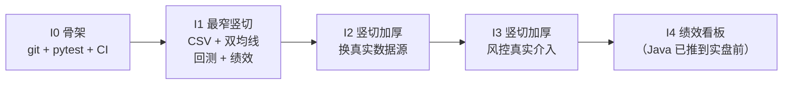

# 迭代计划（敏捷竖切）

> 状态：**2026-09-23 建立**。本文件是**手写产物**，可自由编辑。
> 上位依据：`docs/开工前缺口清单.md`（阻塞项与契约覆盖度）、`docs/开发工作流规范.md`（产物四件套 / TDD / 漂移控制 / 红线清单）。
> 本文件**不改写**上面两份的结论，只回答一个问题：**接下来按什么节奏交付，每一轮凭什么算完成。**
> 收口门禁：`python tools/verify_iteration_plan.py`（已注册进 `tools/run_all_gates.py`）。
> **2026-09-23 裁决落地**：Q6 立即 `git init` · Q4 砍掉股票池 · Q3 Java 推到实盘前 · Q2 按数据中心契约 D1 口径统一 · Q5 主文档 `Strategy` 接口按契约改齐（追加附录A）。
> 全部原「待决」问题已裁决，迭代划分随之定为 **I0~I4**（删去股票池那一轮，末轮收缩为绩效看板）。

---

## 一、为什么不用缺口清单 §六 的 Sprint 0~3

那份顺序是**按层切的**：Sprint 0 补契约、Sprint 1 回测层、Sprint 2 数据层、Sprint 3 风控层。
它对每一层的定义都是「等上一层全部完成」。后果：

- 迭代结束时交不出**能跑的东西** —— Sprint 0 末只交出文档，Sprint 1 末才第一次出现代码；
- 没有**端到端**的验收物，集成风险全部堆到最后；
- 「按模块」而不是「按可演示的价值」计分。

敏捷要的是每个迭代结束都有一条**端到端能跑、能演示**的窄路径。所以本计划**重切**而不重写：
契约、DDL、门禁这三件已经做出来的东西**原样复用**，只是把「什么时候用」重新排。

## 二、敏捷的三个前提：现状

| 前提 | 现状 | 依据 |
| --- | --- | --- |
| 每个迭代**可运行** | **成立**（2026-09-24 I2 S2 收工后）：`.venv` + pytest 可跑（`75 passed`）、`pyproject.toml`、`quanauto/` 包、`tests/`；依赖清单**不再为空**（`dependencies = ["pandas>=2.0"]`，使用者 `quanauto/datasources.py`；I0/I1 当时是空数组，因为那时的竖切只用标准库） | 本次实测，证据 `tools/gates-report.txt` |
| 每个迭代**可回滚** | **成立**（2026-09-23）：已是 git 仓库（`main`），一次迭代一个提交 | `docs/开工前缺口清单.md` C5 |
| 每个迭代**可度量** | **成立**：门禁 + 对称棘轮 + 触测/证伪计数（门禁数一律现取 `python tools/run_all_gates.py --list`，不写死） | `tools/gates-report.txt` |

⇒ **迭代 0 的内容只能是「把前两个前提建起来」，不是功能。**
在前提不成立时直接进功能迭代，等于既没有回滚也没有回归网。

## 三、迭代总览

| 迭代 | 目标（一句话） | 竖切产物（端到端可演示的东西） | 状态 | 证据 |
| --- | --- | --- | --- | --- |
| I0 | 把「可运行」「可回滚」两个前提建起来 | git 仓库 + pyproject.toml + pytest 可跑 + 6 个门禁接进一条命令 | 已交付 | `tools/ci-dryrun-report.txt` |
| I1 | 第一次端到端跑通回测 | CsvDataFeed + MA 双均线策略 + BacktestEngine + PerformanceAnalyzer → 一份可重复的回测报告 | 已交付 | `tools/gates-report.txt`、`tools/pytest-mutation-report.txt` |
| I2 | 把数据换成真实数据源 | AKShare/Baostock 适配器写入 PostgreSQL，回测改读真实日线 | 进行中 | `quanauto/datacenter.py`（S1：PIT / `as_of` 边界层）、`tools/verify_data_center_pit.py`、`tests/test_data_center_pit.py`、`quanauto/datasources.py`（S2：采集侧适配器）、`tools/verify_data_center_adapter.py` |
| I3 | 让风控真正介入交易 | RiskEngine 在下单前拦截 + KillSwitch 可人工触发 | 未开始 | — |
| I4 | 绩效看板（由原「看板 + Java 平台层」收缩而来） | 读一份回测结果 → 展示绩效指标表与资金曲线 | 未开始 | — |

**2026-09-23 裁决对迭代划分的影响**（这是唯一会改变迭代数量的一处）：

- **Q4 砍掉股票池 ⇒ 原 I4「股票池与组合调度」取消**。B3（股票池契约）不再是 MVP 阻塞项，降级为「实盘 / 组合阶段前补」。
- **Q3 Java 推到实盘前 ⇒ 原 I5 的边界收缩为「绩效看板」**。gRPC 通信与 `common.proto`（B5）**不进 MVP**，因此末轮从「看板 + Java 平台层」变成单一的「绩效看板」。
- 迭代编号因此从 I0~I5 变为 **I0~I4**，编号仍连续（门禁 C5 会核对）。

**所有迭代都穿过同一根竖轴**：策略 → 数据 → 回测 → 绩效 → 结果。
每加厚一次都**复用同一套测试骨架**，而不是新开一层 —— 这是与缺口清单 §六 最大的区别。



**为什么 I1 能立刻开工**：契约模块一（`Strategy` / `StrategyRegistry`）与模块二（`BacktestEngine` /
`SimulatedBroker` / `PerformanceAnalyzer` / `DataIntegrityChecker`）已经到「签名 + 异常 + 数据类字段」级别，
缺口清单 §六 自己也点了这条竖切。I2 之后每轮都能复用数据中心已经验过的 DDL 与触测。

## 四、每个迭代的完成定义（DoD）

**规则（不可协商）**：每个迭代必须同时具备**产物四件套**，缺任何一件，这一轮的「绿」不成立。
下表四行是**必填形状**，不是建议 —— `tools/verify_iteration_plan.py` 会按形状核对。

#### I0 · 骨架与可运行闭环

| 件 | 具体是什么 | 判定方式 | 证据 |
| --- | --- | --- | --- |
| 契约 | 仓库目录结构 + 依赖清单（`pyproject.toml`）+ CI 要跑什么 | 本文件与缺口清单 §六 第 6 项一致 | `pyproject.toml`、`.github/workflows/ci.yml` |
| 产物 | `git init` 后的仓库 + `pyproject.toml` + 包目录 + 一条能跑的 `pytest` | `python -m pytest -q` 退出码 0；`git status` 可用 | `tools/ci-dryrun-report.txt`（第 1 节，退出码 0，`3 passed`） |
| 门禁 | 现有 6 个门禁改为**在 CI 里跑**，产物与本地同一命令 | `python tools/run_all_gates.py` 退出码 0 | `tools/gates-report.txt`（I0 当时快照 `verdict: PASS (6/6)`；该文件每轮覆盖，以**现取**为准） |
| 触发测试 | 故意让 CI 里的一个门禁 FAIL，确认 CI 真的红 | 一次真实的红 → 绿往返记录 | `tools/ci-dryrun-report.txt`（第 2 节，两次往返） |

**2026-09-23 进度：两半已全部交付。**
「可回滚」那半：仓库已建（`main` 分支、基线提交 `053f620`、工作区干净），
并加了 `.gitignore`（刻意**不**忽略三份证据快照与棘轮基线，忽略证据 = 假绿）与
`.gitattributes`（`* -text` 禁止 EOL 转换，因为本仓库多处判据直接读文件字节）。
「可运行」那半：`.venv` + pytest（`3 passed`）、`pyproject.toml`（`dependencies = []`，不预置）、
`quanauto/` 空包、`tests/test_skeleton.py`、`.github/workflows/ci.yml`，外加第 6 个门禁 `skeleton`。
⚠️ 上述数量与空依赖清单是**I0 当时的状态**，不是现取：I2 S2 起 `dependencies` 只有 `pandas>=2.0`
（使用者 `quanauto/datasources.py`，契约 §3.2 的签名逐字写 `pd.DataFrame`），源 SDK 在 `[datasources]` extra。
加依赖的规则没变 —— **由真正用它的模块带进来**，不按选型预置；`skeleton` 门禁并不检查这一栏，
所以「零依赖」这类措辞全靠人工守（详见 §二与 I2 S2 收工记录）。

**CI 那一行的诚实说法**：本仓库**没有配置 git remote**，所以 `.github/workflows/ci.yml`
**从未在 GitHub 上真实运行过**；第 4 行的「触发测试」证据是**本地等价**（同样的两条命令），
不得读成「CI 已跑通」。它也不是一次普通的「跑绿就交」：
`tools/ci_dryrun.py` 做了两次**红→绿往返**（改包版本 ⇒ pytest 必须红；拆掉 CI 里的门禁接线 ⇒ `skeleton` 门禁必须红），
变异前自断言「确实改了字节」。这两次往返当场报出了三件事：
① 第一次选的变异（改探针名单里的一个字符串）**根本不会让任何断言失败** —— 工具拒收了这个绿；
② 还原字节一致后 pytest 仍然红，真因是 `__pycache__` 的陈旧 `.pyc`（同秒写回 + 文件字节数相同，
   `(mtime, size)` 双双命中缓存）；③ 上一次运行遗留的 `.pyc` 会把**下一次**的第 1 步也毒化。
现在工具在启动时与每次往返前后都清缓存。

**收工必须交出的四个数字（全部来自真实运行，不许估算）**：门禁通过数 / 棘轮 `total` / `pytest` 通过数 / 触发测试与证伪计数。

**I0 收工时的四个数字（2026-09-23 实测）**：门禁 **6/6**（`GATES_EXIT=0`）· 棘轮 **39/39**（T1=2 / T2=19 / T3=18，**未动**：I0 没有还掉任何 B7 欠账）· `pytest` **3 passed** · 触发测试：本轮的 `tools/ci_dryrun.py` **2 次红→绿往返**（改包版本 ⇒ pytest 红；拆 CI 门禁接线 ⇒ `skeleton` 红），加上已有的 SQL 证伪 **31 案例 / 31 CAUGHT**。全部证据在 `tools/gates-report.txt` 与 `tools/ci-dryrun-report.txt`。

#### I1 · 最窄端到端竖切

| 件 | 具体是什么 | 判定方式 | 证据 |
| --- | --- | --- | --- |
| 契约 | 主契约模块一/模块二的签名与异常；本迭代只实现其中的竖切子集 | 逐个方法对照契约，未实现的写进「本迭代不做」 | `tools/contract-signature-manifest.json`、`docs/智能量化交易平台-核心模块接口契约文档.md`（附录 E5~E8 登记偏差） |
| 产物 | `CsvDataFeed` + MA 双均线策略 + `BacktestEngine` + `EventEngine` + `SimulatedBroker` + `PerformanceAnalyzer` | 同一条命令重复跑两次，绩效指标逐位一致 | `.rounds/i1/report-seed7-a.json`、`.rounds/i1/report-seed7-b.json`（同种子逐字节一致）、`.rounds/i1/report-seed8.json`（换种子必须真的不同）、`tests/fixtures/sample_prices.csv` |
| 门禁 | 契约签名一致性检查 + 回测结果可复现性检查 | 新增门禁接入 `run_all_gates.py` 且 tier-A 绿 | `tools/gates-report.txt`（两个新增 GATE 行）、`tools/verify_contract_signature.py`、`tools/verify_backtest_reproducibility.py` |
| 触发测试 | 把某个签名改成与契约不符、把随机源固定成不同种子，确认两个门禁都会红 | 两个独立的失败样本各自触发 | `tools/pytest-mutation-report.txt`、`tools/pytest_mutation_check.py` |

**I1 收工时的四个数字（2026-09-23 实测）**：门禁 **8/8**（`GATES_EXIT=0`，`SCOPE: FULL`）·
棘轮 **39/39**（T1=2 / T2=19 / T3=18，**未动**：I1 没还掉任何 B7 欠账，只新增了两条 tier-A）·
`pytest` **25 passed**（`test_backtest_slice.py` 22 + `test_skeleton.py` 3）·
触发测试：`tools/pytest_mutation_check.py` **8 变异 / 8 CAUGHT + 1 控制变异**
（控制变异改的是测试自己看得见的地方，必须报 `caught=NO`，否则说明抓取逻辑本身在乱报；
基线 `passed=22`）。证据：`tools/gates-report.txt`、`tools/pytest-mutation-report.txt`。

#### I2 · 换真实数据源

| 件 | 具体是什么 | 判定方式 | 证据 |
| --- | --- | --- | --- |
| 契约 | 数据中心的 9 个适配器契约 + `as_of_date` 语义（禁止绕过 `DataCenter.as_of()`） | 与数据中心契约 v1.0 逐条对齐 | `docs/智能量化交易平台-数据中心接口契约文档.md`（**附录 A**：S1 的 9 条实现侧裁决与偏差；**附录 B**：S2 的适配器裁决与偏差）、`tools/contract-signature-manifest.json`（`impl_only` 段） |
| 产物 | `AKShare` / `Baostock` 适配器写入 PostgreSQL；回测改读真实日线 | 端到端回测跑通，且 `dc_daily_bar` 有数据 | **S2 交付了采集侧适配器**：`quanauto/datasources.py`（三角色的源列名/取值映射 + 归一化 + `ValidationReport`）；**PG 写入与回测改读仍未开始**，这一行还不能打勾 |
| 门禁 | 适配器归一化检查（源特有字段名不得出现在数据类上）+ PIT 一致性检查 | 接入 `run_all_gates.py` 且 tier-A 绿 | `tools/verify_data_center_pit.py`（PIT 那一半）、`tools/verify_data_center_adapter.py`（归一化那一半：A0~A10 静态比对）、`tools/gates-report.txt`（10 个 GATE 行，两半都已注册且 tier-A 绿） |
| 触发测试 | 构造一条 `available_date > as_of_date` 的数据，确认取数必须报错而不是静默返回；构造一个把源列名直接透出的映射表，确认归一化门禁会红 | 一次真实的拒绝记录 + 每个探测器各一个失败样本 | `tests/test_data_center_pit.py` 的 `test_pit_guard_catches_leak_from_store_that_ignores_window`（store 无视查询窗口，取数被 `FutureDataAccessError` 拒绝）；`tools/verify_data_center_adapter.py --selftest`（15 个场景，见下方 S2 记录） |

**I2 S1（子步）收工记录（2026-09-23 实测）**：门禁 **9/9**（`GATES_EXIT=0`）·
棘轮 **39/39**（**未动**：S1 没还掉任何 B7 欠账）· `pytest` **43 passed**（骨架 3 + 竖切 22 + PIT 18）·
触发测试：新门禁 `--selftest` **11 个场景全 OK**（1 个真实产物对照 + 9 个负样本 + 1 个期望 0 报错的干净样本），
外加 `tests/test_data_center_pit.py` 里那条真实的拒绝记录。
**S1 没有关闭 I2** —— 适配器、落库、回测改读三件都还在（上一张表的「产物」行因此不能标完成）。
证据：`tools/gates-report.txt`。

**I2 S2（子步）收工记录（2026-09-24 实测）**：门禁 **10/10**（`GATES_EXIT=0`，`SCOPE: FULL`）·
棘轮 **39/39**（**未动**：S2 同样没还掉任何 B7 欠账，只新增了一条 tier-A）·
`pytest` **75 passed**（骨架 3 + 竖切 22 + PIT 18 + **适配器 32**）·
触发测试：新门禁 `tools/verify_data_center_adapter.py` 的 `--selftest` **15 个场景全 OK**
（1 个真实产物对照 + **13 个负样本** + 1 个期望 0 报错的干净样本，每个探测器各有自己的样本），
外加 `tools/run_all_gates.py --selftest` **19 条断言全 OK**。
**S2 也没有关闭 I2** —— 落库、回测改读、复权因子三件都还在（上一张表的「产物」行因此仍不能标完成）。
**依赖清单从 S2 起不再为空**：`pandas>=2.0` 进了 `dependencies`（使用者 `quanauto/datasources.py`，
数据中心契约 §3.2 的方法签名逐字写了 `pd.DataFrame`），源 SDK 走 `[datasources]` extra ——
I0/I1 的空清单是「选择不是缺口」，S2 加依赖也同样给出使用者与理由，不按选型预置。
证据：`tools/gates-report.txt`、`tools/ci-dryrun-report.txt`。

**S2 顺手修掉一个 harness 自身的假绿（这才是本轮最该记的一件事）**：`write_report()` 之前拿到的是
`--gate=` **过滤之后**的子集，于是 `scope_line()` 的比较集也跟着缩小，单跑一条门禁会把
`SCOPE: FULL -- all 1 registered gate(s) ran.` 写进它自己产出的报告 —— 正是 SCOPE 那行要防的
「少跑了却自称完整」。它一直没被发现，是因为**自测只测了 `scope_line()` 这个纯函数**，
而 bug 在**调用点传错参数**上：再多的纯函数用例也看不见实参。补的是一条**端到端**控制组
（`scope-line-wired-e2e`：真跑一次 `--gate=`、把报告写到临时路径、读回落盘的字节，要求首行是
`SCOPE: PARTIAL -- 1 of 10 gate(s) ran`）；为此把 `execute()` 从 `main()` 里拆出来。
同一条道理也适用于 `tools/dev.py` 的自测：它第一次跑就抓出「runner 无条件拼 `sys.executable`」
把 `git` 送进解释器的 bug —— 自建工具必须能被证明会红。

**S1 留下一条已知缺口，且是故意留的**：复权因子在 S1 恒为 1.0（`get_adjustment_factor`）。
`tests/test_data_center_pit.py` 里有一条用例**故意断言这个错值**，作用是把它钉在明面上。
`S3` 真正接上 HFQ 后，处理方式是**删掉那条用例 + 销掉缺口**，**不是**把期望值改成正确值——
后者会把「缺口已关闭」和「期望值跟着实现跑」写得一模一样。

#### I3 · 风控真实介入

| 件 | 具体是什么 | 判定方式 | 证据 |
| --- | --- | --- | --- |
| 契约 | 风控层契约 v1.1 的 `RiskEngine` / `RiskRuleStore` / `KillSwitch` | 与契约逐条对齐 | — |
| 产物 | 回测下单前必经 `RiskEngine`；`KillSwitch` 可人工触发并阻断后续下单 | 端到端：触发 KillSwitch 后订单数为 0 | — |
| 门禁 | 风控阈值与 `db/risk_control.sql` 的三方一致性 | `tools/verify_risk_config.py` 保持绿 | — |
| 触发测试 | 把阈值放宽成能让非法单通过，确认拦截测试变红 | 复用 `tools/falsify_smoke.py` 的手法 | — |

#### I4 · 绩效看板

| 件 | 具体是什么 | 判定方式 | 证据 |
| --- | --- | --- | --- |
| 契约 | 看板读数的字段清单与口径（取自 `BacktestResult` 与 `PerformanceAnalyzer`，**不得另立一套指标定义**） | 与契约模块二逐字段对齐；实盘实时看板不在本轮 | — |
| 产物 | 回测绩效看板：读一份 `BacktestResult` → 展示指标表与资金曲线 | 同一份结果文件渲染两次，数值逐位一致 | — |
| 门禁 | 看板读数与 `PerformanceAnalyzer` 输出的一致性检查（防两边各算一套指标） | 接入 `run_all_gates.py` 且 tier-A 绿 | — |
| 触发测试 | 手工改一份 `BacktestResult` 里的某个指标，确认一致性门禁会红 | 一次真实的失败记录 | — |

**本迭代不做（2026-09-23 裁决 Q3）**：gRPC / Kafka / `common.proto` / Java 平台层 ——
这些都是「模拟盘 / 实盘」之前才需要的东西。因此 **B5（`common.proto` 不可编译）不进 MVP**，
它不阻塞 I0~I4 任何一轮；等实盘线开工时，B5 就是那一轮的第一件契约活。

## 五、燃尽表：B7 的棘轮

本仓库已经有一张**现成的燃尽图** —— `tools/gates-baseline.json` 的 `core-contract-refs.total`。
规范 §3.3 规定「欠账下降必须**手工**改小基线并写明原因」，那正好就是每个迭代末的一格进度。
这样 B7 从「一次性 45 处的大工程」变成「可计分的迭代项」。

| 迭代末 | 期望 `total` | 期望 `detail` | 变更原因 |
| --- | --- | --- | --- |
| 起点（2026-09-23 实测） | 39 | T1=2 / T2=19 / T3=18 | B7 现状 |
| I1 末 | 视情况下降 | 补齐模块一/模块二真正用到的类型与异常 | 只补「本轮真的要用」的那些 |
| I3 末 | 视情况下降 | 补齐风控层用到的类型与异常 | 同上 |

**两条硬规则**：

1. **三个分量必须同时动**。规范 §3.3 明确「总数相同、构成不同」也判 FAIL ——
   只改 `total` 不改 `detail` 会立刻红。改基线时 `total` 与 `detail` 要一起改。
2. **只有实测值能进基线**。每轮末跑 `python tools/run_all_gates.py`，
   从 `tools/gates-report.txt` 里数 `FINDING [Tx]` 行得到真实数字。
   禁止估算、禁止用上一轮的值。

## 六、裁决记录（原「待决」已全部结案，2026-09-23）

五个问题已全部拍板（其中 Q6/Q4/Q3 会改变迭代划分，Q2/Q5 只是口径对齐）。裁决**不写在这里就算数** —— 同批已回填进
`docs/开工前缺口清单.md` §七（那才是问题的原始出处），两处口径必须一致。

| # | 问题 | 裁决 | 对迭代划分的影响 |
| --- | --- | --- | --- |
| Q6 | 是否现在 `git init` + 建工程骨架 | ✅ **立即建** | **I0 可以开工**（此前 I0 标「待决」的唯一原因就是这条） |
| Q4 | MVP 是否砍掉股票池 | ✅ **砍掉**，回测直接指定股票列表 | **原 I4「股票池与组合调度」取消**；B3 不再是 MVP 阻塞项；迭代从 I0~I5 变为 **I0~I4** |
| Q3 | Java 平台层何时进 | ✅ **MVP 只做 Python 回测线**，Java 推到「模拟盘 / 实盘」前 | **末轮边界收缩为「绩效看板」**；gRPC / `common.proto`（B5）不进 MVP |
| Q2 | 数据中心存储选型 | ✅ **按数据中心契约 D1 口径统一** | 无迭代影响（只是把两处矛盾的说法对齐） |
| Q5 | 主文档模块 4 的 `Strategy` 接口是否按契约改齐 | ✅ **按契约改齐** | 无迭代影响（I1 写 `Strategy` 实现时只有一套签名）。因主文档是 `.docx` 派生物不许原地改，改为**文末追加附录A**给出规范签名；附录由 `md-fidelity` 的 `ADDENDA` 清单守护 |

**更早已裁决的（不再讨论）**：

- **Q1 风控五个阈值**：按保守值起步（见缺口清单 B1 表），存 DB 动态调整。
- **Q7 风控持久化**：PostgreSQL 14+，DDL 已适配。
- **ROE 取值口径**：保持 `-1..5`。**待办** = 把契约 §2.3 的「比率 0~1」表述改成一致，
  并在缺口清单 §三 ④ 结案。这是文档口径漂移（D3 类），不是新决策。
- **范围**：先只做 phase 1。

**Q2 的原始矛盾（已按 D1 结案）**：缺口清单 §七 原把「数据中心存储选型」列为待决，并建议
「MVP 用 DuckDB + Parquet，实盘阶段再上 PostgreSQL」；但数据中心契约 **D1 已经裁决**：
PostgreSQL 14+ 是**唯一权威源**，Parquet / DuckDB 只是**可重建的派生加速层**。
两者不是同一个意思 —— D1 允许丢派生层、**不允许丢权威源**。**以 D1 为准**，缺口清单 §七 Q2 已改。

## 七、敏捷在这里的合法形态（红线）

「敏捷」在本仓库**不等于**「小步快跑、回头补文档」。以下做法与现有纪律冲突，一律不采用：

| 常见敏捷做法 | 本仓库裁决 | 依据 |
| --- | --- | --- |
| 先写代码，契约后补 | **禁止**。B7 已证明后果：两个 Agent 各自发明 `PositionTarget`，集成时才表现为「仓位算不对」 | 缺口清单 B7 |
| 这轮先跳过触发测试，下轮补 | **禁止**。只跑全绿＝假门禁 | 规范 §3.5 |
| 迭代末自动更新基线 | **禁止**。`gates-baseline.json` 刻意没有 `--write-baseline` | 规范 §3.4 |
| 迭代中直接编辑 docx 派生的 md | **禁止**。只能在其后追加，重转换会覆盖并触发 md-fidelity 失败 | C2 |
| 用「差不多了 / 基本完成」表示进度 | **禁止**。状态词只有 `已交付` / `进行中` / `未开始` / `待决` 四个，且 `已交付` 必须给出真实存在的证据路径 | 本文件 §八 |

## 八、本计划自身的收口门禁

计划文件本身也是产物，因此它也要四件套，否则它会变成一份会撒谎的文档。
判据只有一条可判定陈述，由 `tools/verify_iteration_plan.py` 执行：

| 检查 | 内容 |
| --- | --- |
| C1 GATE | §三 迭代表提取到 0 行 ⇒ FAIL（正则失配会让后面全部空转） |
| C2 | 状态列必须恰好是 `已交付` / `进行中` / `未开始` / `待决` 之一 |
| C3 | 状态为 `已交付` 时证据列必须非空 |
| C4 | **证据列里每个反引号路径必须真实存在**（防「幽灵 ✅」） |
| C5 | 迭代编号唯一且连续（I0、I1、…，无跳号无重复） |
| C6 | 每个迭代在 §四 必须有一个同名 DoD 小节 |
| C7 GATE | §四 DoD 小节提取到 0 个 ⇒ FAIL |
| C8 | 每个 DoD 小节必须有一张四行表，`件` 列恰为 `契约` / `产物` / `门禁` / `触发测试` |

**C8 为什么按形状而不按关键词**：规范 §3.6 案例九的教训 —— 判据若只是「某个词出现过」，
删掉整段它仍会报满覆盖。所以这里钉的是**表格的列值与行数**，不是「文中是否出现『触发测试』」。

复核命令：

```powershell
python tools/verify_iteration_plan.py             # 本计划的门禁
python tools/verify_iteration_plan.py --selftest  # 证明它真的会 FAIL
python tools/run_all_gates.py                     # 一条命令拿总判据
```
