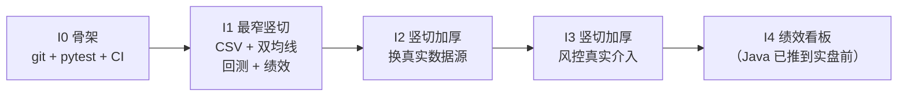

# 迭代计划（敏捷竖切）

> 状态：**2026-09-23 建立**。本文件是**手写产物**，可自由编辑。
> 上位依据：`docs/开工前缺口清单.md`（阻塞项与契约覆盖度）、`docs/开发工作流规范.md`（产物四件套 / TDD / 漂移控制 / 红线清单）。
> 本文件**不改写**上面两份的结论，只回答一个问题：**接下来按什么节奏交付，每一轮凭什么算完成。**
> 收口门禁：`python tools/verify_iteration_plan.py`（已注册进 `tools/run_all_gates.py`）。
> **2026-09-23 裁决落地**：Q6 立即 `git init` · Q4 砍掉股票池 · Q3 Java 推到实盘前 · Q2 按数据中心契约 D1 口径统一 · Q5 主文档 `Strategy` 接口按契约改齐（追加附录A）。
> 全部原「待决」问题已裁决，迭代划分随之定为 **I0~I4**（删去股票池那一轮，末轮收缩为绩效看板）。

---

## 一、为什么不用缺口清单 §六 的 Sprint 0~3

那份顺序是**按层切的**：Sprint 0 补契约、Sprint 1 回测层、Sprint 2 数据层、Sprint 3 风控层。
它对每一层的定义都是「等上一层全部完成」。后果：

- 迭代结束时交不出**能跑的东西** —— Sprint 0 末只交出文档，Sprint 1 末才第一次出现代码；
- 没有**端到端**的验收物，集成风险全部堆到最后；
- 「按模块」而不是「按可演示的价值」计分。

敏捷要的是每个迭代结束都有一条**端到端能跑、能演示**的窄路径。所以本计划**重切**而不重写：
契约、DDL、门禁这三件已经做出来的东西**原样复用**，只是把「什么时候用」重新排。

## 二、敏捷的三个前提：现状

| 前提 | 现状 | 依据 |
| --- | --- | --- |
| 每个迭代**可运行** | **成立**（2026-09-24 I2 S3 收工后）：`.venv` + pytest 可跑（`114 passed`）、`pyproject.toml`、`quanauto/` 包、`tests/`；依赖清单**不再为空**（`dependencies = ["pandas>=2.0"]`，使用者 `quanauto/datasources.py`；I0/I1 当时是空数组，因为那时的竖切只用标准库） | 本次实测，证据 `tools/gates-report.txt` |
| 每个迭代**可回滚** | **成立**（2026-09-23）：已是 git 仓库（`main`），一次迭代一个提交 | `docs/开工前缺口清单.md` C5 |
| 每个迭代**可度量** | **成立**：门禁 + 对称棘轮 + 触测/证伪计数（门禁数一律现取 `python tools/run_all_gates.py --list`，不写死） | `tools/gates-report.txt` |

⇒ **迭代 0 的内容只能是「把前两个前提建起来」，不是功能。**
在前提不成立时直接进功能迭代，等于既没有回滚也没有回归网。

## 三、迭代总览

| 迭代 | 目标（一句话） | 竖切产物（端到端可演示的东西） | 状态 | 证据 |
| --- | --- | --- | --- | --- |
| I0 | 把「可运行」「可回滚」两个前提建起来 | git 仓库 + pyproject.toml + pytest 可跑 + 6 个门禁接进一条命令 | 已交付 | `tools/ci-dryrun-report.txt` |
| I1 | 第一次端到端跑通回测 | CsvDataFeed + MA 双均线策略 + BacktestEngine + PerformanceAnalyzer → 一份可重复的回测报告 | 已交付 | `tools/gates-report.txt`、`tools/pytest-mutation-report.txt` |
| I2 | 把数据换成真实数据源 | AKShare/Baostock 适配器写入 PostgreSQL，回测改读真实日线 | 进行中 | `quanauto/datacenter.py`（S1：PIT / `as_of` 边界层）、`tools/verify_data_center_pit.py`、`tests/test_data_center_pit.py`、`quanauto/datasources.py`（S2：采集侧适配器）、`tools/verify_data_center_adapter.py`、`quanauto/pgstore.py`（S3 前半：落库侧读写）、`tests/test_data_center_store.py`、S3 后半：引擎只吃 as_of() 产出的 feed、`tests/test_backtest_db_feed.py` |
| I3 | 让风控真正介入交易 | `RiskEngine` 在下单前拦截（**默认关闭**：不接线时下单路径与 I1 逐一相同）+ `KillSwitch` 可人工触发并阻断后续下单 | 已交付 | `quanauto/risk.py`（风控引擎本体）、`quanauto/engine.py`（闸门接线与运行统计读取口）、`tests/test_risk_engine.py`、`tests/test_backtest_risk_gate.py`、`tools/pytest-mutation-report.txt` |
| I4 | 绩效看板（由原「看板 + Java 平台层」收缩而来） | 读一份回测结果 → 展示绩效指标表与资金曲线 | 未开始 | — |

**2026-09-23 裁决对迭代划分的影响**（这是唯一会改变迭代数量的一处）：

- **Q4 砍掉股票池 ⇒ 原 I4「股票池与组合调度」取消**。B3（股票池契约）不再是 MVP 阻塞项，降级为「实盘 / 组合阶段前补」。
- **Q3 Java 推到实盘前 ⇒ 原 I5 的边界收缩为「绩效看板」**。gRPC 通信与 `common.proto`（B5）**不进 MVP**，因此末轮从「看板 + Java 平台层」变成单一的「绩效看板」。
- 迭代编号因此从 I0~I5 变为 **I0~I4**，编号仍连续（门禁 C5 会核对）。

**所有迭代都穿过同一根竖轴**：策略 → 数据 → 回测 → 绩效 → 结果。
每加厚一次都**复用同一套测试骨架**，而不是新开一层 —— 这是与缺口清单 §六 最大的区别。



**为什么 I1 能立刻开工**：契约模块一（`Strategy` / `StrategyRegistry`）与模块二（`BacktestEngine` /
`SimulatedBroker` / `PerformanceAnalyzer` / `DataIntegrityChecker`）已经到「签名 + 异常 + 数据类字段」级别，
缺口清单 §六 自己也点了这条竖切。I2 之后每轮都能复用数据中心已经验过的 DDL 与触测。

## 四、每个迭代的完成定义（DoD）

**规则（不可协商）**：每个迭代必须同时具备**产物四件套**，缺任何一件，这一轮的「绿」不成立。
下表四行是**必填形状**，不是建议 —— `tools/verify_iteration_plan.py` 会按形状核对。

#### I0 · 骨架与可运行闭环

| 件 | 具体是什么 | 判定方式 | 证据 |
| --- | --- | --- | --- |
| 契约 | 仓库目录结构 + 依赖清单（`pyproject.toml`）+ CI 要跑什么 | 本文件与缺口清单 §六 第 6 项一致 | `pyproject.toml`、`.github/workflows/ci.yml` |
| 产物 | `git init` 后的仓库 + `pyproject.toml` + 包目录 + 一条能跑的 `pytest` | `python -m pytest -q` 退出码 0；`git status` 可用 | `tools/ci-dryrun-report.txt`（第 1 节，退出码 0，`3 passed`） |
| 门禁 | 现有 6 个门禁改为**在 CI 里跑**，产物与本地同一命令 | `python tools/run_all_gates.py` 退出码 0 | `tools/gates-report.txt`（I0 当时快照 `verdict: PASS (6/6)`；该文件每轮覆盖，以**现取**为准） |
| 触发测试 | 故意让 CI 里的一个门禁 FAIL，确认 CI 真的红 | 一次真实的红 → 绿往返记录 | `tools/ci-dryrun-report.txt`（第 2 节，两次往返） |

**2026-09-23 进度：两半已全部交付。**
「可回滚」那半：仓库已建（`main` 分支、基线提交 `053f620`、工作区干净），
并加了 `.gitignore`（刻意**不**忽略三份证据快照与棘轮基线，忽略证据 = 假绿）与
`.gitattributes`（`* -text` 禁止 EOL 转换，因为本仓库多处判据直接读文件字节）。
「可运行」那半：`.venv` + pytest（`3 passed`）、`pyproject.toml`（`dependencies = []`，不预置）、
`quanauto/` 空包、`tests/test_skeleton.py`、`.github/workflows/ci.yml`，外加第 6 个门禁 `skeleton`。
⚠️ 上述数量与空依赖清单是**I0 当时的状态**，不是现取：I2 S2 起 `dependencies` 只有 `pandas>=2.0`
（使用者 `quanauto/datasources.py`，契约 §3.2 的签名逐字写 `pd.DataFrame`），源 SDK 在 `[datasources]` extra。
加依赖的规则没变 —— **由真正用它的模块带进来**，不按选型预置；`skeleton` 门禁并不检查这一栏，
所以「零依赖」这类措辞全靠人工守（详见 §二与 I2 S2 收工记录）。

**CI 那一行的诚实说法**：本仓库 2026-09-24 起已推上 GitHub（公开仓库，remote `origin`），
`.github/workflows/ci.yml` **真的会跑** —— 而且**首次真跑就判红**：`skeleton` 门禁发现
`CONTEXT.md` 指向的 `.venv/` 在克隆里不存在（本机有、CI 没有）。同一个 commit、同一份判据
两边结论不同，就是判据依赖环境；已修（本机产物目录不算仓库地址），并补了一条触发样本。修复后重推，第二次运行（2026-09-24，run 35939823649）**success**。
本机口径的等价证据仍是 `tools/ci_dryrun-report.txt`（同样的两条命令，两次红→绿往返），
两份证据**不能互相替代**。它也不是一次普通的「跑绿就交」：
`tools/ci_dryrun.py` 做了两次**红→绿往返**（改包版本 ⇒ pytest 必须红；拆掉 CI 里的门禁接线 ⇒ `skeleton` 门禁必须红），
变异前自断言「确实改了字节」。这两次往返当场报出了三件事：
① 第一次选的变异（改探针名单里的一个字符串）**根本不会让任何断言失败** —— 工具拒收了这个绿；
② 还原字节一致后 pytest 仍然红，真因是 `__pycache__` 的陈旧 `.pyc`（同秒写回 + 文件字节数相同，
   `(mtime, size)` 双双命中缓存）；③ 上一次运行遗留的 `.pyc` 会把**下一次**的第 1 步也毒化。
现在工具在启动时与每次往返前后都清缓存。

**收工必须交出的四个数字（全部来自真实运行，不许估算）**：门禁通过数 / 棘轮 `total` / `pytest` 通过数 / 触发测试与证伪计数。

**I0 收工时的四个数字（2026-09-23 实测）**：门禁 **6/6**（`GATES_EXIT=0`）· 棘轮 **39/39**（T1=2 / T2=19 / T3=18，**未动**：I0 没有还掉任何 B7 欠账）· `pytest` **3 passed** · 触发测试：本轮的 `tools/ci_dryrun.py` **2 次红→绿往返**（改包版本 ⇒ pytest 红；拆 CI 门禁接线 ⇒ `skeleton` 红），加上已有的 SQL 证伪 **31 案例 / 31 CAUGHT**。全部证据在 `tools/gates-report.txt` 与 `tools/ci-dryrun-report.txt`。

#### I1 · 最窄端到端竖切

| 件 | 具体是什么 | 判定方式 | 证据 |
| --- | --- | --- | --- |
| 契约 | 主契约模块一/模块二的签名与异常；本迭代只实现其中的竖切子集 | 逐个方法对照契约，未实现的写进「本迭代不做」 | `tools/contract-signature-manifest.json`、`docs/智能量化交易平台-核心模块接口契约文档.md`（附录 E5~E8 登记偏差） |
| 产物 | `CsvDataFeed` + MA 双均线策略 + `BacktestEngine` + `EventEngine` + `SimulatedBroker` + `PerformanceAnalyzer` | 同一条命令重复跑两次，绩效指标逐位一致 | `.rounds/i1/report-seed7-a.json`、`.rounds/i1/report-seed7-b.json`（同种子逐字节一致）、`.rounds/i1/report-seed8.json`（换种子必须真的不同）、`tests/fixtures/sample_prices.csv` |
| 门禁 | 契约签名一致性检查 + 回测结果可复现性检查 | 新增门禁接入 `run_all_gates.py` 且 tier-A 绿 | `tools/gates-report.txt`（两个新增 GATE 行）、`tools/verify_contract_signature.py`、`tools/verify_backtest_reproducibility.py` |
| 触发测试 | 把某个签名改成与契约不符、把随机源固定成不同种子，确认两个门禁都会红 | 两个独立的失败样本各自触发 | `tools/pytest-mutation-report.txt`、`tools/pytest_mutation_check.py` |

**I1 收工时的四个数字（2026-09-23 实测）**：门禁 **8/8**（`GATES_EXIT=0`，`SCOPE: FULL`）·
棘轮 **39/39**（T1=2 / T2=19 / T3=18，**未动**：I1 没还掉任何 B7 欠账，只新增了两条 tier-A）·
`pytest` **25 passed**（`test_backtest_slice.py` 22 + `test_skeleton.py` 3）·
触发测试：`tools/pytest_mutation_check.py` **8 变异 / 8 CAUGHT + 1 控制变异**
（控制变异改的是测试自己看得见的地方，必须报 `caught=NO`，否则说明抓取逻辑本身在乱报；
基线 `passed=22`）。证据：`tools/gates-report.txt`、`tools/pytest-mutation-report.txt`。

#### I2 · 换真实数据源

| 件 | 具体是什么 | 判定方式 | 证据 |
| --- | --- | --- | --- |
| 契约 | 数据中心的 9 个适配器契约 + `as_of_date` 语义（禁止绕过 `DataCenter.as_of()`） | 与数据中心契约 v1.0 逐条对齐 | `docs/智能量化交易平台-数据中心接口契约文档.md`（**附录 A**：S1 的 9 条实现侧裁决与偏差；**附录 B**：S2 的适配器裁决与偏差）、`tools/contract-signature-manifest.json`（`impl_only` 段） |
| 产物 | `AKShare` / `Baostock` 适配器写入 PostgreSQL；回测改读真实日线 | 端到端回测跑通（**假存储上已跑通**；真实 `dc_daily_bar` 是否有数据**从未验证**，未联网） | **S2 交付了采集侧适配器**：`quanauto/datasources.py`（三角色的源列名/取值映射 + 归一化 + `ValidationReport`）；**S3 前半交付了落库侧**：`quanauto/pgstore.py`（按 `data_version` 绑定的读 + 按业务主键的幂等 upsert + 驱动惰性适配）。**S3 后半交付了回测改读**：引擎只吃 `DataCenter.as_of()` 产出的 feed，报告里的 `data_version` 取自存储层（空版本必须抛错），回归测试在 `tests/test_backtest_db_feed.py`。**这一行仍不能打勾** —— 真实数据源**从未联网联调**（源列名映射只在假源上验过），复权因子仍恒 1.0 |
| 门禁 | 适配器归一化检查（源特有字段名不得出现在数据类上）+ PIT 一致性检查 | 接入 `run_all_gates.py` 且 tier-A 绿 | `tools/verify_data_center_pit.py`（PIT 那一半）、`tools/verify_data_center_adapter.py`（归一化那一半：A0~A11 静态比对）、`tools/gates-report.txt`（10 个 GATE 行，两半都已注册且 tier-A 绿） |
| 触发测试 | 构造一条 `available_date > as_of_date` 的数据，确认取数必须报错而不是静默返回；构造一个把源列名直接透出的映射表，确认归一化门禁会红 | 一次真实的拒绝记录 + 每个探测器各一个失败样本 | `tests/test_data_center_pit.py` 的 `test_pit_guard_catches_leak_from_store_that_ignores_window`（store 无视查询窗口，取数被 `FutureDataAccessError` 拒绝）；`tools/verify_data_center_adapter.py --selftest`（15 个场景，见下方 S2 记录） |

**I2 S1（子步）收工记录（2026-09-23 实测）**：门禁 **9/9**（`GATES_EXIT=0`）·
棘轮 **39/39**（**未动**：S1 没还掉任何 B7 欠账）· `pytest` **43 passed**（骨架 3 + 竖切 22 + PIT 18）·
触发测试：新门禁 `--selftest` **11 个场景全 OK**（1 个真实产物对照 + 9 个负样本 + 1 个期望 0 报错的干净样本），
外加 `tests/test_data_center_pit.py` 里那条真实的拒绝记录。
**S1 没有关闭 I2** —— 适配器、落库、回测改读三件都还在（上一张表的「产物」行因此不能标完成）。
证据：`tools/gates-report.txt`。

**I2 S2（子步）收工记录（2026-09-24 实测）**：门禁 **10/10**（`GATES_EXIT=0`，`SCOPE: FULL`）·
棘轮 **39/39**（**未动**：S2 同样没还掉任何 B7 欠账，只新增了一条 tier-A）·
`pytest` **75 passed**（骨架 3 + 竖切 22 + PIT 18 + **适配器 32**）·
触发测试：新门禁 `tools/verify_data_center_adapter.py` 的 `--selftest` **15 个场景全 OK**
（1 个真实产物对照 + **13 个负样本** + 1 个期望 0 报错的干净样本，每个探测器各有自己的样本），
外加 `tools/run_all_gates.py --selftest` **19 条断言全 OK**。
**S2 也没有关闭 I2** —— 落库、回测改读、复权因子三件都还在（上一张表的「产物」行因此仍不能标完成）。
**依赖清单从 S2 起不再为空**：`pandas>=2.0` 进了 `dependencies`（使用者 `quanauto/datasources.py`，
数据中心契约 §3.2 的方法签名逐字写了 `pd.DataFrame`），源 SDK 走 `[datasources]` extra ——
I0/I1 的空清单是「选择不是缺口」，S2 加依赖也同样给出使用者与理由，不按选型预置。
证据：`tools/gates-report.txt`、`tools/ci-dryrun-report.txt`。

**I2 S3（子步，前半：落库侧）收工记录（2026-09-24 实测）**：门禁 **10/10**（`GATES_EXIT=0`，`SCOPE: FULL`）·
棘轮 **39/39**（**未动**：S3 没还掉任何 B7 欠账）·
`pytest` **104 passed**（骨架 3 + 竖切 22 + PIT 18 + 适配器 32 + **落库侧 29**）·
红→绿是**两个各自独立的提交**：红那次是 21 failed / 4 passed 的**断言级**失败（不是 `ImportError`/`AttributeError`），
绿把读侧、写侧三条分支（新插入 / 同值不写 / 异值抛 `IngestConflictError`）、并发抢写、异常纪律与惰性驱动适配补齐。
触发测试：`tools/pytest_mutation_check.py` 从 I1 的单套件扩成**两个套件**，本处新增 9 条落库侧变异 + 1 条控制变异 ——
**17 变异 / 17 CAUGHT + 2 控制变异 + 1 ENV-LIMIT**（基线两套件共 `passed=51`）。
ENV-LIMIT 那条是「把惰性驱动导入改成模块顶层拉驱动」：本机 `.venv` 没装 `psycopg`，结果只能是收集期的 `ImportError`，
**断言根本没跑到** ⇒ 它只证明「这里验不了」，既不算 CAUGHT 也不算通过（换到装了驱动的环境要重跑）。
其中一条用例（`test_already_classified_error_from_a_lower_layer_passes_through`）是**变异测试抓出来的缺口**：
原先「本项目自己的异常不许被二次包装」那条用例其实没经过 `_run` 的守卫（`_raise_if_divergent` 是在 `_run` **外面**抛的），
把守卫删掉套件依然 28 passed；补上这条用例后 `S8-our-own-errors-get-wrapped` 才咬得住。
**S3 前半没有关闭 I2** —— 回测改读真实日线、复权因子（附录 A 的已知缺口）两件都还在。
两处**效力边界**必须连在一起读：① 落库侧用例**一律不连库**，假连接只能证明「发出去的语句与参数是什么」，
**不能**证明 PostgreSQL 接受它；② 库端证据来自容器通道 —— 冒烟快照 `tools/sql-smoke-report.txt` 与
`tools/sql-smoke-report-pg1{4,5,6}.txt`（2026-09-24 起覆盖 `postgres:14/15/16/17` 四个 tag），
逐条证伪快照 `tools/falsify-report.txt`（**只在 `postgres:17` 上做过**）。
两组都是**快照**：改过任何 `db/*.sql` 之后即作废，必须重跑（重跑时用 `--report=` 另存，别覆盖）。
证据：`tools/gates-report.txt`、`tools/pytest-mutation-report.txt`。

**I2 S3（子步，后半：引擎改读）收工记录（2026-09-24 实测）**：门禁 **10/10**（`GATES_EXIT=0`，`SCOPE: FULL`）·
棘轮 **39/39**（**未动**：S3 后半同样没还掉任何 B7 欠账）·
`pytest` **114 passed**（骨架 3 + 竖切 22 + PIT 18 + 适配器 32 + 落库侧 29 + **端到端接线 10**）·
红→绿是**断言级**的两轮：先 `7 failed / 3 passed`，改完测试自身的两个错误假设后 `6 failed / 4 passed`，
两次都不是收集期的 `ImportError`（红步骤必须真的跑到断言才行）。
**这一半咬出 3 个真缺陷**（两边各自全绿、接缝上一行没跑过的典型）：① 存储层交出的数值是 `Decimal`，
在入库到引擎的边界上没归一 ⇒ `float // Decimal` 抛 `TypeError` 并被包成 `BacktestExecutionError`；
② `_execute` 在挂 `self._result` **之前**就调了 `validate_no_leakage()` ⇒ 每份报告的未来函数检查都是空壳
（`row_count=0`、`warnings=["尚未执行回测…"]`）却报 `is_valid=True`；③ 报告里的 `data_version` 用的是
`os.path.basename(feed.csv_path)`，而 `DbDataFeed` 没有 `csv_path` ⇒ 标出来的是 K 线条数，且两份
**不同版本、条数相同**的数据会得到同一个字符串。
触发测试：`tools/pytest_mutation_check.py` 从两套件扩成**三个套件**，本处新增 4 条变异 + 1 条控制变异 ——
**21 变异 / 21 CAUGHT + 3 控制变异 + 1 ENV-LIMIT**（基线三套件共 `passed=61`）。
一条**过期证据快照**被门禁抓到：`_execute` 次序修好之后，`.rounds/i1/*.json` 里记着的
`validation_report` 与本次跑出来的不再一致，`backtest-reproducibility` 门禁报出 3 条 `R5-EVIDENCE-CURRENT` ⇒
走的是**显式重录**（`tools/verify_backtest_reproducibility.py . --record`，diff 6 增 12 删，只改 `row_count` 与 `warnings`），
不是静默刷新 —— 这正是该门禁存在的理由。
**S3 后半也没有关闭 I2** —— 真实数据源从未联网联调、复权因子仍恒 1.0，两件都还在。
证据：`tools/gates-report.txt`、`tools/pytest-mutation-report.txt`。

**S2 顺手修掉一个 harness 自身的假绿（这才是本轮最该记的一件事）**：`write_report()` 之前拿到的是
`--gate=` **过滤之后**的子集，于是 `scope_line()` 的比较集也跟着缩小，单跑一条门禁会把
`SCOPE: FULL -- all 1 registered gate(s) ran.` 写进它自己产出的报告 —— 正是 SCOPE 那行要防的
「少跑了却自称完整」。它一直没被发现，是因为**自测只测了 `scope_line()` 这个纯函数**，
而 bug 在**调用点传错参数**上：再多的纯函数用例也看不见实参。补的是一条**端到端**控制组
（`scope-line-wired-e2e`：真跑一次 `--gate=`、把报告写到临时路径、读回落盘的字节，要求首行是
`SCOPE: PARTIAL -- 1 of 10 gate(s) ran`）；为此把 `execute()` 从 `main()` 里拆出来。
同一条道理也适用于 `tools/dev.py` 的自测：它第一次跑就抓出「runner 无条件拼 `sys.executable`」
把 `git` 送进解释器的 bug —— 自建工具必须能被证明会红。

**S1 留下一条已知缺口，且是故意留的**：复权因子在 S1 恒为 1.0（`get_adjustment_factor`）。
`tests/test_data_center_pit.py` 里有一条用例**故意断言这个错值**，作用是把它钉在明面上。
`S3` 真正接上 HFQ 后，处理方式是**删掉那条用例 + 销掉缺口**，**不是**把期望值改成正确值——
后者会把「缺口已关闭」和「期望值跟着实现跑」写得一模一样。

**I2 的收尾拆成两半（2026-09-24 登记；同日**订正**一次，见下）**：I2 剩下的两件事，一件在离线下
就能做完，另一件必须真的联网取一次数。混在同一行里会导致「I2 进行中」永远不收敛，所以拆开记、分开验收：

| 半 | 范围 | 本机能否完成 | 验收方式 |
| --- | --- | --- | --- |
| **I2a** | 取数错误**可分类**（哪个源 / 哪一类失败 / 是否可重试，而不是一句字符串）+ 全部离线的契约测试 + `EastMoneyAdapter._default_fetch` 这条「无官方 SDK 源」的接线形状 | **能**（不联网、不装源 SDK） | 用例离线可跑，失败路径逐类有样本 |
| **I2b** | 真实取数联调（AKShare/Baostock 拉数入库）+ 源列名映射表逐条**联网**核对 | **能**（2026-09-24 实测可达，见下） | 一次真实取数冒烟 + 与 `dc_daily_bar` 的读回闭环；**仍不得成为任何门禁或 DoD 的硬要求** |

**订正记录（2026-09-24，登记后 30 分钟内）**：本表最初把 I2b 写成「**不能**（需外网 + 源 SDK，本机未装）」
并标「环境受限」。**这是把一个未验证的假设写成了限制** —— 登记时一次探测都没做。补测后三条实测：

| 实测项 | 结果 | 命令 |
| --- | --- | --- |
| 东财行情接口（`push2his.eastmoney.com/.../kline/get`，akshare 主源真正的数据端点） | **直连 200**（代理亦 200） | `curl.exe --noproxy "*" -s -o NUL -w "%{http_code}" --connect-timeout 8 <url>` |
| `akshare` | 可从当前 pip 源取得，最新 **1.18.97** | `python -m pip index versions akshare` |
| `baostock` | 可从当前 pip 源取得，最新 **0.9.4** | `python -m pip index versions baostock` |

⇒ 「环境受限」**撤销**。I2b 的真实不确定性不是网络，而是**源列名映射表与真实返回对不对得上**
（映射表是从各源文档抄的，从未联网核对）——那只有跑一次才知道，属于「未知」不属于「受阻」。
**不变的那条**：真实取数天然不可复现、依赖外部站点存活，所以它**永远不得成为任何门禁或 DoD 的硬要求**，
只能是**人工**跑的冒烟并把证据落到报告文件里；`pytest` 默认套件里不许出现联网用例
（CI 是 `pip install -e ".[dev]"`，**不含** `[datasources]` extra，装了源 SDK 也未必在）。

**其余两条不变式照旧**：

- 拆分**没有关闭 I2**：上面那张 DoD 表的「产物」行**保持未勾**，§三 的状态仍是「进行中」。
  拆分的意义只是让 **I2a 能被单独验收**，而不是把 I2b 的未决状态当成 I2 的失败。
- 两条判据照旧不许动：`tests/test_data_center_pit.py::test_known_gap_hfq_factor_is_identity_in_s1`
  **不许删、不许放宽**（HFQ 真接上前它就该是错的）；**任何门禁与用例都不得把「装了源 SDK」写成前置条件**
  （源 SDK 挂在 `[datasources]` extra 上，CI 只装 `[dev]`）—— 这是**规则**，与 `.venv` 当下装没装无关。

**I2a 再拆一步（2026-09-24）**：I2a 内部也有先后，先做那个「离线就能验完」的。

- **I2a-1（本轮落地）**：取数失败**可分类**。`SourceAdapterError` 新增 `source`／`kind`／`retryable`
  三个属性；类别表 `SOURCE_FAILURE_KINDS` 是**八类闭集**，可重试清单 `RETRYABLE_SOURCE_FAILURES`
  是其子集；判定函数 `classify_source_failure`（`quanauto/datasources.py`）按「调用方接下来该做什么」
  分类，不按异常类型名；翻译点仍只有 `_AdapterBase._call` 一处。写成 `kind` 不在表里 **当场 `ValueError`**，
  **不降级成 `UNKNOWN`** —— 静默降级会让「表写错了」和「真没归类」长得一模一样。
  证据：`tests/test_data_center_adapter.py`（**一个类别一个样本**，含判定顺序与「每类都有生产者」
  两个反向用例，该文件全绿）、门禁探测器 `A11`（`TAXONOMY-CLOSED`，四个**单向**触发样本已进
  `--selftest`，干净合成样本仍绿）。
- **I2a-2（本轮落地，2026-09-24）**：`EastMoneyAdapter._default_fetch` 走标准库 `urllib` 接上东财端点。
  **不引入第三方 SDK**：该源无官方 Python SDK。
  落地三件：①唯一网络出口 `_http_get_json`（`quanauto/datasources.py`，标准库 `urllib`，
  `opener` 可注入 ⇒ 离线可测）；②`_default_fetch` **真取数**（`filter=(SECURITY_CODE="<裸代码>")`、
  `columns=ALL`、`source=WEB&client=WEB`，按 `pageSize=100` **逐页翻**，超过 200 页抛
  `SOURCE_SCHEMA_MISMATCH` 且**不截断**，体内 `success=false`（如 `code=9501`）也归该类且**不重试**）；
  ③人工冒烟 `tools/eastmoney_transport_smoke.py`（**不是门禁**，证据
  `tools/eastmoney-transport-smoke-report.txt`）—— 它自己的两个新判定分支（「一张表都没比对上」
  与「某张表缺列」）另做了**三个离线触发样本**（全失败 / 缺一列 / 两张表都全），
  前两个确实报 `SMOKE FAIL` 且退出码 1、第三个保持 `SMOKE OK`（触发测试顺带撞出并修掉一个
  真 bug：`--report=` 指到别的盘符时 `os.path.relpath` 抛 `ValueError`，报告写完了却崩在最后一行打印）。
  离线那一侧的用例全部打**本机** HTTP 服务：
  query 拼装 / UA / 状态码 429・401・403・503 / 非 JSON 正文 / 端口关闭 / 逐页 `pageNumber` /
  页数上限 / 体内失败 / 未登记 `reportName`（**零请求**）/ 空 `data`，一路走到
  `classify_source_failure` 的真实类别（真传输 → 真适配器 → 真分类器，**不碰外网**）。
- **本轮实测把 I2b 的「真实不确定性」提前引爆了**：`EASTMONEY_FINANCIAL` 的 9 列
  **没有任何单一 report 能喂满**。`RPT_LICO_FN_CPD` 给 5/9（缺 `REPORT_DATE`/`REPORT_TYPE`/
  `TOTAL_ASSETS`/`TOTAL_EQUITY`），`RPT_DMSK_FN_BALANCE` 给 5/9（缺 `REPORT_TYPE`/
  `TOTAL_OPERATE_INCOME`/`PARENT_NETPROFIT`/`WEIGHTAVG_ROE`）；并集 8/9，**唯一缺席的是
  `REPORT_TYPE`**（真实响应里只有 `REPORT_TYPE_CODE`）⇒ `EASTMONEY_REPORT_TYPE`（按**中文报表名**建）
  在真实返回上**没有生产者**。⇒ 映射表**不是「未验证」，是「已部分证伪」**，登记在数据中心契约附录 **B12**。
  **裁决（选项 A：双请求合并）已落地，落地面记在附录 B13**：`EASTMONEY_REPORT_TYPE` 的键域改成
  `reportName`（`RPT_LICO_FN_CPD → INCOME`、`RPT_DMSK_FN_BALANCE → BALANCE`）；
  `EASTMONEY_FINANCIAL` 拆成 `EASTMONEY_INCOME_FINANCIAL`（日期键 `REPORTDATE`）与
  `EASTMONEY_BALANCE_FINANCIAL`（日期键 `REPORT_DATE`）；`fetch_financial` 改成**逐报表取数再合并**
  ⇒ **一个 `(symbol, period_end)` 现在出多行**，`report_type` 是 `dc_financial` 主键的一部分；
  `normalize_financial` 增 `report_type=`、删 `report_type_map`（没有生产者的映射参数
  就是一条走不到的分支，不留）。
  这条只能验「接线形状」，**验不了**「取回来的数对不对」—— 那是 I2b；而且 `pageSize=100`
  与东财的**日期过滤语法**都**还没实测**（B12 那次只用了 `pageSize=2` 探形状），一并记入 I2b-2。

**传输层两条坑（2026-09-24 实测，写下来免得下次当玄学）**：

- **代理**：Windows 上 `urllib.request.getproxies()` 读的是**注册表**里的系统代理
  （实测返回 `{'http': 'http://127.0.0.1:7890', ...}`），而 curl 只看环境变量（本机为空）。
  ⇒ 同一台机器同一时刻出现 `curl 200 / python RemoteDisconnected` 是**可能的**，
  不要据此断言「端点不稳」。冒烟报告头部把 `getproxies()` 的实际取值记下来，就是为了这个。
- **`push2his`（kline）对连续请求会拒**：上表那条「直连 200」是**首次**探测的结果；
  随后同一条命令（含 python `urllib`，默认 opener 与绕开代理的直连 opener 各一次）
  全部失败，`curl` 亦从 200 变成 000。所以 `tools/eastmoney_transport_smoke.py`
  把 kline 探测**移出判定**（契约 §3.2 的表里东财本就不覆盖行情，适配器不调它），
  并把两种结果都留在报告里。**I2b 的「拉一条真实日线」不能想当然地押在这个端点上。**

> 上表第一行的「直连 200」与本节不矛盾：它是一次**当时的**观测，被原样保留；
> 本节是同日**二次**观测。两次都真，结论是「该端点可取性不稳」，不是「谁测错了」。

**I2b-2 落地（2026-09-24）：报表列名 / 分页 / 日期过滤语法已实测，但**没有**收口成「映射表已验证」。**

上面 I2a-2 那段末尾写着「`pageSize=100` 与东财的**日期过滤语法**都**还没实测**」——
那是**登记当时的**事实，被原样保留；下面是同日**补测后**的状态（**不**回改上文那两句）：

- **已结清**：①两张财务表的映射键**逐一对上**真实返回（B12 只探了形状、没逐键比对，这是本轮补的）；
  ②日期过滤语法 = `(SECURITY_CODE="…")(REPORTDATE='YYYY-MM-DD')`，**单引号**、**每报表各自的**日期键，
  用错键名被源当场拒绝（`REPORT_DATE列不存在`）而**不是**静默返回全量。
- **只结清一半**：`pageSize=100` **被真的遵守**（`2→54 页/2 行`、`100→2 页/100 行`、`500→1 页/108 行`），
  但**上限未探**（未试 1000/5000）⇒ 它仍是**取值**，不是实测上限。
- **🔴 新开的边界（未解决）**：`NOTICE_DATE` **更像「最后修订日」而非「首次公告日」**。
  两张表 12/30 与 29/30 的年报行「公告年 ≠ 报告期次年」；利润表上 `notice == update` 占 40.7%
  且最近 4 期全同 ⇒ 指向该列是修订日。**安全侧没问题**（两表 0 行「公告日早于报告期」⇒ 不造未来函数），
  风险方向是**数据迟到**。**本轮不改映射表** —— 资产负债表没有判别器可用、且「真实首次公告日该取哪列」
  没实测过，照猜重写正是 B12/B13 的教训。登记在数据中心契约附录 **B14**。
- **性质**：全部来自一次性探针 `.rounds/_i2b2_probe.py`（**gitignored、不进仓、不是门禁**）⇒
  与 B12 同级，**人工冒烟**，结论不回灌成「东财已验证」。**I2 仍未收口**，DoD 的「产物」行仍不勾。

**I2b-2 补记（2026-09-24 同日后半段）：B14 挂账①结清 —— `period_end` 拼进请求侧，**但契约保证的是本地那一遍**。**

上面「已结清」那条只说了语法，没说**要不要用它**；`datasources.py` 当时留的措辞是
「日期过滤语法没有实测过，不猜」—— 语法一旦实测，这句话就**过期**了，必须换成明确裁决：

- **裁决**：请求侧拼 `(REPORTDATE='…')`，**只当省流量**；`fetch_financial` 末尾**仍然**按
  `period_end` 本地筛一遍，**那一遍才是契约保证的**。源哪天静默忽略这个参数，
  后果只是流量变大，**不是**多几期数据进 `dc_financial`。
- **🔴 顺带抓到一个真缺陷**：请求里的日期原写成**双引号**，与 B14 实测的**单引号**不符。
  它不是靠人眼发现的 —— 测试的期望值**是照 B14 实测逐字写的**、不由实现算，所以一跑就红；
  **修的是实现，不是测试**。（此前那批测试的期望值照实现对齐，等于「实现等于它自己」的自证，
  与 B16.1 的 5 段/6 段同根因。）**期望值必须是测量结果，不能是实现的反光。**
- **触发测试**：`.rounds/_i2b2_filter_trigger.py`（gitignored、非门禁）3 个变异 **3/3 被抓**；
  变异前与还原后干净、还原后**逐字节一致**。登记在数据中心契约附录 **B17**。
- **仍未确认**：`pageSize` 上限、除 `600000` 外的标的、源**静默忽略** `filter` 时的返回形态、
  `NOTICE_DATE` 语义（挂账②）、这条通道**真的入过库**。**I2 仍未收口**，DoD「产物」行仍不勾。

**I2b-1 前置测量（2026-09-24）：日线通道在本机走不通 ⇒ 先裁决通道，I2b-1 才算开工。**

I2b-1 的 DoD 是「一次真实取数冒烟」。动手前先测**当下**可达性（上一轮记过 `push2his` 有分钟级翻转，
隔一轮不能当仍成立）。探针 `.rounds/_i2b1_probe.py`（gitignored、非门禁），结论登记在数据中心契约附录 **B15**。

- **A 东财 kline（= `AKShareAdapter` 走的那个端点）在本机不可用**：默认 opener 与直连
  （`ProxyHandler({})`）都是 `RemoteDisconnected`，**连跑两遍同样症状** ⇒ 挂的是**端点**不是代理，
  不能读成「换条路线就行」。于是 `AKShareAdapter` 的**日线**路径在本机端到端跑不通
  （端点不可达 **且** akshare 未安装）。注意它**不**推翻 B12：B12 测的是 `datacenter-web`
  财务接口（**另一个域名**）。
- **B 新浪 `getKLineData` 可用**：`datalen=5→5 行`、`datalen=1023→1023 行`，历史 `2022-07-11…2026-09-23`，
  6 个英文列（**无 symbol、无 `amount`**），`volume` 单位是**股**，而现有映射配的是**手**
  ⇒ 走这条路要 **÷100**。
- **C 新浪 `klc_kl.js` 是「200 但不可用」的反例**：57 KB 正文是**编码过的**文本，需要新浪自己的解码
  ⇒ 记住 **HTTP 200 + 大正文 ≠ 可用**（我那条「像数据文件」的判据只判得出它不是明文）。
- **待裁决**：契约 B15 列了甲/乙/丙三条，**甲 = 新增一条 stdlib 直连的新浪日线源**（照 `EastMoneyAdapter`
  绕开 SDK 直连厂商 HTTP 的先例）**推荐**。在裁决前 I2b-1 **不算开工**、DoD「产物」行**不勾**；
  裁决也**不等于**收口，**I2 仍未收口**。

**I2a-1 刻意留下的两条边界**（写下来防止下一轮当成 bug 去「修」）：

- **判定顺序即风险**：`socket.timeout` 是 `OSError` 的子类、`HTTPError` 是 `URLError` 的子类，
  顺序写反了分类会静默错位（不是报错）。`tests/test_data_center_adapter.py` 里有一条专门盯顺序的用例。
- **没有「源没给数据」这一类**：那个语义已经由 `DataNotAvailableError`（DATA_001）表达，
  再加一个类别等于给同一种情况两个出口。

**I2b-1 落地（2026-09-24）：腾讯日线通道 + 一次真实取数冒烟。冒烟 PASS，但 **I2 仍未收口**。**

- **裁决落地：B15 的「甲」被采纳，但换了源**。甲的原则是「stdlib 直连厂商 HTTP、opener 可注入、
  离线可测」，**不绑定新浪**。新浪 `getKLineData` 只有 6 列、**没有 `amount`**，而
  `dc_daily_bar.amount` 是 `NOT NULL` ⇒ 用新浪就得**合成** `amount = volume × close`
  （除权日必错，且那是**造数据**）⇒ 换同原则的腾讯 `newfqkline/get`（第 4 条通道，
  `priority = FALLBACK`，`dc_daily_bar.source` 无 CHECK 枚举 ⇒ **不需要改 DDL**）。
- **产物**：`quanauto/datasources.py` 的 `TencentAdapter`（映射表只登记实测验证过的位置 `0,1,2,3,4,5,8`；
  两个单位换算**各一个开关**：手→股 ×100、万元→元 ×10000；自己按 `end` 回溯分页 + 本地裁剪）；
  `tests/test_data_center_adapter.py` 新增 19 条**离线**用例（注入 opener，不联网）。
- **门禁**：`tools/run_all_gates.py` → **10/10 PASS**、棘轮 **39/39**（现取，见 `tools/gates-report.txt`）。
- **触发测试**：`.rounds/_i2b1_smoke_trigger.py` → `samples=12 detectors=9 covered=9` **PASS**
  （含一个干净样本防误报、一条覆盖守卫保证 9 个探测器都被触发过）。
- 🔴 **冒烟抓到的是一个真实现缺陷**（本轮最有价值的一件事）：适配器一度发出 **5 段** `param`，
  源**带内拒绝**（`code=0 msg='param error'`、`data=[]`），而**离线用例当时是绿的** ——
  因为断言写成了我自己意图里的形状（`count(',') == 4`），再拿它验我自己的字符串。
  **那是自证，不是测量**，真实取数一跑就红。已改成实测的 6 段形状。
  详细登记在数据中心契约附录 **B16**（含「`start` 被忽略」「`count=n` 回 n+1 行」
  「最新交易日是活数据」「`%` 的两次误报」与未确认清单）。
- **仍未收口（DoD「产物」行保持未勾）**：复权因子仍恒 1.0、财务通道仍未收口、
  这条通道**从未真的入过库**、`end` 落非交易日与 `count` 上限**都没测**。**I2 未关闭。**
- 本轮的冒烟/探针/触发脚本全部是 `.rounds/*`（**gitignored、不进仓、不是门禁**）⇒
  它们**不写进 §三 表的「证据」列**（那列必须引用克隆里真实存在的路径）。

**I2b-3 落地（2026-09-24）：第一次**真的入过库** —— 落库闭环探针 + 它抓出的两个真缺陷。**

B16/B17 的「没确认什么」里都写着「这条通道真的入过库：**没有**」。本条把那行改成**有**：
真实取数 → 真 PostgreSQL → 读回逐字段对拍，全链路走通；代价是**当场判死了两个离线套件绿的假设**。

- **性质**：**容器**通道（一次性 compose，跑完 `down -v`，监听 `127.0.0.1:55432`）；
  **本机依旧没有 PostgreSQL 实例**。走的是 B16 那条腾讯通道，样本 `600000.SH` × 86 行。
  建表前有**空库守卫**（`public` 表数必须 == 0）—— 理由：`CREATE TABLE IF NOT EXISTS` 在旧库上
  **静默跳过**，DDL 与触测会一起假绿。
- **闭环**：取数 86 行 → `inserted=86 skipped=0` → 读回 86 行按日升序、`max|read − written| = 1E-7`
  → 同批重跑 `inserted=0 skipped=86`、异值写抛 `DATA_007` 且已回滚 → 库内 11 列与
  `pgstore.BAR_COLUMNS` 逐列一致。
- 🔴 **缺陷一（真库炸，离线全绿）**：`PsycopgConnection.transaction()` 原写 `with conn:`。
  psycopg 3.3.6 的 `Connection.__exit__` 在提交/回滚**之后还会 `close()`**（无 pool 时），
  于是「先入库、再读回」在真库上报 `DATA_008 … the connection is closed`。
  离线假连接把 `__exit__` 写成「只记 commit/rollback、不关连接」—— 那是照**作者的假设**写的，
  **不是照驱动实测写的**。已改 `conn.transaction()`，并把**假驱动的保真度**单独立一条用例钉住。
- 🔴 **缺陷二（D10 当场破裂）**：`non-exact cells = 11`，典型 `2026-06-15 amount`
  写 `842270399.9999999` / 读 `842270400.0000` —— 源侧「万元」2 位小数 × 10000 走 float64
  必然落在整数下方；库按 `numeric(20,4)` 存的就是 `842270400.0000`。
  拿两个标度不同的数去比 ⇒ **同批重跑抛 `DATA_007`**，而 D10 要求的正是「重跑 == 跑一次」。
  修法：`_as_decimal` **末尾**量化到 `_VALUE_SCALE = 4`（舍入显式 `ROUND_HALF_UP`）——
  只改一处就让**读、写、比三条路径同时收敛**；并补一条**反向**用例保证一分钱仍判冲突。
- **教训（第三次同源）**：B16.1（5 段/6 段）、B17.1（日期引号）、本条 —— 都是
  **对驱动/源行为的假设当成了事实**。**替身（假源 / 假驱动）必须照实测写，否则它证明的只是
  「实现等于它自己」。**
- **产物（进仓）**：`quanauto/pgstore.py`（量化 + `transaction` 文档串写明实测依据）、
  `tests/test_data_center_store.py` **+5 条**用例（含 `_VALUE_SCALE` 与 `db/data_center.sql`
  的**日对账**用例，带「提取为空即 FAIL」守卫）、`tools/pytest_mutation_check.py` 新增
  **S12a**（改回 `with conn:`）/ **S12b**（拿掉 `quantize`）两条变异，样本**来自真跑出来的缺陷**。
- **判据**：`python -m pytest -q` → **270 passed**；变异套件
  `mutations=26 caught=26 control=3 env_limited=1`（30 条样本）→ PASS；
  `tools/run_all_gates.py` → **10/10 PASS**、棘轮 **39/39**（**现取**，见 `tools/gates-report.txt`）。
- **触发测试**：`.rounds/_i2b3_roundtrip_trigger.py`（gitignored、非门禁）→ 3 个变异样本 +
  2 次干净对照；**七项判据同时改错 ⇒ 七条全红**、早退守卫改动 ⇒ 红且退出码非 0、
  还原后**逐字节一致**；`被证明会红的判据 8 项`、未覆盖 `(无)`。
- **仍未收口（DoD「产物」行保持未勾）**：只有**一个标的 × 一段 86 行窗口**真的入过库；
  镜像跑过 `postgres:14/15/16/17` **四个 tag**（2026-09-24 补梯，均为 23/0 + 42/0）
  ⇒ 契约那句「PostgreSQL 14+」**仍未被证实**（四个大版本之间还有别的 tag 与发行版从未跑过，
  且逐条证伪只在 pg17 上做过）；
  `ROUND_HALF_UP` 与 `numeric` 在 **`.00005` 半值**上是否同向**未测**（本轮 11 个 non-exact
  单元全是非半值）；`_VALUE_SCALE = 4` 只对 `dc_daily_bar` 六列成立（同库里还有
  `numeric(18,8)` / `numeric(10,6)` 的列**不走**它）；复权因子仍恒 1.0、财务通道仍未收口。
  **I2 未关闭。**
- 登记在数据中心契约附录 **B18**（B18.2 / B18.3 是那两个缺陷，B18.5 是未确认清单），
  版本阶梯那件事登记在 **B19**（2026-09-24 追加）。
  本轮的探针/触发脚本仍是 `.rounds/*` ⇒ 同样**不写进 §三 表的「证据」列**。

#### I3 · 风控真实介入

| 件 | 具体是什么 | 判定方式 | 证据 |
| --- | --- | --- | --- |
| 契约 | 风控层契约 v1.1 的 `RiskEngine` / `RiskRuleStore` / `KillSwitch` | 与契约逐条对齐；**裁决一律追加不原地改** | `docs/智能量化交易平台-风控层接口契约文档.md`（本轮末尾的「I3 交付与裁决记录」） |
| 产物 | 回测下单前必经 `RiskEngine`；`KillSwitch` 可人工触发并阻断后续下单 | 端到端：触发 KillSwitch 后订单数为 0 | `tests/test_backtest_risk_gate.py`、`quanauto/engine.py` |
| 门禁 | 风控阈值与 `db/risk_control.sql` 的三方一致性 | `tools/verify_risk_config.py` 保持绿（含新增的 C16：实现 `RULE_SPECS` ↔ 契约阈值/单位/方向） | `tools/gates-report.txt` |
| 触发测试 | ① 门禁侧：给 C16 加两个注定失败的样本（`risk.py` 阈值 `0.10→0.12`、规则 id 改名），确认它真的报 C16；② 测试侧：给闸门三条变异（`_strategy_equity` 符号回退 / `_risk_gate` 无条件放行 / 拦截不入 `_rejected`），确认对应用例真的红 | ①、② 都要有「改坏输入 → 报错」的实测记录，全绿不算 | `tools/verify_risk_config.py`（`--selftest` 12/12）、`tools/pytest-mutation-report.txt` |

#### I4 · 绩效看板

| 件 | 具体是什么 | 判定方式 | 证据 |
| --- | --- | --- | --- |
| 契约 | 看板读数的字段清单与口径（取自 `BacktestResult` 与 `PerformanceAnalyzer`，**不得另立一套指标定义**） | 与契约模块二逐字段对齐；实盘实时看板不在本轮 | — |
| 产物 | 回测绩效看板：读一份 `BacktestResult` → 展示指标表与资金曲线 | 同一份结果文件渲染两次，数值逐位一致 | — |
| 门禁 | 看板读数与 `PerformanceAnalyzer` 输出的一致性检查（防两边各算一套指标） | 接入 `run_all_gates.py` 且 tier-A 绿 | — |
| 触发测试 | 手工改一份 `BacktestResult` 里的某个指标，确认一致性门禁会红 | 一次真实的失败记录 | — |

**本迭代不做（2026-09-23 裁决 Q3）**：gRPC / Kafka / `common.proto` / Java 平台层 ——
这些都是「模拟盘 / 实盘」之前才需要的东西。因此 **B5（`common.proto` 不可编译）不进 MVP**，
它不阻塞 I0~I4 任何一轮；等实盘线开工时，B5 就是那一轮的第一件契约活。

## 五、燃尽表：B7 的棘轮

本仓库已经有一张**现成的燃尽图** —— `tools/gates-baseline.json` 的 `core-contract-refs.total`。
规范 §3.3 规定「欠账下降必须**手工**改小基线并写明原因」，那正好就是每个迭代末的一格进度。
这样 B7 从「一次性 45 处的大工程」变成「可计分的迭代项」。

| 迭代末 | 期望 `total` | 期望 `detail` | 变更原因 |
| --- | --- | --- | --- |
| 起点（2026-09-23 实测） | 39 | T1=2 / T2=19 / T3=18 | B7 现状 |
| I1 末 | 视情况下降 | 补齐模块一/模块二真正用到的类型与异常 | 只补「本轮真的要用」的那些 |
| I3 末 | 视情况下降 | 补齐风控层用到的类型与异常 | 同上 |

**两条硬规则**：

1. **三个分量必须同时动**。规范 §3.3 明确「总数相同、构成不同」也判 FAIL ——
   只改 `total` 不改 `detail` 会立刻红。改基线时 `total` 与 `detail` 要一起改。
2. **只有实测值能进基线**。每轮末跑 `python tools/run_all_gates.py`，
   从 `tools/gates-report.txt` 里数 `FINDING [Tx]` 行得到真实数字。
   禁止估算、禁止用上一轮的值。

## 六、裁决记录（原「待决」已全部结案，2026-09-23）

五个问题已全部拍板（其中 Q6/Q4/Q3 会改变迭代划分，Q2/Q5 只是口径对齐）。裁决**不写在这里就算数** —— 同批已回填进
`docs/开工前缺口清单.md` §七（那才是问题的原始出处），两处口径必须一致。

| # | 问题 | 裁决 | 对迭代划分的影响 |
| --- | --- | --- | --- |
| Q6 | 是否现在 `git init` + 建工程骨架 | ✅ **立即建** | **I0 可以开工**（此前 I0 标「待决」的唯一原因就是这条） |
| Q4 | MVP 是否砍掉股票池 | ✅ **砍掉**，回测直接指定股票列表 | **原 I4「股票池与组合调度」取消**；B3 不再是 MVP 阻塞项；迭代从 I0~I5 变为 **I0~I4** |
| Q3 | Java 平台层何时进 | ✅ **MVP 只做 Python 回测线**，Java 推到「模拟盘 / 实盘」前 | **末轮边界收缩为「绩效看板」**；gRPC / `common.proto`（B5）不进 MVP |
| Q2 | 数据中心存储选型 | ✅ **按数据中心契约 D1 口径统一** | 无迭代影响（只是把两处矛盾的说法对齐） |
| Q5 | 主文档模块 4 的 `Strategy` 接口是否按契约改齐 | ✅ **按契约改齐** | 无迭代影响（I1 写 `Strategy` 实现时只有一套签名）。因主文档是 `.docx` 派生物不许原地改，改为**文末追加附录A**给出规范签名；附录由 `md-fidelity` 的 `ADDENDA` 清单守护 |

**更早已裁决的（不再讨论）**：

- **Q1 风控五个阈值**：按保守值起步（见缺口清单 B1 表），存 DB 动态调整。
- **Q7 风控持久化**：PostgreSQL 14+，DDL 已适配。
- **ROE 取值口径**：保持 `-1..5`。**待办** = 把契约 §2.3 的「比率 0~1」表述改成一致，
  并在缺口清单 §三 ④ 结案。这是文档口径漂移（D3 类），不是新决策。
- **范围**：先只做 phase 1。

**Q2 的原始矛盾（已按 D1 结案）**：缺口清单 §七 原把「数据中心存储选型」列为待决，并建议
「MVP 用 DuckDB + Parquet，实盘阶段再上 PostgreSQL」；但数据中心契约 **D1 已经裁决**：
PostgreSQL 14+ 是**唯一权威源**，Parquet / DuckDB 只是**可重建的派生加速层**。
两者不是同一个意思 —— D1 允许丢派生层、**不允许丢权威源**。**以 D1 为准**，缺口清单 §七 Q2 已改。

## 七、敏捷在这里的合法形态（红线）

「敏捷」在本仓库**不等于**「小步快跑、回头补文档」。以下做法与现有纪律冲突，一律不采用：

| 常见敏捷做法 | 本仓库裁决 | 依据 |
| --- | --- | --- |
| 先写代码，契约后补 | **禁止**。B7 已证明后果：两个 Agent 各自发明 `PositionTarget`，集成时才表现为「仓位算不对」 | 缺口清单 B7 |
| 这轮先跳过触发测试，下轮补 | **禁止**。只跑全绿＝假门禁 | 规范 §3.5 |
| 迭代末自动更新基线 | **禁止**。`gates-baseline.json` 刻意没有 `--write-baseline` | 规范 §3.4 |
| 迭代中直接编辑 docx 派生的 md | **禁止**。只能在其后追加，重转换会覆盖并触发 md-fidelity 失败 | C2 |
| 用「差不多了 / 基本完成」表示进度 | **禁止**。状态词只有 `已交付` / `进行中` / `未开始` / `待决` 四个，且 `已交付` 必须给出真实存在的证据路径 | 本文件 §八 |

## 八、本计划自身的收口门禁

计划文件本身也是产物，因此它也要四件套，否则它会变成一份会撒谎的文档。
判据只有一条可判定陈述，由 `tools/verify_iteration_plan.py` 执行：

| 检查 | 内容 |
| --- | --- |
| C1 GATE | §三 迭代表提取到 0 行 ⇒ FAIL（正则失配会让后面全部空转） |
| C2 | 状态列必须恰好是 `已交付` / `进行中` / `未开始` / `待决` 之一 |
| C3 | 状态为 `已交付` 时证据列必须非空 |
| C4 | **证据列里每个反引号路径必须真实存在**（防「幽灵 ✅」） |
| C5 | 迭代编号唯一且连续（I0、I1、…，无跳号无重复） |
| C6 | 每个迭代在 §四 必须有一个同名 DoD 小节 |
| C7 GATE | §四 DoD 小节提取到 0 个 ⇒ FAIL |
| C8 | 每个 DoD 小节必须有一张四行表，`件` 列恰为 `契约` / `产物` / `门禁` / `触发测试` |

**C8 为什么按形状而不按关键词**：规范 §3.6 案例九的教训 —— 判据若只是「某个词出现过」，
删掉整段它仍会报满覆盖。所以这里钉的是**表格的列值与行数**，不是「文中是否出现『触发测试』」。

复核命令：

```powershell
python tools/verify_iteration_plan.py             # 本计划的门禁
python tools/verify_iteration_plan.py --selftest  # 证明它真的会 FAIL
python tools/run_all_gates.py                     # 一条命令拿总判据
```
