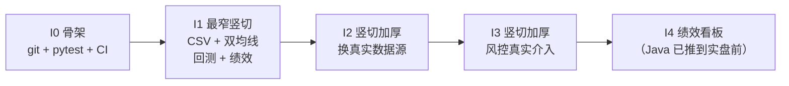

# 迭代计划（敏捷竖切）

> 状态：**2026-09-23 建立**。本文件是**手写产物**，可自由编辑。
> 上位依据：`docs/开工前缺口清单.md`（阻塞项与契约覆盖度）、`docs/开发工作流规范.md`（产物四件套 / TDD / 漂移控制 / 红线清单）。
> 本文件**不改写**上面两份的结论，只回答一个问题：**接下来按什么节奏交付，每一轮凭什么算完成。**
> 收口门禁：`python tools/verify_iteration_plan.py`（已注册进 `tools/run_all_gates.py`）。
> **2026-09-23 裁决落地**：Q6 立即 `git init` · Q4 砍掉股票池 · Q3 Java 推到实盘前 · Q2 按数据中心契约 D1 口径统一 · Q5 主文档 `Strategy` 接口按契约改齐（追加附录A）。
> 全部原「待决」问题已裁决，迭代划分随之定为 **I0~I4**（删去股票池那一轮，末轮收缩为绩效看板）。

---

## 一、为什么不用缺口清单 §六 的 Sprint 0~3

那份顺序是**按层切的**：Sprint 0 补契约、Sprint 1 回测层、Sprint 2 数据层、Sprint 3 风控层。
它对每一层的定义都是「等上一层全部完成」。后果：

- 迭代结束时交不出**能跑的东西** —— Sprint 0 末只交出文档，Sprint 1 末才第一次出现代码；
- 没有**端到端**的验收物，集成风险全部堆到最后；
- 「按模块」而不是「按可演示的价值」计分。

敏捷要的是每个迭代结束都有一条**端到端能跑、能演示**的窄路径。所以本计划**重切**而不重写：
契约、DDL、门禁这三件已经做出来的东西**原样复用**，只是把「什么时候用」重新排。

## 二、敏捷的三个前提：现状

| 前提 | 现状 | 依据 |
| --- | --- | --- |
| 每个迭代**可运行** | **成立**（2026-09-24 I2 S3 收工后）：`.venv` + pytest 可跑（`114 passed`）、`pyproject.toml`、`quanauto/` 包、`tests/`；依赖清单**不再为空**（`dependencies = ["pandas>=2.0"]`，使用者 `quanauto/datasources.py`；I0/I1 当时是空数组，因为那时的竖切只用标准库） | 本次实测，证据 `tools/gates-report.txt` |
| 每个迭代**可回滚** | **成立**（2026-09-23）：已是 git 仓库（`main`），一次迭代一个提交 | `docs/开工前缺口清单.md` C5 |
| 每个迭代**可度量** | **成立**：门禁 + 对称棘轮 + 触测/证伪计数（门禁数一律现取 `python tools/run_all_gates.py --list`，不写死） | `tools/gates-report.txt` |

⇒ **迭代 0 的内容只能是「把前两个前提建起来」，不是功能。**
在前提不成立时直接进功能迭代，等于既没有回滚也没有回归网。

## 三、迭代总览

| 迭代 | 目标（一句话） | 竖切产物（端到端可演示的东西） | 状态 | 证据 |
| --- | --- | --- | --- | --- |
| I0 | 把「可运行」「可回滚」两个前提建起来 | git 仓库 + pyproject.toml + pytest 可跑 + 6 个门禁接进一条命令 | 已交付 | `tools/ci-dryrun-report.txt` |
| I1 | 第一次端到端跑通回测 | CsvDataFeed + MA 双均线策略 + BacktestEngine + PerformanceAnalyzer → 一份可重复的回测报告 | 已交付 | `tools/gates-report.txt`、`tools/pytest-mutation-report.txt` |
| I2 | 把数据换成真实数据源 | AKShare/Baostock 适配器写入 PostgreSQL，回测改读真实日线 | 进行中 | `quanauto/datacenter.py`（S1：PIT / `as_of` 边界层）、`tools/verify_data_center_pit.py`、`tests/test_data_center_pit.py`、`quanauto/datasources.py`（S2：采集侧适配器）、`tools/verify_data_center_adapter.py`、`quanauto/pgstore.py`（S3 前半：落库侧读写）、`tests/test_data_center_store.py`、S3 后半：引擎只吃 as_of() 产出的 feed、`tests/test_backtest_db_feed.py` |
| I3 | 让风控真正介入交易 | `RiskEngine` 在下单前拦截（**默认关闭**：不接线时下单路径与 I1 逐一相同）+ `KillSwitch` 可人工触发并阻断后续下单 | 已交付 | `quanauto/risk.py`（风控引擎本体）、`quanauto/engine.py`（闸门接线与运行统计读取口）、`tests/test_risk_engine.py`、`tests/test_backtest_risk_gate.py`、`tools/pytest-mutation-report.txt` |
| I4 | 绩效看板（由原「看板 + Java 平台层」收缩而来） | 读一份回测结果 → 展示绩效指标表与资金曲线 | 已交付 | `quanauto/dashboard.py`、`quanauto/cli.py`（含 dashboard 子命令）、`tests/test_dashboard.py`、`tools/verify_dashboard.py`、`tools/dashboard-failure-report.txt` |

**2026-09-23 裁决对迭代划分的影响**（这是唯一会改变迭代数量的一处）：

- **Q4 砍掉股票池 ⇒ 原 I4「股票池与组合调度」取消**。B3（股票池契约）不再是 MVP 阻塞项，降级为「实盘 / 组合阶段前补」。
- **Q3 Java 推到实盘前 ⇒ 原 I5 的边界收缩为「绩效看板」**。gRPC 通信与 `common.proto`（B5）**不进 MVP**，因此末轮从「看板 + Java 平台层」变成单一的「绩效看板」。
- 迭代编号因此从 I0~I5 变为 **I0~I4**，编号仍连续（门禁 C5 会核对）。

**所有迭代都穿过同一根竖轴**：策略 → 数据 → 回测 → 绩效 → 结果。
每加厚一次都**复用同一套测试骨架**，而不是新开一层 —— 这是与缺口清单 §六 最大的区别。


```mermaid
graph LR
    I0["I0 骨架<br/>git + pytest + CI"] --> I1["I1 最窄竖切<br/>CSV + 双均线<br/>回测 + 绩效"]
    I1 --> I2["I2 竖切加厚<br/>换真实数据源"]
    I2 --> I3["I3 竖切加厚<br/>风控真实介入"]
    I3 --> I4["I4 绩效看板<br/>（Java 已推到实盘前）"]
```

**为什么 I1 能立刻开工**：契约模块一（`Strategy` / `StrategyRegistry`）与模块二（`BacktestEngine` /
`SimulatedBroker` / `PerformanceAnalyzer` / `DataIntegrityChecker`）已经到「签名 + 异常 + 数据类字段」级别，
缺口清单 §六 自己也点了这条竖切。I2 之后每轮都能复用数据中心已经验过的 DDL 与触测。

## 四、每个迭代的完成定义（DoD）

**规则（不可协商）**：每个迭代必须同时具备**产物四件套**，缺任何一件，这一轮的「绿」不成立。
下表四行是**必填形状**，不是建议 —— `tools/verify_iteration_plan.py` 会按形状核对。

#### I0 · 骨架与可运行闭环

| 件 | 具体是什么 | 判定方式 | 证据 |
| --- | --- | --- | --- |
| 契约 | 仓库目录结构 + 依赖清单（`pyproject.toml`）+ CI 要跑什么 | 本文件与缺口清单 §六 第 6 项一致 | `pyproject.toml`、`.github/workflows/ci.yml` |
| 产物 | `git init` 后的仓库 + `pyproject.toml` + 包目录 + 一条能跑的 `pytest` | `python -m pytest -q` 退出码 0；`git status` 可用 | `tools/ci-dryrun-report.txt`（第 1 节，退出码 0，`3 passed`） |
| 门禁 | 现有 6 个门禁改为**在 CI 里跑**，产物与本地同一命令 | `python tools/run_all_gates.py` 退出码 0 | `tools/gates-report.txt`（I0 当时快照 `verdict: PASS (6/6)`；该文件每轮覆盖，以**现取**为准） |
| 触发测试 | 故意让 CI 里的一个门禁 FAIL，确认 CI 真的红 | 一次真实的红 → 绿往返记录 | `tools/ci-dryrun-report.txt`（第 2 节，两次往返） |

**2026-09-23 进度：两半已全部交付。**
「可回滚」那半：仓库已建（`main` 分支、基线提交 `053f620`、工作区干净），
并加了 `.gitignore`（刻意**不**忽略三份证据快照与棘轮基线，忽略证据 = 假绿）与
`.gitattributes`（`* -text` 禁止 EOL 转换，因为本仓库多处判据直接读文件字节）。
「可运行」那半：`.venv` + pytest（`3 passed`）、`pyproject.toml`（`dependencies = []`，不预置）、
`quanauto/` 空包、`tests/test_skeleton.py`、`.github/workflows/ci.yml`，外加第 6 个门禁 `skeleton`。
⚠️ 上述数量与空依赖清单是**I0 当时的状态**，不是现取：I2 S2 起 `dependencies` 只有 `pandas>=2.0`
（使用者 `quanauto/datasources.py`，契约 §3.2 的签名逐字写 `pd.DataFrame`），源 SDK 在 `[datasources]` extra。
加依赖的规则没变 —— **由真正用它的模块带进来**，不按选型预置；`skeleton` 门禁并不检查这一栏，
所以「零依赖」这类措辞全靠人工守（详见 §二与 I2 S2 收工记录）。

**CI 那一行的诚实说法**：本仓库 2026-09-24 起已推上 GitHub（公开仓库，remote `origin`），
`.github/workflows/ci.yml` **真的会跑** —— 而且**首次真跑就判红**：`skeleton` 门禁发现
`CONTEXT.md` 指向的 `.venv/` 在克隆里不存在（本机有、CI 没有）。同一个 commit、同一份判据
两边结论不同，就是判据依赖环境；已修（本机产物目录不算仓库地址），并补了一条触发样本。修复后重推，第二次运行（2026-09-24，run 35939823649）**success**。
本机口径的等价证据仍是 `tools/ci_dryrun-report.txt`（同样的两条命令，两次红→绿往返），
两份证据**不能互相替代**。它也不是一次普通的「跑绿就交」：
`tools/ci_dryrun.py` 做了两次**红→绿往返**（改包版本 ⇒ pytest 必须红；拆掉 CI 里的门禁接线 ⇒ `skeleton` 门禁必须红），
变异前自断言「确实改了字节」。这两次往返当场报出了三件事：
① 第一次选的变异（改探针名单里的一个字符串）**根本不会让任何断言失败** —— 工具拒收了这个绿；
② 还原字节一致后 pytest 仍然红，真因是 `__pycache__` 的陈旧 `.pyc`（同秒写回 + 文件字节数相同，
   `(mtime, size)` 双双命中缓存）；③ 上一次运行遗留的 `.pyc` 会把**下一次**的第 1 步也毒化。
现在工具在启动时与每次往返前后都清缓存。

**收工必须交出的四个数字（全部来自真实运行，不许估算）**：门禁通过数 / 棘轮 `total` / `pytest` 通过数 / 触发测试与证伪计数。

**I0 收工时的四个数字（2026-09-23 实测）**：门禁 **6/6**（`GATES_EXIT=0`）· 棘轮 **39/39**（T1=2 / T2=19 / T3=18，**未动**：I0 没有还掉任何 B7 欠账）· `pytest` **3 passed** · 触发测试：本轮的 `tools/ci_dryrun.py` **2 次红→绿往返**（改包版本 ⇒ pytest 红；拆 CI 门禁接线 ⇒ `skeleton` 红），加上已有的 SQL 证伪 **31 案例 / 31 CAUGHT**。全部证据在 `tools/gates-report.txt` 与 `tools/ci-dryrun-report.txt`。

#### I1 · 最窄端到端竖切

| 件 | 具体是什么 | 判定方式 | 证据 |
| --- | --- | --- | --- |
| 契约 | 主契约模块一/模块二的签名与异常；本迭代只实现其中的竖切子集 | 逐个方法对照契约，未实现的写进「本迭代不做」 | `tools/contract-signature-manifest.json`、`docs/智能量化交易平台-核心模块接口契约文档.md`（附录 E5~E8 登记偏差） |
| 产物 | `CsvDataFeed` + MA 双均线策略 + `BacktestEngine` + `EventEngine` + `SimulatedBroker` + `PerformanceAnalyzer` | 同一条命令重复跑两次，绩效指标逐位一致 | `.rounds/i1/report-seed7-a.json`、`.rounds/i1/report-seed7-b.json`（同种子逐字节一致）、`.rounds/i1/report-seed8.json`（换种子必须真的不同）、`tests/fixtures/sample_prices.csv` |
| 门禁 | 契约签名一致性检查 + 回测结果可复现性检查 | 新增门禁接入 `run_all_gates.py` 且 tier-A 绿 | `tools/gates-report.txt`（两个新增 GATE 行）、`tools/verify_contract_signature.py`、`tools/verify_backtest_reproducibility.py` |
| 触发测试 | 把某个签名改成与契约不符、把随机源固定成不同种子，确认两个门禁都会红 | 两个独立的失败样本各自触发 | `tools/pytest-mutation-report.txt`、`tools/pytest_mutation_check.py` |

**I1 收工时的四个数字（2026-09-23 实测）**：门禁 **8/8**（`GATES_EXIT=0`，`SCOPE: FULL`）·
棘轮 **39/39**（T1=2 / T2=19 / T3=18，**未动**：I1 没还掉任何 B7 欠账，只新增了两条 tier-A）·
`pytest` **25 passed**（`test_backtest_slice.py` 22 + `test_skeleton.py` 3）·
触发测试：`tools/pytest_mutation_check.py` **8 变异 / 8 CAUGHT + 1 控制变异**
（控制变异改的是测试自己看得见的地方，必须报 `caught=NO`，否则说明抓取逻辑本身在乱报；
基线 `passed=22`）。证据：`tools/gates-report.txt`、`tools/pytest-mutation-report.txt`。

#### I2 · 换真实数据源

| 件 | 具体是什么 | 判定方式 | 证据 |
| --- | --- | --- | --- |
| 契约 | 数据中心的 9 个适配器契约 + `as_of_date` 语义（禁止绕过 `DataCenter.as_of()`） | 与数据中心契约 v1.0 逐条对齐 | `docs/智能量化交易平台-数据中心接口契约文档.md`（**附录 A**：S1 的 9 条实现侧裁决与偏差；**附录 B**：S2 的适配器裁决与偏差）、`tools/contract-signature-manifest.json`（`impl_only` 段） |
| 产物 | `AKShare` / `Baostock` 适配器写入 PostgreSQL；回测改读真实日线 | 端到端回测跑通（**假存储上已跑通**；真实 `dc_daily_bar` 是否有数据**从未验证**，未联网） | **S2 交付了采集侧适配器**：`quanauto/datasources.py`（三角色的源列名/取值映射 + 归一化 + `ValidationReport`）；**S3 前半交付了落库侧**：`quanauto/pgstore.py`（按 `data_version` 绑定的读 + 按业务主键的幂等 upsert + 驱动惰性适配）。**S3 后半交付了回测改读**：引擎只吃 `DataCenter.as_of()` 产出的 feed，报告里的 `data_version` 取自存储层（空版本必须抛错），回归测试在 `tests/test_backtest_db_feed.py`。**这一行仍不能打勾** —— 订正（2026-09-29）：原文写「真实数据源**从未联网联调**（源列名映射只在假源上验过）」，那句**已过期**（I2a/I2b 真联调过：腾讯日线、东财财务表、一次真入库）；现在的拦路石是**覆盖面**（少数标的 × 少数窗口）与**复权价之外的那几条**（**2026-09-29 晚 Ⅱ 订正**：**复权价**已实施 —— `DbDataFeed._row_to_bar` 按 `_price_scale()` 给的倍数把 OHLC 四列各乘一次 ⇒ 回测口径**不再**等于「不复权」；仍开着的是**分红**（`get_dividend()` 恒 `0.0`）、**两个 ingestor 无产品调用点**、**`validate_frame` 对复权帧零判据**，另有本轮新登记的 **`CsvDataFeed` 口径差**（**2026-09-29 晚 Ⅲ 订正：已收口**，见下方「A6 收口 Ⅲ」那一节）。**2026-09-29 晩 Ⅳ 订正：`validate_frame` 对复权帧零判据也已收口**（现在真的判值域 / 帧级自然键重复 / 认 schema）⇒ 仍开着的只剩**分红**与**两个 ingestor 无产品调用点**，见下方「A6 收口 Ⅳ」那一节）。**2026-09-30 / 2026-10-01 订正：那两条也先后关掉了** —— 两个 ingestor 的产品调用点 09-30 接上（DC 契约附录 **H**）、分红 10-01 收口（DC 契约附录 **B22**）⇒ 本行所说的「仍开着的」**现值是零条**（**收口条件 ① 全关**）；但本行**仍然不能打勾**，拦路石只剩**覆盖面**与未确认清单（**收口条件 ②**），见下方「十一」「十二」两节）。见下方 I2c 记录与「A6 收口 Ⅱ」那一节） |
| 门禁 | 适配器归一化检查（源特有字段名不得出现在数据类上）+ PIT 一致性检查 | 接入 `run_all_gates.py` 且 tier-A 绿 | `tools/verify_data_center_pit.py`（PIT 那一半）、`tools/verify_data_center_adapter.py`（归一化那一半：A0~A11 静态比对）、`tools/gates-report.txt`（两半都已注册且 tier-A 绿；**GATE 行的条数现取** `python tools/run_all_gates.py --list`，不要在这里写死 —— 原写「10 个 GATE 行」是当时的值） |
| 触发测试 | 构造一条 `available_date > as_of_date` 的数据，确认取数必须报错而不是静默返回；构造一个把源列名直接透出的映射表，确认归一化门禁会红 | 一次真实的拒绝记录 + 每个探测器各一个失败样本 | `tests/test_data_center_pit.py` 的 `test_pit_guard_catches_leak_from_store_that_ignores_window`（store 无视查询窗口，取数被 `FutureDataAccessError` 拒绝）；`tools/verify_data_center_adapter.py --selftest`（15 个场景，见下方 S2 记录） |

**I2 S1（子步）收工记录（2026-09-23 实测）**：门禁 **9/9**（`GATES_EXIT=0`）·
棘轮 **39/39**（**未动**：S1 没还掉任何 B7 欠账）· `pytest` **43 passed**（骨架 3 + 竖切 22 + PIT 18）·
触发测试：新门禁 `--selftest` **11 个场景全 OK**（1 个真实产物对照 + 9 个负样本 + 1 个期望 0 报错的干净样本），
外加 `tests/test_data_center_pit.py` 里那条真实的拒绝记录。
**S1 没有关闭 I2** —— 适配器、落库、回测改读三件都还在（上一张表的「产物」行因此不能标完成）。
证据：`tools/gates-report.txt`。

**I2 S2（子步）收工记录（2026-09-24 实测）**：门禁 **10/10**（`GATES_EXIT=0`，`SCOPE: FULL`）·
棘轮 **39/39**（**未动**：S2 同样没还掉任何 B7 欠账，只新增了一条 tier-A）·
`pytest` **75 passed**（骨架 3 + 竖切 22 + PIT 18 + **适配器 32**）·
触发测试：新门禁 `tools/verify_data_center_adapter.py` 的 `--selftest` **15 个场景全 OK**
（1 个真实产物对照 + **13 个负样本** + 1 个期望 0 报错的干净样本，每个探测器各有自己的样本），
外加 `tools/run_all_gates.py --selftest` **19 条断言全 OK**。
**S2 也没有关闭 I2** —— 落库、回测改读、复权因子三件都还在（上一张表的「产物」行因此仍不能标完成）。
**依赖清单从 S2 起不再为空**：`pandas>=2.0` 进了 `dependencies`（使用者 `quanauto/datasources.py`，
数据中心契约 §3.2 的方法签名逐字写了 `pd.DataFrame`），源 SDK 走 `[datasources]` extra ——
I0/I1 的空清单是「选择不是缺口」，S2 加依赖也同样给出使用者与理由，不按选型预置。
证据：`tools/gates-report.txt`、`tools/ci-dryrun-report.txt`。

**I2 S3（子步，前半：落库侧）收工记录（2026-09-24 实测）**：门禁 **10/10**（`GATES_EXIT=0`，`SCOPE: FULL`）·
棘轮 **39/39**（**未动**：S3 没还掉任何 B7 欠账）·
`pytest` **104 passed**（骨架 3 + 竖切 22 + PIT 18 + 适配器 32 + **落库侧 29**）·
红→绿是**两个各自独立的提交**：红那次是 21 failed / 4 passed 的**断言级**失败（不是 `ImportError`/`AttributeError`），
绿把读侧、写侧三条分支（新插入 / 同值不写 / 异值抛 `IngestConflictError`）、并发抢写、异常纪律与惰性驱动适配补齐。
触发测试：`tools/pytest_mutation_check.py` 从 I1 的单套件扩成**两个套件**，本处新增 9 条落库侧变异 + 1 条控制变异 ——
**17 变异 / 17 CAUGHT + 2 控制变异 + 1 ENV-LIMIT**（基线两套件共 `passed=51`）。
ENV-LIMIT 那条是「把惰性驱动导入改成模块顶层拉驱动」：本机 `.venv` 没装 `psycopg`，结果只能是收集期的 `ImportError`，
**断言根本没跑到** ⇒ 它只证明「这里验不了」，既不算 CAUGHT 也不算通过（换到装了驱动的环境要重跑）。
其中一条用例（`test_already_classified_error_from_a_lower_layer_passes_through`）是**变异测试抓出来的缺口**：
原先「本项目自己的异常不许被二次包装」那条用例其实没经过 `_run` 的守卫（`_raise_if_divergent` 是在 `_run` **外面**抛的），
把守卫删掉套件依然 28 passed；补上这条用例后 `S8-our-own-errors-get-wrapped` 才咬得住。
**S3 前半没有关闭 I2** —— 回测改读真实日线、复权因子（附录 A 的已知缺口）两件都还在。
两处**效力边界**必须连在一起读：① 落库侧用例**一律不连库**，假连接只能证明「发出去的语句与参数是什么」，
**不能**证明 PostgreSQL 接受它；② 库端证据来自容器通道 —— 冒烟快照 `tools/sql-smoke-report.txt` 与
`tools/sql-smoke-report-pg1{4,5,6}.txt`（2026-09-24 起覆盖 `postgres:14/15/16/17` 四个 tag），
逐条证伪快照 `tools/falsify-report.txt`（**只在 `postgres:17` 上做过**）。
两组都是**快照**：改过任何 `db/*.sql` 之后即作废，必须重跑（重跑时用 `--report=` 另存，别覆盖）。
证据：`tools/gates-report.txt`、`tools/pytest-mutation-report.txt`。

**I2 S3（子步，后半：引擎改读）收工记录（2026-09-24 实测）**：门禁 **10/10**（`GATES_EXIT=0`，`SCOPE: FULL`）·
棘轮 **39/39**（**未动**：S3 后半同样没还掉任何 B7 欠账）·
`pytest` **114 passed**（骨架 3 + 竖切 22 + PIT 18 + 适配器 32 + 落库侧 29 + **端到端接线 10**）·
红→绿是**断言级**的两轮：先 `7 failed / 3 passed`，改完测试自身的两个错误假设后 `6 failed / 4 passed`，
两次都不是收集期的 `ImportError`（红步骤必须真的跑到断言才行）。
**这一半咬出 3 个真缺陷**（两边各自全绿、接缝上一行没跑过的典型）：① 存储层交出的数值是 `Decimal`，
在入库到引擎的边界上没归一 ⇒ `float // Decimal` 抛 `TypeError` 并被包成 `BacktestExecutionError`；
② `_execute` 在挂 `self._result` **之前**就调了 `validate_no_leakage()` ⇒ 每份报告的未来函数检查都是空壳
（`row_count=0`、`warnings=["尚未执行回测…"]`）却报 `is_valid=True`；③ 报告里的 `data_version` 用的是
`os.path.basename(feed.csv_path)`，而 `DbDataFeed` 没有 `csv_path` ⇒ 标出来的是 K 线条数，且两份
**不同版本、条数相同**的数据会得到同一个字符串。
触发测试：`tools/pytest_mutation_check.py` 从两套件扩成**三个套件**，本处新增 4 条变异 + 1 条控制变异 ——
**21 变异 / 21 CAUGHT + 3 控制变异 + 1 ENV-LIMIT**（基线三套件共 `passed=61`）。
一条**过期证据快照**被门禁抓到：`_execute` 次序修好之后，`.rounds/i1/*.json` 里记着的
`validation_report` 与本次跑出来的不再一致，`backtest-reproducibility` 门禁报出 3 条 `R5-EVIDENCE-CURRENT` ⇒
走的是**显式重录**（`tools/verify_backtest_reproducibility.py . --record`，diff 6 增 12 删，只改 `row_count` 与 `warnings`），
不是静默刷新 —— 这正是该门禁存在的理由。
**S3 后半也没有关闭 I2** —— 真实数据源从未联网联调、复权因子仍恒 1.0，两件都还在。
证据：`tools/gates-report.txt`、`tools/pytest-mutation-report.txt`。

**S2 顺手修掉一个 harness 自身的假绿（这才是本轮最该记的一件事）**：`write_report()` 之前拿到的是
`--gate=` **过滤之后**的子集，于是 `scope_line()` 的比较集也跟着缩小，单跑一条门禁会把
`SCOPE: FULL -- all 1 registered gate(s) ran.` 写进它自己产出的报告 —— 正是 SCOPE 那行要防的
「少跑了却自称完整」。它一直没被发现，是因为**自测只测了 `scope_line()` 这个纯函数**，
而 bug 在**调用点传错参数**上：再多的纯函数用例也看不见实参。补的是一条**端到端**控制组
（`scope-line-wired-e2e`：真跑一次 `--gate=`、把报告写到临时路径、读回落盘的字节，要求首行是
`SCOPE: PARTIAL -- 1 of 10 gate(s) ran`）；为此把 `execute()` 从 `main()` 里拆出来。
同一条道理也适用于 `tools/dev.py` 的自测：它第一次跑就抓出「runner 无条件拼 `sys.executable`」
把 `git` 送进解释器的 bug —— 自建工具必须能被证明会红。

**S1 留下一条已知缺口，且是故意留的**：复权因子在 S1 恒为 1.0（`get_adjustment_factor`）。
`tests/test_data_center_pit.py` 里有一条用例**故意断言这个错值**，作用是把它钉在明面上。
**复权因子真的接上（HFQ）后**，处理方式是**删掉那条用例 + 销掉缺口**，**不是**把期望值改成正确值——
后者会把「缺口已关闭」和「期望值跟着实现跑」写得一模一样。

> **触发条件订正（2026-09-25 实测）**：这句原先写「`S3` 真正接上 HFQ 后」。S3 **已交付**，
> 而因子**仍未接上**（`quanauto/datacenter.py` 的 `get_adjustment_factor()` 仍 `return 1.0`，
> `dc_adjust_factor` 仍无采集路径）⇒ 拿「哪一步交付」当触发条件会被读成「S3 已交付 ⇒ 该删了」，
> 而那会删掉一条**仍然正确**的测试。故触发条件只留「因子真的接上」。订正记录见 DC 契约附录 A6。
> **再订正（2026-09-29，见下方 I2c 记录）**：本节引的那句理由里写着「`dc_adjust_factor` 仍无采集路径」——
> 那一半**已过期**：I2c 把采集路径接上了。但**结论不变**（缺口没关，所以那条用例仍不许删），
> 只是「真的接上」的判据要落到**产物**上：**读侧不再恒返回 1.0**，而不是「哪一层接了」。

> **执行记录（2026-09-29 晚）**：上面那句把触发条件落到了「**读侧不再恒返回 1.0**」上 ——
> **该条件当晚就满足了**，于是本节指定的动作**被执行了**：`tests/test_data_center_pit.py` 里那条
> 故意断言错值的用例（`test_known_gap_hfq_factor_is_identity_in_s1`）**被删掉，不是改期望值**。
> 但要说清：本节那句写的是**两个**动作（「删掉那条用例 **+** 销掉缺口」），
> **只兑现了前一个** —— 删用例 ✅、**销掉缺口 ❌**：缺口没销，是**改了名字**
> （现在开着的是「复权价仍未实施」，见下方 A6 收口那一节与 DC 契约附录 A6 的收口块）。
> **又订正（2026-09-29 晚 Ⅱ）**：上面括号里那句「现在开着的是『复权价仍未实施』」**也已作废** ——
> 复权价实施了，见下方「**A6 收口 Ⅱ**」那一节（标题按内容搜，**不要**引行号）。仍开着的是**分红** /
> **两个 ingestor 无产品调用点** / **`validate_frame` 对复权帧零判据** / 本轮新登记的 **`CsvDataFeed` 口径差**
> （**2026-09-29 晚 Ⅲ 订正：`CsvDataFeed` 口径差已收口** —— CSV 侧现在也乘因子，见下方「A6 收口 Ⅲ」那一节）。
> **⚠️ 2026-09-29 晩 Ⅳ 订正：上面那句里的「`validate_frame` 对复权帧零判据」也已收口**（复权帧现在
> 真的被判：值域 / 帧级自然键重复 / 认 schema）⇒ 这一行里仍开着的是**分红** /
> **两个 ingestor 无产品调用点**（**两条**）。见下方「**A6 收口 Ⅳ**」那一节。
> 原用例的第二个主题（`get_dividend()` 仍恒 `0.0`）**拆出来**成
> `test_known_gap_dividend_is_still_zero`，那一条**仍然成立、不许删**。
> （这条执行记录**不**构成「缺口已关闭」的证据 —— 它只说「那条用例按规矩删了」。）
>
> **⚠️ 2026-10-01 订正：这条里最后一个还开着的（ⓐ 分红）也已收口** ⇒ 上面那句
> 「仍开着的是**分红** / **两个 ingestor 无产品调用点**（**两条**）」现在**一条都不剩**
> （ⓑ 2026-09-30 接上、ⓐ 2026-10-01 落地）⇒ **收口条件 ① 的三条子项全关**。
> ⚠️ 那条用 case 也随之**按 A6 的触发条件删除** —— `test_known_gap_dividend_is_still_zero`
> **不再存在**（**不是**把期望值改成新数留下，是删：判据是**产物**，不是「哪个迭代交付了」）。
> ⚠️ 删掉它**不**推翻上面那句执行记录 —— 那句说的是**另一条**用例
> `test_known_gap_hfq_factor_is_identity_in_s1`，它在 2026-09-29 就按规矩删了。
> 见下方「**十二、I2 收口 ①ⓐ：分红**」那一节与 DC 契约附录 **B22**。本行原措辞保留以留痕，**不要**照它判现状。

> **执行记录·续（2026-09-29 晚 Ⅱ）**：上面那条记录里说「缺口没销，是**改了名字**（现在开着的是「复权价仍未实施」）」——
> **那个新名字当晚 Ⅱ 也作废了**：复权价实施了（`DbDataFeed._row_to_bar` 按 `_price_scale()` 的倍数乘 OHLC 四列），
> 逐条见下方「A6 收口 Ⅱ」那一节。本节那句「缺口没销」**仍然成立**，但它现在指的是一组**别的**对象
> （分红 / 两个 ingestor 无产品调用点 / `validate_frame` 对复权帧零判据 / `CsvDataFeed` 口径差）
> ——**2026-09-29 晚 Ⅲ 订正：括号里最后那一条已收口**（其余三条不变），见下方「A6 收口 Ⅲ」那一节。
> **⚠️ 2026-09-29 晩 Ⅳ 订正：括号里「`validate_frame` 零判据」也已收口** ⇒ 只剩**分红**与
> **两个 ingestor 无产品调用点**（两条）。触发条件仍然**没有**触发（Ⅳ 那轮同样**一条用例都没删** ——
> 两条复权帧用例是**改名 + 掉头**）。见下方「**A6 收口 Ⅳ**」那一节。
> 这条触发条件**第四次**正确地没有触发（Ⅳ 那轮一条用例也没删，只新增）。
> 触发条件「缺口真的关闭」**第三次正确地没有触发** —— 本次改动**一条用例都没删**，只新增（读侧 7 条 + 端到端控制组 1 条）。
>
> ⚠️ **2026-10-01 订正（事实 + 计数）**：上面这两段里的清单与「没有触发」的记录都停在 2026-09-29 ——
> ① 之后 **2026-09-30 接上两个 ingestor**、**2026-10-01 收口分红** ⇒ 本次订正链要盯的对象**一条都不剩**
> （**收口条件 ① 全关**，I2 仍开着的只剩 **②**）；② 触发条件「缺口真的关闭」在 **2026-10-01 那天第一次真的触发**了：
> ⓐ 是**最后**一条且**真的关掉了** ⇒ 按本节自己的规矩，只对着那条缺口写的用例
> （`test_known_gap_dividend_is_still_zero`）**被删掉，不是把期望值改成新数**。
> 「第 N 次没有触发」这个计数到此**终止**（此前四次都以「缺口没关」收场，不是因为条件写错了）。
> 见下方「**十二、I2 收口 ①ⓐ：分红**」那一节与 DC 契约附录 **B22**。

**I2 的收尾拆成两半（2026-09-24 登记；同日**订正**一次，见下）**：I2 剩下的两件事，一件在离线下
就能做完，另一件必须真的联网取一次数。混在同一行里会导致「I2 进行中」永远不收敛，所以拆开记、分开验收：

| 半 | 范围 | 本机能否完成 | 验收方式 |
| --- | --- | --- | --- |
| **I2a** | 取数错误**可分类**（哪个源 / 哪一类失败 / 是否可重试，而不是一句字符串）+ 全部离线的契约测试 + `EastMoneyAdapter._default_fetch` 这条「无官方 SDK 源」的接线形状 | **能**（不联网、不装源 SDK） | 用例离线可跑，失败路径逐类有样本 |
| **I2b** | 真实取数联调（AKShare/Baostock 拉数入库）+ 源列名映射表逐条**联网**核对 | **能**（2026-09-24 实测可达，见下） | 一次真实取数冒烟 + 与 `dc_daily_bar` 的读回闭环；**仍不得成为任何门禁或 DoD 的硬要求** |

**订正记录（2026-09-24，登记后 30 分钟内）**：本表最初把 I2b 写成「**不能**（需外网 + 源 SDK，本机未装）」
并标「环境受限」。**这是把一个未验证的假设写成了限制** —— 登记时一次探测都没做。补测后三条实测：

| 实测项 | 结果 | 命令 |
| --- | --- | --- |
| 东财行情接口（`push2his.eastmoney.com/.../kline/get`，akshare 主源真正的数据端点） | **直连 200**（代理亦 200） | `curl.exe --noproxy "*" -s -o NUL -w "%{http_code}" --connect-timeout 8 <url>` |
| `akshare` | 可从当前 pip 源取得，最新 **1.18.97** | `python -m pip index versions akshare` |
| `baostock` | 可从当前 pip 源取得，最新 **0.9.4** | `python -m pip index versions baostock` |

⇒ 「环境受限」**撤销**。I2b 的真实不确定性不是网络，而是**源列名映射表与真实返回对不对得上**
（映射表是从各源文档抄的，从未联网核对）——那只有跑一次才知道，属于「未知」不属于「受阻」。
**不变的那条**：真实取数天然不可复现、依赖外部站点存活，所以它**永远不得成为任何门禁或 DoD 的硬要求**，
只能是**人工**跑的冒烟并把证据落到报告文件里；`pytest` 默认套件里不许出现联网用例
（CI 是 `pip install -e ".[dev]"`，**不含** `[datasources]` extra，装了源 SDK 也未必在）。

**其余两条不变式照旧**：

- 拆分**没有关闭 I2**：上面那张 DoD 表的「产物」行**保持未勾**，§三 的状态仍是「进行中」。
  拆分的意义只是让 **I2a 能被单独验收**，而不是把 I2b 的未决状态当成 I2 的失败。
- 两条判据照旧不许动：`tests/test_data_center_pit.py::test_known_gap_hfq_factor_is_identity_in_s1`
  **不许删、不许放宽**（HFQ 真接上前它就该是错的）；**任何门禁与用例都不得把「装了源 SDK」写成前置条件**
  （源 SDK 挂在 `[datasources]` extra 上，CI 只装 `[dev]`）—— 这是**规则**，与 `.venv` 当下装没装无关。

**I2a 再拆一步（2026-09-24）**：I2a 内部也有先后，先做那个「离线就能验完」的。

- **I2a-1（本轮落地）**：取数失败**可分类**。`SourceAdapterError` 新增 `source`／`kind`／`retryable`
  三个属性；类别表 `SOURCE_FAILURE_KINDS` 是**八类闭集**，可重试清单 `RETRYABLE_SOURCE_FAILURES`
  是其子集；判定函数 `classify_source_failure`（`quanauto/datasources.py`）按「调用方接下来该做什么」
  分类，不按异常类型名；翻译点仍只有 `_AdapterBase._call` 一处。写成 `kind` 不在表里 **当场 `ValueError`**，
  **不降级成 `UNKNOWN`** —— 静默降级会让「表写错了」和「真没归类」长得一模一样。
  证据：`tests/test_data_center_adapter.py`（**一个类别一个样本**，含判定顺序与「每类都有生产者」
  两个反向用例，该文件全绿）、门禁探测器 `A11`（`TAXONOMY-CLOSED`，四个**单向**触发样本已进
  `--selftest`，干净合成样本仍绿）。
- **I2a-2（本轮落地，2026-09-24）**：`EastMoneyAdapter._default_fetch` 走标准库 `urllib` 接上东财端点。
  **不引入第三方 SDK**：该源无官方 Python SDK。
  落地三件：①唯一网络出口 `_http_get_json`（`quanauto/datasources.py`，标准库 `urllib`，
  `opener` 可注入 ⇒ 离线可测）；②`_default_fetch` **真取数**（`filter=(SECURITY_CODE="<裸代码>")`、
  `columns=ALL`、`source=WEB&client=WEB`，按 `pageSize=100` **逐页翻**，超过 200 页抛
  `SOURCE_SCHEMA_MISMATCH` 且**不截断**，体内 `success=false`（如 `code=9501`）也归该类且**不重试**）；
  ③人工冒烟 `tools/eastmoney_transport_smoke.py`（**不是门禁**，证据
  `tools/eastmoney-transport-smoke-report.txt`）—— 它自己的两个新判定分支（「一张表都没比对上」
  与「某张表缺列」）另做了**三个离线触发样本**（全失败 / 缺一列 / 两张表都全），
  前两个确实报 `SMOKE FAIL` 且退出码 1、第三个保持 `SMOKE OK`（触发测试顺带撞出并修掉一个
  真 bug：`--report=` 指到别的盘符时 `os.path.relpath` 抛 `ValueError`，报告写完了却崩在最后一行打印）。
  离线那一侧的用例全部打**本机** HTTP 服务：
  query 拼装 / UA / 状态码 429・401・403・503 / 非 JSON 正文 / 端口关闭 / 逐页 `pageNumber` /
  页数上限 / 体内失败 / 未登记 `reportName`（**零请求**）/ 空 `data`，一路走到
  `classify_source_failure` 的真实类别（真传输 → 真适配器 → 真分类器，**不碰外网**）。
- **本轮实测把 I2b 的「真实不确定性」提前引爆了**：`EASTMONEY_FINANCIAL` 的 9 列
  **没有任何单一 report 能喂满**。`RPT_LICO_FN_CPD` 给 5/9（缺 `REPORT_DATE`/`REPORT_TYPE`/
  `TOTAL_ASSETS`/`TOTAL_EQUITY`），`RPT_DMSK_FN_BALANCE` 给 5/9（缺 `REPORT_TYPE`/
  `TOTAL_OPERATE_INCOME`/`PARENT_NETPROFIT`/`WEIGHTAVG_ROE`）；并集 8/9，**唯一缺席的是
  `REPORT_TYPE`**（真实响应里只有 `REPORT_TYPE_CODE`）⇒ `EASTMONEY_REPORT_TYPE`（按**中文报表名**建）
  在真实返回上**没有生产者**。⇒ 映射表**不是「未验证」，是「已部分证伪」**，登记在数据中心契约附录 **B12**。
  **裁决（选项 A：双请求合并）已落地，落地面记在附录 B13**：`EASTMONEY_REPORT_TYPE` 的键域改成
  `reportName`（`RPT_LICO_FN_CPD → INCOME`、`RPT_DMSK_FN_BALANCE → BALANCE`）；
  `EASTMONEY_FINANCIAL` 拆成 `EASTMONEY_INCOME_FINANCIAL`（日期键 `REPORTDATE`）与
  `EASTMONEY_BALANCE_FINANCIAL`（日期键 `REPORT_DATE`）；`fetch_financial` 改成**逐报表取数再合并**
  ⇒ **一个 `(symbol, period_end)` 现在出多行**，`report_type` 是 `dc_financial` 主键的一部分；
  `normalize_financial` 增 `report_type=`、删 `report_type_map`（没有生产者的映射参数
  就是一条走不到的分支，不留）。
  这条只能验「接线形状」，**验不了**「取回来的数对不对」—— 那是 I2b；而且 `pageSize=100`
  与东财的**日期过滤语法**都**还没实测**（B12 那次只用了 `pageSize=2` 探形状），一并记入 I2b-2。

**传输层两条坑（2026-09-24 实测，写下来免得下次当玄学）**：

- **代理**：Windows 上 `urllib.request.getproxies()` 读的是**注册表**里的系统代理
  （实测返回 `{'http': 'http://127.0.0.1:7890', ...}`），而 curl 只看环境变量（本机为空）。
  ⇒ 同一台机器同一时刻出现 `curl 200 / python RemoteDisconnected` 是**可能的**，
  不要据此断言「端点不稳」。冒烟报告头部把 `getproxies()` 的实际取值记下来，就是为了这个。
- **`push2his`（kline）对连续请求会拒**：上表那条「直连 200」是**首次**探测的结果；
  随后同一条命令（含 python `urllib`，默认 opener 与绕开代理的直连 opener 各一次）
  全部失败，`curl` 亦从 200 变成 000。所以 `tools/eastmoney_transport_smoke.py`
  把 kline 探测**移出判定**（契约 §3.2 的表里东财本就不覆盖行情，适配器不调它），
  并把两种结果都留在报告里。**I2b 的「拉一条真实日线」不能想当然地押在这个端点上。**

> 上表第一行的「直连 200」与本节不矛盾：它是一次**当时的**观测，被原样保留；
> 本节是同日**二次**观测。两次都真，结论是「该端点可取性不稳」，不是「谁测错了」。

**I2b-2 落地（2026-09-24）：报表列名 / 分页 / 日期过滤语法已实测，但**没有**收口成「映射表已验证」。**

上面 I2a-2 那段末尾写着「`pageSize=100` 与东财的**日期过滤语法**都**还没实测**」——
那是**登记当时的**事实，被原样保留；下面是同日**补测后**的状态（**不**回改上文那两句）：

- **已结清**：①两张财务表的映射键**逐一对上**真实返回（B12 只探了形状、没逐键比对，这是本轮补的）；
  ②日期过滤语法 = `(SECURITY_CODE="…")(REPORTDATE='YYYY-MM-DD')`，**单引号**、**每报表各自的**日期键，
  用错键名被源当场拒绝（`REPORT_DATE列不存在`）而**不是**静默返回全量。
- **只结清一半**：`pageSize=100` **被真的遵守**（`2→54 页/2 行`、`100→2 页/100 行`、`500→1 页/108 行`），
  但**上限未探**（未试 1000/5000）⇒ 它仍是**取值**，不是实测上限。
- **🔴 新开的边界（未解决）**：`NOTICE_DATE` **更像「最后修订日」而非「首次公告日」**。
  两张表 12/30 与 29/30 的年报行「公告年 ≠ 报告期次年」；利润表上 `notice == update` 占 40.7%
  且最近 4 期全同 ⇒ 指向该列是修订日。**安全侧没问题**（两表 0 行「公告日早于报告期」⇒ 不造未来函数），
  风险方向是**数据迟到**。**本轮不改映射表** —— 资产负债表没有判别器可用、且「真实首次公告日该取哪列」
  没实测过，照猜重写正是 B12/B13 的教训。登记在数据中心契约附录 **B14**。
- **性质**：全部来自一次性探针 `.rounds/_i2b2_probe.py`（**gitignored、不进仓、不是门禁**）⇒
  与 B12 同级，**人工冒烟**，结论不回灌成「东财已验证」。**I2 仍未收口**，DoD 的「产物」行仍不勾。

**I2b-2 补记（2026-09-24 同日后半段）：B14 挂账①结清 —— `period_end` 拼进请求侧，**但契约保证的是本地那一遍**。**

上面「已结清」那条只说了语法，没说**要不要用它**；`datasources.py` 当时留的措辞是
「日期过滤语法没有实测过，不猜」—— 语法一旦实测，这句话就**过期**了，必须换成明确裁决：

- **裁决**：请求侧拼 `(REPORTDATE='…')`，**只当省流量**；`fetch_financial` 末尾**仍然**按
  `period_end` 本地筛一遍，**那一遍才是契约保证的**。源哪天静默忽略这个参数，
  后果只是流量变大，**不是**多几期数据进 `dc_financial`。
- **🔴 顺带抓到一个真缺陷**：请求里的日期原写成**双引号**，与 B14 实测的**单引号**不符。
  它不是靠人眼发现的 —— 测试的期望值**是照 B14 实测逐字写的**、不由实现算，所以一跑就红；
  **修的是实现，不是测试**。（此前那批测试的期望值照实现对齐，等于「实现等于它自己」的自证，
  与 B16.1 的 5 段/6 段同根因。）**期望值必须是测量结果，不能是实现的反光。**
- **触发测试**：`.rounds/_i2b2_filter_trigger.py`（gitignored、非门禁）3 个变异 **3/3 被抓**；
  变异前与还原后干净、还原后**逐字节一致**。登记在数据中心契约附录 **B17**。
- **仍未确认**：`pageSize` 上限、除 `600000` 外的标的、源**静默忽略** `filter` 时的返回形态、
  `NOTICE_DATE` 语义（挂账②）、这条通道**真的入过库**。**I2 仍未收口**，DoD「产物」行仍不勾。

**I2b-1 前置测量（2026-09-24）：日线通道在本机走不通 ⇒ 先裁决通道，I2b-1 才算开工。**

I2b-1 的 DoD 是「一次真实取数冒烟」。动手前先测**当下**可达性（上一轮记过 `push2his` 有分钟级翻转，
隔一轮不能当仍成立）。探针 `.rounds/_i2b1_probe.py`（gitignored、非门禁），结论登记在数据中心契约附录 **B15**。

- **A 东财 kline（= `AKShareAdapter` 走的那个端点）在本机不可用**：默认 opener 与直连
  （`ProxyHandler({})`）都是 `RemoteDisconnected`，**连跑两遍同样症状** ⇒ 挂的是**端点**不是代理，
  不能读成「换条路线就行」。于是 `AKShareAdapter` 的**日线**路径在本机端到端跑不通
  （端点不可达 **且** akshare 未安装）。注意它**不**推翻 B12：B12 测的是 `datacenter-web`
  财务接口（**另一个域名**）。
- **B 新浪 `getKLineData` 可用**：`datalen=5→5 行`、`datalen=1023→1023 行`，历史 `2022-07-11…2026-09-23`，
  6 个英文列（**无 symbol、无 `amount`**），`volume` 单位是**股**，而现有映射配的是**手**
  ⇒ 走这条路要 **÷100**。
- **C 新浪 `klc_kl.js` 是「200 但不可用」的反例**：57 KB 正文是**编码过的**文本，需要新浪自己的解码
  ⇒ 记住 **HTTP 200 + 大正文 ≠ 可用**（我那条「像数据文件」的判据只判得出它不是明文）。
- **待裁决**：契约 B15 列了甲/乙/丙三条，**甲 = 新增一条 stdlib 直连的新浪日线源**（照 `EastMoneyAdapter`
  绕开 SDK 直连厂商 HTTP 的先例）**推荐**。在裁决前 I2b-1 **不算开工**、DoD「产物」行**不勾**；
  裁决也**不等于**收口，**I2 仍未收口**。

**I2a-1 刻意留下的两条边界**（写下来防止下一轮当成 bug 去「修」）：

- **判定顺序即风险**：`socket.timeout` 是 `OSError` 的子类、`HTTPError` 是 `URLError` 的子类，
  顺序写反了分类会静默错位（不是报错）。`tests/test_data_center_adapter.py` 里有一条专门盯顺序的用例。
- **没有「源没给数据」这一类**：那个语义已经由 `DataNotAvailableError`（DATA_001）表达，
  再加一个类别等于给同一种情况两个出口。

**I2b-1 落地（2026-09-24）：腾讯日线通道 + 一次真实取数冒烟。冒烟 PASS，但 **I2 仍未收口**。**

- **裁决落地：B15 的「甲」被采纳，但换了源**。甲的原则是「stdlib 直连厂商 HTTP、opener 可注入、
  离线可测」，**不绑定新浪**。新浪 `getKLineData` 只有 6 列、**没有 `amount`**，而
  `dc_daily_bar.amount` 是 `NOT NULL` ⇒ 用新浪就得**合成** `amount = volume × close`
  （除权日必错，且那是**造数据**）⇒ 换同原则的腾讯 `newfqkline/get`（第 4 条通道，
  `priority = FALLBACK`，`dc_daily_bar.source` 无 CHECK 枚举 ⇒ **不需要改 DDL**）。
- **产物**：`quanauto/datasources.py` 的 `TencentAdapter`（映射表只登记实测验证过的位置 `0,1,2,3,4,5,8`；
  两个单位换算**各一个开关**：手→股 ×100、万元→元 ×10000；自己按 `end` 回溯分页 + 本地裁剪）；
  `tests/test_data_center_adapter.py` 新增 19 条**离线**用例（注入 opener，不联网）。
- **门禁**：`tools/run_all_gates.py` → **12/12 PASS**、棘轮 **39/39**（现取，见 `tools/gates-report.txt`；本行 I2b-1 交付当时是 10/10；2026-09-25 B7 还债后又现取一次是 **13/13、棘轮 2/2**）。
- **触发测试**：`.rounds/_i2b1_smoke_trigger.py` → `samples=12 detectors=9 covered=9` **PASS**
  （含一个干净样本防误报、一条覆盖守卫保证 9 个探测器都被触发过）。
- 🔴 **冒烟抓到的是一个真实现缺陷**（本轮最有价值的一件事）：适配器一度发出 **5 段** `param`，
  源**带内拒绝**（`code=0 msg='param error'`、`data=[]`），而**离线用例当时是绿的** ——
  因为断言写成了我自己意图里的形状（`count(',') == 4`），再拿它验我自己的字符串。
  **那是自证，不是测量**，真实取数一跑就红。已改成实测的 6 段形状。
  详细登记在数据中心契约附录 **B16**（含「`start` 被忽略」「`count=n` 回 n+1 行」
  「最新交易日是活数据」「`%` 的两次误报」与未确认清单）。
- **仍未收口（DoD「产物」行保持未勾）**：复权因子仍恒 1.0、财务通道仍未收口、
  这条通道**从未真的入过库**、`end` 落非交易日与 `count` 上限**都没测**。**I2 未关闭。**
- 本轮的冒烟/探针/触发脚本全部是 `.rounds/*`（**gitignored、不进仓、不是门禁**）⇒
  它们**不写进 §三 表的「证据」列**（那列必须引用克隆里真实存在的路径）。

**I2b-3 落地（2026-09-24）：第一次**真的入过库** —— 落库闭环探针 + 它抓出的两个真缺陷。**

B16/B17 的「没确认什么」里都写着「这条通道真的入过库：**没有**」。本条把那行改成**有**：
真实取数 → 真 PostgreSQL → 读回逐字段对拍，全链路走通；代价是**当场判死了两个离线套件绿的假设**。

- **性质**：**容器**通道（一次性 compose，跑完 `down -v`，监听 `127.0.0.1:55432`）；
  **本机依旧没有 PostgreSQL 实例**。走的是 B16 那条腾讯通道，样本 `600000.SH` × 86 行。
  建表前有**空库守卫**（`public` 表数必须 == 0）—— 理由：`CREATE TABLE IF NOT EXISTS` 在旧库上
  **静默跳过**，DDL 与触测会一起假绿。
- **闭环**：取数 86 行 → `inserted=86 skipped=0` → 读回 86 行按日升序、`max|read − written| = 1E-7`
  → 同批重跑 `inserted=0 skipped=86`、异值写抛 `DATA_007` 且已回滚 → 库内 11 列与
  `pgstore.BAR_COLUMNS` 逐列一致。
- 🔴 **B20 重读（2026-09-25）**：上面那个「读回 86 行」与「库内 11 列一致」**都是同一条连接上的自读**，
  而当时那条连接已经被 `execute()` 留下了未结束的隐式事务 ⇒ `transaction()` 退化成 SAVEPOINT、**永不 COMMIT**。
  ”那 86 行真的入过库“这句话**不成立**（重演见契约附录 B20：同一次运行里同连接自读数到 3、新连接数到 0）。
  两个缺陷已修（`autocommit=True` + `description is None`），并有进仓守卫；未修的旧证据不要再当作持久化。
- 🔴 **缺陷一（真库炸，离线全绿）**：`PsycopgConnection.transaction()` 原写 `with conn:`。
  psycopg 3.3.6 的 `Connection.__exit__` 在提交/回滚**之后还会 `close()`**（无 pool 时），
  于是「先入库、再读回」在真库上报 `DATA_008 … the connection is closed`。
  离线假连接把 `__exit__` 写成「只记 commit/rollback、不关连接」—— 那是照**作者的假设**写的，
  **不是照驱动实测写的**。已改 `conn.transaction()`，并把**假驱动的保真度**单独立一条用例钉住。
- 🔴 **缺陷二（D10 当场破裂）**：`non-exact cells = 11`，典型 `2026-06-15 amount`
  写 `842270399.9999999` / 读 `842270400.0000` —— 源侧「万元」2 位小数 × 10000 走 float64
  必然落在整数下方；库按 `numeric(20,4)` 存的就是 `842270400.0000`。
  拿两个标度不同的数去比 ⇒ **同批重跑抛 `DATA_007`**，而 D10 要求的正是「重跑 == 跑一次」。
  修法：`_as_decimal` **末尾**量化到 `_VALUE_SCALE = 4`（舍入显式 `ROUND_HALF_UP`）——
  只改一处就让**读、写、比三条路径同时收敛**；并补一条**反向**用例保证一分钱仍判冲突。
- **教训（第三次同源）**：B16.1（5 段/6 段）、B17.1（日期引号）、本条 —— 都是
  **对驱动/源行为的假设当成了事实**。**替身（假源 / 假驱动）必须照实测写，否则它证明的只是
  「实现等于它自己」。**
- **产物（进仓）**：`quanauto/pgstore.py`（量化 + `transaction` 文档串写明实测依据）、
  `tests/test_data_center_store.py` **+5 条**用例（含 `_VALUE_SCALE` 与 `db/data_center.sql`
  的**日对账**用例，带「提取为空即 FAIL」守卫）、`tools/pytest_mutation_check.py` 新增
  **S12a**（改回 `with conn:`）/ **S12b**（拿掉 `quantize`）两条变异，样本**来自真跑出来的缺陷**。
- **判据**：`python -m pytest -q` → **273 passed**（2026-09-25 现取，B20 修后 +3）；变异套件
  `mutations=29 caught=29 control=3 env_limited=0`（32 条样本，baseline `passed=81`）→ PASS；
  `tools/run_all_gates.py` → **12/12 PASS**、棘轮 **39/39**（**现取**，见 `tools/gates-report.txt`）。
  （本行 2026-09-24 交付当时的值是 270 passed / `26-26-3-1` / 10 个门禁；2026-09-25 又现取一次是 11/11；
  同日 B7 还债后再现取是 **13/13、棘轮 2/2**。）
- **触发测试**：`.rounds/_i2b3_roundtrip_trigger.py`（gitignored、非门禁）→ 3 个变异样本 +
  2 次干净对照；**七项判据同时改错 ⇒ 七条全红**、早退守卫改动 ⇒ 红且退出码非 0、
  还原后**逐字节一致**；`被证明会红的判据 8 项`、未覆盖 `(无)`。
- **仍未收口（DoD「产物」行保持未勾）**：只有**一个标的 × 一段 86 行窗口**走完了入库路径 ——
  但按 **B20** 重读，那 86 行**从未提交**（「同连接自读」恒真，见上）；
  镜像跑过 `postgres:14/15/16/17` **四个 tag**（2026-09-24 补梯，均为 23/0 + 42/0）
  ⇒ 契约那句「PostgreSQL 14+」**仍未被证实**（四个大版本之间还有别的 tag 与发行版从未跑过，
  且逐条证伪只在 pg17 上做过）；
  `ROUND_HALF_UP` 与 `numeric` 在 **`.00005` 半值**上是否同向**未测**（本轮 11 个 non-exact
  单元全是非半值）；`_VALUE_SCALE = 4` 只对 `dc_daily_bar` 六列成立（同库里还有
  `numeric(18,8)` / `numeric(10,6)` 的列**不走**它）；复权因子仍恒 1.0、财务通道仍未收口。
  **I2 未关闭。**
- 登记在数据中心契约附录 **B18**（B18.2 / B18.3 是那两个缺陷，B18.5 是未确认清单），
  版本阶梯那件事登记在 **B19**（2026-09-24 追加）。
  本轮的探针/触发脚本仍是 `.rounds/*` ⇒ 同样**不写进 §三 表的「证据」列**。

**I2c 落地（2026-09-29）：复权因子的第一条采集路径（tushare `adj_factor`）。缺口**没**关闭。**

> ⚠️ 本节是 **I2c 当时**的记录：下面每个「未接 / 仍恒 1.0」都是**那一刻**的状态；
> 同日晚些时候的收口见本小节末尾的「A6 收口」那一节（缺口**仍没关**，只是换了名字）。
> **再晚一点（2026-09-29 晚 Ⅱ）**：「换了名字」后的那个新名字也作废了 —— 见「**A6 收口 Ⅱ**」那一节
> （复权价实施）；「**缺口仍没关**」这句话本身**继续成立**，只是开着的换成另外四条。

- **性质**：把附录 A6 / B7 那句「`dc_adjust_factor` 没有采集路径」改成**有** —— 改的是**采集侧**。
  写入侧与读侧一行没动 ⇒ `get_adjustment_factor()` **依旧 `return 1.0`**，回测口径不因此变一点。
- **契约先行**：§3.2 的 `SourceAdapter` 加了**第 6 个抽象方法** `fetch_adjust_factor(symbols, start, end)`，
  并在数据中心契约末尾追加 **附录 B21**（B21.1 为什么用 stdlib 不用 SDK / B21.2 凭证只读环境变量且不进签名 /
  B21.3 关闭了什么、没关闭什么 / B21.4 HTTP 200 也可能是失败 / B21.5 只归一化不换算 / B21.6 未确认清单）。
- **产物（进仓）**：`quanauto/datasources.py` 的 `TushareAdapter`（`TUSHARE_API` / `TUSHARE_ADJ_FACTOR_API` /
  `TUSHARE_AUTH_CODE` / `TUSHARE_ADJ_FACTOR` 四个模块级常量、`ADJUST_FACTOR_COLUMNS` 与
  `normalize_adjust_factor()`）、凭证通道（`read_env_file()` / `tushare_token()`：环境变量 `TUSHARE_TOKEN`
  优先，其次项目根 `.env`；报错消息里**只有变量名、不含值**）、新增网络出口 `_http_post_json()`；
  新测试文件 `tests/test_datasources_env.py`（**11** 条，守 `.env` 读取与「值不进报错」），
  `tests/test_data_center_adapter.py` 从 104 条加到 **134** 条。
- **门禁**：`tools/verify_data_center_adapter.py` 覆盖第 4 份 schema 与 tushare 的常量/异常映射
  （`A1`~`A11` + 各自的 `NEG*` 自测样本）；`tools/contract-signature-manifest.json` 新增 `TushareAdapter`
  条目、并给 `SourceAdapter` / `_AdapterBase` 各补第 6 个方法。
- **判据（在 I2c 那棵树上实测）**：`python -m pytest -q` → **414 passed**；门禁 **15/17 green**（⚠️ **`436 passed` 是 2026-09-29 收口之后的数**、**`456 passed` 是同日晚 A6 收口之后的数**、**`464 passed` 是再晚一点的「A6 收口 Ⅱ」（复权价实施）之后的数**、**`467 passed` 是当晚 Ⅲ（CSV 侧复权口径）之后的数**，别拿它们当 I2c 的成绩；**五个值**的口径见本文末 §9.2），
  两条红是**本轮之前就存在的 I3b 欠账**、与本次改动无关（见本文末「I3b 的两条已知红」一节 —— **该节已记明 2026-09-29 收口，且判据一个字没放宽**）。**I2 未关闭。**
- 🔴 **当场咬出两个真缺陷 —— 两个都不是读代码看出来的，是实测撞出来的**：
  ① **`TushareAdapter` 根本实例化不了**。`_AdapterBase` **故意**只给 `fetch_adjust_factor` 一个具体默认实现，
     另外三个留在 `SourceAdapter` 里当**抽象方法** ⇒ 一个只覆盖单个数据面的源**必须自己把这三条写出来**，
     不写就 `TypeError: Can't instantiate abstract class TushareAdapter …`。而本类此前**从未被导入、从未被实例化**
     （门禁只 `ast` 解析它）⇒ **门禁全绿、用例全绿，而「采集通道已接」在运行时并不成立**。
     补的守卫是 `tests/test_data_center_adapter.py::test_every_concrete_adapter_can_be_constructed`
     （同时钉住 `SourceAdapter.__abstractmethods__` 正好是契约 §3.2 那 6 个名字）。同批还订正了签名清单里
     一句**写反了的话**（原写「沿用基类那套显式抛 UNSUPPORTED 的默认实现」，实测那三条在基类上是抽象的）。
  ② **`validate_frame` 把契约标准列名误诊成「源字段名泄漏」**。`ADJUST_FACTOR_COLUMNS` 刻意不进
     `STANDARD_COLUMNS`，而 `_CHECK_SPECS` 至今只有日线 / 财务 / 指数成分三张 ⇒ 复权因子帧落进通用分支后
     被报成「`adjust_factor` 是源字段名泄漏」+「列集合不匹配任何标准 schema」，**两句都指错方向**。
     修法是让它**显式拒绝并说出真因**（这条 schema 的判据尚未实现，指向 B21.6）—— **不是**给它加判据，
     所以它**不再误诊，但也没有变强**：值域 / 主键唯一性 / 覆盖率到现在仍无判据。    **⚠️ 2026-09-29 晩 Ⅳ 订正：「不是给它加判据」那半句说的是 I2c 那一刻的选择** —— 晚 Ⅳ
    **确实给它加了判据**（值域 / 帧级自然键重复 / 认 schema），且那支「显式拒绝」被**删掉**了。
    两句不相矛盾：I2c 那一刻的最小修法是「先不误诊」（不该拿一条新判据去盖住一个归因错），
    晚 Ⅳ 才是把判据补上 —— 上一行的「到现在仍无判据」**只在 I2c 那一刻成立**。
    见下方「**A6 收口 Ⅳ**」那一节。
- **仍未收口**：① `dc_adjust_factor` **写入侧未接**、`get_adjustment_factor()` **读侧仍恒 1.0**
  ⇒ `tests/test_data_center_pit.py` 里那条**故意断言错值**的用例**仍然正确、不许删**（触发条件依旧只有「缺口真的关闭」）；
  **⚠️ 本条 ① 已在 2026-09-29 晚作废**：读数侧与写入口接上，那条用例**按本节自己定的规矩删掉**了；
  但**缺口没有关闭**，它**换了名字** —— 现在开着的是「复权价仍未实施」（因子读得到、`BarData` 的 OHLC
  仍不复权、引擎里没有一处算术用因子）⇒ 本条的结论**不是**「① 已解决」，而是「① 的表述过期了，要盯的对象换了一个」。
  逐条见本节末尾的「A6 收口」与 DC 契约附录 A6 的收口块；**②③④ 三条一字未动**。
  **⚠️ 本条 ① 又在 2026-09-29 晚 Ⅱ 作废一次**：上面那个「换了名字」后的新名字（复权价仍未实施）**也已作废** ——
  复权价实施了。本条的**结论方向不变**（「表述过期了，要盯的对象换了一个」），但**第三次**要盯的对象变成：
  **分红** / **两个 ingestor 无产品调用点** / **`validate_frame` 对复权帧零判据** / 本轮新登记的 **`CsvDataFeed` 口径差**。
  **⚠️ 2026-09-29 晚 Ⅲ 订正：最后那一条（`CsvDataFeed` 口径差）已收口** —— CSV 侧现在也乘因子（同一份算式、
  `CsvDataFeed._load_data` 是第二个调用点）⇒ 要盯的对象变成**三条**（分红 / 两个 ingestor / `validate_frame` 零判据）。
  逐条见下方「A6 收口 Ⅲ」那一节。本行原措辞保留以留痕，**不要**照它判现状。
  **⚠️ 2026-09-29 晩 Ⅳ 订正（补登）**：上面那句「要盯的对象变成**三条**」里，第三条
  （`validate_frame` 零判据）**也已收口** ⇒ 要盯的对象是**两条**（分红 / 两个 ingestor 无产品调用点）。
  **⚠️ 2026-09-30 订正（补登）**：两个 ingestor 已接上（`quanauto/ingest.py`）⇒ 现值**只剩「分红」**。
  **⚠️ 2026-10-01 订正**：分红也已收口 ⇒ 这条 ① 的清单**空了**（**收口条件 ① 全关**）；
  其余几条（②③④）从头到尾**一字未动**。见下方「**十二、I2 收口 ①ⓐ：分红**」那一节与 DC 契约附录 **B22**。
  本行原措辞保留以留痕，**不要**照它判现状。
  **⚠️ 2026-09-29 晩 Ⅳ 订正：上面那三条里的「`validate_frame` 零判据」已收口** ⇒ 要盯的对象变成**两条**
  （**分红** / **两个 ingestor 无产品调用点**），逐条见下方「**A6 收口 Ⅳ**」那一节。
  逐条见下方「A6 收口 Ⅱ」那一节。
  ② `has_more` 分页**未实现**（遇到就抛，不静默返半截）；③ 真实联网只探过**一个标的 × 一段 9 天窗口**
  （`600000.SH` 20240102~20240110 → `code=0`、7 行），凭证由使用方放进环境变量、仓库与报告里只出现变量名
  `TUSHARE_TOKEN`，探针在 `.rounds/_i2c_step0_probe.py`（**gitignored、非门禁**，不进 §三 表的「证据」列）；
  **2026-09-29 把 ③ 扩了面、但没有闭合它** —— 新工具 `tools/tushare_transport_smoke.py`（**人工执行，不是门禁**）
  把那次单窗口探针扩成七条：复现原窗口 + **多标的 × 整年走完整适配器链路** + `has_more` 边界 + 空区间 +
  不存在的标的 + **真实端点的鉴权失败码** + 「反区间在本地就被拦住」。它自己带 `--selftest`（**10/10**）；
  **真实联网这一次没跑**（本机 `TUSHARE_TOKEN` 未设置、项目根 `.env` 为空 ⇒ 它在取凭证那一步就 `EXIT=1`
  并且**一个字节都不写**，这是故意的 fail-closed），跑过的是**离线端到端**：`--endpoint=` 指向本机一次性假服务端，
  三份样本分别得到 `SMOKE OK`（假源返回 `code=0`）/ 去掉 `adj_factor` 字段 ⇒ `T1 extract-empty` + `T2 transport-failed` /
  返回非 JSON ⇒ 五条 `transport-failed` + `ALL: nothing-measured`。**这些结论一概不适用于真实券源**
  （报告抬头与 verdict 行都带 `STUB` 字样，就是为了让读者不可能把它读成一次真跑）。
  ⚠️ 附带一个**已修的真缺陷**（写进代码注释了）：T6 起初直接引用裸常量 `TUSHARE_API`，于是
  `--endpoint=` 指向假源时**它仍然打了真端点**，而报告抬头写着 `STUB` —— 一次「只给自检用的开关」静默漏掉一条探针。
  **附注（不是证据）**：就是那个缺陷让 T6 在真端点上拿到过一次 `code=40101` / `msg=您的token不对，请确认。`。
  那次观测**没有留下可提交的报告**（那份报告带着 `STUB` 抬头，且靠缺陷才打出去）⇒ 本文**不把它当证据**，
  也不改变上面任何一条结论；要复现它得有一份真实凭证。**③ 因此仍然开着，只是面变宽了**；
  ④ 另外四个源（akshare / baostock / eastmoney / tencent）的 `fetch_adjust_factor` 仍走基类默认
  （`kind='UNSUPPORTED'`），「它们能不能给出因子」**没验过**。**I2 未关闭。**

### A6 收口（2026-09-29 晚）：复权因子的读数侧与写入口接上 —— 缺口没关，只是换了名字。

> **本节的地址（2026-09-29 晚实测；**2026-09-29 晚 Ⅱ 终测**）**：标题在本文件 **L526**
> （**旧 L511 → 同一批里先测到 L521 → 终测 L526**：晚 Ⅱ 在本节**之前**插了订正，边插边漂 ——
> 第一次测完之后，同一批又在本节之前补了两处（+5 行）。这正是本仓库反复抓到的那种漂移，
> 所以引用它的地方（本节、§9.2）本轮都跟着重测了 —— **下一次改本文件时这两处必须再测**，
> **别再靠「上次测的值」推断**）；它在**文件中部**（层级上挂在 §四
> `I2 · 换真实数据源` 的 DoD 末尾，后面还接着 `#### I3` / `#### I4` / §五~§九），**不在末尾**。
> `§9.2` 里原先写「见本文件末尾那个块」，**那句话是错的**，已同批订正；但订正后**又改过一次结论**：
> §9.2 现在写的是「见 §四 里「A6 收口 Ⅱ」那一节 —— **标题按内容搜，不引行号**」（因为本轮那两处行号
> 自己就漂了两次，索性不再在 §9.2 里写死；本节保留 `L526` 只是因为它是**本节的自我描述**）。
> 之所以要把地址写出来：本仓库踩过「`L###` 会漂而且漂了没人报」（见 `CONTEXT.md` 纪律与 §9.2），
> 所以地址写**内容 + 当时实测的行号**，不是只写行号。

- **为什么会有这一节**：I2c 只接了采集侧，于是 DC 契约附录 A6 / B7、`CONTEXT.md` §6 与上一节里
  都写着「`get_adjustment_factor()` 仍恒返回 `1.0` / 写入侧与读侧都还没接 / 那条故意断言错值的用例不许删」。
  这些句子在**这一晚全部变成假话**，所以在**同一批**里回填（这一节就是回填物之一）。
- **改了什么（三处，同一批）**：
  ① **读侧**：`quanauto/datacenter.py` 的 `DbDataFeed.get_adjustment_factor()` 改为经 `FactorStore`
     从 `dc_adjust_factor` 读**累计因子**；`HFQ` / `QFQ` 缺行 ⇒ 抛 `DataNotAvailableError`
     （**DATA_001**，沿用既有码、**没有新增错误码**）；`AdjustType.NONE`（D6 的实盘不复权口径）
     ⇒ 返回 `1.0` 且**不查库**。依据是 DC 契约 §2.4「所有『找不到数据』的分支都必须显式失败」
     ＋ §2.3 的 `HFQ` 是**回测默认** ⇒ 默认口径下「没给因子存储」与「给了存储但这一天没行」都**必须抛**。
  ② **写入口**：`quanauto/pgstore.py` 的 `PgFactorIngestor.upsert_adjust_factors()`（D10 幂等、标度 8、
     必须绑 `data_version`）。⚠️ 实测它**没有任何产品调用点**（`quanauto/` 内零调用者，`PgBarIngestor` 同）
     ⇒ 有实现 ≠ 有人在写库。
  ③ **退役那条错值用例**：`tests/test_data_center_pit.py` 的 `test_known_gap_hfq_factor_is_identity_in_s1`
     **按规则删掉**（改期望值 = 把「缺口关闭」与「期望值跟着实现跑」写成一模一样，就是不许的那种改法）；
     它的第二个主题（`get_dividend()` 仍恒 `0.0`）拆成 `test_known_gap_dividend_is_still_zero`。
     **⚠️ 2026-10-01 订正：拆出来的那一条现在也已删除** —— 分红缺口（ⓐ）当天收口，
     触发条件成立 ⇒ 按同一条规矩删（**不是**改期望值）。见下方「**十二、I2 收口 ①ⓐ：分红**」那一节。
- **新缺口（两条，登记在 DC 契约附录 A6 的收口块里）**：
  **①「复权价仍未实施」** —— 因子**读得到**，`BarData` 的 OHLC 仍是**不复权价**，`quanauto/engine.py`
  里 `adjust_factor` 只出现在 `build_bundle` 那一行、没有一处算术用它 ⇒ **回测口径仍等于「不复权」**。
  D6 的三段里第三段「复权在**读取时现算**」**一段都没兑现**。
  **⚠️ 2026-09-29 晚 Ⅱ 订正：① 也关了** —— 复权价已实施（见下方「A6 收口 Ⅱ」），D6 第三段「复权在读取时现算」**现在兑现了**；
  ① 从此换成**分红 / 两个 ingestor 无产品调用点 / `validate_frame` 对复权帧零判据 / `CsvDataFeed` 口径差**。
  **⚠️ 2026-09-29 晚 Ⅲ 订正：① 又换了一次** —— `CsvDataFeed` 口径差已收口（CSV 侧现在也乘因子）⇒
  ① 现值是**分红 / 两个 ingestor 无产品调用点 / `validate_frame` 对复权帧零判据**（三条，不在「价格」这条线上）。
  见下方「A6 收口 Ⅲ」那一节。
  **⚠️ 2026-09-29 晩 Ⅳ 订正：① 第四次换名字** —— 「`validate_frame` 对复权帧零判据」也收口了（复权帧真的被判）
  ⇒ ① 现值是**分红 / 两个 ingestor 无产品调用点**（**两条**，仍不在「价格」这条线上）。
  见下方「**A6 收口 Ⅳ**」那一节。
  本行原措辞保留以留痕，**不要**照它判现状。
  **②「写入 ingestor 零调用者」** —— 见上。
  ⚠️ **2026-09-30 订正（I2 收口 ①ⓑ「采集编排层」）：① 第五次换名字，② 已收口。**
  「两个 ingestor 无产品调用点」这一条**接上了** —— 新的 `quanauto/ingest.py` 里
  `ingest_daily_bars()` / `ingest_adjust_factors()` 分别调用 `PgBarIngestor.upsert_daily_bars()` /
  `PgFactorIngestor.upsert_adjust_factors()` ⇒ ① 现值**只剩「分红」一条**（`get_dividend()` 恒 `0.0`），
  ② 本身**不再成立**。见下方「**十一、I2 收口 ①ⓑ：采集编排层与批次留痕**」那一节与 DC 契约附录 H。
  本行原措辞保留以留痕，**不要**照它判现状。
  ⚠️ **2026-10-01 订正（I2 收口 ①ⓐ「分红」）：① 的最后一个子项也已收口** ⇒ 上面那句
  「① 现值**只剩「分红」一条**」作废，**① 三条子项全关**（ⓒ 2026-09-29 晩 Ⅳ / ⓑ 2026-09-30 /
  ⓐ 2026-10-01）；② 不受影响。见下方「**十二、I2 收口 ①ⓐ：分红**」那一节与 DC 契约附录 **B22**。
  本行原措辞保留以留痕，**不要**照它判现状。
- **仍要盯的**：「因子读得到」与「复权价生效」是**两件事**（DC 契约附录 A6 的收口块把这句话的措辞从
  「读不到」换成了「读到了但没用」）；触发条件「缺口真的关闭」**一个字没改**，这次它**正确地没触发**。
- **判据（2026-09-29 晚在收口后的树上实测）**：`python -m pytest -q` → **456 passed**（PIT **18 → 23**、
  落库侧 → **52**）；门禁 **17/17 green**（新增/改的是 `contract-signature` 的 `impl_only` 段与
  `class-coverage` 的 `LOCAL` 条目 —— **判据一个字没放宽**）。数字口径见本文末 §9.2。
  ⚠️ **这两个数是那一刻的**：同一晚的「A6 收口 Ⅱ」之后已变成 **464 passed / PIT 23 → 30**（见下一节），
  再往后的「A6 收口 Ⅲ」之后是 **467 passed / 竖切 22 → 25**。
  引现值一律看 §9.2，别从这里抄。

### A6 收口 Ⅱ（2026-09-29 晚 Ⅱ）：复权价实施 —— 「价格」这条线关上了，缺口本身仍未关闭。

> **本节地址**：标题在本文件里紧接上一节「A6 收口（2026-09-29 晚）」之后。**这里不写行号** ——
> 本仓库踩过「`L###` 会漂而且漂了没人报」：本轮在**本节之前**插了几句订正，上一节标题的行号就跟着动了。
> 要定位就搜**内容**（「A6 收口 Ⅱ」）。

- **为什么会有这一节**：上一节（以及 DC 契约附录 A6 / B7 / B21.3、`CONTEXT.md` §6、
  `quanauto/__init__.py`、`quanauto/datasources.py` 的类注释、`tests/test_data_center_pit.py` 的模块注释）
  **多处**写着「现在开着的是『复权价仍未实施』」。这些句子在 2026-09-29 晚 Ⅱ **同一批里全部变成假话**，
  所以在这一批里一并回填（本节就是回填物之一）。
- **改了什么（一处实现 + 一处调用）**：`quanauto/datacenter.py` 新增 `_rescale_price(value, factor)`
  （`factor == 1.0` 原值返回，否则 `value * factor`），**唯一调用点**是 `DbDataFeed._row_to_bar`，
  ⚠️ **（2026-09-29 晚 Ⅲ 订正：本句里「`quanauto/datacenter.py`」这个**位置**与「唯一调用点」这个**计数**都已过期**
  —— Ⅱ 那一晚确实如此；Ⅲ 把函数本体下移到 `quanauto/datafeed.py` 并接上第二个调用点
  `CsvDataFeed._load_data` ⇒ 现值是「**一份算式、两个调用点**」。见下方「**A6 收口 Ⅲ**」那一节。
  原措辞保留以留痕，**不要**照它判现状。）
  它对 `open` / `high` / `low` / `close` **四列各乘一次**；`volume` / `amount` **刻意不乘**
  （股数 / 成交额不是价格，理由三条写在函数 docstring 里）。`previous_close` 随之变成
  「前一根 K 线的**复权后** close」（它本来就是从上一根 close 抄的，乘法自动跟着走）。
- **倍数从哪来（四条口径，一次钉死）**：`_price_scale(symbol, when)` —— `AdjustType.NONE` ⇒ `1.0`
  （**构造出来的常量，不是查出来的**，一条查询都不发）；`HFQ` ⇒ 该日累计因子；`QFQ` ⇒ 该日累计因子
  ÷ **视图末日**的累计因子。`_factor_for()` 是唯一的因子读取实现，缺行一律 **DATA_001**
  （沿用既有错误码，**没有新增码**）—— 上一节那条裁决**原样保留，没有放宽**。
- **端到端控制组**：`tests/test_backtest_db_feed.py::test_adjusted_prices_reach_the_strategy_through_the_engine`
  —— 让策略真的经过引擎看到**乘过倍数**的价（`FACTOR = 2.0`，策略记下它收到的每一根 bar）。
  这一条是「两条各自都绿、接起来没跑过」那类缺陷的解药（本仓库该家族已踩过四次）。
- **变异**：`S11` 重锚（原锚点引的行号已不存在，会变成 `hit=0` 的 `HARNESS-FAIL`），并新增 `A6`~`A12`
  共 7 条，逐条钉「四列都乘」「`volume`/`amount` 不许乘」「`HFQ`/`QFQ` 基准日」「没有因子行必须抛」
  「引擎拿的因子必须来自 feed」。**本轮实测**：`mutations=61 caught=61 control=5 env_limited=0`、
  基线七套件 `passed=249`、`verdict: PASS`。（⚠️ 上一节那行记的是 `54 / 54 / 5 / 0`、基线 `241`。）
- **判据（本轮实测）**：`python -m pytest -q` ⇒ **464 passed**（PIT **23 → 30**、端到端接线 **10 → 11**）；
  门禁 **17/17 green** —— **判据一个字没放宽**。数字口径见本文末 §9.2。
- **仍开着的是这四条（都不在「价格」这条线上）**：
  ① **分红**：`get_dividend()` 恒 `0.0`，守着它的 `test_known_gap_dividend_is_still_zero` **仍然不许删**；
  ② `PgBarIngestor` / `PgFactorIngestor` **没有产品调用点**（`quanauto/*.py` 里零调用）；
  ③ `validate_frame` 对**复权帧**连一条判据都没有（值域 / 主键唯一性 / 覆盖率）；
  **⚠️ 2026-09-29 晩 Ⅳ 订正：③ 已收口** —— `quanauto/datasources.py::validate_frame` 现在认**四张**
  schema（含复权因子），对复权帧真判①列集合 / 类型 ②值域 `> 0`（对齐 `ck_dc_factor_positive`，
  **NaN 也算违规**）③帧级自然键 `('symbol','trade_date')` 不许重复（**仍未判覆盖率**，只给 warning）。
  ⇒ 上面那句「仍开着的是这四条」现值是**两条**（① 分红、② 两个 ingestor 零产品调用点）。
  见下方「A6 收口 Ⅳ」那一节。本行原措辞保留以留痕，**不要**照它判现状。
  ⚠️ **2026-09-30 订正：上面那句「现值是两条」也过期了** —— ② 「两个 ingestor 零产品调用点」
  已接上（`quanauto/ingest.py`）⇒ 现值**只剩一条**：**分红**（`get_dividend()` 恒 `0.0`）。
  见下方「**十一、I2 收口 ①ⓑ：采集编排层与批次留痕**」那一节。本行原措辞保留以留痕，**不要**照它判现状。
  ⚠️ **2026-10-01 订正：那「只剩一条」现在也关了** —— ⓐ 分红当天收口、
  `test_known_gap_dividend_is_still_zero` **已按触发条件删除**（不是改期望值）⇒ 这一份清单**空了**
  （**收口条件 ① 全关**）。见下方「**十二、I2 收口 ①ⓐ：分红**」那一节与 DC 契约附录 **B22**。
  本行原措辞保留以留痕，**不要**照它判现状。
  ④ **本轮新登记**：`CsvDataFeed` **不做**任何乘法 ⇒ CSV 侧仍是不复权口径，与 DB 侧**不同量纲**且不报错
  **⚠️ 2026-09-29 晚 Ⅲ 订正：④ 已收口** —— `CsvDataFeed._load_data` 现在也逐根乘一个 `_rescale_price`
  （算式本体下移到 `quanauto/datafeed.py`，⇒ 一份算式、**两个**调用点）⇒ 上面那句「仍开着的是这四条」
  现值是**三条**。见下方「A6 收口 Ⅲ」那一节。本行原措辞保留以留痕，**不要**照它判现状。
  （不是本轮引入的，是本轮让它第一次可见）。
- **⚠️ 门禁那一格的真实顺序不是「一路绿」**：本轮先出现的是 **16/17** —— `data-center-pit` 红，
  红的形式是自测样本 `NEG3-guard-unwired` 从 CAUGHT 变成 **MISSED**。**根因在本轮的实现里**：
  新接的 `_row_to_bar → _price_scale → _factor_for → _select_factors` 这条链让**因子 seam 的
  `record_access` 活了下来**，于是 NEG3（只拆掉 bar seam 那条守卫）之后 bar 路径**仍然能走到
  某个 `record_access`** —— 旧的 P3 问题问的是「能不能走到**某个** `record_access`」，
  它被**另一条 seam** 满足了 ⇒ 样本静默失去牙、报的是「0 issue(s) PASS」，而 K 线绕过
  layer 2 这件事**照样能发生**。（同族味道：判据落在「名字出现过」而不是「形状对」，
  与「覆盖类判据必须钉到形状」那条纪律同源。）
- **修法是收紧判据，不是放宽，也不是动样本**：P3 从「能不能走到**某个** `record_access`」
  改为「能不能走到一个**为这条 seam 的字段**记账的 `record_access`」。`SEAM_FIELDS` 把每条
  写入口映射到它该记的那个字段（`select_bars` / `select_symbols` → `BAR_FIELD`、
  `select_factors` → `FACTOR_FIELD`），P3 对**每个 (方法, seam) 对**各做一次可达性闭包；
  `_field_name()` 读不出字段名时**故意 fail-open**（当成「满足任何字段」）并把它数进
  `guard_field_unknown=` **打印出来**，让这个盲区在报告里可见而不是隐身。
  `NEG3-guard-unwired` **没有删、期望值没有改**。
- **新增第三个 P3 样本 `NEG3c-factor-guard-wrong-field`**（**调用对、字段错**：把因子的
  `record_access(..., FACTOR_FIELD)` 改成 `BAR_FIELD`）。它**实测过是这条新判据的判据**：
  拿**旧**问题去跑它得到「什么都不报」（正是 MISSED 的形态），**新**问题报 P3（14 条）。
  该样本自带一条**形状自断言**——改完仍必须保留全部 7 处 `record_access`（即「只换字段，
  不删守卫」），否则样本本身报 `HARNESS-FAIL`：防的是「把样本写成删守卫」这种变异打空。
- **实测**：`--selftest` 三个 P3 样本各自报 P3（NEG3 **11** 条 / NEG3b **14** 条 / NEG3c **14** 条）；
  真产物那趟 `seam_pairs=25 guard_field_unknown=0`；顺手去掉 `main()` NOTE 里**写死的「18 cases」**
  （与 `GATE-COUNT` 同族的腐：自测样本数一改，那句就成假话），改成「取一次运行结果，不要从这里抄」。
- **教学句（三层，别混）**：「**因子读得到**」 < 「**复权价生效**」 < 「**复权收口**」。
  本轮关掉的是**中间**那层；最小那层此前已关（读数侧）；**最大那层还差上面四条**。

### A6 收口 Ⅲ（2026-09-29 晚 Ⅲ）：CSV 侧复权口径接上 —— 两条实现体同口径，缺口本身仍未关闭。

> **本节地址**：标题紧接上一节「A6 收口 Ⅱ」之后。**这里不写行号**（同上一节的理由：同一批里在前面
> 插的订正会让后面的行号跟着动，而本仓库踩过「`L###` 会漂而且漂了没人报」）。要定位就搜**内容**。

- **为什么会有这一节**：上一节登记的第 ④ 条新缺口（「`CsvDataFeed` 口径差」）在本晚 **Ⅲ 收口了**，
  而它在那串「仍开着的是 X / Y / Z」里还挂着 —— 至少四处要改：本节自身所在文件的多行、
  DC 契约附录 A6 / B7 / B21.3、`CONTEXT.md` §1/§2/§6、`docs/历史订正.md`、
  `.github/copilot-instructions.md`、以及 `quanauto/__init__.py` / `quanauto/datasources.py` /
  `tools/tushare_transport_smoke.py` 的注释。**同一批**回填（本节就是回填物之一）。
  ⚠️ 特别提一句 `.github/copilot-instructions.md`：它是**自动加载层、门禁零覆盖**，
  留在那里的过期前提最贵（见 `CONTEXT.md` 纪律）。
- **改了什么（一处搬家 + 一处调用）**：`_rescale_price` 的**函数本体**从 `quanauto/datacenter.py`
  **下移到 `quanauto/datafeed.py`**（与同族的 `epoch_seconds()` 并排）—— 理由是
  `DataFeed` 协议住在 `datafeed.py`、两条实现体都依赖这段算式，反方向（`datafeed → datacenter`）
  会变成**循环导入**；`datacenter.py` 改成 `from .datafeed import DataFeed, _rescale_price, epoch_seconds`，
  原处留一行**指针注释**（所以 `datacenter._rescale_price` 仍然解析得到，签名清单不受影响）。
  ⇒ 现值是「**一份算式、两个调用点**」（`DbDataFeed._row_to_bar` + `CsvDataFeed._load_data`），
  **不是**两处算术。上一节那句「实现位置（唯一一处算术）：`quanauto/datacenter.py::_rescale_price`
  …**唯一调用点**是 `DbDataFeed._row_to_bar`」因此只在**位置**上过期（算术仍然唯一）——
  **没有删它，本节按「登记缺口的结案要写清而不是抹掉」记一笔**。
- **`CsvDataFeed` 现在也乘**：`_load_data` 逐行读 `adjust_factor` 列（**缺列 / 为空 ⇒ `1.0`**），
  对 `open` / `high` / `low` / `close` **四列各乘一次**；`volume` / `amount` 与 DB 侧一样**刻意不乘**
  （复权复的是价格）。回报的因子与乘上去的因子是**同一个局部变量**，不是各算一次 ⇒ 上一节那条
  「**声明与价格必须自洽**」在 CSV 侧也自动成立。
- **「缺列 ⇒ 1.0」是已登记的口径，不是把判据放宽**：`DataFeed` 协议（主契约 §2.2.1）的
  `get_adjustment_factor(symbol, datetime)` **没有 `AdjustType` 参数** ⇒ CSV 侧压根没有
  「这个标的这一天不该有因子」这个概念，只有「文件作者没提供」，所以**不能**把它变成 DATA_001
  （那要先给协议加参数 = 改契约）。这条登记在 `CsvDataFeed` 类 docstring 的「已登记的偏差」段与
  `quanauto/datafeed.py` 的模块 docstring 里。**DB 侧那条裁决一个字没动**：`NONE` 才返 1.0 且不查库，
  `HFQ` / `QFQ` 缺行一律 DATA_001（**没有新增错误码**）。
- ⚠️ **主契约 §2.2.2 对此是沉默，不是冲突**：那份 docx 派生契约里 `CsvDataFeed` 的示例代码
  （`pd.read_csv` 那一版）**一个字都没提 `adjust_factor`**，它把列原样搬进 `BarData`
  ⇒ 契约没规定 CSV 侧要不要现算，**不是**与本轮实现矛盾。所以**不新增**核心契约附录条目
  （附录 E 登记的 E3「标准库 `csv` 而非 pandas」是**实现体**层面的偏差，与这条不同；
  **签名一个都没改**）。⚠️ 也因为那份 md 是 docx 派生的，本批**只在它文末追加**、**绝不原地改**。
- **既有夹具不受影响**：`tests/fixtures/sample_prices.csv` **没有** `adjust_factor` 列 ⇒ 走
  `factor == 1.0` 的**恒等快路径**（`_rescale_price` 原样返回、**不做乘法**）⇒ I1 那批**逐字节**
  证据（`.rounds/i1/*.json`）不受影响 —— 新增用例里有一条**先断言这个前提**（夹具确实没有因子列），
  免得「恒等」变成一句假设。
- **判据与证据**：`tests/test_backtest_slice.py` 新增 **3** 条 —— ①四列各乘（且 `volume`/`amount` 没被乘）、
  ②真夹具逐列等于文件原值（含上面那条前提断言）、③**CSV 侧的端到端控制组**
  （`bundle.close ÷ bundle.adjust_factor` 能复原出原始价 —— 与 DB 侧那条同形，都钉「声明的因子必须
  等于实际乘上去的因子」）。变异新增 **`A13`**（CSV 侧完全不乘 = 缺口本身）与
  **`A14`**（CSV 侧只乘 `close`），并**重锚** `A8` 的 `path`（函数搬家会让旧针命中 0 次 ⇒
  工具报 `[MUTATION-HARNESS]`，那是「变异没生效」而不是「没抓到」）。
- **本轮实测（2026-09-29 晚 Ⅲ 现取，不是推测）**：`python -m pytest -q` ⇒ **467 passed**
  （竖切 **22 → 25**，PIT 30 / 端到端接线 11 未动）；`tools/pytest_mutation_check.py` ⇒
  **63 变异 / 63 CAUGHT + 5 控制 + 0 ENV-LIMIT**、基线七套件 `passed=252`、`verdict: PASS`（`A13`/`A14` 均已抓到）；
  门禁仍是 **17/17**。口径与历史值见本文件末 **§9.2**（最后那一条是现值）。
- **仍开着的是这三条（都不在「价格」这条线上）**：
  ① **分红**：`get_dividend()` 恒 `0.0`，守着它的 `test_known_gap_dividend_is_still_zero` **仍然不许删**；
  ② `PgBarIngestor` / `PgFactorIngestor` **没有产品调用点**（`quanauto/*.py` 里零调用）；
  ③ `validate_frame` 对**复权帧**连一条判据都没有（值域 / 主键唯一性 / 覆盖率，B21.6）。
  **⚠️ 2026-09-29 晩 Ⅳ 订正：③ 已收口**（见下方「A6 收口 Ⅳ」那一节）⇒ 现值是**两条**。
  **⚠️ 2026-09-30 订正：② 已接上**（`quanauto/ingest.py`，见「**十一、I2 收口 ①ⓑ**」那一节）
  ⇒ 现值**只剩「分红」**（上面那句「现值是**两条**」作废）。
  **⚠️ 2026-10-01 订正：① 也已收口** ⇒ 这份清单**空了**（**收口条件 ① 全关**：ⓒ Ⅳ / ⓑ 09-30 / ⓐ 10-01）；
  见下方「**十二、I2 收口 ①ⓐ：分红**」那一节。本行原措辞保留以留痕，**不要**照它判现状。
- **教学句（三层，续 Ⅱ 那句）**：「**因子读得到**」 < 「**复权价生效**」（Ⅱ 关的） < 「**复权收口**」。
  Ⅲ 把「复权价生效」这一层从「**一条实现体**生效」钉到「**协议下两条实现体同口径**」；
  **最大那层**仍差上面**两条**（Ⅳ 之后 ③ 也收口了）—— 所以 **I2 仍未关闭**。

### A6 收口 Ⅳ（2026-09-29 晩 Ⅳ）：复权帧的 `validate_frame` 判据接上 —— 缺口本身仍未关闭。

> **本节地址**：标题紧接上一节「A6 收口 Ⅲ」之后。**这里不写行号**（同上两节的理由：同一批里在前面
> 插的订正会让后面的行号跟着动，而本仓库踩过「`L###` 会漂而且漂了没人报」）。要定位就搜**内容**。

- **为什么会有这一节**：上面两节一直登记着 `validate_frame` 对复权帧「**一条判据都没有**」（B21.6），
  本轮把它接上了；而那句话在那串「仍开着的是 X / Y / Z」里还挂着 —— 至少七处要改：本节自身所在
  文件的多行、DC 契约附录 A6 / B7 / B21.3 / B21.5 / B21.6、`CONTEXT.md` §1/§2/§6、
  `docs/历史订正.md`、`.github/copilot-instructions.md`、`quanauto/__init__.py` / `quanauto/datacenter.py` /
  `tools/tushare_transport_smoke.py` / `tests/test_data_center_pit.py` 的注释。**同一批**回填。
  ⚠️ 再提一句 `.github/copilot-instructions.md`：它是**自动加载层、门禁零覆盖**，留在那里的过期前提最贵。
- **改了产品里的哪几处**（`quanauto/datasources.py`，`db/*.sql` **一个字节没动**）：
  ① `_PRIMARY_KEYS` 里 `'factor'` 从「**只被登记、不参与任何判断**」变成真的键值
     （`_ADJUST_FACTOR_PRIMARY_KEY = ('symbol','trade_date')`）—— 帧级**自然键**的重复检查因此对它生效；
     ⚠️ 这个二元组**不等于** DDL 主键：`db/data_center.sql` 的 `pk_dc_adjust_factor` 是
     `(symbol, trade_date, data_version)` **三元组**，多出来的 `data_version` 是**落库侧**的概念，
     帧层面没有它 ⇒ 两者不是同一件事，各管一段。
  ② `_CHECK_SPECS` 新增 `'factor': (('factor-positive', …),)` + `_violation()` 新增 `factor-positive`
     分攮，镜像 DDL 的 `ck_dc_factor_positive`；形状**照搬**日线的 `daily-price-positive`：
     `if pd.isna(value) or value <= 0: return …`。⚠️ 写成 `if not isinstance(value, float)` 是**错的**
     ——`float('nan')` **是** `float` 的实例，NaN 会静默滑过去（本题实测过）。
  ③ `_match_schema` 的表从三张加到四张（末尾 `('factor', ADJUST_FACTOR_COLUMNS)`），`validate_frame`
     的 docstring 跟着从「认**三张** schema」改成「认**四张**」。
  ④ **删掉了原来那段 67 行的「复权因子专支」**（它唯一的活是「显式拒绝」）⇒ 复权帧现在走**通用分支**，
     与另外三张 schema 同一条路。
  ⑤ `STANDARD_COLUMNS` 里纳入了 `ADJUST_FACTOR_COLUMNS` —— 这一步是**必须的**：不纳入的话
     `adjust_factor` 会被通用分支当成「**多出来的列**」而误报。原注释（「`ADJUST_FACTOR_COLUMNS`
     **刻意不在这里**」）已删并记明原因：那个排除本身就是上面 ④ 那串误诊的源头。
- **`normalize_adjust_factor` 一个字没改（故意的）**：它继续把 `0.0` / `-1.0` **原样传过去**，
  值域判据**只住在 `validate_frame`**。理由是 `tools/verify_data_center_adapter.py` 的 A 检查
  就要求「归一化**不**做值域判断」（归一化的职责是「只换算、不改判」）—— 把判据搬过去就是拿两个
  职责换一个，而不是多一条判断。
- **那两条旧用例的正确处置是「改名 + 掉头」，不是删**：
  * `test_validate_frame_refuses_…loudly`（断言「专支会响亮地拒绝」）⇒ 改名成
    `test_validate_frame_judges_the_adjust_factor_schema`（断的从「拒绝」换成「**真判**」）；
  * `…empty_check_over_the_adjust_factor_branch` ⇒ 改名成 `…over_the_schema_branch`
    （「空帧检查优先」这条语义**没变**，只是分支的名字变了）。
  ⚠️ **没有删任何用例** —— 这是「**明确拒绝**不等于**验过**」那条裁决的后续：当时的选择是先拒绝，
  本轮是把它换成真判，**两个选择不矛盾**。新修的是「认了 schema 但判据一条不跑」那个形态。
- **判据与证据**：`tests/test_data_center_adapter.py` 新增 / 改名后共 **12** 条因子相关用例
  （干净样本 + 误诊守卫 + 非正值循环（`0.0` / `-1.0` / `nan`）+ 主键重复 + 委派路径）。
  变异新增 **`A15`~`A18`** 共 4 条 + 一条对照 `CONTROL-comment-only-datasources`，**重锚 `A16` 的 `old`**
  （它命中 `_match_schema` 里那两行相邻的元组）；基线从七套件加到**八套件**（补
  `tests/test_data_center_adapter.py`）。
  **本轮实测**：`mutations=67 caught=67 control=6 env_limited=0`、基线八套件 `passed=388`、`verdict: PASS`；
  `A15` 抓到 2 条、`A16` 抓到 4 条、`A17` 抓到 1 条、`A18` 抓到 1 条。
  `python -m pytest -q` ⇒ **469 passed**（上一轮 467 + 2：非正值与主键重复各一条新用例；
  另两条是**改名 + 掉头**，不增不减）；门禁仍是 **17/17 green**、`--selftest` ⇒ `SELFTEST OK`。
  ⚠️ 同批还订正了**门禁自己的注释与合成样本**：`tools/verify_data_center_adapter.py` 里
  「`ADJUST_FACTOR_COLUMNS` 故意不进 `STANDARD_COLUMNS`」那句已作废（它只动文字与合成样本，
  **不动任何判据** —— 该门禁不读 `STANDARD_COLUMNS`，A1 的标准列名集合由 `SCHEMA_TUPLES` 拼出）。
  ⚠️ 这是本仓库**第一次**有变异打在 `quanauto/datasources.py` 上（此前它零变异覆盖）——
  所以本轮的「红」才有意义；在此之前，那个文件改坏了没人能知道。
  ⚠️ 门禁 `data-center-adapter` **不会自己变强**：它只核对**结构**（列名元组 / 契约里的 schema 规格 /
  下限计数），不读 `_PRIMARY_KEYS` / `_CHECK_SPECS` ⇒ 本轮这几处改动落在它探测器**之外**，
  但它仍**必须重跑**（改了被它读的文件）。
- **仍开着的是这两条（都不在「价格」这条线上）**：
  ① **分红**：`get_dividend()` 恒 `0.0`，守着它的 `test_known_gap_dividend_is_still_zero` **仍然不许删**
    （⚠️ 它跟本轮这条缺口**不是同一件事**：本轮一条用例都没删，那条的条件句**没有触发**）；
  ② `PgBarIngestor` / `PgFactorIngestor` **没有产品调用点**（`quanauto/*.py` 里零调用）。
  ⚠️ **2026-09-30 订正：② 已接上**（`quanauto/ingest.py`）⇒ 「仍开着的是**这两条**」现值是**一条**
  （只有「分红」）。见下方「**十一、I2 收口 ①ⓑ：采集编排层与批次留痕**」那一节。
  本行原措辞保留以留痕，**不要**照它判现状。
  ⚠️ **2026-10-01 订正：① 也已收口** ⇒ 这份清单**空了**（**收口条件 ① 全关**：ⓒ 2026-09-29 晩 Ⅳ /
  ⓑ 2026-09-30 / ⓐ 2026-10-01）。见下方「**十二、I2 收口 ①ⓐ：分红**」那一节与 DC 契约附录 **B22**。
  本行原措辞保留以留痕，**不要**照它判现状。
  ⚠️ 「覆盖率不判」**不算第三条缺口**：它是 B21.6 一直登记着的「**仍未确认**」项，本轮明确保留
  （只给「缺失率 > 5%」的 warning），不要把它当成新开口。
- **教学句（三层，续 Ⅱ / Ⅲ 那两句）**：「**因子读得到**」 < 「**复权价生效**」（Ⅱ 关的）
  < 「**复权收口**」。Ⅲ 把中间那层从「一条实现体生效」钉到「两条实现体同口径」；
  Ⅳ 补的是**读数侧往上一层**（落库前的帧校验），**并没有**因此让上面两条少一条 ⇒ **最大那层仍未关**。
- ⚠️ **本节的边界**：`db/data_center.sql` **一个字节没动**（所以 PG 那套证据快照仍然有效，不需要重跑）；
  契约 §3.6.1 的约束清单**没有新增条目**（`ck_dc_factor_positive` 本来就在里面，本轮只是让 Python 侧
  与它对齐）；**没有新增错误码**。

#### I3 · 风控真实介入

| 件 | 具体是什么 | 判定方式 | 证据 |
| --- | --- | --- | --- |
| 契约 | 风控层契约 v1.1 的 `RiskEngine` / `RiskRuleStore` / `KillSwitch` | 与契约逐条对齐；**裁决一律追加不原地改** | `docs/智能量化交易平台-风控层接口契约文档.md`（本轮末尾的「I3 交付与裁决记录」） |
| 产物 | 回测下单前必经 `RiskEngine`；`KillSwitch` 可人工触发并阻断后续下单 | 端到端：触发 KillSwitch 后订单数为 0 | `tests/test_backtest_risk_gate.py`、`quanauto/engine.py` |
| 门禁 | 风控阈值与 `db/risk_control.sql` 的三方一致性 | `tools/verify_risk_config.py` 保持绿（含新增的 C16：实现 `RULE_SPECS` ↔ 契约阈值/单位/方向） | `tools/gates-report.txt` |
| 触发测试 | ① 门禁侧：给 C16 加两个注定失败的样本（`risk.py` 阈值 `0.10→0.12`、规则 id 改名），确认它真的报 C16；② 测试侧：给闸门三条变异（`_strategy_equity` 符号回退 / `_risk_gate` 无条件放行 / 拦截不入 `_rejected`），确认对应用例真的红 | ①、② 都要有「改坏输入 → 报错」的实测记录，全绿不算 | `tools/verify_risk_config.py`（`--selftest` 12/12）、`tools/pytest-mutation-report.txt` |

**I3b（I3 之后的一个小步：存储层真接线 + 拦截留痕）收工记录（2026-09-25 实测）**：门禁 **11/11**（`GATES_EXIT=0`，`SCOPE: FULL`）·
棘轮 **39/39**（**未动**：本步没还掉任何 B7 欠账）·
`pytest` **337 passed**（其中本步新增 `tests/test_risk_store.py` **61 条**、`tests/test_backtest_risk_gate.py` §5 **3 条**）。

**为什么它不占迭代号**：本计划 §三 的编号是 I0~I4 **且必须连续**（门禁 C5 核对），
而 **I4 是「绩效看板」**（上一节）。这一小步是 I3 的**收尾加厚**，形态与 I2a / I2b / I2b-3 那些子步相同：
写在 §四 的散文记录里、**不进 §三 表**，所以既不加行、也不破坏编号连续性。
它不出现在 §三 表里 ⇒ **不需要**「已交付 + 证据路径」那一套（C3/C4 只审表里的行）；
正因如此，下面这段的每个数字都必须自己站得住，不能靠门禁兜。
本步的范围取自缺口清单 §七之二的「建议顺序」第 2 项，四条关闭条件逐条对照写在**该节末尾的「交付实测」表**里，不在这里重复。

**真库那一半走的是容器通道（一次性探针，`postgres:17` = 17.11，rc=0）**，并且**这一探就抓到一个真缺陷** ——
本仓库第三次踩「两层各自都绿 ≠ 接起来能跑」：`pgstore.PsycopgConnection.execute()` 把驱动异常收口成
`DataStoreError`（`DATA_008`，**数据中心**错误族）并 `from exc`，于是 `CheckViolation.sqlstate == '23514'`
只存在于 `__cause__` 上；旧实现 `_sqlstate()` 只探本层属性、`except QuanAutoError: raise` 又把它原样放行 ⇒
真库上「库以 CHECK 拒绝 ⇒ RISK_004（旧值继续生效）」这条业务语义**整条失效**：调用方拿到的是 `DATA_008`，
`except RiskError` 接不住，`RiskEngine.apply_change()` 的 `except (RiskConfigLoadError, RiskConfigInvalidError)` 也接不住。
**假连接直接抛裸驱动异常（第一层就探到）⇒ 那条链上的用例全绿而真库不成立**，这正是「对驱动行为的假设属于外部事实」的实例。
修法：放行判据从「是 `QuanAutoError`」收窄到「**是风控族 `RiskError`**」＋沿 `__cause__` 链限深 8 层取 SQLSTATE（`id()` 去环）。
触发测试：`tools/pytest_mutation_check.py` 的**第五套件**（`tests/test_risk_store.py`）新增 11 条变异 + 1 条控制变异，
**39 变异 / 39 CAUGHT + 4 控制变异 + 0 ENV-LIMIT**（基线五套件 `passed=145`，`verdict: PASS`）。
其中 3 条是专门钉上面那条真库缺陷的（放行判据退回 `QuanAutoError` / 不追 `__cause__` 链 / 风控族也被重翻一遍）——
只测裸驱动异常是**抓不到**它们的，这就是为什么假件必须**照抄 `pgstore` 的包装形状**。
两处**效力边界**同样必须连在一起读：① 假连接只能证明「发出去的语句与参数是什么」＋「异常形状怎么翻」，
**不能**证明 PostgreSQL 接受这些语句；② 库端证据来自容器通道（`tools/run_sql_smoke.py` 与 `db/*.sql` 的快照）。
**本步没有改 `db/*.sql`，所以既有的 SQL 冒烟/证伪快照（`tools/sql-smoke-report*.txt`、`tools/falsify-report.txt`）不作废。**
留痕的写入方是**调用方**（`BacktestEngine._record_risk_block()` → `RiskInterceptLogWriter.record()`，`quanauto/engine.py:677`），
契约 §3.6 那句「风控引擎（异步批量写入）」的偏离与理由追加在风控契约文末附录（**只追加，不原地改**）。
证据：`tools/gates-report.txt`、`tools/pytest-mutation-report.txt`、`tests/test_risk_store.py`、`tests/test_backtest_risk_gate.py`。

#### I4 · 绩效看板

| 件 | 具体是什么 | 判定方式 | 证据 |
| --- | --- | --- | --- |
| 契约 | 看板读数的字段清单与口径（取自 `BacktestResult` 与 `PerformanceAnalyzer`，**不得另立一套指标定义**） | 与契约模块二逐字段对齐；实盘实时看板不在本轮 | 核心契约 **§F**（`docs/智能量化交易平台-核心模块接口契约文档.md` 文末追加的 F1~F6） |
| 产物 | 回测绩效看板：读一份 `BacktestResult` → 展示指标表与资金曲线 | 同一份结果文件渲染两次，数值逐位一致 | `quanauto/dashboard.py`、`tests/test_dashboard.py`（§4 断言 `text`/`html` 各渲染两次**逐字节相同**）、`tools/dashboard_failure_demo.py` |
| 门禁 | 看板读数与 `PerformanceAnalyzer` 输出的一致性检查（防两边各算一套指标） | 接入 `run_all_gates.py` 且 tier-A 绿 | `tools/verify_dashboard.py`（新门禁 `dashboard-consistency`）、`tools/gates-report.txt` |
| 触发测试 | 手工改一份 `BacktestResult` 里的某个指标，确认一致性门禁会红 | 一次真实的失败记录 | `tools/dashboard-failure-report.txt`（`ISSUE [C10] sharpe_ratio: the report stores -1.796014 but re-running PerformanceAnalyzer … yields -1.318988…`）、`tools/dashboard_failure_demo.py` |

**I4 收工记录（2026-09-25 实测）**：门禁 **12/12**（`SCOPE: FULL`，新增的 `dashboard-consistency` 已注册）·
棘轮 **39/39**（**未动**：本轮没还掉任何 B7 欠账）· `pytest` **373 passed**（其中本轮新增 `tests/test_dashboard.py` **36 条**）·
变异套件 **49 变异 / 49 CAUGHT + 5 控制变异 + 0 ENV-LIMIT**（基线六套件 `passed=181`）·
`tools/verify_dashboard.py` 本体 `verdict: PASS (0 issue(s))`、`--selftest` **16/16 OK**。

**本轮唯一值得记的一件事：第 1 版的一致性门禁是恒等式，14 个假样本一个都没证明。**
第一版把「一致性」写成「看板读出的数 == 同一份 payload 里的字段」—— 两个数**同源**，
手工改报告会把两边一起改掉，于是永远相等；就算真另立一套指标，也照样绿。
修法是把参照物抬到报告**之外**：C10 拿报告自带的 `trades`/`orders`/`account_history`
**现场重跑真的 `PerformanceAnalyzer`**，再与报告里存的 14 个指标逐字段比（`tools/verify_dashboard.py`）。
**它证明的是「报告是新鲜的、没被手改过」，不是「公式对」** —— C10 的参照物就是写出这些数的同一个
分析器，公式本身错了它看不见（这条边界登记在核心契约 **§F5**）。
第二件：`test_dashboard.py` 的 §6 是**事后补的** —— §1~§5 全绿的时候，`run_dashboard` 一行都没跑过，
而「库里能渲染 + CLI 里能分派」并不等于缝上那几行（读文件 / 选格式 / 落盘 / 分派）能跑
（本仓库已因这个味道吃过三次亏，见 §四 I2b-3 与 `CONTEXT.md`）。
**两处效力边界**：① 看板本轮只有 `text` 与单文件 `html` 两种展示形态，实盘实时看板 / Web 前端 /
图表库 / PDF・Excel 导出都不在本轮；② 看板是**纯读数组件** —— 屏幕上每个数都是 §2.5 的
`PerformanceAnalyzer` 在本次回测里算出来的数，看板一个都不重算（机器判据 = C6 禁止统计模块/函数落进看板）。

**第三件：回填时撞出来的 —— 契约 §F4 不能写看板异常的类名。** 门禁 `core-contract-refs`（tier B）的 T3
判据是「散文里点名的每一个 `*Error` 都必须在**本文档内**有定义」，而核心契约正文的异常层次至今没有枚举
（`tools/gates-baseline.json` 里记着的那笔欠账，T3 = 18）。实测：§F4 写类名 ⇒ 欠账 39 → 40，棘轮当场报
**DRIFT+**；改成按公开**错误码**（`DASHBOARD001`）引用 ⇒ 回到 **39/39**。这里**改的是产物（契约文本）而不是基线**：
棘轮文件自己写明「增长 = 有人引入了新缺陷」，而这一笔是**交付登记**顺手添的欠账，不值得把那条基线从 39 手改成 40。
**这条取舍的代价**：契约正文因此读不出那个类叫什么名字，只有 `quanauto/errors.py` 里有（本节是交付登记，不是待实现规范）。
⚠️ **2026-09-25 追加更正**：上面引用的那个错误码拼写（`DASHBOARD001`）**少一个下划线**，
以实现侧为准应为 `DASHBOARD_001`。本节正文保留原样（它是当次交付的记录，不是规范），
更正记录在核心契约 **`#### G10.`**；这个分歧本身已由门禁 `error-codes` 钉成**显式例外**
（两侧一旦不再分歧就报 `EC-SPELLING-STALE`）。

**同批加固（`tools/verify_md_coverage.py`）**：原先 E5~E8 登记的锚是「裸文字」，只靠 `norm()` 去标记才匹配得上
⇒ 负样本 `str.replace` **删不动它** ⇒ 那四条锚**从来没有真的被测过**，而报告里看不出来。现在控制组逐条断言
「每条锚都必须是文件里的**字面文本**」（删不动就是 HARNESS 级 FAIL），并顺手把 F4（取不到就报错）与 F6（本迭代不做）
也登记为锚；`--selftest` 现报 **14/14**（另两份分母：主文档 3/3、干净样本 `missing=0`）。

证据：`tools/gates-report.txt`、`tools/pytest-mutation-report.txt`、`tools/dashboard-failure-report.txt`、
`docs/智能量化交易平台-核心模块接口契约文档.md`（§F）。

**B7 还债（不占迭代号，2026-09-25 交付）收工记录**：门禁 **13/13**（`SCOPE: FULL`，新增的 `contract-appendix` 已注册）·
棘轮 **2/2**（基线由 39 **手工改小**：`T1=2` / `T2=0` / `T3=0`）·
`tools/verify_contract_refs.py` 的 `--selftest` **10/10 OK**、本体 `verdict: DIRTY (2 finding(s))`（两条全是 `T1`）·
`tools/verify_contract_appendix.py` 本体 `verdict: PASS (0 finding(s))`（`G section: line 2204` / `declarations: 41` / `compared: matched=35 contract-first=6`）、`--selftest` **20/20 OK**（含一条干净控制样本）·
`tools/verify_md_coverage.py --selftest docs` 的 `ADDENDA` 分母由 **14/14 变 19/19**（新增附录 G 的 5 条锚，其中一条是那句
「新副本 ≠ 原文修好」）。

**同批自查（也是这一节里最值得记的一条）**：写完之后回头数了一遍，G7 里「本节登记的 **34** 个实现侧类」
**少算 1** —— 逐类点数与门禁实跑（`declarations: 41` / `matched=35` / `contract-first=6`）对不上，
漏掉的是 `OrderId` 这条 `X = NewType("X", str)` 形状的**声明**（按「类」数就会把它整条掉在括号外）；
G8 里「T1/T2/T3 三类欠账**清零**后基线改小」那句口径也不准（T1 的 2 条是**结构性**的，永远清不了零）。
两句都**没就地改** —— 附录 G 所在文件受「只许追加」管（G8 最后一条写的正是这句）—— 而是追加了一条
**G9 更正**，把真值与口径一并写明；`ADDENDA` 因此再多 2 条锚（分母 **19/19 → 21/21**）。
教训与 §4 的「判据只查单向」同族：**计数必须是数出来的，不能是估出来的** —— 而它最容易在「我刚写完、看起来对」
的那一刻滑过去。

**同批还改掉一句「结论碰巧对、依据是错的」的话（缺口 B8 因此登记）**：数据中心契约 §3.10 有一行写着
「`tools/verify_contract_refs.py` 对本契约审计为 `verdict: CLEAN`」—— 实测**取不到这个值**：
该工具的**位置参数**才是被审文档，`--extra=` 只提供定义、**其正文提及不参与审计** ⇒ 门禁跑的是**主契约**
（`verdict: DIRTY (2 finding(s))`，两条都是主契约自己的结构性 `T1`），**两份手写补充契约自己的提及一条都没被扫过**。
把数据中心契约换成被审文档实测是 `verdict: DIRTY (5 finding(s))`，五条全是 `T3`：`DataStoreError`
（已由该契约附录 C 裁决为「实现侧新增异常码 `DATA_008`」，**不是缺陷**）+ `HTTPError` / `URLError` /
`OperationalError` / `ProgrammingError`（`urllib.error` 与驱动（`psycopg`）所有，本项目**不拥有** ⇒ 审计器缺一份三方白名单）。
那句错话已就地更正并附五条分类；缺口登记为 `docs/开工前缺口清单.md` 的 **B8** —— **不夹带在本步修**，
因为两条修法（把补充契约也当被审文档 / 给工具加三方白名单）**都要动判据本身**，后者还是在放宽检查。
当下能说的话是：门禁绿 = **主契约**的发现数等于基线（`T1=2`）＋ 两份补充契约提供了足以让主契约变干净的定义，
它**不等于**「两份补充契约自身已被审过」。

**改法是「追加附录 G」，不是就地修正文。** 核心契约是 `.docx` 转换产物 ⇒ 只许追加（同 B4 裁决与 §三 I1 的先例），
所以 19 个类型与 18 个异常全部定义在文末的**附录 G** 里，由新门禁 `contract-appendix` 逐字段核对
「附录 G = `quanauto/` 的实现」（基类 / 字段名与顺序 / 类型 / 默认值 / 枚举取值 / 异常 `code`）。
附录 G 还登记了 5 个**契约先行**的名字（正文引用了、本迭代不实现）⇒ 一旦 `quanauto/` 里出现同名实现，
门禁必须报 `AX-PENDING-DRIFT` 把人叫回来改判据 —— 否则那 5 行会从「不实现」变成「静默的旧事实」。
G5 另给了两个不可解析块的**可复制副本**（`AX-T1-COPY` 盯着），因为**剩下那 2 条 `T1` 修不了**：
它们就在 .docx 派生正文里，就地修会被下次重新转换抹掉。这是本仓库第三次遇到「**生成产物只能单向漂移**」
（见 §四 I2b-3 与 `CONTEXT.md` 纪律 10）。

**这一轮还抓到一个真的假绿隐患，值得记住味道**：给 39 个名字补定义时，`tools/verify_contract_refs.py` 把
`OrderId = NewType("OrderId", str)` 报成「未定义」—— 因为它的定义收集器只认 `ast.ClassDef`。
修的时候顺手把 T3（未定义异常）的减法也改成只减「真的类定义」：
**形状别名算 T2 的定义，但绝不能算 T3 的异常定义**。这件事是新增的控制样本
（`T3-newtype-is-not-a-class`：`FooError = NewType("FooError", str)` 必须仍报 `T3`）抓出来的 ——
没有它，这个「修假阳性」的动作会把一个真判据静默放宽成永远绿。

证据：`tools/gates-report.txt`、`tools/gates-baseline.json`、`tools/verify_contract_refs.py`、
`tools/verify_contract_appendix.py`、`docs/智能量化交易平台-核心模块接口契约文档.md`（文末附录 G）。

**本迭代不做（2026-09-23 裁决 Q3）**：gRPC / Kafka / `common.proto` / Java 平台层 ——
这些都是「模拟盘 / 实盘」之前才需要的东西。因此 **B5（`common.proto` 不可编译）不进 MVP**，
它不阻塞 I0~I4 任何一轮；等实盘线开工时，B5 就是那一轮的第一件契约活。

## 五、燃尽表：B7 的棘轮

本仓库已经有一张**现成的燃尽图** —— `tools/gates-baseline.json` 的 `core-contract-refs.total`。
规范 §3.3 规定「欠账下降必须**手工**改小基线并写明原因」，那正好就是每个迭代末的一格进度。
这样 B7 从「一次性 45 处的大工程」变成「可计分的迭代项」—— 它已在 2026-09-25 走到下表末行（**2**）。

| 迭代末 | 期望 `total` | 期望 `detail` | 变更原因 |
| --- | --- | --- | --- |
| 起点（2026-09-23 实测） | 39 | T1=2 / T2=19 / T3=18 | B7 现状 |
| I1 末 | 视情况下降 | 补齐模块一/模块二真正用到的类型与异常 | 只补「本轮真的要用」的那些 |
| I3 末 | 视情况下降 | 补齐风控层用到的类型与异常 | 同上 |
| **还债（2026-09-25 实测）** | **2** | T1=2 / T2=0 / T3=0 | B7 可还部分还清：19 个类型与 18 个异常由核心契约**附录 G** 定义，新增 `contract-appendix` 逐字段核对；剩下 2 条 `T1` 是**结构性**的（.docx 派生正文只许追加，就地修会被下次重转换抹掉），G5 给的是可复制副本 |

**两条硬规则**：

1. **三个分量必须同时动**。规范 §3.3 明确「总数相同、构成不同」也判 FAIL ——
   只改 `total` 不改 `detail` 会立刻红。改基线时 `total` 与 `detail` 要一起改。
2. **只有实测值能进基线**。每轮末跑 `python tools/run_all_gates.py`，
   从 `tools/gates-report.txt` 里数 `FINDING [Tx]` 行得到真实数字。
   禁止估算、禁止用上一轮的值。

## 六、裁决记录（原「待决」已全部结案，2026-09-23）

五个问题已全部拍板（其中 Q6/Q4/Q3 会改变迭代划分，Q2/Q5 只是口径对齐）。裁决**不写在这里就算数** —— 同批已回填进
`docs/开工前缺口清单.md` §七（那才是问题的原始出处），两处口径必须一致。

| # | 问题 | 裁决 | 对迭代划分的影响 |
| --- | --- | --- | --- |
| Q6 | 是否现在 `git init` + 建工程骨架 | ✅ **立即建** | **I0 可以开工**（此前 I0 标「待决」的唯一原因就是这条） |
| Q4 | MVP 是否砍掉股票池 | ✅ **砍掉**，回测直接指定股票列表 | **原 I4「股票池与组合调度」取消**；B3 不再是 MVP 阻塞项；迭代从 I0~I5 变为 **I0~I4** |
| Q3 | Java 平台层何时进 | ✅ **MVP 只做 Python 回测线**，Java 推到「模拟盘 / 实盘」前 | **末轮边界收缩为「绩效看板」**；gRPC / `common.proto`（B5）不进 MVP |
| Q2 | 数据中心存储选型 | ✅ **按数据中心契约 D1 口径统一** | 无迭代影响（只是把两处矛盾的说法对齐） |
| Q5 | 主文档模块 4 的 `Strategy` 接口是否按契约改齐 | ✅ **按契约改齐** | 无迭代影响（I1 写 `Strategy` 实现时只有一套签名）。因主文档是 `.docx` 派生物不许原地改，改为**文末追加附录A**给出规范签名；附录由 `md-fidelity` 的 `ADDENDA` 清单守护 |

**更早已裁决的（不再讨论）**：

- **Q1 风控五个阈值**：按保守值起步（见缺口清单 B1 表），存 DB 动态调整。
- **Q7 风控持久化**：PostgreSQL 14+，DDL 已适配。
- **ROE 取值口径**：保持 `-1..5`。**已结案（2026-09-25 实测）**：契约 §2.3 的表格里 `roe`
  已单列一行、写明「**不受上一行的 0~1 约束** / 区间 `[-1, 5]` / 由 `ck_dc_fin_roe_range` 强制」，
  其后的说明段也点了「别把上表的『比率 0~1』当成所有比率字段的通用规则」这个坑；
  缺口清单 §三 ④ 同批改判。这是文档口径漂移（D3 类），不是新决策。
- **范围**：先只做 phase 1。

**Q2 的原始矛盾（已按 D1 结案）**：缺口清单 §七 原把「数据中心存储选型」列为待决，并建议
「MVP 用 DuckDB + Parquet，实盘阶段再上 PostgreSQL」；但数据中心契约 **D1 已经裁决**：
PostgreSQL 14+ 是**唯一权威源**，Parquet / DuckDB 只是**可重建的派生加速层**。
两者不是同一个意思 —— D1 允许丢派生层、**不允许丢权威源**。**以 D1 为准**，缺口清单 §七 Q2 已改。

## 七、敏捷在这里的合法形态（红线）

「敏捷」在本仓库**不等于**「小步快跑、回头补文档」。以下做法与现有纪律冲突，一律不采用：

| 常见敏捷做法 | 本仓库裁决 | 依据 |
| --- | --- | --- |
| 先写代码，契约后补 | **禁止**。B7 已证明后果：两个 Agent 各自发明 `PositionTarget`，集成时才表现为「仓位算不对」 | 缺口清单 B7 |
| 这轮先跳过触发测试，下轮补 | **禁止**。只跑全绿＝假门禁 | 规范 §3.5 |
| 迭代末自动更新基线 | **禁止**。`gates-baseline.json` 刻意没有 `--write-baseline` | 规范 §3.4 |
| 迭代中直接编辑 docx 派生的 md | **禁止**。只能在其后追加，重转换会覆盖并触发 md-fidelity 失败 | C2 |
| 用「差不多了 / 基本完成」表示进度 | **禁止**。状态词只有 `已交付` / `进行中` / `未开始` / `待决` 四个，且 `已交付` 必须给出真实存在的证据路径 | 本文件 §八 |

## 八、本计划自身的收口门禁

计划文件本身也是产物，因此它也要四件套，否则它会变成一份会撒谎的文档。
判据只有一条可判定陈述，由 `tools/verify_iteration_plan.py` 执行：

| 检查 | 内容 |
| --- | --- |
| C1 GATE | §三 迭代表提取到 0 行 ⇒ FAIL（正则失配会让后面全部空转） |
| C2 | 状态列必须恰好是 `已交付` / `进行中` / `未开始` / `待决` 之一 |
| C3 | 状态为 `已交付` 时证据列必须非空 |
| C4 | **证据列里每个反引号路径必须真实存在**（防「幽灵 ✅」） |
| C5 | 迭代编号唯一且连续（I0、I1、…，无跳号无重复） |
| C6 | 每个迭代在 §四 必须有一个同名 DoD 小节 |
| C7 GATE | §四 DoD 小节提取到 0 个 ⇒ FAIL |
| C8 | 每个 DoD 小节必须有一张四行表，`件` 列恰为 `契约` / `产物` / `门禁` / `触发测试` |

**C8 为什么按形状而不按关键词**：规范 §3.6 案例九的教训 —— 判据若只是「某个词出现过」，
删掉整段它仍会报满覆盖。所以这里钉的是**表格的列值与行数**，不是「文中是否出现『触发测试』」。

复核命令：

```powershell
python tools/verify_iteration_plan.py             # 本计划的门禁
python tools/verify_iteration_plan.py --selftest  # 证明它真的会 FAIL
python tools/run_all_gates.py                     # 一条命令拿总判据
```

## 九、I3b 的两条已知红（**2026-09-29 已收口**；不是本轮 I2c 引入的）

**先读这一句**：本节保留的是**当时的诊断记录**，不是当前状态。
当前状态 = `python tools/run_all_gates.py` 全绿（**19/19**；条数**现取** `python tools/run_all_gates.py --list`），实测依据见 §9.2。
（⚠️ **2026-10-01 订正**：上一句里原写 **17/17** —— 它只对 2026-09-29 那一刻成立；此后注册表又加了
`platform-spec-parity` / `platform-runtime` 等 tier-A 门禁，现值 **19**。⚠️ 这个数与「I2 收口条件」**无关**：
收口条件 ① 已于 2026-10-01 全关，**②仍开着** —— 见 `CONTEXT.md` §6 与本文「**十二、I2 收口 ①ⓐ：分红**」那一节。）

`python tools/run_all_gates.py` 收口前是 **15/17 green**（2026-09-29 现取），两条红都属于 **I3b** 那一批，当时**没并进那一次提交**：

| 门禁 | 当时的症状 | 当时的判断 |
| --- | --- | --- |
| `class-coverage` | `[CC-UNCOVERED]`：`quanauto/risk.py:1193` 的 `RiskDecisionLogWriter` 既不在契约声明里、也没进 manifest / DEBT / LOCAL | 它是 I3b 的实现侧新增类，「补契约」还是「登记它为什么没有契约来源」属 I3b 的裁决；**不能**为了让门禁变绿就把它塞进 `LOCAL` |
| `risk-table-wiring` | `[WIRING-EXEMPT-MISSING]`：`risk_switch_state` 的豁免理由只写在门禁里，契约里没有 `WIRING-EXEMPT: risk_switch_state` 标记；而且该门禁**自测也红** | 同上，属 I3b 的存储层接线那一批。**注意**：「契约里补一个标记」与「放宽判据」是两件事 —— 前者修产物、后者永远禁止 |

### 9.1 怎么收的（两条都修**产物**，判据一个字没动）

| # | 动作 | 落到哪 |
| --- | --- | --- |
| 1 | 风控契约**追加** `## 八、I3c 交付与裁决记录（2026-09-29）`（8.1~8.6） | `docs/智能量化交易平台-风控层接口契约文档.md`（纯追加，上文未动） |
| 2 | §8.4 写入**字面标记** `WIRING-EXEMPT: risk_switch_state`，并写清豁免的代价与撤销条件 | 同上 |
| 3 | §8.3 登记「实现侧新增的名字（契约里没有，别拿契约去找）」：`RiskDecisionLogWriter` / `attach_decision_log(writer)` | 同上（与 §7.3 的 `RiskInterceptLogWriter` 同形） |
| 4 | 按 §8.3 那个锚点，把 `RiskDecisionLogWriter` 登记进 `tools/verify_class_coverage.py` 的 `LOCAL` 表 | 该表「契约散文提到过名字」组 7 → 8 个 |

**第 4 条为什么不是「为了让门禁变绿就塞进 `LOCAL`」**：`LOCAL` 的登记理由必须是一条**契约里的落脚点**。
`RiskInterceptLogWriter` 就是这么登记的（`LOCAL` 里写着「风控契约 §7.3 明确登记为…」），本条完全同形 —— **先有 §8.3，再有登记**。
顺序不能反：先登记、后补契约，就是「先写代码、契约后补」，本文件 §七 明令禁止。

### 9.2 实测依据（2026-09-29 现取；改完重跑，不是推测）

- `python tools/run_all_gates.py` ⇒ `verdict: PASS (17/17 gate(s) green)`、`GATES_EXIT=0`（改前 `15/17`）。
- 两条门禁各自的 `--selftest` 均 `PASS`（改前 `risk-table-wiring` 是 `selftest=FAIL`）。
- `python tools/run_all_gates.py --selftest` ⇒ `SELFTEST OK: every branch fires, ratchet holds on an unchanged count`、`SELFTEST_EXIT=0`、`registry-nonempty gates=17`。
- `python tools/verify_class_coverage.py --falsify` ⇒ `FALSIFY OK: 3/3 case(s) matched`；其基线由 `covered=115 uncovered=31` 变为 `covered=116 uncovered=30` —— 正是第 4 条把类挪进了 `covered`。
- `python -m pytest -q` ⇒ `436 passed`（**这是当晚「A6 收口之前」那一刻的数**；收口之后是 `456 passed`，见 §四 里「A6 收口」那一节 —— **它不在本文件末尾**，原先那句「见本文件末尾那个块」是错的，同批订正）；`tools/pytest_mutation_check.py` ⇒ **49 变异 / 49 CAUGHT + 5 控制 + 0 ENV-LIMIT**（这里同样是「收口之前」那一刻的数；A6 收口之后实测 **54 变异 / 54 CAUGHT + 5 控制 + 0 ENV-LIMIT**、基线七套件 `passed=241`，见同一节）、`verdict: PASS`。
- **2026-09-29 晚 Ⅱ（复权价实施）之后又实测一次**（上一条的**更新值**，不要再看上一行的 `456`）：
  `python -m pytest -q` ⇒ **464 passed**（PIT **23 → 30**、端到端接线 **10 → 11**）；`tools/pytest_mutation_check.py`
  ⇒ **61 变异 / 61 CAUGHT + 5 控制 + 0 ENV-LIMIT**、基线七套件 `passed=249`、`verdict: PASS`；门禁仍是 **17/17**。
  逐条见 §四 里「**A6 收口 Ⅱ**」那一节（**那一节的标题行号本轮变过**，因为本轮在它之前插了几行 —— 按内容搜，不要引行号）。
- **2026-09-29 晚 Ⅲ（CSV 侧复权口径）之后又实测一次**（上一条的**更新值**，不要再看上面那两行的 `464` / `456`）：
  `python -m pytest -q` ⇒ **467 passed**（竖切 **22 → 25**：CSV 侧口径 3 条新用例；PIT 30 / 端到端接线 11 未动）；
  `tools/pytest_mutation_check.py` ⇒ **63 变异 / 63 CAUGHT + 5 控制 + 0 ENV-LIMIT**、基线七套件 `passed=252`、
  `verdict: PASS`（新增 `A13` / `A14`，并把 `A8` 重新锚到 `quanauto/datafeed.py` —— 那一轮 `_rescale_price` 搬了家，
  旧锚**命中 0 次**、被工具的「恰好 1 次」自 assert 拦成 `HARNESS-FAIL`）；门禁仍是 **17/17**。
  逐条见 §四 里「**A6 收口 Ⅲ**」那一节（**按内容搜，不要引行号**）。
- **2026-09-29 晩 Ⅳ（复权帧的 `validate_frame` 判据）之后又实测一次**（上一条的**更新值**，不要再看上面那三行）：
  `tools/pytest_mutation_check.py` ⇒ **67 变异 / 67 CAUGHT + 6 控制 + 0 ENV-LIMIT**、基线**八套件** `passed=388`、
  `verdict: PASS`（新增 `A15` / `A16` / `A17` / `A18` + `CONTROL-comment-only-datasources`，并把基线从七套件加到八套件
  —— 补 `tests/test_data_center_adapter.py`）；`python -m pytest -q` 的现值见 §四 里「**A6 收口 Ⅳ**」那一节；
  门禁仍是 **17/17**。⚠️ **本轮 `db/data_center.sql` 一个字节没动** ⇒ 上面那份 PG 证据快照**不用重跑**。
- **往返变异（真改坏 → 跑 → 按字节还原，SHA256 对比一致）**：把 `tools/verify_class_coverage.py` 里新登记的那个键改成另一个名字，
  同时把风控契约 §8.4 那行标记的中段改坏 ⇒ `class-coverage` 报 `CC-LOCAL-STALE` + `CC-UNCOVERED`（第 4 条动作确实有载荷），
  `risk-table-wiring` 的 `selftest` 与 `verdict` 双双 FAIL。⇒ 能变红，绿才有意义。
- **2026-10-01（I2 收口 ①ⓐ「分红」）之后又实测一次**（**这一条是现值**，别再往上面抄 `467` / `464` / `459` 那些数）：
  `python -m pytest -q` ⇒ **539 passed**（落库侧 **52 → 67**、PIT **30 → 34**、采集编排 **45 → 51**，其余九项未动）；
  `tools/pytest_mutation_check.py` ⇒ **84 变异 / 84 CAUGHT + 7 控制 + 0 ENV-LIMIT**、基线**九套件** `passed=458`、
  `verdict: PASS`（新增 `DV1`~`DV8` / `A19` / `A20`，并把 `S9` / `A16` / `A18` **重新锚定** —— 本轮改了它们的针，
  旧针命中 0 次被工具的「恰好 1 次」自 assert 拦成 `HARNESS-FAIL`，**不是**静默 MISSED）；
  门禁 **19/19 green**（条数**现取** `python tools/run_all_gates.py --list`，别抄这行那个 `19`）。
  ⚠️ **本轮真的动了 `db/`**（新表 `dc_dividend` + 两条约束）⇒ 四份 PG 冒烟快照**必须重跑**，已重跑：
  数据中心侧四个镜像各 **46 passed / 0 failed**（风控侧仍 23/0）；`tools/falsify-report.txt` 由 31/31 扩到
  **33 案例 / 33 CAUGHT / 32 条命名 CHECK**（仍**只在 `postgres:17` 上做过**）。
  逐条见下面「**十二、I2 收口 ①ⓐ：分红**」那一节与 DC 契约附录 **B22**（**按内容搜，不要引行号**）。

**改前那两条红的原始输出不是废料 —— 它们是「判据有牙」的在体证据：**

| 改前实测 | 证明了什么 |
| --- | --- |
| `[CC-UNCOVERED] quanauto 的类 RiskDecisionLogWriter（quanauto/risk.py:1193）…` | 少一条 `LOCAL` 登记，`class-coverage` 确实会红 ⇒ 第 4 条动作**有载荷** |
| `UNEXPECTED: [WIRING-EXEMPT-MISSING]` | §8.4 那个字面标记缺席时，`risk-table-wiring` 确实会红 |
| `SELFTEST SETUP FAIL: NEG7 -- anchor not found` | 标记缺席会让**证伪该判据的那条样本**静默不跑 —— 「没有探测器」与「探测器有牙」在报告里长得一模一样（铁律 ④/⑤） |

⇒ 这两条红**不是**本轮 I2c 的成绩，也不是 I2c 的锅；收口属 **I3b/I3c** 那一批。

⇒ 本轮 **I2c 的判据（当时口径是 15/17）不能拿那个数字当自己的成绩**：与本次改动相关的那几条（`data-center-adapter` / `contract-signature` / `appendix-refs` / `contract-appendix` / `iteration-plan`）都是 PASS，且 `--selftest` 都 OK。

## 十、后续方向登记：看板展示面「按消费面切」（2026-09-30，**未施工**）

**先读这一句**：本节是**方向登记**，不是状态陈述，也不是施工许可。写下它的时候**一个字节的代码都没动** ——
`quanauto/dashboard.py` 与 `platform/` 的现状与本节无关。它存在的唯一理由是：这个「后续往哪走」的判断
此前在仓库里**零登记**（`docs/` 里搜「接管 / 退役 / 取代 / 替代」有几十处命中，**没有一处**是这件事），
于是下一个人只能从零重推一遍。

### 10.1 两条读法的现状（2026-09-30 现取）

| | 研究层看板 | 平台层读取侧切片 |
| --- | --- | --- |
| 读数 | `quanauto/dashboard.py` 的 `read_view` | Java 侧 `ReportProjection` |
| 终端渲染 | `render_text` + `sparkline` | — |
| 单文件离线 HTML | `render_html`（内联 SVG，逐点 `data-equity`） | — |
| 页面 | — | React 页面（`platform/web/`） |
| 读的对象 | **任意** payload（库 API） | 只能读磁盘上的 `.rounds/i1/*.json` |
| 对 `PerformanceAnalyzer` 的交叉核对 | **C10**（真值在报告之外） | —（Java 侧的设计约束是**零统计**，结构上接不了） |
| 盯着它的门禁 | `dashboard-consistency` | `platform-spec-parity` + `platform-runtime` |

**真重了的是哪三处**：`METRIC_SPECS` 那张 14 行表、读数规则、显示规则（`format_metric` ↔ `formatMetric`）。
它们由 `platform-spec-parity` 双向比对 —— 那个门禁**发现**不一致，不**消除**重复。

**没重的是渲染本身**：`render_html` 与 React 页面是**两套各自重写**，不是同一份代码的两个前端
（`_escape` / `_svg_curve` / 逐点 `data-equity` 一个都没进 Java/JS 侧）。

### 10.2 登记的结论：按**消费面**切，不按语言切

| 消费面 | 归属 | 理由 |
| --- | --- | --- |
| 可视化 / 交互 | 平台层 | PRD 里的前端本来就在平台层 |
| 终端输出（`--format text`） | 研究层 | 不依赖 JVM + Node 就能看一眼结果 |
| 离线单文件归档（`--format html`） | 研究层 | React 页面**做不到离线归档**；这是研究层独有的能力 |
| 库 API `read_view(payload)` | 研究层 | Java 侧只能从磁盘读固定目录 |
| 对 `PerformanceAnalyzer` 的交叉核对 | **只能**留研究层 | C10 是本仓库唯一一条「真值在报告之外」的检查 |

⇒ 由此得到一条**不建议做的事**：**不建议**因为「平台层已经有了」就把 `dashboard.py` 退役。
重复在那三处规格/读数/显示规则里，**不在渲染层**；删掉 `render_html` 只是砍掉一个消费面
（`--out board.html` → 双击打开 / 发给别人 / 进 git 变成「起 JVM + 构建前端 + 开端口」），
**一处重复都不会少**。

### 10.3 若要翻转方向，前置条件（**当前未满足**）

任何「让平台层那份成为权威、研究层去抄它」的动作，动手前必须先满足两条：

1. **页面本身要有可判定的正确性定义** —— 当前「页面渲染 / 布局 / 视觉」是**已登记的零覆盖项**，
   没有任何门禁渲染过页面。
2. **两侧展示文本的一致性要有常驻证据** —— 当前只有手动脚本 `platform/check_text_parity.py`，
   它需要一个活着的 JVM ⇒ 按本仓库的规矩它**不能**当门禁（判据依赖环境就是判据自己的缺陷），
   因此**不构成常驻证据**。

这两条都未满足 ⇒ 今天的合法顺序是「**平台层继续长，长到不再需要以研究层为参照**」，
而不是「研究层先退役」。顺序反过来的代价很具体：`platform-spec-parity` 的参照物**就是**
`quanauto/dashboard.py`，`platform/check_text_parity.py` 也拿它当基准 —— **先删研究层 = 先杀裁判**。

### 10.4 本节自己不作数的地方

- 它**不解除**任何缺口：上面那两条零覆盖项**仍然**零覆盖，本节不改变这一点。
- 它**不构成**施工许可：真要动的时候是另一个提交，且要先跑门禁、重录受影响的证据快照。
- 它**不预判**平台层的形态：本节只说「各消费面归谁」，没说平台层将来要做成什么样。

## 十一、I2 收口 ①ⓑ：采集编排层与批次留痕（2026-09-30）

**先读这一句**：本节是**交付登记**，不是状态陈述，更不是「I2 收口」。它登记的是**一条产品写入
路径的接上** —— `PgBarIngestor` / `PgFactorIngestor` 从「有实现、`quanauto/*.py` 内零调用者」
接到了真的调用链上。**I2 仍未关闭**：收口条件 ① 现只剩 **ⓐ 分红**一条
（`get_dividend()` 恒 `0.0`，守着它的 `test_known_gap_dividend_is_still_zero` **仍然不许删**）。

⚠️ **2026-10-01 订正（就地回填）**：本节写的时候 ① 只剩 ⓐ 分红 —— **当天它也收口了** ⇒
**收口条件 ① 的三条子项全关**，I2 仍开着的只剩 **②**（未确认清单：B14 / B16 / B17 / B21.6）。
守着旧缺口的那条用例已按 A6 的触发条件**删除**。见下方「**十二、I2 收口 ①ⓐ：分红**」那一节
与 DC 契约附录 **B22**。本行原措辞保留以留痕，**不要**照它判现状。

### 11.1 改了哪两处（同一批）

| 改的是什么 | 位置 | 一句话 |
| --- | --- | --- |
| **新模块**（唯一的新增件） | `quanauto/ingest.py` | 编排层：取数 → `adapter.validate(frame)` → 盖 `source` / `data_version` → 落库 → 写 `dc_ingest_run` 留痕 |
| **两个入口** | `ingest_daily_bars()` / `ingest_adjust_factors()` | 分别调用 `PgBarIngestor.upsert_daily_bars()` / `PgFactorIngestor.upsert_adjust_factors()` —— 就是那两个「零产品调用点」缺的东西 |

**为什么它必须是一个新模块**（而不是「漏写了一个方法」）：三个既有件各自都**刻意**不接这一段 ——
`quanauto/datasources.py` **不许**出现任何数据库驱动 import（`tools/verify_data_center_adapter.py`
的 `A5` 判的就是这条，**惰性导入也算**）；`quanauto/pgstore.py` 刻意不知道源长什么样；
`SourceAdapter` 的类注释写着「**不写数据库**（由 DataCenter 统一写入，见 D1/D10）」
⇒ 「谁来把这两半接起来」此前**没有答案**。

### 11.2 一次批次的形状（五步，次序本身就是判据）

1. **前置**（不碰网、不碰库）：标的非空且可归一化、起止有序、`data_version` 非空；
   前置失败**不留批次行** —— 那不是一次批次，是一次调用写错了。
2. 在 `dc_ingest_run` 里**先写一行 `RUNNING`** —— **失败的批次才是日志最该留下的东西**。
3. `adapter.fetch_*` → `adapter.validate(frame)`；`is_valid=False` ⇒ **一行都不写**，抛
   `DataQualityError`（`DATA_003`）。（空帧**不需要**另写守卫：§2.4 不许用空集表示「找不到数据」，
   而 `validate_frame` 对空帧本来就给 `is_valid=False` ⇒ 空帧天然走这一支。）
4. 帧 → 行对象：逐行盖 `source = adapter.source_name()` 与本次的 `data_version`，再交给相应的 ingestor。
5. 收尾：`status` 看**帧有没有覆盖全部请求标的**（缺 ⇒ `PARTIAL`，不是「部分行写失败」）；
   `row_count` 取 `IngestReport.total`（`inserted + skipped`）；它与「送出去的帧行数」不等
   就抛 `DataStoreError` —— **账对不上就不许记成功**。

### 11.3 语汇照抄 DDL（不许抄副本）

`status` / `priority` 的取值域**照抄** `db/data_center.sql` 的 `ck_dc_ingest_status` /
`ck_dc_ingest_priority`（顺序也照 DDL）。两侧一致性由 `tests/test_ingest.py` 从 **DDL 文本**里
把两个 `CHECK` 的取值读出来与模块常量比对 —— 「再抄一份常量到别处」正是下一个会漂的东西。
另外两处刻意的设计：`status` **也走参数**（所以「状态字面量出现在几个地方」的答案是「模块顶部那
**五**个常量」）；`finished_at` 用库的 `CURRENT_TIMESTAMP(3)`，**不**把时间当参数传。

### 11.4 判据与证据（本轮实测）

- `tests/test_ingest.py` ⇒ **45 passed**；全仓 `python -m pytest -q` ⇒ **514 passed**。
- 变异：新增 `IG1`~`IG7` 共 **7** 条 + 一条对照组 `CONTROL-comment-only-ingest`
  （钉校验闸门 / 账对不上 / 缺标的报 `SUCCESS` / 盖戳丢失 / 标的未归一化 / `finish()` 收 `RUNNING` / 反区间被放行）；
  基线从**八**套件加到**九**套件（补 `tests/test_ingest.py`）。
  **本轮实测**：`mutations=74 caught=74 control=7 env_limited=0`、基线九套件 `passed=433`、`verdict: PASS`。
- 门禁：**19 条全绿**（门禁数**现取** `python tools/run_all_gates.py --list`，本轮只是记下那一刻的值）；
  证据 `tools/gates-report.txt`（读它要 UTF-8）。新类 `IngestRun` / `IngestRunLog` 同批登记进
  `class-coverage` 的 `LOCAL`（不登记就报 `CC-UNCOVERED`）。
- **`db/` 一个字节没动** ⇒ 四份 SQL 冒烟快照**仍然有效**，不需要重跑（这也是选这条路的硬约束）。
  ⚠️ **2026-10-01 订正：这句只对 09-30 那一轮成立** —— 下一轮（I2 收口 ①ⓐ「分红」）**真的动了 `db/`**
  （新表 `dc_dividend` + 两条约束）⇒ 按同一句话的规矩，四份快照**当天就重跑过**：数据中心侧四个镜像各
  **46 passed / 0 failed**（风控侧仍 23/0），逐条证伪由 31/31 扩到 **33 案例 / 33 CAUGHT / 32 条命名 CHECK**。
  见下方「**十二、I2 收口 ①ⓐ：分红**」与 DC 契约附录 **B19** 的 2026-10-01 订正块。

### 11.5 本节自己不作数的地方

- **不等于 I2 收口**：① 现值只剩 **ⓐ 分红**，② 的关闭**不转移**任何别的结论。
  ⚠️ **2026-10-01 订正**：① 现值**已无子项**（ⓐ 分红当天收口）⇒ 本句现值是「开着的只剩 ②」；
  **「收口条件 ① 全关」不等于「I2 收口」**。见下方「**十二、I2 收口 ①ⓐ：分红**」那一节。
- **没有产品入口**：`quanauto/cli.py` **不开**采集子命令 —— 这是**有意**的：入口一开出来就是一条
  对外承诺，而本层**从没在任何真实 PostgreSQL 上跑过**。
- **真库未验**：`tests/test_ingest.py` 用的是**假连接**（断言的是「我们发出去的 SQL 文本与绑定参数
  是什么」）⇒ 它**不**证明 PostgreSQL 会接受这些语句，更不证明那两个 `CHECK` 真会生效。
  「库约束已验证」这句话**仍然不成立**（同 D5）。
- **覆盖面**：只接**两张表**（`dc_daily_bar` / `dc_adjust_factor`）；**没有**主备源自动切换、
  **没有**重试、**没有**退避（`SourceAdapterError.retryable` 是给**上层**的判据，本层不消费）、
  **没有**并发；幂等靠两张表各自的 `ON CONFLICT`（§3.10 的要求），但**不**保证两个进程同时采同一段不打架。
- **不解除任何缺口**：`dc_quality_issue` 与另外五张 dc 表仍**零写入者**（DC 契约附录 B20.6 已按**数出来的**
  9 张表订正过一次计数）。

登记处：DC 契约**附录 H**（本节与它是同一批产物，**互相不替代** —— 本节记的是「迭代计划这一层怎么记它」）。

## 十二、I2 收口 ①ⓐ：分红（2026-10-01）

**先读这一句**：本节是**交付登记**，记的是**收口条件 ① 的最后一条子项关掉了** ——
`DataFeed.get_dividend()` 不再恒 `0.0`。⚠️ 它**不等于「I2 收口」**：I2 仍开着的只剩**收口条件 ②**
（各通道「哪些位置已实测、哪些仍是推断」的未确认清单，B14 / B16 / B17 / B21.6），
`docs/迭代计划.md` 里 I2 的「产物」行**照旧不打勾**（真源覆盖面那件事没有任何变化）。

### 12.1 改了什么（契约 → DDL → 实现 → 测试 → 变异，同一批）

| 层 | 件 | 一句话 |
| --- | --- | --- |
| **契约** | DC 契约升 **v1.1** | §2.3 加 `cash_per_share` 列口径（**非负**、4 位小数、`0` **合法**）；§3.1.1 表清单 9 → **10**（新增 `dc_dividend`）；§3.1.2 补该表三个日期列（`ex_date` 事件日 / `announce_date` 公告日 = **可见性依据**）；§3.2 第 **7** 个抽象方法 `fetch_dividend`；§3.6.1 不变量 16 → **18** 条 |
| **DDL** | `db/data_center.sql` | 新表 `dc_dividend`（`pk_dc_dividend (symbol, ex_date, data_version)`、`idx_dc_dividend_pit (symbol, ex_date, announce_date)`）+ 两条 `CHECK`：`ck_dc_dividend_cash_nonneg`（`cash_per_share >= 0`）/ `ck_dc_dividend_announce_not_after_ex`（`announce_date <= ex_date`） |
| **DDL 触测** | `db/data_center.smoke.sql` | 两条拒绝样本（各自 `GET STACKED DIAGNOSTICS` 断言**命中的是自己那条约束名**）+ 两条**正样本**（`cash = 0`、`announce == ex` 必须**被接受**，防「约束收得太紧」） |
| **实现（6 个模块）** | `quanauto/datasources.py` | 第 5 段 schema `DIVIDEND_COLUMNS` 进 `_match_schema` / `_PRIMARY_KEYS`（**键是 `ex_date`**）/ `_CHECK_SPECS`（两条，NaN 也算违规）/ `_violation` 两个分支；`DIVIDEND_COLUMNS` 同时进 `STANDARD_COLUMNS` |
| | `quanauto/pgstore.py` | `SQL_SELECT_DIVIDENDS` / `SQL_UPSERT_DIVIDEND`（`ON CONFLICT (symbol, ex_date, data_version)`，判等看**两列**：`announce_date` + `cash_per_share`）/ `_dividend_insert_params` / `_dividend_primary_key` / `_raise_if_dividend_divergent` / `PgDividendStore` / `PgDividendIngestor`（标度 **4**，与价格同标度） |
| | `quanauto/datacenter.py` | `DividendPoint` / `DividendStore`（抽象）/ `InMemoryDividendStore`；`DbDataFeed.dividend_store` + `_select_dividends`（PIT 记账用的是**公告日**）+ `get_dividend` |
| | `quanauto/datafeed.py` | `CsvDataFeed.get_dividend` —— 「无行」与「**无 store**」**都返回 `0.0`**，与 DB 侧**同口径**（D9） |
| | `quanauto/ingest.py` | 第三条通道：`DIVIDEND_CHANNEL = "分红"` + `ingest_dividends()`（五个步骤与两个兄弟一字不差） |
| | `quanauto/__init__.py` | 收口条件 ① 的现状改成「三条子项全关」 |
| **测试** | `tests/test_data_center_store.py` / `test_data_center_pit.py` / `test_ingest.py` | 落库侧 **+14 条**（52 → 67）、PIT **净 +4 条**（30 → 34：新增 5 条、按触发条件**删掉** `test_known_gap_dividend_is_still_zero`）、采集编排 **+6 条**（45 → 51） |
| **变异** | `tools/pytest_mutation_check.py` | 新增 `DV1`~`DV8`（分红侧）+ `A19` / `A20`（采集侧）= **10 条**；并**重锚** `S9` / `A16` / `A18`（见 12.3） |
| **门禁** | `tools/verify_data_center_pit.py` / `verify_data_center_adapter.py` | PIT 的 `STORE_READERS` / `SEAM_FIELDS` 加第 **4** 条 seam（`select_dividends` → `DIVIDEND_FIELD` / `cash_per_share`），配 `NEG3d` / `NEG3e` 两个负样本；适配器的 `A8` 从**四**段扩到**五**段（+`A9` 登记） |

### 12.2 为什么这不是「把一个 `0.0` 改成真值」

这一条同时踩中三件**不同**的事，任何一件单独做都会留下静默的错误口径：

1. **分红是稀疏事件流，不是连续序列**（对照 B21 的复权因子）⇒ 「这一天没有分红事件」是**正常状态**，
   返回 `0.0` 与「有分红但派 0」在数值上等价；而因子的「缺一行」是**异常**，必须抛 `DATA_001`
   （B22.3 的那张表就是钉这个分野的）。⚠️ 抄错边界的人会给分红补一条「没接源必须抛」的判据。
2. **两个日期不是同一件事**（本契约里第一张「公告日 ≠ 事件日」的表，D4）：
   过滤键 / 主键 / 窗口用 **`ex_date`**（事件日），**可见性依据**用 **`announce_date`**（公告日）。
   把可见性依据写成 `ex_date` ⇒ 一条**已经公开**的方案会被拖到价格变动之后才「可见」。
3. **「读得出来」不等于「算进去了」**：`quanauto/engine.py` **一字节没动** —— 回测的
   `total_return` 里**没有分红项**，产品代码里**没有任何人调用** `DataFeed.get_dividend()`
   （B22.2 写明）。这两句的区别不是修辞：前者有 5 条 PIT 用例 + 14 条落库侧用例 + 4 份冒烟快照撑着，
   后者**一条证据都没有**。

### 12.3 判据与证据（本轮实测；数字一律现取，别从这抄）

- **库端**：`tools/run_sql_smoke.py` ⇒ 数据中心侧 **46 passed / 0 failed**（风控侧仍 **23/0**），
  **四个镜像**（`postgres:14/15/16/17`）各一次；逐条证伪 `tools/falsify_smoke.py` ⇒
  **33 案例 / 33 CAUGHT / 32 条命名 CHECK**（**只在 `postgres:17` 上做过**）。⚠️ 本轮改了 `db/*.sql`
  ⇒ **四份快照全部重跑**（上一轮「`db/` 一个字节没动」那句话只对 09-30 成立，见 §11.4 的订正）。
- **测试**：`python -m pytest -q` ⇒ **539 passed**（分项现取）。
- **变异**：`tools/pytest_mutation_check.py` ⇒ **84 变异 / 84 CAUGHT + 7 控制 + 0 ENV-LIMIT**、
  基线**九套件** `passed=458`、`verdict: PASS`。分红那 10 条各自钉的形状：
  `DV1` 读侧不绑 `data_version` / `DV2` 窗口打到**公告日**（不是事件日）/ `DV3` upsert 退化成裸 `INSERT` /
  `DV4` 标度塌成因子那个 **8** / **`DV5` 守卫收到的是事件日而不是公告日**（全组唯一落在 PIT 套件）/
  `DV6` 判等丢公告日 / `DV7` 主键用了公告日 / `DV8` 绑定参数里两个日期互换 / `A19` 现金非负被放宽 /
  `A20` 分红 schema 不再被认出。
- **门禁**：**19/19**（条数现取 `python tools/run_all_gates.py --list`），证据 `tools/gates-report.txt`
  （读它要 UTF-8）。
- **三次「针失效」值得单独记**：`S9` / `A16` / `A18` 的锚都被本轮的实现改动**当场改成了 no-op**，
  是工具的 `hits != 1` 自 assert 把它们拦成 `HARNESS-FAIL` 才看见的 —— **没有那条自 assert，
  报告上写的就是「没有用例失败」**，与「这条变异根本没打中」长得一模一样。
  教训一条：**针不要钉在「它是最后一项」这个位置上**（`A16` 原来钉在 `_match_schema` 那张元组的
  **最后一行**，本轮它后面加了 `dividend` 那一行 ⇒ 针从「删掉最后一行」变成「删掉因子那一行」）。
  另：新分组的 tag 前缀**必须**与既有组区分（本轮 `D1`~`D8` 与看板的 `D1`~`D10` 撞车 ⇒ 改 `DV`），
  否则报告里的失败行**归不到组**。
- **顺序也是判据**：落库侧套件在本轮**开始时对分红零覆盖** ⇒ 先加用例、再加变异；反过来做，
  那 7 条 `TESTS_STORE` 的变异会一条不落地报 `caught=NO`（而那是**用例没写**，不是**变异没牙**）。

### 12.4 本节自己不作数的地方

- **不等于 I2 收口**：关的是收口条件 **①** 的最后一个子项；**② 未动**（未确认清单 B14 / B16 /
  B17 / B21.6），真源覆盖面那件事一个字没变。
- **引擎仍然不算分红**：`quanauto/engine.py` 没动 ⇒ 绩效数字里**没有**分红项（B22.2）。
- **真库未验**：落库侧用例一律用**假连接**（断言的只是「发出去的 SQL 文本与绑定参数」）；
  「库约束已验证」这句话**仍不成立**（同 D5）。
- **真源未跑**：tushare 的 `dividend` 接口**没有凭证、从未在真实券源上跑过** ⇒ 适配器只保证
  **形状**（列名 / 类型 / 异常分类），取回的**数值**没有真样本（B22.6）。
- **多源交叉核对没做**：只有 tushare 一个源；「两个源对同一条分红给不同每股派息」时该信谁，**没定**。
- **送转 / 配股 / 转增 / 分红税 / 股息率基准都不建模**（B22.6 逐条登记）。
- **没有产品入口**：`quanauto/cli.py` **不开**采集子命令（与 §11 同一条理由）。

登记处：DC 契约**附录 B22**（**唯一的登记处**）+ 版本历史 **v1.1** 那一行 + 附录 **A6 / B7** 的收口块
（本节与它们是同一批产物，**互相不替代** —— 本节记的是「迭代计划这一层怎么记它」）。


